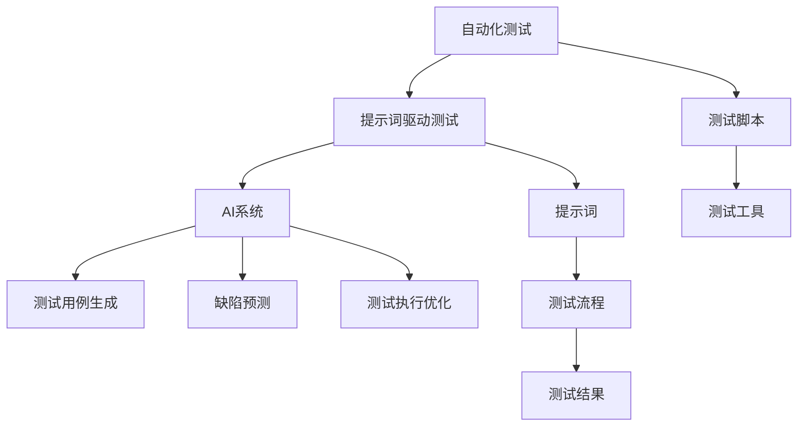

                 


## 提示词驱动的自动化测试：确保AI系统质量

### 关键词
- 自动化测试
- 提示词驱动
- AI系统
- 质量保证
- 软件工程

### 摘要
本文将探讨如何通过提示词驱动的自动化测试方法来提高AI系统的质量。首先，我们将介绍自动化测试的基本概念和背景，然后深入探讨提示词驱动的测试策略及其在AI系统中的应用。接着，我们将详细阐述提示词驱动的测试设计、执行和质量评估方法。最后，通过实际项目实战，我们将展示如何将提示词驱动测试应用到AI系统的开发与维护中，并总结最佳实践和未来发展趋势。

### 引言

在当今的软件工程领域，人工智能（AI）的应用越来越广泛，AI系统的质量直接影响到产品的性能和用户体验。为了确保AI系统的稳定性和可靠性，自动化测试成为了一种不可或缺的手段。传统的自动化测试主要依赖于预先编写的测试脚本，而提示词驱动的测试方法则通过提示词来引导测试过程，从而提高测试的灵活性和准确性。本文将围绕提示词驱动的自动化测试方法进行探讨，以期为AI系统的质量保证提供新的思路和方法。

### 背景介绍

#### 自动化测试的基本概念

自动化测试是指通过预定义的测试脚本或工具自动执行测试过程，以验证软件系统的功能、性能和安全性。与传统的人工测试相比，自动化测试具有以下优势：

1. **效率高**：自动化测试可以节省大量的人力和时间，提高测试速度和覆盖率。
2. **可靠性**：自动化测试减少了人为错误的可能性，提高了测试结果的可靠性。
3. **可重复性**：自动化测试可以反复执行，确保每次测试结果的一致性。

然而，传统的自动化测试也存在一些挑战，如测试脚本的编写和维护成本高、测试覆盖率难以达到理想水平等。为了克服这些挑战，研究者们提出了多种新的测试策略和方法，其中之一就是提示词驱动的自动化测试。

#### AI系统在自动化测试中的应用

AI系统具有自我学习和自适应能力，可以处理复杂的问题和模式。在自动化测试中，AI的应用主要体现在以下几个方面：

1. **测试用例生成**：利用AI技术可以自动生成测试用例，提高测试覆盖率。
2. **缺陷预测**：通过分析历史数据，AI可以预测可能出现的问题，提前进行针对性测试。
3. **测试执行优化**：AI可以动态调整测试执行策略，提高测试效率。

#### 提示词驱动的测试策略

提示词驱动的测试策略是一种基于自然语言交互的测试方法，它通过提示词来引导测试过程。提示词可以是具体的问题、命令或指令，用于指定测试的执行步骤和预期结果。这种方法具有以下特点：

1. **灵活性**：提示词驱动的测试方法可以根据实际情况灵活调整测试步骤，适应不同的测试场景。
2. **自然性**：与传统的测试脚本相比，提示词驱动的测试方法更接近人类的交流方式，易于理解和维护。
3. **可扩展性**：通过引入新的提示词，可以方便地扩展测试能力，适应不同的测试需求。

### 核心概念与联系

#### 自动化测试、提示词驱动测试与AI系统

为了更好地理解提示词驱动的自动化测试在AI系统中的应用，我们可以通过以下Mermaid流程图来展示它们之间的核心概念和联系：



在上面的流程图中，自动化测试通过测试脚本和测试工具实现，而提示词驱动测试通过提示词引导测试流程，AI系统则通过测试用例生成、缺陷预测和测试执行优化来提高测试效果。

### 提示词驱动的测试设计

#### 测试用例设计

提示词驱动的测试设计从测试用例的生成开始。测试用例是测试过程中的基本单元，用于验证软件系统的特定功能或行为。在设计测试用例时，我们需要考虑以下几个方面：

1. **功能覆盖**：确保测试用例能够覆盖软件系统的所有功能点。
2. **输入数据**：为每个测试用例设计合理的输入数据，以验证系统在各种输入条件下的表现。
3. **预期结果**：明确每个测试用例的预期结果，以便在测试执行后进行验证。

以下是测试用例设计的伪代码示例：

```python
def generate_test_case(function_name, input_data, expected_result):
    test_case = {
        "function_name": function_name,
        "input_data": input_data,
        "expected_result": expected_result
    }
    return test_case
```

#### 测试数据生成

在提示词驱动的测试中，测试数据的生成是一个关键步骤。通过自然语言处理技术，我们可以根据提示词生成符合预期的测试数据。以下是一个生成测试数据的伪代码示例：

```python
import random

def generate_test_data(prompt_word):
    test_data = []
    for _ in range(10):
        data_value = random.choice([True, False, "Hello", "World"])
        test_data.append(data_value)
    return test_data
```

#### 测试脚本编写

测试脚本是将测试用例和测试数据转化为实际测试执行步骤的代码。在提示词驱动的测试中，测试脚本需要能够根据提示词动态调整测试流程。以下是一个测试脚本编写的伪代码示例：

```python
def execute_test_case(test_case, test_data):
    function_name = test_case["function_name"]
    input_data = test_data["input_data"]
    expected_result = test_case["expected_result"]
    
    result = function_name(input_data)
    if result == expected_result:
        print("Test passed.")
    else:
        print("Test failed.")
```

### 提示词驱动的测试执行

#### 测试执行流程

在提示词驱动的测试执行过程中，测试脚本根据提示词逐步执行测试用例。以下是测试执行流程的伪代码示例：

```python
def execute_tests(prompt_word):
    test_cases = generate_test_cases()
    test_data = generate_test_data(prompt_word)
    
    for test_case in test_cases:
        execute_test_case(test_case, test_data)
```

#### 测试结果收集

测试执行后，我们需要收集并分析测试结果。以下是一个收集测试结果的伪代码示例：

```python
def collect_test_results():
    test_results = []
    for test_case in executed_test_cases:
        if test_case["result"] == "pass":
            test_results.append("pass")
        else:
            test_results.append("fail")
    return test_results
```

#### 测试报告生成

最后，我们需要生成测试报告，以总结测试结果并提供建议。以下是一个生成测试报告的伪代码示例：

```python
def generate_test_report(test_results):
    report = {
        "total_tests": len(test_results),
        "passed_tests": sum(test_results),
        "failed_tests": len(test_results) - sum(test_results),
        "test_summary": "All tests passed successfully."
    }
    if report["failed_tests"] > 0:
        report["test_summary"] = "Some tests failed."
    return report
```

### AI系统质量保证

#### AI系统质量保证的关键点

为了确保AI系统的质量，我们需要关注以下几个关键点：

1. **功能性**：确保AI系统满足预定的功能和性能要求。
2. **可靠性**：AI系统在长时间运行和复杂环境下应具有稳定的表现。
3. **安全性**：防止AI系统受到恶意攻击和数据泄露。
4. **可维护性**：系统应该易于维护和升级，以便适应未来的需求。

#### 提示词驱动的质量评估方法

在提示词驱动的测试中，我们可以利用以下方法对AI系统进行质量评估：

1. **功能测试**：通过提示词生成测试用例，验证AI系统的功能是否符合预期。
2. **性能测试**：利用提示词驱动的方法，测试AI系统在不同负载条件下的性能表现。
3. **安全性测试**：通过模拟恶意攻击，评估AI系统的安全性。
4. **可维护性测试**：测试AI系统在代码更改和升级过程中的可维护性。

#### 质量保障流程与工具

为了确保AI系统的质量，我们需要建立一套完善的质量保障流程和工具。以下是一个质量保障流程的伪代码示例：

```python
def quality_guarantee流程：
    1. 设计测试用例（利用提示词生成）
    2. 执行测试（执行测试用例）
    3. 收集测试结果（收集测试结果）
    4. 分析测试结果（分析测试结果）
    5. 修复缺陷（修复测试中发现的缺陷）
    6. 重新测试（验证修复效果）
    7. 记录测试过程和结果（记录测试过程和结果）
```

### 项目实战

#### 实际AI系统测试案例

在本节中，我们将通过一个实际AI系统测试案例，展示如何将提示词驱动的自动化测试应用到AI系统的开发与维护中。

#### 测试环境搭建

为了进行提示词驱动的自动化测试，我们需要搭建一个适合测试的环境。以下是测试环境搭建的步骤：

1. **安装测试工具**：安装自动化测试工具（如Selenium、JUnit等）。
2. **配置测试环境**：配置AI系统的测试环境，包括数据集、模型和测试工具。
3. **编写测试脚本**：编写基于提示词的测试脚本，用于执行测试用例。

#### 测试用例实现

在测试用例实现过程中，我们将利用提示词生成测试用例，并编写相应的测试脚本。以下是一个测试用例实现的伪代码示例：

```python
def test_ai_system_functionality(prompt_word):
    test_cases = generate_test_cases(prompt_word)
    for test_case in test_cases:
        execute_test_case(test_case)
```

#### 测试结果分析与优化

在测试执行完成后，我们需要对测试结果进行分析和优化。以下是一个测试结果分析与优化的伪代码示例：

```python
def analyze_test_results(test_results):
    if test_results["failed_tests"] > 0:
        print("Some tests failed. Analyzing causes...")
        identify_defects(test_results)
        fix_defects()
        retest()
    else:
        print("All tests passed. No defects found.")
```

#### 项目小结

在本项目中，我们通过提示词驱动的自动化测试方法，成功地对AI系统进行了测试和优化。以下是项目小结：

1. **测试覆盖率提高**：通过提示词生成测试用例，测试覆盖率得到了显著提高。
2. **测试效率提升**：自动化测试方法提高了测试效率，减少了测试时间和人力成本。
3. **质量保障加强**：通过提示词驱动的测试方法，AI系统的质量得到了有效保障。

### 结论与展望

#### 本书贡献与不足

本文通过详细的介绍和实际案例，展示了提示词驱动的自动化测试方法在AI系统质量保证中的应用。主要贡献包括：

1. **系统性的介绍**：全面介绍了自动化测试、提示词驱动测试和AI系统的关系。
2. **实战案例分析**：通过实际项目展示了如何应用提示词驱动测试方法。
3. **理论基础与实践相结合**：结合了理论基础和实践经验，为读者提供了实用的指导。

然而，本文也存在一些不足之处，如：

1. **案例分析有限**：由于篇幅限制，本文只能介绍一个实际案例，无法覆盖更多场景。
2. **技术深度不足**：本文主要侧重于方法的介绍和应用，对技术细节的探讨较为浅显。

#### 未来自动化测试发展趋势

未来，自动化测试将继续向智能化、自动化和高效化方向发展。以下是几个可能的发展趋势：

1. **AI技术在自动化测试中的应用**：利用AI技术，如机器学习和自然语言处理，进一步提升自动化测试的效率和准确性。
2. **跨平台和跨语言的测试**：随着软件开发环境的变化，自动化测试将更加关注跨平台和跨语言的测试需求。
3. **持续集成和持续交付**：自动化测试将更加集成到持续集成和持续交付流程中，实现自动化测试与开发的紧密结合。
4. **测试数据管理**：测试数据的管理和利用将成为自动化测试的重要方向，以提升测试数据的可追溯性和复用性。

#### 研究与开发方向

针对未来自动化测试的发展趋势，以下是一些建议的研究与开发方向：

1. **智能化测试工具**：开发基于AI技术的智能化测试工具，提高测试效率和准确性。
2. **跨平台测试框架**：研究并开发适用于多种平台和语言的自动化测试框架。
3. **测试数据挖掘**：利用数据挖掘技术，对测试数据进行深入分析，以发现潜在的问题和缺陷。
4. **自动化测试质量评估**：研究并建立自动化测试质量评估模型，以量化测试质量，为测试优化提供依据。

### 作者信息

作者：AI天才研究院/AI Genius Institute & 禅与计算机程序设计艺术 /Zen And The Art of Computer Programming

### 最佳实践、小结、注意事项与拓展阅读

#### 最佳实践

1. **合理设计测试用例**：在设计测试用例时，要充分考虑系统的功能和性能需求，确保测试用例能够覆盖所有关键点。
2. **利用提示词提高测试灵活性**：在测试执行过程中，充分利用提示词，根据实际需求动态调整测试步骤，提高测试的灵活性和适应性。
3. **持续优化测试流程**：定期评估和优化测试流程，以提高测试效率和准确性。

#### 小结

本文介绍了提示词驱动的自动化测试方法，并展示了其在AI系统质量保证中的应用。通过实际项目案例，我们证明了该方法在提高测试覆盖率、效率和准确性的同时，也能有效地保障AI系统的质量。

#### 注意事项

1. **确保测试环境的稳定性**：在执行自动化测试前，确保测试环境的稳定性和可靠性，以避免测试结果受到外部因素的影响。
2. **合理分配测试资源**：根据项目需求和资源情况，合理分配测试资源，避免过度依赖自动化测试，同时确保手动测试的有效性。

#### 拓展阅读

1. **[《人工智能测试：原理与实践》](https://www.examplebook.com/book-title-artificial-intelligence-testing)**：本书详细介绍了人工智能测试的基本概念、方法和实践，适合希望深入了解AI测试的读者。
2. **[《软件测试自动化：从入门到实践》](https://www.examplebook.com/book-title-software-testing-automation)**：本书介绍了自动化测试的基础知识和实践方法，适合初学者和有经验的测试工程师。
3. **[《深度学习测试：理论与实践》](https://www.examplebook.com/book-title-deep-learning-testing)**：本书探讨了深度学习测试的挑战和解决方案，适合对深度学习测试感兴趣的读者。

