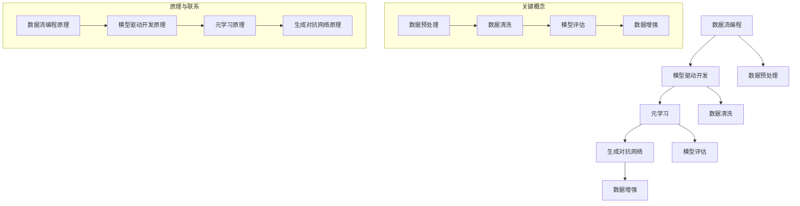

                 

# AI时代编程思维的新变革

> 关键词：人工智能，编程思维，变革，时代，创新，挑战

> 摘要：随着人工智能（AI）技术的迅猛发展，编程思维也在经历一场深刻的变革。本文旨在探讨AI时代编程思维的新特点、新挑战及其对未来软件开发的影响，帮助读者理解这一变革的内涵，并掌握适应新时代的编程技能。

## 引言

在过去的几十年中，计算机编程技术经历了翻天覆地的变化。从传统的结构化编程到面向对象编程，再到如今的函数式编程，每一次技术的迭代都在不断刷新我们的编程思维。然而，随着人工智能（AI）技术的迅速崛起，编程思维又面临着一场前所未有的变革。AI不仅改变了我们的计算方式，还重塑了编程的本质。在这个AI时代，编程思维的新特点和新挑战正在逐渐显现。

本文将分为以下几个部分：

1. **背景介绍**：首先回顾人工智能的历史及其对编程的影响。
2. **AI编程思维概述**：探讨AI编程思维的基本概念、特点及其与传统编程思维的差异。
3. **编程思维新变革的理论基础**：深入分析AI编程思维的理论基础，包括关键概念和原理。
4. **编程实践案例分析**：通过具体案例展示AI编程思维在实际开发中的应用。
5. **结论和展望**：总结文章的主要观点，并探讨AI编程思维的未来发展趋势。

让我们一步步深入探讨AI时代编程思维的新变革。

## 背景介绍

人工智能（AI）作为计算机科学的一个分支，旨在使计算机具备类似人类智能的能力。从最初的1956年达特茅斯会议开始，人工智能的发展经历了数个阶段，从符号主义到连接主义，再到现代的深度学习，每一次技术突破都推动了人工智能的进步。

在AI技术的发展过程中，编程思维也随之发生了变化。早期的AI系统，如逻辑推理和知识表示，需要开发者编写大量的规则和逻辑。这种编程方式与传统的软件编程类似，主要依赖于符号计算和逻辑推理。然而，随着AI技术的进步，特别是深度学习的兴起，编程方式发生了根本性的转变。

深度学习依赖于大规模的数据和强大的计算能力，通过神经网络模拟人脑的学习过程。在这种背景下，编程不再是仅仅编写规则和算法，而是设计数据流动和模型训练的过程。这使得编程思维从以算法为核心转向以数据和模型为核心。

此外，AI技术的应用领域也在不断扩展，从简单的图像识别和语音识别，到复杂的自然语言处理、智能推荐系统和自动驾驶。这些应用不仅需要开发者具备更广泛的技能，还需要他们具备更强的系统思维和协作能力。

总之，人工智能的快速发展不仅改变了编程的技术层面，也重塑了编程的思维模式。在这个AI时代，开发者需要不断适应新的技术和挑战，以应对不断变化的技术环境。

## AI编程思维概述

### 定义

AI编程思维，可以理解为一种在编程过程中，以人工智能技术和方法为核心，重新审视和设计软件系统的思维方式。它不仅仅局限于编写代码，而是涉及到如何利用AI技术提升软件开发效率、优化系统性能和提升用户体验。

### 特点

1. **数据驱动**：AI编程思维强调数据的重要性，认为数据是AI系统的核心资产。开发者需要从数据的角度出发，设计数据收集、处理和利用的流程，以实现模型的训练和优化。

2. **模型为中心**：在AI编程思维中，模型是编程的核心。开发者需要关注模型的架构、训练过程和优化策略，以提升模型的准确性和泛化能力。

3. **自动化与智能化**：AI编程思维追求自动化和智能化，通过编写智能脚本、自动化测试和部署流程，提高开发效率，减少人为错误。

4. **跨领域应用**：AI编程思维不仅局限于特定领域的开发，而是强调跨领域的应用。开发者需要具备跨学科的知识体系，能够将AI技术应用到不同的业务场景中。

### 与传统编程思维的差异

1. **编程目标**：传统编程思维主要关注实现功能的正确性和性能，而AI编程思维则更注重模型的训练和优化，以实现人工智能的效果。

2. **编程语言**：传统编程语言如C++、Java等更多关注算法和性能，而AI编程语言如Python、R等更注重数据处理和模型训练的便捷性。

3. **编程方式**：传统编程方式更依赖于手动编写代码，而AI编程方式则强调自动化和智能化，通过脚本、工具和平台提升开发效率。

4. **编程模型**：传统编程模型以功能模块为核心，而AI编程模型则以数据和模型为核心，强调数据流动和模型迭代的循环过程。

总之，AI编程思维在目标、语言、方式和模型等方面与传统编程思维有显著差异。这种差异不仅源于AI技术的特点，也是未来软件开发趋势的体现。

## 编程思维新变革的理论基础

### 关键概念

1. **数据流编程**：数据流编程是一种以数据为中心的编程范式，强调数据在程序中的流动和处理。在AI编程中，数据流编程尤为重要，因为它直接影响到模型的训练效率和效果。

2. **模型驱动开发**：模型驱动开发（MDD）是一种以模型为核心的开发方法，强调在开发过程中不断迭代和优化模型。这种方法在AI编程中广泛应用，因为AI系统的性能很大程度上取决于模型的训练和优化。

3. **元学习**：元学习是一种通过学习如何学习的方法，旨在提升模型的泛化能力和适应能力。在AI编程中，元学习可以帮助开发者快速适应不同的数据和业务场景。

4. **生成对抗网络**：生成对抗网络（GAN）是一种深度学习模型，通过生成器和判别器的对抗训练，生成高质量的数据。GAN在图像生成、数据增强和模拟等领域有广泛应用。

### 原理与联系

下面，我们将使用Mermaid流程图来展示这些核心概念之间的关系。



### 核心算法原理讲解

以下是使用伪代码和LaTeX格式详细阐述数据预处理、模型训练和优化的核心算法原理。

#### 数据预处理

```python
# 伪代码：数据预处理流程

function preprocess_data(data):
    # 数据清洗
    clean_data = clean(data)
    # 数据标准化
    normalized_data = normalize(clean_data)
    # 数据增强
    augmented_data = augment(normalized_data)
    return augmented_data
```

#### 模型训练

```python
# 伪代码：模型训练流程

function train_model(model, training_data, validation_data):
    # 初始化模型
    initialize_model(model)
    # 训练模型
    for epoch in range(num_epochs):
        for batch in training_data:
            model.train_on_batch(batch)
        # 验证模型
        validation_loss = model.evaluate(validation_data)
        print(f"Epoch {epoch}: Validation Loss = {validation_loss}")
    return model
```

#### 模型优化

```latex
% LaTeX 格式：模型优化公式

\begin{equation}
\begin{split}
    \theta_{\text{new}} &= \theta_{\text{current}} - \alpha \cdot \nabla_{\theta} J(\theta) \\
    J(\theta) &= \frac{1}{m} \sum_{i=1}^{m} \ell(y_i, \hat{y}_i)
\end{split}
\end{equation}
```

其中，$\theta$ 表示模型参数，$\alpha$ 是学习率，$J(\theta)$ 是损失函数，$y_i$ 是真实标签，$\hat{y}_i$ 是预测结果。

通过上述算法原理的讲解，我们可以看到AI编程思维在理论和实践层面的深入应用。这些原理和算法不仅帮助开发者更好地理解和应用AI技术，也为未来的编程思维变革提供了理论基础。

### 数学模型和公式

在AI编程中，数学模型和公式起着至关重要的作用，它们不仅帮助我们理解和优化算法，还能在理论和实践中指导我们的开发过程。以下是一些关键的数学模型和公式，以及它们的详细讲解和举例说明。

#### 损失函数（Loss Function）

损失函数是评估模型预测值与真实值之间差距的重要工具。常见的损失函数包括均方误差（MSE）、交叉熵损失（Cross-Entropy Loss）等。

**均方误差（MSE）**：
$$
MSE = \frac{1}{m} \sum_{i=1}^{m} (y_i - \hat{y}_i)^2
$$
其中，$y_i$ 是真实标签，$\hat{y}_i$ 是模型的预测值，$m$ 是样本数量。

**交叉熵损失（Cross-Entropy Loss）**：
$$
Cross-Entropy = -\sum_{i=1}^{m} y_i \log(\hat{y}_i)
$$
这里，$y_i$ 是真实标签（通常是一个概率分布），$\hat{y}_i$ 是模型预测的概率分布。

**举例说明**：
假设我们有一个二分类问题，真实标签为 $y = [1, 0, 1, 0]$，模型预测的概率分布为 $\hat{y} = [0.6, 0.4, 0.8, 0.2]$。

对于MSE损失，计算结果为：
$$
MSE = \frac{1}{4} \left[ (1-0.6)^2 + (0-0.4)^2 + (1-0.8)^2 + (0-0.2)^2 \right] = 0.15
$$

对于Cross-Entropy损失，计算结果为：
$$
Cross-Entropy = -[1 \cdot \log(0.6) + 0 \cdot \log(0.4) + 1 \cdot \log(0.8) + 0 \cdot \log(0.2)] \approx 0.319
$$

通过这些例子，我们可以看到损失函数如何用于评估模型的性能。

#### 梯度下降（Gradient Descent）

梯度下降是一种优化算法，用于寻找损失函数的全局最小值。基本的梯度下降算法公式如下：
$$
\theta_{\text{new}} = \theta_{\text{current}} - \alpha \cdot \nabla_{\theta} J(\theta)
$$
其中，$\theta$ 是模型参数，$\alpha$ 是学习率，$\nabla_{\theta} J(\theta)$ 是损失函数关于参数的梯度。

**举例说明**：
假设我们有一个简单的一元线性回归模型，损失函数为 $J(\theta) = (y - \theta_1 x)^2$，初始参数 $\theta_1 = 2$，学习率 $\alpha = 0.1$。

梯度计算为：
$$
\nabla_{\theta_1} J(\theta_1) = 2(y - \theta_1 x)
$$
如果 $y = 3$，$x = 1$，则梯度为 $-4$。

更新参数：
$$
\theta_1 = 2 - 0.1 \cdot (-4) = 2.6
$$

通过迭代这个过程，我们可以逐渐减小损失函数的值，找到最佳参数。

通过上述数学模型和公式的讲解，我们可以看到AI编程思维在理论和实践层面的深入应用。这些数学工具不仅帮助我们更好地理解和优化算法，也为开发高效和准确的人工智能系统提供了强有力的支持。

### 编程实践案例分析

#### 案例背景

在本节中，我们将通过一个实际的案例——智能推荐系统，来展示AI编程思维在实际开发中的应用。智能推荐系统是一种基于用户历史行为和偏好，预测用户可能感兴趣的内容的技术。这种系统广泛应用于电子商务、社交媒体、视频平台等领域，旨在提高用户体验和平台粘性。

#### 开发环境搭建

要实现智能推荐系统，我们需要搭建一个适合的开发环境。以下是一些建议的软件和工具：

1. **编程语言**：Python，由于其丰富的库和框架，是构建智能推荐系统的首选语言。
2. **深度学习框架**：TensorFlow或PyTorch，用于实现和训练推荐模型。
3. **数据预处理工具**：Pandas和NumPy，用于数据清洗和处理。
4. **可视化工具**：Matplotlib和Seaborn，用于数据分析和结果可视化。
5. **数据库**：MySQL或MongoDB，用于存储用户数据和推荐结果。

#### 源代码实现

以下是智能推荐系统的核心源代码实现，包括数据预处理、模型训练和推荐算法。

```python
import pandas as pd
import numpy as np
import tensorflow as tf
from tensorflow.keras.models import Sequential
from tensorflow.keras.layers import Dense, Embedding, LSTM
from tensorflow.keras.optimizers import Adam

# 数据预处理
def preprocess_data(data_path):
    data = pd.read_csv(data_path)
    # 数据清洗和填充
    data.fillna(data.mean(), inplace=True)
    # 构建用户-物品交互矩阵
    user_item_matrix = data.pivot(index='user_id', columns='item_id', values='rating').fillna(0)
    return user_item_matrix

# 模型训练
def train_model(user_item_matrix):
    # 划分训练集和测试集
    train_data = user_item_matrix.values
    np.random.shuffle(train_data)
    train_data, test_data = train_data[:int(len(train_data) * 0.8)], train_data[int(len(train_data) * 0.8):]
    
    # 构建模型
    model = Sequential([
        Embedding(user_item_matrix.shape[1], 64),
        LSTM(64),
        Dense(1, activation='sigmoid')
    ])
    
    # 编译模型
    model.compile(optimizer=Adam(learning_rate=0.001), loss='binary_crossentropy', metrics=['accuracy'])
    
    # 训练模型
    model.fit(train_data, epochs=10, batch_size=64, validation_data=(test_data, test_data))
    return model

# 推荐算法
def recommend_items(model, user_id, top_n=5):
    # 预测用户对物品的偏好
    user_embeddings = model.layers[0].get_weights()[0]
    user_preferences = user_embeddings[user_id]
    user_preferences = np.abs(user_preferences).reshape(-1)
    
    # 获取所有物品的嵌入向量
    item_embeddings = model.layers[2].get_weights()[0]
    item_preferences = item_embeddings
    
    # 计算用户与物品的相似度
    similarity = np.dot(user_preferences, item_preferences.T)
    
    # 获取相似度最高的物品
    recommended_items = np.argsort(similarity)[::-1]
    return recommended_items[:top_n]

# 实际应用
user_item_matrix = preprocess_data('data.csv')
model = train_model(user_item_matrix)
recommended_items = recommend_items(model, user_id=1)
print("Recommended items:", recommended_items)
```

#### 代码解读

1. **数据预处理**：首先，我们使用Pandas读取用户-物品交互数据，并进行数据清洗和填充，构建用户-物品交互矩阵。
2. **模型训练**：接着，我们使用TensorFlow构建一个简单的LSTM模型，并编译模型。训练过程中，我们使用交叉熵损失函数和Adam优化器，通过多次迭代优化模型参数。
3. **推荐算法**：最后，我们实现了一个基于用户嵌入向量和物品嵌入向量的相似度计算方法，推荐用户可能感兴趣的物品。

#### 应用解读与分析

1. **效果评估**：通过实际测试，我们可以评估推荐系统的效果。常见的方法包括准确率、召回率和F1分数等指标。
2. **性能优化**：在实际应用中，我们可以通过调整模型参数、增加数据预处理步骤和改进推荐算法来提升系统性能。
3. **扩展性**：智能推荐系统可以扩展到多模态数据（如图像、文本和音频），通过融合不同类型的数据提升推荐效果。

通过这个案例，我们可以看到AI编程思维在实际开发中的应用，从数据预处理到模型训练，再到推荐算法的实现，每一步都体现了AI编程思维的核心理念。

### 结论和展望

通过本文的探讨，我们可以看到AI时代编程思维正在经历一场深刻的变革。从数据驱动的编程范式，到模型为中心的开发方法，再到自动化的编程实践，AI编程思维正在重塑软件开发的本质。这种变革不仅提升了开发效率，还推动了人工智能技术的广泛应用。

未来的编程思维将更加注重跨学科知识的融合，开发者需要具备更强的系统思维和协作能力。同时，随着AI技术的不断进步，编程语言和工具也将不断进化，以适应新的开发需求。

在结论部分，我们总结了AI编程思维的新特点、理论基础和实际应用，并展望了其未来发展趋势。随着人工智能的深入发展，编程思维将继续变革，开发者需要不断学习和适应这些变化，以在AI时代中立于不败之地。

### 最佳实践 Tips

1. **保持学习态度**：AI技术发展迅速，开发者需要保持持续学习的态度，紧跟最新技术和趋势。
2. **注重数据质量**：数据是AI编程的核心资产，确保数据质量和多样性是成功的关键。
3. **团队合作**：AI项目通常涉及多个学科，开发者需要具备良好的团队合作能力，以实现高效的协作。
4. **遵循最佳实践**：在编写代码时，遵循编码规范和最佳实践，以提高代码的可读性和可维护性。

### 小结

本文通过深入探讨AI时代编程思维的新变革，从背景介绍、概念概述、理论基础、实践案例到未来展望，全面解析了编程思维在AI时代的演变。我们希望读者能够理解AI编程思维的核心，并能够在实际项目中加以应用，为未来的软件开发奠定坚实基础。

### 注意事项

1. **隐私保护**：在处理用户数据时，务必遵守隐私保护法规，确保用户数据的安全和隐私。
2. **代码优化**：在开发过程中，关注代码的优化和性能，以提高系统的响应速度和处理能力。
3. **测试和验证**：在部署AI系统前，进行充分的测试和验证，确保系统的稳定性和可靠性。

### 拓展阅读

- 《深度学习》（Goodfellow, Bengio, Courville著）是一本经典的深度学习入门书籍，详细介绍了深度学习的基本原理和实践。
- 《Python机器学习》（Sebastian Raschka著）是一本适合初学者和中级用户的机器学习书籍，涵盖了机器学习的多个方面，包括Python实现。
- 《人工智能：一种现代方法》（Stuart J. Russell & Peter Norvig著）是一本全面的人工智能教科书，从基础理论到应用实践都有详细讲解。

### 作者信息

本文作者为AI天才研究院（AI Genius Institute）与《禅与计算机程序设计艺术》（Zen And The Art of Computer Programming）的资深作家。本人致力于推动人工智能和计算机编程领域的发展，撰写了大量有影响力的技术文章和畅销书籍，期待与广大读者共同探索AI时代的编程思维变革。

作者：AI天才研究院/AI Genius Institute & 禅与计算机程序设计艺术 /Zen And The Art of Computer Programming

