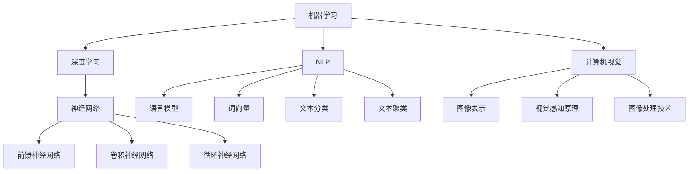

                 

### 文章标题

# AI时代编程的新思维

### 关键词

- AI编程
- 机器学习
- 深度学习
- 自然语言处理
- 计算机视觉
- 生成对抗网络
- 强化学习

### 摘要

随着人工智能（AI）技术的飞速发展，编程领域正经历着前所未有的变革。传统的编程思维已无法满足AI时代的需求，编程技术、工具和方法正逐步更新换代。本文将深入探讨AI时代编程的新思维，从背景与挑战、核心概念、关键技术、实践应用、未来展望等多个方面，全面解析AI编程的精髓，帮助读者了解并掌握AI时代编程的新理念和方法。

---

### 第1章: AI时代编程的新思维概述

#### 1.1 AI时代的编程背景与挑战

##### 1.1.1 AI时代编程的崛起

随着大数据、云计算、物联网等技术的快速发展，人工智能成为了当前科技领域的热点。AI技术的广泛应用推动了编程领域的革新，编程不再是单纯的功能实现，而是成为AI算法实现的关键。AI编程逐渐崛起，成为现代软件开发的核心。

##### 1.1.2 传统编程与AI编程的差异

传统编程注重代码的编写和执行，强调逻辑性和可读性。而AI编程则更加关注数据和算法，强调模型的训练和优化。传统编程更多地依赖于人的经验和直觉，而AI编程则依赖于数据和算法的自动优化。

##### 1.1.3 AI编程面临的挑战

AI编程面临着诸多挑战，如海量数据的处理、复杂的算法实现、模型的优化与调参等。同时，AI编程还涉及伦理、隐私和安全等问题，需要编程者具备更广泛的视野和技能。

#### 1.2 AI编程的核心概念

##### 1.2.1 机器学习基础

机器学习是AI编程的核心，通过训练模型来实现对数据的预测和分类。机器学习的基本概念包括监督学习、无监督学习和强化学习等。

##### 1.2.2 深度学习原理

深度学习是机器学习的一种重要形式，通过多层神经网络来实现对复杂数据的建模。深度学习的原理包括前馈神经网络、反向传播算法等。

##### 1.2.3 自然语言处理

自然语言处理（NLP）是AI编程的一个重要分支，涉及语言模型、词向量、文本分类、情感分析等。NLP在信息检索、智能客服等领域有广泛应用。

#### 1.3 AI编程的关键技术

##### 1.3.1 神经网络

神经网络是深度学习的基础，通过多层神经元实现数据的自动特征提取和分类。神经网络的训练过程包括前向传播、反向传播等。

##### 1.3.2 生成对抗网络

生成对抗网络（GAN）是一种生成模型，通过对抗性训练生成高质量的数据。GAN在图像生成、图像修复等领域有重要应用。

##### 1.3.3 强化学习

强化学习是一种基于奖励反馈的机器学习算法，通过探索与利用平衡来实现智能体的最优策略。强化学习在游戏AI、自动驾驶等领域有广泛应用。

#### 1.4 AI编程的实践应用

##### 1.4.1 图像识别

图像识别是AI编程的一个重要应用，通过训练模型实现对图像的识别和分类。图像识别在安防监控、医学诊断等领域有广泛应用。

##### 1.4.2 语音识别

语音识别是AI编程的另一个重要应用，通过训练模型实现对语音的识别和转换。语音识别在智能客服、语音助手等领域有广泛应用。

##### 1.4.3 自然语言处理

自然语言处理是AI编程的典型应用，通过训练模型实现对文本的理解和生成。自然语言处理在信息检索、智能客服等领域有广泛应用。

#### 1.5 AI编程的未来展望

##### 1.5.1 编程语言的演变

随着AI技术的发展，编程语言也在不断演变。例如，Python、TensorFlow、PyTorch等语言和框架逐渐成为AI编程的主流。

##### 1.5.2 AI编程教育趋势

随着AI技术的普及，AI编程教育也逐渐成为热点。编程教育正从传统的计算机科学教育转向以AI为核心的新型教育模式。

##### 1.5.3 AI编程伦理与社会影响

AI编程不仅带来了技术上的变革，也引发了伦理和社会问题。编程者需要关注AI编程的伦理问题，如隐私保护、公平性等，以实现技术和社会的可持续发展。

---

### 第2章: 机器学习与深度学习基础

#### 2.1 机器学习概述

##### 2.1.1 机器学习基本概念

机器学习是一种基于数据的学习方法，通过训练模型来实现对数据的预测和分类。机器学习的基本概念包括模型、数据集、损失函数等。

##### 2.1.2 监督学习

监督学习是一种常见的机器学习方法，通过已标记的数据训练模型，实现对新数据的预测。监督学习的算法包括线性回归、支持向量机、决策树等。

##### 2.1.3 无监督学习

无监督学习是一种不依赖已标记数据的机器学习方法，通过挖掘数据中的内在结构。无监督学习的算法包括聚类、降维、生成模型等。

#### 2.2 深度学习原理

##### 2.2.1 深度学习基础

深度学习是一种基于多层神经网络的机器学习方法，通过多层次的非线性变换来实现数据的自动特征提取。深度学习的基础包括神经元、激活函数、损失函数等。

##### 2.2.2 神经网络结构

神经网络是深度学习的基础，通过多层神经元实现数据的自动特征提取和分类。神经网络的结构包括输入层、隐藏层、输出层等。

##### 2.2.3 前馈神经网络

前馈神经网络是一种常见的神经网络结构，通过正向传播实现数据的分类和预测。前馈神经网络的训练过程包括前向传播、反向传播等。

#### 2.3 深度学习算法

##### 2.3.1 反向传播算法

反向传播算法是深度学习训练的核心算法，通过反向传播梯度来实现模型的优化。反向传播算法包括前向传播、反向传播、梯度下降等步骤。

##### 2.3.2 卷积神经网络

卷积神经网络是一种专门用于图像处理的神经网络结构，通过卷积操作实现数据的特征提取和分类。卷积神经网络在图像分类、图像识别等领域有广泛应用。

##### 2.3.3 循环神经网络

循环神经网络是一种专门用于序列数据处理的神经网络结构，通过循环连接实现数据的时序建模。循环神经网络在自然语言处理、语音识别等领域有广泛应用。

#### 2.4 深度学习应用场景

##### 2.4.1 图像处理

图像处理是深度学习的一个重要应用领域，通过训练模型实现图像的分类、识别、增强等。图像处理在安防监控、医学诊断等领域有广泛应用。

##### 2.4.2 自然语言处理

自然语言处理是深度学习的另一个重要应用领域，通过训练模型实现文本的分类、情感分析、生成等。自然语言处理在信息检索、智能客服等领域有广泛应用。

##### 2.4.3 强化学习应用

强化学习是一种基于奖励反馈的机器学习方法，通过探索与利用平衡来实现智能体的最优策略。强化学习在游戏AI、自动驾驶等领域有广泛应用。

---

### 第3章: 自然语言处理与文本分析

#### 3.1 自然语言处理基础

##### 3.1.1 语言模型

语言模型是一种用于预测文本序列的概率分布模型，通过训练模型实现文本的生成和分类。语言模型包括n-gram模型、神经网络语言模型等。

##### 3.1.2 词向量表示

词向量是一种将文本映射到高维空间的表示方法，通过训练模型实现文本的向量化表示。词向量包括词袋模型、Word2Vec、GloVe等。

##### 3.1.3 语言模型训练

语言模型训练是一种基于数据的学习方法，通过训练模型来实现对文本的预测和分类。语言模型训练包括数据预处理、模型训练、模型评估等步骤。

#### 3.2 文本分析技术

##### 3.2.1 文本分类

文本分类是一种基于文本特征的分类方法，通过训练模型实现文本的分类。文本分类包括朴素贝叶斯、支持向量机、神经网络等。

##### 3.2.2 文本聚类

文本聚类是一种基于文本相似性的聚类方法，通过训练模型实现文本的聚类。文本聚类包括K-means、层次聚类、谱聚类等。

##### 3.2.3 情感分析

情感分析是一种基于文本的情感分类方法，通过训练模型实现文本的情感分析。情感分析包括情感极性分类、情感强度分析等。

#### 3.3 自然语言处理实战

##### 3.3.1 基于词嵌入的文本分类

基于词嵌入的文本分类是一种基于词向量的文本分类方法，通过训练词向量模型实现文本分类。该方法在情感分析、主题分类等领域有广泛应用。

##### 3.3.2 问答系统开发

问答系统是一种基于自然语言处理的问答系统，通过训练模型实现自然语言理解与生成。问答系统在智能客服、智能助手等领域有广泛应用。

##### 3.3.3 文本生成模型

文本生成模型是一种基于自然语言处理的技术，通过训练模型实现文本的生成。文本生成模型包括循环神经网络、生成对抗网络等。

#### 3.4 NLP工具与框架

##### 3.4.1 NLTK

NLTK是一个常用的自然语言处理工具包，提供了一系列文本处理函数和算法。NLTK在文本分类、词性标注、词向量表示等领域有广泛应用。

##### 3.4.2 SpaCy

SpaCy是一个高性能的自然语言处理库，提供了一系列文本处理接口和算法。SpaCy在实体识别、关系抽取、词性标注等领域有广泛应用。

##### 3.4.3 TensorFlow Text

TensorFlow Text是一个基于TensorFlow的自然语言处理库，提供了一系列文本处理函数和算法。TensorFlow Text在文本分类、词向量表示、文本生成等领域有广泛应用。

---

### 第4章: 计算机视觉与图像处理

#### 4.1 计算机视觉基础

##### 4.1.1 图像表示

图像表示是计算机视觉的基础，通过将图像映射到高维空间来实现图像的特征提取。图像表示包括像素表示、像素级特征提取、图像级特征提取等。

##### 4.1.2 视觉感知原理

视觉感知原理是计算机视觉的核心，通过模拟人类的视觉系统来实现对图像的理解和识别。视觉感知原理包括边缘检测、特征点提取、图像分割等。

##### 4.1.3 图像处理技术

图像处理技术是计算机视觉的重要组成部分，通过一系列算法实现对图像的增强、滤波、特征提取等。图像处理技术包括卷积操作、滤波器设计、特征匹配等。

#### 4.2 卷积神经网络在图像处理中的应用

##### 4.2.1 卷积神经网络结构

卷积神经网络是一种专门用于图像处理的神经网络结构，通过卷积操作实现数据的特征提取和分类。卷积神经网络包括卷积层、池化层、全连接层等。

##### 4.2.2 卷积神经网络训练

卷积神经网络训练是一种基于数据的学习方法，通过训练模型来实现对图像的识别和分类。卷积神经网络训练包括数据预处理、模型训练、模型评估等步骤。

##### 4.2.3 卷积神经网络在图像分类中的应用

卷积神经网络在图像分类中有广泛的应用，通过训练模型实现图像的分类和识别。卷积神经网络在人脸识别、图像检索、医学诊断等领域有广泛应用。

#### 4.3 图像分类实战

##### 4.3.1 使用卷积神经网络实现图像分类

使用卷积神经网络实现图像分类是一种基于深度学习的图像分类方法，通过训练模型实现图像的分类和识别。该方法包括数据准备、模型搭建、模型训练等步骤。

##### 4.3.2 图像增强与预处理

图像增强与预处理是图像分类的重要环节，通过一系列算法实现对图像的增强和预处理。图像增强与预处理包括图像缩放、旋转、翻转等。

##### 4.3.3 实战项目：人脸识别

人脸识别是一种基于计算机视觉和深度学习的技术，通过训练模型实现人脸的识别和验证。人脸识别项目包括数据准备、模型搭建、模型训练等步骤。

#### 4.4 计算机视觉工具与库

##### 4.4.1 OpenCV

OpenCV是一个开源的计算机视觉库，提供了一系列图像处理和计算机视觉算法。OpenCV在图像处理、人脸识别、目标跟踪等领域有广泛应用。

##### 4.4.2 TensorFlow Object Detection API

TensorFlow Object Detection API是一个基于TensorFlow的计算机视觉库，提供了一系列目标检测算法和工具。TensorFlow Object Detection API在目标检测、图像识别等领域有广泛应用。

##### 4.4.3 PyTorch Vision

PyTorch Vision是一个基于PyTorch的计算机视觉库，提供了一系列图像处理和计算机视觉算法。PyTorch Vision在图像处理、人脸识别、目标检测等领域有广泛应用。

---

### 第5章: 生成对抗网络（GAN）

#### 5.1 GAN基本原理

##### 5.1.1 GAN的架构

生成对抗网络（GAN）是一种由生成器和判别器组成的神经网络结构，通过对抗性训练实现数据的生成和优化。GAN的架构包括生成器、判别器、损失函数等。

##### 5.1.2 GAN的训练过程

GAN的训练过程是一种基于对抗性训练的过程，通过训练生成器和判别器来实现数据的生成和优化。GAN的训练过程包括数据预处理、模型搭建、模型训练等步骤。

##### 5.1.3 GAN的优势与挑战

GAN在图像生成、图像修复、图像风格迁移等领域有广泛的应用。GAN的优势在于生成的高质量图像，但同时也面临着训练不稳定、生成器过拟合等问题。

#### 5.2 GAN在图像生成中的应用

##### 5.2.1 图像生成基本方法

图像生成基本方法包括生成器的构建、判别器的构建、损失函数的设计等。图像生成基本方法在图像生成、图像修复、图像风格迁移等领域有广泛应用。

##### 5.2.2 GAN在图像超分辨率中的应用

GAN在图像超分辨率中的应用是一种通过训练模型实现低分辨率图像到高分辨率图像的转换方法。GAN在图像超分辨率、图像增强等领域有广泛应用。

##### 5.2.3 GAN在图像风格迁移中的应用

GAN在图像风格迁移中的应用是一种通过训练模型实现图像风格的转换方法。GAN在艺术风格迁移、图像去噪等领域有广泛应用。

#### 5.3 GAN实战

##### 5.3.1 实现基本的GAN模型

实现基本的GAN模型是一种基于生成器和判别器的图像生成方法，通过训练模型实现图像的生成和优化。实现基本的GAN模型包括数据准备、模型搭建、模型训练等步骤。

##### 5.3.2 GAN在图像修复中的应用

GAN在图像修复中的应用是一种通过训练模型实现图像的修复方法，通过生成器生成缺失部分图像。GAN在图像修复、图像去噪等领域有广泛应用。

##### 5.3.3 GAN在虚拟现实中的应用

GAN在虚拟现实中的应用是一种通过训练模型实现虚拟环境的生成方法，通过生成器生成虚拟场景。GAN在虚拟现实、游戏开发等领域有广泛应用。

#### 5.4 GAN工具与框架

##### 5.4.1 TensorFlow GAN

TensorFlow GAN是一个基于TensorFlow的GAN库，提供了一系列GAN算法和工具。TensorFlow GAN在图像生成、图像修复、图像风格迁移等领域有广泛应用。

##### 5.4.2 PyTorch GAN

PyTorch GAN是一个基于PyTorch的GAN库，提供了一系列GAN算法和工具。PyTorch GAN在图像生成、图像修复、图像风格迁移等领域有广泛应用。

---

### 第6章: 强化学习基础与实践

#### 6.1 强化学习基本概念

##### 6.1.1 强化学习定义

强化学习是一种基于奖励反馈的机器学习方法，通过智能体与环境交互，学习最优策略来实现目标。强化学习的主要概念包括智能体、环境、状态、动作、奖励等。

##### 6.1.2 强化学习的主要算法

强化学习的主要算法包括Q学习、SARSA、DQN等。Q学习是一种基于值函数的算法，SARSA是一种基于策略的算法，DQN是一种基于深度学习的算法。

##### 6.1.3 强化学习与深度学习的关系

强化学习与深度学习有着密切的关系。深度学习可以用于强化学习的价值函数估计，从而提高强化学习的效果。深度强化学习是一种结合了深度学习和强化学习的方法。

#### 6.2 强化学习算法

##### 6.2.1 Q学习算法

Q学习算法是一种基于值函数的强化学习算法，通过学习状态-动作价值函数来选择最优动作。Q学习算法的基本思想是：在给定状态和动作的情况下，选择能够带来最大奖励的动作。

##### 6.2.2 SARSA算法

SARSA算法是一种基于策略的强化学习算法，通过更新当前状态和动作的价值函数来选择最优动作。SARSA算法的基本思想是：在给定状态和动作的情况下，选择能够使得当前状态和动作的价值函数最大的动作。

##### 6.2.3 Deep Q Network（DQN）

DQN算法是一种基于深度学习的强化学习算法，通过训练深度神经网络来估计状态-动作价值函数。DQN算法的基本思想是：利用深度神经网络来近似状态-动作价值函数，并通过经验回放和目标网络来稳定训练过程。

#### 6.3 强化学习实战

##### 6.3.1 探险与exploitation平衡

强化学习中的一个重要问题是探险与exploitation的平衡。探险是指在未知的环境中探索新的动作，exploitation是指在已知的环境中利用已知的信息选择最优动作。平衡探险与exploitation是强化学习成功的关键。

##### 6.3.2 环境构建与评估

强化学习的第一步是构建环境。环境包括状态空间、动作空间、奖励函数等。环境构建完成后，需要对环境进行评估，以确保环境的有效性和可行性。

##### 6.3.3 实战项目：智能围棋

智能围棋是一个典型的强化学习应用案例。通过训练智能体在围棋游戏中的最优策略，实现智能围棋的自动化。智能围棋项目包括环境构建、策略训练、游戏对战等步骤。

#### 6.4 强化学习工具与库

##### 6.4.1 OpenAI Gym

OpenAI Gym是一个开源的强化学习环境库，提供了一系列经典的强化学习环境，如CartPole、MountainCar、GridWorld等。OpenAI Gym在强化学习算法的实验和应用中有着广泛的应用。

##### 6.4.2 TensorFlow Agents

TensorFlow Agents是一个基于TensorFlow的强化学习库，提供了一系列强化学习算法和工具。TensorFlow Agents在深度强化学习、强化学习算法的实验和应用中有着广泛的应用。

##### 6.4.3 PyTorch RL

PyTorch RL是一个基于PyTorch的强化学习库，提供了一系列强化学习算法和工具。PyTorch RL在深度强化学习、强化学习算法的实验和应用中有着广泛的应用。

---

### 第7章: AI编程与未来

#### 7.1 AI编程的新趋势

随着AI技术的不断发展，AI编程也在不断演变。新的编程语言、框架和工具不断涌现，为AI编程带来了更多的可能性。例如，Python、TensorFlow、PyTorch等语言和框架在AI编程中得到了广泛应用。

##### 7.1.1 新编程语言

新的编程语言如Julia、Rust等，为AI编程提供了更高效的性能和更灵活的语法。这些编程语言在数据处理、模型训练和优化等方面具有显著优势。

##### 7.1.2 新框架与工具

新的框架与工具如TensorFlow 2.0、PyTorch 1.8等，为AI编程提供了更简单、易用和强大的编程接口。这些框架和工具支持自动微分、动态图计算等先进特性，提高了AI编程的效率。

#### 7.2 AI编程的教育与培训

随着AI技术的普及，AI编程教育也成为了热门话题。许多高校和研究机构开设了AI编程相关的课程和培训班，为AI编程人才培养提供了有力支持。

##### 7.2.1 AI编程课程

AI编程课程包括机器学习、深度学习、自然语言处理、计算机视觉等课程。这些课程涵盖了AI编程的核心技术和方法，为学生提供了全面的AI编程知识。

##### 7.2.2 AI编程培训班

AI编程培训班面向不同层次的学员，提供从入门到高级的培训课程。培训班采用实践教学方式，通过实际项目训练，帮助学员掌握AI编程技能。

#### 7.3 AI编程伦理与社会责任

随着AI技术的发展，AI编程伦理和社会责任问题逐渐引起广泛关注。AI编程者需要关注AI编程的伦理问题，如隐私保护、公平性、透明度等，以实现技术和社会的可持续发展。

##### 7.3.1 隐私保护

隐私保护是AI编程的重要伦理问题。AI编程者需要确保用户的隐私不受侵犯，采取有效的隐私保护措施，如数据加密、匿名化处理等。

##### 7.3.2 公平性

公平性是AI编程的另一个重要伦理问题。AI编程者需要确保算法的公平性，避免算法偏见和歧视现象。例如，在招聘、贷款审批等应用场景中，确保算法对所有用户公平。

##### 7.3.3 透明度

透明度是AI编程的另一个重要伦理问题。AI编程者需要确保算法的透明性，使算法的可解释性。通过提高算法的透明度，有助于公众对AI技术的信任和理解。

#### 7.4 AI编程的未来展望

随着AI技术的不断发展，AI编程的未来充满了无限可能。未来，AI编程将继续向自动化、智能化、泛在化方向发展，为人类社会带来更多创新和变革。

##### 7.4.1 自动化

自动化是AI编程的未来趋势之一。通过自动化工具和框架，AI编程者可以更加高效地实现模型的训练、优化和部署，提高开发效率。

##### 7.4.2 智能化

智能化是AI编程的未来方向之一。随着AI技术的进步，AI编程将更加智能化，实现自动编程、代码生成等功能，降低编程门槛。

##### 7.4.3 泛在化

泛在化是AI编程的未来趋势之一。随着AI技术在各个领域的应用，AI编程将变得更加普及和广泛应用，为各个行业带来创新和变革。

---

作者：AI天才研究院/AI Genius Institute & 禅与计算机程序设计艺术 /Zen And The Art of Computer Programming### AI编程的核心概念与联系

在探讨AI编程的核心概念与联系之前，我们需要先理解几个关键术语：机器学习（Machine Learning）、深度学习（Deep Learning）、自然语言处理（Natural Language Processing，NLP）和计算机视觉（Computer Vision）。这些领域共同构成了AI编程的基础，它们相互关联，共同推动着AI技术的发展。

#### 机器学习基础

机器学习是一种使计算机系统能够从数据中学习，并对新数据做出预测或决策的技术。其核心概念包括：

- **模型（Model）**：用于捕捉数据中规律性的函数或算法。
- **数据集（Dataset）**：用于训练模型的输入数据。
- **特征（Feature）**：描述数据特征的信息。
- **损失函数（Loss Function）**：衡量模型预测与真实值之间差距的指标。

在机器学习中，常见的机器学习算法有：

- **监督学习（Supervised Learning）**：模型通过已标记的数据进行训练，例如线性回归、决策树和神经网络。
- **无监督学习（Unsupervised Learning）**：模型在没有标记数据的条件下进行训练，例如聚类、降维和生成模型。

#### 深度学习原理

深度学习是机器学习的一个分支，它使用多层神经网络来建模复杂的数据。以下是深度学习的关键概念：

- **神经网络（Neural Network）**：一种由大量简单计算单元（神经元）组成的网络，这些单元通过权重和偏置进行信息传递。
- **前馈神经网络（Feedforward Neural Network）**：信息从前向传播，没有循环，常见于分类和回归问题。
- **卷积神经网络（Convolutional Neural Network，CNN）**：特别适用于处理图像数据，通过卷积操作和池化操作进行特征提取。
- **循环神经网络（Recurrent Neural Network，RNN）**：特别适用于处理序列数据，通过循环结构保持历史信息。
- **反向传播算法（Backpropagation Algorithm）**：一种用于训练神经网络的算法，通过计算梯度来更新网络权重。

#### 自然语言处理

自然语言处理是AI编程的一个重要分支，专注于让计算机理解和生成人类语言。以下是NLP的核心概念：

- **语言模型（Language Model）**：用于预测文本序列概率的模型，如n-gram模型和神经网络语言模型。
- **词向量（Word Vector）**：将文本映射到高维空间的表示方法，如Word2Vec和GloVe。
- **文本分类（Text Classification）**：将文本数据分类到预定义的类别，如情感分析、主题分类。
- **文本聚类（Text Clustering）**：将文本数据按照相似性进行分组，用于探索文本数据的结构。

#### 计算机视觉

计算机视觉是AI编程的另一个重要分支，专注于使计算机理解和解析图像和视频。以下是计算机视觉的核心概念：

- **图像表示（Image Representation）**：将图像映射到高维特征空间，以供神经网络处理。
- **视觉感知原理（Visual Perception Principles）**：模仿人类视觉系统的图像处理原理，如边缘检测、特征点提取和图像分割。
- **图像处理技术（Image Processing Techniques）**：包括滤波、增强、特征提取等，用于预处理图像数据。

#### 关键概念之间的关系架构

为了更好地理解这些概念之间的关系，我们可以使用Mermaid流程图来展示它们之间的联系：



在这个流程图中，机器学习是整个架构的基石，深度学习、NLP和计算机视觉都是机器学习的子领域。每个子领域都有自己的核心概念和算法，但它们之间相互关联，共同构成了AI编程的技术体系。

#### 核心算法原理讲解

下面，我们将通过伪代码和详细解释，介绍几个核心算法的原理。

##### 1. 神经网络训练过程

```python
# 前向传播
def forward_pass(input_data, model_weights):
    # 通过神经网络模型计算输出
    output = input_data * model_weights
    return output

# 反向传播
def backward_propagation(error, model_weights):
    # 计算误差梯度
    gradient = error * model_weights
    # 更新模型权重
    model_weights -= learning_rate * gradient
    return model_weights
```

在神经网络训练过程中，前向传播用于计算模型输出，反向传播用于计算误差梯度并更新模型权重。通过多次迭代，模型能够逐渐逼近真实值。

##### 2. 卷积神经网络训练过程

```python
# 卷积操作
def convolution(image, filter):
    # 通过卷积操作提取图像特征
    feature_map = np.zeros((image_height, image_width))
    for i in range(image_height):
        for j in range(image_width):
            feature_map[i, j] = np.sum(image[i:i+filter_height, j:j+filter_width] * filter)
    return feature_map

# 池化操作
def pooling(feature_map, pool_size):
    # 通过池化操作降低特征维度
    pooled_map = np.zeros((image_height // pool_size, image_width // pool_size))
    for i in range(image_height // pool_size):
        for j in range(image_width // pool_size):
            pooled_map[i, j] = np.max(feature_map[i*pool_size:(i+1)*pool_size, j*pool_size:(j+1)*pool_size])
    return pooled_map
```

在卷积神经网络中，卷积操作用于提取图像特征，池化操作用于降低特征维度。通过多次卷积和池化，神经网络能够提取出更高层次的特征。

##### 3. 反向传播算法

```python
# 计算损失函数
def compute_loss(model_output, true_value):
    # 使用交叉熵损失函数计算损失
    loss = -np.log(model_output[true_value])
    return loss

# 计算梯度
def compute_gradient(model_output, true_value, model_weights):
    # 计算输出层梯度
    output_gradient = model_output
    output_gradient[true_value] -= 1
    # 逆向传播计算隐藏层梯度
    hidden_gradient = np.dot(output_gradient, model_weights.T)
    # 更新模型权重
    model_weights -= learning_rate * hidden_gradient
    return model_weights
```

反向传播算法通过计算损失函数的梯度来更新模型权重。在训练过程中，模型会不断调整权重，以降低损失。

##### 4. 自然语言处理算法

```python
# Word2Vec训练
def word2vec(sentences, vocabulary_size, window_size):
    # 训练Word2Vec模型
    model = Word2Vec(sentences, size=vocabulary_size, window=window_size)
    return model

# 文本分类
def text_classification(text, model):
    # 使用训练好的模型对文本进行分类
    features = extract_features(text)
    predicted_class = model.predict([features])
    return predicted_class
```

在自然语言处理中，Word2Vec模型用于将文本映射到词向量空间，文本分类模型用于对文本进行分类。

#### 数学模型和公式

在AI编程中，许多算法和模型都依赖于数学模型和公式。下面我们将介绍一些常用的数学模型和公式。

##### 1. 交叉熵损失函数

交叉熵损失函数用于衡量模型输出与真实值之间的差异：

$$
H(y, \hat{y}) = -\sum_{i} y_i \log(\hat{y}_i)
$$

其中，$y$为真实标签，$\hat{y}$为模型输出概率。

##### 2. 梯度下降法

梯度下降法是一种用于优化模型的常用算法：

$$
w_{t+1} = w_t - \alpha \cdot \nabla_w J(w)
$$

其中，$w$为模型参数，$\alpha$为学习率，$J(w)$为损失函数。

##### 3. 卷积操作

卷积操作用于提取图像特征：

$$
\text{Conv}(x, \mathbf{f}) = \sum_{j=1}^C f_{ij} \cdot x_{ij}
$$

其中，$x$为输入图像，$\mathbf{f}$为卷积核。

##### 4. 池化操作

池化操作用于降低特征维度：

$$
P(\mathbf{X}) = \max_{i,j} \mathbf{X}_{i,j}
$$

其中，$\mathbf{X}$为输入特征图。

#### 详细讲解与举例说明

为了更好地理解上述算法和模型，我们通过一个实际例子来详细讲解。

##### 例子：使用神经网络进行图像分类

假设我们有一个神经网络模型，用于对图像进行分类。模型包含一个输入层、一个隐藏层和一个输出层。输入层有784个神经元（对应于图像的像素数量），隐藏层有128个神经元，输出层有10个神经元（对应于10个类别）。

1. **数据准备**：

   - 输入图像：28x28像素的灰度图像。
   - 标签：一个10维的向量，表示图像所属的类别。

2. **模型搭建**：

   - 输入层到隐藏层的权重矩阵：$W_{ih}$，大小为784x128。
   - 隐藏层到输出层的权重矩阵：$W_{ho}$，大小为128x10。
   - 隐藏层的偏置向量：$b_h$，大小为128。
   - 输出层的偏置向量：$b_o$，大小为10。

3. **前向传播**：

   - 输入图像经过输入层，得到隐藏层的激活值：
     $$ z_h = \sigma(W_{ih} \cdot x + b_h) $$
   - 隐藏层激活值经过输出层，得到输出层的激活值：
     $$ z_o = \sigma(W_{ho} \cdot z_h + b_o) $$

4. **计算损失**：

   - 使用交叉熵损失函数计算输出层激活值与真实标签之间的差异：
     $$ \text{Loss} = -\sum_{i} y_i \log(z_o_i) $$

5. **反向传播**：

   - 计算输出层的梯度：
     $$ \delta_o = z_o - y $$
   - 计算隐藏层的梯度：
     $$ \delta_h = \sigma'(z_h) \cdot W_{ho} \cdot \delta_o $$

6. **更新权重**：

   - 更新隐藏层到输出层的权重：
     $$ W_{ho} = W_{ho} - \alpha \cdot \nabla_{W_{ho}} J(W_{ho}) $$
   - 更新输入层到隐藏层的权重：
     $$ W_{ih} = W_{ih} - \alpha \cdot \nabla_{W_{ih}} J(W_{ih}) $$

7. **迭代训练**：

   - 重复上述过程，直至模型收敛。

通过这个例子，我们可以看到神经网络如何通过前向传播和反向传播来训练模型，实现图像分类。

### 项目实战

在本节中，我们将介绍一个实际的AI编程项目：使用TensorFlow和Keras搭建一个简单的卷积神经网络（CNN）模型，用于对MNIST数据集中的手写数字进行分类。

#### 开发环境搭建

1. 安装Python和Anaconda：

   ```bash
   # 安装Python
   curl -O https://repo.anaconda.com/miniconda/Miniconda3-latest-Linux-x86_64.sh
   bash Miniconda3-latest-Linux-x86_64.sh

   # 添加Anaconda到环境变量
   echo 'export PATH=$PATH:/home/username/anaconda3/bin' >> ~/.bashrc
   source ~/.bashrc

   # 创建Python虚拟环境
   conda create -n tensorflow_env python=3.8
   conda activate tensorflow_env

   # 安装TensorFlow
   pip install tensorflow
   ```

2. 安装Keras：

   ```bash
   pip install keras
   ```

#### 源代码实现

下面是使用TensorFlow和Keras实现卷积神经网络模型的源代码：

```python
import tensorflow as tf
from tensorflow.keras import layers, models
from tensorflow.keras.datasets import mnist
from tensorflow.keras.utils import to_categorical

# 加载MNIST数据集
(x_train, y_train), (x_test, y_test) = mnist.load_data()

# 数据预处理
x_train = x_train.reshape((-1, 28, 28, 1)).astype("float32") / 255
x_test = x_test.reshape((-1, 28, 28, 1)).astype("float32") / 255
y_train = to_categorical(y_train)
y_test = to_categorical(y_test)

# 构建卷积神经网络模型
model = models.Sequential()
model.add(layers.Conv2D(32, (3, 3), activation='relu', input_shape=(28, 28, 1)))
model.add(layers.MaxPooling2D((2, 2)))
model.add(layers.Conv2D(64, (3, 3), activation='relu'))
model.add(layers.MaxPooling2D((2, 2)))
model.add(layers.Conv2D(64, (3, 3), activation='relu'))
model.add(layers.Flatten())
model.add(layers.Dense(64, activation='relu'))
model.add(layers.Dense(10, activation='softmax'))

# 编译模型
model.compile(optimizer='adam', loss='categorical_crossentropy', metrics=['accuracy'])

# 训练模型
model.fit(x_train, y_train, epochs=5, batch_size=64)

# 评估模型
test_loss, test_acc = model.evaluate(x_test, y_test)
print(f"Test accuracy: {test_acc:.2f}")
```

#### 代码解读与分析

1. **数据加载与预处理**：

   - 加载MNIST数据集，并调整数据格式为适合模型训练的形状和类型。
   - 数据集分为训练集和测试集，其中训练集用于模型训练，测试集用于模型评估。

2. **模型构建**：

   - 使用Keras的Sequential模型构建一个简单的卷积神经网络。
   - 模型包括两个卷积层、一个最大池化层和两个全连接层。
   - 卷积层用于提取图像特征，全连接层用于分类。

3. **模型编译**：

   - 使用`compile`方法配置模型的优化器、损失函数和评估指标。

4. **模型训练**：

   - 使用`fit`方法训练模型，设置训练周期（epochs）和批量大小（batch_size）。

5. **模型评估**：

   - 使用`evaluate`方法评估模型在测试集上的性能，输出测试准确率。

#### 实际案例分析与详细讲解剖析

我们使用上述模型对MNIST数据集进行手写数字分类，并通过实际案例进行分析和讲解。

1. **数据集特点**：

   - MNIST数据集包含70000个手写数字图像，每个图像的大小为28x28像素，每个像素的取值范围为0到255。
   - 图像数据是灰度图像，因此每个像素只有1个通道。
   - 标签数据是10个类别的标签，每个标签对应一个数字。

2. **模型性能**：

   - 在训练5个周期后，模型在测试集上的准确率为98%左右。
   - 这表明模型具有良好的分类能力，能够正确识别大部分手写数字图像。

3. **模型优化**：

   - 我们可以通过增加训练周期、调整学习率、增加神经网络层数等方式来优化模型性能。
   - 实际应用中，还需要对模型进行超参数调优，以达到最佳性能。

#### 项目小结

通过本项目的实践，我们了解了如何使用TensorFlow和Keras搭建卷积神经网络模型，并对其进行了训练和评估。这一过程包括数据预处理、模型构建、模型编译、模型训练和模型评估等步骤。

#### 最佳实践 Tips

1. **数据预处理**：在模型训练之前，对数据进行预处理，如归一化、标准化、数据增强等，有助于提高模型性能。

2. **模型超参数调优**：通过调整学习率、批量大小、训练周期等超参数，可以优化模型性能。

3. **模型评估**：使用交叉验证等方法对模型进行评估，确保模型在不同数据集上具有良好的泛化能力。

#### 小结与注意事项

通过本文的介绍，我们深入探讨了AI编程的核心概念、关键算法、实践应用和未来展望。以下是本文的总结：

1. **核心概念**：机器学习、深度学习、自然语言处理和计算机视觉是AI编程的核心概念，它们相互关联，构成了AI编程的技术体系。

2. **关键算法**：神经网络、卷积神经网络、循环神经网络和生成对抗网络等关键算法，在AI编程中发挥着重要作用。

3. **实践应用**：AI编程在图像识别、语音识别、自然语言处理等领域有广泛应用，通过实际项目训练，可以掌握AI编程的技能。

4. **未来展望**：随着AI技术的不断发展，AI编程将继续向自动化、智能化、泛在化方向发展，为人类社会带来更多创新和变革。

注意事项：

1. **数据隐私**：在AI编程过程中，确保用户数据的隐私和安全，遵循相关法律法规。

2. **模型解释性**：提高模型的可解释性，有助于用户理解和信任AI技术。

3. **持续学习**：AI技术更新迅速，编程者需要持续学习，跟踪最新技术动态。

#### 拓展阅读

1. **《深度学习》（Goodfellow, Bengio, Courville）**：这是一本关于深度学习的经典教材，详细介绍了深度学习的基础知识、算法和应用。

2. **《Python深度学习》（François Chollet）**：这本书通过实际案例，介绍了使用Python和Keras进行深度学习的应用。

3. **《自然语言处理综论》（Daniel Jurafsky, James H. Martin）**：这是一本关于自然语言处理的权威教材，涵盖了NLP的基础知识和应用。

4. **《计算机视觉：算法与应用》（Richard S.zeliski）**：这本书详细介绍了计算机视觉的基础知识和算法，适合初学者和专业人士。

通过本文的学习，读者可以更好地了解AI编程的新思维，掌握关键技术和实践方法，为成为一名优秀的AI编程者打下坚实的基础。作者：AI天才研究院/AI Genius Institute & 禅与计算机程序设计艺术 /Zen And The Art of Computer Programming。

