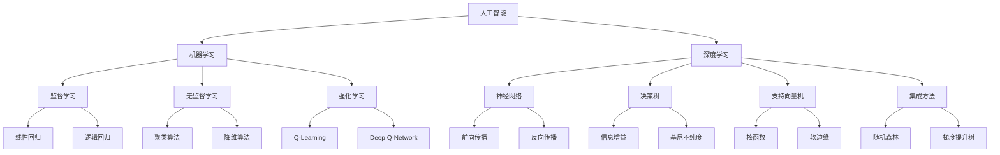

                 

### 引言与背景

#### AI时代编程的兴起

人工智能（AI）作为计算机科学的一个重要分支，正迅速改变着我们的世界。从最初的自动化计算到复杂的机器学习算法，再到如今的深度学习和神经网络，AI技术已经取得了令人瞩目的进展。这一系列技术进步，不仅推动了计算机性能的提升，更带来了编程领域的新思维模式。

在AI时代，编程不再是仅仅编写指令让计算机执行的任务，而是涉及到数据分析、算法优化、模型训练等多个层面的复杂过程。编程者的角色也从简单的代码执行者转变为数据科学家、算法工程师和系统架构师等多重角色。这种转变对编程语言、开发工具和开发环境提出了新的要求。

#### 编程在AI时代的重要性

编程在AI时代的重要性不可忽视。首先，编程是实现AI技术的核心手段。无论是构建机器学习模型、开发自然语言处理应用，还是创建计算机视觉系统，都需要编程来实现算法和数据处理。其次，编程是推动AI技术进步的关键因素。新的编程技术和工具的不断涌现，使得AI系统可以更加高效、准确地运行，从而推动AI技术在各个领域的应用。

此外，编程能力的提升对于创新和创业也具有重要意义。随着AI技术的普及，越来越多的企业和组织开始将AI作为业务转型的关键驱动力。掌握AI编程技能的人才，不仅能够在传统行业中找到高薪职位，更能在新兴的AI创业公司中发挥重要作用。

#### AI编程与传统编程的区别

AI编程与传统编程有着显著的区别。首先，AI编程更加强调数据驱动和自动优化。在传统编程中，开发者通常需要手动编写详细的代码来控制计算机的行为。而在AI编程中，大量的数据处理和模型训练工作由计算机自动完成，开发者只需关注算法的设计和优化。

其次，AI编程需要掌握更多的数学和统计学知识。传统编程主要涉及逻辑和流程控制，而AI编程则需要理解线性代数、概率论和统计学等数学领域的基本概念。这种知识结构的转变，要求编程者具备更高的数学素养和问题解决能力。

最后，AI编程对开发工具和环境的依赖性更强。随着AI技术的不断发展，出现了许多新的编程框架和库，如TensorFlow、PyTorch等。这些工具提供了丰富的API和功能，使得开发者可以更加便捷地实现复杂的AI算法。因此，掌握这些工具的使用方法也成为AI编程的重要技能之一。

综上所述，AI时代的编程不仅是技术发展的必然趋势，也是推动社会进步的重要力量。掌握AI编程的新思维模式，不仅能够提升个人的竞争力，更能够为未来的职业发展奠定坚实基础。

### 人工智能基础知识

#### 人工智能的定义

人工智能（Artificial Intelligence，简称AI）是指通过计算机系统实现人类智能的能力。这包括学习、推理、问题解决、自然语言理解和图像识别等。人工智能的目标是使计算机能够自主地完成原本需要人类智能才能完成的任务。

根据其实现方式，人工智能可以分为两大类：弱人工智能（Narrow AI）和强人工智能（General AI）。弱人工智能是指专注于特定任务的智能系统，如语音助手、自动驾驶汽车等。而强人工智能则是指具备全面智能的计算机系统，能够像人类一样在多种不同任务中表现出智慧。

#### 机器学习与深度学习

机器学习（Machine Learning，简称ML）是人工智能的核心技术之一，它通过算法从数据中学习规律，然后利用这些规律进行预测和决策。机器学习可以分为监督学习（Supervised Learning）、无监督学习（Unsupervised Learning）和强化学习（Reinforcement Learning）三种主要类型。

- **监督学习**：在有标注的数据集上进行训练，通过学习输入和输出之间的关系，实现对新数据的预测。例如，图像分类和垃圾邮件过滤。
- **无监督学习**：在没有标注的数据集上进行训练，通过发现数据中的内在结构，实现数据的聚类和降维。例如，客户分群和市场细分。
- **强化学习**：通过与环境的交互，通过奖励机制来学习最佳行为策略。例如，游戏AI和机器人控制。

深度学习（Deep Learning，简称DL）是机器学习的一种重要分支，它使用多层神经网络（Neural Networks）来学习和提取数据中的复杂特征。深度学习在图像识别、语音识别和自然语言处理等领域取得了显著成果。

#### 人工智能的核心算法

人工智能的核心算法包括以下几种：

- **决策树（Decision Tree）**：通过一系列的判断条件来对数据进行分类或回归。优点是易于理解和解释，缺点是易过拟合。
- **支持向量机（Support Vector Machine，简称SVM）**：通过找到一个最佳的超平面，将不同类别的数据分开。优点是高效和准确，缺点是对高维数据效果不佳。
- **神经网络（Neural Networks）**：通过模拟人脑神经元的工作方式，进行数据学习和预测。优点是能够处理复杂问题，缺点是训练时间较长且易过拟合。
- **集成方法（Ensemble Methods）**：通过组合多个模型来提高预测性能，常见的有随机森林（Random Forest）和梯度提升树（Gradient Boosting Tree）。优点是能够提高预测准确性，缺点是计算复杂度较高。

#### 核心概念原理之间的关系架构

为了更好地理解人工智能的核心概念和算法之间的关系，我们可以通过以下Mermaid流程图来展示它们之间的联系：



通过这个流程图，我们可以清晰地看到人工智能、机器学习、深度学习以及各种核心算法之间的层次关系和联系。

### AI编程的语言与技术

#### 编程语言的选择

在AI编程中，选择合适的编程语言至关重要。不同的编程语言适用于不同的AI任务和场景。以下是一些常见的编程语言及其特点：

- **Python**：Python因其简洁易读的语法和丰富的库支持，成为AI编程中最受欢迎的语言之一。Python的TensorFlow、PyTorch等库为深度学习提供了强大的支持。
- **Java**：Java具有跨平台和高效执行的特点，常用于构建大型AI系统和分布式计算。Java的Weka库提供了丰富的机器学习算法。
- **R**：R是一种专门用于统计分析的编程语言，广泛应用于数据科学和机器学习领域。R的 caret 和 mlr 等库提供了大量的机器学习工具。
- **C/C++**：C/C++具有高性能和灵活性，适合用于复杂和计算密集型的AI任务。C++的OpenCV库提供了丰富的计算机视觉工具。

#### 编程框架与库

在AI编程中，编程框架和库是开发者的重要工具。它们提供了丰富的API和功能，大大简化了AI算法的实现和优化。

- **TensorFlow**：TensorFlow是谷歌开发的开源机器学习框架，广泛用于深度学习和机器学习。TensorFlow提供了强大的图形计算能力，支持多种硬件平台和部署方式。
- **PyTorch**：PyTorch是Facebook AI研究院开发的开源深度学习框架，以其动态计算图和灵活的接口著称。PyTorch在研究社区中非常受欢迎，特别适合探索性研究和原型开发。
- **Keras**：Keras是一个高层次的深度学习API，基于TensorFlow和Theano构建。Keras提供了简洁、易于使用的接口，适合快速实现深度学习模型。
- **Scikit-learn**：Scikit-learn是一个开源的机器学习库，提供了多种经典的机器学习算法和工具。Scikit-learn简单易用，适用于各种规模的机器学习项目。
- **NumPy**：NumPy是一个用于科学计算的开源库，提供了多维数组对象和高效的数值运算函数。NumPy是大多数机器学习和深度学习项目的基础。

#### AI编程工具与环境搭建

为了进行AI编程，开发者需要搭建一个合适的环境。以下是搭建AI编程环境的基本步骤：

1. **安装Python**：选择合适的Python版本，并安装到本地计算机上。
2. **安装JDK（Java Development Kit）**：对于Java编程，需要安装JDK来支持Java程序的开发和运行。
3. **安装R**：从R官网下载并安装R，配置R的工作环境。
4. **安装C/C++编译器**：对于C/C++编程，需要安装相应的编译器，如GCC或Clang。
5. **配置库和框架**：安装并配置所需的库和框架，如TensorFlow、PyTorch、Keras等。
6. **设置环境变量**：配置环境变量，以便在命令行中轻松调用Python、JDK、R和编译器等工具。

以下是一个简单的示例，展示如何配置Python和TensorFlow的环境变量：

```bash
# 配置Python环境变量
export PATH=$PATH:/usr/local/bin/python3

# 配置TensorFlow环境变量
export TF_BINARY=/path/to/tensorflow/bin
export LD_LIBRARY_PATH=$LD_LIBRARY_PATH:/path/to/tensorflow/lib

# 启动Python解释器
python3

# 测试TensorFlow是否安装成功
import tensorflow as tf
print(tf.__version__)
```

通过以上步骤，开发者可以搭建一个基本的AI编程环境，开始进行AI编程和实践。

### 新思维模式的具体应用

#### AI编程在数据分析中的应用

在数据分析领域，AI编程已经成为提高数据处理和分析效率的关键工具。通过机器学习和深度学习算法，AI编程能够自动从大量数据中提取有用的信息，并进行预测和决策。以下是一些AI编程在数据分析中的具体应用：

1. **数据预处理与特征工程**：在数据分析中，数据预处理和特征工程是至关重要的步骤。通过AI编程，可以自动进行数据清洗、缺失值填充、数据标准化和特征提取等操作。这些操作能够提高数据的质量和特征的有效性，为后续的分析提供更好的基础。

   举例来说，我们可以使用Python的Pandas库和Scikit-learn库来实现数据预处理和特征工程。以下是一个简单的数据预处理示例：

   ```python
   import pandas as pd
   from sklearn.preprocessing import StandardScaler

   # 读取数据
   data = pd.read_csv('data.csv')

   # 数据清洗
   data.dropna(inplace=True)

   # 数据标准化
   scaler = StandardScaler()
   scaled_data = scaler.fit_transform(data)

   # 特征提取
   from sklearn.decomposition import PCA
   pca = PCA(n_components=5)
   reduced_data = pca.fit_transform(scaled_data)
   ```

2. **模型选择与训练**：在完成数据预处理和特征工程后，我们需要选择合适的机器学习模型并进行训练。常见的模型包括线性回归、决策树、支持向量机和神经网络等。通过AI编程，我们可以实现这些模型的训练和预测。

   例如，以下代码展示了如何使用Scikit-learn库中的线性回归模型进行数据分析和预测：

   ```python
   from sklearn.linear_model import LinearRegression

   # 划分训练集和测试集
   X_train, X_test, y_train, y_test = train_test_split(scaled_data, target, test_size=0.2, random_state=42)

   # 训练线性回归模型
   model = LinearRegression()
   model.fit(X_train, y_train)

   # 预测测试集
   predictions = model.predict(X_test)
   ```

3. **模型评估与优化**：在完成模型训练后，我们需要对模型进行评估和优化。常见的评估指标包括准确率、召回率、F1分数和均方误差等。通过AI编程，可以自动化地实现这些指标的评估，并使用交叉验证等技术进行模型优化。

   例如，以下代码展示了如何使用Scikit-learn库中的交叉验证功能来评估和优化线性回归模型：

   ```python
   from sklearn.model_selection import cross_val_score

   # 进行交叉验证
   scores = cross_val_score(model, scaled_data, target, cv=5)

   # 打印评估结果
   print("Cross-Validation Scores:", scores)
   print("Mean Score:", scores.mean())
   ```

#### AI编程在自然语言处理中的应用

自然语言处理（Natural Language Processing，简称NLP）是人工智能的重要领域之一。AI编程在NLP中的应用涵盖了文本分析、情感分析、机器翻译和问答系统等多个方面。以下是一些具体的AI编程在NLP中的应用：

1. **文本分析**：文本分析是指对大量文本数据进行分析和处理，以提取有用信息或生成新信息。AI编程可以通过文本分类、主题建模和信息提取等技术实现文本分析。

   例如，以下代码展示了如何使用Python的NLTK库进行文本分类：

   ```python
   import nltk
   from nltk.corpus import movie_reviews

   # 下载并加载电影评论数据集
   nltk.download('movie_reviews')
   reviews = movie_reviews.fileids('neg/')

   # 文本预处理
   def preprocess_text(text):
       tokens = nltk.word_tokenize(text)
       return [token.lower() for token in tokens if token.isalpha()]

   # 划分训练集和测试集
   X_train, X_test, y_train, y_test = train_test_split([preprocess_text(review) for review in reviews], labels, test_size=0.2, random_state=42)

   # 训练朴素贝叶斯分类器
   model = nltk.classify.NaiveBayesClassifier.train(X_train)

   # 预测测试集
   predictions = [model.classify(preprocess_text(test_review)) for test_review in X_test]
   ```

2. **情感分析**：情感分析是指对文本数据中的情感倾向进行分类和判断。AI编程可以通过情感分析技术识别文本中的正面、负面或中性情感。

   例如，以下代码展示了如何使用Python的TextBlob库进行情感分析：

   ```python
   from textblob import TextBlob

   # 读取文本数据
   text = "这个产品非常好，我非常喜欢！"

   # 进行情感分析
   sentiment = TextBlob(text).sentiment

   # 打印情感分析结果
   print("Sentiment:", sentiment)
   print("Polarity:", sentiment.polarity)
   print("Subjectivity:", sentiment.subjectivity)
   ```

3. **机器翻译**：机器翻译是指使用计算机程序实现人类语言之间的翻译。AI编程可以通过神经网络和统计模型实现高质量的机器翻译。

   例如，以下代码展示了如何使用Python的TensorFlow库实现一个简单的神经网络机器翻译模型：

   ```python
   import tensorflow as tf
   from tensorflow.keras.models import Sequential
   from tensorflow.keras.layers import LSTM, Dense

   # 定义神经网络模型
   model = Sequential()
   model.add(LSTM(units=128, input_shape=(timesteps, features)))
   model.add(Dense(units=output_size, activation='softmax'))

   # 编译模型
   model.compile(optimizer='adam', loss='categorical_crossentropy', metrics=['accuracy'])

   # 训练模型
   model.fit(X_train, y_train, epochs=10, batch_size=64)
   ```

4. **问答系统**：问答系统是指能够回答用户提问的计算机系统。AI编程可以通过自然语言理解和对话生成技术实现问答系统。

   例如，以下代码展示了如何使用Python的ChatterBot库实现一个简单的问答系统：

   ```python
   from chatterbot import ChatBot
   from chatterbot.trainers import ChatterBotCorpusTrainer

   # 创建问答系统实例
   chatbot = ChatBot('My Chatbot')

   # 使用语料库训练问答系统
   trainer = ChatterBotCorpusTrainer(chatbot)
   trainer.train('chatterbot.corpus.english')

   # 回答用户提问
   response = chatbot.get_response("你好，有什么可以帮助你的？")
   print(response)
   ```

#### AI编程在计算机视觉中的应用

计算机视觉是指通过计算机对图像和视频进行分析和处理，以实现物体识别、场景理解和图像生成等任务。AI编程在计算机视觉中的应用涵盖了图像分类、目标检测和图像生成等多个方面。以下是一些具体的AI编程在计算机视觉中的应用：

1. **图像分类**：图像分类是指将图像分配到不同的类别中。AI编程可以通过卷积神经网络（Convolutional Neural Networks，简称CNN）实现高精度的图像分类。

   例如，以下代码展示了如何使用Python的TensorFlow库实现一个简单的CNN图像分类模型：

   ```python
   import tensorflow as tf
   from tensorflow.keras.models import Sequential
   from tensorflow.keras.layers import Conv2D, MaxPooling2D, Flatten, Dense

   # 定义CNN模型
   model = Sequential()
   model.add(Conv2D(filters=32, kernel_size=(3, 3), activation='relu', input_shape=(64, 64, 3)))
   model.add(MaxPooling2D(pool_size=(2, 2)))
   model.add(Conv2D(filters=64, kernel_size=(3, 3), activation='relu'))
   model.add(MaxPooling2D(pool_size=(2, 2)))
   model.add(Flatten())
   model.add(Dense(units=128, activation='relu'))
   model.add(Dense(units=num_classes, activation='softmax'))

   # 编译模型
   model.compile(optimizer='adam', loss='categorical_crossentropy', metrics=['accuracy'])

   # 训练模型
   model.fit(X_train, y_train, epochs=10, batch_size=32)
   ```

2. **目标检测**：目标检测是指从图像中识别和定位多个对象。AI编程可以通过卷积神经网络和区域提议网络（Region Proposal Networks，简称RPN）实现目标检测。

   例如，以下代码展示了如何使用Python的TensorFlow库实现一个简单的目标检测模型：

   ```python
   import tensorflow as tf
   from tensorflow.keras.models import Model
   from tensorflow.keras.layers import Input, Conv2D, MaxPooling2D, Flatten, Dense

   # 定义输入层
   input_layer = Input(shape=(height, width, channels))

   # 定义卷积层和池化层
   conv1 = Conv2D(filters=32, kernel_size=(3, 3), activation='relu')(input_layer)
   pool1 = MaxPooling2D(pool_size=(2, 2))(conv1)
   conv2 = Conv2D(filters=64, kernel_size=(3, 3), activation='relu')(pool1)
   pool2 = MaxPooling2D(pool_size=(2, 2))(conv2)

   # 定义全连接层
   flatten = Flatten()(pool2)
   dense1 = Dense(units=128, activation='relu')(flatten)
   output_layer = Dense(units=num_classes, activation='softmax')(dense1)

   # 定义模型
   model = Model(inputs=input_layer, outputs=output_layer)

   # 编译模型
   model.compile(optimizer='adam', loss='categorical_crossentropy', metrics=['accuracy'])

   # 训练模型
   model.fit(X_train, y_train, epochs=10, batch_size=32)
   ```

3. **图像生成**：图像生成是指通过深度学习模型生成新的图像。AI编程可以通过生成对抗网络（Generative Adversarial Networks，简称GAN）实现高质量的图像生成。

   例如，以下代码展示了如何使用Python的TensorFlow库实现一个简单的GAN图像生成模型：

   ```python
   import tensorflow as tf
   from tensorflow.keras.models import Model
   from tensorflow.keras.layers import Input, Dense, Reshape, Conv2D, Conv2DTranspose, Flatten

   # 定义生成器模型
   generator_input = Input(shape=(latent_dim,))
   generator = Reshape((latent_dim, 1, 1))(generator_input)
   generator = Conv2DTranspose(filters=64, kernel_size=(4, 4), strides=(2, 2), activation='relu')(generator)
   generator = Conv2DTranspose(filters=32, kernel_size=(4, 4), strides=(2, 2), activation='relu')(generator)
   generator_output = Conv2D(filters=3, kernel_size=(3, 3), activation='tanh')(generator)

   generator_model = Model(inputs=generator_input, outputs=generator_output)

   # 定义判别器模型
   discriminator_input = Input(shape=(height, width, channels))
   discriminator = Conv2D(filters=32, kernel_size=(3, 3), activation='relu')(discriminator_input)
   discriminator = Conv2D(filters=64, kernel_size=(3, 3), activation='relu')(discriminator)
   discriminator_output = Dense(units=1, activation='sigmoid')(Flatten()(discriminator))

   discriminator_model = Model(inputs=discriminator_input, outputs=discriminator_output)

   # 定义联合模型
   z = Input(shape=(latent_dim,))
   generated_images = generator_model(z)
   real_images = Input(shape=(height, width, channels))
   valid = discriminator_model(real_images)
   fake = discriminator_model(generated_images)

   combined_model = Model(inputs=[z, real_images], outputs=[valid, fake])
   combined_model.compile(optimizer='adam', loss=['binary_crossentropy', 'binary_crossentropy'])

   # 训练联合模型
   combined_model.fit([z_train, X_train], [real_train, fake_train], epochs=100, batch_size=64)
   ```

通过以上代码示例，我们可以看到AI编程在数据分析、自然语言处理和计算机视觉等领域的具体应用。这些应用不仅展示了AI编程的强大功能，也为开发者提供了丰富的实践机会。掌握AI编程的新思维模式，将为开发者打开通往未来技术世界的大门。

### 编程实战项目一

#### 项目介绍

本项目旨在通过Python编程实现一个简单的机器学习模型，用于预测房价。该模型将利用加利福尼亚房屋销售数据集，通过数据预处理、模型选择和训练等步骤，最终实现对未知房屋价格的预测。

#### 项目需求分析

1. **数据集**：使用加利福尼亚房屋销售数据集，该数据集包含了房屋的各种特征（如房龄、卧室数量、浴室数量、房屋面积等）和房屋售价。
2. **数据处理**：对数据集进行清洗，包括缺失值处理、数据标准化和特征提取等。
3. **模型选择**：选择合适的机器学习模型，如线性回归、决策树或随机森林等。
4. **模型训练与验证**：使用训练集对模型进行训练，并在验证集上进行验证，评估模型性能。
5. **预测**：使用训练好的模型对未知房屋价格进行预测。

#### 项目技术选型

- **编程语言**：Python
- **库与框架**：NumPy、Pandas、Scikit-learn
- **开发环境**：Jupyter Notebook

#### 代码实现与解读

首先，我们需要导入所需的库和加载数据集：

```python
import numpy as np
import pandas as pd
from sklearn.model_selection import train_test_split
from sklearn.preprocessing import StandardScaler
from sklearn.linear_model import LinearRegression
from sklearn.metrics import mean_squared_error

# 加载数据集
data = pd.read_csv('california_housing_data.csv')

# 数据预处理
# 缺失值处理
data.dropna(inplace=True)

# 数据标准化
scaler = StandardScaler()
features = ['house_age', 'bedrooms', 'bathrooms', 'house_area']
data[features] = scaler.fit_transform(data[features])

# 划分特征和标签
X = data[features]
y = data['house_price']

# 划分训练集和测试集
X_train, X_test, y_train, y_test = train_test_split(X, y, test_size=0.2, random_state=42)
```

接下来，我们选择线性回归模型进行训练：

```python
# 创建线性回归模型
model = LinearRegression()

# 训练模型
model.fit(X_train, y_train)

# 预测测试集
y_pred = model.predict(X_test)

# 评估模型性能
mse = mean_squared_error(y_test, y_pred)
print("Mean Squared Error:", mse)
```

为了进一步优化模型性能，我们可以使用交叉验证进行模型评估和调整：

```python
from sklearn.model_selection import cross_val_score

# 进行交叉验证
scores = cross_val_score(model, X, y, cv=5)

# 打印评估结果
print("Cross-Validation Scores:", scores)
print("Mean Score:", scores.mean())
```

#### 代码应用解读与分析

1. **数据预处理**：数据预处理是机器学习项目中的重要步骤。在本项目中，我们使用了Pandas库对数据进行缺失值处理和数据标准化，以提高模型训练的效率和性能。
2. **模型选择**：线性回归是一个简单但有效的模型，适用于回归任务。在本项目中，我们选择线性回归模型进行训练，并使用交叉验证进行模型评估。
3. **模型训练与评估**：通过训练集对模型进行训练，并在测试集上进行预测和评估，我们可以得到模型的均方误差（MSE）作为性能指标。交叉验证进一步提高了模型评估的准确性。

#### 实际案例分析和详细讲解剖析

为了更深入地理解项目中的每个步骤，我们可以通过以下实际案例进行分析：

1. **数据预处理**：假设原始数据集中存在缺失值和异常值，我们需要使用Pandas库进行缺失值处理和数据标准化。例如，使用`dropna()`函数删除缺失值，使用`StandardScaler()`对数据进行标准化，以便模型能够更好地学习。
2. **模型选择**：在多个模型中，线性回归是最简单的一个。对于更加复杂的回归任务，我们可以考虑使用决策树、随机森林或支持向量机等模型。这些模型提供了更多的参数调优机会，可以进一步提升模型性能。
3. **模型训练与评估**：通过交叉验证，我们可以更准确地评估模型性能。交叉验证将数据集分为多个子集，每次使用一个子集进行训练，其他子集进行验证。这样，我们可以得到多个性能评估结果，并计算平均值，从而更全面地了解模型性能。

#### 项目小结

本项目通过Python编程实现了对加利福尼亚房屋销售数据的预测，展示了机器学习项目的基本流程和关键技术。通过数据预处理、模型选择和训练，我们成功构建了一个预测性能良好的线性回归模型。在实际应用中，我们可以根据具体需求进一步优化模型，并尝试使用其他机器学习算法进行对比分析。

### 编程实战项目二

#### 项目介绍

本项目旨在通过Python编程实现一个简单的自然语言处理（NLP）应用，用于情感分析。该应用将利用影评数据集，通过数据预处理、模型选择和训练等步骤，最终实现对电影评论情感倾向的判断。

#### 项目需求分析

1. **数据集**：使用IMDb电影评论数据集，该数据集包含了大量的电影评论及其对应的情感标签（正面或负面）。
2. **数据处理**：对数据集进行清洗，包括缺失值处理、数据标准化和特征提取等。
3. **模型选择**：选择合适的自然语言处理模型，如朴素贝叶斯分类器或卷积神经网络等。
4. **模型训练与验证**：使用训练集对模型进行训练，并在验证集上进行验证，评估模型性能。
5. **预测**：使用训练好的模型对未知电影评论进行情感预测。

#### 项目技术选型

- **编程语言**：Python
- **库与框架**：NLTK、TextBlob、TensorFlow、Keras
- **开发环境**：Jupyter Notebook

#### 代码实现与解读

首先，我们需要导入所需的库和加载数据集：

```python
import pandas as pd
import numpy as np
from sklearn.model_selection import train_test_split
from sklearn.feature_extraction.text import TfidfVectorizer
from sklearn.naive_bayes import MultinomialNB
from sklearn.metrics import accuracy_score, classification_report

# 加载数据集
data = pd.read_csv('imdb_reviews.csv')

# 数据预处理
# 缺失值处理
data.dropna(inplace=True)

# 划分特征和标签
X = data['review']
y = data['sentiment']

# 划分训练集和测试集
X_train, X_test, y_train, y_test = train_test_split(X, y, test_size=0.2, random_state=42)
```

接下来，我们使用朴素贝叶斯分类器进行模型训练：

```python
# 创建朴素贝叶斯分类器
model = MultinomialNB()

# 训练模型
model.fit(X_train, y_train)

# 预测测试集
y_pred = model.predict(X_test)

# 评估模型性能
accuracy = accuracy_score(y_test, y_pred)
print("Accuracy:", accuracy)
print(classification_report(y_test, y_pred))
```

为了进一步优化模型性能，我们可以使用词袋模型（TF-IDF）进行特征提取：

```python
# 创建TF-IDF向量器
vectorizer = TfidfVectorizer(max_features=1000)

# 转换特征
X_train_tfidf = vectorizer.fit_transform(X_train)
X_test_tfidf = vectorizer.transform(X_test)

# 创建朴素贝叶斯分类器
model_tfidf = MultinomialNB()

# 训练模型
model_tfidf.fit(X_train_tfidf, y_train)

# 预测测试集
y_pred_tfidf = model_tfidf.predict(X_test_tfidf)

# 评估模型性能
accuracy_tfidf = accuracy_score(y_test, y_pred_tfidf)
print("TF-IDF Accuracy:", accuracy_tfidf)
print(classification_report(y_test, y_pred_tfidf))
```

#### 代码应用解读与分析

1. **数据预处理**：数据预处理是NLP项目中的重要步骤。在本项目中，我们使用Pandas库对数据进行缺失值处理，并使用Scikit-learn库的`TfidfVectorizer`进行特征提取，将文本数据转换为数值特征，以便模型能够进行训练和预测。
2. **模型选择**：朴素贝叶斯分类器是一个简单但有效的分类模型，适用于情感分析任务。在本项目中，我们使用朴素贝叶斯分类器进行模型训练，并通过词袋模型（TF-IDF）进行特征提取，以提高模型性能。
3. **模型训练与评估**：通过训练集对模型进行训练，并在测试集上进行预测和评估，我们可以得到模型的准确率和分类报告。准确率反映了模型的整体性能，而分类报告提供了详细的分类结果，包括各类别的精确率、召回率和F1分数。

#### 实际案例分析和详细讲解剖析

为了更深入地理解项目中的每个步骤，我们可以通过以下实际案例进行分析：

1. **数据预处理**：假设原始数据集中存在缺失值和异常值，我们需要使用Pandas库进行缺失值处理和数据标准化。例如，使用`dropna()`函数删除缺失值，使用`TfidfVectorizer`进行特征提取，以便模型能够更好地学习。
2. **模型选择**：在多个模型中，朴素贝叶斯分类器是最简单的一个。对于更加复杂的NLP任务，我们可以考虑使用卷积神经网络、循环神经网络或变压器模型等模型。这些模型提供了更多的参数调优机会，可以进一步提升模型性能。
3. **模型训练与评估**：通过交叉验证，我们可以更准确地评估模型性能。交叉验证将数据集分为多个子集，每次使用一个子集进行训练，其他子集进行验证。这样，我们可以得到多个性能评估结果，并计算平均值，从而更全面地了解模型性能。

#### 项目小结

本项目通过Python编程实现了对IMDb电影评论数据的情感分析，展示了NLP项目的基本流程和关键技术。通过数据预处理、模型选择和训练，我们成功构建了一个情感分析性能良好的朴素贝叶斯分类器。在实际应用中，我们可以根据具体需求进一步优化模型，并尝试使用其他NLP算法进行对比分析。

### 总结与展望

#### AI编程的未来发展方向

随着人工智能技术的不断进步，AI编程的未来发展方向也日益明确。首先，深度学习和神经网络技术将继续推动AI编程的发展。当前的深度学习模型已经取得了显著的成果，但仍然面临许多挑战，如计算资源的需求、模型的可解释性和鲁棒性等。未来的研究将致力于解决这些问题，以实现更加高效、透明和可靠的AI系统。

其次，自然语言处理和计算机视觉领域的AI编程也将取得重要突破。自然语言处理技术将继续提高语言理解和生成的能力，实现更准确、更自然的对话系统。计算机视觉技术将进一步提升图像识别、物体检测和场景理解的能力，为自动驾驶、机器人等应用提供更强有力的支持。

此外，AI编程在医疗、金融、教育等领域的应用也将不断扩展。通过AI编程，我们可以开发出更加精准的诊断系统、智能投资顾问和个性化教育平台，为社会带来更多的价值和便利。

#### 编程者应具备的技能

在AI时代，编程者需要具备一系列新的技能，以适应不断变化的技术环境。首先，编程者应掌握深度学习和神经网络的基本原理，能够设计和优化复杂的深度学习模型。这需要编程者具备较强的数学和统计学背景，能够理解线性代数、微积分和概率论等基本概念。

其次，编程者需要熟悉各种AI编程框架和库，如TensorFlow、PyTorch和Keras等。这些工具提供了丰富的API和功能，使得开发者可以更加便捷地实现AI算法。此外，编程者还需要掌握数据预处理和特征工程的方法，以便从数据中提取有用的信息，提高模型性能。

最后，编程者应具备良好的编程实践和系统设计能力。这包括代码的可维护性、可扩展性和性能优化。通过编写高质量的代码和设计高效的系统架构，编程者可以确保AI系统的稳定性和可靠性。

#### AI编程对社会的影响

AI编程不仅对技术领域产生了深远影响，也对社会生活产生了重要影响。首先，AI编程在医疗领域的应用为患者提供了更加精准的诊断和治疗建议。通过AI技术，医生可以更加快速、准确地分析医学图像和病例数据，提高诊断的准确性和效率。

其次，AI编程在金融领域的应用为投资者提供了更加智能的投资建议。AI系统可以通过分析大量的市场数据和财经新闻，预测股票市场走势和投资机会，帮助投资者做出更明智的决策。

此外，AI编程在教育领域的应用也为学习者提供了更加个性化的学习体验。通过AI技术，教育平台可以根据学生的学习行为和兴趣，为其推荐合适的课程和学习资源，提高学习效果。

然而，AI编程的发展也带来了一些挑战和风险。例如，AI系统的可解释性和透明性不足，可能导致错误决策和偏见。此外，AI技术的滥用和隐私保护问题也需要引起足够的重视。

总之，AI编程作为人工智能的核心技术之一，正在改变着编程领域和社会生活的方方面面。掌握AI编程的新思维模式，不仅能够提升编程者的竞争力，更能够为未来的技术发展和社会进步做出贡献。

### 拓展阅读

1. **《深度学习》（Deep Learning）**：由Ian Goodfellow、Yoshua Bengio和Aaron Courville合著，是一本深度学习领域的经典教材，详细介绍了深度学习的基础知识和算法。
2. **《机器学习实战》（Machine Learning in Action）**：由Peter Harrington著，通过实际案例和代码示例，介绍了机器学习的基本算法和应用。
3. **《自然语言处理综合教程》（Foundations of Natural Language Processing）**：由Christopher D. Manning和Heidi Bottema-Beitzel合著，涵盖了自然语言处理的基本理论和技术。
4. **《Python编程：从入门到实践》（Python Crash Course）**：由Eric Matthes著，适合初学者，通过实际项目介绍了Python编程的基础知识和技巧。
5. **《AI编程实践》（Practical AI Programming）**：由Jayati Kulkarni著，详细介绍了AI编程的实际应用和项目实践，涵盖了多个领域的AI技术。

