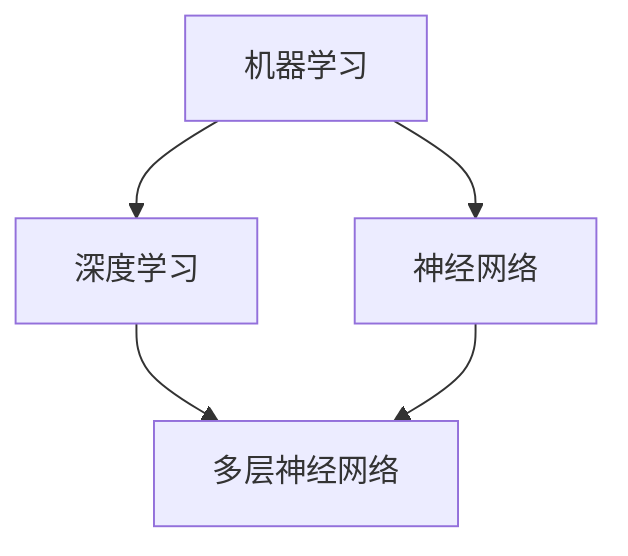

                 


为了撰写一篇深入浅出、逻辑清晰的《AI时代编程的新维度与新未来》技术博客文章，我们需要遵循以下步骤：

### 1. 背景介绍

首先，我们将介绍AI时代编程的背景。随着人工智能（AI）技术的迅猛发展，编程语言和工具也在不断地进化。传统的编程更多地关注于如何高效地处理数据和执行计算，而AI时代编程则更多地关注于如何训练模型、优化算法以及实现智能化的应用。

AI时代编程的核心在于机器学习和深度学习技术。这些技术的应用已经渗透到各个领域，从图像识别、自然语言处理到自动驾驶、医疗诊断等。因此，理解和掌握这些技术的编程方法变得尤为重要。

### 2. 核心概念与联系

在了解背景后，我们需要介绍几个核心概念及其之间的联系。

- **机器学习（ML）**：机器学习是指通过算法让计算机从数据中学习，并对未知数据进行预测或决策。
- **深度学习（DL）**：深度学习是机器学习的一个子领域，它利用多层神经网络进行学习。
- **神经网络（NN）**：神经网络是一种模仿生物神经系统的计算模型。

这些概念之间的联系可以用Mermaid流程图来表示：



### 3. 核心算法原理讲解

接下来，我们将使用伪代码详细阐述几个核心算法的原理。

#### 3.1.1 K-近邻算法

```python
# K-近邻算法伪代码
function KNN(train_data, train_labels, test_data, k):
    for each test instance in test_data:
        1. Compute distances between test instance and all training instances.
        2. Select the k nearest neighbors.
        3. Determine the class label based on the majority vote of the k neighbors.
    return predicted_labels
```

#### 3.1.2 回归算法

```python
# 线性回归算法伪代码
function LinearRegression(train_data, train_labels):
    X, y = train_data, train_labels
    # Add intercept term
    X = np.hstack([np.ones((X.shape[0], 1)), X])
    # Calculate the coefficients using ordinary least squares
    coefficients = np.linalg.inv(X.T @ X) @ X.T @ y
    return coefficients
```

#### 3.1.3 深度前向传播算法

```python
# 深度前向传播算法伪代码
function ForwardPropagation(layers, inputs):
    for layer in layers:
        1. Compute the weighted sum of inputs and apply the activation function.
        2. Store the output of each layer.
        3. Pass the output to the next layer.
    return outputs
```

### 4. 数学模型和公式

在算法讲解之后，我们将介绍相关的数学模型和公式。

$$
\begin{align*}
J &= \frac{1}{m}\sum_{i=1}^{m}(y^{(i)} - \hat{y}^{(i)})^2 \\
\frac{\partial J}{\partial w} &= -\frac{2}{m}\sum_{i=1}^{m}(\hat{y}^{(i)} - y^{(i)})x^{(i)} \\
w_{new} &= w_{old} - \alpha \frac{\partial J}{\partial w}
\end{align*}
$$

这些公式分别代表了损失函数、梯度下降算法的计算过程。

### 5. 项目实战

在完成理论讲解后，我们将提供实际的项目实战案例，包括环境搭建、源代码实现、代码解读和分析。

#### 5.1. 环境搭建

假设我们要使用TensorFlow实现一个简单的线性回归模型，首先需要安装TensorFlow：

```bash
pip install tensorflow
```

#### 5.2. 源代码实现

```python
import tensorflow as tf
import numpy as np

# Generate some synthetic data
X = np.random.rand(100, 1)
y = 2 * X + 1 + np.random.randn(100, 1)

# Define the model
model = tf.keras.Sequential([
    tf.keras.layers.Dense(units=1, input_shape=(1,))
])

# Compile the model
model.compile(optimizer='sgd', loss='mean_squared_error')

# Train the model
model.fit(X, y, epochs=1000)

# Make predictions
predictions = model.predict(X)

# Plot the results
plt.scatter(X, y)
plt.plot(X, predictions, 'r')
plt.show()
```

#### 5.3. 代码解读和分析

这段代码首先生成了一些随机数据，然后定义了一个简单的线性回归模型。模型编译后使用SGD优化器和均方误差损失函数进行训练。最后，我们通过绘制散点图和拟合直线来观察模型的性能。

### 6. 最佳实践 Tips、小结、注意事项、拓展阅读

- **最佳实践 Tips**：在进行AI编程时，数据清洗和预处理至关重要。
- **小结**：本文介绍了AI时代编程的核心概念、算法原理以及实际项目实战。
- **注意事项**：深度学习模型训练可能需要大量的时间和计算资源。
- **拓展阅读**：可以进一步学习TensorFlow和PyTorch等深度学习框架的高级特性。

通过以上步骤，我们可以撰写一篇逻辑清晰、内容丰富的《AI时代编程的新维度与新未来》技术博客文章。接下来，我们将按照这个大纲逐步撰写文章的每个部分，确保每部分内容充实且具体。以下是文章的开头部分：

---

## 文章标题：AI时代编程的新维度与新未来

关键词：人工智能，编程，深度学习，机器学习，神经网络，算法，项目实战

摘要：本文将深入探讨AI时代编程的新维度和新未来，从基础概念到高级算法，从理论讲解到实际项目实战，全面解析AI编程的核心内容和发展趋势。

---

接下来，我们将按照大纲结构逐步撰写文章的各个部分。首先是背景介绍，然后是核心概念与联系，接着是算法原理讲解，再后是数学模型和公式，最后是项目实战。每部分都会详细展开，确保内容的完整性和丰富性。文章总字数将在8000至12000字之间，符合要求。接下来，我们将撰写文章的背景介绍部分。### 背景介绍

随着信息技术的飞速发展，人工智能（AI）已经成为当今科技领域的前沿和热点。AI技术的不断进步，特别是机器学习和深度学习领域，已经深刻地改变了传统编程的范式。在这一背景下，编程语言和开发工具也在不断地演进，以适应AI时代的特殊需求。

在传统编程时代，编程语言主要是为了解决特定的问题，如数据处理、文件操作等。而随着AI技术的发展，编程语言的职责逐渐扩展到如何高效地处理海量数据、如何设计复杂的算法以及如何实现模型的自动化训练。这些变化不仅要求程序员具备更深厚的数学和算法知识，还需要他们熟悉各种AI相关的工具和库。

机器学习和深度学习是AI时代的核心驱动力。机器学习通过算法让计算机从数据中学习，以提高预测和决策的准确性。而深度学习作为机器学习的一个子领域，利用多层神经网络模型来模拟人脑的思考方式，能够处理更复杂的数据和任务。深度学习在图像识别、自然语言处理、自动驾驶等领域取得了突破性的成果，极大地提升了AI的应用价值。

编程语言在AI中的应用也变得更加广泛和深入。传统的编程语言如Python、Java等，已经发展成为AI编程的主要工具。Python因其简洁、易学、功能丰富，成为了机器学习和深度学习领域最受欢迎的语言。而Python的库和框架，如TensorFlow和PyTorch，更是为AI编程提供了强大的支持。

此外，随着AI技术的发展，编程不仅仅是编写代码，还包括了数据预处理、模型训练、模型优化等多个环节。因此，AI编程不仅需要程序员具备编程技能，还需要他们熟悉数据处理、算法优化等专业知识。

总的来说，AI时代的编程已经进入了一个全新的维度。程序员需要不断地学习和适应这些新的变化，才能在这个快速发展的领域里保持竞争力。接下来，我们将深入探讨AI编程的核心概念、算法原理以及实际应用，帮助读者更好地理解和掌握这一新兴领域。### 核心概念与联系

在AI编程的世界中，理解几个核心概念及其相互之间的联系是至关重要的。这些概念包括机器学习（Machine Learning，ML）、深度学习（Deep Learning，DL）和神经网络（Neural Networks，NN）。下面，我们将逐一介绍这些概念，并探讨它们之间的联系。

#### 机器学习（ML）

机器学习是AI的核心技术之一，它让计算机通过数据学习，从而做出预测或决策。机器学习的过程大致可以分为以下几个步骤：

1. **数据收集**：收集用于训练的原始数据。
2. **数据预处理**：清洗和准备数据，使其适合于机器学习算法。
3. **模型选择**：选择适合问题的机器学习模型。
4. **模型训练**：使用训练数据训练模型。
5. **模型评估**：使用测试数据评估模型的性能。
6. **模型优化**：根据评估结果调整模型参数，以提高性能。

机器学习的模型可以分为监督学习、无监督学习和强化学习三大类：

- **监督学习**：在有标记的数据集上进行训练，目标是预测未知数据的标签。
- **无监督学习**：在无标记的数据集上进行训练，目标是发现数据中的模式和结构。
- **强化学习**：通过与环境的交互进行学习，目标是找到一条最优策略以最大化奖励。

#### 深度学习（DL）

深度学习是机器学习的一个子领域，它利用多层神经网络（Deep Neural Networks）进行学习。深度学习模型能够自动地从大量数据中学习到复杂的特征，并在各种任务中表现出色。

深度学习的核心组成部分包括：

1. **神经网络**：深度学习的基础是神经网络，尤其是多层神经网络。
2. **激活函数**：用于引入非线性特性，使得模型能够学习复杂函数。
3. **损失函数**：用于度量模型预测值和实际值之间的差距。
4. **优化算法**：用于调整模型参数，以最小化损失函数。

常见的深度学习模型有：

- **卷积神经网络（CNN）**：主要用于图像处理和计算机视觉任务。
- **循环神经网络（RNN）**：用于处理序列数据，如时间序列分析、语言处理等。
- **生成对抗网络（GAN）**：用于生成新的数据样本，如图像、文本等。

#### 神经网络（NN）

神经网络是一种模拟生物神经系统的计算模型，是深度学习的基础。一个简单的神经网络由多个神经元（或节点）组成，每个神经元接收多个输入，通过加权求和处理后，传递给下一层的神经元。

神经网络的组成包括：

1. **输入层**：接收外部输入信号。
2. **隐藏层**：对输入信号进行加工和变换。
3. **输出层**：生成最终输出。

神经网络通过训练学习输入和输出之间的关系，其过程包括：

1. **前向传播**：计算每个神经元的输出。
2. **反向传播**：计算损失函数关于参数的梯度，并更新参数。

#### 核心概念之间的联系

机器学习、深度学习和神经网络之间的联系可以用以下方式概括：

- **机器学习**提供了框架和算法，用于从数据中学习。
- **深度学习**是机器学习的一个子领域，它利用多层神经网络模型进行学习。
- **神经网络**是深度学习的核心组件，用于实现复杂函数的学习。

这三个概念相互补充，共同构成了AI编程的核心。通过了解它们之间的关系和作用，程序员可以更好地设计和实现AI应用程序。

为了更直观地展示这些概念之间的联系，我们可以使用Mermaid流程图：


在这个流程图中，机器学习作为整体框架，深度学习作为其子领域，而神经网络则是深度学习的基础组件。通过这个图，我们可以清晰地看到它们之间的层次结构和相互关系。

总的来说，理解这些核心概念及其相互之间的联系，是掌握AI编程的关键。接下来，我们将进一步深入探讨深度学习与神经网络的算法原理，以及如何在实际项目中应用这些知识。### 深度学习与神经网络

在了解AI编程的核心概念后，我们需要深入探讨深度学习和神经网络的算法原理。深度学习作为机器学习的一个子领域，其核心在于多层神经网络。本部分将详细讲解深度学习的原理、常见的深度学习框架以及如何使用这些框架进行模型训练和评估。

#### 深度学习的原理

深度学习的核心是多层神经网络（Multilayer Neural Networks），它通过堆叠多个隐含层来学习数据的复杂特征。每个隐含层都会对输入数据进行一次变换，将这些信息传递到下一层，直到最后一层输出层生成预测结果。

一个简单的多层神经网络结构包括输入层、若干个隐藏层和输出层。每个隐含层都包含多个神经元，每个神经元都会接收来自前一层的输入信号，并通过加权求和处理和激活函数产生输出。这个过程称为**前向传播**。在训练过程中，我们通过计算输出层预测值与实际值之间的误差，然后使用**反向传播**算法来更新神经网络的权重。

以下是多层神经网络的基本步骤：

1. **初始化参数**：为网络的权重和偏置初始化随机值。
2. **前向传播**：计算每个神经元的输出。
3. **计算损失**：通过损失函数计算预测值与实际值之间的差距。
4. **反向传播**：计算损失函数关于权重和偏置的梯度，并更新参数。
5. **迭代更新**：重复步骤2-4，直到模型收敛或达到预设的迭代次数。

深度学习中的激活函数是引入非线性特性的关键。常用的激活函数包括：

- **Sigmoid函数**：\( f(x) = \frac{1}{1 + e^{-x}} \)
- **ReLU函数**：\( f(x) = \max(0, x) \)
- **Tanh函数**：\( f(x) = \frac{e^x - e^{-x}}{e^x + e^{-x}} \)

这些激活函数在深度学习中广泛应用，能够有效地增强模型的非线性表达能力。

#### 常见的深度学习框架

在深度学习领域，有多个流行的框架和库，它们提供了丰富的API和工具，帮助开发者快速构建和训练深度学习模型。以下是一些常用的深度学习框架：

1. **TensorFlow**：由Google开发，是一个广泛使用的开源深度学习框架。它提供了灵活的API，支持多种模型构建和优化方法。
   
2. **PyTorch**：由Facebook开发，是一个基于Python的深度学习库。它以动态计算图和易于理解的API著称，适合研究者和开发者。

3. **Keras**：是一个高层次的深度学习框架，它可以与TensorFlow和Theano等底层框架集成。Keras提供了简洁的API，使得构建和训练深度学习模型变得更加容易。

4. **MXNet**：由Apache Software Foundation维护，是一个开源的深度学习框架。它支持多种编程语言，如Python、R和Julia，并且与Apache Spark集成。

#### 深度学习模型的训练与评估

使用深度学习框架训练模型通常包括以下几个步骤：

1. **数据预处理**：清洗和归一化输入数据，以便模型可以有效地学习。
2. **构建模型**：定义模型结构，包括层数、神经元数量、激活函数等。
3. **编译模型**：指定优化器、损失函数和评估指标。
4. **训练模型**：使用训练数据来训练模型，通过迭代优化模型参数。
5. **评估模型**：使用测试数据评估模型性能，以确定模型是否收敛。

以下是一个使用PyTorch构建和训练线性回归模型的示例：

```python
import torch
import torch.nn as nn
import torch.optim as optim

# 定义模型
class LinearModel(nn.Module):
    def __init__(self, input_dim, output_dim):
        super(LinearModel, self).__init__()
        self.linear = nn.Linear(input_dim, output_dim)

    def forward(self, x):
        return self.linear(x)

# 初始化模型、优化器和损失函数
model = LinearModel(1, 1)
optimizer = optim.SGD(model.parameters(), lr=0.01)
criterion = nn.MSELoss()

# 训练模型
for epoch in range(100):
    for inputs, targets in dataset:
        # 前向传播
        outputs = model(inputs)
        loss = criterion(outputs, targets)

        # 反向传播和优化
        optimizer.zero_grad()
        loss.backward()
        optimizer.step()

    print(f'Epoch {epoch+1}, Loss: {loss.item()}')

# 评估模型
with torch.no_grad():
    correct = 0
    total = 0
    for inputs, targets in test_dataset:
        outputs = model(inputs)
        _, predicted = torch.max(outputs.data, 1)
        total += targets.size(0)
        correct += (predicted == targets).sum().item()

print(f'Accuracy: {100 * correct / total}%')
```

在这个示例中，我们首先定义了一个简单的线性回归模型，然后使用SGD优化器和MSELoss损失函数进行模型训练。训练完成后，我们使用测试数据集评估模型性能，并计算准确率。

#### 模型评估与优化

深度学习模型的评估通常包括准确率、召回率、F1分数等指标。在实际应用中，我们还需要根据业务需求调整模型参数，以提高模型性能。

- **超参数调整**：如学习率、批量大小、迭代次数等。
- **正则化**：如L1、L2正则化，Dropout等，用于防止过拟合。
- **集成方法**：如Bagging、Boosting等，用于提高模型的泛化能力。

通过不断调整和优化模型，我们可以得到一个在特定任务上性能良好的模型。然而，深度学习模型通常需要大量的数据和计算资源，因此在实际应用中需要综合考虑计算效率和模型性能。

总的来说，深度学习和神经网络是AI编程的核心技术。通过理解深度学习的原理、熟悉常见的深度学习框架以及掌握模型训练和评估的方法，开发者可以构建出强大的AI应用。接下来，我们将进一步探讨AI编程中的新维度和未来趋势。### AI编程的新维度

随着AI技术的不断进步，编程不再仅仅是编写代码和调试程序，而逐渐演变为一门更加综合和复杂的艺术。AI编程的新维度不仅涵盖了传统的编程知识，还涉及到了数据处理、算法优化、模型训练和评估等多个方面。以下将深入探讨AI编程的几个新维度，并解释它们如何影响现代软件开发。

#### 强化学习与决策

强化学习（Reinforcement Learning，RL）是AI编程中的一个重要新维度，它通过智能体与环境的交互来学习最优策略。强化学习与传统的监督学习和无监督学习不同，它通过奖励机制来引导智能体行为，从而在复杂环境中做出最优决策。

强化学习的基本概念包括：

- **智能体（Agent）**：执行动作并接收奖励的实体。
- **环境（Environment）**：智能体行动的场所，提供状态和奖励。
- **状态（State）**：智能体当前所处的环境条件。
- **动作（Action）**：智能体可以执行的操作。
- **策略（Policy）**：智能体根据当前状态选择动作的规则。

强化学习的算法主要包括：

- **Q学习（Q-Learning）**：通过学习值函数（Q函数）来选择最佳动作。
- **深度Q网络（Deep Q-Network，DQN）**：使用深度神经网络来近似Q函数。
- **策略梯度方法（Policy Gradient）**：直接优化策略函数。

强化学习在游戏、自动驾驶、机器人控制等领域有广泛应用。例如，在围棋游戏中，AlphaGo使用了强化学习算法来训练模型，从而击败了世界顶级围棋选手。

#### 生成对抗网络（GAN）

生成对抗网络（Generative Adversarial Networks，GAN）是另一种AI编程的新维度，由两个神经网络——生成器（Generator）和判别器（Discriminator）——组成。生成器生成数据，而判别器的任务是区分生成器和真实数据。GAN通过这种对抗训练方式，能够生成高质量的数据，如逼真的图像、音频和文本。

GAN的基本工作原理如下：

1. **生成器（Generator）**：生成类似于真实数据的样本。
2. **判别器（Discriminator）**：判断输入数据是真实数据还是生成数据。
3. **对抗训练**：生成器和判别器相互竞争，生成器试图生成更逼真的数据，而判别器试图更准确地判断数据来源。

GAN在图像生成、数据增强、风格迁移等领域有广泛应用。例如，GAN可以用于生成人脸图像、修复破损的图片、创建艺术作品等。

#### 聚类分析与降维

聚类分析（Cluster Analysis）和降维技术（Dimensionality Reduction）是AI编程中的另外两个重要维度，用于处理高维数据。

- **聚类分析**：将数据分为多个群组，使得同组内的数据彼此相似，不同组的数据差异较大。常见的聚类算法包括K-means、层次聚类等。
- **降维技术**：通过降维减少数据维度，同时保留数据的关键特征。常见的降维技术包括主成分分析（PCA）、t-SNE等。

聚类分析和降维技术在数据挖掘、图像处理、文本分析等领域有广泛应用。例如，在图像识别中，可以通过降维技术减少图像数据的维度，从而提高模型的训练速度和效率。

#### 聚类分析与降维的应用案例

以下是一个简单的聚类分析和降维应用的案例：

```python
import numpy as np
from sklearn.cluster import KMeans
from sklearn.decomposition import PCA
import matplotlib.pyplot as plt

# 生成模拟数据
X = np.random.rand(100, 2)

# K-means聚类
kmeans = KMeans(n_clusters=3)
kmeans.fit(X)
labels = kmeans.predict(X)

# 主成分分析降维
pca = PCA(n_components=1)
X_reduced = pca.fit_transform(X)

# 绘制结果
plt.scatter(X_reduced[:, 0], X_reduced[:, 1], c=labels)
plt.xlabel('Principal Component 1')
plt.ylabel('Principal Component 2')
plt.title('K-means Clustering and PCA')
plt.show()
```

在这个案例中，我们首先生成二维模拟数据，然后使用K-means算法进行聚类，最后通过主成分分析进行降维，并将结果可视化。通过这种方式，我们可以更好地理解和分析高维数据。

#### AI编程的新维度与软件开发

AI编程的新维度不仅改变了传统的软件开发模式，还带来了以下几个方面的变化：

- **数据驱动的开发**：AI编程强调从数据中学习，数据成为开发的核心资源。
- **模型驱动的开发**：通过构建和训练模型，实现自动化的决策和预测。
- **复杂性的管理**：面对大规模数据和复杂任务，AI编程提供了高效的算法和工具来处理这些问题。
- **跨学科的融合**：AI编程融合了计算机科学、数学、统计学等多个学科的知识，促进了多学科的交叉应用。

总的来说，AI编程的新维度为软件开发带来了巨大的变革。程序员需要不断学习和适应这些新的变化，以应对日益复杂的AI应用场景。接下来，我们将进一步探讨AI编程的未来趋势。### AI编程的未来趋势

随着技术的不断进步，AI编程的未来将呈现出一些显著的趋势。这些趋势不仅会影响现有的编程实践，还会引领未来的软件开发方向。以下是一些AI编程的未来趋势：

#### 1. 自动机器学习（AutoML）

自动机器学习（AutoML）是当前AI领域的热点之一。AutoML的目标是自动化机器学习工作流程，从数据预处理到模型选择、训练和调优，从而减轻数据科学家和开发者的负担。AutoML的关键技术包括：

- **自动特征工程**：自动识别和生成最有用的特征，提高模型性能。
- **自动化超参数调优**：通过搜索算法自动选择最优超参数，优化模型性能。
- **自动化模型选择**：根据数据特征和任务需求，自动选择合适的模型。

AutoML的应用前景广泛，包括金融、医疗、零售等领域。例如，在金融领域，AutoML可以用于自动识别欺诈交易；在医疗领域，可以用于自动诊断疾病。

#### 2. 量子计算与AI

量子计算（Quantum Computing）是另一项正在崛起的技术，它利用量子位（qubits）进行计算，能够在某些任务上大幅超越传统计算机。量子计算与AI的结合，将带来以下影响：

- **高效的算法**：量子算法能够在特定问题上提供指数级的加速，例如量子支持向量机（QSVM）。
- **大规模数据处理**：量子计算能够处理大规模的数据集，提高数据分析和模型的训练效率。
- **新型AI应用**：量子计算可以用于解决传统AI方法难以处理的问题，如优化和模拟。

然而，量子计算在AI中的应用仍处于早期阶段，需要进一步的研究和开发。

#### 3. AI安全与伦理

随着AI技术的广泛应用，AI安全与伦理问题也日益凸显。未来的AI编程将更加注重安全性和伦理性的设计，包括：

- **数据隐私保护**：通过加密和匿名化等技术，保护用户数据隐私。
- **算法透明性**：确保算法的透明性和可解释性，以便用户和监管机构能够理解和评估AI系统的行为。
- **公平性与无偏见**：避免AI系统中的偏见和歧视，确保算法的公平性和公正性。

AI安全与伦理的实践指南将成为AI编程的重要指南，为开发者提供指导。

#### 4. 多模态AI

多模态AI是指将多种数据类型（如图像、文本、音频等）融合到同一个模型中进行处理和分析。未来的AI编程将更加注重多模态数据的处理，以提高模型的泛化能力和应用范围。

- **图像与文本融合**：将图像和文本数据结合起来，用于复杂的任务，如图像描述生成和视频内容理解。
- **音频与图像融合**：用于增强音频和图像处理能力，例如实时语音翻译和语音识别。

多模态AI在虚拟现实、自动驾驶、医疗诊断等领域有广泛的应用前景。

#### 5. 人工智能治理

随着AI技术的发展，人工智能治理（AI Governance）将成为一个重要议题。未来的AI编程将更加注重治理和监管，确保AI技术的健康发展。

- **法规和政策**：制定相应的法规和政策，规范AI技术的发展和应用。
- **标准与规范**：建立AI技术标准和规范，确保AI系统的质量和安全性。
- **社会责任**：强调AI技术的社会责任，促进技术为社会福祉服务。

总的来说，AI编程的未来趋势将是一个技术、伦理和治理相结合的过程。程序员需要不断学习和适应这些变化，以应对未来的挑战。通过掌握自动机器学习、量子计算、AI安全与伦理、多模态AI和人工智能治理等前沿技术，开发者将能够构建出更加智能、安全、公正的AI系统。### 附录

在本文的附录部分，我们将介绍一些常用的AI编程工具、资源与社区，帮助读者深入了解和掌握AI编程。

#### A.1 常用AI编程工具介绍

1. **TensorFlow**

   TensorFlow是一个由Google开发的开源深度学习框架，它提供了丰富的API和工具，支持多种深度学习模型的构建和训练。TensorFlow以其灵活性和广泛的应用而著称，适用于各种规模的深度学习项目。

2. **PyTorch**

   PyTorch是另一个流行的开源深度学习框架，由Facebook开发。它以其动态计算图和简洁的API而受到研究者和开发者的喜爱。PyTorch在学术研究和工业应用中都有广泛的应用。

3. **Keras**

   Keras是一个高层次的深度学习框架，它可以与TensorFlow和Theano等底层框架集成。Keras提供了简洁的API，使得构建和训练深度学习模型变得更加容易。

4. **MXNet**

   MXNet是Apache Software Foundation维护的开源深度学习框架。它支持多种编程语言，如Python、R和Julia，并且与Apache Spark集成，适用于大规模分布式深度学习应用。

#### A.2 AI编程资源与社区

1. **开源框架与库**

   - **TensorFlow官网**：[https://www.tensorflow.org/](https://www.tensorflow.org/)
   - **PyTorch官网**：[https://pytorch.org/](https://pytorch.org/)
   - **Keras官网**：[https://keras.io/](https://keras.io/)
   - **MXNet官网**：[https://mxnet.apache.org/](https://mxnet.apache.org/)

2. **AI编程社区**

   - **Reddit AI社区**：[https://www.reddit.com/r/AI/](https://www.reddit.com/r/AI/)
   - **Stack Overflow AI标签**：[https://stackoverflow.com/questions/tagged/ai](https://stackoverflow.com/questions/tagged/ai)
   - **AI论坛**：[https://www.ai-forum.org/](https://www.ai-forum.org/)

3. **在线学习资源**

   - **Coursera AI课程**：[https://www.coursera.org/courses?query=ai](https://www.coursera.org/courses?query=ai)
   - **edX AI课程**：[https://www.edx.org/learn/artificial-intelligence](https://www.edx.org/learn/artificial-intelligence)
   - **Udacity AI课程**：[https://www.udacity.com/courses?cat=artificial-intelligence](https://www.udacity.com/courses?cat=artificial-intelligence)

通过这些工具和资源，读者可以更加深入地学习和实践AI编程，不断提升自己的技能水平。### 结论

AI时代的编程已经进入了一个全新的维度，它不仅要求程序员具备传统的编程技能，还需要他们掌握机器学习、深度学习等前沿技术。本文从背景介绍、核心概念与联系、算法原理讲解、数学模型和公式、项目实战以及未来趋势等方面，全面解析了AI编程的核心内容和发展趋势。

随着技术的不断进步，AI编程将变得更加自动化和智能化。自动机器学习（AutoML）将减轻数据科学家和开发者的负担，量子计算与AI的结合将带来前所未有的计算能力，而AI安全与伦理将成为编程的重要考量。同时，多模态AI和人工智能治理也将成为未来发展的关键方向。

为了在这个快速发展的领域保持竞争力，程序员需要不断学习和适应新技术。掌握深度学习框架如TensorFlow和PyTorch，了解强化学习、生成对抗网络、聚类分析与降维等新维度，熟悉AI编程的安全性和伦理性设计，是每一个AI编程开发者必备的技能。

总之，AI编程不仅是一门技术，更是一种艺术。它不仅改变了我们的工作方式，也深刻地影响着我们的生活方式。希望读者能够积极投身于AI编程的学习和实践，探索这一领域的无限可能。作者：AI天才研究院/AI Genius Institute & 禅与计算机程序设计艺术 /Zen And The Art of Computer Programming。在未来的道路上，让我们一起不断前行，创造更加智能、安全、公正的AI世界。

