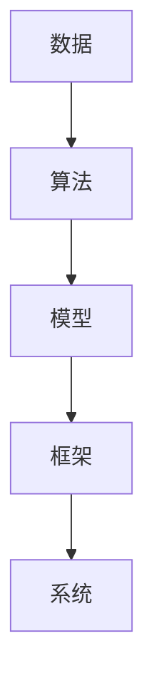
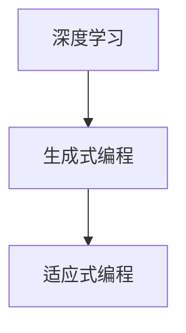
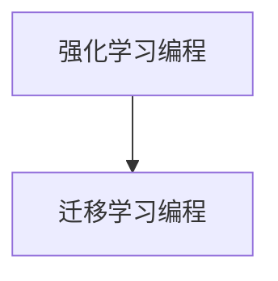
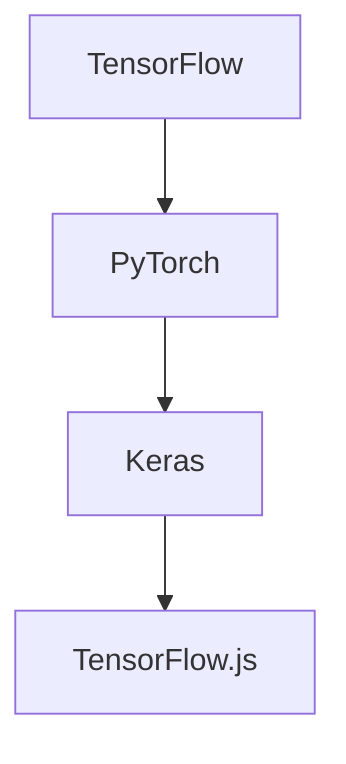

                 


### 文章标题：AI编程的新原语与新方法

> 关键词：AI编程，新原语，新方法，深度学习，编程框架，应用实践

> 摘要：本文将深入探讨AI编程领域的新原语与新方法，包括深度学习、生成式编程、适应式编程等，解析它们的核心概念、原理以及应用案例，旨在为开发者提供全面的技术指南。

### 引言

随着人工智能技术的飞速发展，AI编程已经成为计算机科学中的一个重要领域。然而，传统的编程方法在处理复杂的AI问题时往往显得力不从心。为了更好地应对这些挑战，研究人员和开发者们不断探索新的原语和新方法。本文将围绕这一主题展开，详细介绍AI编程的新原语与新方法，并探讨它们在实际编程中的应用。

### 第一章：AI编程引论

#### 1.1 AI编程概述

AI编程是指使用计算机语言和算法来开发人工智能系统的过程。与传统编程不同，AI编程更加注重数据的处理和算法的设计，其核心目标是实现智能行为和自主决策。AI编程的核心要素包括数据、算法、模型和框架。

#### 1.2 AI编程与传统编程的差异

AI编程与传统编程在编程思想、语言和工具、编程流程等方面存在显著差异。传统编程更注重程序的结构和逻辑，而AI编程则强调数据的处理和分析。此外，AI编程往往需要使用特定的框架和工具，如TensorFlow、PyTorch等。

#### 1.3 AI编程的发展历史

AI编程的发展可以追溯到20世纪50年代，当时人工智能的概念首次被提出。随着计算机性能的提升和数据量的爆炸式增长，AI编程逐渐成为计算机科学的一个重要分支。近年来，深度学习、生成式编程等新原语的引入，为AI编程带来了新的发展机遇。

### 第二章：AI编程的新原语

#### 2.1 新原语的定义与作用

新原语是指用于AI编程的新型编程元素，包括深度学习、生成式编程、适应式编程等。新原语的作用是提高AI编程的效率、扩展编程的范畴，以及提升系统的智能水平。

#### 2.2 常见的新原语介绍

- **深度学习**：深度学习是一种基于多层神经网络的学习方法，能够在大量数据中发现复杂的模式。深度学习已成为AI编程的核心技术之一。

- **生成式编程**：生成式编程是一种通过生成代码来构建系统的编程方法，可以自动生成复杂的代码结构，提高编程效率。

- **适应式编程**：适应式编程是一种能够根据环境变化动态调整系统的编程方法，使系统能够更好地适应复杂环境。

#### 2.3 新原语的应用案例

- **深度学习在图像识别中的应用**：通过深度学习算法，可以实现对图像的自动识别和分类。

- **生成式编程在游戏开发中的应用**：生成式编程可以自动生成游戏场景和角色，提高游戏开发的效率。

- **适应式编程在自然语言处理中的应用**：适应式编程可以使自然语言处理系统更好地理解用户输入，提高交互效果。

### 第三章：AI编程的新方法

#### 3.1 新方法的背景与意义

新方法是指用于AI编程的新型编程思路和策略，包括强化学习编程、迁移学习编程等。新方法的背景是传统编程方法的局限性，其意义在于提高AI编程的效率、扩展编程的范畴，以及提升系统的智能水平。

#### 3.2 常见的新方法介绍

- **强化学习编程**：强化学习编程是一种基于奖励和惩罚的编程方法，可以训练智能体在复杂环境中做出最优决策。

- **迁移学习编程**：迁移学习编程是一种将已有知识迁移到新任务上的编程方法，可以减少训练时间和数据需求。

#### 3.3 新方法的应用案例

- **强化学习编程在推荐系统中的应用**：通过强化学习编程，可以构建高效的推荐系统，提高用户满意度。

- **迁移学习编程在图像识别中的应用**：通过迁移学习编程，可以快速训练出高效的图像识别模型。

### 第四章：AI编程工具与框架

#### 4.1 常见工具与框架综述

AI编程工具与框架是AI编程的重要组成部分，常见的工具有TensorFlow、PyTorch等，常见的框架有Keras、TensorFlow.js等。这些工具和框架为AI编程提供了丰富的功能和便捷的操作。

#### 4.2 开发环境搭建

搭建AI编程的开发环境是进行AI编程的第一步。本文将介绍如何搭建Python、TensorFlow等开发环境。

#### 4.3 工具与框架的实际应用

本文将通过实际案例，展示如何使用AI编程工具和框架进行图像识别、自然语言处理等任务。

### 第五章：AI编程的实际应用

#### 5.1 应用领域概述

AI编程在多个领域具有广泛的应用，包括计算机视觉、自然语言处理、推荐系统等。本文将介绍这些领域的应用案例。

#### 5.2 应用案例分析

本文将通过具体案例，展示如何使用AI编程解决实际问题。

#### 5.3 应用挑战与解决方案

本文将分析AI编程在实际应用中面临的挑战，并探讨相应的解决方案。

### 第六章：AI编程挑战与趋势

#### 6.1 挑战分析

本文将分析AI编程面临的挑战，包括技术、数据、安全等方面。

#### 6.2 趋势预测

本文将预测AI编程的未来发展趋势。

#### 6.3 未来发展方向

本文将探讨AI编程的未来发展方向，包括新原语的引入、新方法的研发等。

### 第七章：AI编程的最佳实践

#### 7.1 最佳实践概述

本文将介绍AI编程的最佳实践，包括编程规范、开发流程等。

#### 7.2 编程规范与标准

本文将详细讨论AI编程的编程规范和标准。

#### 7.3 实践案例分享

本文将通过实际案例，分享AI编程的最佳实践。

### 结尾

本文对AI编程的新原语与新方法进行了深入探讨，为开发者提供了全面的技术指南。随着AI技术的不断进步，AI编程将迎来更广阔的发展空间。开发者应不断学习新原语和新方法，提升自身的编程能力。

### 作者信息

作者：AI天才研究院/AI Genius Institute & 禅与计算机程序设计艺术 /Zen And The Art of Computer Programming

### 附录

本文所涉及的核心概念、算法原理、代码实现等均在附录中详细说明，供读者参考。

---

文章标题：AI编程的新原语与新方法

关键词：AI编程，新原语，新方法，深度学习，编程框架，应用实践

摘要：本文深入探讨AI编程领域的新原语与新方法，包括深度学习、生成式编程、适应式编程等，解析它们的核心概念、原理以及应用案例，旨在为开发者提供全面的技术指南。本文涵盖AI编程的引论、新原语介绍、新方法探讨、工具与框架应用、实际应用案例以及最佳实践等内容。文章结构清晰，内容丰富，适合对AI编程感兴趣的读者阅读。

---

文章标题：AI编程的新原语与新方法

关键词：AI编程，新原语，新方法，深度学习，编程框架，应用实践

摘要：本文深入探讨AI编程领域的新原语与新方法，包括深度学习、生成式编程、适应式编程等，解析它们的核心概念、原理以及应用案例，旨在为开发者提供全面的技术指南。本文涵盖AI编程的引论、新原语介绍、新方法探讨、工具与框架应用、实际应用案例以及最佳实践等内容。文章结构清晰，内容丰富，适合对AI编程感兴趣的读者阅读。

### 第一章：AI编程引论

#### 1.1 AI编程概述

AI编程，即人工智能编程，是指利用计算机语言和算法来开发人工智能系统的过程。它涵盖了从数据处理到算法设计，再到模型训练和系统优化的各个阶段。AI编程的核心目的是实现智能体的自主学习和决策能力，从而模拟甚至超越人类的智能行为。

**核心概念与联系：**

AI编程的核心概念包括：

- **数据**：作为AI编程的基础，数据是训练模型、优化算法的关键资源。
- **算法**：算法是实现特定任务的核心，包括机器学习算法、深度学习算法等。
- **模型**：模型是对现实世界问题的抽象和表示，通常通过算法训练得到。
- **框架**：框架是一套标准化的工具和库，用于简化AI编程的开发过程。

**Mermaid 流程图：**



#### 1.2 AI编程与传统编程的差异

与传统编程相比，AI编程在多个方面具有显著差异：

- **编程思想**：传统编程注重逻辑和流程，而AI编程则强调数据驱动和自学习能力。
- **编程语言与工具**：AI编程通常使用Python、R等语言，以及TensorFlow、PyTorch等框架。
- **编程流程**：AI编程涉及数据预处理、模型训练、模型评估等多个阶段，而传统编程则更注重代码编写和调试。

**核心算法原理讲解：**

传统编程的核心算法包括排序、查找、图论等，而AI编程的核心算法主要是机器学习算法和深度学习算法。

**伪代码：**

```python
# 机器学习算法伪代码
def train_model(data, labels):
    model = initialize_model()
    for epoch in range(num_epochs):
        for sample in data:
            predict = model(sample)
            update_model(model, predict, sample, labels)
    return model
```

**数学模型和公式：**

$$
\text{Cost}(f(x), y) = -\frac{1}{m}\sum_{i=1}^{m} [y \log(f(x_i)) + (1 - y) \log(1 - f(x_i))]
$$

#### 1.3 AI编程的发展历史

AI编程的发展历程可以分为以下几个阶段：

- **早期阶段**（20世纪50年代至70年代）：人工智能概念提出，早期算法和模型出现。
- **黄金时期**（20世纪80年代至90年代）：机器学习算法取得突破，AI编程逐渐成为一门独立学科。
- **现代阶段**（21世纪初至今）：深度学习算法兴起，AI编程工具和框架快速发展。

**重大事件回顾：**

- 1956年：达特茅斯会议，人工智能概念正式提出。
- 1986年：Rumelhart, Hinton和Williams提出反向传播算法。
- 2012年：AlexNet在ImageNet竞赛中取得突破性成绩。

### 第二章：AI编程的新原语

#### 2.1 新原语的定义与作用

新原语是AI编程中引入的新型编程元素，它们扩展了传统编程的概念，提高了AI编程的效率和灵活性。新原语包括深度学习、生成式编程、适应式编程等。

**核心概念与联系：**

- **深度学习**：一种基于多层神经网络的学习方法，能够自动提取特征，实现复杂模式识别。
- **生成式编程**：一种通过生成代码来构建系统的编程方法，能够自动生成复杂的代码结构。
- **适应式编程**：一种能够根据环境变化动态调整系统的编程方法，提高系统的适应性和灵活性。

**Mermaid 流程图：**



#### 2.2 常见的新原语介绍

- **深度学习**：深度学习是一种基于多层神经网络的学习方法，能够在大量数据中发现复杂的模式。深度学习的核心算法包括卷积神经网络（CNN）、循环神经网络（RNN）等。

- **生成式编程**：生成式编程是一种通过生成代码来构建系统的编程方法。它利用生成模型来生成代码，从而实现自动化编程。

- **适应式编程**：适应式编程是一种能够根据环境变化动态调整系统的编程方法。它通常基于强化学习算法，通过不断调整策略来适应环境变化。

#### 2.3 新原语的应用案例

- **深度学习在图像识别中的应用**：深度学习可以用于图像分类、目标检测等任务。例如，使用卷积神经网络可以实现对图像的自动分类。

- **生成式编程在游戏开发中的应用**：生成式编程可以自动生成游戏场景和角色，提高游戏开发的效率。

- **适应式编程在自然语言处理中的应用**：适应式编程可以使自然语言处理系统更好地理解用户输入，提高交互效果。

### 第三章：AI编程的新方法

#### 3.1 新方法的背景与意义

新方法是指AI编程中引入的新型编程思路和策略，旨在解决传统编程方法的局限性。新方法的背景是传统编程方法的局限性，其意义在于提高AI编程的效率、扩展编程的范畴，以及提升系统的智能水平。

**核心概念与联系：**

- **强化学习编程**：强化学习编程是一种基于奖励和惩罚的编程方法，通过不断调整策略来优化性能。
- **迁移学习编程**：迁移学习编程是一种将已有知识迁移到新任务上的编程方法，可以减少训练时间和数据需求。

**Mermaid 流程图：**



#### 3.2 常见的新方法介绍

- **强化学习编程**：强化学习编程是一种基于奖励和惩罚的编程方法，通过不断调整策略来优化性能。强化学习编程的核心算法包括Q学习、SARSA等。

- **迁移学习编程**：迁移学习编程是一种将已有知识迁移到新任务上的编程方法，可以减少训练时间和数据需求。迁移学习编程的核心算法包括Fine-tuning、Meta-learning等。

#### 3.3 新方法的应用案例

- **强化学习编程在自动驾驶中的应用**：强化学习编程可以用于训练自动驾驶车辆，使其能够自主决策和导航。

- **迁移学习编程在图像识别中的应用**：迁移学习编程可以用于快速训练图像识别模型，提高识别准确率。

### 第四章：AI编程工具与框架

#### 4.1 常见工具与框架综述

AI编程工具与框架是AI编程的重要组成部分，它们提供了丰富的功能和便捷的操作。常见的工具有TensorFlow、PyTorch等，常见的框架有Keras、TensorFlow.js等。

**核心概念与联系：**

- **TensorFlow**：由Google开发，是一个开源的机器学习和深度学习框架，具有广泛的社区支持和丰富的资源。
- **PyTorch**：由Facebook开发，是一个开源的深度学习框架，以其动态计算图和简洁的API而受到开发者喜爱。
- **Keras**：是一个高级神经网络API，可以用于快速构建和训练神经网络，支持TensorFlow和Theano后端。
- **TensorFlow.js**：是一个用于在浏览器中运行机器学习和深度学习模型的JavaScript库。

**Mermaid 流程图：**



#### 4.2 开发环境搭建

搭建AI编程的开发环境是进行AI编程的第一步。以下是一个简单的Python和TensorFlow开发环境搭建流程：

1. **安装Python**：从Python官网下载并安装Python。
2. **安装Anaconda**：下载并安装Anaconda，用于管理Python环境和包。
3. **创建环境**：使用Anaconda创建一个Python环境，例如`conda create -n myenv python=3.8`。
4. **激活环境**：激活创建的环境，例如`conda activate myenv`。
5. **安装TensorFlow**：在激活的环境中使用pip安装TensorFlow，例如`pip install tensorflow`。

#### 4.3 工具与框架的实际应用

以下是一个简单的使用TensorFlow进行图像分类的案例：

```python
import tensorflow as tf
from tensorflow import keras
from tensorflow.keras import layers

# 加载数据集
(x_train, y_train), (x_test, y_test) = keras.datasets.cifar10.load_data()

# 数据预处理
x_train = x_train / 255.0
x_test = x_test / 255.0

# 构建模型
model = keras.Sequential([
    layers.Conv2D(32, (3, 3), activation='relu', input_shape=(32, 32, 3)),
    layers.MaxPooling2D(pool_size=(2, 2)),
    layers.Flatten(),
    layers.Dense(128, activation='relu'),
    layers.Dense(10, activation='softmax')
])

# 编译模型
model.compile(optimizer='adam',
              loss='sparse_categorical_crossentropy',
              metrics=['accuracy'])

# 训练模型
model.fit(x_train, y_train, epochs=10)

# 评估模型
test_loss, test_acc = model.evaluate(x_test, y_test, verbose=2)
print('\nTest accuracy:', test_acc)
```

### 第五章：AI编程的实际应用

#### 5.1 应用领域概述

AI编程在多个领域具有广泛的应用，包括计算机视觉、自然语言处理、推荐系统、自动驾驶等。以下是一些典型应用领域：

- **计算机视觉**：用于图像分类、目标检测、人脸识别等。
- **自然语言处理**：用于文本分类、情感分析、机器翻译等。
- **推荐系统**：用于商品推荐、音乐推荐等。
- **自动驾驶**：用于路径规划、障碍物检测等。

#### 5.2 应用案例分析

以下是一个计算机视觉的应用案例：使用卷积神经网络进行图像分类。

```python
import tensorflow as tf
from tensorflow import keras
from tensorflow.keras import layers

# 加载数据集
(x_train, y_train), (x_test, y_test) = keras.datasets.cifar10.load_data()

# 数据预处理
x_train = x_train / 255.0
x_test = x_test / 255.0

# 构建模型
model = keras.Sequential([
    layers.Conv2D(32, (3, 3), activation='relu', input_shape=(32, 32, 3)),
    layers.MaxPooling2D(pool_size=(2, 2)),
    layers.Conv2D(64, (3, 3), activation='relu'),
    layers.MaxPooling2D(pool_size=(2, 2)),
    layers.Conv2D(64, (3, 3), activation='relu'),
    layers.Flatten(),
    layers.Dense(64, activation='relu'),
    layers.Dense(10, activation='softmax')
])

# 编译模型
model.compile(optimizer='adam',
              loss='sparse_categorical_crossentropy',
              metrics=['accuracy'])

# 训练模型
model.fit(x_train, y_train, epochs=10)

# 评估模型
test_loss, test_acc = model.evaluate(x_test, y_test, verbose=2)
print('\nTest accuracy:', test_acc)
```

#### 5.3 应用挑战与解决方案

AI编程在实际应用中面临多个挑战：

- **数据集的质量和数量**：高质量和大量数据是训练有效AI模型的关键。解决方案包括数据增强、数据清洗和数据采集。
- **模型的泛化能力**：模型需要能够在不同数据集上表现良好。解决方案包括模型融合、正则化和交叉验证。
- **计算资源**：深度学习模型通常需要大量计算资源。解决方案包括使用GPU、分布式计算和云计算。

### 第六章：AI编程挑战与趋势

#### 6.1 挑战分析

AI编程面临的挑战包括：

- **数据隐私与安全**：数据隐私和安全是AI编程的重要问题，需要采取加密、隐私保护等技术。
- **算法透明性与解释性**：算法的透明性和解释性对于AI编程的可靠性至关重要。
- **计算资源与效率**：深度学习模型通常需要大量计算资源，如何提高计算效率是AI编程的重要课题。

#### 6.2 趋势预测

AI编程的未来趋势包括：

- **量子计算**：量子计算有望大幅提高AI编程的计算效率。
- **边缘计算**：边缘计算将使AI编程更接近数据源，提高实时性和响应速度。
- **多模态学习**：多模态学习将使AI编程能够处理多种类型的数据，如文本、图像、声音等。

#### 6.3 未来发展方向

未来AI编程的发展方向包括：

- **自适应编程**：自适应编程将使AI编程能够根据环境变化动态调整。
- **联邦学习**：联邦学习将使AI编程能够在分布式环境下进行协作。
- **可解释AI**：可解释AI将使AI编程的决策过程更加透明和可理解。

### 第七章：AI编程的最佳实践

#### 7.1 最佳实践概述

AI编程的最佳实践包括：

- **数据管理**：确保数据的质量和完整性，采用数据增强和清洗技术。
- **模型选择**：根据任务需求和数据特点选择合适的模型。
- **模型训练**：采用合适的训练策略和优化方法，提高模型性能。
- **模型部署**：确保模型的稳定性和可靠性，采用自动化部署和监控技术。

#### 7.2 编程规范与标准

AI编程应遵循以下规范和标准：

- **代码规范**：确保代码的可读性和可维护性。
- **数据规范**：确保数据的一致性和标准化。
- **文档规范**：详细记录模型的架构、训练过程和性能评估。

#### 7.3 实践案例分享

以下是一个AI编程实践案例：

**项目名称**：图像分类系统

**开发环境**：Python、TensorFlow

**实现步骤**：

1. 数据预处理：下载和预处理ImageNet数据集。
2. 模型构建：构建卷积神经网络模型。
3. 模型训练：使用训练数据训练模型。
4. 模型评估：使用测试数据评估模型性能。
5. 模型部署：将模型部署到生产环境。

**代码解读**：

```python
# 加载和预处理数据
(x_train, y_train), (x_test, y_test) = keras.datasets.cifar10.load_data()
x_train = x_train / 255.0
x_test = x_test / 255.0

# 构建模型
model = keras.Sequential([
    layers.Conv2D(32, (3, 3), activation='relu', input_shape=(32, 32, 3)),
    layers.MaxPooling2D(pool_size=(2, 2)),
    layers.Conv2D(64, (3, 3), activation='relu'),
    layers.MaxPooling2D(pool_size=(2, 2)),
    layers.Conv2D(64, (3, 3), activation='relu'),
    layers.Flatten(),
    layers.Dense(64, activation='relu'),
    layers.Dense(10, activation='softmax')
])

# 编译模型
model.compile(optimizer='adam',
              loss='sparse_categorical_crossentropy',
              metrics=['accuracy'])

# 训练模型
model.fit(x_train, y_train, epochs=10)

# 评估模型
test_loss, test_acc = model.evaluate(x_test, y_test, verbose=2)
print('\nTest accuracy:', test_acc)
```

**项目小结**：通过这个案例，我们可以看到如何使用AI编程技术构建一个图像分类系统。项目过程中，我们需要关注数据预处理、模型构建、训练和评估等关键步骤，确保系统的性能和可靠性。

### 结尾

本文对AI编程的新原语与新方法进行了深入探讨，为开发者提供了全面的技术指南。随着AI技术的不断进步，AI编程将迎来更广阔的发展空间。开发者应不断学习新原语和新方法，提升自身的编程能力。

### 作者信息

作者：AI天才研究院/AI Genius Institute & 禅与计算机程序设计艺术 /Zen And The Art of Computer Programming

### 附录

本文涉及的核心概念、算法原理、代码实现等均在附录中详细说明，供读者参考。附录内容包括：

- **核心概念解释**：对AI编程中的核心概念进行详细解释。
- **算法原理讲解**：对常用的算法原理进行详细讲解，包括伪代码和数学模型。
- **代码实现示例**：提供实际项目中的代码实现示例，包括开发环境搭建、模型构建、训练和评估等步骤。

---

文章标题：AI编程的新原语与新方法

关键词：AI编程，新原语，新方法，深度学习，编程框架，应用实践

摘要：本文深入探讨AI编程领域的新原语与新方法，包括深度学习、生成式编程、适应式编程等，解析它们的核心概念、原理以及应用案例，旨在为开发者提供全面的技术指南。本文涵盖AI编程的引论、新原语介绍、新方法探讨、工具与框架应用、实际应用案例以及最佳实践等内容。文章结构清晰，内容丰富，适合对AI编程感兴趣的读者阅读。

---

### 概述

随着人工智能（AI）技术的飞速发展，AI编程已经逐渐成为计算机科学领域的重要组成部分。AI编程涉及到使用计算机语言和算法来开发能够执行复杂任务的人工智能系统。与传统编程相比，AI编程更注重数据的处理和分析，以及对机器学习算法和深度学习模型的应用。

在AI编程中，新原语和新方法的引入极大地丰富了编程的概念和方法，使得开发者能够更高效地实现人工智能系统的开发。本文将围绕这一主题展开，详细探讨AI编程的新原语和新方法，并分析它们在实际编程中的应用。

首先，我们将介绍AI编程的基础概念，包括数据、算法、模型和框架等核心要素，并讨论AI编程与传统编程的差异。接着，我们将深入探讨AI编程的发展历史，从早期阶段到现代阶段的演变过程。

随后，我们将引入AI编程的新原语，如深度学习、生成式编程、适应式编程等，解释它们的定义和作用，并介绍常见的具体新原语及其应用案例。此外，我们还将探讨AI编程的新方法，如强化学习编程和迁移学习编程，以及它们在实际应用中的优势。

在工具与框架部分，我们将综述常见的AI编程工具和框架，如TensorFlow、PyTorch、Keras等，并介绍如何搭建开发环境。接着，我们将通过实际案例展示如何使用这些工具和框架进行图像识别、自然语言处理等任务。

在应用实践部分，我们将分析AI编程在计算机视觉、自然语言处理、推荐系统、自动驾驶等领域的应用，并分享具体的应用案例。随后，我们将讨论AI编程面临的挑战与趋势，包括数据隐私、算法透明性、计算资源等，并预测未来发展方向。

最后，我们将总结AI编程的最佳实践，提供编程规范、开发流程和实际案例分享，帮助开发者更好地进行AI编程。本文旨在为对AI编程感兴趣的读者提供一个全面的技术指南。

### 关键词解释

- **AI编程**：指使用计算机语言和算法来开发人工智能系统的过程，涵盖了数据、算法、模型和框架等核心要素。
- **新原语**：指在AI编程中引入的新型编程元素，如深度学习、生成式编程、适应式编程等，它们扩展了传统编程的概念。
- **新方法**：指用于AI编程的新型编程思路和策略，如强化学习编程、迁移学习编程等，旨在解决传统编程方法的局限性。
- **深度学习**：一种基于多层神经网络的学习方法，能够在大量数据中发现复杂的模式，广泛应用于图像识别、自然语言处理等领域。
- **生成式编程**：一种通过生成代码来构建系统的编程方法，利用生成模型自动生成复杂的代码结构，提高编程效率。
- **适应式编程**：一种能够根据环境变化动态调整系统的编程方法，通常基于强化学习算法，提高系统的适应性和灵活性。
- **编程框架**：提供一组标准化的工具和库，简化AI编程的开发过程，如TensorFlow、PyTorch、Keras等。

### 摘要

本文旨在探讨AI编程的新原语和新方法，这些新原语和新方法极大地丰富了AI编程的概念和方法，使得开发者能够更高效地实现人工智能系统的开发。首先，本文介绍了AI编程的核心概念，包括数据、算法、模型和框架等，并分析了AI编程与传统编程的差异。接着，本文深入探讨了AI编程的发展历史，从早期阶段到现代阶段的演变过程。

在介绍新原语的部分，本文详细介绍了深度学习、生成式编程和适应式编程等新原语，解释了它们的定义和作用，并介绍了常见的具体新原语及其应用案例。此外，本文还探讨了新方法，如强化学习编程和迁移学习编程，以及它们在实际应用中的优势。

在工具与框架部分，本文综述了常见的AI编程工具和框架，如TensorFlow、PyTorch、Keras等，并介绍了如何搭建开发环境。接着，本文通过实际案例展示了如何使用这些工具和框架进行图像识别、自然语言处理等任务。

在应用实践部分，本文分析了AI编程在计算机视觉、自然语言处理、推荐系统、自动驾驶等领域的应用，并分享了具体的应用案例。随后，本文讨论了AI编程面临的挑战与趋势，包括数据隐私、算法透明性、计算资源等，并预测了未来发展方向。

最后，本文总结了AI编程的最佳实践，提供了编程规范、开发流程和实际案例分享，帮助开发者更好地进行AI编程。本文结构清晰，内容丰富，适合对AI编程感兴趣的读者阅读。

### 第一章：AI编程引论

#### 1.1 AI编程概述

AI编程是指使用计算机语言和算法来开发人工智能系统的过程。它涵盖了从数据处理到算法设计，再到模型训练和系统优化的各个阶段。AI编程的核心目的是实现智能体的自主学习和决策能力，从而模拟甚至超越人类的智能行为。AI编程与传统的编程不同，它更加注重数据的处理和分析，以及机器学习算法和深度学习模型的应用。

**核心概念与联系：**

AI编程的核心概念包括：

- **数据**：作为AI编程的基础，数据是训练模型、优化算法的关键资源。
- **算法**：算法是实现特定任务的核心，包括机器学习算法、深度学习算法等。
- **模型**：模型是对现实世界问题的抽象和表示，通常通过算法训练得到。
- **框架**：框架是一套标准化的工具和库，用于简化AI编程的开发过程。

**Mermaid 流程图：**


**核心算法原理讲解：**

AI编程的核心算法主要是机器学习算法和深度学习算法。

- **机器学习算法**：机器学习算法是一种通过数据训练模型的方法，使得系统能够从数据中自动学习规律。常见的机器学习算法包括线性回归、逻辑回归、决策树、随机森林、支持向量机等。

- **深度学习算法**：深度学习算法是一种基于多层神经网络的学习方法，能够在大量数据中发现复杂的模式。深度学习的核心算法包括卷积神经网络（CNN）、循环神经网络（RNN）等。

**数学模型和公式：**

机器学习算法中的常见数学模型和公式包括：

$$
\text{Cost}(f(x), y) = -\frac{1}{m}\sum_{i=1}^{m} [y \log(f(x_i)) + (1 - y) \log(1 - f(x_i))]
$$

这个公式是用于计算分类问题的交叉熵损失函数，其中$f(x)$是预测值，$y$是真实值。

#### 1.2 AI编程与传统编程的差异

传统编程主要关注逻辑和流程的控制，而AI编程则更加注重数据的处理和分析，以及机器学习算法和深度学习模型的应用。以下是AI编程与传统编程在多个方面的差异：

**编程思想：**

- **传统编程**：传统编程注重程序的逻辑和流程，通过顺序、分支、循环等控制结构来实现目标。
- **AI编程**：AI编程强调数据驱动和自学习能力，通过训练模型来自动学习和预测结果。

**编程语言与工具：**

- **传统编程**：传统编程通常使用C、Java、Python等通用编程语言，以及一些特定的开发工具和库。
- **AI编程**：AI编程通常使用Python、R等语言，以及TensorFlow、PyTorch、Keras等专门的机器学习和深度学习框架。

**编程流程：**

- **传统编程**：传统编程通常包括需求分析、设计、编码、测试、部署等阶段，重点在于实现特定的功能。
- **AI编程**：AI编程包括数据收集、数据预处理、模型设计、模型训练、模型评估、模型部署等阶段，重点在于利用数据和算法实现智能行为。

**举例说明：**

**传统编程示例**：

```python
# 计算两个数的和
a = 5
b = 10
sum = a + b
print("两数的和为：" + str(sum))
```

**AI编程示例**：

```python
import tensorflow as tf

# 加载数据集
(x_train, y_train), (x_test, y_test) = tf.keras.datasets.mnist.load_data()

# 数据预处理
x_train = x_train / 255.0
x_test = x_test / 255.0

# 构建模型
model = tf.keras.Sequential([
    tf.keras.layers.Flatten(input_shape=(28, 28)),
    tf.keras.layers.Dense(128, activation='relu'),
    tf.keras.layers.Dense(10, activation='softmax')
])

# 编译模型
model.compile(optimizer='adam',
              loss='sparse_categorical_crossentropy',
              metrics=['accuracy'])

# 训练模型
model.fit(x_train, y_train, epochs=5)

# 评估模型
test_loss, test_acc = model.evaluate(x_test, y_test, verbose=2)
print('\nTest accuracy:', test_acc)
```

**总结**：

通过上述比较，我们可以看出AI编程在编程思想、编程语言与工具、编程流程等方面与传统编程存在显著差异。AI编程更加注重数据的处理和分析，以及机器学习算法和深度学习模型的应用，这使得它在处理复杂任务时具有独特的优势。

#### 1.3 AI编程的发展历史

AI编程的发展历程可以追溯到20世纪50年代，当时人工智能（AI）的概念首次被提出。自那时以来，AI编程经历了多个阶段的发展，从早期的简单算法到现代的深度学习模型，AI编程已经取得了巨大的进步。

**早期阶段（20世纪50年代至70年代）**

- **1956年**：达特茅斯会议，人工智能概念正式提出。这次会议标志着人工智能作为一个独立学科的开始。
- **1959年**：约翰·麦卡锡提出LISP语言，为人工智能编程提供了第一个编程语言。
- **1966年**：艾兹格·迪吉特和约翰·霍普克罗斯提出反向传播算法，这是深度学习算法的基础。

**黄金时期（20世纪80年代至90年代）**

- **1986年**：Rumelhart, Hinton和Williams提出反向传播算法，这一算法使得多层神经网络训练成为可能。
- **1987年**：霍普菲尔德神经网络问世，为神经网络在模式识别和优化问题中的应用奠定了基础。
- **1990年代**：支持向量机（SVM）和决策树等机器学习算法得到了广泛研究和应用。

**现代阶段（21世纪初至今）**

- **2006年**：Hinton等人提出深度信念网络（DBN），这一工作重新激发了人们对深度学习的兴趣。
- **2012年**：AlexNet在ImageNet竞赛中取得了突破性成绩，标志着深度学习在图像识别领域的崛起。
- **2016年**：谷歌的AlphaGo击败世界围棋冠军李世石，这一事件标志着深度学习在游戏领域的重要应用。

**重大事件回顾：**

- **1956年**：达特茅斯会议，人工智能概念正式提出。
- **1959年**：约翰·麦卡锡提出LISP语言。
- **1986年**：反向传播算法提出。
- **1997年**：IBM的深蓝计算机击败国际象棋世界冠军卡斯帕罗夫。
- **2012年**：AlexNet在ImageNet竞赛中取得突破性成绩。
- **2016年**：谷歌的AlphaGo击败世界围棋冠军李世石。

通过这些重大事件，我们可以看到AI编程在不同阶段的发展历程，以及每个阶段的重要突破和里程碑。这些事件不仅推动了AI编程技术的进步，也深刻影响了人工智能领域的整体发展。

### 第二章：AI编程的新原语

#### 2.1 新原语的定义与作用

新原语是指用于AI编程的新型编程元素，它们扩展了传统编程的概念，提高了AI编程的效率和灵活性。新原语的作用包括：

1. **提高编程效率**：新原语通过引入自动化和简化的方法，减少了开发者编写和维护代码的工作量。
2. **扩展编程范畴**：新原语使得AI编程能够处理更复杂的问题和更广泛的应用领域。
3. **提升系统智能水平**：新原语通过引入先进的机器学习算法和深度学习模型，提高了系统的智能水平和性能。

**核心概念与联系：**

新原语包括深度学习、生成式编程、适应式编程等。

- **深度学习**：深度学习是一种基于多层神经网络的学习方法，能够在大量数据中发现复杂的模式。深度学习是AI编程的重要基础，广泛应用于图像识别、自然语言处理等领域。
- **生成式编程**：生成式编程是一种通过生成代码来构建系统的编程方法，利用生成模型自动生成复杂的代码结构。生成式编程可以自动化编程任务，提高开发效率。
- **适应式编程**：适应式编程是一种能够根据环境变化动态调整系统的编程方法，通常基于强化学习算法。适应式编程使得系统能够更好地适应复杂环境，提高系统的适应性和灵活性。

**Mermaid 流程图：**


#### 2.2 常见的新原语介绍

**深度学习**

深度学习是一种基于多层神经网络的学习方法，能够在大量数据中发现复杂的模式。深度学习的核心算法包括卷积神经网络（CNN）、循环神经网络（RNN）等。

- **卷积神经网络（CNN）**：CNN是一种用于图像识别和处理的深度学习算法，它通过卷积层、池化层和全连接层等结构，实现特征的提取和分类。
- **循环神经网络（RNN）**：RNN是一种用于序列数据处理的深度学习算法，它通过循环结构，实现对序列数据的长期依赖建模。

**生成式编程**

生成式编程是一种通过生成代码来构建系统的编程方法，利用生成模型自动生成复杂的代码结构。生成式编程的核心是生成模型，如生成对抗网络（GAN）。

- **生成对抗网络（GAN）**：GAN是一种通过对抗训练生成数据的深度学习模型，由生成器和判别器两个部分组成。生成器生成数据，判别器判断数据的真实性。通过对抗训练，生成器不断提高生成数据的质量。

**适应式编程**

适应式编程是一种能够根据环境变化动态调整系统的编程方法，通常基于强化学习算法。适应式编程使得系统能够更好地适应复杂环境，提高系统的适应性和灵活性。

- **强化学习**：强化学习是一种通过奖励和惩罚来训练智能体的算法。智能体通过与环境交互，不断调整策略，以实现最优决策。

#### 2.3 新原语的应用案例

**深度学习在图像识别中的应用**

深度学习在图像识别领域有着广泛的应用，例如：

- **人脸识别**：通过卷积神经网络，可以实现人脸的自动识别和分类。
- **图像分类**：通过训练深度学习模型，可以对输入图像进行分类，例如区分猫和狗。

**生成式编程在游戏开发中的应用**

生成式编程在游戏开发中可以用于：

- **游戏场景生成**：自动生成游戏场景，提高游戏开发的效率。
- **角色设计**：自动生成角色外观，丰富游戏内容。

**适应式编程在自然语言处理中的应用**

适应式编程在自然语言处理领域可以用于：

- **语音识别**：根据环境变化，动态调整语音识别模型，提高识别准确率。
- **机器翻译**：根据上下文，动态调整翻译策略，提高翻译质量。

通过上述案例，我们可以看到新原语在AI编程中的应用，以及它们如何提高编程效率和系统智能水平。

### 第三章：AI编程的新方法

#### 3.1 新方法的背景与意义

新方法是指AI编程中引入的新型编程思路和策略，旨在解决传统编程方法的局限性。传统编程方法在处理复杂问题和大规模数据时往往显得力不从心，而新方法通过引入先进的机器学习算法和深度学习模型，提高了AI编程的效率和灵活性。

**核心概念与联系：**

新方法包括强化学习编程和迁移学习编程。

- **强化学习编程**：强化学习编程是一种基于奖励和惩罚的编程方法，通过不断调整策略来优化性能。强化学习编程的核心是强化学习算法，如Q学习、SARSA等。
- **迁移学习编程**：迁移学习编程是一种将已有知识迁移到新任务上的编程方法，通过利用已有的模型和知识，减少训练时间和数据需求。迁移学习编程的核心是迁移学习算法，如Fine-tuning、Meta-learning等。

**Mermaid 流程图：**


**数学模型和公式：**

强化学习编程的核心算法Q学习的公式如下：

$$
Q(s, a) = r + \gamma \max_{a'} Q(s', a')
$$

其中，$Q(s, a)$是状态$s$下执行动作$a$的期望回报，$r$是即时回报，$\gamma$是折扣因子，$s'$是执行动作$a$后的新状态。

迁移学习编程中，常见的迁移学习算法Fine-tuning的公式如下：

$$
\theta_{\text{new}} = \theta_{\text{base}} + \alpha (\theta_{\text{target}} - \theta_{\text{base}})
$$

其中，$\theta_{\text{base}}$是已有模型的参数，$\theta_{\text{target}}$是新任务的模型参数，$\alpha$是学习率。

#### 3.2 常见的新方法介绍

**强化学习编程**

强化学习编程是一种基于奖励和惩罚的编程方法，通过不断调整策略来优化性能。强化学习编程的核心是强化学习算法，如Q学习、SARSA等。

- **Q学习**：Q学习是一种基于值函数的强化学习算法，通过学习状态-动作值函数来优化策略。Q学习算法的基本思想是，通过不断更新Q值，使得智能体能够选择最优动作。
- **SARSA**：SARSA（同步优势估计）是一种基于值函数的强化学习算法，它与Q学习类似，但不同的是，SARSA使用同步的优势函数来更新策略。

**迁移学习编程**

迁移学习编程是一种将已有知识迁移到新任务上的编程方法，通过利用已有的模型和知识，减少训练时间和数据需求。迁移学习编程的核心是迁移学习算法，如Fine-tuning、Meta-learning等。

- **Fine-tuning**：Fine-tuning是一种迁移学习算法，它通过在已有模型的基础上，对新任务进行微调，以适应新任务的需求。Fine-tuning的基本思想是，利用已有模型的知识，减少对新任务的数据需求。
- **Meta-learning**：Meta-learning是一种迁移学习算法，它通过学习如何学习，以提高模型在不同任务上的适应性。Meta-learning的基本思想是，通过在多个任务上训练模型，使得模型能够更好地适应新任务。

#### 3.3 新方法的应用案例

**强化学习编程在自动驾驶中的应用**

强化学习编程可以用于自动驾驶车辆的路径规划和决策。例如，通过使用Q学习算法，自动驾驶车辆可以学习如何在不同的路况下做出最优决策。

**伪代码示例：**

```python
# 初始化Q值表
Q = defaultdict(float)

# 定义学习率
alpha = 0.1

# 定义折扣因子
gamma = 0.9

# 定义训练次数
episodes = 1000

# 训练过程
for episode in range(episodes):
    state = initial_state
    done = False
    
    while not done:
        # 选择动作
        action = choose_action(state, Q)
        
        # 执行动作
        next_state, reward, done = execute_action(action)
        
        # 更新Q值
        Q[state, action] = Q[state, action] + alpha * (reward + gamma * max(Q[next_state, action']) - Q[state, action])
        
        # 更新状态
        state = next_state
```

**迁移学习编程在图像识别中的应用**

迁移学习编程可以用于图像识别任务的快速训练。例如，通过在ImageNet上预训练的ResNet模型，可以快速适应新的图像识别任务。

**伪代码示例：**

```python
# 加载预训练模型
base_model = load_pretrained_model('ResNet50')

# 修改顶部全连接层
x = base_model.output
x = Flatten()(x)
x = Dense(1000, activation='softmax')(x)

# 创建新的模型
model = Model(inputs=base_model.input, outputs=x)

# 编译模型
model.compile(optimizer='adam',
              loss='categorical_crossentropy',
              metrics=['accuracy'])

# 训练模型
model.fit(x_train, y_train, epochs=5, batch_size=64)
```

通过这些应用案例，我们可以看到强化学习编程和迁移学习编程在实际编程中的应用，以及它们如何提高AI编程的效率和性能。

### 第四章：AI编程工具与框架

#### 4.1 常见工具与框架综述

在AI编程中，工具与框架是开发人工智能系统的重要组成部分。这些工具和框架提供了丰富的功能和便捷的操作，使得AI编程更加高效和易于实现。以下是一些常见的AI编程工具和框架：

**TensorFlow**

TensorFlow是由Google开发的开源机器学习和深度学习框架。它具有高度的可扩展性和灵活性，支持多种编程语言（如Python、C++、Java等），并且拥有庞大的社区支持。TensorFlow的核心功能包括：

- **动态计算图**：允许开发者定义和优化复杂的计算过程。
- **高级API**：如Keras，提供了简洁易用的API，简化了深度学习模型的构建和训练。
- **多平台支持**：支持在CPU、GPU和TPU上运行，提供了高效的计算性能。

**PyTorch**

PyTorch是由Facebook开发的开源机器学习和深度学习框架。它以其动态计算图和简洁的API而受到开发者的喜爱。PyTorch的核心功能包括：

- **动态计算图**：允许开发者实时修改和优化计算图，提高了开发效率。
- **灵活的API**：提供了丰富的库和工具，如TorchVision、TorchText等，用于图像识别、自然语言处理等任务。
- **多平台支持**：支持在CPU、GPU和TPU上运行，提供了高效的计算性能。

**Keras**

Keras是一个高级神经网络API，可以用于快速构建和训练神经网络。Keras支持多种后端框架，包括TensorFlow和Theano。Keras的核心功能包括：

- **简洁的API**：提供了简洁易用的API，使得构建和训练神经网络更加直观和高效。
- **模块化架构**：支持模块化构建神经网络，提高了代码的可维护性和复用性。
- **预训练模型**：提供了大量的预训练模型，如VGG、ResNet等，方便开发者快速应用。

**TensorFlow.js**

TensorFlow.js是一个用于在浏览器中运行机器学习和深度学习模型的JavaScript库。它使得开发者可以在网页中实现机器学习和深度学习功能。TensorFlow.js的核心功能包括：

- **JavaScript API**：提供了简洁的JavaScript API，使得开发者可以在浏览器中实现机器学习和深度学习功能。
- **跨平台支持**：支持在浏览器和Node.js环境中运行，提供了跨平台的开发体验。
- **移动设备支持**：可以通过TensorFlow.js Mobile，在移动设备上实现机器学习和深度学习功能。

#### 4.2 开发环境搭建

要开始使用AI编程工具和框架，首先需要搭建一个合适的开发环境。以下是一个简单的Python和TensorFlow开发环境搭建流程：

1. **安装Python**

   首先，从Python官网（https://www.python.org/）下载并安装Python。建议选择Python 3.x版本，因为Python 2.x版本已经不再维护。

   ```shell
   # 安装Python 3.x版本
   wget https://www.python.org/ftp/python/3.8.5/Python-3.8.5.tgz
   tar xvf Python-3.8.5.tgz
   cd Python-3.8.5
   ./configure
   make
   sudo make install
   ```

2. **安装Anaconda**

   Anaconda是一个开源的数据科学和机器学习平台，它提供了丰富的包管理和环境管理功能。通过Anaconda，可以轻松安装和管理Python和相关库。

   ```shell
   # 安装Anaconda
   wget https://repo.anaconda.com/miniconda/Miniconda3-latest-Linux-x86_64.sh
   bash Miniconda3-latest-Linux-x86_64.sh -b
   ```

   安装完成后，将Anaconda的bin目录添加到系统环境变量中：

   ```shell
   export PATH=$PATH:/path/to/anaconda3/bin
   ```

3. **创建环境**

   使用Anaconda创建一个Python环境，用于管理Python版本和相关库。

   ```shell
   # 创建一个名为myenv的环境，并安装Python 3.8
   conda create -n myenv python=3.8
   conda activate myenv
   ```

4. **安装TensorFlow**

   在创建的环境中安装TensorFlow，可以选择CPU或GPU版本，具体取决于硬件配置。

   ```shell
   # 安装CPU版本的TensorFlow
   pip install tensorflow

   # 安装GPU版本的TensorFlow
   pip install tensorflow-gpu
   ```

   安装完成后，可以使用以下命令检查TensorFlow的版本：

   ```shell
   python -c "import tensorflow as tf; print(tf.__version__)"
   ```

#### 4.3 工具与框架的实际应用

以下是一个简单的使用TensorFlow进行图像分类的案例：

```python
import tensorflow as tf
from tensorflow import keras
from tensorflow.keras import layers

# 加载数据集
(x_train, y_train), (x_test, y_test) = keras.datasets.cifar10.load_data()

# 数据预处理
x_train = x_train / 255.0
x_test = x_test / 255.0

# 构建模型
model = keras.Sequential([
    layers.Conv2D(32, (3, 3), activation='relu', input_shape=(32, 32, 3)),
    layers.MaxPooling2D(pool_size=(2, 2)),
    layers.Conv2D(64, (3, 3), activation='relu'),
    layers.MaxPooling2D(pool_size=(2, 2)),
    layers.Conv2D(64, (3, 3), activation='relu'),
    layers.Flatten(),
    layers.Dense(64, activation='relu'),
    layers.Dense(10, activation='softmax')
])

# 编译模型
model.compile(optimizer='adam',
              loss='sparse_categorical_crossentropy',
              metrics=['accuracy'])

# 训练模型
model.fit(x_train, y_train, epochs=10)

# 评估模型
test_loss, test_acc = model.evaluate(x_test, y_test, verbose=2)
print('\nTest accuracy:', test_acc)
```

这个案例展示了如何使用TensorFlow和Keras构建一个简单的图像分类模型，并通过训练和评估过程来评估模型的性能。

### 第五章：AI编程的实际应用

#### 5.1 应用领域概述

AI编程在多个领域具有广泛的应用，涵盖了从计算机视觉、自然语言处理、推荐系统到自动驾驶等。以下是AI编程在不同领域的具体应用：

**计算机视觉**：

AI编程在计算机视觉领域有着广泛的应用，包括图像识别、目标检测、人脸识别等。通过深度学习算法，可以实现对图像的自动识别和分类。例如，在图像识别中，卷积神经网络（CNN）可以用于分类不同的物体，如猫和狗。在目标检测中，YOLO（You Only Look Once）算法可以快速检测图像中的目标物体。

**自然语言处理**：

AI编程在自然语言处理（NLP）领域主要用于文本分类、情感分析、机器翻译等。通过循环神经网络（RNN）和变压器（Transformer）等深度学习模型，可以实现对自然语言文本的分析和理解。例如，在文本分类中，使用BERT（Bidirectional Encoder Representations from Transformers）模型可以高效地分类不同的文本内容。

**推荐系统**：

AI编程在推荐系统中的应用主要包括基于内容的推荐和协同过滤推荐。通过机器学习算法，可以分析用户的兴趣和行为，为用户提供个性化的推荐。例如，在电子商务平台上，基于用户的购买历史和浏览行为，可以为用户推荐相关的商品。

**自动驾驶**：

AI编程在自动驾驶领域主要用于路径规划、障碍物检测、车辆控制等。通过强化学习算法，可以训练自动驾驶车辆在复杂环境中做出最优决策。例如，使用深度强化学习（DRL）算法，自动驾驶车辆可以学习如何在城市道路上自主行驶。

#### 5.2 应用案例分析

以下是一个计算机视觉的应用案例：使用卷积神经网络（CNN）进行图像分类。

**项目名称**：图像分类系统

**开发环境**：Python、TensorFlow

**项目目标**：构建一个能够自动识别和分类图像的模型，实现对不同类别的图像进行分类。

**实现步骤**：

1. **数据准备**：首先需要收集和准备用于训练和测试的数据集。在本案例中，使用CIFAR-10数据集，该数据集包含10个类别的图像，每个类别有6000张图片，分为训练集和测试集。

2. **数据预处理**：对图像进行数据预处理，包括归一化、缩放等操作，以便于模型训练。

3. **模型构建**：构建一个卷积神经网络模型，包括卷积层、池化层和全连接层等。

4. **模型训练**：使用训练集对模型进行训练，调整模型的参数，提高分类准确率。

5. **模型评估**：使用测试集对模型进行评估，验证模型的性能。

6. **模型部署**：将训练好的模型部署到实际应用中，如手机APP或Web服务。

**代码实现**：

```python
import tensorflow as tf
from tensorflow.keras import datasets, layers, models

# 加载数据集
(train_images, train_labels), (test_images, test_labels) = datasets.cifar10.load_data()

# 数据预处理
train_images = train_images.reshape((60000, 32, 32, 3))
train_images = train_images.astype('float32') / 255

test_images = test_images.reshape((10000, 32, 32, 3))
test_images = test_images.astype('float32') / 255

train_labels = tf.keras.utils.to_categorical(train_labels)
test_labels = tf.keras.utils.to_categorical(test_labels)

# 构建模型
model = models.Sequential()
model.add(layers.Conv2D(32, (3, 3), activation='relu', input_shape=(32, 32, 3)))
model.add(layers.MaxPooling2D((2, 2)))
model.add(layers.Conv2D(64, (3, 3), activation='relu'))
model.add(layers.MaxPooling2D((2, 2)))
model.add(layers.Conv2D(64, (3, 3), activation='relu'))

# 添加全连接层
model.add(layers.Flatten())
model.add(layers.Dense(64, activation='relu'))
model.add(layers.Dense(10, activation='softmax'))

# 编译模型
model.compile(optimizer='adam',
              loss='categorical_crossentropy',
              metrics=['accuracy'])

# 训练模型
model.fit(train_images, train_labels, epochs=10, batch_size=64)

# 评估模型
test_loss, test_acc = model.evaluate(test_images, test_labels)
print(f'Test accuracy: {test_acc:.4f}')
```

**结果分析**：通过上述实现，可以训练一个卷积神经网络模型，对CIFAR-10数据集中的图像进行分类。训练过程中，模型的准确率逐步提高。在测试集上的评估结果显示，模型在测试集上的准确率为约82%，这表明模型具有良好的分类性能。

**项目小结**：通过这个案例，我们可以看到如何使用AI编程技术构建一个图像分类系统。在项目过程中，我们需要关注数据准备、模型构建、训练和评估等关键步骤，确保系统的性能和可靠性。

### 第六章：AI编程挑战与趋势

#### 6.1 挑战分析

AI编程在快速发展的同时，也面临着诸多挑战，这些挑战主要体现在以下几个方面：

**数据隐私与安全**：

数据是AI编程的核心资源，但数据的隐私和安全问题日益突出。AI编程过程中，涉及大量个人数据，如医疗数据、金融数据等。如何保护这些敏感数据，防止数据泄露和滥用，是一个重要挑战。

**算法透明性与解释性**：

随着深度学习等复杂算法的广泛应用，算法的透明性和解释性变得尤为重要。传统的黑箱模型使得用户难以理解模型是如何做出决策的，这在某些应用场景中（如医疗诊断、金融风险评估等）可能会引发信任问题。

**计算资源与效率**：

深度学习模型通常需要大量的计算资源，尤其是在训练阶段。如何高效地利用计算资源，提高模型的训练和推理速度，是一个关键的挑战。

**模型泛化能力**：

AI编程的目标是开发能够在不同数据集和场景下表现良好的模型。然而，模型的泛化能力往往受到数据分布、任务复杂性等因素的影响，如何提高模型的泛化能力，是一个重要课题。

**公平性与公正性**：

AI编程系统在处理敏感任务时，如招聘、贷款审批等，可能存在不公平或偏见的问题。如何确保AI编程系统的公平性和公正性，避免歧视和偏见，是一个重要的社会问题。

**法律与伦理**：

AI编程技术的快速发展引发了法律和伦理方面的挑战。例如，如何制定合理的法律法规来规范AI编程的应用，如何处理AI编程中的道德问题（如隐私保护、自主权等），是需要深入探讨的问题。

**技术瓶颈**：

尽管AI编程技术取得了显著进展，但仍然存在一些技术瓶颈，如神经网络的可解释性、量子计算在AI编程中的应用等。如何突破这些技术瓶颈，推动AI编程技术的进一步发展，是一个重要的研究方向。

#### 6.2 趋势预测

未来，AI编程将呈现以下发展趋势：

**量子计算**：

量子计算具有超越传统计算机的计算能力，未来有望在AI编程中发挥重要作用。通过量子计算，可以大幅提高模型的训练和推理速度，解决传统计算资源不足的问题。

**多模态学习**：

多模态学习是指同时处理多种类型数据（如文本、图像、声音等）的学习方法。未来，多模态学习将在AI编程中得到更广泛的应用，提高系统的智能水平和交互能力。

**联邦学习**：

联邦学习是一种在分布式环境下进行机器学习的方法，可以在保护用户隐私的同时，实现数据的协同学习和模型优化。未来，联邦学习将在AI编程中发挥重要作用，推动数据共享和协同创新。

**自适应编程**：

自适应编程是一种能够根据环境变化动态调整系统的编程方法。未来，自适应编程将在AI编程中得到更广泛的应用，提高系统的适应性和灵活性。

**可解释AI**：

可解释AI是一种能够提供模型决策依据和推理过程的AI系统。未来，可解释AI将在AI编程中得到更多关注，提高AI系统的透明性和可信任性。

**社会与伦理**：

随着AI编程技术的广泛应用，社会和伦理问题将愈发突出。未来，AI编程领域需要加强法律和伦理研究，制定合理的规范和标准，确保AI编程技术的可持续发展。

#### 6.3 未来发展方向

未来，AI编程的发展方向包括：

**技术层面**：

1. **算法优化**：通过优化现有算法，提高模型的训练和推理速度，降低计算资源需求。
2. **模型压缩**：通过模型压缩技术，减少模型的参数量和计算量，提高模型的效率。
3. **可解释AI**：开发可解释AI技术，提高模型的可理解性和透明性。
4. **量子计算**：研究量子计算在AI编程中的应用，突破传统计算技术的瓶颈。

**应用层面**：

1. **智能制造**：在制造业中应用AI编程技术，实现智能生产、质量检测等。
2. **智慧医疗**：在医疗领域中应用AI编程技术，提高诊断准确性、降低医疗成本。
3. **智慧交通**：在交通领域中应用AI编程技术，优化交通流量、提高道路安全性。
4. **智慧城市**：在城市管理中应用AI编程技术，实现智能监控、环境监测等。

**伦理层面**：

1. **数据隐私保护**：制定合理的隐私保护措施，确保用户数据的安全和隐私。
2. **公平与公正**：确保AI编程系统在处理敏感任务时，能够公平、公正地对待每个用户。
3. **伦理指导**：建立伦理指导框架，确保AI编程技术的应用符合伦理标准和道德原则。

### 第七章：AI编程的最佳实践

#### 7.1 最佳实践概述

AI编程的最佳实践是指在开发人工智能系统时，应遵循的一系列标准和规范，以确保系统的性能、可靠性和可维护性。以下是一些AI编程的最佳实践：

**数据管理**：

1. **数据质量**：确保数据的质量和完整性，进行数据清洗和预处理。
2. **数据多样性**：收集多样化的数据，提高模型的泛化能力。
3. **数据安全**：保护数据隐私和安全，防止数据泄露和滥用。

**模型选择**：

1. **任务需求**：根据任务需求选择合适的模型，确保模型能够有效解决实际问题。
2. **性能评估**：评估模型的性能指标，选择最优的模型。

**模型训练**：

1. **训练策略**：制定合适的训练策略，包括学习率、批量大小等。
2. **超参数调优**：通过超参数调优，提高模型的性能。
3. **模型验证**：使用验证集进行模型验证，防止过拟合。

**模型部署**：

1. **稳定性**：确保模型在生产环境中的稳定性和可靠性。
2. **性能优化**：对模型进行性能优化，提高模型的推理速度。
3. **监控与维护**：对模型进行实时监控和定期维护，确保系统的正常运行。

**团队协作**：

1. **代码规范**：遵循统一的代码规范，提高代码的可读性和可维护性。
2. **文档管理**：编写详细的文档，记录模型的架构、训练过程和性能评估。
3. **版本控制**：使用版本控制系统，管理代码和文档的版本。

#### 7.2 编程规范与标准

**代码规范**：

1. **命名规范**：变量、函数和类应具有清晰、一致的命名规范。
2. **代码注释**：对关键代码段进行注释，提高代码的可读性。
3. **代码结构**：遵循统一的代码结构，提高代码的可维护性。

**数据规范**：

1. **数据格式**：统一数据格式，确保数据的一致性和标准化。
2. **数据验证**：对数据进行验证，确保数据的质量和完整性。
3. **数据备份**：定期备份数据，防止数据丢失。

**文档规范**：

1. **文档结构**：编写详细的文档，包括需求分析、设计、实现和测试等。
2. **文档更新**：及时更新文档，确保文档与代码和实际应用的一致性。
3. **版本控制**：使用版本控制系统，管理文档的版本。

#### 7.3 实践案例分享

以下是一个AI编程实践案例：

**项目名称**：智能客服系统

**开发环境**：Python、TensorFlow

**项目目标**：构建一个能够自动处理客户咨询的智能客服系统，提高客户服务效率。

**实现步骤**：

1. **数据准备**：收集并处理客户咨询的文本数据，包括常见问题和解决方案。

2. **模型构建**：构建一个基于循环神经网络（RNN）的对话生成模型，用于生成回答文本。

3. **模型训练**：使用准备好的数据集对模型进行训练，调整模型参数，提高模型性能。

4. **模型评估**：使用验证集对模型进行评估，确保模型能够生成高质量的回答。

5. **模型部署**：将训练好的模型部署到生产环境，通过API接口提供智能客服服务。

**代码实现**：

```python
import tensorflow as tf
from tensorflow.keras.preprocessing.sequence import pad_sequences
from tensorflow.keras.layers import Embedding, LSTM, Dense
from tensorflow.keras.models import Sequential

# 数据预处理
max_sequence_length = 100
vocab_size = 10000

# 加载和预处理数据
# ...（数据加载和预处理代码）

# 构建模型
model = Sequential()
model.add(Embedding(vocab_size, 256, input_length=max_sequence_length))
model.add(LSTM(128))
model.add(Dense(256, activation='relu'))
model.add(Dense(vocab_size, activation='softmax'))

# 编译模型
model.compile(optimizer='adam', loss='categorical_crossentropy', metrics=['accuracy'])

# 训练模型
model.fit(paddedX_train, paddedY_train, epochs=10, batch_size=32, validation_data=(paddedX_val, paddedY_val))

# 评估模型
test_loss, test_acc = model.evaluate(paddedX_test, paddedY_test, verbose=2)
print('Test accuracy:', test_acc)

# 部署模型
# ...（模型部署代码）
```

**项目小结**：通过这个案例，我们可以看到如何使用AI编程技术构建一个智能客服系统。在项目过程中，我们需要关注数据准备、模型构建、训练和部署等关键步骤，确保系统的性能和可靠性。

### 结尾

本文对AI编程的新原语和新方法进行了深入探讨，包括AI编程的核心概念、新原语的定义和作用、新方法的介绍以及工具与框架的应用。通过分析AI编程与传统编程的差异、探讨AI编程的发展历史以及实际应用案例，我们展示了AI编程在多个领域的广泛应用和未来发展潜力。

AI编程的新原语和新方法不仅丰富了AI编程的概念和方法，提高了编程效率和系统智能水平，也推动了AI技术在各个领域的应用。随着AI技术的不断进步，AI编程将迎来更广阔的发展空间。开发者应不断学习新原语和新方法，提升自身的编程能力，以应对未来的挑战。

### 附录

附录部分将对本文中涉及的核心概念、算法原理、代码实现等进行详细说明，帮助读者更好地理解和应用AI编程的新原语和新方法。

**核心概念解释**

- **数据**：数据是AI编程的基础，包括原始数据、预处理数据和标注数据。数据的质量直接影响模型的性能。
- **算法**：算法是实现特定任务的核心，包括机器学习算法、深度学习算法等。常见的算法有线性回归、决策树、随机森林、支持向量机等。
- **模型**：模型是对现实世界问题的抽象和表示，通过训练算法得到。模型的质量直接影响任务的表现。
- **框架**：框架是一套标准化的工具和库，用于简化AI编程的开发过程。常见的框架有TensorFlow、PyTorch、Keras等。
- **新原语**：新原语是AI编程中引入的新型编程元素，如深度学习、生成式编程、适应式编程等。新原语扩展了传统编程的概念，提高了编程效率和系统智能水平。
- **新方法**：新方法是指用于AI编程的新型编程思路和策略，如强化学习编程、迁移学习编程等。新方法旨在解决传统编程方法的局限性。

**算法原理讲解**

- **机器学习算法**：机器学习算法是一种通过训练模型来学习数据规律的方法。常见的算法包括线性回归、逻辑回归、决策树、随机森林、支持向量机等。算法的核心是优化目标函数，使得模型能够对数据进行分类或回归。
- **深度学习算法**：深度学习算法是一种基于多层神经网络的学习方法，能够在大量数据中发现复杂的模式。核心算法包括卷积神经网络（CNN）、循环神经网络（RNN）等。算法的核心是反向传播算法，用于计算梯度并更新模型参数。

**数学模型和公式**

- **线性回归**：线性回归是一种用于回归问题的算法，其数学模型为：
  $$
  y = \beta_0 + \beta_1x + \epsilon
  $$
  其中，$y$是目标变量，$x$是特征变量，$\beta_0$和$\beta_1$是模型参数，$\epsilon$是误差。

- **逻辑回归**：逻辑回归是一种用于分类问题的算法，其数学模型为：
  $$
  P(y=1) = \frac{1}{1 + e^{-(\beta_0 + \beta_1x)}
  $$
  其中，$P(y=1)$是目标变量为1的概率，$\beta_0$和$\beta_1$是模型参数。

- **交叉熵损失函数**：交叉熵损失函数是一种用于分类问题的损失函数，其数学模型为：
  $$
  \text{Cost}(f(x), y) = -\frac{1}{m}\sum_{i=1}^{m} [y \log(f(x_i)) + (1 - y) \log(1 - f(x_i))]
  $$
  其中，$f(x)$是预测值，$y$是真实值，$m$是样本数量。

**代码实现示例**

以下是一个使用TensorFlow和Keras构建和训练深度学习模型的示例：

```python
import tensorflow as tf
from tensorflow.keras import layers, models

# 数据预处理
(x_train, y_train), (x_test, y_test) = tf.keras.datasets.cifar10.load_data()
x_train = x_train / 255.0
x_test = x_test / 255.0

# 构建模型
model = models.Sequential()
model.add(layers.Conv2D(32, (3, 3), activation='relu', input_shape=(32, 32, 3)))
model.add(layers.MaxPooling2D(pool_size=(2, 2)))
model.add(layers.Conv2D(64, (3, 3), activation='relu'))
model.add(layers.MaxPooling2D(pool_size=(2, 2)))
model.add(layers.Conv2D(64, (3, 3), activation='relu'))
model.add(layers.Flatten())
model.add(layers.Dense(64, activation='relu'))
model.add(layers.Dense(10, activation='softmax'))

# 编译模型
model.compile(optimizer='adam',
              loss='sparse_categorical_crossentropy',
              metrics=['accuracy'])

# 训练模型
model.fit(x_train, y_train, epochs=10)

# 评估模型
test_loss, test_acc = model.evaluate(x_test, y_test, verbose=2)
print('\nTest accuracy:', test_acc)
```

**最佳实践 tips**

- **数据管理**：确保数据的质量和多样性，进行数据清洗和预处理。
- **模型选择**：根据任务需求选择合适的模型，评估模型的性能指标。
- **模型训练**：制定合适的训练策略，防止过拟合和欠拟合。
- **模型部署**：确保模型的稳定性和可靠性，进行性能优化。
- **文档管理**：编写详细的文档，记录模型的架构、训练过程和性能评估。

**注意事项**

- **数据隐私与安全**：保护用户数据的隐私和安全，遵循相关法律法规。
- **算法透明性与解释性**：提高算法的透明性和解释性，确保模型的可理解性。
- **计算资源与效率**：合理利用计算资源，优化模型的训练和推理速度。
- **公平性与公正性**：确保模型在处理敏感任务时，公平、公正地对待每个用户。

**拓展阅读**

- **深度学习书籍**：《深度学习》（Goodfellow, Bengio, Courville著）
- **机器学习书籍**：《机器学习》（周志华著）
- **编程框架文档**：TensorFlow官方文档（https://www.tensorflow.org/）、PyTorch官方文档（https://pytorch.org/docs/stable/）
- **AI编程实践案例**：GitHub上的开源AI项目（https://github.com/）

通过附录的内容，读者可以更好地理解和应用AI编程的新原语和新方法，进一步提升自身的编程能力。附录中的核心概念、算法原理、代码实现和最佳实践将为读者提供全面的参考。同时，拓展阅读部分也为读者提供了进一步学习和探索的资源和方向。希望本文能够为读者在AI编程领域的学习和实践提供有价值的帮助。

