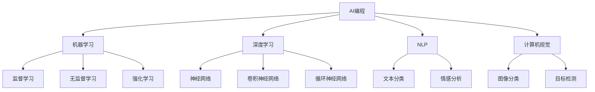
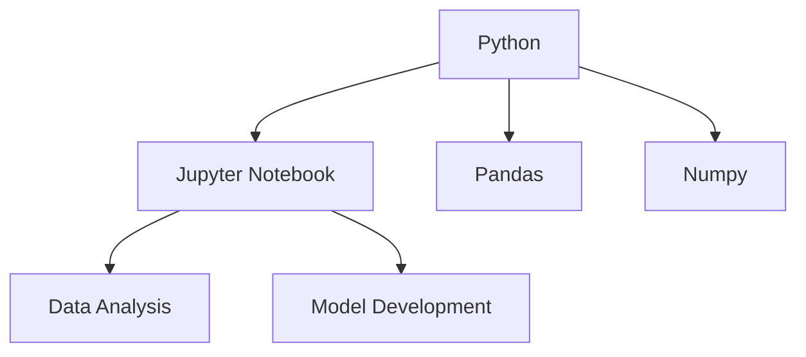
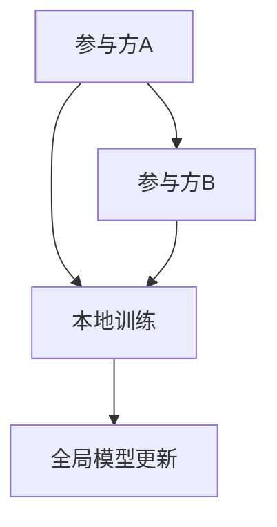
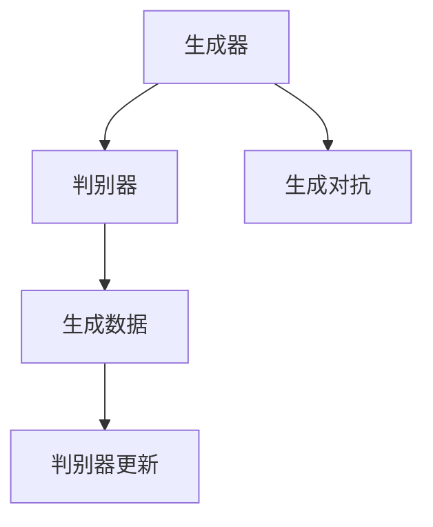
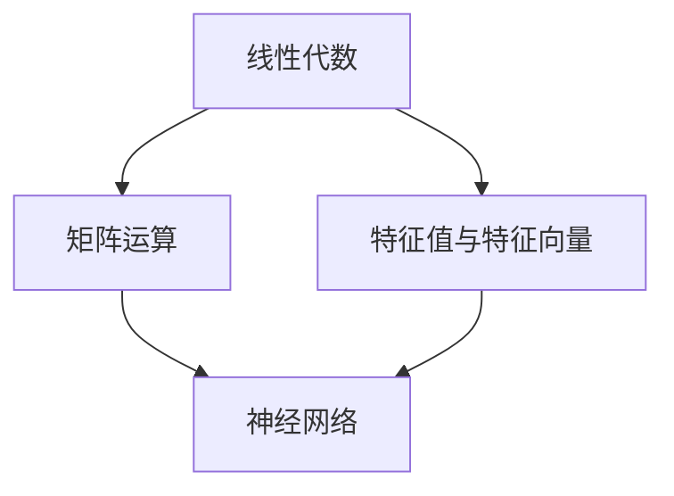
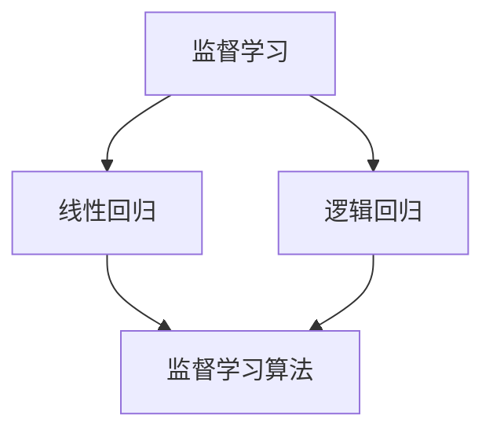
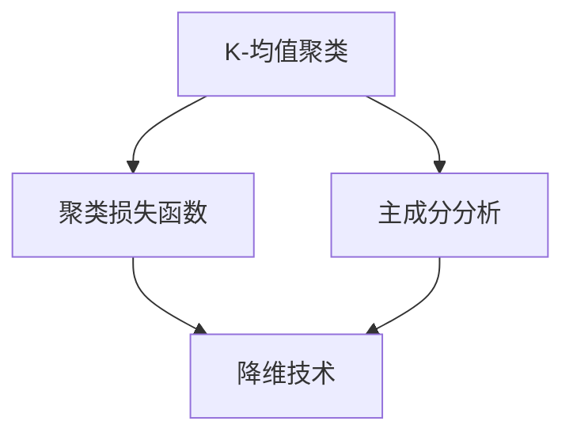

                 


### 第1章: AI编程概述

#### 1.1 AI编程的概念与历史

**背景介绍：**
AI编程，作为人工智能领域的一个重要分支，随着计算能力的提升和算法的进步，逐渐成为现代科技的重要组成部分。本章节将介绍AI编程的基本概念，以及它的发展历程。

**核心概念与联系：**
AI编程涉及的核心概念包括机器学习、深度学习、自然语言处理和计算机视觉。这些概念之间存在密切的联系，共同构成了AI编程的基石。



**监督学习、无监督学习和强化学习：**
- **监督学习**：通过标记的数据进行训练，使模型能够预测未知数据的标签。
- **无监督学习**：仅使用未标记的数据，找出数据中的内在结构或模式。
- **强化学习**：通过试错来学习在特定环境中采取最佳行动的策略。

**深度学习：**
- **神经网络**：模拟人脑神经元连接的基本结构，用于处理复杂数据。
- **卷积神经网络**（CNN）：特别适用于图像处理任务，能够识别图像中的对象。
- **循环神经网络**（RNN）：适用于处理序列数据，如时间序列数据或文本数据。

**AI编程与传统编程的区别：**
- **目标不同**：传统编程侧重于完成任务，而AI编程侧重于使机器能够自主学习和优化。
- **复杂性**：AI编程涉及复杂的算法和数据处理技术，而传统编程相对简单。

#### 1.2 AI编程的核心概念

**机器学习：**
机器学习是一种使计算机通过数据学习并获得知识的方法。它主要包括三种类型：

- **监督学习**：通过标记的数据进行训练，使模型能够预测未知数据的标签。
- **无监督学习**：仅使用未标记的数据，找出数据中的内在结构或模式。
- **强化学习**：通过试错来学习在特定环境中采取最佳行动的策略。

**深度学习：**
深度学习是机器学习的一个子领域，它使用神经网络模拟人脑神经元连接的基本结构。深度学习主要包括以下几类网络：

- **神经网络**：模拟人脑神经元连接的基本结构，用于处理复杂数据。
- **卷积神经网络**（CNN）：特别适用于图像处理任务，能够识别图像中的对象。
- **循环神经网络**（RNN）：适用于处理序列数据，如时间序列数据或文本数据。

**自然语言处理（NLP）：**
自然语言处理是一种使计算机能够理解和生成自然语言的技术。NLP在许多领域都有广泛应用，包括：

- **文本分类**：将文本分类到预定义的类别中。
- **情感分析**：判断文本表达的情感倾向，如正面、负面或中性。
- **机器翻译**：将一种自然语言翻译成另一种自然语言。

**计算机视觉：**
计算机视觉是使计算机能够从图像或视频中提取信息的学科。计算机视觉在图像分类、目标检测和视频分析等方面都有广泛应用。

- **图像分类**：将图像分类到预定义的类别中。
- **目标检测**：在图像中检测并识别特定对象的位置。

#### 1.3 AI编程的应用领域

**自然语言处理（NLP）：**
NLP在许多领域都有广泛应用，包括：

- **智能推荐系统**：通过分析用户的历史行为和兴趣，推荐个性化的内容。
- **聊天机器人**：通过自然语言交互，提供用户服务或解答问题。
- **语音识别**：将语音转换为文本，使计算机能够理解和处理语音输入。

**计算机视觉：**
计算机视觉在图像和视频分析方面有广泛应用，包括：

- **自动驾驶**：通过分析图像和视频数据，使汽车能够自主导航和避障。
- **医疗影像分析**：通过分析医学图像，帮助医生进行疾病诊断。
- **安全监控**：通过视频监控，实时检测和识别潜在的安全威胁。

**智能推荐系统：**
智能推荐系统通过分析用户的行为和偏好，推荐个性化的产品或服务。这些系统广泛应用于电子商务、社交媒体和在线媒体等领域。

**自动驾驶：**
自动驾驶是AI编程的一个重要应用领域，通过结合计算机视觉、传感器和机器学习技术，使汽车能够自主导航和避障。

### 第2章: AI编程基础

#### 2.1 编程语言与工具

**背景介绍：**
选择合适的编程语言和工具对于AI编程至关重要。Python因其简洁性和强大的库支持，成为AI编程的首选语言。Jupyter Notebook则为数据科学和AI开发提供了便利的交互环境。

**核心概念与联系：**
Python和Jupyter Notebook在AI编程中的应用具有紧密的联系，前者提供了丰富的库和框架，后者则使得数据分析和模型开发过程更加直观和高效。



**Python的优势：**
- **简洁性**：Python语法简单，易于阅读和理解。
- **丰富的库和框架**：如TensorFlow、PyTorch等，为AI开发提供了强大的支持。

**Python在AI编程中的应用：**
- **数据处理**：使用Pandas和Numpy库进行数据预处理和分析。
- **模型训练和优化**：使用TensorFlow和PyTorch等框架构建和训练深度学习模型。

**Jupyter Notebook的使用：**
- **交互式开发**：支持实时代码执行和结果展示，方便调试和实验。
- **版本控制**：易于管理代码版本和历史，便于团队合作。

**Jupyter Notebook在AI编程中的优势：**
- **可视化和交互性**：便于数据可视化和模型交互。
- **协作性**：支持多人协作，便于项目开发和知识共享。

#### 2.2 数据处理与准备

**数据清洗：**
数据清洗是AI项目中的关键步骤，包括以下内容：

- **缺失值处理**：通过插值、均值填补或删除缺失值等方法处理缺失数据。
- **异常值处理**：通过统计方法或可视化工具检测和去除异常值。

**数据可视化：**
数据可视化是理解和分析数据的重要手段，包括：

- **常用的数据可视化工具**：如Matplotlib、Seaborn等。
- **数据可视化在AI编程中的应用**：通过可视化分析数据分布、关系和趋势，辅助模型选择和参数调整。

#### 2.3 数学基础

**线性代数：**
线性代数在AI编程中扮演着重要角色，包括：

- **矩阵运算**：矩阵的加法、减法、乘法和逆运算等。
- **特征值与特征向量**：用于特征降维和特征提取。

**微积分：**
微积分在机器学习和深度学习中广泛应用，包括：

- **导数**：用于优化模型参数和损失函数。
- **积分**：用于计算预测概率和预测边界。

### 第3章: AI算法原理与实现

#### 3.1 监督学习算法

**线性回归：**
线性回归是一种简单的监督学习算法，用于预测连续值。其数学原理如下：

```latex
y = w_0 + w_1 * x
```

其中，\( y \) 是预测值，\( x \) 是输入特征，\( w_0 \) 和 \( w_1 \) 是模型参数。

**Python实现：**
```python
import numpy as np
from sklearn.linear_model import LinearRegression

# 数据准备
X = np.array([0, 1, 2, 3, 4]).reshape(-1, 1)
y = np.array([0, 1, 1.5, 2, 2.5])

# 模型训练
model = LinearRegression()
model.fit(X, y)

# 模型预测
predictions = model.predict(X)
print(predictions)
```

**逻辑回归：**
逻辑回归是一种用于分类的监督学习算法，其数学原理如下：

```latex
P(y=1) = \frac{1}{1 + e^{-(w_0 + w_1 * x)}}
```

其中，\( P(y=1) \) 是目标为1的概率。

**Python实现：**
```python
import numpy as np
from sklearn.linear_model import LogisticRegression

# 数据准备
X = np.array([0, 1, 2, 3, 4]).reshape(-1, 1)
y = np.array([0, 1, 0, 1, 1])

# 模型训练
model = LogisticRegression()
model.fit(X, y)

# 模型预测
predictions = model.predict(X)
print(predictions)
```

#### 3.2 无监督学习算法

**K-均值聚类：**
K-均值聚类是一种常用的无监督学习算法，用于将数据划分为若干个簇。其数学原理如下：

```latex
J = \sum_{i=1}^{k} \sum_{x \in S_i} \frac{1}{|S_i|} \|x - \mu_i\|^2
```

其中，\( J \) 是聚类损失函数，\( k \) 是簇的数量，\( S_i \) 是第 \( i \) 个簇，\( \mu_i \) 是簇 \( i \) 的中心。

**Python实现：**
```python
import numpy as np
from sklearn.cluster import KMeans

# 数据准备
X = np.array([[1, 2], [1, 4], [1, 0], [4, 2], [4, 4], [4, 0]])

# 模型训练
model = KMeans(n_clusters=2, random_state=0).fit(X)

# 模型预测
labels = model.predict(X)
print(labels)
```

**主成分分析（PCA）：**
主成分分析是一种降维技术，用于提取数据的主要特征。其数学原理如下：

```latex
X_{new} = T X
```

其中，\( X_{new} \) 是降维后的数据，\( T \) 是转换矩阵。

**Python实现：**
```python
import numpy as np
from sklearn.decomposition import PCA

# 数据准备
X = np.array([[1, 2], [1, 4], [1, 0], [4, 2], [4, 4], [4, 0]])

# 模型训练
model = PCA(n_components=2).fit(X)

# 模型预测
X_new = model.transform(X)
print(X_new)
```

#### 3.3 深度学习算法

**卷积神经网络（CNN）：**
卷积神经网络是一种专门用于图像处理的深度学习模型。其数学原理如下：

```latex
h_{l}(x) = \sigma(W_l \cdot h_{l-1} + b_l)
```

其中，\( h_{l}(x) \) 是第 \( l \) 层的输出，\( \sigma \) 是激活函数，\( W_l \) 和 \( b_l \) 是模型参数。

**Python实现：**
```python
import tensorflow as tf

# 定义模型
model = tf.keras.Sequential([
    tf.keras.layers.Conv2D(32, (3, 3), activation='relu', input_shape=(28, 28, 1)),
    tf.keras.layers.MaxPooling2D((2, 2)),
    tf.keras.layers.Flatten(),
    tf.keras.layers.Dense(128, activation='relu'),
    tf.keras.layers.Dense(10, activation='softmax')
])

# 编译模型
model.compile(optimizer='adam', loss='categorical_crossentropy', metrics=['accuracy'])

# 模型训练
model.fit(X_train, y_train, epochs=5, batch_size=64)
```

**循环神经网络（RNN）：**
循环神经网络是一种专门用于处理序列数据的深度学习模型。其数学原理如下：

```latex
h_{l} = \sigma(W_h \cdot [h_{l-1}, x_l] + b_h)
o_l = W_o \cdot h_l + b_o
```

其中，\( h_{l} \) 是隐藏状态，\( o_l \) 是输出状态，\( \sigma \) 是激活函数。

**Python实现：**
```python
import tensorflow as tf

# 定义模型
model = tf.keras.Sequential([
    tf.keras.layers.Embedding(input_dim=10000, output_dim=16),
    tf.keras.layers.LSTM(128),
    tf.keras.layers.Dense(1, activation='sigmoid')
])

# 编译模型
model.compile(optimizer='adam', loss='binary_crossentropy', metrics=['accuracy'])

# 模型训练
model.fit(X_train, y_train, epochs=5, batch_size=64)
```

### 第4章: AI项目实战

#### 4.1 NLP项目实战

**情感分析：**
情感分析是一种常见的NLP任务，用于判断文本的情感倾向。本节将介绍情感分析的项目背景、数据集准备、模型构建与训练。

**项目背景：**
情感分析广泛应用于社交媒体分析、产品评论分析、客户反馈分析等领域。

**数据集准备：**
常用的情感分析数据集包括IMDB电影评论数据集、Twitter情感分析数据集等。

**模型构建与训练：**
使用深度学习模型，如LSTM或BERT，进行情感分析。

```python
import tensorflow as tf
from tensorflow.keras.models import Sequential
from tensorflow.keras.layers import Embedding, LSTM, Dense

# 定义模型
model = Sequential([
    Embedding(input_dim=10000, output_dim=16),
    LSTM(128),
    Dense(1, activation='sigmoid')
])

# 编译模型
model.compile(optimizer='adam', loss='binary_crossentropy', metrics=['accuracy'])

# 模型训练
model.fit(X_train, y_train, epochs=5, batch_size=64)
```

**文本分类：**
文本分类是一种将文本数据分类到预定义类别中的任务。本节将介绍文本分类的项目背景、数据集准备、模型构建与训练。

**项目背景：**
文本分类广泛应用于新闻分类、邮件分类、社交媒体话题分类等领域。

**数据集准备：**
常用的文本分类数据集包括20新新闻组数据集、Twitter话题分类数据集等。

**模型构建与训练：**
使用深度学习模型，如CNN或Transformer，进行文本分类。

```python
import tensorflow as tf
from tensorflow.keras.models import Sequential
from tensorflow.keras.layers import Embedding, Conv1D, GlobalMaxPooling1D, Dense

# 定义模型
model = Sequential([
    Embedding(input_dim=10000, output_dim=16),
    Conv1D(filters=128, kernel_size=5, activation='relu'),
    GlobalMaxPooling1D(),
    Dense(10, activation='softmax')
])

# 编译模型
model.compile(optimizer='adam', loss='categorical_crossentropy', metrics=['accuracy'])

# 模型训练
model.fit(X_train, y_train, epochs=5, batch_size=64)
```

#### 4.2 CV项目实战

**图像分类：**
图像分类是一种将图像分类到预定义类别中的任务。本节将介绍图像分类的项目背景、数据集准备、模型构建与训练。

**项目背景：**
图像分类广泛应用于计算机视觉、医学影像分析、安全监控等领域。

**数据集准备：**
常用的图像分类数据集包括ImageNet、CIFAR-10等。

**模型构建与训练：**
使用深度学习模型，如ResNet或Inception，进行图像分类。

```python
import tensorflow as tf
from tensorflow.keras.applications import ResNet50
from tensorflow.keras.preprocessing.image import ImageDataGenerator

# 加载预训练模型
base_model = ResNet50(weights='imagenet')

# 重新构建模型
model = Sequential([
    base_model,
    Flatten(),
    Dense(1000, activation='softmax')
])

# 编译模型
model.compile(optimizer='adam', loss='categorical_crossentropy', metrics=['accuracy'])

# 模型训练
model.fit(X_train, y_train, epochs=5, batch_size=32)
```

**目标检测：**
目标检测是一种在图像中检测和识别特定对象的任务。本节将介绍目标检测的项目背景、数据集准备、模型构建与训练。

**项目背景：**
目标检测广泛应用于自动驾驶、视频监控、医疗影像分析等领域。

**数据集准备：**
常用的目标检测数据集包括COCO、PASCAL VOC等。

**模型构建与训练：**
使用深度学习模型，如Faster R-CNN或YOLO，进行目标检测。

```python
import tensorflow as tf
from tensorflow.keras.models import Model
from tensorflow.keras.layers import Input, Conv2D, MaxPooling2D, Flatten, Dense

# 定义输入层
input_layer = Input(shape=(224, 224, 3))

# 定义卷积层
conv_layer = Conv2D(filters=32, kernel_size=(3, 3), activation='relu')(input_layer)
pooling_layer = MaxPooling2D(pool_size=(2, 2))(conv_layer)

# 定义全连接层
flatten_layer = Flatten()(pooling_layer)
dense_layer = Dense(units=128, activation='relu')(flatten_layer)

# 定义输出层
output_layer = Dense(units=1, activation='sigmoid')(dense_layer)

# 定义模型
model = Model(inputs=input_layer, outputs=output_layer)

# 编译模型
model.compile(optimizer='adam', loss='binary_crossentropy', metrics=['accuracy'])

# 模型训练
model.fit(X_train, y_train, epochs=5, batch_size=32)
```

### 第5章: AI编程的未来趋势

#### 5.1 AI编程的新技术

**联邦学习：**
联邦学习是一种分布式机器学习技术，它允许多个参与方在本地训练模型，并在不共享数据的情况下联合更新全局模型。其原理如下：



**联邦学习的原理：**
联邦学习通过加密和差分更新技术，确保参与方的隐私保护。参与方在本地训练模型后，将模型更新发送给中心服务器，服务器聚合这些更新以更新全局模型。

**联邦学习的应用场景：**
联邦学习广泛应用于医疗健康、金融、物联网等领域，特别是在数据隐私保护要求较高的场景中。

**生成对抗网络（GAN）：**
生成对抗网络（GAN）是一种无监督学习技术，由一个生成器和判别器组成。其原理如下：



**GAN的原理：**
生成器生成数据，判别器对生成的数据和真实数据进行分类。通过对抗训练，生成器逐渐提高生成数据的逼真度。

**GAN的应用场景：**
GAN在图像生成、自然语言生成、图像修复等领域有广泛应用。

#### 5.2 AI编程的最佳实践

**代码质量管理：**
代码质量管理是确保代码质量、可维护性和可扩展性的关键。以下是一些最佳实践：

- **代码规范**：遵循统一的代码规范，提高代码的可读性和可维护性。
- **代码审查**：进行代码审查，发现并修复潜在的错误和漏洞。
- **单元测试**：编写单元测试，确保代码的功能正确性。
- **持续集成**：使用自动化工具进行持续集成，及时发现和解决集成问题。

**数据质量管理：**
数据质量管理是确保数据质量、一致性和可靠性的关键。以下是一些最佳实践：

- **数据清洗**：定期对数据进行清洗，去除重复、缺失和异常数据。
- **数据验证**：对数据进行验证，确保数据的准确性和一致性。
- **数据备份**：定期备份数据，防止数据丢失。

### 总结与展望

AI编程作为人工智能领域的重要组成部分，正在不断发展和创新。未来，随着计算能力的提升和算法的进步，AI编程将发挥更大的作用，推动社会和科技的进步。本文从AI编程的概念、基础、算法、项目实战和未来趋势等方面进行了全面介绍，希望为读者提供有价值的参考。

### 参考文献

- Goodfellow, I., Bengio, Y., & Courville, A. (2016). *Deep Learning*. MIT Press.
- Murphy, K. P. (2012). *Machine Learning: A Probabilistic Perspective*. MIT Press.
- Russell, S., & Norvig, P. (2016). *Artificial Intelligence: A Modern Approach*. Pearson.

### 附录

**附录A: Mermaid图表**

- **线性代数与深度学习关系图：**


- **监督学习算法关系图：**


- **K-均值聚类与PCA关系图：**


### 拓展阅读

- **深入理解深度学习：** Michael Nielsen著，机械工业出版社，2017。
- **机器学习实战：** Peter Harrington著，电子工业出版社，2013。
- **Python编程：从入门到实践：** Eric Matthes著，电子工业出版社，2016。

