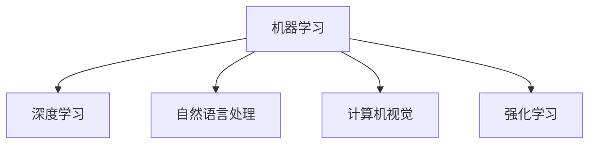

                 

# AI编程的新维度

## 关键词
AI编程、机器学习、深度学习、自然语言处理、计算机视觉、强化学习、应用实践、发展趋势

## 摘要
本文将探讨AI编程的新维度，从基础理论到应用实践，全面解析AI编程的核心概念和技术。通过深入讲解机器学习、深度学习、自然语言处理、计算机视觉和强化学习等领域的知识，结合实际项目案例，阐述AI编程的原理、方法和实践。此外，本文还将展望AI编程的未来发展趋势，为读者提供宝贵的实践经验和学习资源。

## 引言

### 背景介绍

在过去的几十年里，人工智能（AI）技术取得了显著的进展，从最初的规则推理到如今的深度学习和神经网络，AI的应用范围不断扩大，从工业自动化、医疗诊断到金融分析、自动驾驶等领域，AI技术已经成为推动社会进步的重要力量。然而，随着AI技术的不断发展，AI编程也面临着新的挑战和机遇。传统的编程方法已经难以满足AI应用的需求，因此，探索AI编程的新维度变得尤为重要。

### 核心概念与联系

AI编程的核心概念包括机器学习、深度学习、自然语言处理、计算机视觉和强化学习等。这些概念之间有着密切的联系，如图1所示：

机器学习是AI的基础，通过算法模型从数据中学习规律和模式。深度学习是机器学习的一种方法，采用多层神经网络来提高模型的性能。自然语言处理和计算机视觉是AI的两个重要应用领域，分别处理文本和图像数据。强化学习则是一种通过试错策略优化决策的过程。

### 文章结构

本文将分为以下几部分：

1. 第一部分：AI编程的基础理论
2. 第二部分：AI编程的新维度探索
3. 第三部分：AI编程的未来趋势
4. 附录

接下来，我们将逐一探讨AI编程的基础理论，深入解析各个领域的核心概念和算法原理。

## 第一部分：AI编程的基础理论

### 第1章：AI编程概述

#### 1.1 AI编程的概念

AI编程，即人工智能编程，是指利用计算机编程技术实现人工智能系统的设计和开发。与传统的编程不同，AI编程需要处理复杂的数据和算法，实现智能化的决策和推理。

#### 1.2 AI编程的发展历程

AI编程的发展历程可以分为以下几个阶段：

1. 早期阶段：基于规则的专家系统
2. 机器学习阶段：统计学习模型和神经网络
3. 深度学习阶段：多层神经网络和深度学习算法
4. 强化学习阶段：通过试错优化策略

#### 1.3 AI编程的关键技术

AI编程的关键技术包括：

1. 机器学习：包括监督学习、无监督学习和强化学习等
2. 深度学习：包括神经网络架构、优化算法和损失函数等
3. 自然语言处理：包括词嵌入、序列模型和生成模型等
4. 计算机视觉：包括图像处理、目标检测和图像生成等

### 第2章：机器学习基础

#### 2.1 机器学习概述

机器学习是AI编程的基础，通过算法模型从数据中学习规律和模式。机器学习可分为以下几种类型：

1. 监督学习：有标注的数据集
2. 无监督学习：无标注的数据集
3. 半监督学习：有标注和无标注数据混合
4. 强化学习：通过与环境的交互进行学习

#### 2.2 数据预处理

数据预处理是机器学习的关键步骤，包括：

1. 数据清洗：去除噪声和异常值
2. 数据归一化：将数据转换到同一尺度
3. 数据增强：生成新的数据样本
4. 特征提取：从原始数据中提取有用的信息

#### 2.3 线性回归

线性回归是一种常见的监督学习算法，用于预测连续值。其模型表示为：

$$ y = \beta_0 + \beta_1x $$

其中，$y$为预测值，$x$为输入特征，$\beta_0$和$\beta_1$为模型参数。

线性回归的优化方法包括：

1. 梯度下降法
2. 最小二乘法
3. 随机梯度下降法

#### 2.4 决策树

决策树是一种常见的无监督学习算法，用于分类和回归任务。其模型表示为一系列条件分支和叶子节点。

决策树的构建过程包括：

1. 特征选择：选择最优特征进行分裂
2. 划分标准：基于信息增益或基尼系数
3. 叶子节点：生成预测值或类别标签

### 第3章：深度学习基础

#### 3.1 深度学习概述

深度学习是机器学习的一种方法，采用多层神经网络来提高模型的性能。深度学习的关键概念包括：

1. 神经元：构成神经网络的基本单元
2. 层：神经网络中的层次结构
3. 前向传播：将输入数据传递到输出层
4. 反向传播：利用梯度下降法优化模型参数

#### 3.2 神经网络架构

神经网络架构包括：

1. 全连接神经网络（FCNN）
2. 卷积神经网络（CNN）
3. 循环神经网络（RNN）
4. 生成对抗网络（GAN）

#### 3.3 深度学习算法

深度学习算法包括：

1. 反向传播算法
2. 随机梯度下降（SGD）算法
3. Adam优化器

#### 3.4 卷积神经网络

卷积神经网络（CNN）是一种专门用于处理图像数据的神经网络。其核心组件包括：

1. 卷积层：提取图像特征
2. 池化层：减少数据维度
3. 全连接层：进行分类或回归

### 第4章：自然语言处理

#### 4.1 NLP概述

自然语言处理（NLP）是AI编程的重要应用领域，旨在使计算机理解和处理自然语言。NLP的关键概念包括：

1. 词嵌入：将词语转换为向量表示
2. 序列模型：处理按时间序列排列的数据
3. 生成模型：生成新的文本或语音

#### 4.2 词嵌入技术

词嵌入是将词语映射为向量的技术，常见的方法包括：

1. 矩阵分解
2. 神经网络嵌入
3. 语言模型嵌入

#### 4.3 递归神经网络

递归神经网络（RNN）是一种处理序列数据的神经网络，其核心组件包括：

1. 单个神经元：处理单个时间步的数据
2. 循环单元：保存前一时间步的信息
3. 梯度消失和梯度爆炸问题

#### 4.4 生成式模型

生成式模型是一种能够生成新数据的模型，常见的方法包括：

1. 生成式对抗网络（GAN）
2. 变分自编码器（VAE）
3. 流模型

### 第5章：计算机视觉基础

#### 5.1 计算机视觉概述

计算机视觉是AI编程的重要应用领域，旨在使计算机理解和解释图像和视频数据。计算机视觉的关键概念包括：

1. 图像处理：对图像进行滤波、变换和增强等操作
2. 目标检测：识别图像中的目标并定位其位置
3. 图像生成：生成新的图像或视频

#### 5.2 图像处理技术

图像处理技术包括：

1. 卷积操作：用于提取图像特征
2. 滤波器：用于去除图像噪声
3. 图像变换：用于改变图像的几何形状

#### 5.3 目标检测

目标检测是计算机视觉的关键任务，常见的方法包括：

1. 基于区域提议的方法：如选择性搜索（SSD）
2. 基于深度学习的方法：如卷积神经网络（YOLO）
3. 基于分割的方法：如 Mask R-CNN

#### 5.4 生成对抗网络

生成对抗网络（GAN）是一种能够生成新图像或视频的模型，其核心组件包括：

1. 生成器：生成新的图像或视频
2. 判别器：判断图像或视频的真实性
3. 对抗训练：通过不断优化生成器和判别器，生成高质量的新图像或视频

## 第二部分：AI编程的新维度探索

### 第6章：强化学习

#### 6.1 强化学习概述

强化学习是一种通过试错策略优化决策的过程，其核心概念包括：

1. 环境状态（$S$）
2. 动作（$A$）
3. 奖励（$R$）
4. 策略（$\pi$）

强化学习可分为：

1. 无模型强化学习：不需要对环境建模
2. 有模型强化学习：需要对环境建模

#### 6.2 Q-学习算法

Q-学习算法是一种无模型强化学习方法，其核心思想是通过学习状态-动作值函数（$Q(s,a)$）来优化策略。

$$ Q(s,a) = \sum_{s'} P(s'|s,a) \cdot [R(s',a) + \gamma \max_{a'} Q(s',a')] $$

其中，$P(s'|s,a)$为状态转移概率，$R(s',a')$为奖励值，$\gamma$为折扣因子。

#### 6.3 策略梯度方法

策略梯度方法是一种有模型强化学习方法，其核心思想是通过优化策略梯度来优化策略。

$$ \nabla_{\pi} J(\pi) = \sum_{s \in S} \pi(s) \cdot \nabla_{\theta} Q(s,a; \theta) $$

其中，$\pi(s)$为策略概率，$Q(s,a; \theta)$为状态-动作值函数。

#### 6.4 模型评估与优化

模型评估与优化是强化学习的重要环节，常见的方法包括：

1. 累计奖励：通过累计多个时间步的奖励来评估策略
2. 优势函数：通过比较不同策略的期望回报来评估策略
3. 优化算法：如梯度下降、Adam优化器等

### 第7章：AI编程的新应用领域

#### 7.1 AI在医疗领域的应用

AI在医疗领域的应用包括：

1. 疾病诊断：利用深度学习算法对医学图像进行分析
2. 药物研发：利用机器学习算法优化药物筛选过程
3. 医疗保健：利用自然语言处理技术处理医疗文本数据

#### 7.2 AI在金融领域的应用

AI在金融领域的应用包括：

1. 交易预测：利用机器学习算法预测股票价格和交易量
2. 风险管理：利用深度学习算法评估信贷风险和信用评分
3. 个性化推荐：利用自然语言处理技术为用户提供个性化的金融产品推荐

#### 7.3 AI在游戏领域的应用

AI在游戏领域的应用包括：

1. 游戏人工智能：利用深度学习和强化学习算法开发智能游戏角色
2. 游戏平衡：利用机器学习算法优化游戏规则和平衡性
3. 游戏推荐：利用自然语言处理技术为玩家推荐感兴趣的游戏

#### 7.4 AI在自动驾驶领域的应用

AI在自动驾驶领域的应用包括：

1. 感知环境：利用计算机视觉和传感器数据感知道路环境
2. 决策规划：利用深度学习和强化学习算法进行路径规划和决策
3. 域适应：利用迁移学习和自适应算法提高自动驾驶系统在不同场景下的性能

### 第8章：AI编程的未来趋势

#### 8.1 AI编程的发展趋势

AI编程的未来趋势包括：

1. 模型压缩：通过模型压缩技术降低模型的计算复杂度和存储需求
2. 异构计算：利用异构计算架构（如GPU、TPU等）提高模型的计算效率
3. 自适应学习：通过自适应学习算法提高模型在不同场景下的泛化能力

#### 8.2 新的编程范式

新的编程范式包括：

1. 函数式编程：利用函数式编程范式简化模型的开发和优化
2. 脚本式编程：利用脚本式编程范式简化模型部署和调优
3. 低代码开发：通过低代码开发平台降低模型开发的门槛

#### 8.3 数据隐私与安全

数据隐私与安全是AI编程的重要挑战，包括：

1. 加密技术：利用加密技术保护用户数据的隐私
2. 差分隐私：利用差分隐私技术防止数据泄露
3. 安全协议：设计安全协议保护模型和数据的完整性

## 附录

### 附录A：常用AI编程工具与框架

常用AI编程工具与框架包括：

1. TensorFlow：一款开源的深度学习框架，适用于各种深度学习任务
2. PyTorch：一款开源的深度学习框架，具有灵活的动态图模型
3. Keras：一款开源的深度学习框架，简化了深度学习模型的开发和训练
4. Theano：一款开源的深度学习框架，支持符号计算和优化
5. MXNet：一款开源的深度学习框架，支持多种编程语言和平台

### 附录B：参考资料与进一步阅读

以下为AI编程的参考资料与进一步阅读：

1. 《深度学习》（Goodfellow, Bengio, Courville著）：系统介绍了深度学习的理论基础和应用方法
2. 《Python机器学习》（Sebastian Raschka著）：详细讲解了机器学习的理论和Python实现
3. 《自然语言处理综合教程》（Christopher D. Manning, Hinrich Schütze著）：全面介绍了自然语言处理的理论和实践
4. 《强化学习》（Richard S. Sutton, Andrew G. Barto著）：系统地阐述了强化学习的基本概念和算法
5. 《自动驾驶系统设计》（Phil Koopman等著）：介绍了自动驾驶系统的发展历程和技术细节
6. 《人工智能编程实践》（Daniel D. Gutierrez著）：提供了丰富的AI编程实践案例和技巧
7. AI天才研究院官方网站：提供最新的AI技术和研究成果，以及丰富的学习资源

## 作者信息

作者：AI天才研究院/AI Genius Institute & 禅与计算机程序设计艺术 /Zen And The Art of Computer Programming

本文由AI天才研究院撰写，旨在为广大AI编程爱好者提供深入浅出的AI编程知识和实践经验。同时，本文参考了《禅与计算机程序设计艺术》一书的理念，强调编程的艺术性和哲学思考。希望通过本文，读者能够更好地理解和应用AI编程技术，为人工智能的发展贡献自己的力量。

