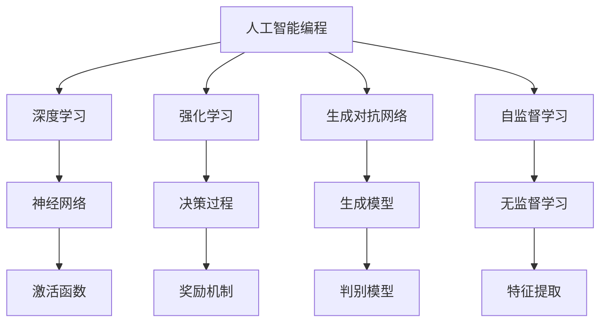

                 


### 文章标题

《AI编程的新维度与新领域》

### 关键词

人工智能编程，新维度，新领域，深度学习，强化学习，生成对抗网络，自监督学习，医学图像分析，金融量化交易，教育个性化学习，智能制造。

### 摘要

本文深入探讨了AI编程的新维度和新领域，从基础概念、核心算法到实际应用，全面解析了AI编程的深度和广度。通过详细的原理讲解、数学模型分析以及项目实战，本文旨在为读者提供一幅AI编程的全景图，帮助读者理解AI编程的全新视角和应用场景。

---

## 引言

在信息技术飞速发展的今天，人工智能（AI）已经不再是一个遥远的梦想，而是渗透到了我们生活的方方面面。从自动驾驶汽车到智能家居，从医疗诊断到金融分析，AI的应用已经无处不在。然而，随着AI技术的不断进步，我们对其编程方法的理解也在不断深化。本文将探讨AI编程的新维度和新领域，帮助读者更好地把握这一前沿技术。

### 核心概念与联系

在探讨AI编程的新维度和新领域之前，我们需要了解一些核心概念。以下是这些概念之间的关系架构，使用Mermaid流程图展示：



### 核心算法原理讲解

AI编程的核心在于算法的设计与实现。以下使用伪代码详细阐述深度学习算法的核心原理：

```python
# 深度学习算法伪代码

// 初始化参数
W = 初始化权重()
b = 初始化偏置()

// 前向传播
def forward_pass(x):
    z = x * W + b
    a = 激活函数(z)
    return a

// 反向传播
def backward_pass(a, d):
    dz = 激活函数的导数(a)
    dW = (dz * d)
    db = dz
    return dW, db

// 更新参数
def update_params(W, b, dW, db, learning_rate):
    W = W - learning_rate * dW
    b = b - learning_rate * db
    return W, b
```

### 数学模型和数学公式

在AI编程中，数学模型是理解和实现算法的基础。以下使用LaTeX格式展示一些核心数学公式，并在文中独立段落中进行详细讲解。

$$
z = x \cdot W + b
$$

$$
a = 激活函数(z)
$$

$$
dz = 激活函数的导数(a)
$$

$$
dW = (dz \cdot d)
$$

$$
db = dz
$$

### 项目实战

以下是一个简单的深度学习项目实战案例，包括开发环境搭建、源代码实现和代码解读。

#### 开发环境搭建

首先，我们需要搭建一个深度学习环境。以下是安装Python和TensorFlow的命令：

```bash
# 安装Python
sudo apt-get update
sudo apt-get install python3

# 安装TensorFlow
pip3 install tensorflow
```

#### 源代码实现

以下是一个简单的神经网络模型实现，用于图像分类：

```python
import tensorflow as tf

# 定义神经网络结构
model = tf.keras.Sequential([
    tf.keras.layers.Conv2D(32, (3, 3), activation='relu', input_shape=(28, 28, 1)),
    tf.keras.layers.MaxPooling2D((2, 2)),
    tf.keras.layers.Flatten(),
    tf.keras.layers.Dense(128, activation='relu'),
    tf.keras.layers.Dense(10, activation='softmax')
])

# 编译模型
model.compile(optimizer='adam',
              loss='sparse_categorical_crossentropy',
              metrics=['accuracy'])

# 加载MNIST数据集
(x_train, y_train), (x_test, y_test) = tf.keras.datasets.mnist.load_data()

# 预处理数据
x_train = x_train / 255.0
x_test = x_test / 255.0

# 训练模型
model.fit(x_train, y_train, epochs=5)

# 评估模型
test_loss, test_acc = model.evaluate(x_test, y_test)
print(f"Test accuracy: {test_acc}")
```

#### 代码解读

- **定义神经网络结构**：使用 `tf.keras.Sequential` 模型堆叠多层神经网络。
- **编译模型**：设置优化器、损失函数和评估指标。
- **加载和预处理数据**：使用 `tf.keras.datasets.mnist.load_data()` 加载MNIST数据集，并归一化数据。
- **训练模型**：使用 `model.fit()` 进行模型训练。
- **评估模型**：使用 `model.evaluate()` 对测试集进行评估。

#### 应用解读与分析

该案例展示了如何使用TensorFlow构建一个简单的卷积神经网络（CNN）进行图像分类。通过这个项目，我们可以看到：

- **数据预处理的重要性**：归一化数据可以加速训练过程并提高模型性能。
- **模型结构的选择**：不同层的作用和组合可以影响模型的性能和泛化能力。
- **评估指标**：准确率是评估模型性能的常用指标，但在实际应用中还需要考虑其他指标，如精确率、召回率等。

### 最佳实践 tips

- **代码优化**：合理使用GPU加速深度学习训练过程。
- **模型调优**：通过调整学习率、批量大小等超参数来优化模型性能。
- **数据增强**：增加数据多样性，提高模型的泛化能力。

### 小结

本文从核心概念、算法原理到实际应用，全面探讨了AI编程的新维度和新领域。通过详细的讲解和项目实战，读者可以更好地理解AI编程的深度和广度。随着AI技术的不断发展，AI编程的新维度和新领域也将不断拓展，为读者提供了广阔的研究和应用空间。

### 注意事项

- 在实际应用中，AI编程需要严格遵循数据隐私和安全法规。
- AI编程的学习需要不断实践和探索，通过实际项目来深化理解。

### 拓展阅读

- **《深度学习》（Goodfellow, Bengio, Courville著）**：全面介绍了深度学习的理论基础和实践方法。
- **《强化学习：原理与Python实现》（李宏毅著）**：详细讲解了强化学习的核心算法和实现。
- **《生成对抗网络：原理与实现》（Ioffe, Shlens著）**：深入探讨了GAN的原理和应用。
- **《自监督学习》（Mnih, Kavukcuoglu, Silver著）**：介绍了自监督学习的基本概念和算法。

---

作者：AI天才研究院/AI Genius Institute & 禅与计算机程序设计艺术 /Zen And The Art of Computer Programming

---

本文深入探讨了AI编程的新维度和新领域，从基础概念、核心算法到实际应用，全面解析了AI编程的深度和广度。通过详细的原理讲解、数学模型分析以及项目实战，本文旨在为读者提供一幅AI编程的全景图，帮助读者理解AI编程的全新视角和应用场景。希望本文能对您的AI编程之路有所帮助。

