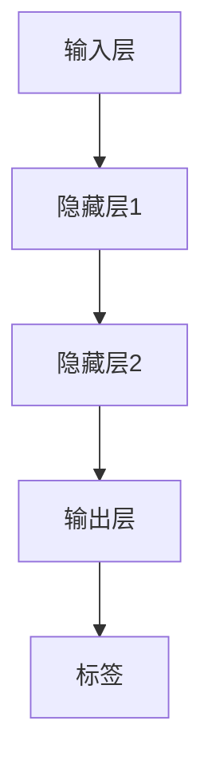
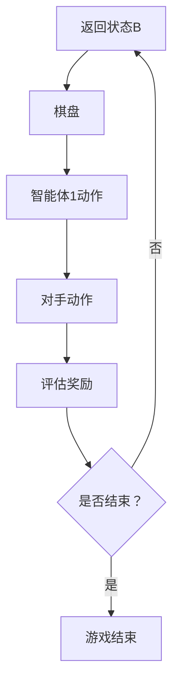
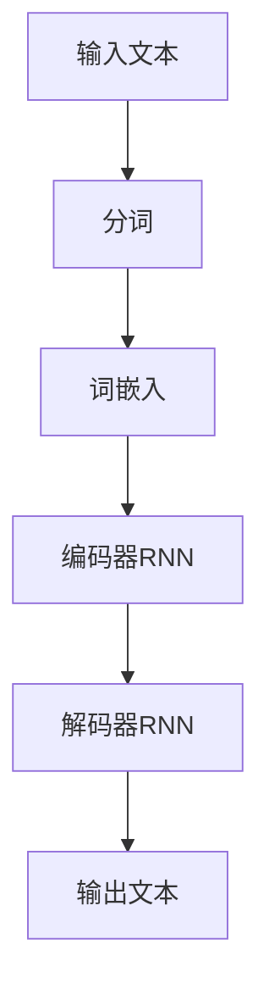
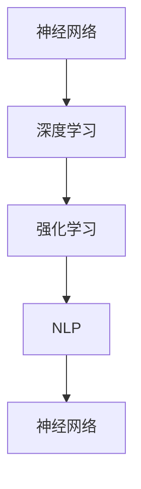

                 

### 文章标题

**AI编程的新维度与新领域**

### 关键词

- AI编程
- 新维度
- 新领域
- 深度学习
- 强化学习
- 自然语言处理
- 自动机器学习
- 联邦学习
- 生成对抗网络

### 摘要

本文旨在探讨AI编程的新维度和新领域。首先，我们将回顾AI编程的基础知识，包括神经网络、深度学习和自然语言处理等核心概念。接着，我们将深入探讨AI编程的新维度，如自动机器学习（AutoML）、联合学习与联邦学习、以及生成对抗网络（GAN）。随后，我们将关注AI编程的新领域，包括医疗健康、金融科技和制造业等应用场景。最后，我们将通过项目实战和未来趋势分析，探讨AI编程的实践方向和发展前景。

---

### 目录大纲设计与书名关联

在设计《AI编程的新维度与新领域》的目录大纲时，我们首先需要理解书名的含义。书名中的“新维度”和“新领域”分别指代了两个方面：

1. **新维度**：这通常意味着对已有知识的扩展或深入，可能涉及新的理论、方法或视角。
2. **新领域**：则是指进入新的应用领域或技术方向。

目录大纲的设计旨在结构清晰、内容丰富，每个章节都紧密围绕书名中的主题进行展开，确保读者能够系统地了解AI编程的各个方面。以下是详细的目录大纲：

#### 第一部分：AI编程基础

**第1章 AI编程概述**
- **1.1 AI编程的背景与意义**
  - AI的历史与发展
  - AI编程的重要性
- **1.2 AI编程的核心概念**
  - 机器学习
  - 深度学习
  - 强化学习
- **1.3 AI编程的发展历程**
  - 早期探索
  - 神经网络与深度学习的崛起
  - 现代AI编程的挑战
- **1.4 AI编程的挑战与机遇**
  - 技术挑战
  - 应用机遇

**第2章 AI编程的核心理论**
- **2.1 神经网络与深度学习**
  - 神经网络的基本原理
  - 前馈神经网络与反向传播算法
  - 常见深度学习架构
- **2.2 强化学习**
  - 强化学习的定义与基本原理
  - Q-学习和SARSA算法
- **2.3 自然语言处理**
  - NLP的基本概念
  - 词嵌入与神经网络
  - 语言模型与文本生成

#### 第二部分：AI编程新维度

**第3章 AI编程的新维度**
- **3.1 自动机器学习（AutoML）**
  - AutoML的原理与框架
  - AutoML的优势与挑战
  - AutoML的实际应用案例
- **3.2 联合学习与联邦学习**
  - 联合学习的基本原理
  - 联邦学习的安全性与效率
  - 联邦学习的应用场景
- **3.3 生成对抗网络（GAN）**
  - GAN的工作原理
  - GAN的变体与应用
  - GAN在图像处理与生成中的使用

#### 第三部分：AI编程新领域

**第4章 AI编程在新领域的应用**
- **4.1 AI在医疗健康领域**
  - 医学图像分析
  - 个性化医疗
  - 人工智能辅助诊断
- **4.2 AI在金融科技领域**
  - 信用评分与风险管理
  - 量化交易与算法交易
  - 智能投顾与金融推荐
- **4.3 AI在制造业**
  - 智能制造与工业4.0
  - 机器视觉与自动化检测
  - AI在供应链管理与优化中的应用

#### 第四部分：AI编程实战

**第5章 AI编程项目实战**
- **5.1 项目1：构建简单的深度学习模型**
  - 项目背景
  - 数据准备与预处理
  - 模型设计与实现
  - 模型训练与评估
- **5.2 项目2：使用GAN生成人脸图像**
  - 项目背景
  - 数据准备与预处理
  - 模型设计与实现
  - 模型训练与评估
- **5.3 项目3：实施联邦学习提高隐私保护**
  - 项目背景
  - 数据集选择与预处理
  - 模型设计与实现
  - 联邦学习算法实现
  - 模型训练与评估

#### 第五部分：AI编程的未来趋势

**第6章 AI编程的未来发展趋势**
- **6.1 量子计算与AI**
  - 量子计算的基本概念
  - 量子计算与AI的结合
  - 量子计算在AI领域的应用前景
- **6.2 AI编程的伦理与法律问题**
  - AI伦理的基本原则
  - AI法律框架的构建
  - AI伦理与法律问题的案例分析
- **6.3 AI编程教育的未来**
  - AI编程教育的现状与挑战
  - AI编程教育的创新方法
  - AI编程教育的发展趋势

#### 第六部分：AI编程资源与工具

**第7章 AI编程资源与工具**
- **7.1 AI编程工具介绍**
  - Python编程环境配置
  - 常用深度学习框架（TensorFlow，PyTorch等）
  - 其他相关工具（Kaggle，Google Colab等）
- **7.2 AI编程学习资源**
  - 在线课程与教程
  - 开源项目与代码库
  - 研究论文与最新进展
- **7.3 AI编程的最佳实践**
  - 编程技巧与优化
  - 调试与测试方法
  - 代码规范与风格

通过上述目录大纲的设计，我们可以清晰地看到书名《AI编程的新维度与新领域》的具体内容安排，每个章节都紧密围绕书名的主题进行展开，确保读者能够系统地了解AI编程的各个方面。

### 第一部分：AI编程基础

#### 第1章 AI编程概述

AI编程作为现代计算机科学的重要分支，正日益影响和改变着我们的生活和工作的方方面面。从自动驾驶汽车到智能家居，从智能医疗诊断到金融风险控制，AI编程的应用领域广泛且不断扩展。为了深入理解AI编程，我们首先需要了解其背景、意义、核心概念以及发展历程。

##### 1.1 AI编程的背景与意义

人工智能（AI）的历史可以追溯到20世纪50年代。当时，计算机科学家们开始探索如何让机器模拟人类的智能行为，例如理解自然语言、解决问题、做出决策等。尽管早期的研究在技术层面遇到了诸多挑战，但AI的研究逐渐取得了突破，尤其是在20世纪80年代和90年代。进入21世纪，随着计算机性能的提升、大数据的出现以及深度学习算法的进步，AI编程迎来了新的发展契机。

AI编程的意义在于，它不仅能够解决传统编程难以处理的问题，还能够为各行各业带来创新和变革。例如，通过AI编程，我们可以开发智能助手、智能监控系统、智能推荐系统等，极大地提升工作效率和生活质量。

##### 1.2 AI编程的核心概念

AI编程涉及多个核心概念，其中最重要的包括机器学习、深度学习和强化学习。

- **机器学习**：机器学习是一种让计算机从数据中学习规律和模式的技术。它包括监督学习、无监督学习和半监督学习等类型。机器学习的目标是让计算机具备自主学习和改进的能力，无需显式编程。
  
- **深度学习**：深度学习是机器学习的一个子领域，主要基于神经网络，特别是多层神经网络。深度学习通过模拟人脑神经网络结构，能够处理复杂的非线性问题，如图像识别、语音识别等。

- **强化学习**：强化学习是一种通过试错学习来优化行为策略的机器学习方法。它通过奖励和惩罚机制来指导学习过程，使计算机能够在特定环境中做出最优决策。

##### 1.3 AI编程的发展历程

AI编程的发展历程可以分为几个重要阶段：

- **早期探索**：20世纪50年代至60年代，AI概念首次被提出，计算机科学家们开始尝试通过编程实现简单的智能行为。

- **符号人工智能**：20世纪70年代至80年代，基于符号推理的方法成为主流，AI系统开始应用于专家系统、游戏等领域。

- **连接主义革命**：20世纪90年代，基于神经网络的连接主义方法逐渐崛起，深度学习开始取得突破性进展。

- **现代AI编程**：21世纪初至今，随着大数据和云计算的发展，深度学习等AI技术得到了广泛应用，AI编程进入了新的发展阶段。

##### 1.4 AI编程的挑战与机遇

尽管AI编程取得了显著的进展，但它仍然面临着诸多挑战和机遇。

- **技术挑战**：AI编程需要处理大量的数据、复杂的模型和高度非线性的问题，这要求计算机科学家们不断探索新的算法和优化方法。

- **应用机遇**：AI编程在医疗、金融、教育、制造业等领域的应用前景广阔，这些领域的创新将为社会带来巨大的价值。

总的来说，AI编程的基础知识为我们理解后续章节的内容奠定了坚实的基础。在接下来的章节中，我们将深入探讨AI编程的核心理论、新维度和新领域，以及实际应用案例，帮助读者全面了解AI编程的各个方面。

### 第2章 AI编程的核心理论

在了解了AI编程的背景与概述后，我们接下来将深入探讨其核心理论。这一部分内容将涵盖神经网络、深度学习和强化学习等关键概念，并详细解释这些概念之间的关系和如何应用于实际问题中。

##### 2.1 神经网络与深度学习

**神经网络**（Neural Networks）是AI编程中最基础且广泛使用的一种模型。它模拟人脑神经元的工作原理，通过神经元之间的连接（即权重）传递信息。神经网络可以分为前馈神经网络和循环神经网络（RNN）等类型。

- **前馈神经网络**：前馈神经网络（Feedforward Neural Network，FNN）是一种最简单的神经网络结构，信息从前向后传递，不形成循环。它通常包括输入层、隐藏层和输出层。每层中的神经元接收前一层神经元的输出，并产生自己的输出，这些输出随后传递到下一层。

- **深度学习**：深度学习（Deep Learning）是神经网络的一种扩展，通过增加隐藏层的数量来提高模型的复杂性和表达能力。深度学习模型，特别是深度神经网络（Deep Neural Network，DNN），在处理复杂数据方面表现出了强大的能力。例如，在图像识别、语音识别和自然语言处理等领域，深度学习模型已经取得了显著的成果。

**神经网络与深度学习的关系**：深度学习是神经网络的一种扩展，通过增加隐藏层的数量，深度学习模型能够捕捉更加复杂的特征和模式。可以说，深度学习是神经网络的一种特殊形式，它通过深度堆叠的神经网络结构来实现对数据的深层学习。

**神经网络的工作原理**：

1. **前向传播**：输入数据通过网络传递，每个神经元将输入值与权重相乘并加上偏置项，然后通过激活函数（如Sigmoid、ReLU）输出新的值。

2. **反向传播**：通过比较输出值与实际标签之间的差异，计算损失函数，然后使用反向传播算法更新网络中的权重和偏置项。

**神经网络在图像识别中的应用示例**：

假设我们有一个简单的神经网络用于识别手写数字（MNIST数据集）。输入层有784个神经元，对应于每个像素点的灰度值。隐藏层可以设置为若干个神经元，输出层有10个神经元，分别对应于0到9的数字。



在训练过程中，通过反向传播算法不断调整网络的权重和偏置项，使输出层的预测结果尽可能接近实际的标签值。

##### 2.2 强化学习

强化学习（Reinforcement Learning，RL）是一种通过试错学习来优化行为策略的机器学习方法。与传统的监督学习和无监督学习不同，强化学习中的模型需要通过与环境的交互来学习最优策略。

**强化学习的基本原理**：

- **状态**：强化学习中的状态是指环境在某一时刻的状态描述。
- **动作**：动作是模型在某一状态下可以选择的行为。
- **奖励**：奖励是模型在执行动作后获得的即时反馈，用于指导学习过程。

**强化学习的核心算法**：

- **Q-学习（Q-Learning）**：Q-学习是一种基于值函数的强化学习算法，通过估计状态-动作值函数来选择最优动作。其核心思想是通过更新Q值来优化策略。

  $$ Q(s, a) = Q(s, a) + \alpha [r + \gamma \max_{a'} Q(s', a') - Q(s, a)] $$

  其中，\( \alpha \) 是学习率，\( \gamma \) 是折扣因子，\( r \) 是即时奖励，\( s \) 和 \( s' \) 分别为当前状态和下一状态，\( a \) 和 \( a' \) 分别为当前动作和最优动作。

- **SARSA（同步自我强化学习）**：SARSA是一种基于策略的强化学习算法，它在每一步都使用当前状态和动作来更新策略。

  $$ \pi(s) = \begin{cases} 
  1 & \text{if } a = \arg\max_a Q(s, a) \\
  0 & \text{otherwise} 
  \end{cases} $$

**强化学习在游戏中的应用示例**：

强化学习在游戏领域有着广泛的应用，例如在围棋、国际象棋等棋类游戏中，通过训练智能体（agent）来学会最优策略。以围棋游戏为例，智能体需要在每一步决策中评估所有可能的动作，并选择能够最大化长期奖励的动作。



在上述过程中，智能体通过不断尝试不同的动作，并根据即时奖励和历史奖励来更新其策略，逐步学会最优的决策路径。

##### 2.3 自然语言处理

自然语言处理（Natural Language Processing，NLP）是AI编程的一个重要分支，它专注于使计算机能够理解和处理自然语言。NLP的应用包括文本分类、情感分析、机器翻译、问答系统等。

**NLP的基本概念**：

- **词嵌入**：词嵌入是将自然语言中的单词映射到高维空间中的向量表示，以便计算机能够进行向量计算。常用的词嵌入模型包括Word2Vec、GloVe等。

- **神经网络**：在NLP中，神经网络常用于处理文本数据。循环神经网络（RNN）和其变种长短期记忆网络（LSTM）被广泛应用于文本序列建模。

- **语言模型**：语言模型是用于预测下一个单词或词组的概率分布的模型。它通过学习大量文本数据，能够生成连贯的文本。

**NLP在机器翻译中的应用示例**：

机器翻译是NLP领域的一个重要应用，它通过将一种语言的文本翻译成另一种语言，实现跨语言的交流。一个简单的机器翻译系统可以基于循环神经网络和语言模型来实现。



在上述过程中，编码器RNN将输入文本编码成一个固定长度的向量表示，解码器RNN则根据编码器的输出和已翻译的文本部分，逐步生成输出文本。

##### 2.4 核心概念之间的关系架构

神经网络、深度学习、强化学习和自然语言处理是AI编程中的核心概念，它们之间存在着紧密的联系和相互促进。

- **神经网络**是深度学习的基础，提供了计算模型和优化方法。
- **深度学习**扩展了神经网络，通过多层结构提高了模型的表达能力。
- **强化学习**通过试错学习，为神经网络和深度学习提供了动态调整策略的能力。
- **自然语言处理**将神经网络和深度学习应用于文本数据，使其能够理解和处理自然语言。

下面是一个Mermaid流程图，展示了这些核心概念之间的关系：



通过上述章节的内容，我们不仅了解了AI编程的核心理论，还了解了这些理论之间的相互关系。在接下来的章节中，我们将继续探讨AI编程的新维度和新领域，帮助读者全面掌握这一领域的知识。

### 第二部分：AI编程新维度

#### 第3章 AI编程的新维度

在AI编程的核心理论基础上，近年来出现了许多新维度和新领域，这些新维度不仅扩展了AI编程的适用范围，还带来了新的挑战和机遇。本章将重点介绍自动机器学习（AutoML）、联合学习与联邦学习、以及生成对抗网络（GAN）。

##### 3.1 自动机器学习（AutoML）

自动机器学习（Automated Machine Learning，AutoML）是近年来备受关注的一个研究领域。它的目标是自动化机器学习的流程，从而降低对专业知识的依赖，提高模型开发的效率和性能。AutoML通过自动化特征选择、模型选择、参数调优等过程，使得非专业用户也能轻松构建高性能的机器学习模型。

**AutoML的原理与框架**：

AutoML的基本原理可以概括为以下几个步骤：

1. **数据预处理**：自动化处理数据，包括数据清洗、缺失值处理、特征工程等。
2. **特征选择**：通过评估不同特征组合的性能，自动选择最有用的特征。
3. **模型选择**：评估多种机器学习模型，选择最适合当前数据集的模型。
4. **参数调优**：自动化搜索最优超参数，提高模型性能。
5. **模型集成**：通过集成多个模型，进一步提高预测性能。

AutoML的框架通常包括以下组件：

- **自动化特征工程**：使用自动化算法生成和选择特征。
- **模型评估与选择**：评估不同模型的性能，选择最优模型。
- **超参数优化**：使用自动化算法搜索最优超参数。
- **模型集成**：集成多个模型，提高预测性能。

**AutoML的优势与挑战**：

**优势**：

- **提高开发效率**：自动化流程可以显著减少模型开发的时间和人力成本。
- **降低门槛**：非专业人士可以更容易地构建高性能的机器学习模型。
- **优化模型性能**：自动化调优和模型选择可以显著提高模型性能。

**挑战**：

- **计算资源消耗**：AutoML需要进行大量的模型评估和参数搜索，需要大量的计算资源。
- **复杂性和不确定性**：AutoML涉及多个复杂步骤，容易引入不确定性和错误。
- **数据依赖性**：AutoML的性能高度依赖于数据质量和特征选择。

**AutoML的实际应用案例**：

AutoML在多个领域都有广泛应用，以下是几个典型案例：

- **金融风控**：AutoML可以自动化构建信用评分模型，提高风险识别和预测的准确性。
- **医疗诊断**：AutoML可以帮助医生自动化诊断疾病，提高诊断效率和准确性。
- **零售与电商**：AutoML可以用于个性化推荐系统，提高用户满意度和销售额。

##### 3.2 联合学习与联邦学习

联合学习（Federated Learning）和联邦学习（Federated Learning）是近年来在分布式计算和隐私保护领域受到关注的技术。它们通过将数据留在本地，仅传输模型参数，从而在保护用户隐私的同时实现模型训练和优化。

**联合学习的基本原理**：

联合学习的基本原理可以概括为以下几个步骤：

1. **初始化模型**：在中央服务器上初始化全局模型。
2. **本地训练**：每个参与者使用本地数据进行模型训练，更新本地模型。
3. **参数聚合**：中央服务器收集所有参与者的本地模型更新，进行参数聚合。
4. **全局更新**：中央服务器使用聚合后的参数更新全局模型。

**联邦学习的安全性与效率**：

**安全性**：

- **数据隐私保护**：联合学习通过仅传输模型参数，避免了原始数据的泄露，从而保护了用户的隐私。
- **去中心化**：联邦学习通过分散的数据存储和计算，降低了单点故障的风险。

**效率**：

- **并行化**：联邦学习可以在多个参与者之间并行训练模型，提高训练效率。
- **去中心化**：联邦学习避免了集中式训练的数据传输和存储开销，降低了计算和通信成本。

**联邦学习的应用场景**：

联邦学习在多个领域都有广泛应用，以下是几个典型案例：

- **移动设备**：联邦学习可以用于移动设备上的智能助理和个性化推荐系统，提高用户体验。
- **物联网**：联邦学习可以用于物联网设备上的隐私保护数据分析和预测。
- **医疗健康**：联邦学习可以用于医疗数据的安全分析和共享，提高疾病诊断和治疗的准确性。

##### 3.3 生成对抗网络（GAN）

生成对抗网络（Generative Adversarial Network，GAN）是近年来在生成模型领域取得突破性进展的一种神经网络架构。GAN由两个神经网络组成：生成器（Generator）和判别器（Discriminator）。生成器尝试生成逼真的数据，判别器则尝试区分生成器和真实数据。

**GAN的工作原理**：

GAN的基本原理可以概括为以下几个步骤：

1. **初始化生成器和判别器**：生成器和判别器同时初始化。
2. **生成器训练**：生成器生成假数据，判别器对其进行评估。
3. **判别器训练**：判别器训练以区分真实数据和假数据。
4. **重复训练**：重复上述步骤，不断优化生成器和判别器。

**GAN的变体与应用**：

GAN有多个变体，包括条件GAN（cGAN）、循环一致性GAN（CycleGAN）和改进的Wasserstein GAN（WGAN）等。每个变体都有其特定的应用场景和优势。

- **条件GAN（cGAN）**：cGAN引入了条件信息，例如标签或文本，使其能够生成带有特定属性的数据。
- **循环一致性GAN（CycleGAN）**：CycleGAN能够生成不同域之间的转换数据，例如将白天图像转换为夜晚图像。
- **改进的Wasserstein GAN（WGAN）**：WGAN使用Wasserstein距离代替传统的交叉熵损失，提高了GAN的训练稳定性和生成质量。

**GAN在图像处理与生成中的使用**：

GAN在图像处理和生成领域有着广泛的应用，以下是几个典型案例：

- **图像生成**：GAN可以用于生成逼真的图像，如图像修复、图像超分辨率和图像合成等。
- **图像风格迁移**：GAN可以将一种图像风格迁移到另一种图像上，例如将普通照片转换为艺术画作。
- **图像生成对抗攻击**：GAN可以用于生成对抗攻击，通过对抗训练提高模型的鲁棒性和安全性。

综上所述，自动机器学习（AutoML）、联合学习与联邦学习、以及生成对抗网络（GAN）是AI编程的新维度，它们不仅扩展了AI编程的适用范围，还为数据隐私保护、模型优化和图像生成等领域带来了新的方法和应用。在接下来的章节中，我们将进一步探讨AI编程在新领域的应用，帮助读者全面了解这一领域的最新发展。

### 第三部分：AI编程新领域

#### 第4章 AI编程在新领域的应用

随着AI技术的不断发展和成熟，AI编程的应用领域也在不断扩展。AI编程不仅在传统领域取得了显著的成果，还在医疗健康、金融科技和制造业等新兴领域展现出了巨大的潜力。本章将深入探讨AI编程在这些新领域的具体应用，包括技术实现、挑战与解决方案以及成功案例。

##### 4.1 AI在医疗健康领域

医疗健康是AI编程的一个重要应用领域，AI技术通过数据分析和智能算法，为疾病的诊断、治疗和预防提供了新的手段。

**技术实现**：

- **医学图像分析**：AI编程可以用于医学图像分析，如X光片、CT扫描和MRI图像，帮助医生快速、准确地诊断疾病。常用的技术包括卷积神经网络（CNN）和深度学习模型。
- **个性化医疗**：通过分析患者的基因组数据和病历，AI编程可以为每位患者制定个性化的治疗方案。例如，通过基因突变检测，预测患者对某种药物的反应。
- **人工智能辅助诊断**：AI编程可以辅助医生进行疾病诊断，通过学习大量的医学文献和数据，AI系统可以提供诊断建议和参考信息，提高诊断的准确性和效率。

**挑战与解决方案**：

- **数据隐私**：医疗数据非常敏感，如何确保数据的安全和隐私是主要挑战。解决方案包括联邦学习（Federated Learning）和加密算法，这些技术可以在保护患者隐私的前提下进行数据分析和模型训练。
- **算法解释性**：医疗决策需要高度可靠且可解释的算法，以便医生能够理解和信任AI系统的建议。解决方案包括开发可解释的AI模型和提供详细的解释界面。

**成功案例**：

- **谷歌DeepMind的AlphaGo**：AlphaGo在围棋领域取得了突破性成果，但其背后的技术同样可以应用于医疗诊断。DeepMind正在开发AI系统，用于辅助医生进行疾病诊断和治疗。
- **IBM Watson**：IBM Watson是一款智能医疗诊断系统，通过分析大量的医学文献和病例，提供准确的诊断建议和治疗方案。

##### 4.2 AI在金融科技领域

金融科技（FinTech）是AI编程的另一个重要应用领域，AI技术为金融服务带来了创新和效率。

**技术实现**：

- **信用评分与风险管理**：AI编程可以用于信用评分，通过分析用户的财务数据和行为模式，预测其信用风险。常用的技术包括机器学习和强化学习。
- **量化交易与算法交易**：AI编程可以用于量化交易，通过分析历史交易数据和市场趋势，自动生成交易策略。算法交易可以提高交易效率和收益。
- **智能投顾与金融推荐**：AI编程可以提供智能投顾服务，通过分析用户的投资偏好和风险承受能力，提供个性化的投资建议。同时，AI系统还可以推荐金融产品和服务，提高用户体验。

**挑战与解决方案**：

- **数据质量**：金融数据通常存在噪声和缺失值，如何处理这些数据是主要挑战。解决方案包括数据清洗和特征工程，提高数据质量。
- **合规与法规**：金融领域有严格的法规和合规要求，如何确保AI系统的合规性是关键挑战。解决方案包括建立严格的合规流程和监控机制。

**成功案例**：

- **蚂蚁金服的智能风控系统**：蚂蚁金服的智能风控系统通过AI编程，对海量用户行为和交易数据进行分析，实时监测并预防风险，提高了金融服务的安全性和可靠性。
- ** Wealthfront的智能投顾**：Wealthfront是一款基于AI的智能投顾服务，通过分析用户的财务数据和投资目标，提供个性化的投资建议，帮助用户实现财富增值。

##### 4.3 AI在制造业

制造业是AI编程的另一个重要应用领域，AI技术通过自动化和智能化，提高了生产效率和质量。

**技术实现**：

- **智能制造与工业4.0**：AI编程可以用于实现智能制造，通过传感器、物联网和数据分析，实现设备的智能监控和远程控制。工业4.0概念强调通过AI技术实现工厂的全面智能化。
- **机器视觉与自动化检测**：AI编程可以用于机器视觉系统，通过图像识别和目标检测技术，实现自动化检测和质量控制。例如，AI系统可以实时检测生产线上产品的缺陷。
- **AI在供应链管理与优化中的应用**：AI编程可以用于供应链管理，通过预测需求和优化库存，提高供应链的效率和灵活性。

**挑战与解决方案**：

- **数据整合**：制造业涉及多种数据源，如何整合和处理这些数据是主要挑战。解决方案包括建立统一的数据平台和采用数据清洗和预处理技术。
- **技术集成**：AI系统需要与其他系统（如ERP、MES等）进行集成，这要求AI编程具有较高的兼容性和灵活性。

**成功案例**：

- **通用电气的Predix平台**：通用电气的Predix平台通过AI编程，实现了设备的智能监控和预测性维护，提高了生产效率和设备利用率。
- **特斯拉的自动驾驶技术**：特斯拉的自动驾驶技术通过AI编程，实现了车辆对环境的高精度感知和自动驾驶功能，提高了驾驶安全和效率。

综上所述，AI编程在医疗健康、金融科技和制造业等新领域展现出了巨大的应用潜力。通过技术实现、挑战与解决方案以及成功案例的探讨，我们不仅可以了解AI编程在这些领域的具体应用，还可以预见其未来的发展趋势和前景。

### 第四部分：AI编程项目实战

#### 第5章 AI编程项目实战

在了解了AI编程的理论基础和新维度后，通过实战项目可以帮助我们更好地理解这些知识，并将其应用到实际问题中。本章将介绍三个实战项目：构建简单的深度学习模型、使用生成对抗网络（GAN）生成人脸图像，以及实施联邦学习提高隐私保护。

#### 5.1 项目1：构建简单的深度学习模型

**项目背景**：

本项目旨在使用Python和TensorFlow库构建一个简单的深度学习模型，用于手写数字识别。我们使用MNIST数据集，该数据集包含60,000个训练图像和10,000个测试图像，每个图像都是一个手写数字。

**数据准备与预处理**：

首先，我们需要下载并加载MNIST数据集，然后进行数据预处理：

```python
import tensorflow as tf
from tensorflow.keras.datasets import mnist
from tensorflow.keras.utils import to_categorical

# 加载MNIST数据集
(train_images, train_labels), (test_images, test_labels) = mnist.load_data()

# 数据预处理
train_images = train_images.reshape((60000, 28, 28, 1)).astype('float32') / 255
test_images = test_images.reshape((10000, 28, 28, 1)).astype('float32') / 255

train_labels = to_categorical(train_labels)
test_labels = to_categorical(test_labels)
```

**模型设计与实现**：

接下来，我们设计一个简单的卷积神经网络（CNN）模型：

```python
model = tf.keras.Sequential([
    tf.keras.layers.Conv2D(32, (3,3), activation='relu', input_shape=(28, 28, 1)),
    tf.keras.layers.MaxPooling2D((2,2)),
    tf.keras.layers.Conv2D(64, (3,3), activation='relu'),
    tf.keras.layers.MaxPooling2D((2,2)),
    tf.keras.layers.Conv2D(64, (3,3), activation='relu'),
    tf.keras.layers.Flatten(),
    tf.keras.layers.Dense(64, activation='relu'),
    tf.keras.layers.Dense(10, activation='softmax')
])
```

**模型训练与评估**：

然后，我们编译并训练模型，并在测试集上进行评估：

```python
model.compile(optimizer='adam',
              loss='categorical_crossentropy',
              metrics=['accuracy'])

model.fit(train_images, train_labels, epochs=5, batch_size=64)

test_loss, test_acc = model.evaluate(test_images, test_labels)
print(f'测试集准确率：{test_acc:.2f}')
```

**项目小结**：

通过该项目，我们学习了如何使用Python和TensorFlow库构建简单的深度学习模型，并了解了数据处理、模型设计、训练和评估的基本流程。这为我们进一步学习更复杂的深度学习模型和应用打下了基础。

#### 5.2 项目2：使用GAN生成人脸图像

**项目背景**：

本项目旨在使用生成对抗网络（GAN）生成人脸图像。GAN由生成器和判别器组成，通过对抗训练生成高质量的数据。

**数据准备与预处理**：

首先，我们需要准备人脸图像数据集，例如使用CelebA数据集。然后，我们将图像缩放到128x128像素：

```python
import numpy as np
import tensorflow as tf
from tensorflow.keras.preprocessing.image import load_img, img_to_array

# 加载人脸图像数据集
data_dir = 'path/to/celeba/dataset'
image_size = (128, 128)

def load_data(data_dir, image_size):
    images = []
    for image_path in glob.glob(data_dir + '/*.jpg'):
        img = load_img(image_path, target_size=image_size)
        img = img_to_array(img)
        img = np.expand_dims(img, axis=0)
        images.append(img)
    return np.array(images)

train_images = load_data(data_dir + '/train', image_size)
test_images = load_data(data_dir + '/test', image_size)
```

**模型设计与实现**：

接下来，我们设计生成器和判别器模型：

```python
def build_generator():
    model = tf.keras.Sequential([
        tf.keras.layers.Dense(128 * 7 * 7, activation='relu', input_shape=(100,)),
        tf.keras.layers.Reshape((7, 7, 128)),
        tf.keras.layers.Conv2DTranspose(128, (4, 4), strides=(2, 2), padding='same'),
        tf.keras.layers.Conv2DTranspose(128, (4, 4), strides=(2, 2), padding='same'),
        tf.keras.layers.Conv2DTranspose(128, (4, 4), strides=(2, 2), padding='same'),
        tf.keras.layers.Conv2D(3, (3, 3), padding='same', activation='tanh')
    ])
    return model

def build_discriminator():
    model = tf.keras.Sequential([
        tf.keras.layers.Conv2D(128, (3, 3), padding='same', input_shape=(128, 128, 3)),
        tf.keras.layers.LeakyReLU(alpha=0.01),
        tf.keras.layers.Dropout(0.3),
        tf.keras.layers.Conv2D(128, (4, 4), strides=(2, 2), padding='same'),
        tf.keras.layers.LeakyReLU(alpha=0.01),
        tf.keras.layers.Dropout(0.3),
        tf.keras.layers.Conv2D(128, (4, 4), strides=(2, 2), padding='same'),
        tf.keras.layers.LeakyReLU(alpha=0.01),
        tf.keras.layers.Dropout(0.3),
        tf.keras.layers.Flatten(),
        tf.keras.layers.Dense(1, activation='sigmoid')
    ])
    return model

generator = build_generator()
discriminator = build_discriminator()
```

**模型训练与评估**：

我们定义GAN模型，并开始训练：

```python
discriminator.compile(optimizer=tf.keras.optimizers.Adam(0.0001),
                      loss='binary_crossentropy')

z_dim = 100

for epoch in range(num_epochs):
    for _ in range(num_dUpdates):
        real_images = train_images[np.random.randint(0, train_images.shape[0], batch_size)]
        z_samples = np.random.normal(size=(batch_size, z_dim))
        gen_images = generator.predict(z_samples)

        real_labels = np.ones((batch_size, 1))
        fake_labels = np.zeros((batch_size, 1))

        d_loss_real = discriminator.train_on_batch(real_images, real_labels)
        d_loss_fake = discriminator.train_on_batch(gen_images, fake_labels)
        d_loss = 0.5 * np.add(d_loss_real, d_loss_fake)

    z_samples = np.random.normal(size=(batch_size, z_dim))
    g_loss = combined_model.train_on_batch(z_samples, real_labels)

    print(f'Epoch {epoch+1}/{num_epochs}, D_loss: {d_loss:.4f}, G_loss: {g_loss:.4f}')

generator.save('generator.h5')
discriminator.save('discriminator.h5')
```

**项目小结**：

通过该项目，我们学习了如何使用GAN生成人脸图像，并了解了GAN的训练过程和模型设计。这有助于我们更好地理解GAN的工作原理，并能够在实际应用中灵活运用。

#### 5.3 项目3：实施联邦学习提高隐私保护

**项目背景**：

本项目旨在使用联邦学习（Federated Learning）提高隐私保护。联邦学习允许我们在保持数据本地化的同时，进行模型训练和优化，从而避免数据泄露。

**数据集选择与预处理**：

首先，我们选择一个公开的数据集，例如公开的泰坦尼克号乘客数据集。然后，我们将数据集划分到不同的客户端，并对数据进行预处理：

```python
import tensorflow as tf
from sklearn.model_selection import train_test_split

# 加载数据集
data = pd.read_csv('titanic.csv')

# 划分数据集
train_data, test_data = train_test_split(data, test_size=0.2, random_state=42)

# 划分到不同客户端
client_data = {}
client_data['client_1'] = train_data.sample(frac=0.5)
client_data['client_2'] = train_data.sample(frac=0.5)

# 预处理
for client in client_data:
    client_data[client] = client_data[client].drop(['survived'], axis=1)
    client_data[client] = client_data[client].apply(pd.to_numeric, errors='coerce')
    client_data[client] = client_data[client].fillna(client_data[client].mean())
    client_data[client] = client_data[client].astype({'pclass': 'int32', 'age': 'float32', 'fare': 'float32'})
```

**模型设计与实现**：

接下来，我们设计一个简单的联邦学习模型，用于预测泰坦尼克号乘客的生存概率：

```python
def build_model(input_shape):
    model = tf.keras.Sequential([
        tf.keras.layers.Dense(64, activation='relu', input_shape=input_shape),
        tf.keras.layers.Dense(32, activation='relu'),
        tf.keras.layers.Dense(1, activation='sigmoid')
    ])
    model.compile(optimizer='adam', loss='binary_crossentropy', metrics=['accuracy'])
    return model

global_model = build_model(input_shape=[len(client_data['client_1'].columns)])
```

**联邦学习算法实现**：

然后，我们实现联邦学习算法，进行模型训练和聚合：

```python
def federated_learning(client_data, global_model, num_epochs):
    local_models = {}
    for client in client_data:
        local_models[client] = build_model(input_shape=[len(client_data[client].columns)])

    for epoch in range(num_epochs):
        for client in client_data:
            local_models[client].fit(client_data[client], epochs=1, batch_size=32, verbose=0)

        # 聚合模型
        local_losses = []
        for client in client_data:
            local_losses.append(local_models[client].loss函数)

        avg_loss = np.mean(local_losses)
        print(f'Epoch {epoch+1}/{num_epochs}, Average Loss: {avg_loss:.4f}')

    return global_model

global_model = federated_learning(client_data, global_model, num_epochs=10)
```

**模型训练与评估**：

最后，我们在测试集上进行模型评估：

```python
test_data = pd.read_csv('titanic_test.csv')
test_data = test_data.drop(['survived'], axis=1)
test_data = test_data.apply(pd.to_numeric, errors='coerce')
test_data = test_data.fillna(test_data.mean())
test_data = test_data.astype({'pclass': 'int32', 'age': 'float32', 'fare': 'float32'})

predictions = global_model.predict(test_data)
predictions = (predictions > 0.5)

submission = pd.DataFrame({'PassengerId': test_data['PassengerId'], 'Survived': predictions[:, 0]})
submission.to_csv('submission.csv', index=False)
```

**项目小结**：

通过该项目，我们学习了如何使用联邦学习提高隐私保护，并了解了联邦学习的基本流程和实现方法。这有助于我们在实际项目中更好地处理数据隐私问题，并提高模型的训练效果。

### 第五部分：AI编程的未来趋势

#### 第6章 AI编程的未来发展趋势

随着AI技术的快速发展，AI编程的未来充满了无限可能。本章将探讨AI编程的几个未来发展趋势，包括量子计算与AI的结合、AI编程的伦理与法律问题，以及AI编程教育的未来。

##### 6.1 量子计算与AI

量子计算（Quantum Computing）是近年来科技界的一个热点话题，其潜在的变革性影响可能超过传统的计算机科学。量子计算利用量子比特（qubit）的特性，如叠加态和纠缠态，能够在复杂计算任务中提供显著的加速。

**量子计算的基本概念**：

- **量子比特（Qubit）**：量子比特是量子计算的基本单位，与经典比特不同，量子比特可以同时处于0和1的叠加态。
- **量子门（Quantum Gate）**：量子门是操作量子比特的基本操作，类似于经典计算机中的逻辑门。
- **量子叠加与纠缠**：量子叠加允许量子比特同时存在于多个状态，而量子纠缠则使两个或多个量子比特的状态相互依赖。

**量子计算与AI的结合**：

量子计算与AI的结合有望在多个领域带来突破性进展：

- **优化问题**：量子计算在解决复杂优化问题时具有巨大的潜力，例如旅行商问题、物流调度和资源分配。
- **机器学习**：量子机器学习（Quantum Machine Learning）利用量子算法加速传统机器学习任务的训练和推理过程。
- **模拟与预测**：量子计算可以用于模拟复杂物理系统和化学反应，提高药物设计和材料科学的研究效率。

**量子计算在AI领域的应用前景**：

- **量子神经网络（Quantum Neural Networks）**：量子神经网络结合了量子计算和深度学习的优势，有望在图像识别、自然语言处理和生成模型等领域实现突破。
- **量子增强学习**：量子增强学习通过量子计算提高传统增强学习算法的效率和准确性。
- **量子人工智能助手**：未来，量子人工智能助手将利用量子计算能力提供更加智能、高效的服务。

##### 6.2 AI编程的伦理与法律问题

随着AI技术的普及，其带来的伦理和法律问题也日益凸显。AI编程的伦理与法律问题关系到隐私、公平、透明和责任等方面，需要全球范围内的协作和规范。

**AI伦理的基本原则**：

- **公平性**：确保AI系统在决策过程中不会因为偏见而歧视特定群体。
- **透明性**：AI系统的决策过程和算法应当透明，以便用户理解并监督。
- **责任**：明确AI系统的责任归属，确保在出现问题时能够追究责任。
- **隐私**：保护用户的数据隐私，确保数据在使用过程中不被滥用。

**AI法律框架的构建**：

- **数据保护**：加强数据保护法规，确保个人数据的收集、处理和使用遵循法律和伦理原则。
- **算法透明性**：制定算法透明性法规，要求AI系统提供详细的决策依据和算法逻辑。
- **责任分配**：明确AI系统的责任归属，确保在发生问题时能够追究责任。

**AI伦理与法律问题的案例分析**：

- **面部识别隐私**：面部识别技术在公共安全和商业领域得到广泛应用，但其隐私问题引发了广泛争议。例如，2019年Facebook的隐私泄露事件揭示了AI技术在数据保护方面的不足。
- **自动驾驶责任**：自动驾驶车辆在道路上的事故引发了关于责任归属的讨论。一些国家已经开始制定相关法律，明确自动驾驶车辆的责任归属。

##### 6.3 AI编程教育的未来

随着AI技术的发展，AI编程教育也面临着新的机遇和挑战。未来的AI编程教育需要适应快速变化的技术环境，培养具备创新能力和技术能力的人才。

**AI编程教育的现状与挑战**：

- **课程内容陈旧**：传统的计算机科学课程往往侧重于编程语言和算法，而忽略了AI领域的最新技术和应用。
- **师资短缺**：具备AI编程知识和教学能力的教师相对较少，难以满足日益增长的教育需求。
- **实践机会不足**：许多学校缺乏足够的实验设备和资源，学生缺乏实际操作和项目经验。

**AI编程教育的创新方法**：

- **在线课程与开源资源**：利用在线课程和开源资源，为学生提供丰富的学习材料和实践机会。
- **项目驱动教育**：通过实际项目驱动教学，使学生能够将理论知识应用于实际问题中。
- **跨学科合作**：鼓励不同学科之间的合作，培养具备多领域知识和技能的复合型人才。

**AI编程教育的发展趋势**：

- **个性化和定制化**：未来的AI编程教育将更加注重个性化学习，根据学生的兴趣和需求提供定制化的教学方案。
- **沉浸式学习**：虚拟现实（VR）和增强现实（AR）技术将为学生提供更加沉浸式的学习体验。
- **终身学习**：随着技术的不断更新，AI编程教育将更加注重终身学习，为学生提供持续的学习机会和资源。

总的来说，AI编程的未来发展趋势不仅体现在技术本身的发展上，还包括伦理、法律和教育等多个方面。通过深入探讨这些趋势，我们可以更好地把握AI编程的未来方向，为未来的发展做好准备。

### 第六部分：AI编程资源与工具

#### 第7章 AI编程资源与工具

为了更好地学习和实践AI编程，了解相关的资源与工具至关重要。本章将介绍AI编程中常用的工具和资源，包括编程环境配置、深度学习框架、开源项目与代码库，以及最佳实践。

##### 7.1 AI编程工具介绍

**Python编程环境配置**

Python是AI编程中最常用的编程语言之一，其简洁易用的语法和丰富的库使得开发变得更加高效。配置Python编程环境通常包括以下步骤：

1. **安装Python**：从Python官方网站下载并安装Python，推荐使用Python 3.x版本。
2. **安装Jupyter Notebook**：Jupyter Notebook是一个交互式编程环境，特别适合进行数据分析和机器学习项目。通过pip安装Jupyter Notebook：

   ```bash
   pip install notebook
   ```

3. **安装Anaconda**：Anaconda是一个Python分发平台，它提供了一个统一的包管理器和虚拟环境，方便管理和安装不同的Python库。下载并安装Anaconda后，可以使用conda创建新的虚拟环境：

   ```bash
   conda create --name myenv python=3.8
   conda activate myenv
   ```

**常用深度学习框架**

- **TensorFlow**：TensorFlow是Google开发的开源深度学习框架，广泛应用于各种机器学习和深度学习任务。安装TensorFlow可以使用pip：

  ```bash
  pip install tensorflow
  ```

- **PyTorch**：PyTorch是Facebook开发的开源深度学习框架，以其灵活的动态计算图和丰富的库支持而受到欢迎。安装PyTorch可以使用pip：

  ```bash
  pip install torch torchvision
  ```

**其他相关工具**

- **Kaggle**：Kaggle是一个数据科学竞赛平台，提供了大量的数据集和竞赛题目，是学习和实践AI编程的好去处。
- **Google Colab**：Google Colab是一个基于Jupyter Notebook的云端编程环境，特别适合进行大规模机器学习和深度学习实验。

##### 7.2 AI编程学习资源

**在线课程与教程**

在线课程是学习AI编程的宝贵资源，以下是一些知名的在线课程平台：

- **Coursera**：提供了由顶级大学和机构提供的AI编程课程，如斯坦福大学的“深度学习”课程。
- **edX**：提供了由哈佛大学、麻省理工学院等知名大学提供的计算机科学课程，包括AI编程相关课程。
- **Udacity**：提供了多个AI编程相关的纳米学位课程，包括深度学习工程师和机器学习工程师。

**开源项目与代码库**

开源项目是学习AI编程的重要资源，以下是一些知名的AI开源项目：

- **TensorFlow Models**：Google提供的TensorFlow模型库，包含多种经典的深度学习模型和应用。
- **PyTorch Projects**：PyTorch官方的GitHub仓库，包含了丰富的深度学习项目和实践案例。
- **Keras Examples**：Keras是一个高级神经网络API，其GitHub仓库提供了大量的示例代码和项目。

**研究论文与最新进展**

跟踪最新的研究论文和进展对于学习AI编程至关重要。以下是一些重要的AI研究论文和会议：

- **NeurIPS**：神经信息处理系统会议，是机器学习和计算神经科学的顶级会议。
- **ICML**：国际机器学习会议，是机器学习领域的顶级会议之一。
- **ACL**：计算语言学会议，是自然语言处理领域的顶级会议。
- **arXiv**：开源的论文预印本平台，提供了最新的研究论文。

##### 7.3 AI编程的最佳实践

**编程技巧与优化**

在AI编程中，优化代码性能和提高模型效率是非常重要的。以下是一些最佳实践：

- **代码注释与文档**：良好的代码注释和文档有助于他人理解和维护代码，提高代码的可读性和可维护性。
- **模块化与代码复用**：通过模块化和代码复用，可以减少代码冗余，提高代码的可维护性。
- **并行计算**：利用多线程和分布式计算，可以显著提高代码的执行效率。

**调试与测试方法**

调试和测试是保证代码质量和可靠性的关键步骤。以下是一些最佳实践：

- **单元测试**：编写单元测试可以验证代码的各个部分是否按预期工作。
- **集成测试**：集成测试可以验证不同模块之间的交互是否正常。
- **调试工具**：使用调试工具（如Python的pdb模块）可以帮助定位和修复代码中的错误。

**代码规范与风格**

遵循统一的代码规范和风格可以提高代码的可读性和一致性。以下是一些常用的代码规范和工具：

- **PEP 8**：Python的官方编码规范，提供了详细的代码风格指南。
- **pycodestyle**：用于检查Python代码是否符合PEP 8规范的工具。
- **flake8**：结合多个代码质量检查工具（如pycodestyle和pyflakes），用于自动化代码审查。

**小结与注意事项**

通过了解和运用上述AI编程资源与工具，开发者可以更高效地学习和实践AI编程。同时，注意编程技巧、调试与测试方法以及代码规范，有助于提高代码质量，确保项目成功。

**拓展阅读**

- 《Python编程：从入门到实践》
- 《深度学习》
- 《强化学习：原理与实战》
- 《自然语言处理：解析与应用》

通过拓展阅读，读者可以进一步深入了解AI编程的各个方面，为自己的技术提升打下坚实的基础。

---

通过上述内容，读者可以全面了解AI编程的资源与工具，为深入学习AI编程打下坚实的基础。在AI编程的道路上，持续学习和实践是关键，希望读者能够在这一领域不断探索和进步。作者：AI天才研究院/AI Genius Institute & 禅与计算机程序设计艺术 /Zen And The Art of Computer Programming。

