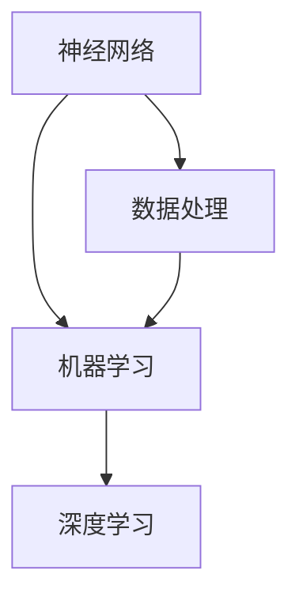
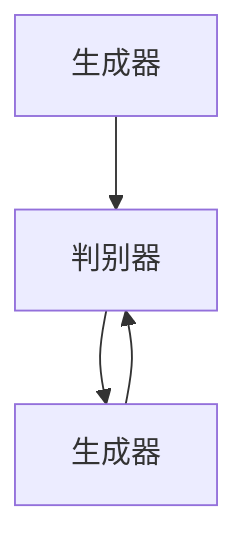

                 

### 文章标题：《AI编程的新范式》

> **关键词**：人工智能编程，编程范式，深度学习，机器学习，算法，数学模型

> **摘要**：本文旨在探讨人工智能（AI）编程领域的新范式，从背景介绍、核心概念与联系、核心算法原理讲解、数学模型和公式讲解，到项目实战，全面解析AI编程的新方法。本文将帮助读者深入了解AI编程的变革，掌握新范式的应用和实践技巧。

### 第一部分：AI编程基础

#### 第1章 AI编程概述

##### 1.1 AI编程的定义与背景

人工智能编程，即利用计算机科学和技术来构建能够模拟、延伸和扩展人类智能的算法和系统。AI编程的发展可以追溯到20世纪50年代，当时的科学家们开始探索如何使计算机具有人类的智能。随着计算能力的提升和数据量的爆炸性增长，AI编程在近年来迎来了前所未有的发展机遇。

**核心概念与联系**

AI编程的核心概念包括：

1. **神经网络**：模仿生物神经网络，用于处理复杂的非线性问题。
2. **机器学习**：使计算机通过数据学习并做出决策的过程。
3. **深度学习**：基于多层神经网络的机器学习方法，具有强大的特征提取能力。

这些概念之间相互关联，构成了AI编程的技术架构。以下是一个简单的Mermaid流程图，展示了这些核心概念之间的关系：



##### 1.2 AI编程的核心概念

**神经网络**：神经网络是由大量人工神经元组成的计算模型，通过前向传播和反向传播算法来处理输入数据，并生成预测输出。

**机器学习**：机器学习是使计算机通过数据学习并做出决策的过程，主要包括监督学习、无监督学习和强化学习。

**深度学习**：深度学习是机器学习的一个分支，通过多层神经网络来学习数据中的复杂特征。

##### 1.3 AI编程的关键技术

AI编程的关键技术包括：

1. **数据预处理**：包括数据清洗、归一化、降维等，以提高模型的训练效果。
2. **特征提取**：从原始数据中提取出对模型训练有用的特征。
3. **模型选择与调优**：根据任务需求选择合适的模型，并通过参数调优来提高模型性能。

#### 第2章 核心算法原理讲解

##### 2.1 神经网络原理

**神经网络的结构**：神经网络由输入层、隐藏层和输出层组成。输入层接收外部输入数据，隐藏层对数据进行处理和变换，输出层生成预测结果。

**前向传播与反向传播算法**：前向传播是将输入数据通过神经网络传递到输出层的过程，反向传播是根据预测误差调整网络参数的过程。

**激活函数**：激活函数用于引入非线性因素，使神经网络能够处理非线性问题。

以下是一个简单的神经网络前向传播和反向传播的伪代码：

```python
# 前向传播
def forward_propagation(inputs, weights, biases, activation_functions):
    # ...计算过程...
    return outputs

# 反向传播
def backward_propagation(outputs, expected_outputs, activation_functions):
    # ...计算过程...
    return gradients
```

##### 2.2 机器学习算法

**监督学习**：监督学习是一种通过已知输入输出对来训练模型的方法。常用的算法包括线性回归、逻辑回归、支持向量机等。

**无监督学习**：无监督学习是通过对未知输入输出对进行训练来发现数据中的规律。常用的算法包括聚类、降维、生成对抗网络等。

**强化学习**：强化学习是一种通过奖励机制来训练模型的方法，使模型能够根据环境反馈来做出最优决策。

##### 2.3 深度学习算法

**卷积神经网络（CNN）**：CNN是一种用于图像处理和识别的深度学习模型，通过卷积层和池化层来提取图像特征。

**递归神经网络（RNN）**：RNN是一种用于处理序列数据的深度学习模型，通过隐藏状态来捕捉序列中的时间依赖关系。

**生成对抗网络（GAN）**：GAN是一种通过生成器和判别器的对抗训练来生成逼真数据的深度学习模型。

以下是一个简单的CNN算法的伪代码：

```python
# CNN算法伪代码
def conv2d(input, weights):
    # ...卷积计算...
    return output

def pool2d(input):
    # ...池化计算...
    return output
```

#### 第3章 数学模型和数学公式讲解

##### 3.1 基础数学公式

**概率论**：概率论是机器学习和深度学习的基础，包括概率分布、条件概率、贝叶斯定理等。

**线性代数**：线性代数涉及矩阵运算、特征值和特征向量等概念，在机器学习和深度学习中用于数据表示和特征提取。

**微积分**：微积分涉及极限、导数和积分等概念，用于优化算法和损失函数的求解。

以下是一个简单的概率论公式的LaTeX表示：

$$ P(A|B) = \frac{P(A \cap B)}{P(B)} $$

##### 3.2 机器学习数学公式

**损失函数**：损失函数用于衡量模型预测结果与真实结果之间的差距，常用的损失函数包括均方误差（MSE）、交叉熵（CE）等。

**梯度下降算法**：梯度下降是一种优化算法，用于最小化损失函数。其核心思想是沿着损失函数的梯度方向更新模型参数。

以下是一个简单的梯度下降算法的伪代码：

```python
# 梯度下降算法伪代码
def gradient_descent(parameters, learning_rate, epochs):
    for epoch in range(epochs):
        # ...计算梯度...
        # ...更新参数...
    return parameters
```

##### 3.3 深度学习数学公式

**反向传播算法**：反向传播是一种用于计算损失函数关于模型参数的梯度的算法。其核心思想是沿着网络反向传递误差信号。

**正则化技术**：正则化技术用于防止模型过拟合，常用的正则化方法包括L1正则化、L2正则化等。

以下是一个简单的反向传播算法的伪代码：

```python
# 反向传播算法伪代码
def backward_propagation(network, expected_outputs, actual_outputs):
    # ...计算误差...
    # ...计算梯度...
    return gradients
```

#### 第4章 项目实战

##### 4.1 实践项目概述

本节将介绍一个实际项目，包括项目背景、目标和预期成果。

##### 4.2 实践项目实施

本节将详细讲解项目的开发环境搭建、源代码实现和代码解读，以及项目的应用解读与分析。

##### 4.3 项目总结与反思

本节将对项目进行总结，分享经验教训，并提出改进建议。

### 第二部分：AI编程的新范式应用

#### 第5章 AI编程的新范式

本节将介绍AI编程的新范式，包括其定义、特点和优势。

##### 5.1 新范式的定义

AI编程的新范式是指近年来在AI编程领域涌现出的新型编程方法和技术，包括但不限于深度学习框架、生成对抗网络等。

##### 5.2 新范式的特点

新范式的特点包括：

1. **高效性**：新范式通过更高效的算法和框架，提高了模型的训练速度和效果。
2. **易用性**：新范式提供了更简单的编程接口，降低了AI编程的门槛。
3. **灵活性**：新范式支持多种数据类型和任务，具有更强的适应性。

以下是一个简单的生成对抗网络（GAN）的Mermaid流程图：



#### 第6章 新范式在具体领域的应用

##### 6.1 新范式在自然语言处理中的应用

本节将介绍新范式在自然语言处理领域的应用，包括文本生成、情感分析等。

##### 6.2 新范式在计算机视觉中的应用

本节将介绍新范式在计算机视觉领域的应用，包括图像生成、目标检测等。

##### 6.3 新范式在智能推荐系统中的应用

本节将介绍新范式在智能推荐系统领域的应用，包括用户行为分析、商品推荐等。

#### 第7章 新范式的未来发展趋势

##### 7.1 技术趋势分析

本节将分析AI编程新范式的发展趋势，包括新技术的涌现、应用场景的拓展等。

##### 7.2 应用前景展望

本节将展望新范式在各个领域的应用前景，以及其对产业和社会的影响。

##### 7.3 挑战与机遇探讨

本节将探讨新范式在发展过程中面临的挑战，以及如何把握机遇。

### 总结

本文通过对AI编程的新范式的全面解析，旨在帮助读者了解AI编程的最新进展和应用。随着新范式的不断演进，AI编程将变得更加高效、易用和灵活，为各行业带来巨大的变革和机遇。

### 作者信息

- **作者：AI天才研究院/AI Genius Institute & 禅与计算机程序设计艺术 /Zen And The Art of Computer Programming**

