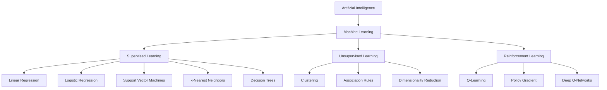

                 


# AI Programming: New Perspectives

## Keywords
- AI Programming
- Machine Learning
- Deep Learning
- Data Science
- Neural Networks
- Ethical Considerations

## Abstract
This article delves into the realm of AI programming, exploring new perspectives on how to harness the power of AI to drive innovation and solve complex problems. It covers fundamental concepts, practical applications, and the ethical implications of AI programming, offering a comprehensive guide for both beginners and experienced programmers.

## Introduction

### The Evolution of AI Programming

Artificial Intelligence (AI) has been a topic of interest for over six decades, with its roots in computer science and artificial neural networks. Over the years, AI has evolved from rule-based systems to expert systems and now to machine learning (ML) and deep learning (DL) algorithms. This evolution has led to the development of sophisticated AI models capable of performing tasks that were once thought to be the exclusive domain of humans.

### The Significance of AI Programming

AI programming is not just about creating intelligent machines; it's about leveraging AI to solve real-world problems more efficiently. From healthcare to finance, from manufacturing to entertainment, AI is transforming industries and creating new opportunities for innovation.

## Part I: Fundamental Concepts and Theoretical Background

### Chapter 1: AI and Machine Learning Basics

#### 1.1 Introduction to AI

Artificial Intelligence refers to the simulation of human intelligence in machines that are programmed to think like humans and mimic their actions. AI systems are designed to perceive their environment, learn from experiences, and take actions to achieve specific goals.

#### 1.2 Machine Learning Basics

Machine learning (ML) is a subset of AI that focuses on the development of algorithms that can learn from and make predictions or decisions based on data. ML algorithms are categorized into three types: supervised learning, unsupervised learning, and reinforcement learning.

#### 1.3 Types of Machine Learning Algorithms

- **Supervised Learning Algorithms:**
  - Linear Regression
  - Logistic Regression
  - Support Vector Machines (SVM)
  - k-Nearest Neighbors (k-NN)
  - Decision Trees

- **Unsupervised Learning Algorithms:**
  - Clustering Algorithms (e.g., K-Means, DBSCAN)
  - Association Rules Mining (e.g., Apriori Algorithm)
  - Dimensionality Reduction (e.g., Principal Component Analysis, t-SNE)

- **Reinforcement Learning Algorithms:**
  - Q-Learning
  - Policy Gradient Methods
  - Deep Q-Networks (DQN)

#### 1.4 AI and ML: A Mermaid Flowchart



### Chapter 2: Neural Networks and Deep Learning

#### 2.1 Neural Networks

Neural networks are a fundamental component of AI, designed to mimic the structure and function of the human brain. They consist of interconnected nodes or neurons that process and transmit information.

#### 2.2 Deep Learning Architectures

Deep learning (DL) is a subfield of machine learning that focuses on artificial neural networks with many layers. The most common deep learning architectures include Convolutional Neural Networks (CNNs) and Recurrent Neural Networks (RNNs).

#### 2.3 Backpropagation Algorithm (Pseudocode)

```python
def backpropagation(network, input_data, target_output):
    # Calculate the output of the network
    output = network.forward_pass(input_data)

    # Calculate the error
    error = target_output - output

    # Perform the backward pass
    for layer in reversed(network.layers):
        # Calculate the delta for each weight in the layer
        delta = error * layer Activation_derivative(output)
        # Update the weights
        layer.weights -= learning_rate * delta

    return error
```

#### 2.4 Convolutional Neural Networks (CNNs)

Convolutional Neural Networks (CNNs) are specialized in processing data with a grid-like topology, such as images. They are particularly effective in tasks like image recognition and object detection.

#### 2.5 Recurrent Neural Networks (RNNs)

Recurrent Neural Networks (RNNs) are designed to handle sequential data, making them suitable for tasks like time series analysis and natural language processing.

## Part II: Practical Applications and Projects

### Chapter 3: AI in Data Science

#### 3.1 Data Preprocessing and Exploration

Data preprocessing is a crucial step in the data science pipeline, involving tasks such as cleaning, transforming, and normalizing data to make it suitable for analysis.

#### 3.2 Regression Analysis with AI

Regression analysis is a statistical method used to determine the relationship between a dependent variable and one or more independent variables. AI algorithms can enhance regression analysis by providing more accurate predictions.

#### 3.3 Classification with Neural Networks

Classification is the task of assigning data points to one of several predefined categories. Neural networks, particularly CNNs and RNNs, are powerful tools for classification tasks.

#### 3.4 Project: Building a Predictive Model

In this project, readers will learn to build a predictive model using machine learning algorithms. The project will involve data preprocessing, model selection, training, and evaluation.

#### 3.5 Case Study: Analyzing Customer Data for a Retail Business

This case study will explore how a retail business can use AI to analyze customer data and gain insights into customer behavior, leading to improved marketing strategies and increased sales.

### Chapter 4: AI in Business Applications

#### 4.1 AI for Customer Service

AI can significantly enhance customer service by automating routine tasks, providing personalized experiences, and enabling real-time support.

#### 4.2 AI in Supply Chain Management

AI can optimize supply chain operations by predicting demand, optimizing inventory levels, and improving logistics.

#### 4.3 AI in Healthcare

AI is revolutionizing healthcare by enabling more accurate diagnostics, personalized treatments, and improved patient care.

## Part III: Ethical Considerations and Future Trends

### Chapter 5: Ethical Considerations in AI Programming

The ethical implications of AI programming are a growing concern. This chapter will explore issues such as bias, privacy, and transparency in AI systems.

### Chapter 6: Future Trends in AI Programming

This chapter will discuss future trends in AI programming, including advancements in AI hardware, the integration of AI with other technologies, and the impact of AI on the future of work.

## Conclusion

AI programming is at the forefront of technological innovation, offering endless possibilities for solving complex problems and driving progress across various industries. This article has provided a comprehensive overview of the key concepts, practical applications, and ethical considerations of AI programming, setting the stage for further exploration and experimentation.

## References

- Mitchell, T. M. (1997). Machine Learning. McGraw-Hill.
- Goodfellow, I., Bengio, Y., & Courville, A. (2016). Deep Learning. MIT Press.
- Russell, S., & Norvig, P. (2020). Artificial Intelligence: A Modern Approach. Prentice Hall.
- LeCun, Y., Bengio, Y., & Hinton, G. (2015). Deep Learning. Nature.

## Author Information

### Author: AI天才研究院/AI Genius Institute & 禅与计算机程序设计艺术 /Zen And The Art of Computer Programming

### Acknowledgments

I would like to express my gratitude to the team at AI天才研究院 and the readers for their continuous support and encouragement. This book would not have been possible without their invaluable contributions. Special thanks to my collaborators and mentors for their guidance and insights.

