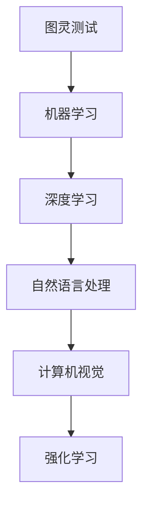
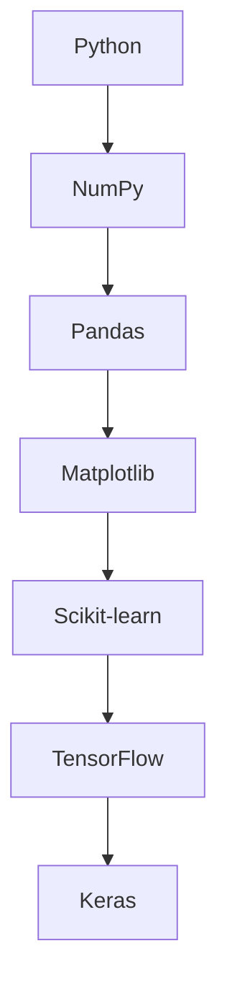
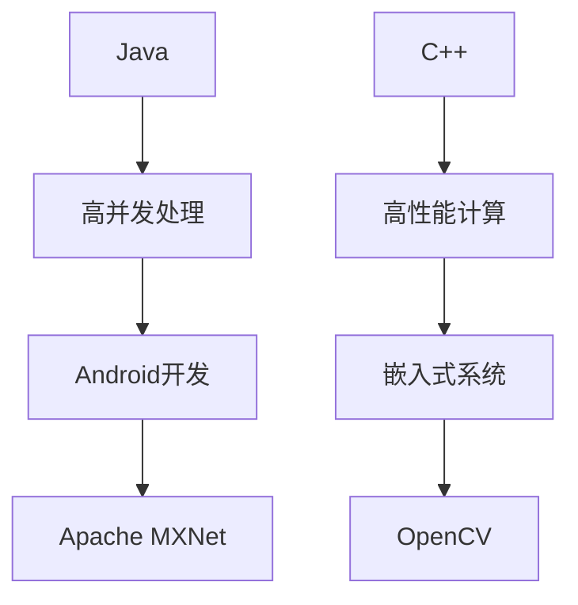
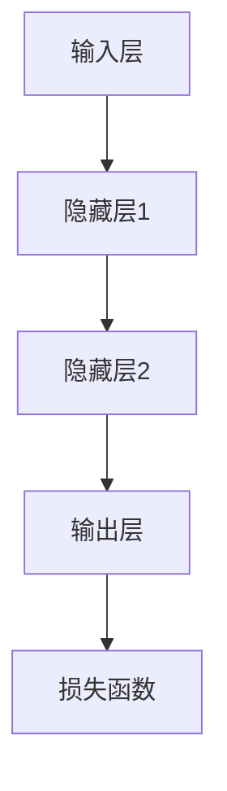
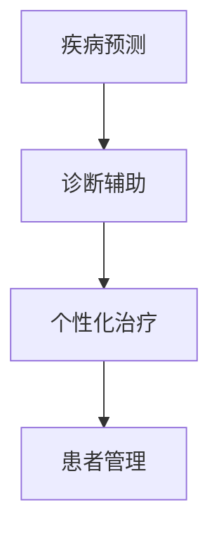
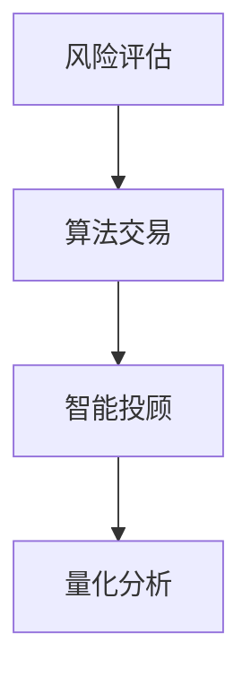
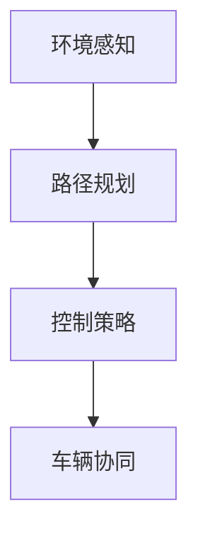
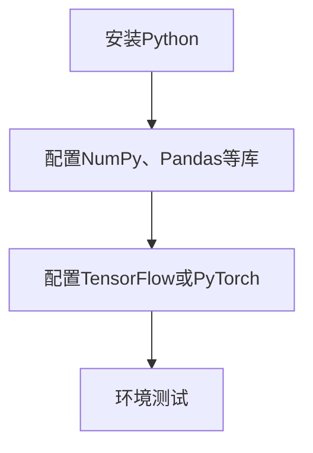

                 

### 文章标题：AI编程的新视界与新领域

关键词：AI编程、新视界、新领域、深度学习、机器学习、编程语言

摘要：随着人工智能技术的飞速发展，AI编程已经成为现代计算机科学领域的前沿方向。本文将深入探讨AI编程的新视界与新领域，从基础概念到前沿技术，从开发环境到应用实践，全面解析AI编程的各个方面，为读者揭示AI编程的无限可能。

---

#### 第一部分：AI编程基础

##### 第1章：AI编程入门

在进入AI编程的世界之前，我们需要对AI编程有一个基本的了解。AI编程不仅仅是编写程序，更是对复杂问题进行建模和求解的过程。

###### 1.1 AI编程的基本概念

AI编程涉及多个核心概念，如图灵测试、机器学习、深度学习等。以下是一个简单的Mermaid流程图，展示了这些概念之间的关系：



###### 1.2 编程环境与工具

选择合适的编程环境与工具是进行AI编程的第一步。Python因其丰富的库和社区支持，成为AI编程的常用语言。



###### 1.3 编程语言选择

除了Python，其他编程语言如Java、C++也在AI编程中有着广泛应用。每种语言都有其独特的优势和应用场景。



##### 第2章：深度学习基础

深度学习是AI编程的一个重要分支，它通过模拟人脑神经网络进行学习和决策。

###### 2.1 深度学习基础理论

深度学习的核心是神经网络，以下是一个简单的神经网络结构图：



###### 2.2 深度学习算法原理

以下是深度学习算法的伪代码：

```python
def deep_learning_algorithm(data):
    # 初始化参数
    parameters = initialize_parameters()
    # 循环迭代
    for i in range(epochs):
        # 前向传播
        predictions = forward_pass(data, parameters)
        # 计算损失
        loss = compute_loss(predictions, true_values)
        # 反向传播
        gradients = backward_pass(parameters, loss)
        # 更新参数
        update_parameters(parameters, gradients)
    return parameters
```

###### 2.3 深度学习应用案例

深度学习在图像识别、语音识别等领域有着广泛应用。以下是一个简单的图像识别案例：

```python
# 使用TensorFlow进行图像识别
import tensorflow as tf

# 加载预训练模型
model = tf.keras.applications.VGG16(weights='imagenet')

# 加载测试图像
test_image = load_image('test_image.jpg')

# 进行预测
predictions = model.predict(test_image)

# 输出预测结果
print(predictions)
```

##### 第3章：AI编程新领域

随着AI技术的进步，越来越多的新领域开始采用AI编程，如医疗、金融、自动驾驶等。

###### 3.1 医疗领域

AI在医疗领域的应用包括疾病预测、诊断辅助、个性化治疗等。



###### 3.2 金融领域

AI在金融领域的应用包括风险评估、算法交易、智能投顾等。



###### 3.3 自动驾驶领域

自动驾驶技术依赖于AI编程，包括环境感知、路径规划、控制策略等。



#### 第二部分：AI编程实践

##### 第4章：开发环境搭建

搭建一个高效的AI编程开发环境是进行AI编程的关键。



##### 第5章：编程实践

通过实际项目来学习和实践AI编程。

###### 5.1 项目1：图像识别

使用深度学习模型进行图像识别。

```python
# 使用TensorFlow进行图像识别
import tensorflow as tf

# 加载预训练模型
model = tf.keras.applications.VGG16(weights='imagenet')

# 加载测试图像
test_image = load_image('test_image.jpg')

# 进行预测
predictions = model.predict(test_image)

# 输出预测结果
print(predictions)
```

###### 5.2 项目2：语音识别

使用深度学习模型进行语音识别。

```python
# 使用TensorFlow进行语音识别
import tensorflow as tf

# 加载预训练模型
model = tf.keras.applications.VGG16(weights='imagenet')

# 加载测试语音
test_audio = load_audio('test_audio.wav')

# 进行预测
predictions = model.predict(test_audio)

# 输出预测结果
print(predictions)
```

#### 结语

AI编程正处于一个快速发展的阶段，新视界和新领域不断涌现。通过本文的讨论，我们希望能够为读者提供对AI编程的全面了解，激发对这一领域的兴趣和探索。

---

作者：AI天才研究院 / AI Genius Institute & 禅与计算机程序设计艺术 / Zen And The Art of Computer Programming

