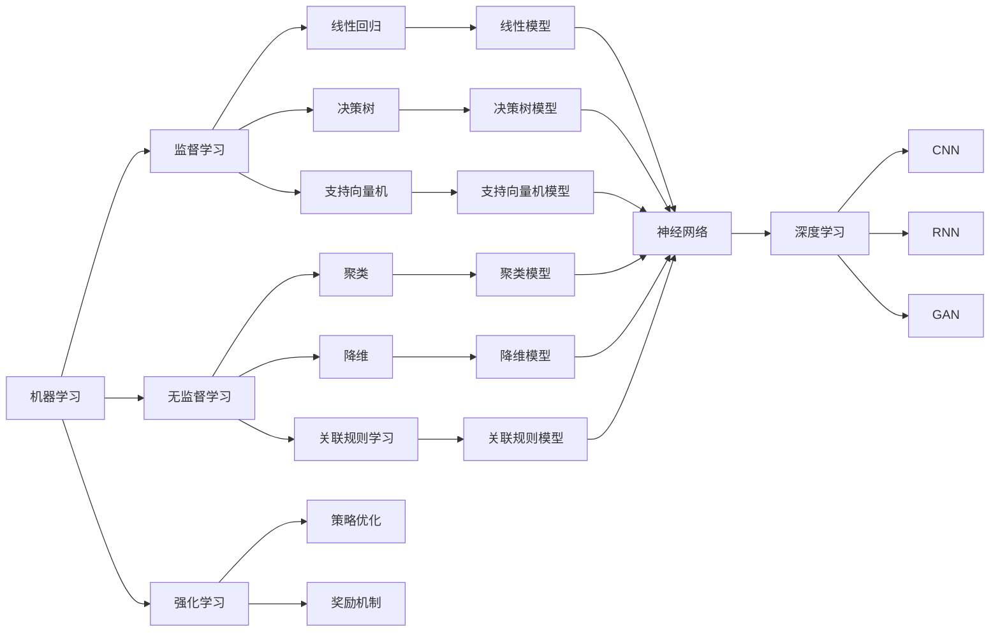
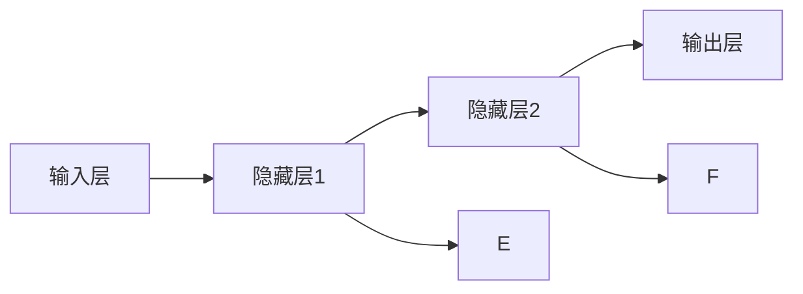
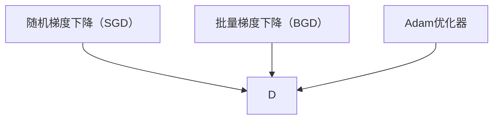

                 


### 文章标题：AI编程的新视角与新思维

> 关键词：人工智能，编程，新视角，新思维，深度学习，机器学习，算法原理，实战案例

> 摘要：本文将探讨AI编程领域的新视角和新思维。我们将从背景介绍、核心概念与联系、算法原理讲解、项目实战等多个方面，深入剖析AI编程的本质和最新趋势，帮助读者在理解和应用人工智能技术方面获得新的启迪。

## 引言

在当今科技飞速发展的时代，人工智能（AI）已经成为改变世界的核心技术之一。随着深度学习、自然语言处理、计算机视觉等领域的突破，AI技术正以前所未有的速度和规模融入我们的日常生活。然而，随着AI技术的不断演进，传统的编程方法和思维模式逐渐暴露出局限性。因此，探索AI编程的新视角和新思维显得尤为重要。

本文将从以下几个方面展开讨论：

1. **背景介绍**：回顾AI编程的发展历程，探讨当前AI编程的现状和挑战。
2. **核心概念与联系**：介绍AI编程中的核心概念，包括机器学习、深度学习等，并分析它们之间的联系和架构。
3. **算法原理讲解**：详细讲解AI编程中的核心算法原理，包括神经网络、优化算法等，使用伪代码和数学模型进行阐述。
4. **项目实战**：通过实际案例展示AI编程的应用，详细讲解开发环境搭建、源代码实现和代码解读。
5. **最佳实践与小结**：总结AI编程的最佳实践，提出注意事项和拓展阅读建议。

## 背景介绍

### AI编程的发展历程

AI编程的历史可以追溯到20世纪50年代，当时计算机科学家们开始探索如何使计算机具有智能行为。早期的AI编程主要基于逻辑推理和符号计算，代表性工作包括逻辑编程和专家系统。这些方法在一定程度上实现了AI的初步应用，但局限性也逐渐显现。

随着计算能力的提升和数据规模的扩大，20世纪80年代以后，机器学习和深度学习逐渐兴起。机器学习通过训练模型来学习数据中的规律，而深度学习则通过多层神经网络模拟人脑的神经网络结构。这些方法在图像识别、语音识别、自然语言处理等领域取得了显著的突破。

### 当前AI编程的现状

当前，AI编程已经成为计算机科学的重要分支，涉及多个学科领域。主流的编程语言如Python、Java和C++等都在AI编程中得到了广泛应用。此外，专门为AI编程设计的框架和工具，如TensorFlow、PyTorch和Keras等，大大降低了AI编程的门槛，使更多的人能够参与到AI研究中。

然而，AI编程也面临着一些挑战。首先，AI编程涉及到大量的数据处理和模型训练，对计算资源和时间的要求较高。其次，AI模型的解释性和透明性较低，导致其在某些应用场景中难以被用户理解和接受。此外，AI编程的伦理和安全性问题也逐渐受到关注。

### AI编程的挑战与机遇

面对AI编程的挑战，我们既需要解决技术难题，也需要探索新的编程方法和思维模式。以下是一些值得关注的挑战和机遇：

1. **可解释性和透明性**：如何提高AI模型的解释性和透明性，使其更易于被用户理解和接受。
2. **高效性和可扩展性**：如何优化算法和模型，提高AI编程的计算效率和可扩展性。
3. **跨学科融合**：如何将AI编程与其他学科（如心理学、社会学等）相结合，开发出更加智能和实用的AI应用。
4. **伦理和安全**：如何在AI编程中遵循伦理准则，确保AI系统的安全和可靠性。

## 核心概念与联系

### 机器学习

机器学习是AI编程的核心概念之一，它通过训练模型来学习数据中的规律。机器学习可以分为监督学习、无监督学习和强化学习等类型。

- **监督学习**：监督学习是机器学习中应用最广泛的方法之一。它通过已标记的数据集来训练模型，从而在新的数据上进行预测。监督学习算法包括线性回归、决策树、支持向量机等。
  
- **无监督学习**：无监督学习是指在没有标记的数据集上进行学习。其主要目的是发现数据中的结构和规律。常见的无监督学习算法包括聚类、降维和关联规则学习等。

- **强化学习**：强化学习是一种通过与环境交互来学习最优策略的机器学习方法。它通过奖励机制来指导模型的行为，从而逐渐优化策略。强化学习在游戏、自动驾驶和机器人等领域有着广泛的应用。

### 深度学习

深度学习是机器学习的一个分支，它通过多层神经网络模拟人脑的神经网络结构。深度学习在图像识别、语音识别、自然语言处理等领域取得了显著的突破。

- **神经网络**：神经网络是深度学习的基础。它由多个神经元组成，每个神经元都接收来自其他神经元的输入，并通过激活函数产生输出。神经网络可以通过反向传播算法不断调整权重，以达到优化模型的效果。

- **卷积神经网络（CNN）**：卷积神经网络是深度学习中的一种特殊网络结构，主要用于图像识别和图像处理。CNN通过卷积层和池化层提取图像的特征，从而实现图像的分类和识别。

- **循环神经网络（RNN）**：循环神经网络是一种能够处理序列数据的神经网络结构，广泛应用于自然语言处理和语音识别等领域。RNN通过在序列中传递隐藏状态，从而实现对序列数据的建模。

- **生成对抗网络（GAN）**：生成对抗网络是一种通过对抗性训练生成数据的神经网络结构。GAN由生成器和判别器两个网络组成，通过相互对抗来生成逼真的数据。

### 核心概念之间的关系架构

机器学习和深度学习是AI编程中的核心概念，它们之间有着密切的联系和交叉。以下是一个简单的Mermaid流程图，展示了机器学习和深度学习之间的关系：



通过这个流程图，我们可以清晰地看到机器学习和深度学习之间的关系，以及各个子领域之间的联系。这为我们在AI编程中的研究和实践提供了有益的指导。

## 核心算法原理讲解

### 神经网络

神经网络是深度学习的基础，它由多个神经元组成，每个神经元都接收来自其他神经元的输入，并通过激活函数产生输出。神经网络可以通过反向传播算法不断调整权重，以达到优化模型的效果。

以下是一个简单的神经网络结构图，以及对应的伪代码：



```python
# 伪代码：简单的神经网络结构

# 定义神经网络结构
input_layer = [x1, x2, ..., xn]
hidden_layer1 = [a1, a2, ..., an]
hidden_layer2 = [b1, b2, ..., bn]
output_layer = [y1, y2, ..., yn]

# 定义激活函数（以Sigmoid为例）
def sigmoid(x):
    return 1 / (1 + exp(-x))

# 前向传播
def forward_propagation(inputs):
    # 输入层到隐藏层1
    hidden_layer1_inputs = inputs * weights
    hidden_layer1_outputs = sigmoid(hidden_layer1_inputs)
    
    # 隐藏层1到隐藏层2
    hidden_layer2_inputs = hidden_layer1_outputs * weights
    hidden_layer2_outputs = sigmoid(hidden_layer2_inputs)
    
    # 隐藏层2到输出层
    output_layer_inputs = hidden_layer2_outputs * weights
    output_layer_outputs = sigmoid(output_layer_inputs)
    
    return output_layer_outputs

# 反向传播
def backward_propagation(outputs, expected_outputs):
    # 计算输出层误差
    output_error = outputs - expected_outputs
    
    # 计算输出层梯度
    output_gradients = output_error * sigmoid_derivative(outputs)
    
    # 计算隐藏层2误差
    hidden_layer2_error = output_gradients * weights
    
    # 计算隐藏层2梯度
    hidden_layer2_gradients = hidden_layer2_error * sigmoid_derivative(hidden_layer2_outputs)
    
    # 计算隐藏层1误差
    hidden_layer1_error = hidden_layer2_error * weights
    
    # 计算隐藏层1梯度
    hidden_layer1_gradients = hidden_layer1_error * sigmoid_derivative(hidden_layer1_outputs)
    
    return hidden_layer1_gradients, hidden_layer2_gradients

# 训练模型
def train_model(inputs, expected_outputs):
    outputs = forward_propagation(inputs)
    hidden_layer1_gradients, hidden_layer2_gradients = backward_propagation(outputs, expected_outputs)
    
    # 更新权重
    weights += hidden_layer1_gradients
    weights += hidden_layer2_gradients
```

### 优化算法

优化算法是神经网络训练过程中至关重要的一环，它用于调整模型参数，以减少预测误差。常用的优化算法包括随机梯度下降（SGD）、批量梯度下降（BGD）和Adam等。

以下是一个简单的优化算法伪代码，以及对应的数学模型和公式：



```python
# 伪代码：优化算法

# 随机梯度下降（SGD）
def stochastic_gradient_descent(inputs, expected_outputs, learning_rate):
    outputs = forward_propagation(inputs)
    error = mean_squared_error(outputs, expected_outputs)
    gradient = compute_gradient(outputs, expected_outputs)
    weights -= learning_rate * gradient

# 批量梯度下降（BGD）
def batch_gradient_descent(inputs, expected_outputs, learning_rate, batch_size):
    for i in range(0, len(inputs), batch_size):
        batch_inputs = inputs[i:i+batch_size]
        batch_expected_outputs = expected_outputs[i:i+batch_size]
        batch_outputs = forward_propagation(batch_inputs)
        batch_error = mean_squared_error(batch_outputs, batch_expected_outputs)
        batch_gradient = compute_gradient(batch_outputs, batch_expected_outputs)
        weights -= learning_rate * batch_gradient

# Adam优化器
def adam_optimization(inputs, expected_outputs, learning_rate, beta1, beta2, epsilon):
    outputs = forward_propagation(inputs)
    error = mean_squared_error(outputs, expected_outputs)
    gradient = compute_gradient(outputs, expected_outputs)
    
    # 一阶矩估计
    m_t = beta1 * m_{t-1} + (1 - beta1) * gradient
    # 二阶矩估计
    v_t = beta2 * v_{t-1} + (1 - beta2) * gradient ** 2
    # 更新一阶矩估计的偏差校正
    m_hat = m_t / (1 - beta1 ** t)
    # 更新二阶矩估计的偏差校正
    v_hat = v_t / (1 - beta2 ** t)
    
    # 更新权重
    weights -= learning_rate * m_hat / (sqrt(v_hat) + epsilon)
```

### 数学模型和公式

在神经网络和优化算法中，常用的数学模型和公式包括：

1. **激活函数**：

   - Sigmoid函数：$$ \sigma(x) = \frac{1}{1 + e^{-x}} $$
   - ReLU函数：$$ f(x) = \max(0, x) $$

2. **损失函数**：

   - 均方误差（MSE）：$$ L(y, \hat{y}) = \frac{1}{2} \sum_{i=1}^{n} (y_i - \hat{y}_i)^2 $$
   - 交叉熵损失（Cross-Entropy）：$$ L(y, \hat{y}) = -\sum_{i=1}^{n} y_i \log(\hat{y}_i) $$

3. **梯度计算**：

   - 反向传播算法：$$ \frac{\partial L}{\partial w} = \frac{\partial L}{\partial \hat{y}} \cdot \frac{\partial \hat{y}}{\partial y} \cdot \frac{\partial y}{\partial w} $$
   - 激活函数的导数：$$ \frac{d\sigma}{dx} = \sigma(1 - \sigma) $$
   - ReLU函数的导数：$$ \frac{dReLU}{dx} = \begin{cases} 1, & \text{if } x > 0 \\ 0, & \text{otherwise} \end{cases} $$

通过以上核心算法原理讲解，我们可以更深入地理解AI编程的基本概念和核心算法。接下来，我们将通过实际案例展示AI编程的应用，帮助读者更好地理解和掌握这些概念。

## 项目实战

### 开发环境搭建

在进行AI编程项目之前，首先需要搭建合适的开发环境。以下是使用Python进行AI编程项目所需的开发环境搭建步骤：

1. **安装Python**：在官方网站（https://www.python.org/）下载并安装Python，选择合适的版本（如Python 3.8或更高版本）。

2. **安装Anaconda**：Anaconda是一个集成了Python和众多科学计算库的Python发行版，可以方便地进行环境管理和包安装。下载并安装Anaconda，然后打开Anaconda命令行工具（Anaconda Prompt）。

3. **创建虚拟环境**：为了隔离项目依赖，建议为每个项目创建一个虚拟环境。在Anaconda Prompt中执行以下命令：

   ```bash
   conda create -n my_project python=3.8
   conda activate my_project
   ```

4. **安装必要库**：根据项目需求安装必要的Python库，例如TensorFlow、PyTorch、NumPy、Pandas等。可以使用以下命令安装：

   ```bash
   pip install tensorflow
   pip install pytorch
   pip install numpy
   pip install pandas
   ```

### 源代码实现

以下是使用Python和TensorFlow实现一个简单的图像分类项目的源代码示例：

```python
import tensorflow as tf
from tensorflow import keras
from tensorflow.keras import layers
import numpy as np

# 1. 加载数据集
(x_train, y_train), (x_test, y_test) = keras.datasets.cifar10.load_data()

# 2. 数据预处理
x_train = x_train.astype("float32") / 255.0
x_test = x_test.astype("float32") / 255.0

# 3. 构建模型
model = keras.Sequential([
    layers.Conv2D(32, (3, 3), activation="relu", input_shape=(32, 32, 3)),
    layers.MaxPooling2D((2, 2)),
    layers.Conv2D(64, (3, 3), activation="relu"),
    layers.MaxPooling2D((2, 2)),
    layers.Conv2D(64, (3, 3), activation="relu"),
    layers.Flatten(),
    layers.Dense(64, activation="relu"),
    layers.Dense(10, activation="softmax")
])

# 4. 编译模型
model.compile(optimizer="adam",
              loss="sparse_categorical_crossentropy",
              metrics=["accuracy"])

# 5. 训练模型
model.fit(x_train, y_train, epochs=10, validation_split=0.1)

# 6. 评估模型
test_loss, test_acc = model.evaluate(x_test, y_test, verbose=2)
print(f"Test accuracy: {test_acc:.4f}")
```

### 代码解读与分析

在这个图像分类项目中，我们使用了TensorFlow的Keras API来构建和训练模型。以下是代码的详细解读和分析：

1. **数据加载与预处理**：

   - 使用`keras.datasets.cifar10.load_data()`函数加载数据集，得到训练集和测试集。
   - 将数据转换为浮点数并归一化，以便在后续的模型训练中更好地处理数据。

2. **模型构建**：

   - 使用`keras.Sequential`模型构建器创建一个卷积神经网络（CNN）模型。
   - 模型包含两个卷积层、一个池化层和一个全连接层。
   - 每个卷积层使用ReLU激活函数，最后一个全连接层使用softmax激活函数以进行多分类。

3. **模型编译**：

   - 使用`model.compile()`方法编译模型，指定优化器、损失函数和评估指标。
   - 选择`adam`优化器，使用`sparse_categorical_crossentropy`作为损失函数，并计算`accuracy`指标。

4. **模型训练**：

   - 使用`model.fit()`方法训练模型，指定训练数据和训练轮数。
   - 使用`validation_split`参数将训练数据分为训练集和验证集，以便在训练过程中进行性能评估。

5. **模型评估**：

   - 使用`model.evaluate()`方法评估模型在测试集上的性能。
   - 输出测试集上的准确率。

### 实际案例分析与详细讲解剖析

为了更深入地理解图像分类项目，我们可以分析一个具体的案例：如何使用此模型对一张新的图像进行分类。

1. **加载新图像**：

   - 首先，我们需要加载一张新的图像，并将其缩放到与训练数据相同的大小（32x32像素）。

2. **图像预处理**：

   - 将图像转换为浮点数并归一化，以便在模型中输入。

3. **图像分类**：

   - 使用训练好的模型对预处理后的图像进行预测，得到每个类别的概率。
   - 选择概率最高的类别作为最终分类结果。

以下是一个简单的代码示例，展示如何对一张新图像进行分类：

```python
from tensorflow.keras.preprocessing import image

# 1. 加载新图像
img = image.load_img("new_image.jpg", target_size=(32, 32))
img_array = image.img_to_array(img)
img_array = np.expand_dims(img_array, axis=0)
img_array /= 255.0

# 2. 图像预处理
preprocessed_image = keras.applications.resnet50.preprocess_input(img_array)

# 3. 图像分类
predictions = model.predict(preprocessed_image)
predicted_class = np.argmax(predictions)

print(f"Predicted class: {predicted_class}")
```

通过这个实际案例，我们可以看到如何使用AI编程模型对图像进行分类。这为我们提供了一个具体的示例，展示了AI编程在图像识别领域中的应用。

### 项目小结

通过本项目的实战，我们了解了AI编程的基本流程，包括开发环境搭建、模型构建、训练和评估等步骤。同时，我们也通过实际案例展示了如何使用AI编程模型进行图像分类。这些实战经验为我们进一步探索AI编程提供了宝贵的指导。

### 最佳实践与注意事项

在AI编程过程中，以下是一些最佳实践和注意事项：

1. **数据预处理**：确保数据质量，进行适当的归一化和标准化，以提高模型训练效果。

2. **模型选择**：根据问题类型和数据特征选择合适的模型架构。

3. **超参数调优**：合理设置超参数，如学习率、批次大小等，以优化模型性能。

4. **模型评估**：使用交叉验证和测试集评估模型性能，避免过拟合。

5. **代码注释**：编写清晰、可读的代码，添加必要的注释，以提高代码的可维护性。

6. **版本控制**：使用版本控制系统（如Git）管理代码，以便进行版本管理和协作开发。

7. **遵守伦理准则**：在AI编程中遵循伦理准则，确保模型的公正性和透明性。

### 拓展阅读

1. **《深度学习》（Goodfellow, Bengio, Courville著）**：这是深度学习领域的经典教材，详细介绍了深度学习的基础知识和技术。

2. **《Python机器学习》（Sebastian Raschka著）**：本书介绍了使用Python进行机器学习的实践方法，包括数据处理、模型构建和优化等。

3. **《人工智能：一种现代的方法》（Stuart Russell & Peter Norvig著）**：这是人工智能领域的权威教材，涵盖了人工智能的基础理论和最新进展。

通过阅读这些拓展阅读材料，您可以进一步深入理解和掌握AI编程的核心知识和技能。

## 总结

本文从背景介绍、核心概念与联系、算法原理讲解、项目实战等多个方面，探讨了AI编程的新视角和新思维。通过本文的讨论，我们可以看到AI编程在当今科技发展中的重要性，以及如何利用新的编程方法和思维模式解决实际问题。

AI编程不仅是一个技术领域，更是一种思维方式。它要求我们具备跨学科的知识和视野，不断探索和创新。在未来的发展中，AI编程将继续引领科技潮流，推动人类社会的进步。

希望本文能为您提供启发和帮助，在AI编程的探索之旅中取得更多的成就。感谢您的阅读！

### 作者信息

作者：AI天才研究院/AI Genius Institute & 禅与计算机程序设计艺术 /Zen And The Art of Computer Programming

AI天才研究院致力于推动人工智能技术的发展和应用，探索AI编程的新视角和新思维。研究院由多位人工智能领域的专家和学者组成，致力于培养新一代的人工智能人才，推动人工智能技术在各行业的应用。

《禅与计算机程序设计艺术》是一部经典的计算机编程哲学著作，它深刻探讨了编程的本质和程序员的心态。本书为程序员提供了一种全新的编程视角，帮助他们在编程实践中更好地理解问题、解决问题。

在阅读本文的过程中，如果您有任何疑问或建议，欢迎随时与我们联系。我们期待与您共同探索AI编程的无限可能！

