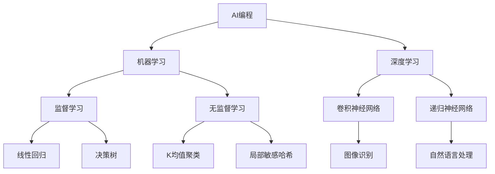

                 

### 引言

#### 1.1 AI编程的背景与重要性

人工智能（AI）作为现代科技的前沿领域，已经成为推动社会发展的重要力量。从早期的专家系统到如今的深度学习，人工智能技术不断取得突破，其应用范围也从工业自动化扩展到医疗、金融、教育、娱乐等多个领域。AI编程，作为实现人工智能的核心手段，扮演着至关重要的角色。

AI编程的重要性体现在以下几个方面：

1. **创新能力驱动**：通过编程，我们可以创造出各种新颖的AI应用，如自动驾驶、智能家居、智能客服等，这些创新极大地丰富了人们的生活。
2. **经济效益提升**：AI编程帮助企业提高生产效率、降低成本，从而提升整体经济效益。例如，在制造业中，AI编程可以优化生产流程，实现自动化生产，提高产品质量。
3. **智能决策支持**：AI编程能够处理海量数据，帮助企业和组织做出更加智能的决策。在金融领域，AI算法可以用于风险评估、市场预测等，为投资者提供有力的决策支持。

在当前社会，AI编程的重要性不言而喻。它不仅是科技企业的重要竞争力，也是推动社会进步的重要力量。因此，掌握AI编程技术已经成为现代人才必备的技能。

#### 1.2 书籍结构概述

本书旨在为读者提供一套全面、系统的AI编程学习指南，内容分为以下几个主要部分：

1. **引言**：介绍AI编程的背景和重要性，概述本书的结构和目标读者。
2. **AI编程基础**：讲解AI编程的基本概念、算法原理和数学模型，为后续章节奠定基础。
3. **AI编程新视角**：探讨AI编程的新技术和新方法，如强化学习、生成对抗网络等。
4. **AI编程的未来趋势**：分析AI编程的发展方向和潜在应用领域，展望未来发展趋势。
5. **AI编程实战**：提供实际的编程案例和实战技巧，帮助读者将理论知识应用于实际项目中。
6. **AI编程工具与资源**：介绍常用的AI编程工具和资源，帮助读者高效地开展AI编程工作。

通过本书的学习，读者不仅能够掌握AI编程的基本知识和技能，还能了解AI编程的最新动态和发展趋势，为未来的职业生涯奠定坚实基础。

#### 1.3 学习资源介绍

为了帮助读者更好地学习AI编程，本书提供了一系列丰富的学习资源：

1. **代码仓库与示例**：本书附带的代码仓库包含了所有的编程示例和项目实战代码，读者可以方便地下载和使用。
2. **延伸阅读材料**：本书推荐了一系列优秀的AI编程相关书籍和论文，读者可以通过这些资源进一步深入学习。

通过利用这些学习资源，读者可以更加系统地学习和掌握AI编程，为将来的职业发展打下坚实基础。

#### 1.4 学习方法建议

为了有效地学习AI编程，以下是一些实用的学习方法建议：

1. **理论与实践相结合**：理论学习是基础，但实践是检验真理的唯一标准。通过实际编程项目，读者可以更好地理解AI编程的原理和应用。
2. **持续学习的态度**：科技日新月异，持续学习是保持竞争力的关键。读者应该养成定期阅读最新技术文献和参与技术社区的习惯。
3. **团队合作与交流**：与他人合作可以拓宽视野，提高解决问题的能力。参加技术会议、研讨会和线上讨论组，可以与业界同仁交流经验，共同进步。

通过采用这些学习方法，读者可以更加高效地掌握AI编程，为未来的职业发展奠定坚实基础。

#### 1.5 AI编程的核心概念与联系

为了帮助读者更好地理解AI编程的核心概念，本书使用了Mermaid流程图来展示AI编程的核心概念及其相互关系。以下是AI编程的核心概念及其关系的Mermaid流程图：

在上述流程图中：

- **AI编程**是整个图谱的起点，涵盖了所有相关的子领域。
- **机器学习**和**深度学习**是AI编程的两个重要分支，分别涵盖了多种学习方法和应用场景。
- **监督学习**和**无监督学习**分别代表了有监督和无监督数据学习的方式。
- **卷积神经网络（CNN）**和**递归神经网络（RNN）**是深度学习中的重要模型，分别用于图像识别和自然语言处理等任务。
- **线性回归**和**决策树**是监督学习中的常用算法。
- **K均值聚类**和**局部敏感哈希（LSH）**是无监督学习中的常用算法。

通过上述流程图，读者可以清晰地了解AI编程的核心概念及其相互关系，为后续章节的学习打下坚实的基础。

#### 1.6 AI编程的关键术语解释

在AI编程的学习过程中，理解一系列关键术语是至关重要的。以下是对一些核心术语的解释，帮助读者更好地掌握AI编程的基础知识。

1. **机器学习（Machine Learning）**：
   - 定义：机器学习是一种使计算机系统能够从数据中学习并做出决策或预测的方法，而不需要显式地编程指令。
   - 关键概念：模型训练、数据集、特征提取、算法评估等。
   - 应用：分类、回归、聚类等。

2. **深度学习（Deep Learning）**：
   - 定义：深度学习是机器学习的一个子领域，它使用具有多个隐藏层的神经网络来模拟人脑的神经结构，从而实现对复杂数据的自动特征学习和模式识别。
   - 关键概念：神经元、激活函数、前向传播、反向传播等。
   - 应用：图像识别、语音识别、自然语言处理等。

3. **监督学习（Supervised Learning）**：
   - 定义：监督学习是一种机器学习方法，其中训练数据包含输入特征和对应的输出标签，模型通过学习这些标签来预测新的输入特征。
   - 关键概念：损失函数、优化算法、模型评估等。
   - 应用：分类、回归等。

4. **无监督学习（Unsupervised Learning）**：
   - 定义：无监督学习是一种机器学习方法，其中模型没有提供标签的数据，其目标是发现数据中的内在结构和规律。
   - 关键概念：聚类、降维、异常检测等。
   - 应用：数据探索、数据压缩等。

5. **神经网络（Neural Network）**：
   - 定义：神经网络是一种由大量简单处理单元（神经元）组成的信息处理系统，通过这些神经元之间的连接来模拟人脑的信息处理过程。
   - 关键概念：神经元结构、激活函数、网络训练等。
   - 应用：函数拟合、模式识别等。

6. **卷积神经网络（Convolutional Neural Network, CNN）**：
   - 定义：卷积神经网络是一种专门用于处理图像数据的神经网络，其通过卷积层提取图像特征，具有很强的图像识别能力。
   - 关键概念：卷积层、池化层、全连接层等。
   - 应用：图像识别、图像分类等。

7. **递归神经网络（Recurrent Neural Network, RNN）**：
   - 定义：递归神经网络是一种能够处理序列数据的神经网络，其通过在时间步上递归地更新状态来捕捉时间序列信息。
   - 关键概念：隐藏状态、时间步递归、循环权重等。
   - 应用：语言模型、语音识别等。

通过理解上述关键术语，读者可以更深入地掌握AI编程的核心概念，为后续的学习和研究奠定坚实基础。在本书的后续章节中，我们将详细探讨这些术语及其在实际编程中的应用。

