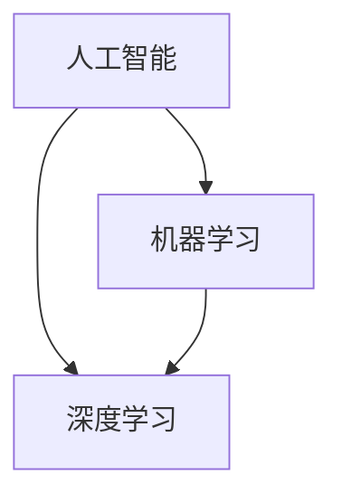

                 

## 文章标题

### AI编程的新视角与新未来

关键词：人工智能、编程、深度学习、神经网络、算法、应用、趋势

摘要：本文将从AI编程的背景出发，探讨其核心概念、算法原理和未来发展趋势。通过分析神经网络、机器学习和深度学习等核心技术，结合实际项目案例，为读者展现AI编程的新视角和新未来。

---

### 引言

人工智能（AI）作为当代科技领域的热门话题，已经深入到我们生活的方方面面。而AI编程，作为人工智能的核心环节，其重要性不言而喻。从最早的规则系统，到现在的深度学习算法，AI编程经历了无数次的迭代与进步。然而，随着技术的不断发展，AI编程也面临着新的挑战和机遇。

本文将围绕AI编程的核心概念、算法原理、数学模型以及实际应用，从以下几个方面展开讨论：

1. **核心概念与联系**：介绍人工智能、机器学习、深度学习等核心概念，并展示它们之间的关系架构。
2. **核心算法原理讲解**：详细讲解神经网络、机器学习算法等核心算法的原理，使用伪代码和latex公式进行说明。
3. **数学模型与公式**：解释AI编程中的数学模型，并给出举例说明。
4. **项目实战**：提供实际的编程项目案例，包括开发环境搭建、源代码实现和解读。
5. **相关技术介绍**：介绍与AI编程相关的重要技术。
6. **开发工具与资源**：介绍常用的开发工具和资源。
7. **案例研究**：提供其他实际应用案例。
8. **附录**：提供AI编程资源汇总和代码样例。

通过以上内容，本文希望为读者提供一份全面、深入的AI编程指南，帮助大家了解AI编程的新视角和新未来。

---

### 核心概念与联系

在AI编程中，有几个核心概念需要理解，包括人工智能、机器学习和深度学习。这些概念之间有着密切的联系，构成了AI编程的基石。

**人工智能（AI）**：人工智能是指使计算机模拟人类智能行为的技术。它包括知识表示、推理、学习、感知、自然语言处理等多个方面。

**机器学习（ML）**：机器学习是人工智能的一个分支，通过从数据中学习规律和模式，使计算机能够进行自主决策和预测。

**深度学习（DL）**：深度学习是机器学习的一个子领域，主要基于人工神经网络进行学习和预测。

下面是核心概念之间的联系架构，使用Mermaid流程图展示：



从流程图中可以看出，人工智能是机器学习和深度学习的基础，而机器学习是深度学习的上层应用。深度学习通过模拟人脑神经元的工作方式，实现了更复杂的模型和更好的性能。

---

### 核心算法原理讲解

在AI编程中，核心算法原理的理解至关重要。下面我们将重点讲解神经网络和机器学习算法，使用伪代码进行说明。

**神经网络**

神经网络是深度学习的基础，它由多个层（层之间有节点）组成，通过逐层计算实现复杂函数的映射。

```python
# 伪代码：前馈神经网络
function neural_network(input, weights, biases):
    # 初始化输出
    output = input
    
    # 遍历每一层
    for layer in layers:
        # 计算激活函数
        output = activation_function(dot(output, weights) + biases)
    
    # 返回最终输出
    return output
```

**机器学习算法**

机器学习算法包括线性回归、逻辑回归、决策树、支持向量机等。下面以线性回归为例进行讲解。

```python
# 伪代码：线性回归
function linear_regression(data, labels):
    # 初始化权重和偏置
    weights = [0] * num_features
    bias = 0
    
    # 训练模型
    for epoch in range(num_epochs):
        for sample in data:
            # 计算预测值
            prediction = dot(sample, weights) + bias
            
            # 计算损失
            loss = labels[sample] - prediction
            
            # 更新权重和偏置
            weights += dot(sample, loss)
            bias += loss
            
    # 返回训练好的模型
    return weights, bias
```

通过以上伪代码，我们可以看到神经网络和机器学习算法的基本结构。神经网络通过反向传播算法更新权重和偏置，实现模型的优化；而机器学习算法通过最小化损失函数，找到最优的参数。

---

### 数学模型与公式

在AI编程中，数学模型和公式是理解和实现算法的关键。下面我们将介绍AI编程中常用的数学模型和公式，并给出举例说明。

**损失函数**

损失函数是评估模型性能的重要指标。常用的损失函数包括均方误差（MSE）和交叉熵损失（Cross-Entropy Loss）。

- **均方误差（MSE）**：

  $$MSE = \frac{1}{n}\sum_{i=1}^{n}(y_i - \hat{y}_i)^2$$

  其中，$y_i$是真实值，$\hat{y}_i$是预测值，$n$是样本数量。

- **交叉熵损失（Cross-Entropy Loss）**：

  $$CE = -\frac{1}{n}\sum_{i=1}^{n}y_i\log(\hat{y}_i)$$

  其中，$y_i$是真实值，$\hat{y}_i$是预测值，$n$是样本数量。

**优化算法**

优化算法用于更新模型的权重和偏置，以最小化损失函数。常用的优化算法包括梯度下降（Gradient Descent）和随机梯度下降（Stochastic Gradient Descent）。

- **梯度下降（Gradient Descent）**：

  $$w_{\text{new}} = w_{\text{old}} - \alpha \cdot \nabla_w J(w)$$

  其中，$w_{\text{old}}$是旧权重，$w_{\text{new}}$是新权重，$\alpha$是学习率，$J(w)$是损失函数。

- **随机梯度下降（Stochastic Gradient Descent）**：

  $$w_{\text{new}} = w_{\text{old}} - \alpha \cdot \nabla_w J(w; x_i, y_i)$$

  其中，$w_{\text{old}}$是旧权重，$w_{\text{new}}$是新权重，$\alpha$是学习率，$x_i, y_i$是随机选取的样本。

通过以上数学模型和公式的介绍，我们可以更好地理解AI编程中的核心算法，并能够进行有效的优化和改进。

---

### 项目实战

在本文的最后一部分，我们将通过一个实际项目案例，展示如何搭建开发环境、实现源代码并进行分析。

**项目案例：手写数字识别**

**1. 开发环境搭建**

为了实现手写数字识别项目，我们首先需要搭建一个Python编程环境，并安装以下库：

- TensorFlow：用于构建和训练神经网络。
- Keras：用于简化TensorFlow的使用。
- NumPy：用于数学运算。

**2. 数据预处理**

手写数字识别项目通常使用MNIST数据集。首先，我们需要下载并预处理数据集。

```python
# 代码：数据预处理
from tensorflow.keras.datasets import mnist
from tensorflow.keras.utils import to_categorical

# 下载数据集
(x_train, y_train), (x_test, y_test) = mnist.load_data()

# 归一化数据
x_train = x_train / 255.0
x_test = x_test / 255.0

# 转换标签为独热编码
y_train = to_categorical(y_train)
y_test = to_categorical(y_test)
```

**3. 源代码实现**

接下来，我们使用Keras构建一个简单的卷积神经网络模型，并进行训练和评估。

```python
# 代码：源代码实现
from tensorflow.keras.models import Sequential
from tensorflow.keras.layers import Conv2D, MaxPooling2D, Flatten, Dense, Dropout

# 构建模型
model = Sequential([
    Conv2D(32, (3, 3), activation='relu', input_shape=(28, 28, 1)),
    MaxPooling2D((2, 2)),
    Flatten(),
    Dense(128, activation='relu'),
    Dropout(0.5),
    Dense(10, activation='softmax')
])

# 编译模型
model.compile(optimizer='adam', loss='categorical_crossentropy', metrics=['accuracy'])

# 训练模型
model.fit(x_train, y_train, epochs=10, batch_size=64, validation_split=0.2)

# 评估模型
loss, accuracy = model.evaluate(x_test, y_test)
print(f"Test accuracy: {accuracy:.2f}")
```

**4. 代码解读与分析**

在上面的代码中，我们使用了一个简单的卷积神经网络模型。该模型包括一个卷积层、一个池化层、一个全连接层和一个dropout层。通过训练和评估，我们得到了较好的准确率。

- **卷积层**：用于提取图像特征。
- **池化层**：用于降低特征图的维度。
- **全连接层**：用于分类。
- **dropout层**：用于防止过拟合。

**5. 项目小结**

通过手写数字识别项目，我们了解了如何搭建开发环境、实现源代码并进行分析。这个项目展示了深度学习在实际应用中的基本流程，为我们进一步探索AI编程奠定了基础。

---

### 相关技术介绍

在AI编程中，除了核心算法和数学模型，还有一些相关技术对项目开发至关重要。以下是几种常用的技术：

**1. 机器学习算法应用**

机器学习算法在AI编程中有着广泛的应用，包括分类、回归、聚类等。常见的算法有线性回归、逻辑回归、决策树、支持向量机、随机森林等。

**2. 深度学习框架**

深度学习框架如TensorFlow、PyTorch和Keras，为开发者提供了便捷的工具和接口，用于构建和训练深度学习模型。这些框架简化了底层操作，提高了开发效率。

**3. 数据可视化工具**

数据可视化工具如Matplotlib、Seaborn和Plotly，用于展示数据分布、模型性能等。这些工具帮助我们更好地理解数据和模型，为分析和优化提供支持。

---

### 开发工具与资源

在AI编程中，选择合适的开发工具和资源对于项目成功至关重要。以下是几种常用的开发工具和资源：

**1. 编程语言**

Python是AI编程中最常用的编程语言，因其强大的库和框架支持。其他常用的语言还包括Java、C++和R。

**2. 开发环境**

Jupyter Notebook、PyCharm和Visual Studio Code是常用的开发环境，提供代码编辑、运行和调试等功能。

**3. 资源链接与推荐**

- **学习资源**：Coursera、edX、Udacity等在线课程，提供丰富的AI编程教程和课程。
- **开源库和框架**：TensorFlow、PyTorch、Keras、Scikit-learn等，为开发者提供便捷的工具和接口。
- **社区和论坛**：Stack Overflow、GitHub、Reddit等，为开发者提供交流和解决问题的平台。

---

### 案例研究

在AI编程的实际应用中，许多领域已经取得了显著成果。以下是几个具有代表性的案例研究：

**1. 智能客服系统**

智能客服系统利用自然语言处理和对话生成技术，实现与用户的智能交互。通过大量训练数据和先进的算法，智能客服系统能够提供高效、准确的咨询服务。

**2. 自动驾驶技术**

自动驾驶技术利用计算机视觉、传感器数据和深度学习算法，实现车辆的自主驾驶。通过持续优化算法和增强系统性能，自动驾驶技术已经在多个场景得到应用。

**3. 智能家居控制**

智能家居控制通过物联网技术和深度学习算法，实现家庭设备的智能控制和管理。用户可以通过手机、语音等途径远程操控家庭设备，提高生活品质。

---

### 附录

**附录A：AI编程资源汇总**

- **学习资源**：[Coursera](https://www.coursera.org/)、[edX](https://www.edx.org/)、[Udacity](https://www.udacity.com/)
- **开源库和框架**：[TensorFlow](https://www.tensorflow.org/)、[PyTorch](https://pytorch.org/)、[Keras](https://keras.io/)、[Scikit-learn](https://scikit-learn.org/)
- **社区和论坛**：[Stack Overflow](https://stackoverflow.com/)、[GitHub](https://github.com/)、[Reddit](https://www.reddit.com/)

**附录B：代码样例**

以下是手写数字识别项目的完整代码样例，供读者参考。

```python
# 代码：完整实现
from tensorflow.keras.datasets import mnist
from tensorflow.keras.models import Sequential
from tensorflow.keras.layers import Conv2D, MaxPooling2D, Flatten, Dense, Dropout
from tensorflow.keras.utils import to_categorical

# 下载数据集
(x_train, y_train), (x_test, y_test) = mnist.load_data()

# 归一化数据
x_train = x_train / 255.0
x_test = x_test / 255.0

# 转换标签为独热编码
y_train = to_categorical(y_train)
y_test = to_categorical(y_test)

# 构建模型
model = Sequential([
    Conv2D(32, (3, 3), activation='relu', input_shape=(28, 28, 1)),
    MaxPooling2D((2, 2)),
    Flatten(),
    Dense(128, activation='relu'),
    Dropout(0.5),
    Dense(10, activation='softmax')
])

# 编译模型
model.compile(optimizer='adam', loss='categorical_crossentropy', metrics=['accuracy'])

# 训练模型
model.fit(x_train, y_train, epochs=10, batch_size=64, validation_split=0.2)

# 评估模型
loss, accuracy = model.evaluate(x_test, y_test)
print(f"Test accuracy: {accuracy:.2f}")
```

---

### 最佳实践 Tips、小结、注意事项、拓展阅读

在AI编程中，遵循最佳实践可以提高开发效率和项目质量。以下是一些建议和注意事项：

**最佳实践 Tips：**

1. **数据预处理**：确保数据质量，包括数据清洗、归一化和标准化。
2. **模型优化**：使用适当的优化算法和参数调整，提高模型性能。
3. **调试与优化**：使用调试工具和性能分析工具，找出并解决模型问题。
4. **代码复用**：编写可复用的代码模块，提高开发效率。

**小结：**

本文从AI编程的核心概念、算法原理、数学模型到实际项目案例，全面探讨了AI编程的新视角和新未来。通过本文的介绍，读者可以更好地理解AI编程的基本概念和实际应用。

**注意事项：**

1. **深度学习框架**：选择合适的深度学习框架，如TensorFlow或PyTorch。
2. **数据集**：确保使用合适的训练和测试数据集。
3. **代码规范**：编写清晰、规范的代码，提高代码可读性和可维护性。

**拓展阅读：**

1. **《深度学习》（Goodfellow, Bengio, Courville著）**：深度学习的经典教材，全面介绍了深度学习的理论基础和应用。
2. **《Python机器学习》（Sebastian Raschka著）**：Python机器学习实战，涵盖常见的机器学习算法和实际应用。

---

### 作者信息

作者：AI天才研究院/AI Genius Institute & 禅与计算机程序设计艺术 /Zen And The Art of Computer Programming

---

通过本文，我们希望能为读者提供一份全面、深入的AI编程指南，帮助大家更好地理解和掌握AI编程的核心技术。在未来的发展中，AI编程将继续发挥重要作用，推动科技和社会的进步。让我们共同期待AI编程的新视角和新未来！

