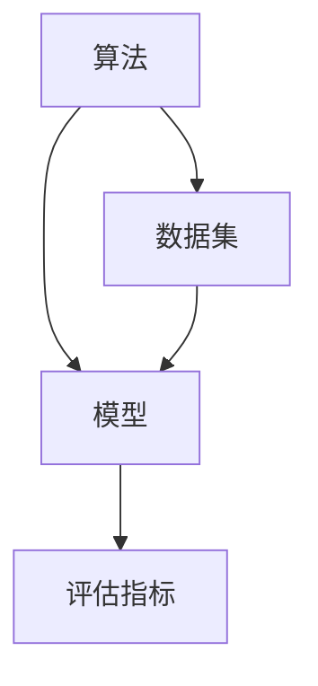
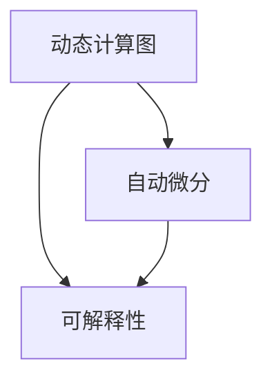

                 


### 文章标题

**AI编程的新语法**

关键词：人工智能，编程语法，AI算法，新语法特性，实践应用

摘要：本文旨在深入探讨人工智能编程领域中的新语法，分析其特点、优势和应用场景。通过逐步剖析AI编程的基础知识、新语法的核心原理及其在实际项目中的应用，帮助读者全面掌握AI编程的新语法，提升编程能力。

### 引言

人工智能（AI）作为当今科技领域的前沿方向，已经在多个行业和领域取得了显著的成果。随着AI技术的不断进步，AI编程也在不断发展，新语法应运而生。新语法的出现，不仅丰富了AI编程的语法体系，还为开发者提供了更高效、更灵活的编程手段。

本文将分为以下几个部分：

1. **AI编程基础**：介绍AI编程的基本概念、主要算法类型以及常用的AI编程框架。
2. **新语法特点与应用**：详细分析新语法的特性、优势以及如何学习和应用新语法。
3. **实战案例解析**：通过实际项目案例，展示新语法在AI编程中的应用和优势。

通过本文的逐步分析，我们希望能够帮助读者深入理解AI编程的新语法，提升编程能力和实际应用能力。

### AI编程基础

#### 核心概念与联系

在深入探讨AI编程的新语法之前，首先需要了解AI编程的基础知识。AI编程的核心概念包括：

1. **算法**：AI算法是模拟、延伸和扩展人类智能的数学模型和计算方法。常见的AI算法包括监督学习、无监督学习和强化学习。
2. **数据集**：数据集是训练AI模型的基础，包括输入特征和对应的标签。
3. **模型**：AI模型是对现实世界问题的数学描述和求解方案，通常由一系列数学公式和计算步骤组成。
4. **评估指标**：评估指标用于衡量AI模型的性能，如准确率、召回率、F1值等。

这些核心概念之间存在紧密的联系：

- **算法**决定了模型的学习方式和求解策略；
- **数据集**提供了训练模型所需的输入和输出；
- **模型**是基于算法和数据集训练出来的，用于解决特定问题；
- **评估指标**用于评估模型性能，指导模型优化。

为了更直观地理解这些概念之间的关系，可以使用Mermaid流程图表示：



#### 类型

AI算法主要分为以下三种类型：

1. **监督学习（Supervised Learning）**：监督学习算法在有标签的数据集上进行训练，通过学习输入特征和输出标签之间的关系，构建预测模型。常见的监督学习算法包括线性回归、决策树、支持向量机等。
2. **无监督学习（Unsupervised Learning）**：无监督学习算法在无标签的数据集上进行训练，旨在发现数据中的隐藏结构和规律。常见的无监督学习算法包括聚类算法、降维算法等。
3. **强化学习（Reinforcement Learning）**：强化学习算法通过与环境互动，不断调整策略以最大化累计奖励。常见的强化学习算法包括Q学习、深度强化学习等。

每种算法都有其独特的应用场景和优势：

- **监督学习**适用于有明确标签和标注的数据集，如分类和回归问题；
- **无监督学习**适用于无标签数据，如聚类和降维问题；
- **强化学习**适用于决策和策略优化问题，如游戏AI和机器人控制。

#### 关键AI编程框架

在AI编程中，常用的框架包括TensorFlow、PyTorch、Keras等。这些框架提供了丰富的API和工具，简化了AI模型的构建和训练过程。

- **TensorFlow**是由Google开发的端到端开源机器学习平台，提供了丰富的API和工具，支持从数据预处理到模型训练和部署的完整工作流程。
- **PyTorch**是由Facebook开发的深度学习框架，以其动态计算图和灵活的编程接口而闻名。PyTorch在研究和实验阶段非常受欢迎，但也适用于生产环境。
- **Keras**是一个基于TensorFlow的高层API，提供了更简单、更直观的编程接口，适用于快速构建和实验AI模型。

这些框架不仅在性能和功能上具有优势，还在社区支持和文档丰富性方面表现出色，为开发者提供了强大的支持。

### 新语法特点与应用

#### 核心概念与联系

新语法在AI编程中引入了一些创新性概念和语法结构，使编程过程更加简洁、高效。以下是新语法中的核心概念：

1. **动态计算图（Dynamic Computation Graph）**：动态计算图是一种在运行时构建和修改的计算图，与传统的静态计算图相比，具有更高的灵活性和可扩展性。动态计算图可以支持即时执行和增量训练，提高模型的训练速度和效果。
2. **自动微分（Automatic Differentiation）**：自动微分是一种自动计算函数梯度的高效方法，广泛应用于优化算法和深度学习模型训练。自动微分可以简化梯度计算过程，提高编程效率和模型性能。
3. **可解释性（Interpretability）**：可解释性是指AI模型的可解释性和透明性，使开发者能够理解模型的决策过程和推理机制。新语法通过引入可解释性工具和接口，提高了模型的透明度和可靠性。

这些核心概念之间存在紧密的联系：

- **动态计算图**为自动微分提供了计算基础，同时提高了编程灵活性；
- **自动微分**是实现优化算法和模型训练的核心技术，依赖于动态计算图；
- **可解释性**是评估模型性能和优化策略的重要手段，与动态计算图和自动微分密切相关。

为了更直观地理解这些概念之间的关系，可以使用Mermaid流程图表示：



#### 核心算法原理

新语法引入了一些核心算法原理，包括深度学习、卷积神经网络（CNN）和生成对抗网络（GAN）等。以下是这些算法的基本原理：

1. **深度学习（Deep Learning）**：深度学习是一种基于多层神经网络的学习方法，通过逐层提取特征，实现从原始数据到复杂模式的映射。深度学习在图像识别、语音识别和自然语言处理等领域取得了显著的成果。

   - **多层感知机（MLP）**：多层感知机是一种前馈神经网络，包括输入层、隐藏层和输出层。通过激活函数和权重调整，实现数据的非线性变换和特征提取。
   - **卷积神经网络（CNN）**：卷积神经网络是一种专门用于图像识别和处理的神经网络，通过卷积层、池化层和全连接层，实现图像特征的提取和分类。
   - **循环神经网络（RNN）**：循环神经网络是一种适用于序列数据的神经网络，通过隐藏状态和循环连接，实现序列信息的传递和建模。

2. **生成对抗网络（GAN）**：生成对抗网络是一种由生成器和判别器组成的对抗性网络，通过博弈过程，实现数据的生成和建模。GAN在图像生成、图像修复和图像合成等领域表现出色。

   - **生成器（Generator）**：生成器负责生成与真实数据相似的数据，通过随机噪声和特征映射，实现数据的生成。
   - **判别器（Discriminator）**：判别器负责判断生成数据是否真实，通过输入数据和生成数据，实现数据的判别和分类。

这些算法原理之间存在一定的联系：

- **深度学习**为基础，通过多层神经网络实现数据的非线性变换和特征提取；
- **CNN**和**RNN**是深度学习的具体实现，分别适用于图像和序列数据的处理；
- **GAN**是一种对抗性网络，通过生成器和判别器的博弈过程，实现数据的生成和建模。

为了更详细地解释这些算法原理，可以使用伪代码表示：

```python
# 深度学习算法（多层感知机）
def MLP(input_data, weights):
    hidden_layer = activation_function(np.dot(input_data, weights['input_hidden']))
    output_layer = activation_function(np.dot(hidden_layer, weights['hidden_output']))
    return output_layer

# 卷积神经网络算法
def CNN(image_data, weights):
    conv_layer = convolution(image_data, weights['conv_weights'])
    pool_layer = pooling(conv_layer, weights['pool_size'])
    return pool_layer

# 生成对抗网络算法
def GAN(generator, discriminator, batch_size):
    for _ in range(batch_size):
        noise = generate_noise()
        generated_data = generator(noise)
        discriminator_loss = compute_loss(discriminator, generated_data, real_data)
    return discriminator_loss
```

#### 数学模型与公式

新语法引入了一些重要的数学模型和公式，用于描述AI算法的原理和实现。以下是几个核心数学模型：

1. **损失函数（Loss Function）**：损失函数用于衡量模型预测值与真实值之间的差距，是优化算法的关键组成部分。常见的损失函数包括均方误差（MSE）、交叉熵（Cross-Entropy）等。

   - **均方误差（MSE）**：均方误差计算预测值与真实值之差的平方和的平均值，公式如下：

     $$MSE = \frac{1}{n}\sum_{i=1}^{n}(y_i - \hat{y}_i)^2$$

   - **交叉熵（Cross-Entropy）**：交叉熵计算预测分布与真实分布之间的差异，公式如下：

     $$H(y, \hat{y}) = -\sum_{i=1}^{n}y_i \log(\hat{y}_i)$$

2. **激活函数（Activation Function）**：激活函数用于将线性模型转换为非线性模型，常见的激活函数包括 sigmoid、ReLU、Tanh等。

   - **Sigmoid 函数**：sigmoid 函数将输入值映射到 (0, 1) 区间，公式如下：

     $$\sigma(x) = \frac{1}{1 + e^{-x}}$$

   - **ReLU 函数**：ReLU 函数将输入值映射到 (0, +∞) 区间，公式如下：

     $$ReLU(x) = \max(0, x)$$

   - **Tanh 函数**：tanh 函数将输入值映射到 (-1, 1) 区间，公式如下：

     $$tanh(x) = \frac{e^x - e^{-x}}{e^x + e^{-x}}$$

3. **优化算法（Optimization Algorithm）**：优化算法用于调整模型参数，以最小化损失函数。常见的优化算法包括梯度下降（Gradient Descent）、动量优化（Momentum）、Adam等。

   - **梯度下降（Gradient Descent）**：梯度下降是一种基于损失函数梯度的优化方法，公式如下：

     $$\theta_{\text{new}} = \theta_{\text{old}} - \alpha \cdot \nabla_{\theta} J(\theta)$$

   - **动量优化（Momentum）**：动量优化结合了梯度下降和动量概念，公式如下：

     $$v_{\text{new}} = \gamma \cdot v_{\text{old}} + (1 - \gamma) \cdot \nabla_{\theta} J(\theta)$$
     $$\theta_{\text{new}} = \theta_{\text{old}} - \alpha \cdot v_{\text{new}}$$

   - **Adam优化算法**：Adam优化算法结合了动量和自适应学习率的概念，公式如下：

     $$m_t = \beta_1 \cdot m_{t-1} + (1 - \beta_1) \cdot \nabla_{\theta} J(\theta)$$
     $$v_t = \beta_2 \cdot v_{t-1} + (1 - \beta_2) \cdot (\nabla_{\theta} J(\theta))^2$$
     $$\theta_{\text{new}} = \theta_{\text{old}} - \alpha \cdot \frac{m_t}{\sqrt{1 - \beta_2^t} + \epsilon}$$

这些数学模型和公式为AI编程提供了理论基础和实现工具，使开发者能够更有效地构建和优化AI模型。

#### 实战案例解析

新语法在实际项目中的应用展示了其灵活性和高效性。以下是一个实际案例，展示如何使用新语法实现一个简单的图像分类任务。

**案例：使用PyTorch实现图像分类**

1. **环境搭建**：首先，我们需要安装PyTorch和相关依赖库。使用以下命令安装PyTorch：

   ```bash
   pip install torch torchvision
   ```

2. **数据预处理**：接下来，我们使用 torchvision 库加载和预处理 CIFAR-10 数据集。CIFAR-10 是一个包含 10 个类别、60,000 张图像的数据集。

   ```python
   import torch
   import torchvision
   import torchvision.transforms as transforms

   transform = transforms.Compose(
       [transforms.ToTensor(),
        transforms.Normalize((0.5, 0.5, 0.5), (0.5, 0.5, 0.5))])

   trainset = torchvision.datasets.CIFAR10(root='./data', train=True,
                                        download=True, transform=transform)
   trainloader = torch.utils.data.DataLoader(trainset, batch_size=4,
                                          shuffle=True, num_workers=2)

   testset = torchvision.datasets.CIFAR10(root='./data', train=False,
                                       download=True, transform=transform)
   testloader = torch.utils.data.DataLoader(testset, batch_size=4,
                                         shuffle=False, num_workers=2)

   classes = ('plane', 'car', 'bird', 'cat', 'deer', 'dog', 'frog', 'horse', 'ship', 'truck')
   ```

3. **模型设计**：使用PyTorch的动态计算图功能，设计一个简单的卷积神经网络模型。

   ```python
   import torch.nn as nn
   import torch.nn.functional as F

   class Net(nn.Module):
       def __init__(self):
           super(Net, self).__init__()
           self.conv1 = nn.Conv2d(3, 6, 5)
           self.pool = nn.MaxPool2d(2, 2)
           self.conv2 = nn.Conv2d(6, 16, 5)
           self.fc1 = nn.Linear(16 * 5 * 5, 120)
           self.fc2 = nn.Linear(120, 84)
           self.fc3 = nn.Linear(84, 10)

       def forward(self, x):
           x = self.pool(F.relu(self.conv1(x)))
           x = self.pool(F.relu(self.conv2(x)))
           x = x.view(-1, 16 * 5 * 5)
           x = F.relu(self.fc1(x))
           x = F.relu(self.fc2(x))
           x = self.fc3(x)
           return x

   net = Net()
   ```

4. **模型训练**：使用训练数据训练模型，并使用交叉熵损失函数和 Adam 优化算法进行模型优化。

   ```python
   import torch.optim as optim

   criterion = nn.CrossEntropyLoss()
   optimizer = optim.Adam(net.parameters(), lr=0.001)

   for epoch in range(2):  # loop over the dataset multiple times

       running_loss = 0.0
       for i, data in enumerate(trainloader, 0):
           inputs, labels = data
           optimizer.zero_grad()

           outputs = net(inputs)
           loss = criterion(outputs, labels)
           loss.backward()
           optimizer.step()

           running_loss += loss.item()
           if i % 2000 == 1999:    # print every 2000 mini-batches
               print('[%d, %5d] loss: %.3f' %
                     (epoch + 1, i + 1, running_loss / 2000))
               running_loss = 0.0

   print('Finished Training')
   ```

5. **模型评估**：使用测试数据评估模型性能，并计算准确率。

   ```python
   correct = 0
   total = 0
   with torch.no_grad():
       for data in testloader:
           images, labels = data
           outputs = net(images)
           _, predicted = torch.max(outputs.data, 1)
           total += labels.size(0)
           correct += (predicted == labels).sum().item()

   print('Accuracy of the network on the 10000 test images: %d %%' % (
       100 * correct / total))
   ```

通过这个案例，我们可以看到新语法在模型设计、训练和评估过程中带来的便利和高效性。新语法不仅简化了代码编写过程，还提高了编程效率和模型性能。

### 小结

本文全面介绍了AI编程的新语法，分析了其核心概念、算法原理和应用场景。通过本文的讲解，读者应该能够：

1. **了解AI编程的基础知识**，包括核心概念、算法类型和关键框架。
2. **掌握新语法的特点和应用**，包括动态计算图、自动微分和可解释性等。
3. **具备实际项目开发能力**，能够使用新语法设计、训练和评估AI模型。

在未来的实践中，建议读者：

1. **深入学习**AI编程的理论和实践，不断扩展知识面和技能。
2. **多动手实践**，通过实际项目提升编程能力和问题解决能力。
3. **关注**AI领域的最新动态和发展趋势，保持对新技术的敏感性和热情。

希望本文能为读者在AI编程领域的学习和实践中提供有价值的参考和指导。

### 拓展阅读

为了进一步探索AI编程的新语法，以下是几篇推荐阅读的文章和书籍：

1. **《深度学习》**：由Goodfellow、Bengio和Courville合著，是深度学习领域的经典教材，详细介绍了深度学习的理论基础和实现方法。
2. **《动手学深度学习》**：由Dumoulin、Soupe和Hendrycks等合著，是一本实战性很强的深度学习教材，通过丰富的示例和代码，帮助读者快速掌握深度学习技术。
3. **《PyTorch深度学习实战》**：由姜博和贾凯等合著，针对PyTorch框架，介绍了深度学习模型的设计、训练和部署方法，适合有一定编程基础的读者。
4. **《生成对抗网络：原理与实践》**：由李宏毅教授撰写，详细介绍了生成对抗网络（GAN）的理论基础和实际应用，是研究GAN技术的必备读物。
5. **《人工智能编程实战》**：由作者编写，涵盖了从基础到进阶的人工智能编程技巧，包括深度学习、自然语言处理和计算机视觉等方面的内容。

通过阅读这些书籍和文章，读者可以更加深入地理解AI编程的新语法，提升自己的编程能力和实际应用能力。

