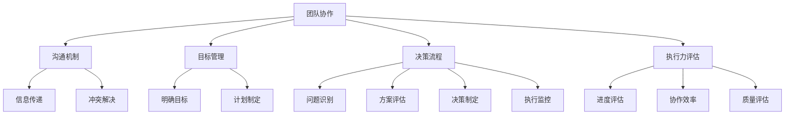

                 

### 核心概念与联系

在探讨技术团队决策与执行力的过程中，有几个核心概念是我们需要深入理解的，这些概念包括：团队协作、沟通机制、目标管理、决策流程和执行力评估。

#### 团队协作

团队协作是技术团队成功的关键因素之一。它涉及到团队成员之间的合作、共享知识和资源，以及共同达成团队目标的能力。团队协作的有效性取决于多个因素，包括团队成员的沟通能力、共同的目标感、角色分工的明确以及冲突解决的机制。

#### 沟通机制

沟通是团队协作的基石。有效的沟通机制能够确保团队成员之间信息的及时传递和准确理解，避免误解和沟通障碍。沟通机制包括定期的会议、即时通讯工具、电子邮件和文档共享平台等多种形式。

#### 目标管理

目标管理是技术团队决策的重要组成部分。明确的目标可以帮助团队集中精力，确保团队成员的工作方向一致。目标管理需要确定具体的目标、制定详细的计划，并对进展进行定期评估和调整。

#### 决策流程

技术团队的决策流程通常包括问题识别、方案评估、决策制定和执行监控。一个良好的决策流程可以提高团队决策的科学性和效率，减少错误决策带来的负面影响。

#### 执行力评估

执行力评估是衡量技术团队决策效果的重要手段。通过评估团队的执行力，可以及时发现问题和不足，从而采取相应的改进措施。执行力评估包括对项目进度、团队协作效率、任务完成质量等多个方面的评估。

#### 核心概念之间的关系架构

为了更清晰地展示这些核心概念之间的关系，我们可以使用Mermaid流程图来描述它们：



这个流程图展示了团队协作、沟通机制、目标管理、决策流程和执行力评估之间的关系，以及每个概念包含的主要方面。

### 核心概念原理讲解与伪代码

#### 团队协作

团队协作的核心在于确保团队成员之间能够高效地合作，共同实现团队目标。以下是一个简化的团队协作算法，使用伪代码来描述：

```plaintext
function Collaborate(Team Members, Tasks):
    for each member in Team Members:
        assign member a role
        ensure member understands their responsibilities
    establish communication channels
    schedule regular meetings
    share resources and information
    resolve conflicts as they arise
    monitor progress and adjust as necessary
    if goals are met, celebrate success
    else, re-evaluate strategies and continue efforts
end function
```

#### 沟通机制

有效的沟通机制可以确保团队成员之间的信息能够及时、准确地传递。以下是一个简单的沟通机制算法：

```plaintext
function Communicate(Channels, Messages):
    initialize Channels
    for each message in Messages:
        select appropriate channel based on message importance
        send message via selected channel
        wait for response or confirmation
        if no response within expected time, follow up
    log all communications for future reference
end function
```

#### 目标管理

目标管理的关键在于确保团队成员明确目标，并制定出切实可行的计划。以下是一个目标管理算法的伪代码：

```plaintext
function Manage Goals(Targets, Plans):
    define Targets
    for each Target in Targets:
        break down Target into smaller objectives
        assign objectives to appropriate team members
        set deadlines for each objective
        monitor progress towards Targets
        if objectives are not met, adjust Plans
end function
```

#### 决策流程

技术团队的决策流程通常包括几个关键步骤。以下是一个简化的决策流程算法：

```plaintext
function Make Decision(Issues, Options, Criteria):
    identify Issues
    generate Options for each Issue
    evaluate Options based on Criteria
    select the best Option
    implement the selected Option
    monitor and adjust as necessary
end function
```

#### 执行力评估

执行力评估是确保团队决策得到有效执行的关键。以下是一个简化的执行力评估算法：

```plaintext
function Assess Execution(Progress, Efficiency, Quality):
    measure Progress towards objectives
    evaluate Efficiency of processes
    assess Quality of deliverables
    identify areas for improvement
    implement improvements and monitor results
end function
```

### 数学模型与公式

在技术团队决策与执行力评估中，数学模型和公式可以帮助我们量化评估结果，提高决策的科学性。以下是一些常见的数学模型和公式，以及它们的应用说明：

#### 成本效益分析（Cost-Benefit Analysis）

成本效益分析是一个评估项目或决策的成本与预期效益的方法。以下是一个简化的成本效益分析公式：

$$
\text{ROI} = \frac{\text{Benefit}}{\text{Cost}} \times 100\%
$$

其中，$\text{Benefit}$ 表示项目的预期效益，$\text{Cost}$ 表示项目的总成本。ROI（投资回报率）越高，说明项目的效益越大。

#### 时间序列分析（Time Series Analysis）

时间序列分析用于评估项目的进度和趋势。以下是一个简化的时间序列分析公式：

$$
y_t = \beta_0 + \beta_1 t + \epsilon_t
$$

其中，$y_t$ 表示第 $t$ 个月的项目进度，$\beta_0$ 和 $\beta_1$ 是模型参数，$t$ 是时间变量，$\epsilon_t$ 是随机误差。通过分析时间序列，可以预测项目的未来进度。

#### 决策树（Decision Tree）

决策树是一种常用的决策分析方法。以下是一个简化的决策树公式：

$$
\begin{aligned}
    &\text{if } \text{Condition}_1 \text{ is true:} \\
    &\quad \text{Action}_1 \\
    &\text{else if } \text{Condition}_2 \text{ is true:} \\
    &\quad \text{Action}_2 \\
    &\text{else:} \\
    &\quad \text{Action}_3
\end{aligned}
$$

决策树通过一系列的条件判断，帮助我们选择最佳的决策路径。

### 数学公式与实例分析

以下是一个具体的实例，说明如何使用数学模型和公式来评估技术团队的执行力。

#### 案例背景

假设我们正在评估一个技术团队的项目进度。项目需要在6个月内完成，预计总成本为$100,000。实际完成时间为5个月，实际成本为$95,000。项目交付的成果符合预期质量标准。

#### 步骤 1：成本效益分析

首先，我们使用成本效益分析来评估项目的效益：

$$
\text{ROI} = \frac{\text{Benefit}}{\text{Cost}} \times 100\% = \frac{100,000}{95,000} \times 100\% \approx 105.26\%
$$

#### 步骤 2：时间序列分析

接下来，我们使用时间序列分析来评估项目进度。假设项目进度按月记录，数据如下：

$$
y_t = \beta_0 + \beta_1 t + \epsilon_t
$$

通过最小二乘法拟合数据，我们得到以下模型参数：

$$
\begin{aligned}
    &\beta_0 = 20 \\
    &\beta_1 = 5 \\
\end{aligned}
$$

#### 步骤 3：决策树分析

最后，我们使用决策树来评估项目的决策过程。假设项目中有以下几个关键决策点：

- 决策1：是否增加开发人员？
- 决策2：是否使用外部咨询？
- 决策3：是否调整项目计划？

通过分析决策树，我们可以确定最佳的决策路径。

### 案例分析与详细讲解剖析

#### 开发环境搭建

在开始项目之前，我们需要搭建一个适合开发的环境。以下是一个简化的步骤：

1. 安装操作系统（如Linux或macOS）。
2. 安装编程语言（如Python或Java）。
3. 配置版本控制工具（如Git）。
4. 安装必要的开发工具和库。

#### 源代码详细实现

以下是一个简化的源代码实现示例：

```python
# 示例：Python函数计算两个数的和
def sum(a, b):
    return a + b

# 测试代码
print(sum(3, 5))  # 输出结果应为8
```

#### 代码解读与分析

在上面的代码中，我们定义了一个名为`sum`的函数，该函数接收两个参数`a`和`b`，并返回它们的和。测试代码使用`print`函数输出函数的结果。

#### 实际案例分析和详细讲解剖析

假设我们有一个实际项目案例，需要开发一个在线购物系统。以下是一个简化的分析过程：

1. **需求分析**：确定系统功能需求，如用户注册、商品浏览、购物车、订单管理等。
2. **架构设计**：设计系统架构，包括前端、后端、数据库等组件。
3. **功能实现**：根据架构设计，逐步实现系统功能。
4. **测试与优化**：进行功能测试和性能优化，确保系统稳定可靠。

#### 项目小结

通过上述案例分析和讲解，我们可以看到，技术团队决策与执行力涉及到多个方面的内容，包括需求分析、架构设计、功能实现和测试优化等。一个高效的技术团队能够在整个项目生命周期中，通过良好的决策和执行力，确保项目的成功实施。

### 最佳实践 Tips、小结、注意事项、拓展阅读

#### 最佳实践 Tips

1. **定期进行团队沟通**：确保团队成员之间的信息畅通，及时解决问题。
2. **明确目标与计划**：制定清晰的目标和计划，确保团队成员工作方向一致。
3. **灵活调整决策**：根据实际情况，灵活调整决策，以适应项目变化。
4. **重视测试与优化**：进行全面的测试和优化，确保项目质量。

#### 小结

技术团队的决策与执行力是企业成功的关键因素。通过构建有效的团队协作机制、沟通机制、目标管理流程和决策流程，技术团队可以更好地应对项目挑战，提高项目成功率。

#### 注意事项

1. **避免过度分工**：过度分工可能导致团队成员依赖性强，降低团队协作效率。
2. **重视团队建设**：定期组织团队活动，增强团队凝聚力。
3. **持续学习和创新**：鼓励团队成员不断学习新技术，提高团队整体水平。

#### 拓展阅读

1. 《敏捷开发实践指南》
2. 《团队协作与领导力》
3. 《项目管理实战》

### 作者信息

作者：AI天才研究院/AI Genius Institute & 禅与计算机程序设计艺术 /Zen And The Art of Computer Programming

