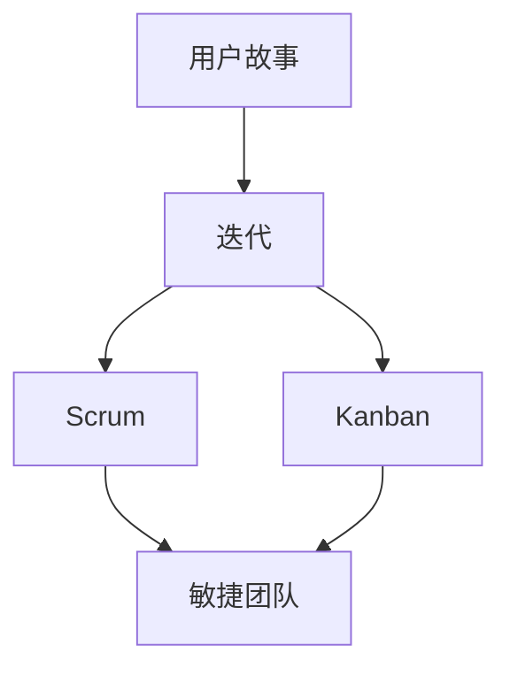

                 

### 文章标题

提高技术团队敏捷性的方法

#### 关键词

敏捷开发、敏捷团队、Scrum、Kanban、领导力、变革管理

#### 摘要

本文旨在探讨如何提高技术团队的敏捷性。通过分析敏捷性的核心概念、构建敏捷团队的方法、敏捷流程的实施、敏捷工具与实践的运用、敏捷领导力的培养以及敏捷变革管理的关键步骤，本文为技术团队提供了一套系统的改进策略。通过实际案例分析和最佳实践分享，帮助读者更好地理解和应用敏捷方法，以提升团队的工作效率和项目质量。

## 引言

在当今快速变化的市场环境中，技术团队需要具备敏捷性以应对不断涌现的需求和技术挑战。敏捷性不仅是指技术团队快速响应变化的能力，更是一种持续改进、迭代创新的工作方法和文化。本文旨在为技术团队提供一套系统的敏捷性提升方法，通过基础理论的阐述、实践方法的介绍和实际案例的分析，帮助团队实现高效的协作和持续改进。

### 敏捷性的核心概念与联系

敏捷性的核心概念包括用户故事、迭代、Scrum和Kanban等。为了更好地理解这些概念之间的关系，我们可以使用Mermaid流程图进行展示。



- **用户故事**：用户故事是一种描述用户需求的简单、清晰的表达方式。它以用户的语言编写，通常包含“作为……，我想要……，以便……”。用户故事是敏捷开发中需求管理的重要工具，有助于团队更好地理解和满足用户需求。

- **迭代**：迭代是指在一定时间内对产品进行多次重复的开发和改进。每个迭代都是一个完整的产品交付周期，包含计划、开发、测试和回顾等阶段。迭代过程有助于团队快速响应变化，持续改进产品。

- **Scrum**：Scrum是一种敏捷开发框架，它强调迭代和增量开发，通过每日站立会议、冲刺计划和回顾会议等方式，提高团队的协作效率和工作质量。

- **Kanban**：Kanban是一种看板方法，它通过可视化工作流程，限制在途工作数量，提高团队的流动性和响应速度。Kanban适用于对工作流程进行持续优化，帮助团队实现更高效的交付。

### 核心算法原理讲解

为了更好地理解敏捷开发中的核心算法原理，我们可以通过伪代码和数学模型进行详细阐述。

#### 伪代码：用户故事管理

```
function manage_user_story(user_story, sprint_length):
    if user_story not_ready():
        return "用户故事未准备就绪"
    end if

    story_points = estimate_user_story(user_story)
    if story_points > sprint_length:
        return "用户故事太大，不适合当前迭代"
    end if

    plan_for_execution(user_story)
    monitor_progress(user_story)
    if user_story_completed():
        return "用户故事已完成"
    end if

    return "用户故事正在开发中"
end function
```

#### 数学模型：故事点估算

故事点（Story Points）是敏捷开发中用于估算任务复杂度和工作量的一种指标。我们可以使用以下公式进行故事点估算：

$$
SP = \frac{Story\ Complexity}{Team\ Velocity}
$$

其中，\(SP\) 表示故事点数，\(Story\ Complexity\) 表示任务复杂度，\(Team\ Velocity\) 表示团队迭代周期内的实际完成工作量。

#### 举例说明

假设一个团队在一个迭代周期内完成了3个用户故事，总共分配了9个故事点。那么，团队的平均故事点数为：

$$
SP = \frac{9}{3} = 3
$$

如果下一个用户故事的复杂度估计为6个故事点，那么根据上述公式，该用户故事可能不适合当前迭代周期。

### 敏捷流程详解

敏捷流程是敏捷开发的核心，常见的敏捷流程包括Scrum和Kanban等。以下是对这些流程的详细解释。

#### Scrum

Scrum是一种迭代和增量式的敏捷开发方法，其核心流程包括以下三个阶段：

1. **冲刺计划**：在冲刺计划会议上，团队根据产品待办事项确定本次冲刺的目标和任务，并为每个任务分配故事点。

2. **冲刺执行**：在冲刺执行阶段，团队按照计划进行开发，并保持每日站立会议，以检查进度和解决问题。

3. **冲刺评审与回顾**：在冲刺评审会议上，团队展示已完成的成果，收集反馈并进行回顾，以便在下一个冲刺中改进。

#### Kanban

Kanban是一种基于可视化工作流程的方法，其主要特点包括：

1. **工作看板**：使用看板（Kanban板）将工作流程可视化，每个列代表工作流程的一个阶段，卡片代表具体任务。

2. **限制在途工作（WIP）**：通过限制每个阶段的在途工作数量，提高团队的流动性和响应速度。

3. **持续优化**：通过定期回顾和改进，持续优化工作流程，提高效率和质量。

### 敏捷工具与实践

敏捷工具和实践是提高团队敏捷性的关键因素。以下介绍几种常用的敏捷工具和实践方法。

1. **敏捷看板**：敏捷看板是一种可视化工具，用于展示团队的工作流程和进度。常见的看板工具有Trello、Jira等。

2. **敏捷项目管理工具**：敏捷项目管理工具可以帮助团队更好地规划、跟踪和管理项目，如Jira、Confluence等。

3. **测试驱动开发（TDD）**：TDD是一种敏捷开发实践，通过编写测试用例来驱动代码开发，确保代码的质量和可靠性。

4. **行为驱动开发（BDD）**：BDD是一种基于用户需求的敏捷开发方法，通过编写行为描述来驱动开发，确保开发满足用户需求。

### 敏捷领导力

敏捷领导力是确保团队实现敏捷目标的关键。以下介绍敏捷领导者应具备的技能和领导方法。

1. **沟通与协调能力**：敏捷领导者需要具备出色的沟通能力，确保团队成员之间信息畅通，协同高效。

2. **决策能力与风险管理**：敏捷领导者应在面对变化和不确定性时，具备快速决策和风险管理的能力。

3. **培养敏捷文化**：敏捷领导者应致力于培养团队的敏捷文化，激发团队成员的自主性和创新精神。

### 敏捷变革管理

敏捷变革管理是确保团队成功实施敏捷方法的关键。以下介绍敏捷变革管理的关键步骤。

1. **变革准备**：制定详细的变革计划，包括目标、策略、资源和时间表。

2. **变革推进**：通过培训、沟通和激励，推动团队成员接受并适应敏捷方法。

3. **变革监控与调整**：定期评估变革效果，及时调整策略和措施，确保变革目标的实现。

### 案例分析

以下通过两个实际案例，展示敏捷实施的效果。

#### 案例一：某互联网公司的敏捷转型

某互联网公司在面临激烈的市场竞争和快速变化的需求时，决定实施敏捷转型。通过采用Scrum和Kanban方法，公司成功提高了项目的交付质量和团队的工作效率。在转型过程中，公司注重培养敏捷文化和领导力，确保团队成员积极参与和适应敏捷方法。通过持续的变革管理，公司实现了敏捷目标的持续改进。

#### 案例二：传统制造业的敏捷实践

某传统制造企业为了提高生产效率和产品质量，引入了敏捷开发方法。通过采用Kanban方法，企业将生产流程可视化，并限制了在途工作数量，提高了生产线的流动性和响应速度。同时，企业通过培训和激励，培养了员工的敏捷意识和能力。通过敏捷变革管理，企业实现了生产效率和质量的双重提升。

### 结论

提高技术团队的敏捷性是提升团队工作效率和项目质量的关键。通过构建敏捷团队、实施敏捷流程、运用敏捷工具和实践、培养敏捷领导力以及管理敏捷变革，技术团队可以更好地适应快速变化的市场环境。本文通过理论阐述、实践方法和实际案例的分析，为技术团队提供了一套系统的敏捷性提升方法，以实现持续改进和卓越绩效。

### 作者信息

作者：AI天才研究院/AI Genius Institute & 禅与计算机程序设计艺术 /Zen And The Art of Computer Programming

### 最佳实践 Tips、小结、注意事项、拓展阅读

- **最佳实践 Tips**：
  - 定期进行团队培训和知识分享，提高团队成员的敏捷能力和意识。
  - 建立敏捷文化，鼓励团队成员主动参与和提出改进建议。
  - 持续优化工作流程和工具，提高团队的协作效率。

- **小结**：
  - 敏捷性是技术团队在快速变化的市场环境中保持竞争力的关键。
  - 通过构建敏捷团队、实施敏捷流程、运用敏捷工具和实践、培养敏捷领导力以及管理敏捷变革，技术团队可以实现高效协作和持续改进。

- **注意事项**：
  - 在实施敏捷过程中，要注意平衡敏捷性与质量，避免过度追求速度而忽视质量。
  - 敏捷变革需要全体成员的积极参与和支持，确保变革的顺利进行。

- **拓展阅读**：
  - 《Scrum敏捷实践指南》
  - 《敏捷开发的艺术》
  - 《敏捷变革管理》
  - 《Kanban实践指南》

通过以上内容，我们系统地探讨了如何提高技术团队的敏捷性。希望本文能够为读者提供有价值的参考，帮助团队实现高效的协作和持续改进。在未来的工作中，让我们共同努力，追求卓越的敏捷性。作者：AI天才研究院/AI Genius Institute & 禅与计算机程序设计艺术/Zen And The Art of Computer Programming。

