                 

### 文章标题

《提高技术团队敏捷性的策略》

### 关键词

敏捷性、技术团队、管理策略、Scrum、协作工具、敏捷转型

### 摘要

在当今快速变化的市场和技术环境中，技术团队的敏捷性已成为企业成功的关键因素。本文深入探讨了如何通过一系列策略提高技术团队的敏捷性，包括团队文化建设、敏捷方法与实践、敏捷领导力、团队建设和组织变革等方面。通过实际案例分析和最佳实践，本文为技术团队管理者提供了实用的指导，帮助他们在敏捷转型的道路上迈出坚实步伐。

---

# 提高技术团队敏捷性的策略

## 第一部分：敏捷性基础

### 第1章：敏捷性概述

### 第2章：敏捷团队文化

## 第二部分：敏捷方法与实践

### 第3章：敏捷项目管理

### 第4章：敏捷工具与技术

### 第5章：敏捷实践案例

## 第三部分：提高敏捷性的策略

### 第6章：敏捷领导力

### 第7章：敏捷团队建设

### 第8章：敏捷性与组织变革

## 附录

### 附录A：敏捷工具推荐

### 附录B：敏捷资源汇总

## 第1章：敏捷性概述

### 1.1 敏捷性的起源与发展

敏捷开发（Agile Development）起源于1990年代初期的软件开发实践，其核心思想是快速响应变化，通过迭代和增量的方式逐步交付可工作的软件。敏捷宣言（Manifesto for Agile Software Development）于2001年由17位软件专业人士共同签署，明确了敏捷开发的核心理念，包括个体和互动重于过程与工具、可工作的软件重于详尽的文档、客户合作重于合同谈判、响应变化重于遵循计划等。

**Mermaid流程图：**

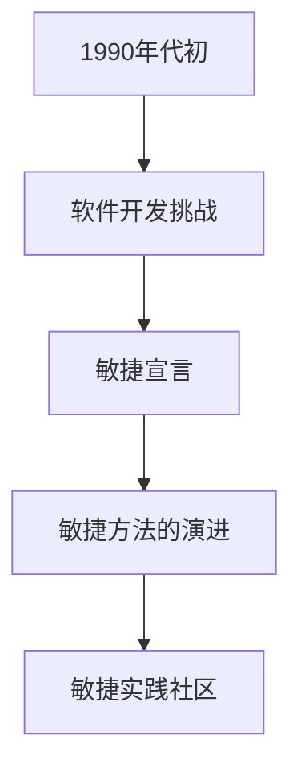

### 1.2 敏捷性的核心原则

敏捷开发的核心原则包括：

- **个体和互动重于过程与工具**：强调团队成员的沟通和协作，而非仅仅依赖于特定的工具或流程。

- **可工作的软件重于详尽的文档**：注重实际可执行的代码，而非过度依赖文档。

- **客户合作重于合同谈判**：与客户保持紧密的合作关系，共同适应变化。

- **响应变化重于遵循计划**：灵活应对变化，而不是固守原计划。

**数学模型：**

敏捷性可以通过以下模型来量化：

$$
\text{敏捷性} = \frac{\text{适应变化的能力}}{\text{遵循计划的能力}}
$$

### 1.3 敏捷性与传统管理的对比

传统管理方法往往依赖于详细的计划和控制，而敏捷开发则更注重灵活性、迭代和增量。以下是两者的主要对比：

**传统管理：**

- **计划驱动的**：详细规划每个阶段的工作。
- **控制驱动的**：通过控制过程确保目标的实现。
- **文档驱动的**：依赖详尽的文档记录和沟通。

**敏捷开发：**

- **迭代驱动的**：通过短周期的迭代逐步交付软件。
- **协作驱动的**：强调团队成员之间的互动和协作。
- **实践驱动的**：依赖实践和反馈来不断改进。

**伪代码：**

```python
def traditional_management():
    # 传统管理流程
    plan()
    execute()
    monitor_progress()
    adjust_plan()

def agile_management():
    # 敏捷管理流程
    iterate_plan()
    execute()
    inspect_and_adapt()
```

## 第2章：敏捷团队文化

### 2.1 建立信任

在敏捷团队中，信任是团队高效协作的基础。以下是一些建立信任的方法：

- **透明沟通**：确保团队成员之间的信息透明，避免信息孤岛。
- **共同目标**：明确团队目标，让每个成员都明确自己的贡献。
- **相互尊重**：尊重团队成员的个性和观点，鼓励开放和坦诚的沟通。
- **共同责任**：将团队目标与个人目标相结合，共同承担责任。

**Mermaid流程图：**

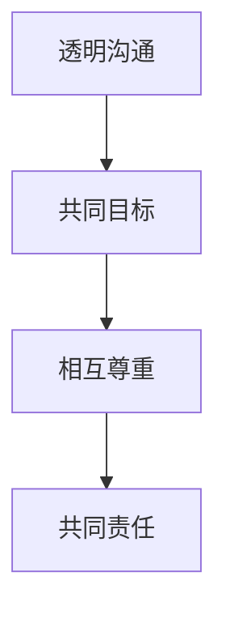

### 2.2 沟通与合作

有效的沟通与合作是敏捷团队成功的关键。以下是一些实践：

- **每日站立会议**：确保团队成员每天都能同步进度，解决问题。
- **迭代回顾会议**：定期回顾迭代成果，识别改进机会。
- **知识共享**：鼓励团队成员分享知识和经验，促进团队整体成长。
- **跨职能团队**：确保团队成员来自不同的背景和职能，促进多样性和创新。

**伪代码：**

```python
def daily_standup():
    # 每日站立会议
    sync_progress()
    resolve_issues()

def retrospective():
    # 迭代回顾会议
    review_outcomes()
    identify_improvements()

def knowledge_share():
    # 知识共享
    share_expertise()
    learn_from_each_other()
```

### 2.3 持续学习和成长

敏捷团队应该是一个不断学习和成长的环境。以下是一些实践：

- **技术培训**：定期组织技术培训，提高团队成员的技能水平。
- **实践分享**：鼓励团队成员分享实际工作中的经验和教训。
- **反思与总结**：定期反思和总结，从失败中学习，不断提升团队绩效。
- **鼓励创新**：提供资源和支持，鼓励团队成员尝试新的方法和工具。

**Mermaid流程图：**

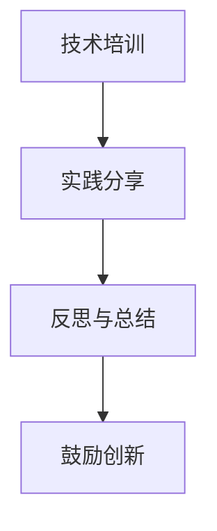

## 第3章：敏捷项目管理

### 3.1 敏捷开发流程

敏捷开发流程通常采用迭代和增量的方式，以下是一个典型的敏捷开发流程：

1. **需求收集**：与客户和利益相关者沟通，收集需求。
2. **迭代规划**：将需求分解为小任务，为每个迭代分配任务。
3. **开发与测试**：开发人员根据迭代计划进行开发，同时进行单元测试和集成测试。
4. **评审与回顾**：在迭代结束时进行代码评审和回顾，识别问题和改进点。
5. **部署与交付**：将完成的软件部署到生产环境，交付给客户。

**Mermaid流程图：**

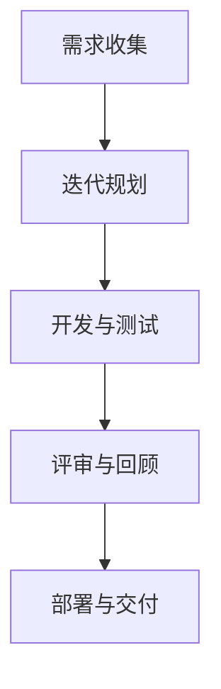

### 3.2 敏捷迭代与Scrum

Scrum是一种流行的敏捷开发框架，它将开发过程分为多个迭代（Sprint），每个迭代通常持续2-4周。以下是Scrum的核心组成部分：

- **产品待办列表**：列出所有待完成的任务，由产品负责人（Product Owner）负责维护。
- **Sprint规划会议**：团队和产品负责人一起确定本迭代要完成的任务。
- **每日站立会议**：团队成员每天同步进度，解决问题。
- **Sprint评审会议**：展示本迭代完成的成果，收集反馈。
- **Sprint回顾会议**：总结本次迭代的经验，制定改进计划。

**伪代码：**

```python
def sprint Planning Meeting():
    # Sprint规划会议
    product_owner_define_tasks()
    team_assign_tasks()

def daily_standup():
    # 每日站立会议
    sync_progress()
    resolve_issues()

def sprint Review Meeting():
    # Sprint评审会议
    showcase_completed_work()
    collect_feedback()

def sprint Retrospective Meeting():
    # Sprint回顾会议
    summarize_experience()
    define_improvement_actions()
```

### 3.3 敏捷项目评估与监控

敏捷项目评估与监控的关键是快速响应变化和持续改进。以下是一些实践：

- **进度监控**：使用看板（Kanban）或其他工具实时监控项目进度。
- **风险评估**：定期识别和评估项目风险，制定应对措施。
- **代码质量监控**：通过静态代码分析和自动化测试确保代码质量。
- **客户反馈**：收集客户反馈，快速响应客户需求。

**Mermaid流程图：**

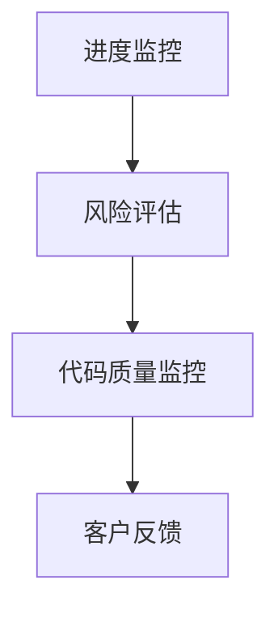

## 第4章：敏捷工具与技术

### 4.1 版本控制系统

版本控制系统是敏捷开发的核心工具之一，它帮助团队管理代码变更和协作。以下是一些流行的版本控制系统：

- **Git**：基于分布式的工作流，适用于大型团队和分布式开发。
- **Subversion (SVN)**：基于中央仓库的版本控制系统，适用于中小型团队。
- **Mercurial**：另一种分布式版本控制系统，与Git类似。

**伪代码：**

```python
def git():
    # Git操作
    clone_repository()
    make_changes()
    commit_changes()
    push_changes()

def svn():
    # SVN操作
    checkout_code()
    make_changes()
    commit_changes()
    update_code()

def mercurial():
    # Mercurial操作
    clone_repository()
    make_changes()
    commit_changes()
    push_changes()
```

### 4.2 自动化测试

自动化测试是确保代码质量和敏捷开发流程的关键。以下是一些自动化测试工具：

- **JUnit**：Java语言的单元测试框架。
- **NUnit**：.NET语言的单元测试框架。
- **pytest**：Python语言的测试框架。

**伪代码：**

```python
def test_suite():
    # JUnit测试
    @Test
    def test_addition():
        assert 1 + 1 == 2

    # NUnit测试
    [Test]
    public void TestAddition()
    {
        Assert.AreEqual(2, 1 + 1);
    }

    # pytest测试
    def test_addition():
        assert 1 + 1 == 2
```

### 4.3 敏捷协作工具

敏捷协作工具帮助团队管理任务、沟通和协作。以下是一些流行的敏捷协作工具：

- **Jira**：任务跟踪和项目管理工具。
- **Trello**：基于看板的任务管理工具。
- **Slack**：团队沟通工具。

**伪代码：**

```python
def jira():
    # Jira操作
    create_issue()
    assign_issue()
    update_issue()

def trello():
    # Trello操作
    create_board()
    create_card()
    move_card()

def slack():
    # Slack操作
    send_message()
    join_channel()
    create_direct_message()
```

## 第5章：敏捷实践案例

### 5.1 案例研究1：企业A的敏捷转型

企业A是一家传统软件企业，由于市场竞争加剧和客户需求变化，决定进行敏捷转型。以下是企业A的敏捷实践：

1. **团队重构**：将原有的项目团队重构为跨职能的敏捷团队。
2. **培训与指导**：为团队成员提供敏捷开发相关的培训和指导。
3. **迭代与规划**：采用Scrum框架进行迭代开发和规划。
4. **持续改进**：定期进行回顾和总结，不断优化开发流程。

**Mermaid流程图：**

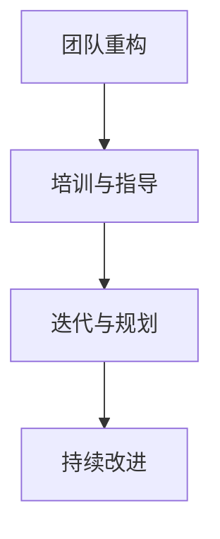

### 5.2 案例研究2：团队B的敏捷实践

团队B是一个初创企业团队，他们从一开始就采用了敏捷开发方法。以下是团队B的敏捷实践：

1. **需求优先级**：与客户紧密合作，确定需求优先级。
2. **短迭代开发**：每个迭代持续2周，确保快速交付和反馈。
3. **自动化测试**：编写自动化测试确保代码质量。
4. **持续集成**：使用CI/CD工具自动化构建和部署。

**Mermaid流程图：**

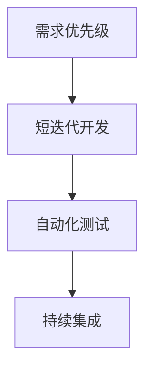

## 第6章：敏捷领导力

### 6.1 敏捷领导者角色

敏捷领导者不同于传统的项目经理，他们更多地扮演协调者和支持者的角色。以下是一些敏捷领导者应具备的技能和特质：

- **沟通能力**：能够与团队成员、利益相关者和客户进行有效沟通。
- **教练与导师**：指导团队成员成长，提供支持和反馈。
- **支持者**：为团队提供必要的资源和支持，确保团队成功。
- **变革推动者**：推动组织变革，促进敏捷实践的实施。

**Mermaid流程图：**

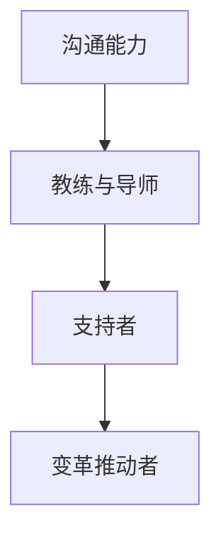

### 6.2 领导者的敏捷转型

领导者需要进行敏捷转型，以适应敏捷开发环境。以下是一些转型步骤：

1. **理解敏捷理念**：深入学习敏捷原则和实践，理解敏捷开发的核心理念。
2. **培养团队文化**：建立信任、开放和协作的团队文化。
3. **学习新技能**：学习敏捷领导力和项目管理的新技能。
4. **持续改进**：定期进行反思和总结，不断优化领导方式。

**伪代码：**

```python
def agile_leadership_transformation():
    # 理解敏捷理念
    learn_agile_principles()

    # 培养团队文化
    build_trust()
    foster_open_communication()

    # 学习新技能
    acquire_new_skills()
    practice_agile_project_management()

    # 持续改进
    reflect_and_summarize()
    continuously_improve_leadership()
```

### 6.3 领导者与团队成员的互动

领导者与团队成员的互动对于团队的成功至关重要。以下是一些互动策略：

- **透明沟通**：确保团队之间的信息透明，避免信息孤岛。
- **支持与鼓励**：为团队成员提供必要的支持和鼓励，帮助他们克服困难。
- **反馈与建议**：定期提供反馈和建议，帮助团队成员成长。
- **共同决策**：与团队成员共同制定决策，确保团队成员参与和责任感。

**Mermaid流程图：**

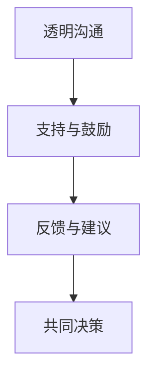

## 第7章：敏捷团队建设

### 7.1 团队组建与分工

敏捷团队的组建和分工是成功实施敏捷开发的关键。以下是一些实践：

- **跨职能团队**：确保团队成员具备不同的技能，能够完成从需求分析到产品交付的全过程。
- **小团队**：团队规模不宜过大，通常在3-9人之间，以保持高效的协作和沟通。
- **自组织团队**：团队成员有权自主决定如何完成工作，以适应不断变化的需求。

**Mermaid流程图：**

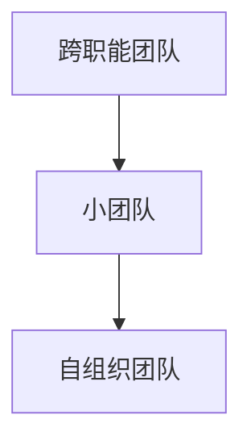

### 7.2 团队协作与沟通

有效的团队协作和沟通是敏捷团队成功的关键。以下是一些实践：

- **每日站立会议**：确保团队成员每天都能同步进度，解决问题。
- **迭代回顾会议**：总结迭代经验，识别改进点。
- **知识共享**：鼓励团队成员分享知识和经验，促进团队整体成长。
- **工具支持**：使用敏捷协作工具（如Jira、Trello、Slack等）提高团队协作效率。

**伪代码：**

```python
def daily_standup():
    # 每日站立会议
    sync_progress()
    resolve_issues()

def retrospective():
    # 迭代回顾会议
    review_outcomes()
    identify_improvements()

def knowledge_share():
    # 知识共享
    share_expertise()
    learn_from_each_other()

def tool_support():
    # 工具支持
    use_agile_tools()
    improve_collaboration_efficiency()
```

### 7.3 团队绩效评估与激励

团队绩效评估与激励是保持团队活力和动力的关键。以下是一些实践：

- **基于成果的评估**：评估团队的工作成果，而非仅仅关注工作量。
- **持续反馈**：定期提供反馈，帮助团队成员识别改进点。
- **激励机制**：制定激励机制，鼓励团队成员追求卓越。
- **自我评估与团队评估**：鼓励团队成员进行自我评估和团队评估，以促进个人和团队成长。

**Mermaid流程图：**

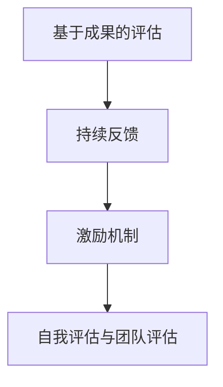

## 第8章：敏捷性与组织变革

### 8.1 组织结构对敏捷性的影响

组织结构对敏捷性的实施有着重要影响。以下是一些影响敏捷性的组织结构因素：

- **职能型结构**：职能型结构可能导致部门间沟通不畅，影响敏捷性。
- **矩阵型结构**：矩阵型结构可能提高沟通效率，但也可能导致权力分散和责任不清。
- **扁平型结构**：扁平型结构有助于提高团队自主性和沟通效率，有利于敏捷性。

**Mermaid流程图：**

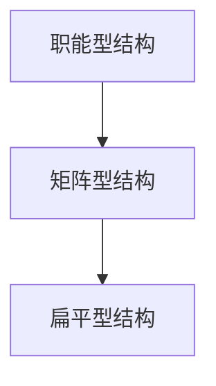

### 8.2 如何推动组织敏捷化

推动组织敏捷化需要一系列的变革措施。以下是一些关键步骤：

1. **领导层的支持**：确保高层领导对敏捷转型的支持，制定明确的变革目标和策略。
2. **培训与教育**：为员工提供敏捷开发相关的培训和指导，提高员工的敏捷意识和技能。
3. **变革管理**：建立变革管理机制，确保变革过程顺利进行，减少变革阻力。
4. **持续改进**：通过定期回顾和总结，不断优化敏捷实践，提高组织的敏捷性。

**伪代码：**

```python
def drive_organizational_agile():
    # 领导层的支持
    leadership_support()

    # 培训与教育
    provide_training()

    # 变革管理
    establish_change_management()

    # 持续改进
    continuous_improvement()
```

### 8.3 敏捷文化与组织变革

敏捷文化是敏捷转型成功的关键。以下是一些构建敏捷文化的实践：

- **开放与透明**：建立开放和透明的沟通环境，鼓励团队成员表达观点和建议。
- **信任与尊重**：建立信任和尊重的团队文化，鼓励团队成员相互支持和协作。
- **持续学习与成长**：鼓励团队成员持续学习和成长，提高团队的整体能力。
- **自主性与责任感**：赋予团队成员自主性和责任感，让他们在工作中发挥最大潜力。

**Mermaid流程图：**

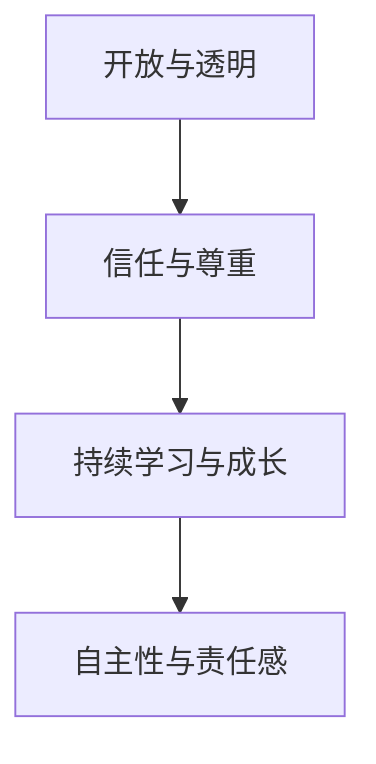

## 附录A：敏捷工具推荐

- **Jira**：任务跟踪和管理工具，适用于敏捷项目管理和团队协作。
- **Trello**：基于看板的任务管理工具，简单易用，适用于小型项目和团队协作。
- **Slack**：团队沟通工具，支持实时沟通和协作，有助于提高团队沟通效率。

## 附录B：敏捷资源汇总

- **《敏捷实践指南》**：敏捷开发领域的经典著作，提供了详细的敏捷实践和方法。
- **Scrum官方网站**：Scrum框架的官方文档，提供了Scrum实践的相关信息和资源。
- **敏捷开发社区**：如LinkedIn、GitHub等平台上的敏捷开发社区，提供了大量的敏捷实践和案例。

## 作者

作者：AI天才研究院/AI Genius Institute & 禅与计算机程序设计艺术 /Zen And The Art of Computer Programming

### 文章小结

本文通过深入探讨敏捷性基础、敏捷团队文化、敏捷方法与实践、敏捷领导力、敏捷团队建设和组织变革等方面，提供了系统化的策略和方法，帮助技术团队实现敏捷转型。通过实际案例分析和最佳实践，本文为技术团队管理者提供了实用的指导，确保他们在敏捷转型的道路上能够顺利前行。在未来的工作中，技术团队应不断反思和总结，持续优化敏捷实践，以应对快速变化的市场和技术环境。

### 注意事项

1. **团队文化建设**：建立信任和协作的团队文化是提高敏捷性的基础，需要长期坚持。
2. **持续改进**：敏捷转型不是一蹴而就的，需要持续改进和优化，以适应不断变化的环境。
3. **领导力**：敏捷领导者需要具备沟通能力、教练与导师的特质，以及推动组织变革的能力。
4. **组织变革**：推动组织敏捷化需要领导层的支持，以及系统的变革管理机制。

### 拓展阅读

- **《敏捷开发实践指南》**：深入了解敏捷开发的方法和实践。
- **《Scrum敏捷实践指南》**：系统学习Scrum框架的理论和实践。
- **《敏捷项目管理》**：掌握敏捷项目管理的核心方法和技巧。

### 参考文献

1. Beedle, M., & follansbee, L. (2001). *The wisdom of crowds: Why the many are smarter than the few and how collective wisdom shapes business, economies, societies and nations*.
2. Beck, K. (2000). *Extreme Programming Explained: Embrace Change*.
3. Schwaber, K., & Beedle, M. (2002). *Agile Project Management with Scrum*.

## 附录

### 附录A：敏捷工具推荐

1. **Jira**：任务跟踪和管理工具，适用于敏捷项目管理和团队协作。
2. **Trello**：基于看板的任务管理工具，简单易用，适用于小型项目和团队协作。
3. **Slack**：团队沟通工具，支持实时沟通和协作，有助于提高团队沟通效率。

### 附录B：敏捷资源汇总

1. **《敏捷实践指南》**：敏捷开发领域的经典著作，提供了详细的敏捷实践和方法。
2. **Scrum官方网站**：Scrum框架的官方文档，提供了Scrum实践的相关信息和资源。
3. **敏捷开发社区**：如LinkedIn、GitHub等平台上的敏捷开发社区，提供了大量的敏捷实践和案例。

