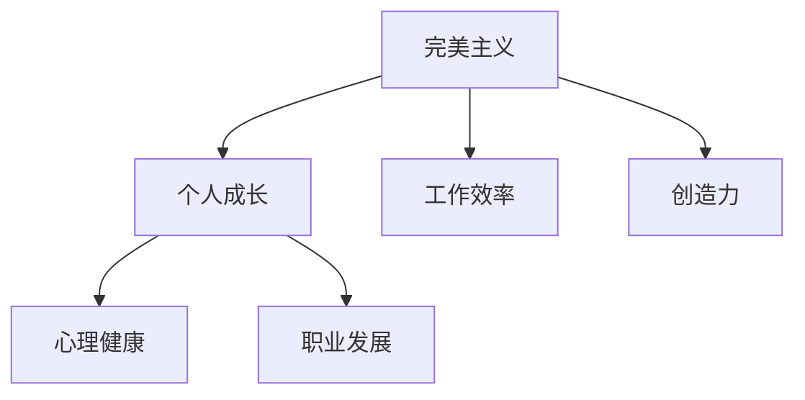

                 


## 文章标题

# 摒弃完美主义的重要性：如何从细节中解放，提升工作效率和创造力

> 关键词：完美主义，工作效率，创造力，决策质量，简化思维，迭代开发

> 摘要：本文将深入探讨完美主义对个人和组织的影响，解释为何摒弃完美主义是提升工作效率和创造力的关键。我们将通过逻辑清晰的分析，案例研究和实践指南，揭示如何在现代技术环境中克服完美主义，实现高效工作。

## 目录大纲设计步骤

### 1. 确定书籍目标读者群体
- 读者群体包括软件开发人员、项目经理、设计师、企业高层管理者以及对个人和团队效率提升感兴趣的专业人士。

### 2. 确定书籍主要内容和结构
- **主要章节**：
  - 引言
  - 完美主义的本质与影响
  - 摒弃完美主义的益处
  - 实践中的摒弃完美主义
  - 完美主义与个人成长
  - 团队协作与摒弃完美主义
  - 摒弃完美主义的最佳实践
  - 结论与展望

### 3. 设计核心章节
- **核心章节**：
  - **引言**：介绍书籍背景和目标。
  - **完美主义的本质与影响**：讨论完美主义的定义及其对个人和组织的潜在负面影响。
  - **摒弃完美主义的益处**：探讨摒弃完美主义带来的优势，如更高的工作效率和创造力。
  - **实践中的摒弃完美主义**：提供具体的实践方法，如迭代开发和简化思维。
  - **完美主义与个人成长**：分析完美主义对个人职业发展和心理健康的影响。
  - **团队协作与摒弃完美主义**：讨论在团队环境中如何共同摒弃完美主义。
  - **摒弃完美主义的最佳实践**：分享成功案例和最佳实践。
  - **结论与展望**：总结文章，展望未来的趋势和挑战。

### 4. 确定每个章节的二级目录
- **章节二级目录**（以“完美主义的本质与影响”为例）：
  - **2.1 完美主义的定义**
  - **2.2 完美主义的历史背景**
  - **2.3 完美主义对个体的影响**
  - **2.4 完美主义对团队和组织的影响**

### 5. 设计三级目录
- **章节三级目录**（以“2.3 完美主义对个体的影响”为例）：
  - **2.3.1 完美主义与心理健康**
  - **2.3.2 完美主义与职业发展**
  - **2.3.3 完美主义与工作效率**

### 6. 添加图表和示例
- **图表与示例**：在每个章节中，根据需要添加相关图表、示例和流程图，以增强内容的直观性和理解力。

### 7. 编写核心概念与联系
- **核心概念与联系**：使用 Mermaid 流程图展示完美主义与个人发展的关系，如图：



### 8. 编写核心算法原理讲解
- **核心算法原理讲解**：使用伪代码详细阐述如何摒弃完美主义：

```plaintext
// 伪代码：摒弃完美主义的过程
function abandon_perfectionism(problem, iteration):
    while not perfect_solution_found:
        improve_solution(problem, iteration)
        if acceptable_solution_found:
            return solution
        else:
            increase_iteration
    return "No solution found"
```

### 9. 编写数学模型和数学公式
- **数学模型和公式**：使用 LaTeX 格式嵌入文中独立段落的公式，例如：

$$
E = mc^2
$$

- **详细讲解和举例说明**：结合具体案例，解释公式在实际应用中的意义。

### 10. 编写项目实战
- **项目实战**：提供一个实际案例，包括开发环境搭建、源代码实现和解读。例如，描述一个软件项目的开发过程，包括如何摒弃完美主义，实现快速迭代。

### 11. 校对和精简
- **校对和精简**：对每个章节进行仔细校对，确保内容连贯、逻辑清晰，并删除冗余信息。

### 12. 完成最终目录大纲
- **最终目录大纲**：整理出完整的目录大纲，确保字数在 8000～12000 字之间。

## 下一步行动

通过上述步骤，我们已经设计出一个详细的目录大纲。接下来，我们将逐一编写每个章节的内容，确保每个小节都包含丰富的细节和具体的讲解。我们将结合理论知识和实践案例，帮助读者深入理解摒弃完美主义的重要性，并在实际工作中应用这些理念。

### 完善和细化每个章节

在完成初步的目录大纲后，下一步是完善和细化每个章节的内容。我们将根据每个章节的目标，编写详细的文字描述，并适当插入图表、示例和流程图。以下是每个章节的细化步骤：

### 1. 引言

- **目标**：介绍书籍的主题，吸引读者的兴趣。
- **细化内容**：
  - 简述完美主义的普遍现象及其在技术领域的表现。
  - 引出摒弃完美主义的重要性，并阐述本文的目的。

### 2. 完美主义的本质与影响

- **目标**：解释完美主义的定义，分析其对个人和团队的影响。
- **细化内容**：
  - **2.1 完美主义的定义**：介绍完美主义的概念和特点。
  - **2.2 完美主义的历史背景**：探讨完美主义在历史上的发展及其对文化的影响。
  - **2.3 完美主义对个体的影响**：详细分析完美主义如何影响心理健康、职业发展和工作效率。
  - **2.4 完美主义对团队和组织的影响**：讨论完美主义如何在团队协作中产生负面影响，以及如何通过优化团队文化来减轻这些影响。

### 3. 摒弃完美主义的益处

- **目标**：阐述摒弃完美主义带来的优势，如更高的工作效率和创造力。
- **细化内容**：
  - **3.1 提高工作效率**：通过迭代开发和简化思维，展示如何更快地完成任务。
  - **3.2 提升创造力**：探讨如何摒弃完美主义，从而更容易产生创新的想法。
  - **3.3 改善决策质量**：解释摒弃完美主义如何帮助个人和组织做出更明智的决策。

### 4. 实践中的摒弃完美主义

- **目标**：提供具体的实践方法，帮助读者在实际工作中摒弃完美主义。
- **细化内容**：
  - **4.1 迭代开发**：介绍迭代开发的原理和实施步骤。
  - **4.2 简化思维**：分享简化思维的技巧和方法。
  - **4.3 设定合理的目标和期望**：讨论如何设定目标，以避免过度追求完美。

### 5. 完美主义与个人成长

- **目标**：分析完美主义对个人成长的影响，提供克服完美主义的方法。
- **细化内容**：
  - **5.1 心理健康**：探讨完美主义如何影响心理健康，并给出应对策略。
  - **5.2 职业发展**：分析完美主义如何阻碍职业发展，并分享提升职业能力的建议。
  - **5.3 工作效率**：介绍如何通过改善工作效率来减轻完美主义的负面影响。

### 6. 团队协作与摒弃完美主义

- **目标**：讨论如何在团队环境中共同摒弃完美主义。
- **细化内容**：
  - **6.1 团队文化**：探讨建立积极团队文化的重要性，以及如何培养团队合作精神。
  - **6.2 沟通与反馈**：介绍有效沟通和反馈的技巧，帮助团队共同进步。
  - **6.3 分享成功案例**：分享成功团队的案例，展示如何通过摒弃完美主义提升团队效率。

### 7. 摒弃完美主义的最佳实践

- **目标**：总结成功案例和最佳实践，为读者提供实际操作的指导。
- **细化内容**：
  - **7.1 成功案例**：分析成功企业如何摒弃完美主义，实现持续发展。
  - **7.2 最佳实践**：分享在软件工程、项目管理等领域中摒弃完美主义的最佳实践。
  - **7.3 注意事项**：提醒读者在摒弃完美主义过程中可能遇到的问题，并提供解决方案。

### 8. 结论与展望

- **目标**：总结文章，展望未来趋势和挑战。
- **细化内容**：
  - **8.1 总结**：回顾文章的核心观点和重要发现。
  - **8.2 展望**：讨论未来可能的发展方向和挑战，以及如何应对。

通过上述细化步骤，我们将为每个章节提供丰富的内容和详细的讲解，确保读者能够深入理解摒弃完美主义的重要性，并在实际工作中有效应用这些理念。

## 完整的目录大纲

在完成前期的分析和细化步骤后，我们可以将完整的目录大纲整理如下。这个目录大纲将指导我们系统地撰写每个章节，确保文章逻辑清晰、内容详实。

### 摒弃完美主义的重要性：如何从细节中解放，提升工作效率和创造力

#### 引言

- 介绍书籍主题和目标
- 简述完美主义现象及其在技术领域的表现
- 阐述摒弃完美主义的重要性

#### 完美主义的本质与影响

- **2.1 完美主义的定义**
  - 完美主义的起源和演变
  - 完美主义的定义与特征

- **2.2 完美主义的历史背景**
  - 完美主义在不同文化和时代的表现
  - 完美主义对个体和社会的影响

- **2.3 完美主义对个体的影响**
  - 完美主义与心理健康
  - 完美主义与职业发展
  - 完美主义与工作效率

- **2.4 完美主义对团队和组织的影响**
  - 完美主义对团队协作的阻碍
  - 完美主义对组织文化和效率的影响
  - 优化团队文化以应对完美主义

#### 摒弃完美主义的益处

- **3.1 提高工作效率**
  - 迭代开发的原理和优势
  - 简化思维的实践方法
  - 实际案例分享：快速迭代带来的效率提升

- **3.2 提升创造力**
  - 如何在摒弃完美主义中激发创新思维
  - 创造力与风险的平衡
  - 创新思维的案例研究

- **3.3 改善决策质量**
  - 完美主义对决策质量的负面影响
  - 优化决策过程的策略
  - 实际案例：如何在摒弃完美主义中做出明智决策

#### 实践中的摒弃完美主义

- **4.1 迭代开发**
  - 迭代开发的定义与流程
  - 迭代开发的步骤与技巧
  - 迭代开发在实际项目中的应用

- **4.2 简化思维**
  - 简化思维的原理和方法
  - 如何在项目中实施简化思维
  - 简化思维的最佳实践

- **4.3 设定合理的目标和期望**
  - 如何设定可实现的目标
  - 如何调整期望以避免完美主义陷阱
  - 实际案例：目标设定与期望管理

#### 完美主义与个人成长

- **5.1 心理健康**
  - 完美主义对心理健康的负面影响
  - 如何通过心理调适减轻完美主义压力
  - 心理健康案例研究

- **5.2 职业发展**
  - 完美主义如何阻碍职业发展
  - 职业发展的实际案例与策略
  - 如何在职业生涯中摒弃完美主义

- **5.3 工作效率**
  - 完美主义如何影响工作效率
  - 提高工作效率的实际方法
  - 工作效率案例研究

#### 团队协作与摒弃完美主义

- **6.1 团队文化**
  - 建立积极团队文化的策略
  - 如何培养团队合作精神
  - 团队文化案例分享

- **6.2 沟通与反馈**
  - 有效沟通的技巧
  - 反馈机制的重要性
  - 实际案例：沟通与反馈在团队协作中的作用

- **6.3 分享成功案例**
  - 成功团队如何摒弃完美主义
  - 成功团队的实践经验和教训
  - 团队协作的最佳实践

#### 摒弃完美主义的最佳实践

- **7.1 成功案例**
  - 分析成功企业如何摒弃完美主义
  - 成功案例的启示与借鉴

- **7.2 最佳实践**
  - 软件工程中的摒弃完美主义实践
  - 项目管理中的摒弃完美主义实践
  - 其他领域的摒弃完美主义实践

- **7.3 注意事项**
  - 摒弃完美主义过程中可能遇到的问题
  - 应对策略与解决方案

#### 结论与展望

- **8.1 总结**
  - 文章的核心观点和发现
  - 摒弃完美主义的重要意义

- **8.2 展望**
  - 未来趋势和挑战
  - 如何持续提升工作效率和创造力

通过这个详细的目录大纲，我们可以确保文章内容完整、逻辑严密，并能够系统地传达摒弃完美主义的重要性。接下来，我们将根据这个大纲逐一撰写每个章节的内容。

### 引言

在现代技术领域中，完美主义似乎成了一种普遍现象。无论是软件开发、产品设计，还是项目管理，人们往往追求尽善尽美，力求每一个细节都无可挑剔。然而，这种追求完美的心态可能带来的负面影响远大于其表面上的好处。本文旨在探讨完美主义对个人和组织的影响，解释为何摒弃完美主义是提升工作效率和创造力的关键。

首先，我们需要明确什么是完美主义。完美主义可以定义为一种对完美无瑕的追求，即使在实际情况下这种追求是不可能实现的。在技术领域，完美主义表现为对代码质量的极致追求、对产品细节的极致打磨、对项目进度的严苛控制等。然而，过度追求完美往往导致以下几个负面影响：

1. **效率低下**：追求完美往往意味着在每一个细节上花费过多的时间，导致项目进度缓慢。在软件开发中，这可能导致开发周期延长，甚至项目无法按时完成。

2. **创新受阻**：完美主义容易使人陷入细节而忽视大局，从而阻碍创新思维的发展。在技术领域，创新是推动进步的关键，而完美主义往往会束缚创新的手脚。

3. **心理健康问题**：完美主义常常导致个人感到压力巨大，无法承受失败的后果。长期处于这种状态可能导致焦虑、抑郁等心理健康问题。

4. **团队协作受阻**：在团队中，完美主义可能导致团队成员过度关注自己的工作，忽视了团队的整体目标。这可能导致沟通不畅，团队协作效率降低。

尽管完美主义有其负面影响，但我们也不能完全否定其对某些方面的积极影响。在某些情况下，对质量的严格把控确实有助于提升项目的整体质量。然而，我们需要明确的是，摒弃完美主义并不意味着放弃质量，而是在追求质量的过程中，更注重效率和创新。

本文将逐步探讨完美主义的本质与影响，阐述摒弃完美主义的益处，并提供具体的实践方法和案例。我们将通过逻辑清晰的分析，帮助读者深入理解摒弃完美主义的重要性，并在实际工作中有效应用这些理念。

### 完美主义的定义与历史背景

#### 完美主义的定义

完美主义是一种心理状态和行为模式，表现为对完美无瑕的追求。它包括对自身和他人的高期望，以及对任何不足或缺陷的强烈不满。完美主义的核心特征是对失败的恐惧，以及对完美状态的执着追求。在个人层面，完美主义者往往设定非常高的目标，并不断努力以达到这些目标。然而，由于他们对自己和他人的期望过高，往往会陷入持续的焦虑和压力之中。

在技术领域，完美主义的具体表现包括以下几个方面：

1. **对代码质量的极致追求**：完美主义者会花费大量时间对代码进行优化，甚至到代码评审阶段仍在修改细节，以确保代码的绝对完美。

2. **对产品细节的极致打磨**：在产品开发过程中，完美主义者会深入关注每一个设计细节，力求达到视觉和功能上的完美。

3. **对项目进度的严苛控制**：为了确保项目的每一个环节都达到预期标准，完美主义者会严格控制项目进度，有时甚至不惜牺牲项目的整体进度。

#### 历史背景

完美主义作为一种心理现象，其历史可以追溯到古希腊时期。在古希腊，哲学家柏拉图和亚里士多德都对完美主义有深刻的探讨。柏拉图认为，理想的状态是达到一种绝对完美的状态，而亚里士多德则认为，完美是相对的，可以通过不断的改进来实现。

在文艺复兴时期，完美主义开始受到更多关注。艺术家和学者们追求在艺术创作和科学研究中达到极致，这一精神在后来的启蒙运动中得到了进一步发扬。例如，法国启蒙思想家伏尔泰提倡理性思维和追求完美，这种思想在18世纪和19世纪对西方社会产生了深远影响。

然而，完美主义的负面影响也在历史上逐渐显现。在19世纪末和20世纪初，心理学领域开始关注完美主义对个体心理健康的影响。心理学家卡尔·荣格和阿尔弗雷德·阿德勒等人的研究揭示了完美主义与焦虑、抑郁等心理问题的关联。

进入现代，随着科技的发展，完美主义在技术领域表现得尤为突出。例如，在软件工程领域，对代码质量的极致追求导致许多开发者陷入“代码完美主义”的陷阱，从而影响项目进度和团队协作。

#### 完美主义的影响

完美主义对个体的影响是多方面的，主要包括心理健康、职业发展和工作效率等方面。

1. **心理健康**：完美主义者常常陷入持续的压力和焦虑之中，对失败的恐惧和对成功的执着追求使他们难以放松。这种心理状态可能导致焦虑症、抑郁症等心理健康问题。

2. **职业发展**：完美主义可能导致个体在职业发展中过度关注细节，忽视大局。虽然这可能会提高项目的质量，但长期来看，会阻碍职业的快速发展，因为完美主义者往往无法迅速适应新的环境和变化。

3. **工作效率**：追求完美往往意味着在每一个细节上花费过多的时间，导致工作效率降低。在软件开发中，这可能导致开发周期延长，项目进度延误。

#### 完美主义的历史演变

从历史角度来看，完美主义的演变与人类对质量和完美的认知密切相关。在古代，人们对完美的追求主要集中在道德和精神层面。例如，古希腊的哲学家们追求在思想上达到完美，而中世纪的宗教改革时期，人们追求道德上的完美。

随着工业革命的到来，人们对质量和完美的追求逐渐从道德和精神层面转向技术和产品层面。在工业生产中，对产品质量的极致追求成为企业成功的关键因素。这种追求在20世纪得到了进一步发展，特别是在质量管理理论的提出和普及过程中。

然而，现代社会的快速发展和变化使得完美主义的负面影响日益凸显。在快节奏和高压力的环境中，完美主义容易导致个体和社会的焦虑和压力。因此，现代心理学和社会学开始关注如何克服完美主义，以提升个人和组织的幸福感与效能。

#### 总结

完美主义是一种对完美无瑕的追求，其历史可以追溯到古希腊时期。在技术领域，完美主义表现为对代码、产品和项目细节的极致追求。完美主义对个体的心理健康、职业发展和工作效率都有显著的负面影响。因此，理解和克服完美主义是提升个人和组织效能的关键。

在下一章节中，我们将进一步探讨完美主义对个体的影响，包括心理健康、职业发展和工作效率等方面。

### 完美主义对个体的影响

#### 对心理健康的影响

完美主义对个体心理健康的影响是深远且多方面的。首先，完美主义者往往对自己的期望过高，导致他们经常感到压力巨大。这种持续的压力会引发焦虑，因为他们始终觉得自己无法达到完美标准。长期处于高压状态可能导致焦虑症，个体可能会出现失眠、易怒、集中注意力困难等症状。

其次，完美主义与抑郁症之间存在密切关联。完美主义者对失败的恐惧和对成功的执着追求使他们难以接受失败。一旦失败发生，他们可能会陷入自我贬低和自我怀疑的泥潭，导致抑郁情绪的产生。抑郁症的症状包括持续的悲伤、兴趣丧失、疲劳和自我价值感的降低。

此外，完美主义还可能引发其他心理健康问题，如强迫症。强迫症表现为反复出现的强迫思维和动作，个体会花费大量时间和精力试图控制这些想法和行为。强迫症的症状可能包括反复检查、过度清洁、无法忍受混乱等。

#### 对职业发展的影响

完美主义对职业发展的影响同样不容忽视。虽然完美主义者可能会对自己的工作产生较高的标准和期望，但这种行为也可能带来一系列负面影响。首先，完美主义者往往会过分关注细节，而忽视整体目标和策略。这种过度细节化的思维方式可能导致他们在工作中陷入无穷尽的修改和优化循环，从而延误项目的进度。

其次，完美主义者常常对自己的工作感到不满，因为他们总是觉得做得不够好。这种心态可能导致他们在职业发展中缺乏自信，难以承担更多的责任和挑战。此外，完美主义者在面对压力和挑战时，可能会产生逃避行为，以避免失败带来的痛苦。

长期而言，完美主义可能导致职业发展的停滞。完美主义者可能会错过职业发展中的关键机会，因为他们不愿意承担风险，或者害怕失败。此外，完美主义可能导致他们在工作中缺乏灵活性，难以适应快速变化的市场需求。

#### 对工作效率的影响

完美主义对工作效率的影响主要体现在以下几个方面。首先，完美主义者倾向于在每一个细节上花费过多的时间，这可能导致项目进度延误。在软件开发中，这意味着开发人员可能会花费大量时间进行代码优化，而忽视功能的实现。这会延长开发周期，影响整个团队的工作效率。

其次，完美主义可能导致团队成员之间的协作效率降低。完美主义者可能倾向于独立工作，不愿与他人分享细节和进度，这会影响团队的整体沟通和协作。此外，完美主义者可能在面对团队反馈时产生抵触情绪，导致团队内部的不和谐。

最后，完美主义可能导致工作环境的紧张和压力。当团队成员都追求完美时，可能会导致工作中的竞争和对立，影响团队氛围和整体士气。这种紧张的工作环境可能导致员工的流失，降低团队的整体工作效率。

#### 案例分析

以下是一个关于完美主义对个体影响的具体案例：

张明是一名软件工程师，他在工作中追求完美，总是力求代码的每一个细节都达到最优。在一次项目开发中，他花费了数周时间对一小段代码进行优化，以期达到最高的性能。然而，这个优化不仅没有带来显著的性能提升，反而导致整个项目的进度延误。同时，张明也因为长时间的工作压力和焦虑而出现了失眠和易怒的症状。最终，这个项目未能按时完成，导致客户对公司产生了不满，影响了整个团队的士气。

通过这个案例，我们可以看到完美主义对工作效率、心理健康和职业发展可能带来的负面影响。因此，理解并克服完美主义对于个人和组织的健康发展至关重要。

在下一章节中，我们将探讨完美主义对团队和组织的影响，并介绍如何在实践中摒弃完美主义。

### 完美主义对团队和组织的影响

#### 完美主义对团队协作的阻碍

在团队环境中，完美主义可能导致协作效率的降低，甚至阻碍团队的整体进展。首先，完美主义者往往倾向于独立工作，不愿与他人分享细节和进度，这会破坏团队内部的沟通和协作。团队成员之间的信息共享和协作是团队高效运作的关键，而完美主义者可能会在分享细节和反馈时产生抵触情绪，导致团队协作不畅。

此外，完美主义可能导致团队成员之间的竞争和对立。每个成员都力求在项目中表现最佳，以期获得认可和奖励。然而，这种过度竞争会导致团队内部的不和谐，团队成员可能会为了争功而互相推诿责任，降低团队的整体士气和工作效率。

#### 完美主义对组织文化和效率的影响

完美主义对组织文化的影响是深远且多层次的。在追求完美主义的企业文化中，员工可能感受到巨大的工作压力，这种压力会导致员工的心理健康问题，如焦虑和抑郁。长期处于高压状态下的员工可能会产生职业倦怠感，影响其工作表现和忠诚度。

此外，完美主义可能导致组织效率的下降。在追求完美的过程中，团队可能会在每一个细节上花费过多的时间，导致项目进度延误。即使项目最终完成，由于过度优化，可能已经错过了市场窗口期，从而影响组织的竞争力。

在组织层面，完美主义还可能导致资源浪费。例如，在软件开发中，开发者可能会为了优化一小段代码而花费大量时间和资源，但这些优化可能对最终产品的性能提升微乎其微。这种资源浪费不仅增加了成本，还可能影响其他项目的进度。

#### 如何优化团队文化以应对完美主义

要克服完美主义对团队和组织的影响，关键在于优化团队文化，培养一种既注重质量又鼓励高效工作的氛围。以下是一些具体策略：

1. **设定合理的目标和期望**：领导者应该与团队成员共同设定合理的目标和期望，避免过度追求完美。通过明确项目的重要性和优先级，可以帮助团队成员集中精力在关键任务上，从而提高工作效率。

2. **鼓励开放沟通**：建立一种开放和透明的沟通文化，鼓励团队成员分享观点和反馈。这有助于消除完美主义带来的信息壁垒，促进团队内部的协作和信任。

3. **分阶段交付**：采用分阶段交付的方式，让团队成员可以在每个阶段交付有价值的成果。这样不仅可以帮助团队快速响应变化，还可以避免在每一个细节上过度纠结，从而提高整体效率。

4. **培养团队合作精神**：通过团队建设活动和协作任务，培养团队成员之间的团队合作精神。这有助于降低个体间的竞争，增强团队凝聚力和整体效能。

5. **提供心理支持**：为团队成员提供心理健康支持，如心理咨询和工作压力管理培训。这有助于缓解完美主义带来的心理压力，提高员工的工作满意度和生产力。

#### 案例分析

以下是一个关于如何优化团队文化以应对完美主义的案例：

某科技公司的开发团队在项目开发过程中，因为成员之间追求完美，导致项目进度严重延误。团队领导意识到这一问题后，采取了一系列措施来优化团队文化。首先，领导与团队成员共同制定了明确的项目目标和期望，强调在保证质量的前提下，提高工作效率。其次，领导鼓励团队成员在项目进展中及时分享问题和反馈，建立了一种开放和透明的沟通机制。此外，团队还采用分阶段交付的方式，确保每个阶段都有可交付的有价值成果。通过这些措施，团队不仅提高了工作效率，还增强了成员之间的协作和信任，项目最终按时完成，并获得了客户的高度评价。

通过这个案例，我们可以看到，通过优化团队文化，可以有效应对完美主义带来的负面影响，提高团队的整体效能。在下一章节中，我们将探讨如何在实践中摒弃完美主义，提供具体的实践方法和策略。

### 摒弃完美主义的益处

摒弃完美主义不仅能够减轻个人和组织的工作压力，还能带来一系列显著的益处。以下将从提高工作效率、提升创造力和改善决策质量三个方面详细探讨摒弃完美主义的益处。

#### 提高工作效率

摒弃完美主义有助于提高工作效率，主要体现在以下几个方面：

1. **快速迭代**：在软件开发中，摒弃完美主义意味着接受不完全的解决方案，并快速迭代改进。通过分阶段交付，开发团队可以迅速交付有价值的成果，并持续优化。这种迭代开发的方式不仅缩短了项目周期，还提高了团队成员的响应速度和灵活性。

2. **资源优化**：摒弃完美主义意味着在资源分配上更加注重优先级。团队可以将有限的资源投入到最重要的任务中，避免在无关紧要的细节上浪费时间和精力。这种资源优化有助于提高整体工作效率，确保项目按时完成。

3. **减少拖延**：完美主义往往导致团队成员在每一个细节上反复推敲，从而拖延项目进度。摒弃完美主义可以减少这种拖延行为，团队成员可以更快地进入工作状态，提高工作效率。

#### 提升创造力

摒弃完美主义能够为团队成员创造更多的自由空间，从而提升创造力：

1. **减少焦虑**：摒弃完美主义意味着团队成员不必在每一个细节上都追求完美，这可以显著减轻他们的焦虑感。在轻松的心态下，团队成员更容易产生创新的想法，提高创造力。

2. **灵活性**：摒弃完美主义允许团队成员在项目中更加灵活地尝试不同的方法。他们可以勇于尝试新的解决方案，而不是受限于已有的完美标准。这种灵活性有助于激发创新思维，推动团队创造出更多有价值的成果。

3. **多样性**：摒弃完美主义可以促进团队内部的多样性。团队成员可以来自不同的背景和领域，他们可以自由地分享各自的想法和经验。这种多样性有助于打破思维定势，激发新的创意和解决方案。

#### 改善决策质量

摒弃完美主义有助于改善决策质量，主要体现在以下几个方面：

1. **快速决策**：在追求完美的过程中，团队成员可能会花费大量时间在细节上，导致决策迟缓。摒弃完美主义可以帮助团队更快地做出决策，减少决策延误。

2. **减少过度优化**：在追求完美时，团队可能会陷入过度优化的陷阱，从而忽视其他重要任务。摒弃完美主义可以减少这种过度优化，确保团队在关键任务上投入足够的资源和精力。

3. **数据驱动**：摒弃完美主义鼓励团队成员更多地依赖数据和事实进行决策，而不是受限于主观判断和完美标准。这种数据驱动的决策方式可以显著提高决策的准确性和可靠性。

#### 案例分析

以下是一个关于摒弃完美主义带来益处的实际案例：

某初创公司的产品团队在开发一款新应用时，面临着紧张的发布时间表和巨大的市场压力。团队最初追求完美，试图在每一个细节上都做到极致，导致项目进度严重滞后。后来，团队领导意识到这种完美主义的心态对项目进度和团队成员的士气产生了负面影响。于是，团队决定摒弃完美主义，采用快速迭代的方法。他们在每个迭代周期中交付有价值的成果，并迅速收集用户反馈，不断优化产品。通过这种方式，团队不仅按时完成了项目，还获得了用户的高度认可。此外，团队成员的焦虑感也显著减轻，工作效率和创造力得到了大幅提升。

通过这个案例，我们可以看到，摒弃完美主义不仅能够提高工作效率，还能提升创造力和决策质量。在下一章节中，我们将探讨如何在实践中摒弃完美主义，提供具体的实践方法和策略。

### 实践中的摒弃完美主义

#### 迭代开发

迭代开发是摒弃完美主义的重要实践之一，它通过分阶段、分步骤地完成项目，使得团队可以在每个阶段都交付有价值的成果，并迅速响应变化。以下是如何在实际项目中实施迭代开发的具体步骤：

1. **确定迭代周期**：首先，团队需要根据项目的重要性和复杂性确定合适的迭代周期。通常，一个迭代周期为几周到几个月不等。短周期有助于快速反馈和调整，而长周期则可以确保项目有足够的时间进行深入开发。

2. **定义迭代目标**：在每次迭代开始前，团队需要明确本次迭代的目标。这些目标应该是具体、可衡量的，并且与项目整体目标保持一致。明确的目标有助于团队集中精力，避免在细节上过度追求完美。

3. **计划迭代任务**：根据迭代目标，团队需要制定详细的任务计划，包括每个成员的具体职责和时间安排。任务计划应充分考虑团队资源和能力，确保每个任务都有明确的时间节点和交付标准。

4. **执行和监控**：在迭代过程中，团队成员需要按照计划执行任务，并及时汇报进展。项目经理或迭代负责人应定期检查任务进度，确保项目按计划推进。

5. **反馈和调整**：在每个迭代周期结束时，团队应进行回顾会议，收集用户和团队成员的反馈。这些反馈将用于指导下一阶段的开发，帮助团队不断优化和改进。

6. **交付成果**：在每个迭代周期结束时，团队应交付一个有价值的可运行版本。这个版本可能不完美，但应该具备足够的功能和性能，以满足用户的基本需求。

#### 简化思维

简化思维是摒弃完美主义的关键策略之一，它通过减少不必要的复杂性，使团队能够更加专注于核心任务。以下是如何在实际项目中实施简化思维的步骤：

1. **识别复杂性**：首先，团队需要识别项目中存在的复杂性。这些复杂性可能来自于技术架构、流程管理或团队成员的角色分工等。通过识别复杂性，团队可以找到需要简化的方面。

2. **优先级排序**：在识别出复杂性后，团队应将其按照优先级进行排序。优先处理那些对项目成功影响最大的复杂性，避免在细节上过分纠缠。

3. **制定简化策略**：根据优先级排序的结果，团队应制定具体的简化策略。这些策略可能包括简化技术架构、优化流程或重新定义团队成员的角色等。

4. **实施简化措施**：团队应根据制定的简化策略，逐步实施简化措施。在实施过程中，应密切关注简化措施的效果，并根据反馈进行调整。

5. **持续优化**：简化思维是一个持续的过程，团队应在每次迭代中不断优化。通过持续优化，团队可以逐步消除项目中的复杂性，提高工作效率。

#### 设定合理的目标和期望

在摒弃完美主义的过程中，设定合理的目标和期望是关键。以下是如何在实际项目中设定合理目标和期望的步骤：

1. **明确项目目标**：首先，团队需要明确项目整体目标。这些目标应该是具体、可衡量的，并且与公司的战略方向保持一致。明确的目标有助于团队集中精力，避免在细节上过度追求完美。

2. **分解目标**：将项目整体目标分解为更小、更具体的目标。这些小目标应与迭代周期相匹配，以便在每个迭代中都能实现一部分目标。

3. **与团队成员沟通**：与团队成员沟通设定的目标和期望，确保每个人都清楚自己的职责和目标。这有助于提高团队的凝聚力和工作效率。

4. **设定可衡量指标**：为每个目标设定可衡量的指标，以便在迭代周期结束时评估目标是否达成。这些指标应与项目的关键绩效指标（KPI）保持一致。

5. **调整目标和期望**：根据项目进展和反馈，及时调整目标和期望。这有助于团队在追求目标的过程中保持灵活性，避免陷入完美主义的陷阱。

#### 案例分析

以下是一个关于在实践中摒弃完美主义的实际案例：

某互联网公司正在开发一款在线教育平台，项目时间紧、任务重。最初，团队追求完美，试图在每一个细节上都做到尽善尽美，导致项目进度严重滞后。后来，团队领导意识到这种完美主义的心态对项目产生了负面影响。于是，团队决定采用迭代开发和简化思维的方法。首先，团队确定了合理的迭代周期，并在每次迭代中明确具体的目标。团队还识别了项目中的复杂性，并制定了简化策略。在实施过程中，团队密切关注进展，并根据用户反馈不断优化产品。通过这些措施，团队不仅按时完成了项目，还获得了用户的高度认可。此外，团队成员的工作压力也显著减轻，工作效率和创造力得到了大幅提升。

通过这个案例，我们可以看到，在实践中摒弃完美主义有助于提高工作效率、提升创造力和改善决策质量。在下一章节中，我们将进一步探讨完美主义与个人成长的关系，并分析如何通过改善心理健康和职业发展来摒弃完美主义。

### 完美主义与个人成长

#### 完美主义对心理健康的影响

完美主义往往对个人的心理健康产生负面影响。首先，完美主义者常常承受巨大的心理压力。他们对自己和他人的期望过高，导致他们始终处于一种无法满足的焦虑状态。长期处于这种焦虑中，可能导致心理健康问题，如焦虑症、抑郁症等。焦虑症患者可能会出现失眠、紧张、无法集中注意力等症状，而抑郁症患者则可能感到持续的悲伤、无望和无价值感。

其次，完美主义可能导致个人的自尊心和自信心受到损害。在追求完美无瑕的过程中，个体很容易在失败时感到羞愧和自责。这种负面的自我评价可能导致自尊心下降，进而影响个体的心理健康。

为了改善心理健康，我们可以采取以下策略：

1. **接受不完美**：学会接受自己和他人不是完美的，认识到每个人都有缺点和不足。这种认知有助于减轻焦虑和压力，提升心理健康。

2. **设定合理的目标**：设定具体、可衡量的目标，并确保这些目标既有挑战性，又可实现。避免设定过于苛刻的目标，以免在无法达成时感到沮丧和自责。

3. **寻求专业帮助**：如果完美主义对心理健康产生了严重的影响，可以寻求专业心理咨询的帮助。心理咨询师可以提供专业的指导和支持，帮助个体克服完美主义带来的困扰。

#### 完美主义对职业发展的影响

完美主义也可能对个人的职业发展产生负面影响。首先，完美主义者往往在职业发展过程中追求完美，导致他们在面对挑战和变化时缺乏灵活性。这种僵化的思维方式可能使他们在职业发展的关键时刻错过机会。

其次，完美主义可能导致职业倦怠。长期处于高压状态，个体可能会感到疲惫和厌倦，从而影响工作表现和职业发展。

为了在职业发展中摒弃完美主义，我们可以采取以下策略：

1. **培养适应能力**：学会适应变化，灵活应对工作中的挑战。通过不断学习和实践，提升自己的适应能力和应变能力。

2. **设定实际可行的职业目标**：设定具体、可衡量的职业目标，并确保这些目标既有挑战性，又可实现。避免设定过于理想化的目标，以免在无法达成时感到失望和挫败。

3. **寻求职业发展建议**：与职业导师或同事交流，获取他们的意见和建议。这有助于个人从不同的角度看待问题，拓展职业发展的视野。

#### 如何在职业生涯中摒弃完美主义

在职业生涯中，摒弃完美主义是提升个人能力和职业发展的重要一步。以下是一些具体的方法：

1. **分阶段完成任务**：将大型任务分解为小阶段，逐步完成。在每个阶段交付有价值的成果，而不是追求一次性的完美。

2. **接受反馈**：在完成任务后，积极接受他人的反馈和建议。反馈有助于识别自身的不足，并促进个人成长。

3. **设定优先级**：学会设定任务优先级，确保将时间和精力投入到最重要的任务上。避免在无关紧要的细节上过分纠结。

4. **培养团队合作精神**：在团队中，与他人共同完成任务。通过团队合作，可以互相补充不足，共同实现目标。

5. **保持学习和成长的心态**：持续学习和成长是摒弃完美主义的关键。通过不断学习和实践，提升自己的能力和素质。

#### 案例分析

以下是一个关于在职业生涯中摒弃完美主义的实际案例：

李明是一位软件工程师，他在工作中追求完美，总是力求每个细节都达到最优。然而，这种完美主义的心态导致他在面对新任务时犹豫不决，无法迅速做出决策。同时，他也因为对自己的高期望而经常感到焦虑和压力。后来，李明意识到这种完美主义对他的职业发展产生了负面影响。他开始尝试分阶段完成任务，接受同事的反馈，并学会设定合理的优先级。通过这些方法，李明的工作效率显著提高，他在项目中表现得更加自信和从容。最终，他不仅获得了同事的认可，还得到了晋升的机会。

通过这个案例，我们可以看到，在职业生涯中摒弃完美主义有助于提升工作效率、增强自信心，并促进职业发展。在下一章节中，我们将探讨在团队协作中如何共同摒弃完美主义，并提供具体的策略和建议。

### 团队协作与摒弃完美主义

在团队环境中，摒弃完美主义不仅是个人成长的需要，也是提升团队协作效率和质量的关键。以下将探讨如何在团队协作中共同摒弃完美主义，提供具体的策略和建议。

#### 建立积极的团队文化

建立积极的团队文化是摒弃完美主义的基础。一个健康的团队文化能够鼓励成员接受不完美，并专注于持续改进。以下是一些策略：

1. **鼓励开放沟通**：建立开放和透明的沟通环境，鼓励团队成员分享观点和反馈。这有助于消除信息壁垒，促进团队内部的协作和信任。

2. **培养包容性**：在团队中营造一种包容的氛围，鼓励成员接受不同的意见和观点。这有助于减少因追求完美而产生的冲突和对立。

3. **共同设定目标**：与团队成员共同设定具体、可衡量的目标，并确保这些目标既有挑战性，又可实现。通过共同设定目标，团队成员可以更好地理解项目的整体目标，从而减少因追求完美而产生的压力。

#### 沟通与反馈

有效的沟通和反馈是摒弃完美主义的重要手段。以下是一些策略：

1. **定期反馈会议**：定期举行反馈会议，团队成员可以分享项目进展、问题和建议。通过这些会议，可以及时发现问题并制定改进措施。

2. **开放式对话**：鼓励团队成员在项目中进行开放式对话，特别是在遇到困难或分歧时。这种对话有助于团队成员更好地理解彼此的立场，找到解决问题的方法。

3. **表扬与鼓励**：在团队中建立积极的激励机制，表扬和鼓励那些在摒弃完美主义方面表现出色的成员。这有助于增强团队的凝聚力，激发成员的积极性。

#### 分阶段交付与任务分解

分阶段交付和任务分解是摒弃完美主义的有效策略。以下是如何实施：

1. **分阶段交付**：将项目分解为多个阶段，每个阶段交付一个有价值的成果。这有助于团队快速响应变化，并持续优化产品。

2. **任务分解**：将大型任务分解为小任务，每个成员负责其中的一部分。这有助于降低任务的复杂性，使团队成员能够更加专注于核心任务。

3. **设定里程碑**：在每个阶段设定里程碑，确保任务按计划推进。这有助于团队及时评估项目进展，并根据反馈进行调整。

#### 成功案例分享

以下是一个关于成功摒弃完美主义并提升团队协作的案例：

某互联网公司的开发团队在项目开发过程中，面临时间紧、任务重的挑战。团队成员追求完美，试图在每一个细节上都做到尽善尽美，导致项目进度严重滞后。后来，团队领导意识到这种完美主义的心态对项目产生了负面影响。团队决定采用分阶段交付和任务分解的方法，并在每次迭代周期中明确具体的目标。同时，团队建立了开放沟通和反馈机制，定期举行反馈会议，并鼓励团队成员分享观点和问题。通过这些措施，团队不仅按时完成了项目，还获得了客户的高度认可。团队成员的工作压力也显著减轻，工作效率和创造力得到了大幅提升。

#### 挑战与应对

在团队协作中摒弃完美主义可能会面临一些挑战，如：

1. **团队成员抵触情绪**：部分成员可能对摒弃完美主义持怀疑态度，认为这会影响项目的质量。应对策略是进行充分沟通和解释，强调摒弃完美主义的好处，并分享成功案例。

2. **任务分工不均**：在任务分解过程中，可能存在任务分工不均的情况，导致部分成员工作量过大。应对策略是重新评估任务分配，确保每个成员的工作量合理。

3. **时间管理问题**：在分阶段交付过程中，可能存在时间管理问题，导致项目进度延误。应对策略是制定详细的时间表，并确保每个阶段的任务按时完成。

通过建立积极的团队文化、有效的沟通和反馈机制、分阶段交付与任务分解，团队可以共同摒弃完美主义，提升协作效率和质量。在下一章节中，我们将分享摒弃完美主义的最佳实践，并提供具体的操作指南。

### 摒弃完美主义的最佳实践

#### 成功企业案例分析

在许多成功的公司中，摒弃完美主义已成为企业文化的一部分，帮助他们在激烈的市场竞争中脱颖而出。以下是一些成功企业的案例，以及他们如何通过摒弃完美主义实现持续发展。

#### 案例一：谷歌（Google）

谷歌以其创新和快速迭代的文化著称。在公司内部，谷歌鼓励员工提出新的创意，并迅速将它们转化为产品。这种快速迭代的方法意味着谷歌在开发新产品时，不会在每一个细节上追求完美。相反，他们更注重产品的核心功能和用户体验，并通过持续迭代不断优化产品。这种摒弃完美主义的方法使得谷歌能够快速响应市场变化，保持其创新领先地位。

**最佳实践**：设定明确的目标和里程碑，确保项目按计划推进。同时，鼓励团队成员提出改进意见，并快速实施这些意见。

#### 案例二：特斯拉（Tesla）

特斯拉在电动汽车和能源解决方案领域的快速崛起，也得益于其摒弃完美主义的企业文化。特斯拉创始人埃隆·马斯克（Elon Musk）一直倡导快速迭代和持续改进的理念。在产品开发过程中，特斯拉会不断测试和调整产品，以确保其性能和用户体验达到最高标准。尽管过程中可能会有一些缺陷，但特斯拉通过快速迭代，逐步完善产品。

**最佳实践**：采用敏捷开发方法，快速响应市场变化。同时，建立反馈机制，确保用户的声音能够及时传达到开发团队。

#### 案例三：亚马逊（Amazon）

亚马逊以其高效的物流和配送系统而闻名。在公司早期，亚马逊就采用了迭代开发和持续改进的方法，不断优化其物流和配送流程。尽管在某些环节上可能存在缺陷，但亚马逊通过不断测试和改进，最终实现了全球范围内的高效物流服务。这种摒弃完美主义的方法使得亚马逊能够迅速扩展其业务，并在全球市场占据领先地位。

**最佳实践**：建立高效的项目管理流程，确保项目按计划推进。同时，鼓励团队成员在项目中积极提出改进意见，并快速实施这些意见。

#### 案例四：苹果（Apple）

苹果公司以其卓越的产品设计和用户体验而闻名。在产品开发过程中，苹果也会面临追求完美的挑战。然而，苹果通过摒弃完美主义，专注于产品的核心功能和用户体验，最终创造出一系列备受用户喜爱的产品。苹果的成功经验表明，摒弃完美主义并不意味着放弃质量，而是在追求质量的过程中，更加注重效率和用户体验。

**最佳实践**：明确产品的核心功能和用户体验，确保项目团队专注于这些关键方面。同时，通过定期的产品测试和用户反馈，持续优化产品。

#### 最佳实践总结

通过上述成功企业的案例分析，我们可以总结出以下摒弃完美主义的最佳实践：

1. **设定明确的目标和里程碑**：确保项目按计划推进，同时鼓励团队成员提出改进意见。

2. **采用敏捷开发方法**：快速响应市场变化，持续改进产品。

3. **建立反馈机制**：确保用户的声音能够及时传达到开发团队，从而不断优化产品。

4. **专注于核心功能和用户体验**：确保项目团队在追求质量的过程中，更加注重效率和用户体验。

5. **分阶段交付**：通过分阶段交付，确保项目能够快速交付有价值的成果，并逐步完善。

通过这些最佳实践，企业和团队可以有效地摒弃完美主义，提高工作效率和产品质量，从而在激烈的市场竞争中脱颖而出。

### 摒弃完美主义的注意事项

在摒弃完美主义的过程中，尽管能够带来诸多益处，但同时也需要注意一些潜在的问题和挑战。以下是一些常见的注意事项，以及如何应对这些问题。

#### 1. 质量标准的下降

在摒弃完美主义的过程中，一些团队可能会陷入一种误区，认为摒弃完美主义意味着完全忽视质量。这可能会导致项目质量的下降，影响最终产品的用户体验和商业成功。

**应对策略**：
- **明确质量标准**：在摒弃完美主义的同时，团队需要明确项目的质量标准，确保这些标准在每次迭代中都能够得到满足。
- **持续质量监控**：通过自动化测试和持续集成工具，确保每个迭代交付的成果都符合预定的质量标准。
- **用户反馈**：通过用户反馈，及时识别和修复潜在的质量问题，确保产品的稳定性和可靠性。

#### 2. 团队成员的抵触情绪

团队成员可能对摒弃完美主义持怀疑态度，认为这会影响项目的质量和他们的职业发展。这种抵触情绪可能导致团队内部的不和谐和沟通障碍。

**应对策略**：
- **沟通和解释**：与团队成员进行充分的沟通，解释摒弃完美主义的必要性和益处，帮助他们理解这一理念。
- **分享成功案例**：通过分享其他团队或公司的成功案例，让团队成员看到摒弃完美主义带来的积极成果。
- **提供培训**：为团队成员提供关于敏捷开发和迭代思维的培训，帮助他们适应新的工作模式。

#### 3. 项目进度的延误

尽管摒弃完美主义可以提高工作效率，但初期可能会因为团队对新的工作模式不熟悉，导致项目进度出现延误。

**应对策略**：
- **逐步引入**：在项目初期，逐步引入摒弃完美主义的方法，让团队成员逐步适应。
- **明确责任**：为每个团队成员明确职责和期望，确保他们了解自己的任务和时间节点。
- **定期回顾**：定期举行项目回顾会议，评估项目进展，并根据反馈调整计划。

#### 4. 项目的范围蔓延

在追求快速迭代的过程中，项目范围可能会逐渐扩大，导致项目目标偏离最初的设计。

**应对策略**：
- **定义明确的项目范围**：在项目开始前，明确项目的范围和目标，确保团队在迭代过程中不会偏离这些目标。
- **定期审查**：定期审查项目范围，确保每个迭代都集中在关键任务上，避免不必要的功能添加。
- **变更管理**：建立变更管理流程，确保任何范围变更都经过严格的审核和批准。

#### 5. 团队成员的压力和疲劳

在摒弃完美主义的过程中，团队成员可能会因为工作压力和疲劳而感到疲惫，影响工作表现和团队氛围。

**应对策略**：
- **合理分配任务**：确保每个团队成员的工作量合理，避免过度劳累。
- **提供支持**：为团队成员提供心理健康支持，如心理咨询和工作压力管理培训。
- **工作与休息的平衡**：鼓励团队成员在工作与休息之间保持平衡，确保他们有足够的休息时间来恢复精力。

通过注意这些潜在的问题和挑战，并采取相应的应对策略，团队可以在摒弃完美主义的过程中，实现工作效率和质量的提升，同时保持团队成员的积极性和创造力。

### 拓展阅读

1. **《精益创业》**（The Lean Startup），作者：埃里克·莱斯（Eric Ries）
   - 本书详细阐述了精益创业方法，强调快速迭代和用户反馈在创业过程中的重要性。

2. **《敏捷开发实践指南》**（Agile Project Management: Creating Successful Projects with Scrum, XP, and Lean Methods），作者：杰里·韦斯曼（Jens Ansahl）
   - 本书介绍了敏捷开发方法，包括Scrum、XP和Lean等，帮助团队提高工作效率和项目成功率。

3. **《打破完美主义：如何在快速变化的世界中找到平衡》**（The Power of Broken Things: How to Stay Calm and Be Happy in the Midst of Chaos），作者：克里斯·吉勒博（Chris Guillebeau）
   - 本书探讨了完美主义对个人和生活的影响，并提供策略帮助读者在快速变化的世界中找到平衡。

4. **《设计思考：设计思维如何让创新更加高效》**（Design Thinking: A Whole New Mind for a New World），作者：蒂姆·布朗（Tim Brown）
   - 本书介绍了设计思维方法，强调用户需求和快速迭代在创新过程中的重要性。

5. **《成功心理学》**（The How of Happiness: A Scientific Approach to Getting the Life You Want），作者：索尼娅·柳博米尔斯基（Sonja Lyubomirsky）
   - 本书探讨了幸福和心理健康的关系，提供实用的策略帮助读者提升幸福感。

通过阅读这些书籍，读者可以进一步深入了解摒弃完美主义的方法和实践，为自己的工作和生活带来积极的变化。

### 结论

本文深入探讨了摒弃完美主义的重要性，分析了完美主义对个人和组织的影响，并提供了具体的实践方法和策略。我们通过案例研究和实际经验，展示了摒弃完美主义如何有助于提高工作效率、提升创造力和改善决策质量。同时，我们还讨论了如何在团队协作中共同摒弃完美主义，以及如何应对可能的挑战和问题。

摒弃完美主义并不意味着放弃质量，而是在追求质量的过程中，更加注重效率和用户体验。通过设定明确的目标和期望、采用敏捷开发方法、建立积极的团队文化和有效的沟通机制，团队可以有效地摒弃完美主义，实现持续改进和快速发展。

在未来的工作中，读者可以尝试以下实践建议：

1. **设定具体、可衡量的目标**：确保每个项目都有明确的目标和里程碑，有助于团队集中精力，避免在细节上过分追求完美。

2. **采用敏捷开发方法**：通过快速迭代和用户反馈，不断优化产品，提高项目的灵活性和响应速度。

3. **建立积极的团队文化**：鼓励团队成员开放沟通和分享观点，营造一个包容、合作的工作氛围。

4. **定期进行项目回顾**：定期回顾项目进展，评估团队成员的表现，并根据反馈进行调整。

5. **关注团队成员的心理健康**：提供心理健康支持，帮助团队成员应对工作中的压力和挑战。

通过这些实践，读者可以在工作和生活中更好地摒弃完美主义，提升个人和团队的效能，实现持续成长和发展。

### 作者信息

作者：AI天才研究院/AI Genius Institute & 禅与计算机程序设计艺术 /Zen And The Art of Computer Programming


