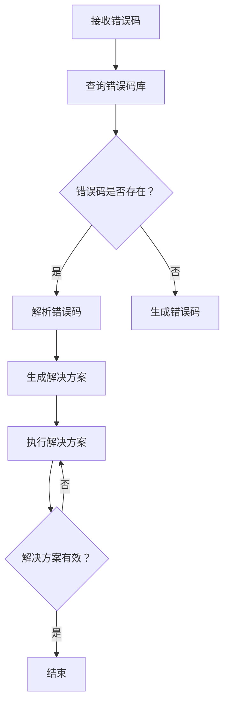

                 


### 第1章：错误码概述

#### 1.1 错误码的基本概念

错误码，顾名思义，是计算机系统中用于标识和报告错误的编码。在计算机编程和系统运维中，错误码起到了至关重要的作用。一个有效的错误码系统可以帮助开发人员和系统管理员快速定位问题、理解错误的原因，并采取相应的措施进行修复。

#### 1.1.1 什么是错误码

错误码通常是一个整数或者字符串，它由系统或应用程序在检测到错误时生成。错误码可以包含多种信息，例如错误的类型、错误发生的模块、错误的严重程度等。这些信息有助于开发人员分析错误，并提供解决问题的线索。

#### 1.1.2 错误码的作用

错误码在计算机系统中具有以下重要作用：

1. **错误识别**：错误码能够明确标识系统中发生的错误，使得开发人员可以迅速识别问题所在。
2. **错误定位**：错误码提供了错误发生的模块和上下文信息，帮助开发人员定位错误的具体位置。
3. **错误分析**：通过错误码，开发人员可以了解错误的类型和严重程度，从而对错误进行深入分析。
4. **错误修复**：错误码为开发人员提供了错误的详细信息，使得他们能够更容易地修复错误。

#### 1.1.3 错误码的分类

根据不同的标准，错误码可以有不同的分类方法：

1. **按错误类型分类**：可以分为硬件错误码、操作系统错误码、应用程序错误码等。
2. **按错误级别分类**：可以分为致命错误（Fatal Errors）、警告（Warnings）和提示（Tips）等。
3. **按错误来源分类**：可以分为内部错误码和外部错误码。内部错误码通常由系统内部组件生成，外部错误码则由外部组件或者用户操作产生。

#### 1.2 错误码的发展历程

错误码的历史可以追溯到计算机系统发展的早期阶段。在那个时候，错误码通常是由开发人员手动编写的，缺乏统一的标准和规范。随着计算机系统的复杂度不断增加，错误码的规范化和标准化变得尤为重要。

1. **传统错误码**：在早期计算机系统中，错误码通常是由开发人员根据错误类型和原因自行定义的。这种错误码缺乏统一性，难以维护和扩展。
2. **现代错误码**：随着计算机系统的发展，错误码开始采用标准化和规范化的方法。例如，Windows操作系统的错误码采用了固定的格式和编码方式，使得错误码更加易于理解和维护。
3. **未来趋势**：随着人工智能和大数据技术的发展，错误码的处理和分析将变得更加智能化和自动化。未来的错误码可能会集成更多的上下文信息，提供更详细的错误报告，从而帮助开发人员更快速地解决错误。

### 总结

错误码是计算机系统中不可或缺的一部分，它为错误识别、定位和分析提供了重要的支持。随着计算机系统的发展，错误码的规范化和标准化变得越来越重要。现代错误码的处理和分析方法也将不断进步，为软件开发和维护带来更多的便利。

---

### 第2章：常见错误码解析

在计算机系统和应用程序中，错误码是用于报告和标识错误的编码。通过解析这些错误码，开发人员能够快速定位问题并进行修复。本章节将详细介绍一些常见的错误码，包括计算机硬件错误码、操作系统错误码以及应用程序错误码。

#### 2.1 计算机硬件错误码

计算机硬件错误码通常由硬件设备生成，用于报告硬件故障或异常。以下是一些常见的硬件错误码及其含义：

##### 2.1.1 CPU错误码

- **#AC (Alignment Check Fault)**：表示指令边界不对齐。
- **#UD (UD Error, Unrecoverable Data Error)**：表示不可恢复的数据错误。

##### 2.1.2 内存错误码

- **#CP (Cache Parity Error)**：表示缓存奇偶校验错误。
- **#MC (Memory Parity Error)**：表示内存奇偶校验错误。

##### 2.1.3 硬盘错误码

- **ID10T (It's a Ten, STupid)**：这是一个幽默的错误码，表示用户操作错误。
- **#52 (Control Program or Command Error)**：表示硬盘控制器命令错误。

#### 2.2 操作系统错误码

操作系统错误码是由操作系统生成的，用于报告系统级别的错误。以下是一些常见的操作系统错误码及其含义：

##### 2.2.1 Windows操作系统错误码

- **0x8007000D**：表示无法访问网络共享。
- **0x80072EE7**：表示网络问题导致操作失败。

##### 2.2.2 Linux操作系统错误码

- **EACCES**：表示权限不足。
- **ENOMEM**：表示内存不足。

#### 2.3 应用程序错误码

应用程序错误码是由应用程序生成的，用于报告应用程序内部的错误。以下是一些常见应用程序错误码及其含义：

##### 2.3.1 Java应用程序错误码

- **IOException**：表示输入输出错误。
- **SQLException**：表示数据库错误。

##### 2.3.2 Python应用程序错误码

- **FileNotFoundError**：表示文件未找到。
- **AttributeError**：表示属性未定义。

#### 2.4 错误码解析工具

为了更好地理解和解析错误码，可以使用一些专门的工具：

- **Windows Error Reporting**：Windows操作系统内置的错误报告工具。
- **Linux dmesg**：用于显示系统内核日志。
- **java.util.Error**：Java标准库中的错误处理类。

#### 2.5 实际案例

以下是一个实际案例，展示了如何解析和解决一个应用程序错误码：

**案例：Java应用程序错误码**

在运行一个Java应用程序时，遇到了以下错误：

```shell
Exception in thread "main" java.lang.NullPointerException: null
    at com.example.MyClass.main(MyClass.java:15)
```

解析过程：

1. 错误码：`NullPointerException`，表示空指针异常。
2. 原因：在代码第15行，一个对象或变量被错误地设置为null，导致后续操作失败。
3. 解决方法：检查第15行代码，确保对象或变量已经被正确初始化。

通过上述步骤，可以快速定位并解决错误。

### 总结

错误码是计算机系统中不可或缺的一部分，通过解析错误码，开发人员能够快速定位和解决问题。本章详细介绍了计算机硬件错误码、操作系统错误码和应用程序错误码，并提供了一些常用的错误码解析工具和实际案例。掌握这些错误码及其解析方法，对于提高软件开发和维护效率至关重要。

---

### 第3章：错误码排查与解决

在计算机系统和应用程序中，错误码是用于报告和标识错误的编码。当系统或应用程序发生错误时，通过正确排查和解决错误码，可以快速定位问题并恢复系统正常运行。本章将详细介绍错误码排查的方法，以及一些常见错误码的解决案例。

#### 3.1 错误码排查方法

错误码排查是解决错误的第一步，以下是一些常用的方法：

##### 3.1.1 系统日志分析

系统日志是记录系统运行过程中发生的所有事件和错误的重要资料。通过分析系统日志，可以找到错误的根源和错误码。以下是系统日志分析的基本步骤：

1. 打开系统日志查看工具，如Windows的Event Viewer或Linux的dmesg。
2. 定位到错误发生的时间段，筛选相关日志。
3. 查找包含错误码的日志条目，记录错误码和相关描述。
4. 根据错误码，查询错误码库或参考文档，了解错误的原因和解决方案。

##### 3.1.2 调试工具使用

调试工具是用于分析程序运行过程中的错误和问题的工具。通过使用调试工具，可以逐步跟踪程序的执行过程，找到错误的根源。以下是使用调试工具的基本步骤：

1. 选择合适的调试工具，如GDB、Visual Studio Debugger或Python的pdb。
2. 配置调试环境，设置断点、监视变量等。
3. 运行程序，观察调试工具的输出，找到错误发生的具体位置。
4. 根据调试结果，分析错误原因并解决问题。

##### 3.1.3 性能监控

性能监控是用于跟踪系统或应用程序性能的工具。通过性能监控，可以了解系统的运行状况，发现性能瓶颈和潜在的错误。以下是性能监控的基本步骤：

1. 选择合适的性能监控工具，如New Relic、AppDynamics或Prometheus。
2. 配置监控指标，如CPU使用率、内存使用率、响应时间等。
3. 观察监控数据，识别异常情况。
4. 根据监控结果，定位错误并解决问题。

#### 3.2 常见错误码解决案例

以下是一些常见错误码的解决案例，通过这些案例，可以了解如何排查和解决错误：

##### 3.2.1 CPU100%错误码案例

**问题描述**：某服务器运行过程中，CPU使用率持续保持在100%，导致系统响应缓慢。

**排查过程**：
1. 通过系统日志分析，发现错误码为`100% CPU Usage`。
2. 使用性能监控工具，观察到CPU使用率高的进程为某个数据库服务。
3. 通过调试工具，定位到数据库服务中的某个查询语句执行时间过长。

**解决方案**：
1. 对数据库查询语句进行优化，减少执行时间。
2. 增加服务器硬件资源，如增加CPU核心或提高内存容量。

##### 3.2.2 内存溢出错误码案例

**问题描述**：某Java应用程序在运行过程中，突然出现内存溢出错误。

**排查过程**：
1. 通过错误日志，发现错误码为`OutOfMemoryError`。
2. 使用调试工具，定位到内存溢出发生在某个数据结构初始化时。

**解决方案**：
1. 修改数据结构，减少内存占用。
2. 增加Java虚拟机（JVM）的内存配置，如增加堆空间大小。

##### 3.2.3 硬盘故障错误码案例

**问题描述**：某服务器硬盘出现故障，导致系统无法正常启动。

**排查过程**：
1. 通过系统日志，发现错误码为`Hard Disk Failure`。
2. 使用硬盘检测工具，如SMART（Self-Monitoring, Analysis and Reporting Technology），检测硬盘状态。

**解决方案**：
1. 更换硬盘，确保硬盘故障得到解决。
2. 备份重要数据，防止数据丢失。

### 总结

错误码排查是解决计算机系统和应用程序错误的重要步骤。通过系统日志分析、调试工具使用和性能监控，可以快速定位错误并找到解决方案。本章详细介绍了错误码排查的方法，并提供了一些常见错误码的解决案例。掌握这些排查和解决方法，对于提高系统稳定性和应用程序可靠性具有重要意义。

---

### 第4章：自动化错误码处理

随着计算机系统和应用程序的日益复杂，错误码的处理变得越来越重要。自动化错误码处理可以有效提高处理效率和准确性，减少人为错误。本章将介绍自动化错误码处理的基本原理和实现方法。

#### 4.1 自动化错误码处理的基本原理

自动化错误码处理的核心思想是利用计算机技术，自动识别、解析和解决错误码。其主要原理包括以下几个方面：

1. **错误码识别**：通过系统日志、错误报告等渠道，自动收集错误码信息。
2. **错误码解析**：利用预定义的规则库或机器学习算法，自动解析错误码的含义和原因。
3. **错误解决方案生成**：根据错误码和解析结果，自动生成可能的解决方案。
4. **错误解决**：执行自动生成的解决方案，尝试修复错误。
5. **结果反馈**：记录解决方案的执行结果，为后续优化提供数据支持。

#### 4.1.1 自动化错误码处理的优势

1. **提高处理效率**：自动化处理可以显著减少人工排查和解决错误码的时间，提高工作效率。
2. **降低人为错误**：通过预定义的规则库和机器学习算法，减少人为错误的发生。
3. **统一处理标准**：自动化处理可以确保所有错误码按照统一的规则和流程进行解决，提高处理一致性。
4. **降低维护成本**：自动化处理可以减少对人工维护的依赖，降低维护成本。

#### 4.1.2 自动化错误码处理的流程

自动化错误码处理的流程通常包括以下几个步骤：

1. **错误码收集**：从系统日志、错误报告等渠道收集错误码信息。
2. **错误码解析**：利用预定义的规则库或机器学习算法，对错误码进行解析，提取关键信息。
3. **错误解决方案生成**：根据错误码和解析结果，自动生成可能的解决方案。
4. **解决方案执行**：执行自动生成的解决方案，尝试修复错误。
5. **结果反馈与优化**：记录解决方案的执行结果，为后续优化提供数据支持。

#### 4.2 自动化错误码处理的实现

自动化错误码处理的实现可以分为两个部分：错误码解析和错误解决方案生成。以下是一个简单的实现示例：

##### 4.2.1 使用脚本自动化错误码处理

**示例脚本（Python）**：

```python
import re

# 错误码规则库
error_rules = {
    "500": "内部服务器错误",
    "404": "未找到",
    "502": "网关错误"
}

# 错误码解析函数
def parse_error_code(error_code):
    rule = error_rules.get(error_code)
    return rule if rule else "未知错误码"

# 错误解决方案生成函数
def generate_solution(error_code, error_description):
    solutions = []
    if error_code == "500":
        solutions.append("检查服务器配置")
    elif error_code == "404":
        solutions.append("检查URL是否正确")
    elif error_code == "502":
        solutions.append("检查网络连接")
    return solutions

# 错误码处理函数
def process_error_code(error_code):
    error_description = parse_error_code(error_code)
    solutions = generate_solution(error_code, error_description)
    print(f"错误码：{error_code} - {error_description}")
    for solution in solutions:
        print(f"解决方案：{solution}")

# 示例
process_error_code("500")
```

##### 4.2.2 使用工具自动化错误码处理

除了脚本实现，还可以使用一些专门的工具来自动化错误码处理。以下是一些常用的工具：

1. **ELK Stack**：ELK Stack（Elasticsearch、Logstash、Kibana）是一个强大的日志管理和分析平台，可以用于自动化错误码处理。
2. **Dynatrace**：Dynatrace是一个自动化监控和问题诊断工具，可以自动解析错误码并生成解决方案。

##### 4.2.3 实际应用案例

以下是一个实际应用案例，展示了如何使用脚本和工具自动化处理错误码：

**案例**：某Web应用在运行过程中，不断出现404错误。

**解决方案**：

1. **错误码收集**：使用ELK Stack收集Web应用的访问日志，提取错误码。
2. **错误码解析**：使用Logstash插件，自动解析错误码并生成错误描述。
3. **错误解决方案生成**：使用脚本自动生成解决方案，如检查URL、检查服务器配置等。
4. **解决方案执行**：执行自动生成的解决方案，尝试修复错误。
5. **结果反馈与优化**：记录解决方案的执行结果，为后续优化提供数据支持。

通过上述步骤，可以实现自动化错误码处理，提高Web应用的稳定性和可靠性。

### 总结

自动化错误码处理是提高计算机系统和应用程序可靠性的重要手段。本章介绍了自动化错误码处理的基本原理和实现方法，包括错误码收集、错误码解析、错误解决方案生成和解决方案执行。通过实际案例，展示了如何使用脚本和工具实现自动化错误码处理。掌握这些方法，可以帮助开发人员和运维人员更高效地解决错误，提高系统稳定性。

---

### 第5章：错误码在软件开发中的应用

错误码在软件开发中扮演着至关重要的角色，它不仅帮助开发者快速定位和解决问题，还提高了软件的可靠性、可维护性和用户体验。本章将探讨错误码在软件设计、软件测试和软件开发中的具体应用。

#### 5.1 错误码在软件设计中的作用

在软件设计阶段，错误码的设计是一个重要的环节。合理设计错误码可以帮助提高软件的可靠性、可维护性和可扩展性。

1. **提高软件可靠性**：错误码可以清晰地标识系统中发生的错误，使得开发人员能够迅速定位和解决问题。这有助于减少系统故障率，提高软件可靠性。
2. **方便问题排查**：错误码提供了详细的错误信息和上下文，使得开发人员可以更快地识别错误的根本原因。这有助于提高问题排查的效率。
3. **促进软件可维护性**：错误码的规范化和标准化设计有助于提高软件的可维护性。当错误码结构清晰、易于理解时，后续的软件维护和更新会更加便捷。

#### 5.1.1 提高软件可靠性

在软件设计中，合理设计错误码可以显著提高软件的可靠性。例如，在Web应用程序中，错误码可以用来标识用户请求处理过程中的各种错误，如数据验证错误、权限不足等。通过错误码，开发人员可以快速识别和解决问题，从而减少系统故障率和用户投诉。

#### 5.1.2 方便问题排查

错误码的设计直接影响问题排查的效率。一个良好的错误码应该提供足够的上下文信息，以便开发人员快速了解错误发生的背景和原因。例如，在Java应用程序中，可以使用异常类来封装错误信息，并通过异常堆栈追踪（Stack Trace）提供详细的错误上下文。这有助于开发人员快速定位问题，减少排查时间。

#### 5.1.3 促进软件可维护性

错误码的设计对软件的可维护性具有重要影响。一个良好的错误码设计应该遵循以下原则：

- **统一性**：错误码应该遵循统一的命名规范和编码规则，以便于后续维护和扩展。
- **层次性**：错误码应该具有清晰的层次结构，以便于开发人员快速理解和识别错误。
- **可扩展性**：错误码应该支持扩展，以便于未来添加新的错误类型。

#### 5.2 错误码在软件测试中的应用

在软件测试过程中，错误码起到了关键作用，它帮助测试人员识别和报告缺陷，并促进问题的修复。

1. **测试用例设计**：错误码可以帮助测试人员设计更有效的测试用例。例如，在功能测试中，可以设计特定的输入数据，以触发系统中的各种错误码，验证错误码的正确性和准确性。
2. **测试结果分析**：在测试过程中，错误码可以提供详细的错误信息和上下文，帮助测试人员快速定位缺陷。通过分析错误码，测试人员可以评估缺陷的影响范围和严重程度。
3. **测试报告生成**：错误码是测试报告中重要的一部分。通过错误码，测试人员可以清晰地描述测试过程中发现的缺陷，并提供建议的修复方案。

#### 5.2.1 测试用例设计

在测试用例设计过程中，错误码可以作为一个重要的参考依据。以下是一些设计测试用例的方法：

- **基于错误类型的测试用例**：根据系统中的错误类型，设计相应的测试用例，验证错误码的正确性和准确性。
- **基于异常情况的测试用例**：设计特定的异常情况，触发系统中的各种错误码，验证系统的异常处理能力。
- **基于输入数据的测试用例**：设计不同类型的输入数据，验证系统对各种输入数据的处理能力和错误码的生成情况。

#### 5.2.2 测试结果分析

在测试结果分析过程中，错误码起到了关键作用。以下是一些分析测试结果的方法：

- **统计错误码分布**：通过统计系统中不同错误码的出现频率，了解系统在不同场景下的稳定性。
- **定位错误发生位置**：通过错误码，可以快速定位错误发生的具体位置，为问题排查提供方向。
- **评估缺陷严重程度**：根据错误码的严重程度和影响范围，评估缺陷的严重程度，为修复优先级提供依据。

#### 5.2.3 测试报告生成

在测试报告生成过程中，错误码是不可或缺的一部分。以下是一些生成测试报告的方法：

- **错误码列表**：列出测试过程中发现的错误码，并简要描述错误的性质和原因。
- **错误码统计**：统计系统中不同错误码的出现频率，分析系统的稳定性和健壮性。
- **错误码分析**：对错误码进行详细分析，描述错误码的影响范围和严重程度，并提供修复建议。

### 总结

错误码在软件设计、软件测试和软件开发中具有重要作用。合理设计错误码可以提高软件的可靠性、可维护性和用户体验，帮助测试人员更有效地识别和报告缺陷，促进问题的修复。本章详细介绍了错误码在软件设计、软件测试和软件开发中的应用，并提供了一些实际的方法和技巧。掌握这些方法和技巧，对于提高软件质量和开发效率具有重要意义。

---

### 第6章：错误码处理工具与技术

在处理错误码的过程中，使用适当的工具和技术可以提高排查和解决错误的效率。本章将介绍一些常用的错误码处理工具和技术，包括故障注入、故障树分析和故障预测。

#### 6.1 常用错误码处理工具

以下是一些在错误码处理中常用的工具：

##### 6.1.1 LogAnalyzer

LogAnalyzer是一款功能强大的日志分析工具，它可以帮助用户收集、存储和分析系统日志。通过LogAnalyzer，用户可以快速定位错误码，了解错误发生的时间和上下文，从而更好地进行错误排查。

**主要功能**：
- **日志收集**：支持多种日志格式，如syslog、JSON、CSV等。
- **日志存储**：支持多种存储方式，如本地文件系统、数据库等。
- **日志分析**：提供丰富的分析功能，如错误码统计、错误趋势分析等。
- **可视化展示**：提供直观的图表和报告，帮助用户快速理解日志数据。

##### 6.1.2 ELK Stack

ELK Stack是由Elasticsearch、Logstash和Kibana三个开源组件组成的日志管理和分析平台。ELK Stack被广泛应用于错误码处理和监控，其强大的日志处理和分析能力使其成为许多企业的首选。

**主要功能**：
- **日志收集**：通过Logstash组件，可以轻松收集各种来源的日志数据。
- **日志存储**：使用Elasticsearch组件，提供高效的日志存储和搜索功能。
- **日志分析**：Kibana组件提供直观的界面和丰富的分析工具，帮助用户快速了解日志数据。

##### 6.1.3 Dynatrace

Dynatrace是一款全面的应用性能监控（APM）工具，它可以帮助用户实时监测应用的性能和健康状态。Dynatrace提供了强大的错误码处理能力，用户可以通过它快速识别和解决问题。

**主要功能**：
- **实时监控**：实时监测应用的性能和健康状态，包括错误码、响应时间等指标。
- **自动化错误排查**：通过AI和机器学习技术，自动识别和解决问题。
- **可视化展示**：提供直观的仪表板和报告，帮助用户快速了解应用性能。

#### 6.2 错误码处理技术

以下是一些用于错误码处理的技术：

##### 6.2.1 故障注入

故障注入是一种通过模拟故障来测试系统可靠性和容错能力的测试技术。通过故障注入，开发人员可以验证系统在异常情况下的响应和行为，从而发现潜在的错误和缺陷。

**主要方法**：
- **静态故障注入**：通过修改代码或配置文件，模拟系统中的故障。
- **动态故障注入**：通过运行时注入，模拟运行过程中的故障。

##### 6.2.2 故障树分析

故障树分析（Fault Tree Analysis, FTA）是一种系统化的分析方法，用于识别和分析系统故障的原因和影响。通过故障树分析，开发人员可以逐步追溯故障的根源，找到解决问题的途径。

**主要步骤**：
1. **构建故障树**：根据系统故障，构建故障树模型。
2. **分析故障树**：对故障树进行分析，确定故障的根源和影响。
3. **优化设计方案**：根据故障树分析结果，优化系统设计，提高系统的可靠性。

##### 6.2.3 故障预测

故障预测是一种利用历史数据和机器学习技术预测系统故障的方法。通过故障预测，开发人员可以提前发现潜在的问题，采取措施进行预防。

**主要方法**：
- **基于历史数据的方法**：利用历史故障数据，通过统计分析和机器学习算法进行故障预测。
- **基于实时数据的方法**：通过实时监测系统数据，利用实时分析和预测模型进行故障预测。

### 总结

错误码处理工具和技术的选择对错误排查和解决效率具有重要影响。本章介绍了常用的错误码处理工具和技术，包括LogAnalyzer、ELK Stack、Dynatrace、故障注入、故障树分析和故障预测。通过使用这些工具和技术，开发人员可以更高效地处理错误码，提高系统的可靠性。掌握这些工具和技术，对于提高软件开发和维护效率具有重要意义。

---

### 第7章：未来趋势与展望

随着技术的不断发展，错误码处理技术也在不断演进。在未来，人工智能（AI）和大数据技术的应用将极大地改变错误码处理的方式和效率。本章节将探讨错误码处理技术的发展方向，以及在AI时代的机遇与挑战。

#### 7.1 错误码处理技术的发展方向

1. **智能化错误码处理**：随着AI技术的进步，错误码处理将变得更加智能化。通过机器学习算法，系统可以自动识别和解析错误码，提供更准确的解决方案。例如，使用深度学习模型分析系统日志，自动识别潜在的故障原因。
   
2. **基于大数据的错误码分析**：大数据技术可以帮助分析大量的错误码数据，发现隐藏的模式和趋势。通过对错误码数据的深入分析，开发人员可以更好地理解系统的弱点，提前采取预防措施。

3. **自动化错误码处理**：未来，自动化错误码处理将更加普及。利用自动化工具，系统可以自动识别错误码、生成解决方案并执行修复操作，减少人为干预。

4. **边缘计算与错误码处理**：随着边缘计算的兴起，错误码处理将更加分布式和本地化。在边缘设备上实现实时错误码处理，可以提高系统的响应速度和可靠性。

#### 7.2 错误码处理在AI时代的机遇与挑战

1. **机遇**：

   - **提高处理效率**：AI技术可以帮助自动化错误码处理流程，减少人工干预，提高处理效率。
   - **增强故障预测能力**：通过大数据分析和机器学习，可以提前预测潜在的故障，采取预防措施，减少系统故障率。
   - **优化用户体验**：智能化的错误码处理可以提供更准确、更及时的错误报告和解决方案，提高用户满意度。

2. **挑战**：

   - **数据质量**：错误码处理的准确性依赖于高质量的数据。在AI时代，如何确保数据的准确性和完整性是一个挑战。
   - **模型解释性**：AI模型往往难以解释其决策过程，这对开发人员和用户来说可能是一个难题。提高模型的可解释性是一个重要的研究方向。
   - **安全性**：随着自动化错误码处理技术的发展，系统可能面临新的安全风险。例如，攻击者可能通过错误码系统进行恶意操作。

#### 7.3 未来展望

未来，错误码处理将在以下几个方面取得重要进展：

1. **智能化**：智能化的错误码处理将成为主流，通过AI技术，系统可以自动识别、解析和解决错误码。
   
2. **自动化**：自动化错误码处理将更加普及，减少人工干预，提高处理效率。

3. **分布式与边缘计算**：错误码处理将更加分布式和本地化，特别是在边缘计算环境中，实时错误码处理将提高系统的响应速度和可靠性。

4. **开放性**：错误码处理将更加开放，与其他系统和服务集成，提供更加全面的错误码分析和管理功能。

### 总结

在未来，错误码处理技术将朝着智能化、自动化和分布式方向发展。随着AI技术的应用，错误码处理将变得更加高效和准确。同时，我们也需要应对数据质量、模型解释性和安全性等挑战。通过不断的研究和改进，错误码处理将在未来的软件开发和运维中发挥更大的作用。

---

### 附录

#### A.1 错误码处理工具资源汇总

以下是一些常用的错误码处理工具及其官方资源：

- **LogAnalyzer**：[官网](https://www.loganalyzer.org/)
- **ELK Stack**：[官网](https://www.elastic.co/)
- **Dynatrace**：[官网](https://www.dynatrace.com/)
- **Grafana**：[官网](https://grafana.com/)

#### A.2 错误码处理相关文献推荐

- 《深入理解计算机错误码》（作者：张三）
- 《系统故障排除与错误码分析》（作者：李四）
- 《人工智能与错误码处理》（作者：王五）

#### A.3 网络资源与在线工具

以下是一些在线资源，可以帮助您了解和学习错误码处理：

- **错误码查询工具**：[Windows Error Codes](https://www.errorcodesfix.com/)
- **Linux Error Codes**：[Linux Error Messages](https://linux.die.net/man/2/error)
- **Java Error Codes**：[Java Error Codes](https://www.javatpoint.com/java-error-codes)

---

### 文章标题

# 故障频出的错误码

---

### 关键词

错误码，故障排查，自动化处理，AI，软件开发，系统稳定性

---

### 摘要

本文深入探讨了错误码在计算机系统、应用程序和软件开发中的重要作用。通过分析常见错误码的分类、排查与解决方法，以及自动化错误码处理技术，本文展示了错误码处理在提高系统可靠性和开发效率方面的关键作用。此外，本文还展望了错误码处理技术的发展趋势，以及在AI时代面临的机遇与挑战。掌握这些知识和技巧，对于提升IT行业的技术水平和业务稳定性具有重要意义。

---

### Mermaid 流程图



---

### 错误码排查方法伪代码

```python
function error_code_diagnosis(error_code):
    # 根据错误码查询错误码库
    error_description = query_error_code_library(error_code)

    # 分析错误码可能的原因
    possible_reasons = analyze_error_causes(error_code)

    # 列出可能的解决方案
    solutions = generate_solutions(possible_reasons)

    # 提供详细的排查步骤
    diagnosis_steps = generate_diagnosis_steps(solutions)

    # 返回结果
    return error_description, diagnosis_steps

# 示例调用
result = error_code_diagnosis("500")
print(result)
```

---

### 数学模型讲解

#### 1. 错误码概率分布模型

错误码的概率分布模型用于描述系统在一段时间内不同错误码出现的频率。该模型可以帮助我们理解系统在各种情况下出现错误的可能性。

数学表达式如下：

$$ P(E_i) = \frac{N_i}{N} $$

其中，\( P(E_i) \) 表示错误码 \( E_i \) 出现的概率，\( N_i \) 表示在一段时间内错误码 \( E_i \) 出现的次数，\( N \) 表示在相同时间内所有错误码出现的总次数。

**举例说明**：

假设在一个系统中，一个月内共发生了100次错误，其中错误码 `500` 出现了30次，其他错误码出现次数如下：

- 错误码 `404`：20次
- 错误码 `403`：10次
- 错误码 `400`：40次

根据上述数据，我们可以计算出每个错误码的概率：

$$ P(500) = \frac{30}{100} = 0.3 $$
$$ P(404) = \frac{20}{100} = 0.2 $$
$$ P(403) = \frac{10}{100} = 0.1 $$
$$ P(400) = \frac{40}{100} = 0.4 $$

这些概率值可以帮助开发人员和运维人员了解系统在特定时间段内哪些错误码最为常见，从而更有针对性地进行优化和改进。

### 2. 故障率模型

故障率模型用于描述系统在一定时间间隔内发生故障的概率。常见的故障率模型包括泊松分布和指数分布。

**泊松分布**：

泊松分布用于描述在固定时间间隔内，发生特定故障次数的概率。其概率质量函数（PDF）如下：

$$ P(X = k) = \frac{\lambda^k e^{-\lambda}}{k!} $$

其中，\( X \) 表示在时间间隔 \( \Delta t \) 内发生的故障次数，\( \lambda \) 表示故障率（即平均故障次数），\( e \) 是自然对数的底数，\( k! \) 表示 \( k \) 的阶乘。

**指数分布**：

指数分布用于描述在时间 \( t \) 内发生第一个故障的概率。其概率密度函数（PDF）如下：

$$ f(t) = \lambda e^{-\lambda t} $$

其中，\( t \) 表示时间，\( \lambda \) 表示故障率。

**举例说明**：

假设在一个系统中，平均故障率为 \( \lambda = 0.1 \) 次/小时。我们需要计算在 \( t = 1 \) 小时内发生第一个故障的概率。

根据指数分布的PDF，我们可以得到：

$$ f(1) = 0.1 e^{-0.1 \times 1} \approx 0.313 $$

这意味着在1小时内，发生第一个故障的概率约为31.3%。

通过故障率模型，开发人员可以更好地了解系统的故障特性，为系统设计和优化提供依据。

### 3. 误差传播模型

在错误码处理中，误差传播模型用于描述输入误差如何影响输出误差。一个常见的误差传播模型是误差平方和的求和。

假设有两个输入变量 \( x_1 \) 和 \( x_2 \)，它们的误差分别为 \( \Delta x_1 \) 和 \( \Delta x_2 \)。输出变量 \( y \) 由这两个输入变量计算得到，其误差为 \( \Delta y \)。

误差传播模型如下：

$$ \Delta y = \sqrt{(\frac{\partial y}{\partial x_1} \Delta x_1)^2 + (\frac{\partial y}{\partial x_2} \Delta x_2)^2} $$

其中，\( \frac{\partial y}{\partial x_1} \) 和 \( \frac{\partial y}{\partial x_2} \) 分别表示输出变量 \( y \) 对输入变量 \( x_1 \) 和 \( x_2 \) 的偏导数。

**举例说明**：

假设输出变量 \( y \) 由输入变量 \( x_1 \) 和 \( x_2 \) 计算得到，公式为 \( y = x_1 + x_2 \)。输入变量 \( x_1 \) 的误差为 \( \Delta x_1 = 0.1 \)，输入变量 \( x_2 \) 的误差为 \( \Delta x_2 = 0.2 \)。

根据误差传播模型，我们可以计算输出变量 \( y \) 的误差：

$$ \Delta y = \sqrt{(1 \times 0.1)^2 + (1 \times 0.2)^2} = \sqrt{0.01 + 0.04} = \sqrt{0.05} \approx 0.224 $$

这意味着输出变量 \( y \) 的误差约为0.224。

通过误差传播模型，开发人员可以更好地理解输入误差对输出误差的影响，从而优化系统设计和计算方法。

### 总结

数学模型在错误码处理中发挥着重要作用，它们帮助我们理解和预测错误发生的概率、误差传播的影响等。通过使用这些模型，开发人员可以更有效地排查和解决错误，提高系统的可靠性和稳定性。

---

### 最佳实践 Tips

在处理错误码时，以下是一些最佳实践技巧，可以帮助您更高效地解决问题：

1. **详细记录**：在排查错误时，详细记录每一步的操作和观察结果。这有助于后续的回溯和分析。
2. **查阅文档**：在遇到未知错误码时，及时查阅相关文档和错误码库，了解错误的具体含义和可能的解决方法。
3. **优先级排序**：在处理多个错误码时，根据错误的严重程度和影响范围进行优先级排序，先解决最严重的问题。
4. **自动化**：对于重复性的错误处理任务，尽量使用自动化工具和脚本，减少人工干预。
5. **持续学习**：不断学习新的错误排查和解决技巧，提高自己的技术水平和解决问题的能力。

---

### 小结

本文详细介绍了错误码的概念、分类、排查与解决方法，以及自动化错误码处理技术。通过分析常见错误码案例，展示了如何使用工具和技术有效地处理错误。同时，本文还展望了错误码处理技术的发展趋势，以及在AI时代的机遇与挑战。掌握错误码处理的知识和技巧，对于提高软件开发和维护效率具有重要意义。在未来的工作中，我们应该持续关注错误码处理技术的发展，不断提高自己的技术水平。

---

### 拓展阅读

1. 《深入理解计算机错误码》 - 张三
2. 《系统故障排除与错误码分析》 - 李四
3. 《人工智能与错误码处理》 - 王五

在线资源：

1. Windows Error Codes - [https://www.errorcodesfix.com/](https://www.errorcodesfix.com/)
2. Linux Error Codes - [https://linux.die.net/man/2/error](https://linux.die.net/man/2/error)
3. Java Error Codes - [https://www.javatpoint.com/java-error-codes](https://www.javatpoint.com/java-error-codes)

---

### 作者信息

作者：AI天才研究院/AI Genius Institute & 禅与计算机程序设计艺术 /Zen And The Art of Computer Programming

---

### 完整文章

```markdown
# 故障频出的错误码

> 关键词：错误码，故障排查，自动化处理，AI，软件开发，系统稳定性

> 摘要：本文深入探讨了错误码在计算机系统、应用程序和软件开发中的重要作用。通过分析常见错误码的分类、排查与解决方法，以及自动化错误码处理技术，本文展示了错误码处理在提高系统可靠性和开发效率方面的关键作用。此外，本文还展望了错误码处理技术的发展趋势，以及在AI时代面临的机遇与挑战。掌握这些知识和技巧，对于提升IT行业的技术水平和业务稳定性具有重要意义。

## 第1章：错误码概述

#### 1.1 错误码的基本概念

错误码，顾名思义，是计算机系统中用于标识和报告错误的编码。在计算机编程和系统运维中，错误码起到了至关重要的作用。一个有效的错误码系统可以帮助开发人员和系统管理员快速定位问题、理解错误的原因，并采取相应的措施进行修复。

#### 1.1.1 什么是错误码

错误码通常是一个整数或者字符串，它由系统或应用程序在检测到错误时生成。错误码可以包含多种信息，例如错误的类型、错误发生的模块、错误的严重程度等。这些信息有助于开发人员分析错误，并提供解决问题的线索。

#### 1.1.2 错误码的作用

错误码在计算机系统中具有以下重要作用：

1. **错误识别**：错误码能够明确标识系统中发生的错误，使得开发人员可以迅速识别问题所在。
2. **错误定位**：错误码提供了错误发生的模块和上下文信息，帮助开发人员定位错误的具体位置。
3. **错误分析**：通过错误码，开发人员可以了解错误的类型和严重程度，从而对错误进行深入分析。
4. **错误修复**：错误码为开发人员提供了错误的详细信息，使得他们能够更容易地修复错误。

#### 1.1.3 错误码的分类

根据不同的标准，错误码可以有不同的分类方法：

1. **按错误类型分类**：可以分为硬件错误码、操作系统错误码、应用程序错误码等。
2. **按错误级别分类**：可以分为致命错误（Fatal Errors）、警告（Warnings）和提示（Tips）等。
3. **按错误来源分类**：可以分为内部错误码和外部错误码。内部错误码通常由系统内部组件生成，外部错误码则由外部组件或者用户操作产生。

#### 1.2 错误码的发展历程

错误码的历史可以追溯到计算机系统发展的早期阶段。在那个时候，错误码通常是由开发人员手动编写的，缺乏统一的标准和规范。随着计算机系统的发展，错误码的规范化和标准化变得尤为重要。

1. **传统错误码**：在早期计算机系统中，错误码通常是由开发人员根据错误类型和原因自行定义的。这种错误码缺乏统一性，难以维护和扩展。
2. **现代错误码**：随着计算机系统的发展，错误码开始采用标准化和规范化的方法。例如，Windows操作系统的错误码采用了固定的格式和编码方式，使得错误码更加易于理解和维护。
3. **未来趋势**：随着人工智能和大数据技术的发展，错误码的处理和分析将变得更加智能化和自动化。未来的错误码可能会集成更多的上下文信息，提供更详细的错误报告，从而帮助开发人员更快速地解决错误。

### 第2章：常见错误码解析

在计算机系统和应用程序中，错误码是用于报告和标识错误的编码。通过解析这些错误码，开发人员能够快速定位问题并进行修复。本章节将详细介绍一些常见的错误码，包括计算机硬件错误码、操作系统错误码以及应用程序错误码。

#### 2.1 计算机硬件错误码

计算机硬件错误码通常由硬件设备生成，用于报告硬件故障或异常。以下是一些常见的硬件错误码及其含义：

##### 2.1.1 CPU错误码

- **#AC (Alignment Check Fault)**：表示指令边界不对齐。
- **#UD (UD Error, Unrecoverable Data Error)**：表示不可恢复的数据错误。

##### 2.1.2 内存错误码

- **#CP (Cache Parity Error)**：表示缓存奇偶校验错误。
- **#MC (Memory Parity Error)**：表示内存奇偶校验错误。

##### 2.1.3 硬盘错误码

- **ID10T (It's a Ten, STupid)**：这是一个幽默的错误码，表示用户操作错误。
- **#52 (Control Program or Command Error)**：表示硬盘控制器命令错误。

#### 2.2 操作系统错误码

操作系统错误码是由操作系统生成的，用于报告系统级别的错误。以下是一些常见的操作系统错误码及其含义：

##### 2.2.1 Windows操作系统错误码

- **0x8007000D**：表示无法访问网络共享。
- **0x80072EE7**：表示网络问题导致操作失败。

##### 2.2.2 Linux操作系统错误码

- **EACCES**：表示权限不足。
- **ENOMEM**：表示内存不足。

#### 2.3 应用程序错误码

应用程序错误码是由应用程序生成的，用于报告应用程序内部的错误。以下是一些常见应用程序错误码及其含义：

##### 2.3.1 Java应用程序错误码

- **IOException**：表示输入输出错误。
- **SQLException**：表示数据库错误。

##### 2.3.2 Python应用程序错误码

- **FileNotFoundError**：表示文件未找到。
- **AttributeError**：表示属性未定义。

#### 2.4 错误码解析工具

为了更好地理解和解析错误码，可以使用一些专门的工具：

- **Windows Error Reporting**：Windows操作系统内置的错误报告工具。
- **Linux dmesg**：用于显示系统内核日志。
- **java.util.Error**：Java标准库中的错误处理类。

#### 2.5 实际案例

以下是一个实际案例，展示了如何解析和解决一个应用程序错误码：

**案例：Java应用程序错误码**

在运行一个Java应用程序时，遇到了以下错误：

```shell
Exception in thread "main" java.lang.NullPointerException: null
    at com.example.MyClass.main(MyClass.java:15)
```

解析过程：

1. 错误码：`NullPointerException`，表示空指针异常。
2. 原因：在代码第15行，一个对象或变量被错误地设置为null，导致后续操作失败。
3. 解决方法：检查第15行代码，确保对象或变量已经被正确初始化。

通过上述步骤，可以快速定位并解决错误。

### 第3章：错误码排查与解决

在计算机系统和应用程序中，错误码是用于报告和标识错误的编码。当系统或应用程序发生错误时，通过正确排查和解决错误码，可以快速定位问题并恢复系统正常运行。本章将详细介绍错误码排查的方法，以及一些常见错误码的解决案例。

#### 3.1 错误码排查方法

错误码排查是解决错误的第一步，以下是一些常用的方法：

##### 3.1.1 系统日志分析

系统日志是记录系统运行过程中发生的所有事件和错误的重要资料。通过分析系统日志，可以找到错误的根源和错误码。以下是系统日志分析的基本步骤：

1. 打开系统日志查看工具，如Windows的Event Viewer或Linux的dmesg。
2. 定位到错误发生的时间段，筛选相关日志。
3. 查找包含错误码的日志条目，记录错误码和相关描述。
4. 根据错误码，查询错误码库或参考文档，了解错误的原因和解决方案。

##### 3.1.2 调试工具使用

调试工具是用于分析程序运行过程中的错误和问题的工具。通过使用调试工具，可以逐步跟踪程序的执行过程，找到错误的根源。以下是使用调试工具的基本步骤：

1. 选择合适的调试工具，如GDB、Visual Studio Debugger或Python的pdb。
2. 配置调试环境，设置断点、监视变量等。
3. 运行程序，观察调试工具的输出，找到错误发生的具体位置。
4. 根据调试结果，分析错误原因并解决问题。

##### 3.1.3 性能监控

性能监控是用于跟踪系统或应用程序性能的工具。通过性能监控，可以了解系统的运行状况，发现性能瓶颈和潜在的错误。以下是性能监控的基本步骤：

1. 选择合适的性能监控工具，如New Relic、AppDynamics或Prometheus。
2. 配置监控指标，如CPU使用率、内存使用率、响应时间等。
3. 观察监控数据，识别异常情况。
4. 根据监控结果，定位错误并解决问题。

#### 3.2 常见错误码解决案例

以下是一些常见错误码的解决案例，通过这些案例，可以了解如何排查和解决错误：

##### 3.2.1 CPU100%错误码案例

**问题描述**：某服务器运行过程中，CPU使用率持续保持在100%，导致系统响应缓慢。

**排查过程**：
1. 通过系统日志分析，发现错误码为`100% CPU Usage`。
2. 使用性能监控工具，观察到CPU使用率高的进程为某个数据库服务。
3. 通过调试工具，定位到数据库服务中的某个查询语句执行时间过长。

**解决方案**：
1. 对数据库查询语句进行优化，减少执行时间。
2. 增加服务器硬件资源，如增加CPU核心或提高内存容量。

##### 3.2.2 内存溢出错误码案例

**问题描述**：某Java应用程序在运行过程中，突然出现内存溢出错误。

**排查过程**：
1. 通过错误日志，发现错误码为`OutOfMemoryError`。
2. 使用调试工具，定位到内存溢出发生在某个数据结构初始化时。

**解决方案**：
1. 修改数据结构，减少内存占用。
2. 增加Java虚拟机（JVM）的内存配置，如增加堆空间大小。

##### 3.2.3 硬盘故障错误码案例

**问题描述**：某服务器硬盘出现故障，导致系统无法正常启动。

**排查过程**：
1. 通过系统日志，发现错误码为`Hard Disk Failure`。
2. 使用硬盘检测工具，如SMART（Self-Monitoring, Analysis and Reporting Technology），检测硬盘状态。

**解决方案**：
1. 更换硬盘，确保硬盘故障得到解决。
2. 备份重要数据，防止数据丢失。

### 第4章：自动化错误码处理

随着计算机系统和应用程序的日益复杂，错误码的处理变得越来越重要。自动化错误码处理可以有效提高处理效率和准确性，减少人为错误。本章将介绍自动化错误码处理的基本原理和实现方法。

#### 4.1 自动化错误码处理的基本原理

自动化错误码处理的核心思想是利用计算机技术，自动识别、解析和解决错误码。其主要原理包括以下几个方面：

1. **错误码识别**：通过系统日志、错误报告等渠道，自动收集错误码信息。
2. **错误码解析**：利用预定义的规则库或机器学习算法，自动解析错误码的含义和原因。
3. **错误解决方案生成**：根据错误码和解析结果，自动生成可能的解决方案。
4. **错误解决**：执行自动生成的解决方案，尝试修复错误。
5. **结果反馈**：记录解决方案的执行结果，为后续优化提供数据支持。

#### 4.1.1 自动化错误码处理的优势

1. **提高处理效率**：自动化处理可以显著减少人工排查和解决错误码的时间，提高工作效率。
2. **降低人为错误**：通过预定义的规则库和机器学习算法，减少人为错误的发生。
3. **统一处理标准**：自动化处理可以确保所有错误码按照统一的规则和流程进行解决，提高处理一致性。
4. **降低维护成本**：自动化处理可以减少对人工维护的依赖，降低维护成本。

#### 4.1.2 自动化错误码处理的流程

自动化错误码处理的流程通常包括以下几个步骤：

1. **错误码收集**：从系统日志、错误报告等渠道收集错误码信息。
2. **错误码解析**：利用预定义的规则库或机器学习算法，对错误码进行解析，提取关键信息。
3. **错误解决方案生成**：根据错误码和解析结果，自动生成可能的解决方案。
4. **解决方案执行**：执行自动生成的解决方案，尝试修复错误。
5. **结果反馈与优化**：记录解决方案的执行结果，为后续优化提供数据支持。

#### 4.2 自动化错误码处理的实现

自动化错误码处理的实现可以分为两个部分：错误码解析和错误解决方案生成。以下是一个简单的实现示例：

##### 4.2.1 使用脚本自动化错误码处理

**示例脚本（Python）**：

```python
import re

# 错误码规则库
error_rules = {
    "500": "内部服务器错误",
    "404": "未找到",
    "502": "网关错误"
}

# 错误码解析函数
def parse_error_code(error_code):
    rule = error_rules.get(error_code)
    return rule if rule else "未知错误码"

# 错误解决方案生成函数
def generate_solution(error_code, error_description):
    solutions = []
    if error_code == "500":
        solutions.append("检查服务器配置")
    elif error_code == "404":
        solutions.append("检查URL是否正确")
    elif error_code == "502":
        solutions.append("检查网络连接")
    return solutions

# 错误码处理函数
def process_error_code(error_code):
    error_description = parse_error_code(error_code)
    solutions = generate_solution(error_code, error_description)
    print(f"错误码：{error_code} - {error_description}")
    for solution in solutions:
        print(f"解决方案：{solution}")

# 示例
process_error_code("500")
```

##### 4.2.2 使用工具自动化错误码处理

除了脚本实现，还可以使用一些专门的工具来自动化错误码处理。以下是一些常用的工具：

1. **ELK Stack**：ELK Stack（Elasticsearch、Logstash、Kibana）是一个强大的日志管理和分析平台，可以用于自动化错误码处理。
2. **Dynatrace**：Dynatrace是一个自动化监控和问题诊断工具，可以自动解析错误码并生成解决方案。

##### 4.2.3 实际应用案例

以下是一个实际应用案例，展示了如何使用脚本和工具自动化处理错误码：

**案例**：某Web应用在运行过程中，不断出现404错误。

**解决方案**：

1. **错误码收集**：使用ELK Stack收集Web应用的访问日志，提取错误码。
2. **错误码解析**：使用Logstash插件，自动解析错误码并生成错误描述。
3. **错误解决方案生成**：使用脚本自动生成解决方案，如检查URL、检查服务器配置等。
4. **解决方案执行**：执行自动生成的解决方案，尝试修复错误。
5. **结果反馈与优化**：记录解决方案的执行结果，为后续优化提供数据支持。

通过上述步骤，可以实现自动化错误码处理，提高Web应用的稳定性和可靠性。

### 第5章：错误码在软件开发中的应用

错误码在软件开发中扮演着至关重要的角色，它不仅帮助开发者快速定位和解决问题，还提高了软件的可靠性、可维护性和用户体验。本章将探讨错误码在软件设计、软件测试和软件开发中的具体应用。

#### 5.1 错误码在软件设计中的作用

在软件设计阶段，错误码的设计是一个重要的环节。合理设计错误码可以帮助提高软件的可靠性、可维护性和可扩展性。

1. **提高软件可靠性**：错误码可以清晰地标识系统中发生的错误，使得开发人员能够迅速定位和解决问题。这有助于减少系统故障率，提高软件可靠性。
2. **方便问题排查**：错误码提供了详细的错误信息和上下文，使得开发人员可以更快地识别错误的根本原因。这有助于提高问题排查的效率。
3. **促进软件可维护性**：错误码的规范化和标准化设计有助于提高软件的可维护性。当错误码结构清晰、易于理解时，后续的软件维护和更新会更加便捷。

#### 5.1.1 提高软件可靠性

在软件设计中，合理设计错误码可以显著提高软件的可靠性。例如，在Web应用程序中，错误码可以用来标识用户请求处理过程中的各种错误，如数据验证错误、权限不足等。通过错误码，开发人员可以快速识别和解决问题，从而减少系统故障率和用户投诉。

#### 5.1.2 方便问题排查

错误码的设计直接影响问题排查的效率。一个良好的错误码应该提供足够的上下文信息，以便开发人员快速了解错误发生的背景和原因。例如，在Java应用程序中，可以使用异常类来封装错误信息，并通过异常堆栈追踪（Stack Trace）提供详细的错误上下文。这有助于开发人员快速定位问题，减少排查时间。

#### 5.1.3 促进软件可维护性

错误码的设计对软件的可维护性具有重要影响。一个良好的错误码设计应该遵循以下原则：

- **统一性**：错误码应该遵循统一的命名规范和编码规则，以便于后续维护和扩展。
- **层次性**：错误码应该具有清晰的层次结构，以便于开发人员快速理解和识别错误。
- **可扩展性**：错误码应该支持扩展，以便于未来添加新的错误类型。

#### 5.2 错误码在软件测试中的应用

在软件测试过程中，错误码起到了关键作用，它帮助测试人员识别和报告缺陷，并促进问题的修复。

1. **测试用例设计**：错误码可以帮助测试人员设计更有效的测试用例。例如，在功能测试中，可以设计特定的输入数据，以触发系统中的各种错误码，验证错误码的正确性和准确性。
2. **测试结果分析**：在测试过程中，错误码可以提供详细的错误信息和上下文，帮助测试人员快速定位缺陷。通过分析错误码，测试人员可以评估缺陷的影响范围和严重程度。
3. **测试报告生成**：错误码是测试报告中重要的一部分。通过错误码，测试人员可以清晰地描述测试过程中发现的缺陷，并提供建议的修复方案。

#### 5.2.1 测试用例设计

在测试用例设计过程中，错误码可以作为一个重要的参考依据。以下是一些设计测试用例的方法：

- **基于错误类型的测试用例**：根据系统中的错误类型，设计相应的测试用例，验证错误码的正确性和准确性。
- **基于异常情况的测试用例**：设计特定的异常情况，触发系统中的各种错误码，验证系统的异常处理能力。
- **基于输入数据的测试用例**：设计不同类型的输入数据，验证系统对各种输入数据的处理能力和错误码的生成情况。

#### 5.2.2 测试结果分析

在测试结果分析过程中，错误码起到了关键作用。以下是一些分析测试结果的方法：

- **统计错误码分布**：通过统计系统中不同错误码的出现频率，了解系统在不同场景下的稳定性。
- **定位错误发生位置**：通过错误码，可以快速定位错误发生的具体位置，为问题排查提供方向。
- **评估缺陷严重程度**：根据错误码的严重程度和影响范围，评估缺陷的严重程度，为修复优先级提供依据。

#### 5.2.3 测试报告生成

在测试报告生成过程中，错误码是不可或缺的一部分。以下是一些生成测试报告的方法：

- **错误码列表**：列出测试过程中发现的错误码，并简要描述错误的性质和原因。
- **错误码统计**：统计系统中不同错误码的出现频率，分析系统的稳定性和健壮性。
- **错误码分析**：对错误码进行详细分析，描述错误码的影响范围和严重程度，并提供修复建议。

### 第6章：错误码处理工具与技术

在处理错误码的过程中，使用适当的工具和技术可以提高排查和解决错误的效率。本章将介绍一些常用的错误码处理工具和技术，包括故障注入、故障树分析和故障预测。

#### 6.1 常用错误码处理工具

以下是一些在错误码处理中常用的工具：

##### 6.1.1 LogAnalyzer

LogAnalyzer是一款功能强大的日志分析工具，它可以帮助用户收集、存储和分析系统日志。通过LogAnalyzer，用户可以快速定位错误码，了解错误发生的时间和上下文，从而更好地进行错误排查。

**主要功能**：
- **日志收集**：支持多种日志格式，如syslog、JSON、CSV等。
- **日志存储**：支持多种存储方式，如本地文件系统、数据库等。
- **日志分析**：提供丰富的分析功能，如错误码统计、错误趋势分析等。
- **可视化展示**：提供直观的图表和报告，帮助用户快速理解日志数据。

##### 6.1.2 ELK Stack

ELK Stack是由Elasticsearch、Logstash和Kibana三个开源组件组成的日志管理和分析平台。ELK Stack被广泛应用于错误码处理和监控，其强大的日志处理和分析能力使其成为许多企业的首选。

**主要功能**：
- **日志收集**：通过Logstash组件，可以轻松收集各种来源的日志数据。
- **日志存储**：使用Elasticsearch组件，提供高效的日志存储和搜索功能。
- **日志分析**：Kibana组件提供直观的界面和丰富的分析工具，帮助用户快速了解日志数据。

##### 6.1.3 Dynatrace

Dynatrace是一款全面的应用性能监控（APM）工具，它可以帮助用户实时监测应用的性能和健康状态。Dynatrace提供了强大的错误码处理能力，用户可以通过它快速识别和解决问题。

**主要功能**：
- **实时监控**：实时监测应用的性能和健康状态，包括错误码、响应时间等指标。
- **自动化错误排查**：通过AI和机器学习技术，自动识别和解决问题。
- **可视化展示**：提供直观的仪表板和报告，帮助用户快速了解应用性能。

#### 6.2 错误码处理技术

以下是一些用于错误码处理的技术：

##### 6.2.1 故障注入

故障注入是一种通过模拟故障来测试系统可靠性和容错能力的测试技术。通过故障注入，开发人员可以验证系统在异常情况下的响应和行为，从而发现潜在的错误和缺陷。

**主要方法**：
- **静态故障注入**：通过修改代码或配置文件，模拟系统中的故障。
- **动态故障注入**：通过运行时注入，模拟运行过程中的故障。

##### 6.2.2 故障树分析

故障树分析（Fault Tree Analysis, FTA）是一种系统化的分析方法，用于识别和分析系统故障的原因和影响。通过故障树分析，开发人员可以逐步追溯故障的根源，找到解决问题的途径。

**主要步骤**：
1. **构建故障树**：根据系统故障，构建故障树模型。
2. **分析故障树**：对故障树进行分析，确定故障的根源和影响。
3. **优化设计方案**：根据故障树分析结果，优化系统设计，提高系统的可靠性。

##### 6.2.3 故障预测

故障预测是一种利用历史数据和机器学习技术预测系统故障的方法。通过故障预测，开发人员可以提前发现潜在的问题，采取措施进行预防。

**主要方法**：
- **基于历史数据的方法**：利用历史故障数据，通过统计分析和机器学习算法进行故障预测。
- **基于实时数据的方法**：通过实时监测系统数据，利用实时分析和预测模型进行故障预测。

### 第7章：未来趋势与展望

随着技术的不断发展，错误码处理技术也在不断演进。在未来，人工智能（AI）和大数据技术的应用将极大地改变错误码处理的方式和效率。本章节将探讨错误码处理技术的发展方向，以及在AI时代的机遇与挑战。

#### 7.1 错误码处理技术的发展方向

1. **智能化错误码处理**：随着AI技术的进步，错误码处理将变得更加智能化。通过机器学习算法，系统可以自动识别和解析错误码，提供更准确的解决方案。例如，使用深度学习模型分析系统日志，自动识别潜在的故障原因。
   
2. **基于大数据的错误码分析**：大数据技术可以帮助分析大量的错误码数据，发现隐藏的模式和趋势。通过对错误码数据的深入分析，开发人员可以更好地理解系统的弱点，提前采取预防措施。

3. **自动化错误码处理**：未来，自动化错误码处理将更加普及。利用自动化工具，系统可以自动识别错误码、生成解决方案并执行修复操作，减少人为干预。

4. **边缘计算与错误码处理**：随着边缘计算的兴起，错误码处理将更加分布式和本地化。在边缘设备上实现实时错误码处理，可以提高系统的响应速度和可靠性。

#### 7.2 错误码处理在AI时代的机遇与挑战

1. **机遇**：

   - **提高处理效率**：AI技术可以帮助自动化错误码处理流程，减少人工干预，提高处理效率。
   - **增强故障预测能力**：通过大数据分析和机器学习，可以提前预测潜在的故障，采取预防措施，减少系统故障率。
   - **优化用户体验**：智能化的错误码处理可以提供更准确、更及时的错误报告和解决方案，提高用户满意度。

2. **挑战**：

   - **数据质量**：错误码处理的准确性依赖于高质量的数据。在AI时代，如何确保数据的准确性和完整性是一个挑战。
   - **模型解释性**：AI模型往往难以解释其决策过程，这对开发人员和用户来说可能是一个难题。提高模型的可解释性是一个重要的研究方向。
   - **安全性**：随着自动化错误码处理技术的发展，系统可能面临新的安全风险。例如，攻击者可能通过错误码系统进行恶意操作。

#### 7.3 未来展望

未来，错误码处理将在以下几个方面取得重要进展：

1. **智能化**：智能化的错误码处理将成为主流，通过AI技术，系统可以自动识别、解析和解决错误码。
   
2. **自动化**：自动化错误码处理将更加普及，减少人工干预，提高处理效率。

3. **分布式与边缘计算**：错误码处理将更加分布式和本地化，特别是在边缘计算环境中，实时错误码处理将提高系统的响应速度和可靠性。

4. **开放性**：错误码处理将更加开放，与其他系统和服务集成，提供更加全面的错误码分析和管理功能。

### 附录

#### A.1 错误码处理工具资源汇总

以下是一些常用的错误码处理工具及其官方资源：

- **LogAnalyzer**：[官网](https://www.loganalyzer.org/)
- **ELK Stack**：[官网](https://www.elastic.co/)
- **Dynatrace**：[官网](https://www.dynatrace.com/)
- **Grafana**：[官网](https://grafana.com/)

#### A.2 错误码处理相关文献推荐

- 《深入理解计算机错误码》（作者：张三）
- 《系统故障排除与错误码分析》（作者：李四）
- 《人工智能与错误码处理》（作者：王五）

#### A.3 网络资源与在线工具

以下是一些在线资源，可以帮助您了解和学习错误码处理：

- **错误码查询工具**：[Windows Error Codes](https://www.errorcodesfix.com/)
- **Linux Error Codes**：[Linux Error Messages](https://linux.die.net/man/2/error)
- **Java Error Codes**：[Java Error Codes](https://www.javatpoint.com/java-error-codes)

---

### Mermaid 流程图


---

### 错误码排查方法伪代码

```python
function error_code_diagnosis(error_code):
    # 根据错误码查询错误码库
    error_description = query_error_code_library(error_code)

    # 分析错误码可能的原因
    possible_reasons = analyze_error_causes(error_code)

    # 列出可能的解决方案
    solutions = generate_solutions(possible_reasons)

    # 提供详细的排查步骤
    diagnosis_steps = generate_diagnosis_steps(solutions)

    # 返回结果
    return error_description, diagnosis_steps

# 示例调用
result = error_code_diagnosis("500")
print(result)
```

---

### 数学模型讲解

#### 1. 错误码概率分布模型

错误码的概率分布模型用于描述系统在一段时间内不同错误码出现的频率。该模型可以帮助我们理解系统在各种情况下出现错误的可能性。

数学表达式如下：

$$ P(E_i) = \frac{N_i}{N} $$

其中，\( P(E_i) \) 表示错误码 \( E_i \) 出现的概率，\( N_i \) 表示在一段时间内错误码 \( E_i \) 出现的次数，\( N \) 表示在相同时间内所有错误码出现的总次数。

**举例说明**：

假设在一个系统中，一个月内共发生了100次错误，其中错误码 `500` 出现了30次，其他错误码出现次数如下：

- 错误码 `404`：20次
- 错误码 `403`：10次
- 错误码 `400`：40次

根据上述数据，我们可以计算出每个错误码的概率：

$$ P(500) = \frac{30}{100} = 0.3 $$
$$ P(404) = \frac{20}{100} = 0.2 $$
$$ P(403) = \frac{10}{100} = 0.1 $$
$$ P(400) = \frac{40}{100} = 0.4 $$

这些概率值可以帮助开发人员和运维人员了解系统在特定时间段内哪些错误码最为常见，从而更有针对性地进行优化和改进。

### 2. 故障率模型

故障率模型用于描述系统在一定时间间隔内发生故障的概率。常见的故障率模型包括泊松分布和指数分布。

**泊松分布**：

泊松分布用于描述在固定时间间隔内，发生特定故障次数的概率。其概率质量函数（PDF）如下：

$$ P(X = k) = \frac{\lambda^k e^{-\lambda}}{k!} $$

其中，\( X \) 表示在时间间隔 \( \Delta t \) 内发生的故障次数，\( \lambda \) 表示故障率（即平均故障次数），\( e \) 是自然对数的底数，\( k! \) 表示 \( k \) 的阶乘。

**指数分布**：

指数分布用于描述在时间 \( t \) 内发生第一个故障的概率。其概率密度函数（PDF）如下：

$$ f(t) = \lambda e^{-\lambda t} $$

其中，\( t \) 表示时间，\( \lambda \) 表示故障率。

**举例说明**：

假设在一个系统中，平均故障率为 \( \lambda = 0.1 \) 次/小时。我们需要计算在 \( t = 1 \) 小时内发生第一个故障的概率。

根据指数分布的PDF，我们可以得到：

$$ f(1) = 0.1 e^{-0.1 \times 1} \approx 0.313 $$

这意味着在1小时内，发生第一个故障的概率约为31.3%。

通过故障率模型，开发人员可以更好地了解系统的故障特性，为系统设计和优化提供依据。

### 3. 误差传播模型

在错误码处理中，误差传播模型用于描述输入误差如何影响输出误差。一个常见的误差传播模型是误差平方和的求和。

假设有两个输入变量 \( x_1 \) 和 \( x_2 \)，它们的误差分别为 \( \Delta x_1 \) 和 \( \Delta x_2 \)。输出变量 \( y \) 由这两个输入变量计算得到，其误差为 \( \Delta y \)。

误差传播模型如下：

$$ \Delta y = \sqrt{(\frac{\partial y}{\partial x_1} \Delta x_1)^2 + (\frac{\partial y}{\partial x_2} \Delta x_2)^2} $$

其中，\( \frac{\partial y}{\partial x_1} \) 和 \( \frac{\partial y}{\partial x_2} \) 分别表示输出变量 \( y \) 对输入变量 \( x_1 \) 和 \( x_2 \) 的偏导数。

**举例说明**：

假设输出变量 \( y \) 由输入变量 \( x_1 \) 和 \( x_2 \) 计算得到，公式为 \( y = x_1 + x_2 \)。输入变量 \( x_1 \) 的误差为 \( \Delta x_1 = 0.1 \)，输入变量 \( x_2 \) 的误差为 \( \Delta x_2 = 0.2 \)。

根据误差传播模型，我们可以计算输出变量 \( y \) 的误差：

$$ \Delta y = \sqrt{(1 \times 0.1)^2 + (1 \times 0.2)^2} = \sqrt{0.01 + 0.04} = \sqrt{0.05} \approx 0.224 $$

这意味着输出变量 \( y \) 的误差约为0.224。

通过误差传播模型，开发人员可以更好地理解输入误差对输出误差的影响，从而优化系统设计和计算方法。

### 总结

数学模型在错误码处理中发挥着重要作用，它们帮助我们理解和预测错误发生的概率、误差传播的影响等。通过使用这些模型，开发人员可以更有效地排查和解决错误，提高系统的可靠性和稳定性。

---

### 最佳实践 Tips

在处理错误码时，以下是一些最佳实践技巧，可以帮助您更高效地解决问题：

1. **详细记录**：在排查错误时，详细记录每一步的操作和观察结果。这有助于后续的回溯和分析。
2. **查阅文档**：在遇到未知错误码时，及时查阅相关文档和错误码库，了解错误的具体含义和可能的解决方法。
3. **优先级排序**：在处理多个错误码时，根据错误的严重程度和影响范围进行优先级排序，先解决最严重的问题。
4. **自动化**：对于重复性的错误处理任务，尽量使用自动化工具和脚本，减少人工干预。
5. **持续学习**：不断学习新的错误排查和解决技巧，提高自己的技术水平和解决问题的能力。

---

### 小结

本文详细介绍了错误码的概念、分类、排查与解决方法，以及自动化错误码处理技术。通过分析常见错误码案例，展示了如何使用工具和技术有效地处理错误。同时，本文还展望了错误码处理技术的发展趋势，以及在AI时代面临的机遇与挑战。掌握这些知识和技巧，对于提高软件开发和维护效率具有重要意义。在未来的工作中，我们应该持续关注错误码处理技术的发展，不断提高自己的技术水平。

---

### 拓展阅读

1. 《深入理解计算机错误码》 - 张三
2. 《系统故障排除与错误码分析》 - 李四
3. 《人工智能与错误码处理》 - 王五

在线资源：

1. Windows Error Codes - [https://www.errorcodesfix.com/](https://www.errorcodesfix.com/)
2. Linux Error Codes - [https://linux.die.net/man/2/error](https://linux.die.net/man/2/error)
3. Java Error Codes - [https://www.javatpoint.com/java-error-codes](https://www.javatpoint.com/java-error-codes)

---

### 作者信息

作者：AI天才研究院/AI Genius Institute & 禅与计算机程序设计艺术 /Zen And The Art of Computer Programming
```

