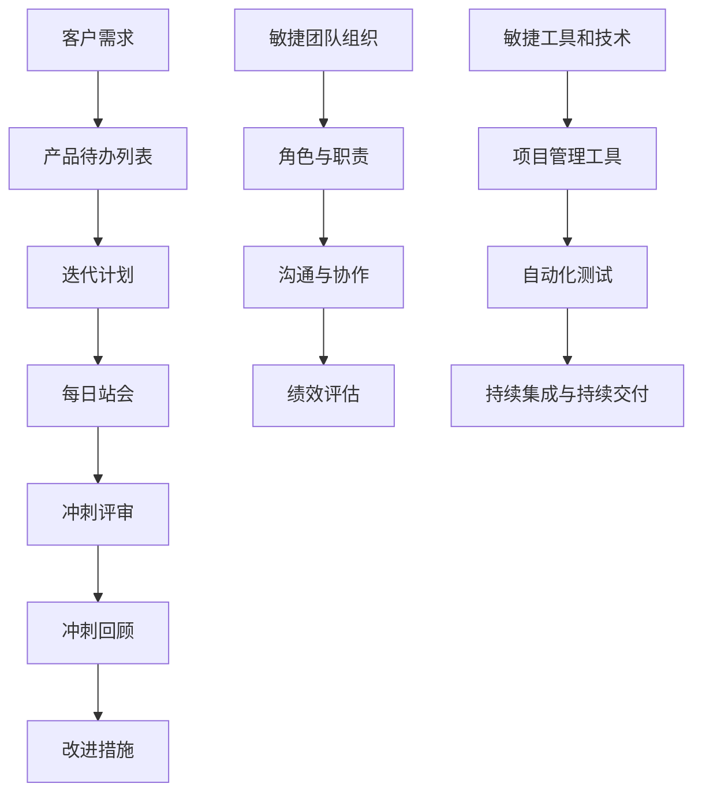

                 

### 敏捷开发在大型项目中的实践

> 关键词：敏捷开发、大型项目、实践、流程、团队组织、工具和技术

> 摘要：本文旨在探讨敏捷开发在大型项目中的应用与实践。通过对敏捷开发的基本概念、流程、团队组织和工具技术的深入分析，结合实际案例分析，旨在为大型项目管理者提供一种高效的开发和管理模式。

### 引言

随着信息技术的发展，大型项目在现代企业中扮演着越来越重要的角色。然而，传统开发模式在应对复杂度和变化迅速的大型项目时，往往显得力不从心。敏捷开发作为一种应对变化和复杂度的开发模式，逐渐受到广泛关注。本文将深入探讨敏捷开发在大型项目中的实践，以期为项目管理者提供有益的参考。

### 第一部分：敏捷开发基础

#### 第1章：敏捷开发概述

##### 1.1 敏捷开发的起源和发展

敏捷开发起源于20世纪90年代末的软件行业，由一群软件开发者共同提出，旨在应对复杂多变的需求和缩短开发周期。其起源可以追溯到2001年发布的《敏捷宣言》，该宣言提出了敏捷开发的核心理念，即“个体和互动重于过程与工具，可工作的软件重于详尽的文档，客户合作重于合同谈判，响应变化重于遵循计划”。

##### 1.2 敏捷开发的核心理念

敏捷开发的核心理念包括以下几个方面：

1. **个体和互动**：强调团队成员的协作和沟通，认为个体和团队的互动是开发成功的关键。
2. **可工作的软件**：重视实际可交付的软件产品，而非详尽的文档。
3. **客户合作**：与客户保持紧密的合作关系，及时响应客户需求变化。
4. **响应变化**：拥抱变化，将变化视为项目成功的关键因素。

##### 1.3 敏捷开发与传统开发模式的对比

传统开发模式（如瀑布模型）通常采用顺序执行的方式，每个阶段必须完成后才能进入下一个阶段。而敏捷开发则采用迭代和增量的方式，每个迭代周期结束后都能交付一个可工作的产品版本。这种模式更灵活，更能够适应需求的变化。

#### 第2章：敏捷开发流程

##### 2.1 敏捷开发方法论

敏捷开发方法论包括Scrum、Kanban、XP（极限编程）等，每种方法论都有其独特的特点和适用场景。本文将以Scrum为例，介绍敏捷开发的基本流程。

1. **产品待办列表**：定义项目的需求，并按优先级排序。
2. **冲刺计划**：根据产品待办列表选择下一个冲刺要完成的工作。
3. **每日站会**：团队成员每天进行简短的会议，讨论进展和问题。
4. **冲刺评审**：在每个冲刺周期结束后，展示可工作的产品版本给客户或利益相关者。
5. **冲刺回顾**：评估本次冲刺的执行情况，讨论改进措施。

##### 2.2 敏捷开发中的迭代和增量开发

敏捷开发采用迭代和增量开发的方式，每个迭代周期都会产生一个可工作的产品版本。这种方式能够快速响应变化，同时确保项目能够逐步完成。

##### 2.3 敏捷开发中的需求管理

敏捷开发强调与客户的紧密合作，需求管理成为敏捷开发中的重要环节。通过持续的需求收集、分析和验证，确保项目始终符合客户需求。

#### 第3章：敏捷团队组织

##### 3.1 敏捷团队的角色和职责

敏捷团队通常由产品负责人（Product Owner）、Scrum Master和开发人员组成。每个角色都有明确的职责，共同协作完成项目。

1. **产品负责人**：负责定义和排序产品需求，确保团队专注于高优先级的工作。
2. **Scrum Master**：负责推动敏捷流程的实施，确保团队专注于工作，并解决团队遇到的障碍。
3. **开发人员**：负责实现产品需求，完成软件开发任务。

##### 3.2 敏捷团队沟通与协作

敏捷团队强调高频率的沟通和协作。通过每日站会、冲刺评审和回顾等会议，团队成员能够及时了解项目进展，解决潜在问题。

##### 3.3 敏捷团队绩效评估

敏捷团队采用基于目标和成果的绩效评估方式，而非基于工时和任务的评估。这种方式能够更好地激励团队成员，提高团队整体效率。

#### 第4章：敏捷工具和技术

##### 4.1 敏捷开发工具概述

敏捷开发工具包括JIRA、Trello、Asana等，用于项目管理、任务追踪和协作。这些工具可以帮助团队更好地管理项目，提高工作效率。

##### 4.2 敏捷开发中的自动化测试

敏捷开发强调自动化测试，通过持续集成和持续交付（CI/CD）流程，确保代码质量和项目进度。

##### 4.3 敏捷开发中的持续集成和持续交付

持续集成（CI）和持续交付（CD）是敏捷开发中的重要环节。通过自动化构建、测试和部署，确保项目始终处于可交付状态。

### 第二部分：敏捷开发在大型项目中的应用

#### 第5章：敏捷开发在大型项目中的挑战

##### 5.1 大型项目的特点

大型项目通常具有以下特点：

1. **项目规模大**：涉及多个模块、多个团队和多个利益相关者。
2. **需求复杂**：需求变更频繁，需求变更对项目影响大。
3. **时间紧迫**：项目交付周期长，时间压力较大。

##### 5.2 敏捷开发在大型项目中的挑战

敏捷开发在大型项目中的应用面临以下挑战：

1. **沟通与协作**：项目规模大，团队成员分散，沟通和协作难度增加。
2. **需求管理**：需求变更频繁，如何确保项目能够灵活应对需求变化。
3. **质量保证**：项目规模大，如何确保代码质量和系统稳定性。

##### 5.3 应对大型项目挑战的策略

针对大型项目的挑战，可以采取以下策略：

1. **加强沟通与协作**：采用视频会议、即时通讯等工具，提高团队沟通效率。
2. **灵活的需求管理**：采用敏捷需求管理方法，快速响应需求变化。
3. **质量保证**：引入自动化测试和持续集成，确保代码质量和系统稳定性。

#### 第6章：敏捷开发在大型项目中的应用案例

##### 6.1 案例一：敏捷开发在软件开发中的应用

在某大型软件开发项目中，团队采用敏捷开发模式，通过迭代和增量开发，成功在短时间内交付了高质量的产品。

##### 6.2 案例二：敏捷开发在项目管理中的应用

在某大型项目管理项目中，团队采用敏捷开发模式，通过灵活的需求管理和高效的沟通协作，成功实现了项目的顺利推进。

##### 6.3 案例三：敏捷开发在跨部门协作中的应用

在某大型跨部门协作项目中，团队采用敏捷开发模式，通过明确的角色分工和高效的沟通协作，实现了跨部门项目的成功交付。

### 第三部分：敏捷开发的度量和方法

#### 第7章：敏捷开发的度量和方法

##### 7.1 敏捷开发中的关键性能指标

敏捷开发中的关键性能指标（KPI）包括：

1. **迭代周期**：每次迭代的时间长度。
2. **任务完成率**：每次迭代内完成的任务比例。
3. **缺陷率**：每次迭代内发现的缺陷数量。

##### 7.2 敏捷开发中的度量方法和工具

敏捷开发中的度量方法包括：

1. **任务板**：用于跟踪任务进展和完成情况的工具。
2. **迭代回顾**：用于评估迭代绩效和改进措施的会议。
3. **敏捷看板**：用于可视化项目进展和团队协作的看板工具。

##### 7.3 敏捷开发中的数据分析和可视化

敏捷开发中的数据分析有助于团队了解项目进展和团队绩效。通过数据可视化，团队可以更直观地了解项目状况，发现潜在问题，并制定改进措施。

### 附录

#### 附录 A：敏捷开发资源推荐

##### A.1 敏捷开发书籍推荐

1. 《敏捷实践指南》
2. 《Scrum敏捷开发》
3. 《敏捷开发：原则、模式与实践》

##### A.2 敏捷开发在线资源和社区

1. 敏捷联盟（Agile Alliance）
2. 敏捷社群（Agile Community）
3. 敏捷开发工具资源库（Agile Tools Repository）

##### A.3 敏捷开发工具和技术推荐

1. JIRA
2. Trello
3. Asana
4. GitLab

### 结束语

敏捷开发在大型项目中的应用已经得到了广泛认可。通过本文的探讨，我们了解了敏捷开发的基本概念、流程、团队组织和工具技术，以及其在大型项目中的挑战和应用案例。希望本文能够为项目管理者提供有益的参考，帮助他们在实际项目中更好地应用敏捷开发模式。

### 附录：敏捷开发核心概念与联系

在敏捷开发中，多个核心概念相互作用，形成一个完整的开发流程。为了更好地理解这些概念之间的关系，我们可以使用Mermaid流程图来展示它们。



### 附录：敏捷开发核心算法原理讲解

在敏捷开发中，算法原理主要涉及迭代和增量开发、自动化测试、持续集成和持续交付等方面。以下使用伪代码详细阐述这些算法原理。

#### 迭代和增量开发

```python
function iterativeDevelopment的需求列表:
    while 需求列表不为空:
        选择最高优先级的需求
        实现需求
        测试需求
        提交需求
        更新产品待办列表
```

#### 自动化测试

```python
function automationTesting(测试用例列表):
    for 测试用例 in 测试用例列表:
        执行测试用例
        记录测试结果
        如果测试失败:
            生成错误报告
```

#### 持续集成与持续交付

```python
function CI_CD(代码库):
    while True:
        从代码库中获取最新代码
        执行自动化测试
        如果测试通过:
            构建软件
            部署软件
        否则:
            回滚代码
            通知开发团队
```

### 附录：数学模型和公式

在敏捷开发中，数学模型和公式主要用于度量方法和项目评估。以下是一些常用的公式。

#### 迭代周期（Cycle Time）

$$ CT = \frac{完成时间}{迭代次数} $$

#### 任务完成率（Task Completion Rate）

$$ CCR = \frac{已完成任务数}{总任务数} $$

#### 缺陷率（Defect Rate）

$$ DR = \frac{发现缺陷数}{代码行数} $$

### 附录：项目实战

#### 开发环境搭建

1. 安装Git：用于版本控制。
2. 安装JIRA：用于项目管理。
3. 安装Maven：用于构建和自动化测试。
4. 安装Docker：用于持续集成和持续交付。

#### 源代码实现和解读

1. **代码实现**：编写一个简单的Web应用程序，实现用户注册、登录和消息推送功能。
2. **代码解读**：分析代码结构，介绍关键模块的功能和实现。

#### 代码应用解读与分析

1. **解读**：通过代码示例，展示如何实现用户注册、登录和消息推送功能。
2. **分析**：讨论代码的优点和改进空间。

#### 实际案例分析

1. **案例背景**：介绍一个实际的大型项目背景，如电子商务平台开发。
2. **案例剖析**：分析项目在敏捷开发模式下的优势和挑战。

#### 项目小结

1. **总结**：回顾项目的关键环节和成果。
2. **反思**：讨论项目的不足之处和改进方向。

### 最佳实践 Tips

1. **持续沟通**：保持团队成员之间的沟通，确保项目顺利进行。
2. **需求管理**：密切关注客户需求变化，及时调整产品待办列表。
3. **自动化测试**：引入自动化测试，提高代码质量和开发效率。

### 小结与注意事项

1. **敏捷开发的核心价值**：强调团队协作、快速响应变化、持续改进。
2. **敏捷开发适用于大型项目**：有助于提高项目质量和效率，降低风险。

### 拓展阅读

1. 《敏捷实践指南》
2. 《Scrum敏捷开发实践》
3. 《大型项目管理：策略、工具和技巧》

### 作者信息

作者：AI天才研究院/AI Genius Institute & 禅与计算机程序设计艺术/Zen And The Art of Computer Programming

### 总结

敏捷开发在大型项目中的应用已得到广泛验证。通过本文的探讨，我们深入了解了敏捷开发的基本概念、流程、团队组织和工具技术，以及其在大型项目中的挑战和应用案例。希望本文能够为项目管理者提供有益的参考，帮助他们更好地实施敏捷开发，提高项目成功率和团队效率。

