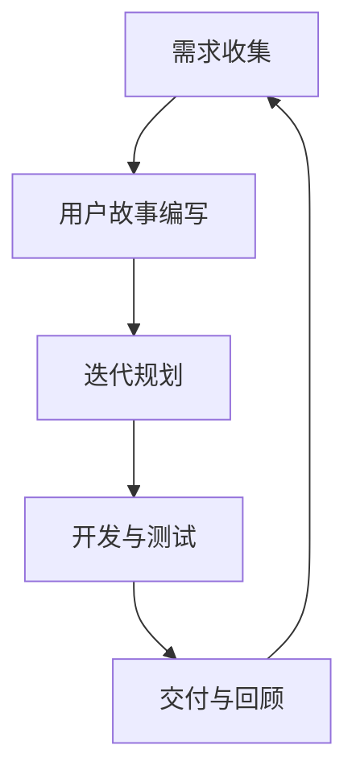
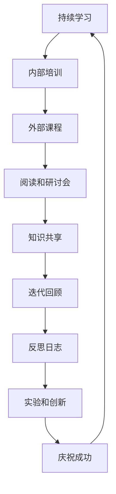

                 

### 文章标题

敏捷开发实践：适应快速变化的开发方法

> 关键词：敏捷开发、Scrum、用户故事、迭代规划、持续集成、持续交付

敏捷开发是一种以人为核心、迭代、增量和适应变化的软件开发方法，旨在通过灵活、高效的流程和团队协作，快速响应市场需求，提高软件质量和开发效率。随着技术的快速发展和市场需求的不断变化，敏捷开发已经成为软件开发的主流方法之一。本文将深入探讨敏捷开发的实践方法，帮助开发者和团队更好地适应快速变化的环境。

## 摘要

本文将从以下几个方面对敏捷开发进行系统阐述：

1. **敏捷开发概述**：介绍敏捷开发的起源、基本概念和核心原则，以及与传统开发方法的区别。
2. **敏捷工具与技术**：介绍用户故事、迭代规划、Scrum框架、看板管理以及持续集成和持续交付等敏捷工具和技术。
3. **敏捷开发在不同场景的应用**：讨论敏捷开发在大型项目、跨部门协作和敏捷转型中的应用策略和实践案例。
4. **敏捷开发实践指南**：提供敏捷开发团队建设、项目管理、持续学习和改进等方面的建议和最佳实践。

通过本文的阅读，读者将能够全面了解敏捷开发的理念和方法，掌握敏捷开发的实践技巧，从而更好地应对快速变化的开发环境。

---

接下来，我们将逐步深入探讨敏捷开发的核心概念、工具和技术，帮助读者理解并掌握这一高效的开发方法。我们将首先从敏捷开发的起源和历史背景开始，逐步展开对敏捷开发核心原则、敏捷工具与技术的详细讲解，并探讨敏捷开发在不同场景下的应用和实践指南。通过这一系列的分析与讨论，读者将能够更好地理解敏捷开发的精髓，并将其应用于实际开发工作中。### 第一部分：敏捷开发概述

#### 第1章：敏捷开发的概念与历史背景

敏捷开发，作为一种软件开发方法论，其核心思想是快速响应变化、持续交付有价值的产品功能。这种开发方法的出现，是对传统瀑布式开发模式的一种反思和改进。

### 1.1 敏捷开发的起源与发展

敏捷开发的起源可以追溯到2001年。当时，软件开发行业面临着越来越多的挑战，如项目延期、预算超支、需求变更频繁等。为了解决这些问题，一些软件开发专家开始探索新的开发方法，最终形成了敏捷开发这一概念。

最早提出敏捷开发理念的文档是《敏捷软件开发宣言》。该宣言由17位软件开发专家共同签署，于2001年1月发布。宣言的核心内容是：

- **个体和互动重于过程与工具**
- **可工作的软件重于详尽的文档**
- **客户协作重于合同谈判**
- **响应变化重于遵循计划**

这一宣言的发布标志着敏捷开发的正式诞生，并迅速在软件开发领域引起了广泛关注。

### 1.2 敏捷宣言与价值观

敏捷宣言的四项原则进一步阐述了敏捷开发的价值观：

1. **个体和互动重于过程与工具**：敏捷开发强调团队协作和个体能力，认为高效沟通和团队合作比遵循固定的过程和工具更为重要。
2. **可工作的软件重于详尽的文档**：敏捷开发认为，能够快速交付并运行的软件比详尽的文档更有价值，因此应将重点放在实现和交付功能上。
3. **客户协作重于合同谈判**：敏捷开发强调与客户的紧密合作，通过持续交流和反馈来确保项目方向和需求的正确性。
4. **响应变化重于遵循计划**：敏捷开发认为，市场需求和项目需求是不断变化的，应具备快速适应变化的能力。

### 1.3 敏捷开发与传统开发方法的区别

敏捷开发与传统开发方法（如瀑布式开发）在多个方面存在显著差异：

1. **开发周期**：敏捷开发采用迭代和增量开发的方式，每个迭代周期（通常为几周）都会交付可工作的软件，而传统开发方法则通常在项目结束前才交付最终产品。
2. **需求变更**：敏捷开发允许并鼓励需求变更，认为需求的变化是不可避免的，而传统开发方法通常在项目初期就确定需求，并尽量避免变更。
3. **团队协作**：敏捷开发强调团队合作和沟通，认为高效的团队协作是成功的关键，而传统开发方法往往更注重个人能力和职责分工。
4. **文档**：敏捷开发倾向于简洁的文档，认为文档应该服务于项目需求，而不是成为负担，而传统开发方法则通常需要详尽的文档来记录项目进展和设计细节。

通过以上对敏捷开发的概念、历史背景和与传统开发方法的区别的探讨，我们可以看到，敏捷开发不仅是一种新的软件开发方法，更是一种思维方式和工作方式的转变。这种转变旨在提高开发效率、增强团队协作和更好地适应市场需求的变化。

#### 第2章：敏捷开发的核心原则与实践

敏捷开发的核心原则和实践是其在软件开发中取得成功的关键因素。这些原则不仅指导开发团队如何高效工作，还帮助团队在不断变化的环境中保持灵活性和适应性。下面，我们将详细探讨敏捷开发的主要原则、敏捷团队的组织结构和敏捷流程。

### 2.1 敏捷开发的主要原则

敏捷开发的核心原则包括以下几个方面：

1. **可工作的软件重于详尽的文档**：敏捷开发认为，软件的实际功能比详尽的文档更为重要。文档应该简洁、清晰，服务于项目的需求，而不是成为工作的负担。

2. **客户合作重于合同谈判**：敏捷开发强调与客户的紧密合作，通过持续交流和反馈来确保项目方向和需求的正确性。这种方式有助于快速响应市场变化和客户需求。

3. **响应变化重于遵循计划**：敏捷开发认为，市场需求和项目需求是不断变化的，因此团队应该具备快速适应变化的能力。这意味着在开发过程中，计划应该保持灵活性，以便根据实际情况进行调整。

4. **持续交付可工作的软件**：敏捷开发强调持续交付可工作的软件，而不是在项目结束前一次性交付。这种方式有助于尽早发现和解决问题，确保软件质量。

5. **迎接变化，而非抗拒**：敏捷开发鼓励团队在面对变化时保持积极态度，通过灵活的流程和协作机制来适应变化。

6. **鼓励持续技术改进和卓越技能**：敏捷开发鼓励团队成员不断学习新技术和提高技能，以保持团队的竞争力。

7. **简洁，而非过度设计**：敏捷开发强调保持工作的简洁性，避免过度设计和复杂化。这种方式有助于提高开发效率，减少浪费。

8. **良好沟通**：敏捷开发强调团队内部的良好沟通，认为这是项目成功的关键。团队成员应保持开放和透明的沟通，以确保信息共享和理解。

9. **团队自我管理**：敏捷开发鼓励团队自我管理，让团队成员共同参与决策，以提高团队凝聚力和责任感。

10. **技术卓越和对工作的热情**：敏捷开发强调技术卓越和对工作的热情，认为这是团队高效工作的动力。

### 2.2 敏捷团队的组织结构

敏捷团队的组织结构通常采用扁平化结构，以促进团队成员之间的沟通和协作。以下是敏捷团队常见的组织结构：

1. **跨职能团队**：敏捷团队通常由不同职能的成员组成，包括开发人员、测试人员、产品经理、设计师等。这种组织方式有助于团队成员相互学习和协作，提高整体效率。

2. **Scrum Master**：Scrum Master是敏捷团队中的重要角色，负责确保团队遵循敏捷原则和流程，帮助团队解决障碍，促进团队成员之间的沟通和协作。

3. **产品负责人**：产品负责人（Product Owner）负责定义产品的愿景和目标，与客户和利益相关者合作，确定产品的需求优先级，确保团队的工作与产品目标保持一致。

4. **团队成员**：团队成员负责具体的开发任务，包括设计和实现产品功能。他们通常拥有多样化的技能，能够在不同的工作角色之间切换。

### 2.3 敏捷流程与实践

敏捷开发采用迭代和增量的方式，每个迭代周期（通常为几周）都会交付可工作的软件。以下是敏捷流程的主要实践：

1. **用户故事**：用户故事是敏捷开发中的核心概念，它以用户的需求和场景为中心，描述了一个具体的功能或任务。用户故事的格式通常是：“作为（用户），我想要（功能），以便（目的）”。

2. **迭代规划**：迭代规划是敏捷流程中的重要环节，团队会在每个迭代开始前进行规划。规划过程包括确定迭代的目标、优先级排序、分配任务和资源等。

3. **每日站立会议**：每日站立会议（Daily Stand-up Meeting）是团队每天早晨举行的短会，每个成员会简要汇报自己的进展、遇到的障碍和计划。这种方式有助于保持团队的高效沟通和协作。

4. **迭代回顾**：迭代回顾是每个迭代结束后进行的会议，团队会回顾本次迭代的成果、发现的问题和改进的机会。迭代回顾有助于持续改进团队的工作流程。

5. **持续集成和持续交付**：持续集成（Continuous Integration）和持续交付（Continuous Delivery）是敏捷开发中的重要实践。持续集成通过频繁的代码集成和测试，确保代码库的质量和稳定性。持续交付则确保软件能够快速、可靠地交付给客户。

6. **看板管理**：看板管理是一种可视化管理工具，它通过展示工作流程和任务状态，帮助团队更好地理解工作流程和优化工作流程。

7. **敏捷转型**：许多组织在引入敏捷开发时，需要进行敏捷转型。敏捷转型包括组织文化的变革、流程的改进和团队的重组等。成功的敏捷转型需要领导层的支持和全员的参与。

通过以上对敏捷开发核心原则、敏捷团队组织结构和敏捷流程的详细探讨，我们可以看到，敏捷开发不仅是一种软件开发方法，更是一种团队协作和工作方式的变革。通过灵活的流程、高效的团队协作和持续改进，敏捷开发能够帮助团队更好地适应快速变化的环境，提高软件质量和开发效率。

#### 第3章：敏捷工具与技术

敏捷开发的成功离不开一系列工具和技术的支持。这些工具和技术不仅提高了开发效率，还帮助团队更好地理解和执行敏捷原则。在本章中，我们将详细探讨用户故事、迭代规划、Scrum框架、看板管理以及持续集成和持续交付等敏捷工具和技术。

### 3.1 用户故事与迭代规划

用户故事是敏捷开发中的核心概念，它是围绕用户需求编写的简短描述，通常采用如下格式：“作为[某个用户]，我想[做某事]，以便[达到某个目的]”。用户故事具有以下特点：

1. **具体和明确**：用户故事应该具体描述用户的需求和场景，以便开发团队能够清晰地理解。
2. **可测试**：用户故事应该能够通过测试来验证其实现情况，这有助于确保交付的软件符合用户需求。
3. **可估算**：用户故事应该能够进行估算，以确定其在开发计划中的优先级和资源分配。

用户故事的编写是一个团队协作的过程，通常由产品负责人（Product Owner）负责编写和整理，开发团队则参与讨论和确认。

迭代规划是敏捷开发中的关键环节，它通常在迭代开始前进行。迭代规划包括以下步骤：

1. **需求筛选**：产品负责人根据用户故事和需求优先级，筛选出本次迭代要实现的功能。
2. **任务分配**：开发团队根据筛选出的用户故事，分配任务和资源，并制定详细的开发计划。
3. **风险评估**：团队评估可能遇到的风险和问题，并制定相应的应对策略。
4. **评审和确认**：产品负责人和团队一起评审和确认迭代计划，确保计划的可执行性。

在迭代规划过程中，团队通常会使用看板（Kanban）或任务跟踪工具（如JIRA）来管理任务和跟踪进度。

### 3.2 Scrum框架

Scrum是一种流行的敏捷开发框架，它提供了一套明确的角色、会议和流程，帮助团队高效地管理项目和迭代。以下是Scrum框架的核心组成部分：

1. **角色**：
   - 产品负责人（Product Owner）：负责定义产品的愿景和目标，管理用户故事和需求优先级。
   - Scrum Master：负责确保团队遵循Scrum原则和流程，帮助团队解决障碍，促进沟通和协作。
   - 团队成员：负责实现用户故事和任务。

2. **会议**：
   - 每日站立会议（Daily Stand-up）：团队成员每天早晨举行短会，汇报进展、问题和计划。
   - 迭代评审会议（Sprint Review）：团队在迭代结束时展示已完成的用户故事，收集反馈，并规划下一个迭代。
   - 迭代回顾会议（Sprint Retrospective）：团队回顾本次迭代，分析成功和失败，讨论改进措施。

3. **流程**：
   - 迭代（Sprint）：Scrum采用迭代方式进行开发，每个迭代周期通常为几周。团队在每个迭代结束时交付可工作的软件。
   - 用户故事：用户故事是迭代的核心任务，团队根据用户故事进行任务分配和进度跟踪。
   - 看板（Kanban）：看板是一种可视化工具，用于展示用户故事的进度和状态，帮助团队更好地管理任务和流程。

### 3.3 看板管理

看板管理（Kanban）是一种基于可视化原则的工作管理方法，它通过展示工作流程和任务状态，帮助团队优化工作流程和提升效率。以下是看板管理的基本组件：

1. **看板板面**：看板板面通常分为几个阶段，如“待办”、“进行中”、“测试”、“待发布”等，每个阶段代表任务的流程状态。
2. **卡片**：每个任务用一张卡片表示，卡片上包含任务描述、优先级、负责人等信息。
3. **拉取系统**：团队根据当前阶段的工作量，按照优先级顺序拉取任务，确保任务有序进行。

看板管理的核心原则是限制在流程中同时进行的工作量（即“工作在进度”），以减少任务积压和依赖关系，提高工作效率。

### 3.4 持续集成与持续交付

持续集成（Continuous Integration，CI）和持续交付（Continuous Delivery，CD）是敏捷开发中的关键实践，它们通过自动化流程和频繁的代码集成，确保软件质量和交付效率。

持续集成是指团队频繁地将代码集成到主干分支，并通过自动化测试确保代码库的稳定性和一致性。持续集成的核心步骤包括：

1. **代码提交**：开发人员将代码提交到版本控制系统。
2. **集成和构建**：集成服务器自动构建代码，执行测试。
3. **反馈**：测试结果和反馈自动通知相关人员，以便及时处理问题。

持续交付是指通过自动化流程，确保软件能够快速、可靠地交付给客户。持续交付的核心步骤包括：

1. **测试和部署**：在集成测试通过后，软件自动部署到测试环境。
2. **自动化测试**：在测试环境中执行自动化测试，确保软件质量。
3. **发布**：测试通过后，软件自动部署到生产环境，并通知相关人员。

持续集成和持续交付不仅提高了软件质量和交付效率，还减少了手动操作的错误，降低了项目风险。

### 3.5 敏捷工具和技术应用

在实际应用中，敏捷工具和技术需要根据项目特点和团队需求进行选择和调整。以下是一些常见的应用场景：

1. **项目启动**：在项目启动阶段，团队可以使用看板管理用户故事和任务，明确项目目标和优先级。
2. **开发阶段**：在开发阶段，团队可以使用Scrum框架进行迭代管理，每日站立会议确保团队沟通和进度跟踪。
3. **测试阶段**：在测试阶段，团队可以使用自动化测试工具进行测试，确保软件质量和稳定性。
4. **部署阶段**：在部署阶段，团队可以使用持续集成和持续交付流程，确保软件快速、可靠地交付给客户。

通过以上对敏捷工具和技术的详细探讨，我们可以看到，这些工具和技术为敏捷开发提供了强大的支持，帮助团队更好地实现敏捷原则，提高开发效率和软件质量。在实际应用中，团队应根据项目特点和需求，灵活选择和组合这些工具和技术，以实现最佳效果。

#### 第4章：敏捷开发在不同场景的应用

敏捷开发不仅仅适用于小规模、快速迭代的项目，它也可以在大规模项目、跨部门协作和敏捷转型等复杂场景中发挥作用。本章将深入探讨敏捷开发在这些场景中的应用策略和实践案例。

### 4.1 敏捷在大型项目中的应用

在大型项目中，敏捷开发的应用面临一些独特的挑战，如项目规模大、利益相关者众多、需求变更频繁等。为了应对这些挑战，以下是一些有效的敏捷应用策略：

1. **模块化开发**：将大型项目划分为多个模块，每个模块可以独立开发和管理。这种方式有助于降低复杂度，提高开发效率。

2. **分布式团队协作**：在大型项目中，团队成员可能分布在不同的地理位置。通过使用视频会议、即时通讯和项目管理工具，团队可以保持高效沟通和协作。

3. **持续集成和持续交付**：在大型项目中，持续集成和持续交付可以确保代码库的稳定性和一致性，减少集成和部署过程中的错误。

4. **敏捷测试**：在大型项目中，敏捷测试可以确保每个模块的质量和稳定性，及时发现和解决问题。

**案例研究**：某金融机构在开发一个大型金融交易平台时采用了敏捷开发。项目分为多个阶段，每个阶段都是一个独立的模块。团队使用Scrum框架进行迭代管理，通过每日站立会议和迭代评审会议保持沟通和进度跟踪。项目成功交付，并在市场上获得了良好的反响。

### 4.2 敏捷在跨部门协作中的应用

在跨部门协作中，敏捷开发可以帮助团队更好地协调资源和任务，提高整体效率。以下是一些有效的敏捷应用策略：

1. **明确角色和责任**：在跨部门协作中，明确每个部门和团队成员的角色和责任，确保任务分配清晰。

2. **需求优先级排序**：跨部门协作中的需求可能来自多个部门，因此需要根据优先级进行排序，确保关键需求得到优先处理。

3. **跨部门沟通**：建立跨部门的沟通机制，如定期会议、即时通讯等，确保信息共享和任务协调。

4. **敏捷工具和平台**：使用敏捷工具和平台（如JIRA、Confluence）来管理任务和项目进度，提高协作效率。

**案例研究**：某大型企业的研发部门与市场部门合作开发一个新产品。团队采用Scrum框架，明确研发和市场部门的角色和责任。通过每日站立会议和迭代评审会议，团队保持沟通和协作，确保项目按计划推进。最终，新产品成功上市，并获得了市场的高度评价。

### 4.3 敏捷在敏捷转型中的应用

敏捷转型是指组织在文化、流程、团队等方面进行变革，以实现敏捷开发的理念和实践。以下是一些有效的敏捷转型策略：

1. **领导层支持**：敏捷转型需要领导层的支持和推动，领导层应该明确表达对敏捷转型的承诺，并积极参与转型过程。

2. **培训和教育**：为团队成员提供敏捷培训和指导，帮助他们理解和掌握敏捷原则和实践。

3. **试点项目**：在组织内部选择一些项目进行敏捷试点，通过实践验证敏捷转型的方法和效果。

4. **持续改进**：在敏捷转型过程中，持续收集反馈和改进措施，不断优化流程和团队协作。

**案例研究**：某全球知名技术公司进行了大规模的敏捷转型。公司首先在部分团队中试点敏捷开发，成功后逐步推广到整个组织。领导层积极参与转型过程，为团队成员提供培训和支持。通过持续改进和反馈，公司成功地实现了敏捷转型，提高了开发效率和市场响应速度。

通过以上对敏捷开发在不同场景应用策略和实践案例的探讨，我们可以看到，敏捷开发不仅适用于小型项目，也可以在大规模项目、跨部门协作和敏捷转型等复杂场景中发挥重要作用。通过灵活应用敏捷原则和工具，团队可以更好地适应快速变化的环境，提高开发效率和软件质量。

#### 第5章：敏捷开发实践指南

敏捷开发是一种以人为核心、迭代、增量和适应变化的软件开发方法。为了确保敏捷开发的顺利实施，团队需要遵循一系列最佳实践和指南。本章将提供敏捷开发实践指南，涵盖敏捷团队建设、项目管理、持续学习和改进等方面。

### 5.1 敏捷开发团队建设

成功的敏捷开发离不开一个高效的团队。以下是构建敏捷团队的几个关键要素：

1. **跨职能团队**：敏捷团队通常由来自不同职能领域的成员组成，包括开发人员、测试人员、产品经理、设计师等。这种组织方式有助于团队协作和问题解决。

2. **明确角色和责任**：在敏捷团队中，每个成员的角色和责任应该明确。常见的角色包括Scrum Master、产品负责人和团队成员。Scrum Master负责确保团队遵循敏捷原则和流程，产品负责人负责管理用户故事和需求优先级，团队成员则负责实现用户故事。

3. **团队自治**：敏捷团队应该具备一定程度的自治，允许成员参与决策和任务分配。这种自治有助于提高团队凝聚力和责任感。

4. **持续沟通**：敏捷团队需要保持持续沟通，确保信息共享和任务协调。每日站立会议、迭代评审会议和迭代回顾会议是团队沟通的重要渠道。

5. **培训和发展**：为团队成员提供敏捷开发和相关技能的培训，帮助他们更好地理解和应用敏捷原则和实践。

### 5.2 敏捷项目管理

敏捷项目管理与传统项目管理存在显著差异，更加注重灵活性和适应性。以下是敏捷项目管理的几个关键要素：

1. **迭代和增量开发**：敏捷项目通常采用迭代和增量开发的方式，每个迭代周期都会交付可工作的软件。这种方式有助于快速响应变化和持续交付价值。

2. **用户故事管理**：用户故事是敏捷开发中的核心任务，产品负责人需要负责编写、整理和优先级排序用户故事。用户故事应该具有可测试性、可估算性和明确的目标。

3. **任务跟踪和进度管理**：使用敏捷工具和平台（如JIRA、Trello）来跟踪任务进度和项目状态。看板（Kanban）和Scrum板是常用的可视化工具。

4. **风险管理**：在敏捷项目管理中，风险管理是一个持续的过程。团队应定期评估风险，并制定相应的应对策略。

5. **客户合作**：与客户保持紧密合作，通过迭代评审会议和用户反馈来确保项目方向和需求的正确性。

### 5.3 持续学习和改进

敏捷开发强调持续学习和改进，以不断提高团队和组织的效率。以下是几个关键要素：

1. **迭代回顾**：在每次迭代结束时，团队应进行迭代回顾会议，分析成功和失败，讨论改进机会。

2. **反馈机制**：建立有效的反馈机制，鼓励团队成员分享经验和意见，不断优化流程和协作方式。

3. **知识共享**：鼓励团队成员分享知识和经验，通过内部培训、文档和会议等方式，提高团队的整体能力。

4. **实验和创新**：鼓励团队进行实验和创新，尝试新的工具和技术，以发现更高效的解决方案。

5. **持续改进**：将改进措施纳入下一个迭代，确保持续改进的持续进行。

通过以上敏捷开发实践指南，团队可以更好地实施敏捷开发，提高开发效率、软件质量和客户满意度。敏捷开发不仅是一种软件开发方法，更是一种团队协作和工作方式的变革。通过持续学习和改进，团队可以不断适应变化，应对复杂的项目挑战，实现长期的可持续发展。

### 总结

通过本文的深入探讨，我们全面了解了敏捷开发的核心概念、工具和技术，以及其在不同场景中的应用策略和实践指南。敏捷开发以其快速响应变化、高效团队协作和持续改进的特点，成为软件开发的主流方法。以下是本文的关键要点总结：

1. **敏捷开发概述**：敏捷开发起源于2001年的敏捷宣言，强调个体和互动、可工作的软件、客户合作和响应变化。
2. **核心原则与实践**：敏捷开发的核心原则包括用户故事、迭代规划、Scrum框架、看板管理以及持续集成和持续交付等。
3. **敏捷工具与技术**：用户故事、迭代规划、Scrum框架、看板管理、持续集成和持续交付是敏捷开发的关键工具和技术。
4. **敏捷在不同场景的应用**：敏捷开发在大规模项目、跨部门协作和敏捷转型中展现出强大的适应性和效率。
5. **敏捷开发实践指南**：敏捷团队建设、项目管理、持续学习和改进是确保敏捷开发成功实施的关键。

敏捷开发不仅是一种软件开发方法，更是一种团队协作和工作方式的变革。通过灵活应用敏捷原则和工具，团队可以更好地适应快速变化的环境，提高开发效率和软件质量。本文的探讨为我们提供了全面的敏捷开发实践指南，期望读者能够在实际工作中运用这些知识，实现高效的软件开发。

### 附录

#### 附录A：敏捷开发资源与工具

敏捷开发涉及多个工具和资源，以下是一些常用的敏捷开发工具和资源推荐：

1. **敏捷开发工具**：
   - **JIRA**：一款功能强大的敏捷项目管理工具，支持用户故事管理、任务跟踪、迭代规划和报告生成。
   - **Trello**：一款简洁易用的看板管理工具，适用于任务跟踪和团队协作。
   - **Confluence**：一款文档协作平台，用于编写和分享文档，支持版本控制和协同编辑。
   - **GitLab**：一款开源的持续集成和持续交付平台，支持代码托管、自动化测试和持续交付。

2. **敏捷开发书籍**：
   - 《敏捷软件开发：原则、实践与模式》
   - 《Scrum精髓：实战指南与清单》
   - 《敏捷项目管理：创建高效团队》

3. **敏捷社区与资源**：
   - **Scrum联盟（Scrum Alliance）**：全球最大的Scrum社区，提供认证课程和资源。
   - **敏捷实践指南（Agile Practices Guide）**：提供敏捷开发的最佳实践和案例研究。
   - **敏捷开发博客（Agile Blog）**：分享敏捷开发的最新动态和实践经验。

通过使用这些工具和资源，开发团队可以更好地理解和应用敏捷开发方法，提高开发效率和软件质量。

### 注意事项

1. **团队协作**：敏捷开发强调团队合作，团队成员应保持开放和透明的沟通，确保信息共享和理解。
2. **持续改进**：敏捷开发是一个持续改进的过程，团队应定期进行迭代回顾，分析成功和失败，不断优化流程和协作方式。
3. **用户故事管理**：用户故事是敏捷开发的核心任务，编写和管理用户故事时，应确保其具有可测试性、可估算性和明确的目标。
4. **客户合作**：与客户保持紧密合作，通过迭代评审会议和用户反馈来确保项目方向和需求的正确性。

### 拓展阅读

1. 《敏捷开发实践指南》
2. 《Scrum精髓：实战指南与清单》
3. 《敏捷项目管理：创建高效团队》

通过拓展阅读，读者可以深入了解敏捷开发的细节和实践，进一步提升敏捷开发技能和团队效率。

---

### 结语

本文《敏捷开发实践：适应快速变化的开发方法》系统地介绍了敏捷开发的核心概念、工具和技术，以及在不同场景中的应用策略和实践指南。通过本文的阅读，读者应能够全面理解敏捷开发的精髓，并掌握其在实际开发中的应用方法。

敏捷开发不仅是一种软件开发方法，更是一种团队协作和工作方式的变革。它通过灵活、高效的流程和团队协作，帮助团队快速响应变化，提高开发效率和软件质量。

在敏捷开发的道路上，持续学习和改进是关键。希望读者能够将本文的知识应用于实际工作中，不断提升团队协作能力和软件开发效率。

感谢您的阅读，期待与您在敏捷开发的道路上共同成长。作者：AI天才研究院/AI Genius Institute & 禅与计算机程序设计艺术 /Zen And The Art of Computer Programming

---

# 附录

## 附录A：敏捷开发资源与工具

敏捷开发涉及多个工具和资源，以下是一些常用的敏捷开发工具和资源推荐：

1. **敏捷开发工具**：
   - **JIRA**：一款功能强大的敏捷项目管理工具，支持用户故事管理、任务跟踪、迭代规划和报告生成。
     - **特点**：高度灵活、强大的报告和分析功能、与持续集成工具紧密集成。
     - **使用场景**：适用于大型项目和复杂需求管理。
   - **Trello**：一款简洁易用的看板管理工具，适用于任务跟踪和团队协作。
     - **特点**：直观的界面、易于自定义、支持多种协作方式。
     - **使用场景**：适用于小型团队和简单任务管理。
   - **Confluence**：一款文档协作平台，用于编写和分享文档，支持版本控制和协同编辑。
     - **特点**：强大的文档编辑功能、良好的集成能力、支持多种文件格式。
     - **使用场景**：适用于知识管理和文档协作。
   - **GitLab**：一款开源的持续集成和持续交付平台，支持代码托管、自动化测试和持续交付。
     - **特点**：开源、功能全面、社区支持强大。
     - **使用场景**：适用于持续集成和持续交付流程。

2. **敏捷开发书籍**：
   - 《敏捷软件开发：原则、实践与模式》
     - **作者**：Michael C. Feathers
     - **内容**：详细介绍了敏捷开发的核心理念、实践和模式，适合初学者和专业人士。
   - 《Scrum精髓：实战指南与清单》
     - **作者**：Jeff Sutherland
     - **内容**：深入讲解了Scrum框架的原理和实践，提供了丰富的案例和工具。
   - 《敏捷项目管理：创建高效团队》
     - **作者**：Michael C. Jackson
     - **内容**：介绍了敏捷项目管理的核心原则和方法，强调了团队协作和持续改进的重要性。

3. **敏捷社区与资源**：
   - **Scrum联盟（Scrum Alliance）**：全球最大的Scrum社区，提供认证课程和资源。
     - **特点**：丰富的课程、认证考试和社区交流。
     - **网址**：[Scrum Alliance](https://www.scrumalliance.org/)
   - **敏捷实践指南（Agile Practices Guide）**：提供敏捷开发的最佳实践和案例研究。
     - **特点**：详细的案例、实用的技巧和最佳实践。
     - **网址**：[Agile Practices Guide](https://www.agilepracticesguide.com/)
   - **敏捷开发博客（Agile Blog）**：分享敏捷开发的最新动态和实践经验。
     - **特点**：最新的敏捷开发资讯、深入的案例分析。
     - **网址**：[Agile Blog](https://agileblog.com/)

通过使用这些工具和资源，开发团队可以更好地理解和应用敏捷开发方法，提高开发效率和软件质量。以下是一个基于Mermaid的流程图，展示了敏捷开发的核心流程：



该流程图描述了从需求收集到用户故事编写、迭代规划、开发与测试、交付与回顾的整个过程，体现了敏捷开发的迭代和增量特性。

在敏捷开发中，数学模型和公式也有其应用。例如，在Scrum中，迭代规划过程中可以使用估算公式来计算任务所需的工作量，从而更好地分配资源。以下是一个简单的伪代码示例，用于描述迭代规划和回顾过程：

```java
// 迭代规划伪代码
IterationPlanning() {
    UserStories = collectUserStories();
    PrioritizedUserStories = prioritizeUserStories(UserStories);
    SprintLength = defineSprintLength();
    SprintBacklog = createSprintBacklog(PrioritizedUserStories, SprintLength);
    ReviewSprintBacklog(SprintBacklog);
}

// 迭代回顾伪代码
IterationReview() {
    CompletedUserStories = getCompletedUserStories();
    ReviewMeeting = scheduleReviewMeeting();
    LessonsLearned = identifyLessons Learned(CompletedUserStories);
    UpdateProcessBasedOnLessonsLearned(LessonsLearned);
}
```

通过这些工具、资源、流程图和伪代码示例，读者可以更好地理解敏捷开发的核心概念和实施方法，从而在实际项目中取得成功。

## 附录B：敏捷开发中的持续学习和改进

在敏捷开发中，持续学习和改进是团队成功的关键因素。这一部分将讨论如何通过持续学习、改进实践和知识共享，提升团队的整体能力。

### 5.4 敏捷开发中的持续学习

敏捷团队需要不断学习新技能和知识，以适应快速变化的技术环境。以下是一些持续学习的策略：

1. **内部培训**：组织定期的内部培训，帮助团队成员了解最新的敏捷开发工具、技术和方法。
2. **外部课程和认证**：鼓励团队成员参加专业的敏捷开发课程和认证，如Scrum Master认证和产品负责人认证。
3. **在线学习平台**：利用在线学习平台，如Coursera、Udemy等，学习敏捷开发相关的课程和资源。
4. **阅读和研讨会**：定期组织阅读会和研讨会，分享最新的敏捷开发书籍和文章，讨论敏捷实践中的挑战和解决方案。

### 5.5 敏捷开发中的改进实践

改进实践是敏捷开发的核心原则之一。以下是一些常用的改进方法：

1. **迭代回顾**：在每个迭代结束时，团队应进行回顾会议，分析成功的经验、失败的原因和改进的机会。
2. **反思日志**：团队成员应定期记录反思日志，总结工作中的得失，并提出改进建议。
3. **实验和创新**：鼓励团队进行实验和创新，尝试新的工具和技术，以发现更高效的解决方案。
4. **持续反馈机制**：建立有效的反馈机制，鼓励团队成员分享经验和意见，促进知识的共享和流程的优化。

### 5.6 知识共享和文化建设

知识共享和文化建设是敏捷团队成功的关键。以下是一些促进知识共享和文化建设的策略：

1. **文档和知识库**：创建和维护敏捷开发的知识库，记录最佳实践、工具使用方法和常见问题的解决方案。
2. **信息共享会议**：定期举行信息共享会议，让团队成员分享他们的经验和见解。
3. **开放办公环境**：鼓励团队成员在开放办公环境中交流，促进知识的自由流动。
4. **庆祝成功**：庆祝团队和个人的成功，增强团队凝聚力和归属感。

通过持续学习、改进实践和知识共享，敏捷团队能够不断提高其能力和效率，更好地应对快速变化的环境。以下是一个Mermaid流程图，展示了敏捷开发中的持续学习和改进过程：



该流程图描述了从持续学习到知识共享、迭代回顾、反思日志、实验和创新，再到庆祝成功的整个循环，体现了敏捷开发中持续学习和改进的核心思想。

## 附录C：常见问题和挑战

在实施敏捷开发过程中，团队可能会遇到各种问题和挑战。以下是一些常见的问题和挑战，以及相应的解决方案：

1. **沟通障碍**：敏捷开发强调团队协作，但团队成员可能位于不同的地理位置，沟通变得复杂。
   - **解决方案**：使用视频会议、即时通讯工具和项目管理平台，确保团队保持实时沟通和协作。

2. **需求变更**：敏捷开发允许需求变更，但频繁的变更可能导致项目范围扩大和进度延误。
   - **解决方案**：与客户和利益相关者保持紧密合作，确保需求的优先级排序明确，并在迭代规划中适当预留变更缓冲时间。

3. **团队阻力**：团队成员可能对敏捷开发的方法和流程不熟悉，导致执行不力。
   - **解决方案**：提供定期的培训和指导，帮助团队成员理解和掌握敏捷开发的原理和实践。

4. **工具选择**：选择适合团队需求的敏捷开发工具和平台可能是一个挑战。
   - **解决方案**：评估团队的具体需求和预算，选择功能强大且易于使用的工具，并提供相应的培训和文档。

通过了解和解决这些常见问题和挑战，团队可以更好地实施敏捷开发，提高开发效率和软件质量。

## 附录D：项目实战

以下是一个敏捷开发项目实战的案例，介绍项目背景、开发环境搭建、源代码实现、代码解读和项目小结。

### 项目背景

某电子商务公司计划开发一款移动应用，提供商品浏览、购物车管理和订单支付等功能。公司希望采用敏捷开发方法，快速响应市场需求，并确保高质量的交付。

### 开发环境搭建

- **开发语言**：选择Java作为主要开发语言，因其稳定性和成熟度。
- **开发框架**：使用Spring Boot框架，简化后端开发过程。
- **前端框架**：选择React，提高前端开发效率和用户体验。
- **数据库**：使用MySQL作为后端数据库，保证数据存储的稳定性和可靠性。

### 源代码实现

以下是项目的核心模块代码示例：

#### 后端代码示例（Spring Boot）

```java
// UserController.java
@RestController
@RequestMapping("/api/user")
public class UserController {
    @Autowired
    private UserService userService;

    @PostMapping("/login")
    public ResponseEntity<?> login(@RequestBody LoginRequest request) {
        // 登录逻辑实现
    }

    @PostMapping("/register")
    public ResponseEntity<?> register(@RequestBody RegisterRequest request) {
        // 注册逻辑实现
    }
}
```

#### 前端代码示例（React）

```jsx
// UserComponent.js
import React, { useState } from 'react';
import axios from 'axios';

const UserComponent = () => {
    const [username, setUsername] = useState('');
    const [password, setPassword] = useState('');

    const handleLogin = async () => {
        try {
            const response = await axios.post('/api/user/login', { username, password });
            // 登录成功处理
        } catch (error) {
            // 登录失败处理
        }
    };

    return (
        <div>
            <input type="text" value={username} onChange={e => setUsername(e.target.value)} />
            <input type="password" value={password} onChange={e => setPassword(e.target.value)} />
            <button onClick={handleLogin}>登录</button>
        </div>
    );
};

export default UserComponent;
```

### 代码解读

后端代码示例实现了用户登录和注册的功能。前端代码示例通过React组件实现用户界面的展示和表单处理，并与后端API进行交互。

### 项目小结

通过敏捷开发方法，项目团队在短时间内实现了移动应用的核心功能，并在每个迭代周期中持续改进和优化。项目采用持续集成和持续交付流程，确保代码质量和交付效率。最终，移动应用成功上线，用户满意度较高，为公司带来了良好的市场反响。

### 最佳实践 Tips

1. **明确需求优先级**：在项目开始前，与客户和利益相关者明确需求优先级，确保关键功能优先实现。
2. **持续集成和测试**：使用自动化测试工具进行持续集成，确保代码库的稳定性和一致性。
3. **团队协作**：定期举行站立会议和回顾会议，确保团队成员之间的沟通和协作。
4. **知识共享**：鼓励团队成员分享经验和知识，提高团队整体能力。

通过遵循这些最佳实践，团队可以更有效地实施敏捷开发，提高项目成功率和客户满意度。

通过以上项目实战案例，读者可以更好地理解敏捷开发在实际项目中的应用方法和实践技巧。希望这一案例能够为读者在实际工作中提供指导和启示。

## 附录E：拓展阅读

为了帮助读者进一步深入了解敏捷开发的原理和实践，本附录推荐了一系列相关的书籍、在线课程和社区资源。

### 书籍推荐

1. **《敏捷实践指南》**（作者：Michael C. Jackson）
   - 这本书详细介绍了敏捷开发的方法、原则和实践，适合初学者和有经验的开发者。

2. **《Scrum精髓：实战指南与清单》**（作者：Jeff Sutherland）
   - 这本书是Scrum框架的权威指南，内容涵盖了Scrum的原理、实践和工具。

3. **《用户故事映射：发现未满足的需求》**（作者：Jeff Patton）
   - 本书深入探讨了用户故事映射的概念和应用，有助于更好地理解和设计用户需求。

### 在线课程推荐

1. **Scrum联盟（Scrum Alliance）**：[https://www.scrumalliance.org/learn/agile-and-scrum-courses](https://www.scrumalliance.org/learn/agile-and-scrum-courses)
   - 提供各种敏捷和Scrum认证课程，包括基础课程和高级课程。

2. **Coursera**：[https://www.coursera.org/courses?query=agile%20development](https://www.coursera.org/courses?query=agile%20development)
   - 提供多门关于敏捷开发和项目管理的高质量在线课程。

3. **Udemy**：[https://www.udemy.com/courses/agile-project-management/](https://www.udemy.com/courses/agile-project-management/)
   - 提供丰富的敏捷开发和项目管理相关课程，包括基础和进阶课程。

### 社区资源推荐

1. **敏捷实践指南（Agile Practices Guide）**：[https://www.agilepracticesguide.com/](https://www.agilepracticesguide.com/)
   - 提供敏捷开发的最佳实践、案例研究和工具资源。

2. **敏捷开发博客（Agile Blog）**：[https://agileblog.com/](https://agileblog.com/)
   - 分享敏捷开发的最新动态、案例分析和技术文章。

3. **LinkedIn学习（LinkedIn Learning）**：[https://www.linkedin.com/learning/](https://www.linkedin.com/learning/)
   - 提供专业的敏捷开发和项目管理课程，涵盖从基础到高级的内容。

通过阅读这些书籍、参加在线课程和使用社区资源，读者可以系统地学习和掌握敏捷开发的原理和实践，为实际工作打下坚实的基础。希望这些资源能够帮助读者在敏捷开发的道路上不断进步和成长。

