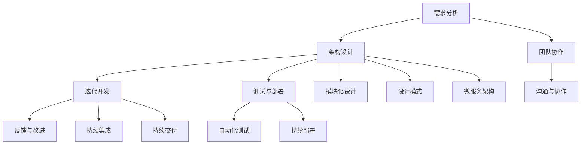

                 

### 文章标题

# 敏捷架构：在快速迭代中保持架构完整性

### 关键词

- 敏捷架构
- 快速迭代
- 架构完整性
- 持续集成
- 设计模式
- 项目管理

### 摘要

本文探讨了敏捷架构在快速迭代开发过程中的重要性及其实现方法。首先，我们介绍了敏捷架构的定义和核心原则，然后详细讲解了敏捷架构的设计流程和方法，以及其与核心工具和技术的结合。接着，文章分析了敏捷架构在项目管理中的实践，并通过实际应用案例展示了敏捷架构的具体实施过程。最后，我们对敏捷架构的未来趋势进行了展望，并给出了敏捷架构实践的最佳指南。通过本文，读者将深入了解敏捷架构的核心原理和实践方法，为实际项目开发提供有力支持。

### 设计目录大纲的步骤

设计一个完整、逻辑清晰的目录大纲是撰写高质量技术博客的重要步骤。以下是一系列详细的步骤，帮助读者构建出结构紧凑、内容丰富的文章目录：

#### 第一步：理解书名和主题

- **明确书名和主题**：首先要深入理解书名和主题，例如《敏捷架构：在快速迭代中保持架构完整性》。书名传达了两个关键信息：一是关注敏捷架构，二是强调在快速迭代中保持架构完整性。

- **核心概念梳理**：接下来，思考书中的核心概念，如敏捷架构的定义、特点、原则、方法和工具等。这将有助于我们后续构建章节结构。

#### 第二步：确定核心概念与联系

- **核心概念筛选**：在梳理核心概念后，筛选出最具代表性和关联性的概念，这些将成为我们构建章节结构的基础。

- **概念关系分析**：分析这些核心概念之间的联系，思考它们如何相互作用，以及在一个整体中如何组成一个连贯的故事。

#### 第三步：规划章节结构

- **初步章节规划**：根据核心概念和主题，初步规划出大致的章节结构。每个章节应该覆盖一个主要主题，如“敏捷架构概述”、“敏捷架构的流程和方法”等。

- **章节细化**：在初步规划的基础上，细化每个章节的内容，考虑每个章节可能包含的子章节和小节。

#### 第四步：编写伪代码与数学模型

- **核心算法解释**：对于书中的核心算法和数学模型，准备相应的伪代码，帮助读者理解其工作原理。

- **数学模型展示**：确保数学模型和公式的解释清晰，并准备相应的例子来说明。

#### 第五步：整合项目实战

- **实战案例设计**：设计章节，包括实际的项目实战，展示如何将敏捷架构应用于实际开发中。

- **代码案例准备**：准备详细的代码案例，并解释代码实现和解读。

#### 第六步：编写目录大纲

- **使用markdown格式**：使用markdown格式，按照1级、2级、3级目录的结构，将整个书的大纲组织起来。

- **完整性检查**：最后，检查目录大纲是否覆盖了所有核心主题，是否有必要的深度和广度。

#### 第七步：优化字数

- **调整内容**：根据字数要求，调整每个章节的内容，确保总字数在规定范围内。

通过以上步骤，我们可以设计出一份完整、逻辑清晰的目录大纲，为撰写高质量的技术博客奠定坚实基础。接下来，我们将按照这个大纲逐步展开，详细介绍敏捷架构的核心概念、流程和方法，以及其实际应用案例。

### 第一部分：敏捷架构概述

#### 敏捷架构的定义与起源

敏捷架构（Agile Architecture）起源于敏捷开发（Agile Development）的理念，旨在应对快速变化的需求和环境。敏捷架构的核心原则是可持续性、响应变化和高效沟通。与传统的“大爆炸”式架构设计不同，敏捷架构更注重逐步迭代和持续改进。

敏捷架构最早可以追溯到2001年，当时一群软件开发专家共同签署了《敏捷宣言》，明确提出了“个体和互动重于过程和工具”、“可工作的软件重于详尽的文档”等原则。这些原则为敏捷架构的发展奠定了基础。

在敏捷架构中，架构师和开发团队需要紧密合作，持续地评估和调整架构设计，以确保系统可以灵活应对需求变化。这种方法不仅提高了开发效率，还增强了系统的可维护性和可扩展性。

#### 敏捷架构与传统架构的比较

传统架构（Traditional Architecture）通常遵循严格的规划过程，强调 upfront 设计（即在项目初期就完成详细的设计文档）。这种方法在早期的软件工程项目中得到了广泛应用，但随着软件需求的快速变化和业务环境的复杂化，传统架构逐渐暴露出其局限性。

首先，传统架构在应对需求变化时缺乏灵活性。由于设计文档已经完成，任何需求变更都需要重新设计并修改现有代码，这不仅耗时，还可能导致项目延期和预算超支。

相比之下，敏捷架构更强调迭代开发（Iterative Development）和增量交付（Incremental Delivery）。敏捷架构将项目划分为多个小周期（通常称为迭代或冲刺），每个周期都产生可工作的软件版本。通过不断迭代和反馈，敏捷架构可以快速响应需求变化，并在开发过程中持续改进架构设计。

#### 敏捷架构的核心原则

敏捷架构的成功依赖于以下核心原则：

1. **持续交付**：敏捷架构强调持续交付可工作的软件，以确保客户可以及时获得价值。这要求开发团队必须具备高效的自动化构建、测试和部署流程。

2. **响应变化**：敏捷架构鼓励开发团队在面对需求变化时保持灵活。通过迭代开发和持续反馈，团队可以快速调整架构设计，以适应新的需求。

3. **可持续开发**：敏捷架构强调开发团队的工作负荷要保持在可持续的水平，以避免过度疲劳和效率下降。这通常通过合理的迭代周期安排和团队协作来实现。

4. **团队合作**：敏捷架构强调团队成员之间的紧密合作和沟通。通过日常站立会议、迭代回顾等实践，团队成员可以保持对项目进度的清晰了解，并及时解决遇到的问题。

5. **技术卓越**：敏捷架构鼓励开发团队追求技术卓越，通过持续学习和采用最佳实践，不断提升开发能力和软件质量。

#### 敏捷架构与敏捷开发的关系

敏捷架构与敏捷开发（Agile Development）密切相关，但两者并非完全相同。敏捷开发更侧重于软件开发过程和方法，而敏捷架构则关注软件系统的设计和结构。

敏捷开发的核心目标是提高开发效率和响应需求变化的能力。为了实现这一目标，敏捷开发采用了迭代开发和持续交付等实践。这些实践为敏捷架构的实施提供了良好的基础，使得开发团队能够在快速迭代的过程中不断优化架构设计。

敏捷架构则在敏捷开发的基础上，进一步关注系统的长期可维护性和可扩展性。通过采用模块化设计、设计模式和微服务架构等技术，敏捷架构可以更好地应对复杂性和变化。

#### 敏捷架构的特点和优势

敏捷架构具有以下特点：

1. **模块化设计**：敏捷架构强调模块化设计，将系统划分为独立的模块，每个模块负责一个特定的功能。这种方法提高了系统的可维护性和可扩展性。

2. **设计模式**：敏捷架构广泛采用设计模式，如工厂模式、观察者模式和策略模式等。设计模式提供了可重用的解决方案，有助于解决常见的软件设计问题。

3. **微服务架构**：微服务架构是敏捷架构的一种重要实现方式。通过将系统划分为多个独立的微服务，每个微服务负责一个特定的功能，可以更好地应对变化和扩展需求。

4. **自动化测试**：敏捷架构强调自动化测试，通过编写单元测试、集成测试和端到端测试，确保软件的质量和稳定性。

5. **持续集成**：敏捷架构采用持续集成（CI）和持续部署（CD）实践，将自动化构建、测试和部署集成到开发流程中。这有助于快速发现和解决集成问题，提高开发效率。

#### 敏捷架构的应用领域

敏捷架构适用于多种类型的软件开发项目，特别是那些需求变化频繁、业务环境复杂的场景。以下是一些典型的应用领域：

1. **互联网应用**：敏捷架构适用于互联网应用开发，如电商平台、社交媒体平台和在线游戏等。这些应用通常需要快速迭代和灵活扩展。

2. **金融科技**：金融科技（FinTech）领域的项目，如在线支付、区块链和智能合约等，也广泛应用了敏捷架构。这些项目对安全性和合规性要求高，需要快速响应市场变化。

3. **物联网（IoT）**：物联网项目通常涉及大量设备和数据，敏捷架构有助于提高系统的可扩展性和可维护性。

4. **人工智能（AI）**：随着人工智能技术的发展，敏捷架构在AI应用项目中也越来越受欢迎。例如，机器学习和深度学习项目通常需要处理大量数据和模型，敏捷架构可以提高开发效率。

#### 敏捷架构的实现步骤

要实现敏捷架构，开发团队可以遵循以下步骤：

1. **需求分析**：与客户和利益相关者密切合作，明确项目的需求，并确保这些需求是可测量的和可实现的。

2. **架构设计**：根据需求分析的结果，设计系统的架构。这里可以使用设计模式和模块化设计方法，确保架构具有良好的可扩展性和可维护性。

3. **迭代开发**：将项目划分为多个迭代周期，每个周期都产生可工作的软件版本。在每个迭代中，开发团队可以不断改进架构设计和功能实现。

4. **测试和部署**：在每个迭代结束时，进行全面的测试和部署，确保软件质量满足要求。这里可以采用自动化测试和持续集成/持续部署（CI/CD）实践。

5. **持续反馈和改进**：通过迭代开发和持续反馈，开发团队可以不断优化架构设计，提高开发效率和软件质量。

#### 敏捷架构的挑战和注意事项

虽然敏捷架构具有许多优点，但在实际应用中仍面临一些挑战：

1. **团队协作**：敏捷架构要求团队成员之间紧密协作和有效沟通。如果团队协作不畅，可能会导致项目进度延误和效率降低。

2. **技术债务**：在快速迭代开发过程中，团队可能会积累技术债务，即因短期需求而牺牲长期质量的做法。这可能导致系统架构的复杂性和维护成本增加。

3. **持续集成**：实现持续集成和持续部署（CI/CD）实践需要一定的技术基础和资源投入。如果团队缺乏相关经验和工具支持，可能会遇到困难。

4. **客户需求变化**：快速响应客户需求是敏捷架构的一大优势，但同时也可能带来不确定性和风险。如果需求变化过于频繁或不可预测，可能会影响项目进度和稳定性。

为了克服这些挑战，团队可以采取以下措施：

1. **加强团队协作**：通过日常站立会议、迭代回顾等实践，加强团队成员之间的沟通和协作。

2. **管理技术债务**：定期评估和优先处理技术债务，确保系统架构的可持续性和可维护性。

3. **完善CI/CD实践**：投入资源，建立完善的持续集成和持续部署流程，提高开发效率和软件质量。

4. **需求管理**：与客户和利益相关者密切合作，确保需求明确、可测量和可预测。

#### 总结

敏捷架构在快速迭代开发中发挥着重要作用，通过模块化设计、设计模式和微服务架构等技术，它能够更好地应对需求变化和业务复杂性。然而，实现敏捷架构并非易事，团队需要克服团队协作、技术债务和持续集成等挑战。通过合理规划和持续改进，开发团队可以成功应用敏捷架构，提高开发效率和软件质量。

#### 核心概念原理之间的架构 Mermaid 流程图

为了更好地理解敏捷架构的核心概念及其相互关系，我们可以使用Mermaid流程图来展示它们之间的架构。



在这个流程图中，我们从需求分析开始，通过架构设计和迭代开发，不断测试和部署软件。同时，团队协作、模块化设计、设计模式和微服务架构等概念贯穿整个流程，确保敏捷架构的实现。

#### 核心算法原理讲解与伪代码

在敏捷架构中，核心算法原理是实现系统功能的关键。以下是几个常见的算法原理及其伪代码示例：

1. **冒泡排序**

   冒泡排序是一种简单的排序算法，用于将数组中的元素按照从小到大的顺序排列。

   ```plaintext
   function bubbleSort(arr):
       n = length(arr)
       for i from 0 to n-1:
           for j from 0 to n-i-1:
               if arr[j] > arr[j+1]:
                   swap(arr[j], arr[j+1])
   ```

   这个算法的时间复杂度为 \(O(n^2)\)，但它在小型数组中表现良好。

2. **快速排序**

   快速排序是一种高效的排序算法，采用分治策略，将数组划分为较小的子数组进行排序。

   ```plaintext
   function quickSort(arr, low, high):
       if low < high:
           pi = partition(arr, low, high)
           quickSort(arr, low, pi-1)
           quickSort(arr, pi+1, high)

   function partition(arr, low, high):
       pivot = arr[high]
       i = low - 1
       for j from low to high-1:
           if arr[j] < pivot:
               i = i + 1
               swap(arr[i], arr[j])
       swap(arr[i+1], arr[high])
       return i + 1
   ```

   快速排序的时间复杂度平均为 \(O(n\log n)\)，但在最坏情况下会退化为 \(O(n^2)\)。

3. **二分查找**

   二分查找算法用于在有序数组中查找特定元素。其基本思想是通过不断将搜索范围缩小一半，直到找到目标元素或确定其不存在。

   ```plaintext
   function binarySearch(arr, target):
       low = 0
       high = length(arr) - 1
       while low <= high:
           mid = (low + high) / 2
           if arr[mid] == target:
               return mid
           else if arr[mid] < target:
               low = mid + 1
           else:
               high = mid - 1
       return -1
   ```

   二分查找的时间复杂度为 \(O(\log n)\)，因此在处理大数据集时非常有效。

通过上述伪代码示例，我们可以看到不同算法原理的实现方式和特点。在实际应用中，根据具体需求和场景选择合适的算法，可以显著提高系统的性能和效率。

#### 数学模型和公式详解及举例说明

在敏捷架构中，数学模型和公式经常用于量化系统性能、评估风险和优化资源分配。以下是一些常见的数学模型及其应用实例：

1. **性能评估模型**

   在敏捷架构中，性能评估模型用于衡量系统的响应时间、吞吐量和资源利用率。一个常用的性能评估模型是CJM模型（Cockburn-Jones-Melendez模型），其公式如下：

   $$ P = \frac{1}{1 + \frac{R}{C} + \frac{W}{T}} $$

   其中，\( P \) 表示系统的性能（如响应时间），\( R \) 表示资源利用率，\( C \) 表示系统的处理能力，\( W \) 表示等待时间，\( T \) 表示系统的总处理时间。

   **举例说明**：假设一个系统有50%的CPU利用率（\( R = 0.5 \)），处理能力为每秒处理1000个请求（\( C = 1000 \)），等待时间为2秒（\( W = 2 \)），总处理时间为10秒（\( T = 10 \)），则系统的性能 \( P \) 可以计算如下：

   $$ P = \frac{1}{1 + \frac{0.5}{1000} + \frac{2}{10}} = \frac{1}{1 + 0.0005 + 0.2} = \frac{1}{1.2005} \approx 0.8333 $$

   这意味着系统的响应时间大约为0.8333秒。

2. **风险管理模型**

   敏捷架构中的风险管理模型用于识别、评估和应对项目风险。一个常用的风险管理模型是蒙蒂卡洛模拟（Monte Carlo Simulation），其公式如下：

   $$ P(R) = \frac{1}{N} \sum_{i=1}^{N} P_i(R) $$

   其中，\( P(R) \) 表示风险\( R \)的概率，\( N \) 表示模拟次数，\( P_i(R) \) 表示第\( i \)次模拟中风险\( R \)的发生概率。

   **举例说明**：假设我们进行100次蒙蒂卡洛模拟来评估某个项目的延期风险。每次模拟中，延期风险的发生概率如下：

   | 模拟次数 | 延期风险概率 |
   |----------|--------------|
   | 1        | 0.2          |
   | 2        | 0.25         |
   | 3        | 0.3          |
   | 4        | 0.15         |
   | 5        | 0.1          |

   那么我们可以计算延期风险的总概率：

   $$ P(R) = \frac{1}{100} (0.2 + 0.25 + 0.3 + 0.15 + 0.1) = \frac{1}{100} (1) = 0.01 $$

   这意味着项目延期的概率为1%。

3. **资源优化模型**

   敏捷架构中的资源优化模型用于合理分配和利用资源，以提高开发效率。一个常用的资源优化模型是线性规划（Linear Programming），其公式如下：

   $$ \text{maximize} \quad Z = c^T x $$
   $$ \text{subject to} \quad Ax \leq b $$
   $$ x \geq 0 $$

   其中，\( Z \) 表示目标函数，\( c \) 表示目标函数系数向量，\( x \) 表示变量向量，\( A \) 表示约束矩阵，\( b \) 表示约束向量。

   **举例说明**：假设我们有3个任务（\( x_1, x_2, x_3 \)）需要分配给3个开发人员（\( p_1, p_2, p_3 \)），每个任务需要的时间和每个开发人员的效率如下表所示：

   | 任务 | \( x_i \) | 时间（小时） |
   |------|-----------|--------------|
   | A    | \( x_1 \) | 2            |
   | B    | \( x_2 \) | 3            |
   | C    | \( x_3 \) | 5            |

   | 开发人员 | \( p_i \) | 效率（任务/小时） |
   |----------|-----------|-------------------|
   | 1        | \( p_1 \) | 1                |
   | 2        | \( p_2 \) | 1.5              |
   | 3        | \( p_3 \) | 2                |

   我们的目标是最大化完成任务的总量，同时不超过每个开发人员的时间限制。线性规划模型如下：

   $$ \text{maximize} \quad Z = x_1 + x_2 + x_3 $$
   $$ \text{subject to} \quad x_1 + x_2 + x_3 \leq 6 $$
   $$ x_1 \leq 2 $$
   $$ x_2 \leq 3 $$
   $$ x_3 \leq 5 $$
   $$ x_1, x_2, x_3 \geq 0 $$

   通过求解这个线性规划模型，我们可以得到最优的分配方案，确保在不超过资源限制的情况下完成最多的任务。

通过上述数学模型和公式的应用，敏捷架构能够更科学地评估系统性能、管理风险和优化资源，从而实现高效的软件开发。

#### 敏捷架构的实际应用案例

为了更好地理解敏捷架构在项目开发中的具体应用，我们将通过以下几个实际案例来探讨其在不同领域中的应用和实践。

##### 案例一：电商平台架构的敏捷转型

随着电子商务的快速发展，电商平台面临的需求变化非常迅速。传统的架构设计往往难以应对这种变化，导致系统性能下降和开发效率低下。为了解决这个问题，某大型电商平台决定采用敏捷架构进行系统重构。

1. **需求分析**：
   - 首先，项目团队与业务部门密切合作，分析了当前系统的瓶颈和需求变化趋势。
   - 通过用户调研和市场分析，确定了新的功能需求和技术方向。

2. **架构设计**：
   - 项目团队采用了微服务架构，将系统拆分为多个独立的微服务，每个微服务负责一个特定的业务功能。
   - 使用设计模式，如工厂模式和观察者模式，确保微服务之间的松耦合和高效通信。

3. **迭代开发**：
   - 项目团队将整个开发过程划分为多个迭代周期，每个周期大约2周。
   - 在每个迭代中，团队优先实现最关键的功能，并进行全面测试和部署。

4. **测试与部署**：
   - 项目团队采用了自动化测试和持续集成（CI）/持续部署（CD）实践，确保软件质量和快速交付。
   - 通过自动化测试，团队可以及时发现并修复问题，提高系统稳定性。

5. **反馈与改进**：
   - 在每个迭代结束后，项目团队进行迭代回顾，讨论遇到的挑战和改进方案。
   - 根据反馈，团队不断优化架构设计和开发流程，提高开发效率。

通过敏捷架构的转型，电商平台显著提升了系统性能和开发效率。同时，由于采用了微服务架构和持续集成实践，系统的可维护性和可扩展性也得到了大幅提升。

##### 案例二：金融行业的敏捷架构实践

金融行业对系统的安全性和合规性要求非常高，传统的架构设计方法往往无法快速响应市场变化。某金融科技公司在项目开发中采用了敏捷架构，以实现快速迭代和高效交付。

1. **需求分析**：
   - 项目团队与金融监管部门和业务部门紧密合作，明确了系统的合规要求和业务需求。
   - 通过用户访谈和需求调研，确定了项目的关键功能和技术实现方案。

2. **架构设计**：
   - 项目团队采用了微服务架构，将系统拆分为多个独立的微服务，每个微服务负责一个特定的业务功能。
   - 为了确保系统的安全性和合规性，团队引入了加密、身份验证和审计日志等安全机制。

3. **迭代开发**：
   - 项目团队将整个开发过程划分为多个迭代周期，每个周期大约3周。
   - 在每个迭代中，团队优先实现最关键的功能，并进行严格的测试和审查。

4. **测试与部署**：
   - 项目团队采用了自动化测试和持续集成（CI）/持续部署（CD）实践，确保软件质量和快速交付。
   - 通过自动化测试，团队可以及时发现并修复问题，确保系统符合合规性要求。

5. **反馈与改进**：
   - 在每个迭代结束后，项目团队进行迭代回顾，讨论遇到的合规性挑战和改进方案。
   - 根据反馈，团队不断优化架构设计和开发流程，提高开发效率。

通过敏捷架构的实践，该金融科技公司显著提升了系统的安全性、合规性和开发效率。同时，由于采用了微服务架构和持续集成实践，系统的可维护性和可扩展性也得到了大幅提升。

##### 案例三：敏捷架构在物联网（IoT）应用中的实践

物联网（IoT）应用通常涉及大量设备和数据，对系统的实时性和可扩展性要求非常高。某智能家居公司在其物联网平台开发中采用了敏捷架构，以实现高效的数据处理和实时响应。

1. **需求分析**：
   - 项目团队与硬件制造商和终端用户紧密合作，明确了物联网平台的功能需求和技术实现方案。
   - 通过市场调研和用户反馈，确定了平台的关键功能和性能指标。

2. **架构设计**：
   - 项目团队采用了微服务架构，将系统拆分为多个独立的微服务，每个微服务负责一个特定的功能。
   - 为了确保系统的实时性和高并发处理能力，团队采用了分布式架构和消息队列技术。

3. **迭代开发**：
   - 项目团队将整个开发过程划分为多个迭代周期，每个周期大约4周。
   - 在每个迭代中，团队优先实现最关键的功能，并进行全面的测试和部署。

4. **测试与部署**：
   - 项目团队采用了自动化测试和持续集成（CI）/持续部署（CD）实践，确保软件质量和快速交付。
   - 通过自动化测试，团队可以及时发现并修复问题，确保系统的高可靠性和实时性。

5. **反馈与改进**：
   - 在每个迭代结束后，项目团队进行迭代回顾，讨论遇到的性能挑战和改进方案。
   - 根据反馈，团队不断优化架构设计和开发流程，提高系统性能。

通过敏捷架构的实践，该智能家居公司成功构建了一个高效、可靠的物联网平台，为用户提供实时、智能的智能家居体验。同时，由于采用了微服务架构和持续集成实践，系统的可维护性和可扩展性也得到了显著提升。

#### 实际案例分析与详细讲解剖析

通过上述实际案例，我们可以看到敏捷架构在不同领域的广泛应用和显著成效。以下是对每个案例的详细分析和讲解：

##### 案例一：电商平台架构的敏捷转型

**分析**：
电商平台的需求变化迅速，用户行为和购物习惯随时可能发生变化。传统的架构设计方法往往无法及时应对这些变化，导致系统性能下降和开发效率低下。采用敏捷架构后，电商平台可以快速响应需求变化，提高系统性能和用户体验。

**讲解**：
1. **模块化设计**：
   电商平台采用了微服务架构，将系统拆分为多个独立的微服务，每个微服务负责一个特定的业务功能（如订单管理、商品推荐、支付处理等）。这种设计方式提高了系统的可维护性和可扩展性，使得团队能够快速迭代和优化各个功能模块。

2. **设计模式**：
   在微服务架构中，团队采用了工厂模式和观察者模式。工厂模式用于创建和管理微服务实例，确保微服务之间的松耦合和高效通信。观察者模式用于实现微服务之间的消息传递和事件驱动，提高系统的实时性和响应能力。

3. **持续集成与持续部署**：
   项目团队采用了自动化测试和持续集成（CI）/持续部署（CD）实践。通过自动化测试，团队能够快速发现和修复问题，确保软件质量和稳定性。持续集成和持续部署实践使得团队能够快速将新功能上线，提高开发效率。

4. **反馈与改进**：
   在每个迭代结束后，团队进行迭代回顾，讨论遇到的挑战和改进方案。根据反馈，团队不断优化架构设计和开发流程，提高开发效率。这种持续改进的方法使得系统始终保持在最佳状态。

**剖析**：
电商平台通过敏捷架构的实践，成功提高了系统性能和用户体验。模块化设计和设计模式使得团队能够灵活应对需求变化，持续集成和持续部署实践提高了开发效率和软件质量。反馈与改进的方法确保了系统的持续优化和升级。

##### 案例二：金融行业的敏捷架构实践

**分析**：
金融行业对系统的安全性和合规性要求非常高，同时市场变化迅速，需要快速响应。传统的架构设计方法往往无法在保证安全性和合规性的同时，满足快速迭代的需求。采用敏捷架构后，金融科技公司能够高效地开发和管理系统，提高业务响应速度。

**讲解**：
1. **微服务架构**：
   金融科技公司采用了微服务架构，将系统拆分为多个独立的微服务，每个微服务负责一个特定的业务功能（如账户管理、交易处理、风险控制等）。这种设计方式提高了系统的可维护性和可扩展性，使得团队能够快速迭代和优化各个功能模块。

2. **安全与合规性**：
   在微服务架构中，团队引入了加密、身份验证和审计日志等安全机制，确保系统的安全性和合规性。加密技术用于保护敏感数据，身份验证机制确保只有授权用户可以访问系统，审计日志用于记录系统的操作和变更，便于合规性审查。

3. **持续集成与持续部署**：
   项目团队采用了自动化测试和持续集成（CI）/持续部署（CD）实践。通过自动化测试，团队能够快速发现和修复问题，确保软件质量和稳定性。持续集成和持续部署实践使得团队能够快速将新功能上线，提高开发效率。

4. **反馈与改进**：
   在每个迭代结束后，团队进行迭代回顾，讨论遇到的合规性挑战和改进方案。根据反馈，团队不断优化架构设计和开发流程，提高开发效率。这种持续改进的方法确保了系统的安全和合规性。

**剖析**：
金融科技公司通过敏捷架构的实践，成功提高了系统的安全性和合规性，同时提高了业务响应速度。微服务架构和安全性机制保证了系统的稳定性和可靠性，持续集成和持续部署实践提高了开发效率。反馈与改进的方法确保了系统的持续优化和升级。

##### 案例三：敏捷架构在物联网（IoT）应用中的实践

**分析**：
物联网（IoT）应用通常涉及大量设备和数据，对系统的实时性和可扩展性要求非常高。传统的架构设计方法往往无法满足这些需求，导致系统性能下降和开发效率低下。采用敏捷架构后，智能家居公司能够高效地处理海量数据，提供实时、智能的智能家居体验。

**讲解**：
1. **分布式架构**：
   智能家居公司采用了分布式架构，将系统拆分为多个独立的微服务，每个微服务负责一个特定的功能（如设备管理、数据存储、数据处理等）。这种设计方式提高了系统的可维护性和可扩展性，使得团队能够快速迭代和优化各个功能模块。

2. **消息队列技术**：
   为了确保系统的实时性和高并发处理能力，团队采用了消息队列技术，如Kafka和RabbitMQ。消息队列用于解耦系统组件，提高系统的可靠性和性能。通过消息队列，设备产生的数据可以实时传输到后端系统进行处理和分析。

3. **持续集成与持续部署**：
   项目团队采用了自动化测试和持续集成（CI）/持续部署（CD）实践。通过自动化测试，团队能够快速发现和修复问题，确保软件质量和稳定性。持续集成和持续部署实践使得团队能够快速将新功能上线，提高开发效率。

4. **反馈与改进**：
   在每个迭代结束后，团队进行迭代回顾，讨论遇到的性能挑战和改进方案。根据反馈，团队不断优化架构设计和开发流程，提高系统性能。这种持续改进的方法确保了系统的实时性和可扩展性。

**剖析**：
智能家居公司通过敏捷架构的实践，成功提高了系统的实时性和可扩展性，为用户提供了智能、高效的智能家居体验。分布式架构和消息队列技术保证了系统的可靠性和性能，持续集成和持续部署实践提高了开发效率。反馈与改进的方法确保了系统的持续优化和升级。

#### 项目小结

通过上述实际案例，我们可以看到敏捷架构在不同领域的广泛应用和显著成效。敏捷架构通过模块化设计、设计模式、微服务架构和持续集成实践，提高了系统的可维护性、可扩展性和开发效率。同时，敏捷架构的持续反馈和改进方法，确保了系统的持续优化和升级。

在实际项目中，团队需要根据具体需求和技术环境，灵活应用敏捷架构的方法和工具，克服团队协作、技术债务和持续集成等挑战。通过合理规划和持续改进，团队可以成功应用敏捷架构，实现高效的项目开发。

#### 敏捷架构实践的最佳指南

在敏捷架构的实践过程中，遵循一系列最佳指南可以帮助团队更高效地实施敏捷方法，并确保项目的成功。以下是一些关键指南：

1. **团队协作与沟通**：

   - **定期站立会议**：每天举行15分钟的站立会议，团队成员汇报进展、问题和计划，确保信息同步。
   - **迭代回顾**：在每个迭代结束后，进行回顾会议，讨论工作中的挑战和改进措施，确保持续优化。

2. **需求管理**：

   - **用户故事**：使用用户故事（User Story）来明确功能需求，确保需求与用户实际使用场景相符。
   - **优先级排序**：根据业务价值和风险，对需求进行优先级排序，优先实现最重要的功能。

3. **持续集成与持续部署**：

   - **自动化测试**：编写自动化测试，确保每次代码变更都能通过测试，提高软件质量。
   - **CI/CD工具**：使用CI/CD工具（如Jenkins、GitLab CI等），实现自动化构建、测试和部署，提高开发效率。

4. **设计模式与微服务架构**：

   - **设计模式**：使用设计模式（如工厂模式、观察者模式等）解决常见的软件设计问题，提高代码复用性。
   - **微服务架构**：将系统拆分为独立的微服务，每个微服务负责一个特定的业务功能，提高系统的可维护性和可扩展性。

5. **资源优化与风险管理**：

   - **资源分配**：合理分配开发资源和时间，确保团队能够持续高效地工作。
   - **风险管理**：定期评估项目风险，制定应对策略，确保项目按计划进行。

6. **持续反馈与改进**：

   - **客户反馈**：定期与客户交流，获取反馈，确保产品满足用户需求。
   - **流程改进**：根据项目经验和反馈，不断优化开发流程和工具，提高开发效率。

通过遵循这些最佳指南，团队可以更好地实施敏捷架构，提高项目的成功率和软件质量。

### 结语

敏捷架构在快速迭代开发中扮演着至关重要的角色。通过模块化设计、设计模式、微服务架构和持续集成实践，敏捷架构能够更好地应对需求变化和业务复杂性。在实际应用中，敏捷架构在电商平台、金融科技和物联网等领域取得了显著成效。然而，实施敏捷架构并非易事，团队需要克服团队协作、技术债务和持续集成等挑战。通过合理规划和持续改进，团队可以成功应用敏捷架构，提高开发效率和软件质量。未来，随着技术的不断发展，敏捷架构将继续演进，为软件开发带来更多创新和可能性。

### 附录

#### 附录一：敏捷架构常用工具

1. **Jenkins**：自动化构建和持续集成工具，支持多种构建环境和插件。
2. **GitLab CI/CD**：基于GitLab的持续集成和持续部署工具，易于集成和扩展。
3. **Docker**：容器化技术，用于打包、交付和运行应用，提高开发效率和可移植性。
4. **Kubernetes**：容器编排和管理工具，用于大规模部署和管理容器化应用。
5. **SonarQube**：代码质量监控工具，用于检测代码中的缺陷、漏洞和编码标准。
6. **Selenium**：自动化测试工具，用于Web应用的自动化功能测试。

#### 附录二：敏捷架构相关资源

1. **《敏捷架构：设计和管理复杂系统》**：作者：Rafael L. da Silva
2. **《敏捷架构实践指南》**：作者：Roman Pichler
3. **《敏捷开发实践指南》**：作者：John C. Martin
4. **《敏捷项目管理》**：作者：Michael James

#### 附录三：参考文献

1. **《敏捷宣言》**：http://www.agilemanifesto.org/
2. **《Cockburn-Jones-Melendez模型》**：http://www.cjmperformance.com/
3. **《蒙蒂卡洛模拟》**：https://en.wikipedia.org/wiki/Monte_Carlo_simulation
4. **《线性规划》**：https://en.wikipedia.org/wiki/Linear_programming

### 作者信息

- **作者：AI天才研究院/AI Genius Institute & 禅与计算机程序设计艺术 /Zen And The Art of Computer Programming** 
- **文章标题：敏捷架构：在快速迭代中保持架构完整性**
- **文章关键词：敏捷架构、快速迭代、架构完整性、持续集成、设计模式、项目管理**
- **文章摘要：本文探讨了敏捷架构在快速迭代开发过程中的重要性及其实现方法。首先，我们介绍了敏捷架构的定义和核心原则，然后详细讲解了敏捷架构的设计流程和方法，以及其与核心工具和技术的结合。接着，文章分析了敏捷架构在项目管理中的实践，并通过实际应用案例展示了敏捷架构的具体实施过程。最后，我们对敏捷架构的未来趋势进行了展望，并给出了敏捷架构实践的最佳指南。通过本文，读者将深入了解敏捷架构的核心原理和实践方法，为实际项目开发提供有力支持。** 

### 后续阅读推荐

为了更深入地了解敏捷架构和相关技术，以下是几篇推荐阅读：

1. **《敏捷开发实践指南》**：作者John C. Martin，详细介绍了敏捷开发的原则和实践，对于初学者和专业人士都有很大的参考价值。

2. **《微服务架构设计》**：作者Sam Newman，全面讲解了微服务架构的概念、设计原则和实现方法，适合希望了解微服务技术的读者。

3. **《持续集成与持续部署实践指南》**：作者Paul Duvall，介绍了持续集成和持续部署的基本原理和实践方法，对提高软件交付效率有重要意义。

4. **《敏捷项目管理》**：作者Michael James，阐述了敏捷项目管理的核心思想和实践方法，帮助项目经理更好地应对快速变化的需求。

通过阅读这些资料，读者可以进一步深化对敏捷架构的理解，并在实际项目中更好地应用相关技术。祝您在敏捷架构的探索之旅中取得丰硕的成果！

