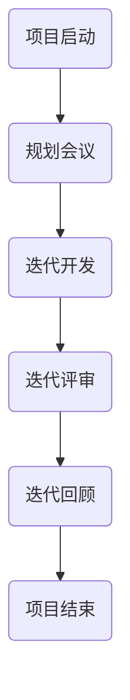

                 

### 文章标题：敏捷转型路线图：传统团队拥抱敏捷的实践指南

#### 关键词：敏捷转型、Scrum、看板、敏捷团队、传统开发方法

> 摘要：本文将深入探讨敏捷转型的重要性及其对于传统开发团队的意义。我们将详细解读敏捷的核心概念和原则，并通过具体案例展示敏捷方法在实际项目中的应用。此外，本文还将提供一系列实用的敏捷转型策略和实践指南，帮助您的团队顺利拥抱敏捷，提升开发效率和质量。

### 引言

在当今快速变化和竞争激烈的市场环境中，敏捷开发方法已经成为软件开发领域的主流实践。传统的瀑布模型由于其僵化的流程和缺乏灵活性，往往难以适应市场需求的快速变化。因此，越来越多的传统开发团队开始寻求敏捷转型，以提升项目的交付速度和产品质量。

敏捷转型不仅仅是技术层面的变革，更是文化和管理模式的革新。它要求团队具备高度的协作精神、灵活的应对能力和持续改进的意识。然而，对于习惯了传统开发模式的老团队来说，拥抱敏捷并不是一件容易的事情。本文将为您提供一个系统的敏捷转型路线图，帮助传统团队顺利迈向敏捷。

### 敏捷方法的起源与发展

敏捷开发方法的起源可以追溯到2001年，当时一些软件开发专家在犹他州的雪鸟滑雪度假胜地聚会，共同讨论如何改善软件开发过程。这次聚会的成果是《敏捷宣言》的诞生，它提出了“个体和互动重于流程和工具”、“工作的软件重于详尽的文档”、“客户合作重于合同谈判”、“响应变化重于遵循计划”等核心原则。

敏捷开发方法的发展经历了多个阶段，从早期的XP（极限编程）到后来的Scrum、看板等具体方法，逐渐形成了多样化的敏捷实践。敏捷方法强调灵活性和适应性，使得开发团队能够更好地应对项目中的不确定性。

与传统的瀑布模型相比，敏捷方法具有以下几个显著特点：

1. **迭代与增量开发**：敏捷开发采用迭代和增量方式，每次迭代都是一个可交付的产品版本，这有助于缩短开发周期和提高客户满意度。
2. **用户故事**：用户故事是一种简短的需求描述，它关注用户实际需要的功能，而非技术细节，有助于确保开发工作与用户需求保持一致。
3. **持续反馈与改进**：敏捷开发强调持续反馈和改进，通过定期的回顾会议，团队能够识别并解决存在的问题，不断提升开发效率和产品质量。

### 敏捷与传统开发方法的比较

敏捷开发方法与传统的瀑布模型在多个方面存在显著差异。以下是对两者进行比较的几个关键点：

1. **开发流程**：传统的瀑布模型采用线性开发流程，各个阶段（如需求分析、设计、编码、测试等）依次进行，每个阶段完成后才能进入下一个阶段。而敏捷开发采用迭代和增量开发方式，每次迭代都包括需求分析、设计、编码、测试等阶段，但每个阶段的时间较短，可以快速响应需求变化。

2. **需求管理**：在瀑布模型中，需求通常在项目早期确定，并在整个项目过程中保持不变。而在敏捷开发中，需求可以随时调整，以满足不断变化的市场需求。

3. **文档**：传统的瀑布模型强调详尽的文档，以记录每个阶段的工作内容和结果。而在敏捷开发中，文档的重要性相对降低，更多的注意力被放在实际工作的完成上。

4. **角色与职责**：在瀑布模型中，团队成员通常有明确的角色和职责，如项目经理、设计师、开发人员、测试人员等。而在敏捷开发中，团队成员的角色更加灵活，鼓励跨职能合作。

5. **客户参与**：在瀑布模型中，客户通常只在项目早期参与，并在后期进行验收。而在敏捷开发中，客户全程参与，通过定期的演示和反馈，确保开发工作与客户需求保持一致。

### 敏捷的核心原则与实践

敏捷开发方法的核心原则可以归纳为以下几点：

1. **客户价值至上**：敏捷开发强调将客户价值放在首位，确保每个迭代都产生可用的产品版本，满足客户的需求。

2. **团队协作**：敏捷开发鼓励团队成员之间的紧密协作，打破部门壁垒，实现跨职能合作，以提高开发效率。

3. **持续交付**：敏捷开发通过短周期的迭代，确保持续交付可用的产品版本，加快市场反馈速度。

4. **适应性规划**：敏捷开发强调灵活应对需求变化，通过迭代和增量开发，逐步完善产品功能。

5. **透明性**：敏捷开发通过每日站会、回顾会议等实践，保持团队内部的透明性，及时识别和解决问题。

以下是一个简单的敏捷开发流程图，展示了敏捷团队在每次迭代中的关键活动：

### 敏捷转型策略

敏捷转型不仅仅涉及技术层面的变革，更涉及到组织文化和管理模式的调整。以下是一些关键策略，帮助传统团队顺利拥抱敏捷：

1. **培训与教育**：为团队成员提供敏捷培训，帮助他们理解敏捷原则和实践，提高敏捷意识。

2. **建立敏捷文化**：鼓励团队成员之间建立信任和协作关系，打破传统的等级制度，促进平等和开放的沟通。

3. **逐步转型**：不要试图一次性实现全面敏捷，而是逐步引入敏捷实践，逐步调整流程和工具。

4. **领导支持**：敏捷转型需要领导层的支持和推动，确保团队在转型过程中遇到问题时能够得到及时解决。

5. **持续改进**：通过定期的回顾会议，不断识别和解决问题，持续改进开发流程和团队协作。

### 敏捷实践项目案例

以下是一个敏捷实践项目的案例，展示了敏捷方法在实际项目中的应用：

**项目背景**：一家初创公司开发一款移动应用，需要在短时间内上线，以抢占市场份额。

**敏捷实践**：

1. **用户故事**：团队通过用户故事收集客户需求，确保每个故事都与客户价值相关。

2. **迭代开发**：团队采用两周为一个迭代周期，每个迭代都完成一个可用的产品版本。

3. **每日站会**：团队每天早晨举行5-10分钟的站会，讨论当天的任务和进展，确保团队成员之间保持同步。

4. **迭代评审**：在每次迭代结束时，团队邀请客户进行评审，收集反馈，并根据反馈调整后续迭代的工作计划。

5. **迭代回顾**：团队定期举行回顾会议，总结每次迭代的经验和教训，不断优化开发流程。

通过敏捷实践，项目团队在短时间内成功上线了产品，并迅速获得了用户的认可。

### 敏捷实践中的挑战与解决方案

尽管敏捷方法具有许多优势，但在实际应用中仍然面临一些挑战。以下是一些常见的问题及其解决方案：

1. **团队成员的抵触情绪**：一些团队成员可能对敏捷方法不熟悉或存在抵触情绪。解决方法是提供充分的培训和沟通，帮助团队成员理解敏捷原则和实践。

2. **项目管理困难**：在敏捷项目中，需求可能随时变化，这给项目管理带来一定难度。解决方法是采用适应性规划，灵活调整项目计划，并确保团队具备良好的沟通和协作能力。

3. **质量保证**：敏捷开发强调快速交付，有时可能导致质量保证不足。解决方法是采用自动化测试和持续集成，确保每次迭代都产生高质量的产品版本。

4. **团队协作**：敏捷开发强调跨职能合作，但在传统团队中，部门壁垒可能阻碍协作。解决方法是建立敏捷文化，鼓励团队成员打破部门壁垒，实现高效协作。

### 附录

为了帮助读者进一步了解敏捷实践，本文提供了一个附录，包括以下内容：

1. **敏捷工具与资源**：介绍一些常用的敏捷工具，如Jira、Trello等，并提供相关资源和教程。

2. **敏捷实践指南**：提供一些敏捷实践的最佳实践，帮助团队在转型过程中少走弯路。

### 总结

敏捷转型是现代软件开发团队面临的重要挑战，它不仅需要技术上的变革，更需要组织文化和管理模式的调整。通过本文的介绍，我们了解了敏捷方法的核心原则和实践，并看到了其在实际项目中的应用效果。希望本文能够为您的团队提供有益的启示，帮助您顺利拥抱敏捷，提升开发效率和质量。

作者：AI天才研究院/AI Genius Institute & 禅与计算机程序设计艺术 /Zen And The Art of Computer Programming

