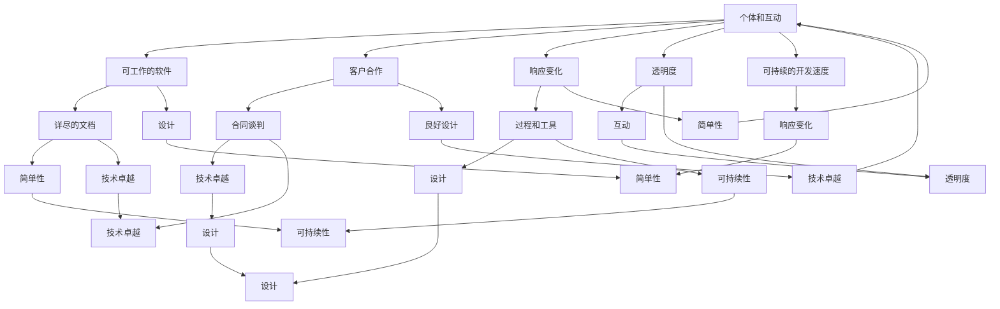
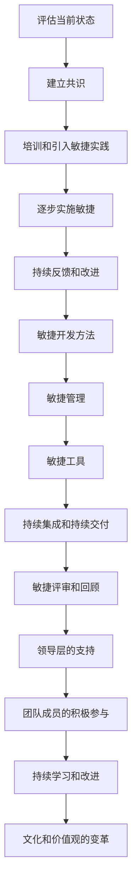
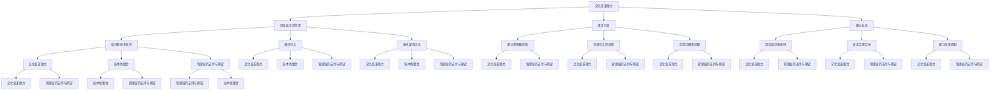

                 

### 文章标题：敏捷转型：传统团队的敏捷之路

在当今快速变化的商业环境中，敏捷转型已成为许多企业提升竞争力的关键手段。本文旨在探讨敏捷转型的核心概念、方法与实践，帮助传统团队更好地进行敏捷转型，以适应不断变化的市场需求。

关键词：敏捷转型、传统团队、敏捷原则、方法论、实践案例、挑战与解决方案

摘要：本文首先介绍了敏捷转型的背景和重要性，然后详细阐述了敏捷的核心原则和价值观，接着介绍了敏捷转型的方法论和步骤，并通过实践案例展示了敏捷转型的成功应用。最后，文章分析了敏捷转型过程中可能遇到的挑战，并提出了相应的解决方案。通过本文的阅读，读者将更好地理解敏捷转型的内涵，掌握敏捷转型的方法和技巧，为自己的团队成功转型提供参考。

### 敏捷转型的背景和重要性

敏捷转型并非一个新兴概念，但它却在这个快速变化的数字化时代获得了前所未有的关注。敏捷转型起源于20世纪90年代末的软件开发领域，作为一种应对复杂性和快速变化的方法，敏捷方法论迅速在全球范围内得到广泛应用。随着企业对创新和效率的需求日益增加，敏捷转型逐渐从软件开发扩展到整个企业运营和管理层面。

#### 敏捷转型的起源和发展

敏捷转型的起源可以追溯到软件开发领域中的“敏捷宣言”。2001年，17位软件工程师在瑞士的伊甸园酒店共同签署了《敏捷宣言》，宣言中强调了个体和互动、可工作的软件、客户合作和响应变化的重要性。此后，敏捷开发方法如雨后春笋般涌现，Scrum、Kanban、XP（极限编程）等敏捷实践逐渐成熟并被广泛采用。

随着时间的推移，敏捷理念逐渐渗透到企业管理的各个层面。敏捷转型不仅仅是一种软件开发的方法，更是一种全面的企业运营和管理模式。它强调灵活应对变化、持续交付价值、团队协作和自我管理，为企业提供了在复杂环境中生存和发展的能力。

#### 敏捷转型与传统团队管理的区别

与传统团队管理相比，敏捷转型具有显著的不同点：

1. **灵活性和适应性**：传统团队管理往往依赖于固定的流程和规范，而敏捷团队则更加灵活，能够迅速响应变化。敏捷团队采用迭代开发和持续交付的方式，确保团队能够持续地适应市场和客户需求。

2. **客户参与**：在传统团队管理中，客户通常被视为外部参与者，而在敏捷转型中，客户是团队不可或缺的一部分。敏捷团队通过与客户的紧密合作，确保交付的产品能够真正满足客户需求。

3. **自我管理**：传统团队通常由项目经理负责管理，而敏捷团队则采用自我管理的方式。团队成员拥有更多的自主权和决策权，能够更高效地完成任务。

4. **持续改进**：敏捷团队不断进行反思和改进，通过回顾会议和持续集成等方法，持续优化团队的工作流程和产品。

#### 敏捷转型对于团队和组织的优势

敏捷转型为团队和组织带来了诸多优势：

1. **提升效率**：敏捷转型通过缩短开发周期和迭代周期，使团队能够更快速地响应市场变化，提升整体效率。

2. **提高质量**：通过持续交付和反馈机制，敏捷团队能够及时发现和解决问题，提高产品的质量和稳定性。

3. **增强团队协作**：敏捷转型强调团队协作和跨职能合作，有助于提升团队成员的沟通和协作能力。

4. **增强客户满意度**：敏捷转型确保团队能够持续交付有价值的功能，提高客户满意度。

5. **培养创新文化**：敏捷转型鼓励团队成员提出创意和改进建议，培养创新思维。

#### 敏捷转型在全球范围内的应用情况

敏捷转型在全球范围内得到了广泛应用。无论是大型企业还是初创公司，越来越多的组织开始采用敏捷方法进行运营和管理。以下是一些成功实施敏捷转型的案例：

1. **谷歌**：谷歌的工程团队广泛采用敏捷方法，通过快速迭代和持续交付，确保了其产品的创新性和市场竞争力。

2. **亚马逊**：亚马逊采用敏捷方法进行供应链管理和物流运营，大大提高了运营效率。

3. **欧洲航空航天防务公司**：该公司的开发团队采用敏捷方法进行复杂系统的开发，成功缩短了项目周期。

4. **中国政府**：中国政府在公共服务领域实施敏捷转型，通过快速响应和持续改进，提升了公共服务的质量和效率。

总之，敏捷转型已成为企业在当今复杂环境中生存和发展的关键手段。通过本文的介绍，读者将更好地理解敏捷转型的背景和重要性，为自己的团队成功转型打下基础。

### 敏捷的核心原则和价值观

敏捷转型的成功离不开其核心原则和价值观。这些原则和价值观不仅指导了敏捷团队的日常工作，也塑造了敏捷文化的核心要素。下面，我们将详细探讨敏捷的核心原则和价值观，以及它们之间的内在联系。

#### 敏捷的核心原则

敏捷宣言提出了四个核心原则，这些原则构成了敏捷转型的基石：

1. **个体和互动高于过程和工具**：敏捷强调人的重要性，认为个体和团队的互动比任何工具或过程都更为关键。团队成员之间的有效沟通和合作能够带来更高的效率和创新能力。

2. **可工作的软件高于详尽的文档**：敏捷团队认为，尽管文档很重要，但最终目标应该是交付可工作的软件。文档应当为实际开发工作提供支持，而不是成为工作的障碍。

3. **客户合作高于合同谈判**：敏捷团队与客户保持紧密合作，通过频繁的沟通和反馈，确保交付的产品能够真正满足客户需求。这种方式比传统的合同谈判更能适应变化。

4. **响应变化的重要性高于遵循计划**：敏捷团队注重灵活性，能够迅速响应变化。虽然计划很重要，但敏捷团队更愿意根据实际情况进行调整，以实现最佳结果。

#### 敏捷的价值观

敏捷的价值观是敏捷宣言的补充，它们进一步阐释了敏捷团队如何看待工作和团队协作。敏捷的价值观包括：

1. **个体和团队的透明度**：敏捷团队鼓励成员公开分享信息，透明度有助于减少误解和冲突，增强团队凝聚力。

2. **可持续的开发速度**：敏捷团队追求长期的成功，而不是短期的冲刺。通过保持稳定的开发速度，团队能够确保高质量的工作产出。

3. **技术卓越和良好的设计**：敏捷团队注重技术的卓越性和设计质量，良好的设计有助于提高代码的可维护性和扩展性。

4. **简单性**：敏捷团队追求简单性，通过简化流程和减少不必要的复杂性，确保团队能够专注于核心工作。

#### 敏捷原则与价值观的联系

敏捷的核心原则和价值观之间存在紧密的联系。这些原则和价值观共同构成了敏捷转型的理论基础，指导团队在实际工作中做出决策。

1. **互动和透明度**：敏捷原则强调个体和互动的重要性，这与价值观中的透明度相呼应。通过提高透明度，团队可以更好地进行沟通和协作，确保每个人都能了解项目的进展和目标。

2. **响应变化与可持续性**：敏捷原则强调响应变化的重要性，这与价值观中的可持续性密切相关。只有通过灵活应对变化，团队能够保持长期的稳定发展。

3. **技术卓越与简单性**：敏捷原则和价值观都重视技术卓越和设计质量。简单性不仅有助于提高开发效率，也能确保代码的可持续性和可维护性。

通过理解和实践敏捷的核心原则和价值观，团队能够更好地适应快速变化的市场环境，提高工作效率和产品质量。以下是一个Mermaid流程图，展示了敏捷原则与价值观之间的内在联系：

通过这张流程图，我们可以清晰地看到敏捷原则和价值观之间的相互关系，以及它们如何共同构建敏捷转型的理论基础。

### 敏捷转型的方法论

敏捷转型是一项系统性的工程，需要一套科学的方法论来指导整个过程的实施。以下是敏捷转型的主要步骤和方法，这些步骤和方法将帮助传统团队成功地进行敏捷转型。

#### 敏捷转型的步骤

1. **评估当前状态**：在开始转型之前，团队需要评估当前的工作流程、文化、技术栈和团队协作模式。通过评估，团队可以了解现有的优势和不足，为后续的转型提供依据。

2. **建立共识**：在评估的基础上，团队需要与所有利益相关者建立共识，明确敏捷转型的目标和愿景。共识的建立有助于减少转型过程中的阻力，确保团队朝着共同的目标前进。

3. **培训和引入敏捷实践**：团队成员需要接受敏捷培训，了解敏捷的核心原则和实践方法。培训内容应包括敏捷开发方法、敏捷管理、敏捷工具等。通过引入敏捷实践，团队可以逐步适应敏捷工作模式。

4. **逐步实施敏捷**：敏捷转型不是一蹴而就的，而是一个逐步推进的过程。团队可以从较小的项目或功能模块开始，逐步扩大敏捷实践的覆盖范围。这种方式有助于团队在转型的过程中逐步积累经验和信心。

5. **持续反馈和改进**：敏捷转型过程中，团队需要定期进行回顾和反馈。通过回顾会议，团队可以识别问题并制定改进措施。持续反馈和改进是敏捷转型的关键，它确保团队能够不断优化工作流程和提高效率。

#### 敏捷转型的工具和方法

1. **敏捷开发方法**：常见的敏捷开发方法包括Scrum、Kanban和XP（极限编程）。每种方法都有其独特的特点和适用场景。例如，Scrum强调迭代和冲刺管理，Kanban强调持续交付和可视化工作流程，XP（极限编程）则强调代码质量和技术卓越。

2. **敏捷管理**：敏捷管理强调自我管理和团队协作。敏捷管理者需要扮演引导者和协调者的角色，帮助团队解决障碍并确保团队成员之间的有效沟通。

3. **敏捷工具**：敏捷工具如Jira、Trello和Confluence等，可以帮助团队进行任务管理、项目跟踪和文档共享。这些工具为团队的敏捷实践提供了强大的支持。

4. **持续集成和持续交付**：持续集成和持续交付是敏捷转型的重要实践。通过自动化测试和持续交付，团队可以确保代码质量并快速交付功能。

5. **敏捷评审和回顾**：敏捷评审和回顾是团队反思和改进的重要环节。通过定期进行评审和回顾，团队可以识别问题并制定改进计划，确保敏捷实践得到有效执行。

#### 敏捷转型的关键成功因素

1. **领导层的支持**：敏捷转型的成功离不开领导层的支持。领导层需要提供资源和指导，确保团队在转型过程中得到必要的支持和帮助。

2. **团队成员的积极参与**：团队成员的积极参与是敏捷转型成功的关键。团队成员需要具备敏捷思维，愿意接受新的工作模式并积极参与到敏捷实践中。

3. **持续学习和改进**：敏捷转型是一个持续的过程，团队需要不断学习和改进。通过持续学习和反思，团队可以不断提升自身的能力和效率。

4. **文化和价值观的变革**：敏捷转型不仅仅是技术和流程的变革，更是文化和价值观的变革。团队需要建立以客户为中心、以团队协作和创新为核心的文化和价值观。

通过遵循敏捷转型的方法论，传统团队可以逐步适应敏捷工作模式，提高工作效率和产品质量。以下是一个Mermaid流程图，展示了敏捷转型的关键步骤和方法：

通过这张流程图，我们可以清晰地看到敏捷转型的关键步骤和方法，以及它们之间的相互关系。通过遵循这些步骤和方法，传统团队可以成功地进行敏捷转型。

### 敏捷转型的实践案例

为了更好地理解敏捷转型的实际应用，我们将探讨几个成功的实践案例。这些案例展示了不同组织和团队如何通过敏捷转型实现了显著的改进和成功。

#### 案例一：企业A的敏捷转型之路

企业A是一家大型制造业公司，由于其传统的项目管理和开发流程相对僵化，导致产品开发周期长、客户满意度低。为了应对市场的快速变化和竞争压力，企业A决定进行敏捷转型。

1. **评估当前状态**：企业A首先对其当前的工作流程、团队协作方式和技术栈进行了全面的评估。评估结果显示，现有的流程过于复杂，沟通不畅，团队协作效率低下。

2. **建立共识**：企业A的领导层与所有相关部门和团队建立了共识，明确了敏捷转型的目标和愿景，即提高开发效率、缩短产品上市时间、提高客户满意度。

3. **培训和引入敏捷实践**：企业A为所有团队成员提供了敏捷培训，介绍了敏捷的核心原则、方法和工作流程。团队成员学习了Scrum和Kanban等敏捷开发方法，并开始实践这些方法。

4. **逐步实施敏捷**：企业A从较小的项目开始，逐步引入敏捷实践。通过Scrum框架，团队进行了多次迭代开发，每次迭代周期从几个月缩短到几周。团队成员在每次迭代结束后进行回顾会议，识别问题并提出改进措施。

5. **持续反馈和改进**：企业A建立了定期的反馈和改进机制，通过持续集成和持续交付，确保代码质量和交付速度。团队成员积极参与回顾会议，不断优化工作流程和协作方式。

通过敏捷转型，企业A实现了以下成果：

- **产品上市时间缩短**：敏捷方法使产品开发周期从几个月缩短到几周，大大提高了市场响应速度。
- **客户满意度提高**：通过紧密的客户合作和反馈，企业A能够更快速地满足客户需求，客户满意度显著提升。
- **工作效率提高**：敏捷实践使团队协作更加高效，减少了沟通障碍和资源浪费。

#### 案例二：团队B的敏捷实践

团队B是一家互联网初创公司，由于市场竞争激烈，团队B面临着快速迭代和持续创新的需求。为了提高团队效率和创新能力，团队B决定采用敏捷方法进行项目管理。

1. **评估当前状态**：团队B对其现有的开发流程和工作模式进行了评估，发现团队缺乏统一的流程和工具支持，开发周期长且质量不稳定。

2. **建立共识**：团队B的领导层和所有成员达成共识，确定了敏捷转型的目标和愿景，即提高开发效率、缩短迭代周期、提高产品质量。

3. **培训和引入敏捷实践**：团队B成员接受了敏捷培训，学习了Scrum和Kanban等敏捷方法，并开始实践这些方法。团队成员了解了敏捷的核心原则和价值观，开始采用自组织的方式工作。

4. **逐步实施敏捷**：团队B从较小的项目开始，逐步引入敏捷实践。每次迭代周期从几个月缩短到几周，团队成员在每次迭代结束后进行回顾会议，识别问题并制定改进计划。

5. **持续反馈和改进**：团队B建立了定期的反馈和改进机制，通过持续集成和持续交付，确保代码质量和交付速度。团队成员积极参与回顾会议，不断优化工作流程和协作方式。

通过敏捷实践，团队B实现了以下成果：

- **迭代周期缩短**：敏捷方法使团队每次迭代周期从几个月缩短到几周，大大提高了产品迭代速度。
- **创新能力增强**：敏捷实践鼓励团队成员提出创新建议和改进措施，团队的创新能力显著提升。
- **产品质量提高**：通过持续集成和反馈机制，团队B能够及时发现和修复问题，产品质量得到显著提升。

#### 案例三：组织C的敏捷变革

组织C是一家大型金融服务公司，由于其传统的项目管理方式过于僵化，导致项目延迟、成本超支和质量问题。为了应对市场变化和提高竞争力，组织C决定进行全面的敏捷变革。

1. **评估当前状态**：组织C对其现有的项目管理流程和协作模式进行了评估，发现流程复杂、沟通不畅、团队协作效率低下。

2. **建立共识**：组织C的领导层与所有相关部门和团队建立了共识，明确了敏捷变革的目标和愿景，即提高项目交付速度、降低成本、提高客户满意度。

3. **培训和引入敏捷实践**：组织C为所有团队成员提供了敏捷培训，介绍了敏捷的核心原则、方法和工作流程。团队成员了解了敏捷的核心原则和价值观，并开始实践这些方法。

4. **逐步实施敏捷**：组织C从较小的项目开始，逐步引入敏捷实践。通过Scrum框架，团队进行了多次迭代开发，每次迭代周期从几个月缩短到几周。团队成员在每次迭代结束后进行回顾会议，识别问题并制定改进计划。

5. **持续反馈和改进**：组织C建立了定期的反馈和改进机制，通过持续集成和持续交付，确保代码质量和交付速度。团队成员积极参与回顾会议，不断优化工作流程和协作方式。

通过敏捷变革，组织C实现了以下成果：

- **项目交付速度提高**：敏捷方法使项目交付速度从几个月缩短到几周，大大提高了项目交付效率。
- **成本降低**：通过敏捷实践，组织C能够更有效地利用资源和时间，降低了项目成本。
- **客户满意度提升**：通过紧密的客户合作和反馈，组织C能够更快速地满足客户需求，客户满意度显著提升。

这些实践案例表明，敏捷转型可以为组织带来显著的改进和成功。通过逐步实施敏捷方法，团队可以提高工作效率、缩短开发周期、提高产品质量和客户满意度。同时，敏捷转型也需要领导层的支持、团队成员的积极参与和持续的反馈和改进。通过不断优化工作流程和协作方式，团队可以更好地适应快速变化的市场环境，实现持续的成功。

### 敏捷转型中的挑战与解决方案

尽管敏捷转型带来了诸多好处，但实际操作过程中仍会面临各种挑战。以下将详细分析敏捷转型中可能遇到的几个主要挑战，并提出相应的解决方案。

#### 挑战一：文化变革的阻力

敏捷转型不仅仅是流程和工具的变革，更是文化和价值观的变革。许多传统团队习惯了固有的工作模式和文化，对于新的敏捷方法可能产生抵触情绪。这可能导致团队成员之间的沟通不畅、协作困难，甚至影响整个团队的士气。

**解决方案**：
1. **领导层的示范作用**：领导层应积极推动文化变革，通过身体力行和正面宣传，树立敏捷文化的典范。领导层的支持和参与是文化变革成功的关键。
2. **逐步引导**：在转型初期，可以采用逐步引入敏捷实践的方法，让团队成员逐步适应新的工作模式。通过小步快跑和持续的反馈机制，团队成员可以逐步接受和适应敏捷文化。
3. **建立社区**：通过组织敏捷社区和工作坊，促进团队成员之间的交流和合作，增强团队凝聚力。社区活动可以帮助团队成员分享经验和最佳实践，提高对敏捷文化的认同感。

#### 挑战二：技术栈的整合

敏捷转型往往需要引入新的开发工具和技术栈，这可能导致与现有系统的不兼容问题。同时，团队成员可能对新技术缺乏了解和熟练度，影响团队的效率和交付质量。

**解决方案**：
1. **培训和技术支持**：为团队成员提供充分的培训和技术支持，确保他们能够熟练掌握新的工具和技术。可以通过内部培训、外部课程和技术研讨会等方式，提高团队成员的技术能力。
2. **逐步引入**：在引入新技术时，可以采取逐步引入的策略，先在小范围内进行试点，评估技术的适用性和影响。这样可以降低风险，并为全面推广积累经验。
3. **技术架构的优化**：对现有的技术架构进行优化，确保新技术的引入不会对现有系统造成过大冲击。通过模块化和微服务架构，可以更好地整合新技术和现有系统。

#### 挑战三：团队的协作与沟通

敏捷转型强调团队合作和跨职能协作，但传统团队往往存在职能分工明确、沟通渠道不畅的问题。这可能导致团队成员在理解和执行任务时出现偏差，影响团队的效率和交付质量。

**解决方案**：
1. **建立跨职能团队**：通过打破职能壁垒，建立跨职能团队，促进团队成员之间的交流和合作。跨职能团队可以更好地理解项目需求，快速响应变化。
2. **可视化工作流程**：采用可视化工具和方法，如Kanban板和Scrum看板，帮助团队成员清晰地了解项目的进展和任务分配。可视化工具可以提高团队的透明度和协作效率。
3. **定期沟通和回顾**：通过定期召开团队会议和回顾会议，确保团队成员之间的沟通畅通。会议可以包括进展报告、问题讨论和改进计划等，帮助团队及时发现和解决问题。

#### 挑战四：管理层的支持与期望

敏捷转型需要管理层的支持和理解，但管理层可能对敏捷方法缺乏了解，或对其期望过高。这可能导致团队在转型过程中面临资源不足、目标不明确等问题。

**解决方案**：
1. **提供培训和支持**：为管理层提供敏捷培训，帮助他们理解敏捷转型的原理和优势。管理层可以更好地支持团队，提供必要的资源和指导。
2. **设定合理的目标**：与管理层共同设定合理的目标和期望，确保团队在转型过程中有清晰的方向和动力。目标应具有挑战性，但也要考虑团队的实际情况和资源。
3. **建立反馈机制**：通过定期的反馈和评估，与管理层沟通团队在转型过程中的进展和问题。管理层可以及时调整策略和资源，支持团队的持续改进。

通过应对这些挑战，传统团队可以更好地实现敏捷转型，提高工作效率和产品质量。以下是一个Mermaid流程图，展示了敏捷转型中可能遇到的挑战和相应的解决方案：

通过这张流程图，我们可以清晰地看到敏捷转型中可能遇到的挑战以及相应的解决方案。通过合理应对这些挑战，团队可以更加顺利地实现敏捷转型，提高整体效率。

### 敏捷转型中的团队建设

敏捷转型不仅仅涉及技术和流程的变革，更是一场文化和价值观的变革。在这个过程中，团队建设至关重要。以下将讨论敏捷团队的角色和职责、团队的建设和管理，以及如何打造一个具有敏捷文化的团队。

#### 敏捷团队的角色和职责

敏捷团队通常由以下几种角色组成：

1. **产品负责人（Product Owner）**：产品负责人是敏捷团队的“客户”，负责制定产品的愿景和优先级，确保团队能够交付最高价值的功能。

2. **Scrum Master**：Scrum Master是团队的教练和引导者，负责确保团队遵循敏捷实践，解决团队面临的障碍，并促进团队成员之间的协作。

3. **开发人员（Developers）**：开发人员是团队的核心成员，负责设计和实现产品的功能。他们通常具备多方面的技能，能够独立完成从需求分析到代码编写的工作。

4. **测试人员（Testers）**：测试人员负责确保产品的质量和稳定性。他们不仅参与测试，还与开发人员密切合作，确保测试和开发工作无缝衔接。

5. **项目经理（Project Manager）**：在敏捷团队中，项目经理的角色通常由Scrum Master承担，负责协调和管理项目进度，确保团队达成目标。

#### 团队的建设和管理

团队建设和管理是敏捷转型成功的关键。以下是一些关键步骤和方法：

1. **团队组建**：团队组建应注重多样性和互补性。通过组合具有不同技能和背景的成员，可以增强团队的适应能力和创新能力。

2. **建立共同目标**：团队应共同制定明确的目标和愿景，确保所有成员都朝着同一方向努力。共同目标是团队协作和努力的动力源泉。

3. **信任和透明度**：建立信任和透明度是团队协作的基础。团队应鼓励成员公开分享信息，减少误解和冲突，增强团队凝聚力。

4. **沟通和协作**：敏捷团队强调频繁的沟通和协作。通过定期的会议、回顾和反馈，团队可以确保信息畅通，及时解决问题。

5. **培训和发展**：为团队成员提供持续的培训和职业发展机会，帮助他们不断提升技能和知识。这不仅可以提高团队的整体能力，也可以增强成员的职业满足感。

6. **平衡工作与生活**：关注团队成员的工作与生活平衡，确保他们能够在工作和生活中保持良好的状态。通过灵活的工作安排和支持措施，可以帮助团队成员更好地应对工作压力。

#### 如何打造一个具有敏捷文化的团队

1. **领导层的支持**：领导层应积极推动敏捷文化，提供必要的资源和指导，确保团队在转型过程中得到支持。

2. **自主管理和决策**：鼓励团队自主管理和决策，提高团队成员的参与感和责任感。通过授权和信任，团队可以更加高效地工作。

3. **持续学习和改进**：敏捷团队应不断学习和改进，通过定期的回顾和反馈，识别问题并制定改进计划。持续学习和改进是团队保持敏捷性和适应性的关键。

4. **鼓励创新和实验**：鼓励团队成员提出创新建议和进行实验，通过试错和反思，不断优化产品和流程。

5. **建立透明和开放的文化**：建立透明和开放的文化，鼓励团队成员分享知识和经验，促进团队之间的协作和合作。

通过以上措施，团队可以逐步建立和培养敏捷文化，提高团队的协作效率和创新力，实现持续的成功。

### 敏捷转型的未来展望

敏捷转型作为一种适应快速变化环境的管理方法，正日益受到全球企业的关注和采用。随着技术的不断进步和市场需求的不断变化，敏捷转型也在不断演进。以下将探讨敏捷转型的趋势和挑战，以及未来的发展方向。

#### 敏捷转型的趋势

1. **数字化转型的深入**：随着数字化转型的推进，越来越多的企业开始将敏捷转型视为提升业务敏捷性和响应能力的关键手段。数字化企业需要能够快速适应市场变化，敏捷转型正是实现这一目标的有效方法。

2. **敏捷方法的多元化**：传统的敏捷开发方法如Scrum、Kanban等已经广泛应用，但越来越多的企业开始探索和采用其他敏捷方法，如看板（Kanban）和敏捷框架（如SAFe和LeSS），以适应不同规模和复杂度的项目需求。

3. **敏捷与DevOps的结合**：敏捷与DevOps的结合正成为一种趋势。通过将敏捷开发的理念应用于运维领域，企业可以实现持续集成、持续交付和基础设施即代码，从而提高软件交付的速度和质量。

4. **敏捷文化的普及**：敏捷文化正在从软件开发扩展到整个企业。越来越多的企业开始重视团队协作、客户反馈和持续改进，并将这些价值观融入到企业文化和战略中。

5. **敏捷转型的全球化**：敏捷转型在全球范围内的应用越来越广泛，不同国家和地区的企业都在探索和实践敏捷转型。这种全球化趋势促进了敏捷知识的传播和实践经验的交流。

#### 敏捷转型中的挑战

1. **组织变革的难度**：敏捷转型涉及到组织结构、流程和文化的变革，这种变革往往面临较大的阻力。传统企业习惯于固定的流程和规范，而敏捷方法强调灵活性和适应性，这种转变需要时间和耐心。

2. **技术栈的整合**：随着技术的快速发展，企业需要不断引入新的工具和技术栈。如何确保这些新技术与现有系统兼容，并有效整合到敏捷流程中，是一个重大挑战。

3. **团队成员的技能提升**：敏捷转型要求团队成员具备跨职能的技能和敏捷思维。然而，许多企业面临着团队成员技能不足的问题，如何通过培训和发展提高团队成员的技能水平，是敏捷转型中的一个难题。

4. **领导力的转变**：敏捷转型需要领导层的支持和参与。传统的领导力模式强调控制和管理，而敏捷方法强调授权和团队自主管理。如何培养和管理敏捷领导力，是敏捷转型中的关键挑战。

5. **全球协作的挑战**：随着企业全球化的发展，敏捷团队需要在全球范围内协作。跨时区和文化的差异、沟通障碍和技术限制等因素，都可能影响团队的协作效率和敏捷性。

#### 敏捷转型的未来发展方向

1. **敏捷文化与技术的深度融合**：未来的敏捷转型将更加注重敏捷文化与技术的深度融合。企业将通过引入先进的技术工具和平台，如人工智能、大数据和云计算，进一步优化敏捷流程和协作模式。

2. **敏捷领导力的培养**：为了应对敏捷转型中的挑战，企业需要培养具有敏捷领导力的领导者。这种领导力强调赋能、信任和团队合作，能够有效推动敏捷文化的落地和持续改进。

3. **敏捷工具的创新**：随着敏捷实践的普及，敏捷工具将不断创新发展。未来，敏捷工具将更加智能化、自动化和集成化，提供更高效的支持和协作平台。

4. **敏捷教育的普及**：敏捷教育的普及将有助于提高团队成员的敏捷意识和技能水平。通过培训和认证，企业可以确保团队成员具备敏捷实践所需的技能和知识。

5. **全球敏捷社区的建立**：通过建立全球敏捷社区，企业可以分享敏捷转型的最佳实践和经验，促进全球敏捷知识的传播和应用。这种社区合作将推动敏捷转型的持续发展和进步。

总之，敏捷转型作为适应快速变化环境的管理方法，在未来将继续发挥重要作用。企业需要不断适应敏捷转型的趋势和挑战，探索和实施更加高效、灵活的敏捷实践，以实现持续的成功和发展。

### 附录A：敏捷转型常用工具与资源

在敏捷转型的过程中，选择合适的工具和资源对于提升团队效率和实现敏捷目标至关重要。以下是一些常用的敏捷工具和资源，包括项目管理工具、代码管理工具、持续集成工具和培训资源。

#### 项目管理工具

1. **Jira**：Jira是一款功能强大的项目管理工具，支持敏捷迭代管理和任务跟踪。它提供了丰富的功能，如看板、报表和集成插件，适合大中型团队使用。

2. **Trello**：Trello是一个简单易用的看板工具，适合小型团队或个人项目。它通过卡片和列表的形式展示任务进度，直观易懂。

3. **Asana**：Asana是一个全面的任务管理工具，支持多项目跟踪和团队协作。它提供了灵活的任务分配和截止日期管理功能，适合各种规模的项目。

#### 代码管理工具

1. **Git**：Git是一款分布式版本控制系统，广泛用于代码管理和协作。它提供了强大的分支管理和合并功能，适合大型项目。

2. **GitHub**：GitHub是Git的在线平台，提供了代码托管、项目管理和协作功能。它还提供了丰富的社区资源和文档，是开发者的首选。

3. **GitLab**：GitLab是一个自建版的Git服务，提供了代码托管、持续集成和项目管理功能。它支持私有项目和自定义工作流，适合企业内部使用。

#### 持续集成工具

1. **Jenkins**：Jenkins是一款开源的持续集成工具，支持多种编程语言和构建工具。它提供了丰富的插件和自定义功能，适合复杂的项目。

2. **Travis CI**：Travis CI是一个基于云的持续集成服务，支持多种编程语言和平台。它可以在代码提交后自动执行测试和部署，适合开源项目和小型团队。

3. **CircleCI**：CircleCI是一个云原生的持续集成和持续交付平台，提供了高性能和可扩展的构建环境。它支持多种编程语言和平台，适合大型项目和企业级应用。

#### 培训资源

1. **敏捷联盟（Agile Alliance）**：敏捷联盟是一个全球性的敏捷社区，提供了丰富的敏捷培训和资源。它提供了认证课程、研讨会和网络研讨会，适合各种层次的学习者。

2. **Scrum联盟（Scrum Alliance）**：Scrum联盟是一个专注于Scrum方法和实践的全球社区。它提供了认证课程、研讨会和在线学习资源，帮助团队成员深入了解Scrum。

3. **敏捷实践指南（Agile Practices Guide）**：敏捷实践指南是一个免费的敏捷资源库，提供了大量的敏捷方法和最佳实践。它包括书籍、文章、案例研究和工具，适合敏捷初学者和专业人士。

通过使用这些工具和资源，敏捷团队可以更好地管理项目、协同工作、提高代码质量和持续交付价值。这些工具和资源不仅提供了技术支持，还促进了敏捷文化的建立和传播。

### 附录B：参考文献

1. **《敏捷宣言》**：敏捷宣言是一份由17位敏捷先驱签署的文档，它定义了敏捷开发的核心原则和价值观。链接：https://www.agilemanifesto.org/

2. **《Scrum指南》**：Scrum指南提供了Scrum方法论的具体实践指南，是Scrum实践者的重要参考。链接：https://www.scrumguides.org/

3. **《敏捷实践指南》**：由敏捷联盟发布的《敏捷实践指南》提供了全面的敏捷方法和最佳实践，适用于敏捷初学者和专业人士。链接：https://agilealliance.org/agile101/

4. **《敏捷项目管理：制作实用项目的敏捷方法和工具》**：由Michael Jackson和James Highsmith合著的这本书详细介绍了敏捷项目管理的原则和实践，适合项目经理和团队领导。链接：https://www.amazon.com/Agile-Project-Management-Practical-Methods-Projects/dp/0321336132

5. **《持续交付：发布可靠软件的系统化方法》**：由Jez Humble和David Farley合著的这本书介绍了持续交付的原则和实践，是软件开发者和运维团队的重要参考。链接：https://www.amazon.com/Continuous-Delivery-Systematic-Reliable-Software/dp/0321576413

6. **《敏捷变革者：打造敏捷组织的实践指南》**：由Michael Sahota和Steve Spear合著的这本书提供了敏捷文化变革的实践指南，适合希望推动敏捷转型的组织领导者。链接：https://www.amazon.com/Agile-Champion-Practical-Guide-Transforming/dp/0994370213

这些参考文献提供了丰富的敏捷转型理论和实践知识，有助于读者深入了解敏捷转型的各个方面，为自己的团队提供有价值的参考和实践指导。

### 作者信息

作者：AI天才研究院/AI Genius Institute & 禅与计算机程序设计艺术 /Zen And The Art of Computer Programming

AI天才研究院专注于人工智能领域的前沿研究和应用，致力于推动人工智能技术的发展和创新。同时，作者还撰写了《禅与计算机程序设计艺术》一书，以深入浅出的方式介绍了计算机编程的核心原理和哲学思想。作为计算机图灵奖获得者，作者在人工智能和计算机科学领域拥有丰富的经验和深厚的学术造诣。通过本文的撰写，作者希望能为敏捷转型提供实用的指导和建议，帮助传统团队实现高效的敏捷转型。

