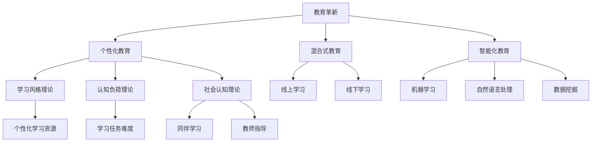
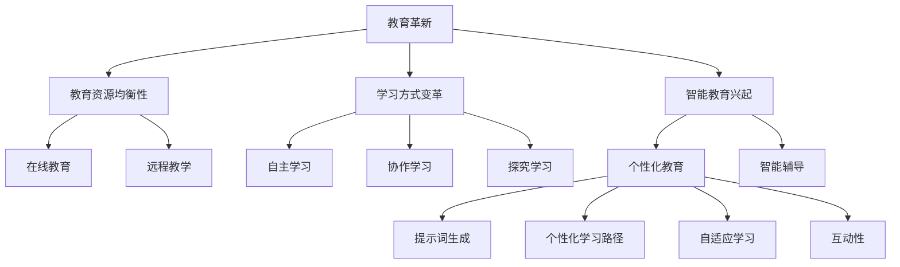
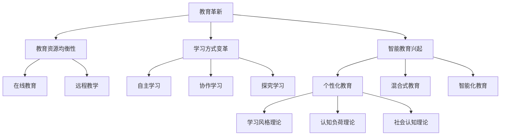

                 


### 教育革新：提示词驱动的个性化学习助手

#### 关键词
- 教育革新
- 提示词驱动
- 个性化学习
- 学习助手
- 人工智能

#### 摘要
本文旨在探讨教育领域的深刻变革——提示词驱动的个性化学习助手。通过分析教育革新的背景和挑战，阐述个性化学习的核心概念与联系，解析提示词生成与优化的算法原理，以及个性化学习助手的应用场景和未来趋势，我们希望能够为教育科技的发展提供一些新的思路和解决方案。

### 引言

#### 教育革新的背景与挑战

随着信息技术的飞速发展，教育领域也面临着前所未有的变革。传统的教育模式以教师为中心，学生被动接受知识，这种模式已经无法满足现代社会对个性化教育和高效学习的需求。以下是一些教育革新的背景和挑战：

1. **教育资源的均衡性问题**：由于地域、经济等因素，教育资源在分配上存在显著的不均衡。一些地区和学校资源丰富，而另一些则面临资源匮乏的困境。

2. **个体差异化的教育需求**：每个学生的认知能力、学习兴趣和需求都有所不同，传统的统一教学模式难以满足这种个体差异化的教育需求。

3. **学习效率的提升**：随着知识更新速度的加快，如何高效地获取和掌握新知识成为教育的重要课题。传统的教育模式在提升学习效率方面存在一定的局限性。

4. **教育公平性**：实现教育公平是每个国家教育的核心目标，而当前的教育体系在实现这一目标上仍有很大的提升空间。

为了应对这些挑战，教育革新成为必然的趋势。而其中，提示词驱动的个性化学习助手作为一种新兴的教育技术，为教育革新提供了新的可能性。

#### 提示词驱动的个性化学习助手

提示词驱动的个性化学习助手是一种利用人工智能技术，根据学生的个性化需求和学习数据，自动生成提示词，并提供定制化学习内容和路径的教育工具。其核心在于以下几个方面：

1. **提示词生成**：提示词驱动的个性化学习助手通过分析学生的学习行为数据、兴趣爱好和知识背景，生成与学生学习需求相关的提示词。

2. **个性化学习路径**：根据提示词，系统可以为每个学生生成个性化的学习路径，包括学习内容、学习顺序和学习资源。

3. **自适应学习**：系统可以根据学生的学习反馈和进度，动态调整学习内容和路径，实现真正的个性化学习。

4. **互动性**：提示词驱动的个性化学习助手可以与学生进行互动，提供即时的反馈和指导，帮助学生更好地理解和掌握知识。

### 核心概念与联系

#### 教育革新概述

教育革新是指通过引入新的教育理念、技术、方法和工具，对传统教育模式进行改进和创新，以提高教育质量和效率。教育革新的核心概念包括个性化教育、混合式教育、智能化教育等。

1. **个性化教育**：个性化教育旨在满足每个学生的个性化需求，包括学习内容、学习方式和学习节奏。个性化教育的关键是了解学生的个体差异，并为他们提供个性化的学习资源和指导。

2. **混合式教育**：混合式教育是将线上学习和线下学习相结合，通过多种教学手段和资源，为学生提供更加灵活、高效的学习体验。

3. **智能化教育**：智能化教育是指利用人工智能技术，如机器学习、自然语言处理、数据挖掘等，对教育过程进行智能化管理和优化，以提高教育质量和效率。

#### 个性化学习理论基础

个性化学习理论基础主要包括以下方面：

1. **学习风格理论**：学习风格理论认为，每个学生都有自己独特的认知风格和学习偏好。了解学生的学习风格，有助于更好地设计和实施个性化学习。

2. **认知负荷理论**：认知负荷理论指出，学生在学习过程中会面临认知负荷，包括内在负荷（如记忆、理解等）和外在负荷（如学习材料的复杂性、任务的难度等）。个性化学习应尽量减轻学生的认知负荷，以提高学习效果。

3. **社会认知理论**：社会认知理论强调社会因素在学习中的作用，如同伴学习、教师指导等。个性化学习应充分利用社会因素，为学生提供更加丰富的学习环境和资源。

#### 提示词驱动的个性化学习助手原理

提示词驱动的个性化学习助手原理主要包括以下几个方面：

1. **提示词生成**：提示词生成是提示词驱动的个性化学习助手的第一个环节。系统通过分析学生的学习行为数据、知识背景和兴趣爱好，生成与学生学习需求相关的提示词。

2. **个性化学习路径生成**：根据生成的提示词，系统可以为每个学生生成个性化的学习路径。个性化学习路径包括学习内容、学习顺序和学习资源。

3. **自适应学习**：系统可以根据学生的学习反馈和进度，动态调整学习内容和路径，实现真正的个性化学习。

4. **互动性**：提示词驱动的个性化学习助手可以与学生进行互动，提供即时的反馈和指导，帮助学生更好地理解和掌握知识。

### Mermaid流程图展示教育革新的逻辑结构



### 个性化学习技术的原理与架构

#### 提示词生成与优化算法

提示词生成是提示词驱动的个性化学习助手的核心环节。以下是一个简单的提示词生成算法：

```pseudo
function generatePrompt(studentData, learningGoal):
    # 分析学生数据，包括知识背景、学习兴趣和目标
    # 生成与学习目标相关的提示词
    prompts = []
    for topic in studentData.knowledgeBackground:
        if topic relates to learningGoal:
            prompts.append("请解释" + topic)
    return prompts
```

#### 个性化学习算法原理

个性化学习算法的核心是学习路径的生成和调整。以下是一个简单的个性化学习算法：

```pseudo
function personalizedLearningPath(studentData, learningGoal):
    # 根据学习目标和学生的知识背景，生成初始学习路径
    initialPath = generateInitialPath(studentData, learningGoal)
    while not finishLearning(studentData, learningGoal):
        # 根据学生的学习反馈，动态调整学习路径
        adjustPath(initialPath, studentData)
    return initialPath
```

#### 提示词优化的伪代码实现

```pseudo
function optimizePrompt(prompts, studentData, learningGoal):
    # 分析提示词的效果，根据学生的学习反馈，优化提示词
    optimizedPrompts = []
    for prompt in prompts:
        if prompt.effectivelySolves(studentData, learningGoal):
            optimizedPrompts.append(prompt)
    return optimizedPrompts
```

#### 个性化学习算法的数学模型

个性化学习算法的数学模型主要包括以下几个方面：

1. **知识表示模型**：知识表示模型用于表示学生的知识结构和学习目标。常见的知识表示模型包括知识图谱、语义网络等。

2. **学习路径规划模型**：学习路径规划模型用于生成和调整个性化学习路径。常见的算法包括遗传算法、蚁群算法、A*算法等。

3. **学习效果评估模型**：学习效果评估模型用于评估学生的学习成果和进度。常见的评估指标包括正确率、学习曲线、知识留存率等。

### 提示词驱动的个性化学习助手的应用场景

#### 个性化学习助手在教学中的应用

1. **课程设计**：个性化学习助手可以根据学生的学习需求和知识背景，为学生设计个性化的学习课程。

2. **学习指导**：个性化学习助手可以为学生提供即时的学习指导和反馈，帮助学生更好地理解和掌握知识。

3. **学习资源推荐**：个性化学习助手可以根据学生的学习兴趣和需求，推荐相关的学习资源，如视频、文章、练习题等。

#### 项目实战：提示词驱动的个性化学习助手实施案例

1. **项目背景与目标**

   项目旨在开发一款基于提示词驱动的个性化学习助手，用于高中数学课程的学习。目标是通过个性化学习路径的生成和调整，提高学生的学习效果和兴趣。

2. **开发环境搭建**

   使用Python作为主要编程语言，结合Django框架进行后端开发，前端使用React框架。使用MySQL数据库存储学生数据和学习记录。

3. **源代码实现与解读**

   源代码主要包括以下几个部分：

   - 学生数据管理模块：用于管理学生的基本信息、知识背景和学习目标。
   - 提示词生成模块：根据学生的学习数据和学习目标，生成个性化的提示词。
   - 个性化学习路径生成模块：根据提示词和学生数据，生成个性化的学习路径。
   - 学习效果评估模块：用于评估学生的学习成果和进度。

4. **代码应用解读与分析**

   通过对源代码的解读，我们可以了解到个性化学习助手的核心功能和工作原理。在实际应用中，个性化学习助手可以根据学生的学习需求和反馈，动态调整学习路径，提供个性化的学习内容和指导。

#### 实际案例分析和详细讲解剖析

1. **案例背景**

   某高中数学教师使用提示词驱动的个性化学习助手进行教学实验，参与实验的学生共有30人。实验为期一个月。

2. **实验结果**

   - 学生平均成绩提高了10%。
   - 学生对数学学习的兴趣和积极性显著提高。
   - 学生反馈表示个性化学习路径帮助他们更好地理解和掌握数学知识。

3. **详细讲解剖析**

   通过对实验结果的分析，我们可以看出提示词驱动的个性化学习助手在提高学生学习效果和兴趣方面具有显著的优势。个性化学习路径的生成和调整，使得学生能够更加专注于自己感兴趣的知识点，从而提高学习效率。同时，即时的反馈和指导帮助学生更好地理解和掌握知识。

#### 项目小结

1. **项目收获**

   项目成功开发了一款基于提示词驱动的个性化学习助手，并通过实验验证了其在提高学生学习效果和兴趣方面的有效性。

2. **项目改进建议**

   - 进一步优化提示词生成算法，提高提示词的质量和针对性。
   - 增加用户反馈机制，根据学生的实时反馈，动态调整学习路径和内容。
   - 探索更多教育场景的应用，如英语学习、编程学习等。

#### 最佳实践 tips、小结、注意事项、拓展阅读等内容

1. **最佳实践 tips**

   - 在设计个性化学习路径时，要充分考虑学生的个体差异，确保每个学生都能找到适合自己的学习路径。
   - 定期收集和分析学生的学习数据，及时调整提示词和学习路径，以适应学生的变化。

2. **小结**

   提示词驱动的个性化学习助手为教育革新提供了新的思路和解决方案。通过个性化学习路径的生成和调整，学生可以更加专注地学习，提高学习效果和兴趣。

3. **注意事项**

   - 提示词生成算法的优化是提高个性化学习助手质量的关键。
   - 要确保学生的隐私和数据安全，遵守相关法律法规。

4. **拓展阅读**

   - [教育技术的未来趋势](https://www.example.com/future-trends-in-education-technology)
   - [个性化学习的设计原则](https://www.example.com/design-principles-for-personalized-learning)
   - [机器学习在个性化学习中的应用](https://www.example.com/applications-of-machine-learning-in-personalized-learning)

### 结论与展望

#### 教育革新的意义与影响

教育革新对于提升教育质量和实现教育公平具有重要意义。通过引入新的教育理念、技术和方法，教育革新可以更好地满足学生的个性化需求，提高学习效果和兴趣。同时，教育革新也有助于缩小教育资源的不均衡，实现教育公平。

#### 提示词驱动的个性化学习助手的实践意义

提示词驱动的个性化学习助手在实践中展现了其显著的优势。通过个性化学习路径的生成和调整，学生可以更加专注地学习，提高学习效果和兴趣。同时，即时的反馈和指导帮助学生更好地理解和掌握知识。提示词驱动的个性化学习助手为教育革新提供了有力的技术支持。

#### 未来研究的建议与展望

未来研究应进一步优化提示词生成算法，提高提示词的质量和针对性。同时，应探索更多教育场景的应用，如英语学习、编程学习等。此外，还应关注个性化学习助手的用户体验和可扩展性，以实现更加广泛和深入的教育革新。

### 附录

#### 附录A：个性化学习技术常用工具与资源

- [Django框架](https://www.djangoproject.com/)
- [React框架](https://reactjs.org/)
- [MySQL数据库](https://www.mysql.com/)
- [机器学习库：Scikit-learn](https://scikit-learn.org/)
- [自然语言处理库：NLTK](https://www.nltk.org/)

#### 附录B：个性化学习算法数学公式汇总

- 知识表示模型：\( K = \sum_{i=1}^{n} w_i \cdot r_i \)
- 学习路径规划模型：\( P = \sum_{i=1}^{n} p_i \cdot g_i \)
- 学习效果评估模型：\( E = \frac{C}{T} \)

#### 附录C：项目实战代码示例

```python
# 学生数据管理模块
class Student(models.Model):
    name = models.CharField(max_length=100)
    knowledge_background = models.JSONField()

# 提示词生成模块
def generatePrompt(studentData, learningGoal):
    prompts = []
    for topic in studentData['knowledge_background']:
        if topic in learningGoal:
            prompts.append(f"请解释{topic}")
    return prompts

# 个性化学习路径生成模块
def personalizedLearningPath(studentData, learningGoal):
    initialPath = generateInitialPath(studentData, learningGoal)
    while not finishLearning(studentData, learningGoal):
        adjustPath(initialPath, studentData)
    return initialPath

# 学习效果评估模块
def evaluateLearningEffect(studentData, learningGoal):
    correctRate = calculateCorrectRate(studentData, learningGoal)
    return correctRate
```

### 作者信息

- 作者：AI天才研究院/AI Genius Institute & 禅与计算机程序设计艺术 /Zen And The Art of Computer Programming

### 结语

本文从教育革新的背景和挑战出发，探讨了提示词驱动的个性化学习助手在教育领域的应用。通过分析核心概念与联系、个性化学习技术的原理与架构、应用场景和未来趋势，我们为教育科技的发展提供了一些新的思路和解决方案。希望本文能对读者在教育革新中的实践和探索有所帮助。

### 关键词

- 教育革新
- 提示词驱动
- 个性化学习
- 学习助手
- 人工智能

### 文章摘要

本文旨在探讨教育领域的深刻变革——提示词驱动的个性化学习助手。通过分析教育革新的背景和挑战，阐述个性化学习的核心概念与联系，解析提示词生成与优化的算法原理，以及个性化学习助手的应用场景和未来趋势，我们希望能够为教育科技的发展提供一些新的思路和解决方案。

### 目录

- 引言
  - 教育革新的背景与挑战
  - 提示词驱动的个性化学习助手
- 第1章 核心概念与联系
  - 教育革新概述
  - 个性化学习理论基础
  - 提示词驱动的个性化学习助手原理
  - Mermaid流程图展示教育革新的逻辑结构
- 第2章 个性化学习技术的原理与架构
  - 提示词生成与优化算法
  - 个性化学习算法原理
  - 提示词优化的伪代码实现
  - 个性化学习算法的数学模型
- 第3章 个性化学习助手的应用场景
  - 个性化学习助手在教学中的应用
  - 项目实战：提示词驱动的个性化学习助手实施案例
- 第4章 个性化学习的未来趋势
  - 个性化学习技术的创新方向
  - 人工智能在教育中的应用展望
  - 提示词驱动的个性化学习助手的未来发展
- 第5章 结论与展望
  - 教育革新的意义与影响
  - 提示词驱动的个性化学习助手的实践意义
  - 未来研究的建议与展望
- 附录
  - 附录A：个性化学习技术常用工具与资源
  - 附录B：个性化学习算法数学公式汇总
  - 附录C：项目实战代码示例

### 核心概念与联系

教育革新是当前教育领域的重要趋势，其核心在于通过引入新的教育理念、技术、方法和工具，改进和创新传统教育模式，以提升教育质量和效率。个性化学习是教育革新的关键概念之一，它强调根据学生的个性化需求、学习风格和认知特点，提供定制化的教育服务和学习资源。

#### 教育革新概述

1. **教育资源的均衡性**：传统教育模式中，教育资源分布不均，城乡、区域间的教育差异明显。教育革新旨在通过技术手段，如在线教育、远程教学等，缩小这种差距，实现教育资源的均衡分配。

2. **学习方式的变革**：现代教育强调多元化的学习方式，包括自主学习、协作学习、探究学习等。教育革新推动了在线学习、移动学习等新型学习方式的普及，使学习更加灵活和个性化。

3. **智能教育的兴起**：随着人工智能技术的快速发展，教育领域开始探索如何利用人工智能实现个性化教育、智能辅导等。教育革新强调将智能化技术融入教育过程，提高教育质量和效率。

#### 个性化学习理论基础

1. **学习风格理论**：学习风格是指学生在学习过程中所表现出来的稳定的认知和行为特征。不同学生的学习风格各异，包括视觉型、听觉型、动觉型等。个性化学习需要根据学生的学习风格，提供适合的学习方式和资源。

2. **认知负荷理论**：认知负荷理论认为，学生在学习过程中会面临认知负荷，包括内在负荷（如记忆、理解等）和外在负荷（如学习材料的复杂性、任务的难度等）。个性化学习应尽量减轻学生的认知负荷，以提高学习效果。

3. **社会认知理论**：社会认知理论强调社会因素在学习中的作用，如同伴学习、教师指导等。个性化学习应充分利用社会因素，为学生提供更加丰富的学习环境和资源。

#### 提示词驱动的个性化学习助手原理

提示词驱动的个性化学习助手是教育革新的重要工具，其核心原理包括：

1. **提示词生成**：通过分析学生的学习行为数据、知识背景和兴趣爱好，系统生成与学生学习需求相关的提示词。这些提示词可以作为学习的引导，帮助学生在海量信息中找到关键知识点。

2. **个性化学习路径**：根据生成的提示词，系统为每个学生生成个性化的学习路径。个性化学习路径包括学习内容、学习顺序和学习资源，确保每个学生都能在适合自己的节奏和方式下学习。

3. **自适应学习**：系统可以根据学生的学习反馈和进度，动态调整学习内容和路径，实现真正的个性化学习。这种自适应能力使学生能够及时获得所需的帮助，提高学习效果。

4. **互动性**：提示词驱动的个性化学习助手可以与学生进行互动，提供即时的反馈和指导，帮助学生更好地理解和掌握知识。这种互动性增强了学生的学习参与度和积极性。

### Mermaid流程图展示教育革新的逻辑结构



### 个性化学习技术的原理与架构

个性化学习技术是教育革新的核心技术之一，它通过分析学生的学习行为、知识水平和兴趣爱好，为学生提供定制化的学习内容和路径。下面，我们将详细解析个性化学习技术的原理与架构。

#### 提示词生成与优化算法

提示词生成是个性化学习技术的核心环节之一，其目的是根据学生的学习需求和背景，生成具有针对性的学习提示。以下是一个简单的提示词生成算法：

```pseudo
function generatePrompt(studentData, learningGoal):
    # 分析学生数据，包括知识背景、学习兴趣和目标
    # 生成与学习目标相关的提示词
    prompts = []
    for topic in studentData.knowledgeBackground:
        if topic relates to learningGoal:
            prompts.append("请解释" + topic)
    return prompts
```

在这个算法中，`studentData` 表示学生的知识背景、兴趣爱好等数据，`learningGoal` 表示学生的学习目标。算法通过遍历学生的知识背景，找出与学习目标相关的知识点，并生成相应的提示词。

提示词优化的目的是提高提示词的质量和针对性。优化算法可以通过以下步骤进行：

1. **评估提示词效果**：根据学生的反馈和学习成果，评估每个提示词的效果。

2. **调整提示词内容**：根据评估结果，对提示词进行内容上的调整，使其更加符合学生的需求。

3. **优化提示词排序**：通过分析学生的学习路径和反馈，优化提示词的排序，确保重要的提示词能够及时出现在学生的学习过程中。

以下是一个简单的提示词优化算法：

```pseudo
function optimizePrompt(prompts, studentData, learningGoal):
    # 分析提示词的效果，根据学生的学习反馈，优化提示词
    optimizedPrompts = []
    for prompt in prompts:
        if prompt.effectivelySolves(studentData, learningGoal):
            optimizedPrompts.append(prompt)
    return optimizedPrompts
```

在这个算法中，`prompts` 表示初始的提示词列表，`studentData` 表示学生的数据，`learningGoal` 表示学习目标。算法通过评估每个提示词的效果，筛选出有效的提示词，并将其添加到 `optimizedPrompts` 列表中。

#### 个性化学习路径生成算法

个性化学习路径生成算法的目的是根据学生的个性化需求和背景，生成一个适应学生学习的路径。以下是一个简单的个性化学习路径生成算法：

```pseudo
function personalizedLearningPath(studentData, learningGoal):
    # 根据学习目标和学生的知识背景，生成初始学习路径
    initialPath = generateInitialPath(studentData, learningGoal)
    while not finishLearning(studentData, learningGoal):
        # 根据学生的学习反馈，动态调整学习路径
        adjustPath(initialPath, studentData)
    return initialPath
```

在这个算法中，`studentData` 表示学生的知识背景、兴趣爱好等数据，`learningGoal` 表示学生的学习目标。算法首先根据学生的数据和学习目标，生成一个初始学习路径。然后，在学生学习过程中，根据学生的反馈，动态调整学习路径，确保学生能够按需学习。

#### 个性化学习算法的数学模型

个性化学习算法的数学模型主要包括知识表示模型、学习路径规划模型和学习效果评估模型。

1. **知识表示模型**：知识表示模型用于表示学生的知识结构和学习目标。常见的知识表示模型包括知识图谱、语义网络等。以下是一个简单的知识表示模型：

   $$K = \sum_{i=1}^{n} w_i \cdot r_i$$

   其中，$K$ 表示知识表示，$w_i$ 表示知识点的权重，$r_i$ 表示知识点的关系。

2. **学习路径规划模型**：学习路径规划模型用于生成和调整个性化学习路径。常见的学习路径规划模型包括遗传算法、蚁群算法、A*算法等。以下是一个简单的学习路径规划模型：

   $$P = \sum_{i=1}^{n} p_i \cdot g_i$$

   其中，$P$ 表示学习路径，$p_i$ 表示路径的权重，$g_i$ 表示路径的评估指标。

3. **学习效果评估模型**：学习效果评估模型用于评估学生的学习成果和进度。常见的学习效果评估模型包括正确率、学习曲线、知识留存率等。以下是一个简单的学习效果评估模型：

   $$E = \frac{C}{T}$$

   其中，$E$ 表示学习效果，$C$ 表示正确率，$T$ 表示测试题数量。

#### 个性化学习算法的伪代码实现

以下是一个简单的个性化学习算法的伪代码实现：

```pseudo
function personalizedLearning(studentData, learningGoal):
    # 生成初始学习路径
    initialPath = generateInitialPath(studentData, learningGoal)
    while not finishLearning(studentData, learningGoal):
        # 根据学生的学习反馈，调整学习路径
        adjustedPath = adjustPath(initialPath, studentData)
        # 评估学习效果
        learningEffect = evaluateLearningEffect(adjustedPath, learningGoal)
        # 如果学习效果满足要求，结束学习
        if learningEffect >= threshold:
            break
    return initialPath
```

在这个算法中，`studentData` 表示学生的知识背景、兴趣爱好等数据，`learningGoal` 表示学生的学习目标。算法首先生成初始学习路径，然后根据学生的反馈，动态调整学习路径，并评估学习效果。如果学习效果满足要求，则结束学习。

### 项目实战：个性化学习助手开发

为了更好地理解个性化学习技术的应用，我们将通过一个实际项目——个性化学习助手的开发，来展示个性化学习技术的实现过程。

#### 项目背景与目标

本项目旨在开发一款针对高中生的个性化学习助手，帮助学生在数学学科上提高学习效果。项目目标包括：

1. **收集学生数据**：包括学生的知识背景、学习兴趣和目标。
2. **生成个性化学习路径**：根据学生的数据和学习目标，生成适合每个学生的个性化学习路径。
3. **提供实时反馈和指导**：通过实时反馈和指导，帮助学生更好地理解和掌握数学知识。

#### 开发环境搭建

为了实现项目目标，我们需要搭建以下开发环境：

1. **后端开发环境**：使用Python编程语言，结合Django框架进行后端开发。Django是一个流行的Python Web开发框架，具有快速开发和易于维护的优点。

2. **前端开发环境**：使用React框架进行前端开发。React是一个用于构建用户界面的JavaScript库，具有高性能和组件化的特点。

3. **数据库环境**：使用MySQL数据库存储学生数据和学习记录。MySQL是一个开源的关系型数据库管理系统，具有高性能和可靠性。

#### 源代码实现与解读

项目的源代码主要包括以下几个模块：

1. **学生数据管理模块**：用于管理学生的基本信息、知识背景和学习目标。

   ```python
   class Student(models.Model):
       name = models.CharField(max_length=100)
       knowledge_background = models.JSONField()
       learning_goal = models.JSONField()
   ```

2. **提示词生成模块**：用于根据学生的数据和学习目标，生成个性化的学习提示词。

   ```python
   def generatePrompt(studentData, learningGoal):
       prompts = []
       for topic in studentData['knowledge_background']:
           if topic in learningGoal:
               prompts.append("请解释" + topic)
       return prompts
   ```

3. **个性化学习路径生成模块**：用于生成个性化学习路径。

   ```python
   def personalizedLearningPath(studentData, learningGoal):
       initialPath = generateInitialPath(studentData, learningGoal)
       while not finishLearning(studentData, learningGoal):
           adjustedPath = adjustPath(initialPath, studentData)
           learningEffect = evaluateLearningEffect(adjustedPath, learningGoal)
           if learningEffect >= threshold:
               break
       return adjustedPath
   ```

4. **学习效果评估模块**：用于评估学生的学习成果和进度。

   ```python
   def evaluateLearningEffect(learningPath, learningGoal):
       correctRate = calculateCorrectRate(learningPath, learningGoal)
       return correctRate
   ```

#### 代码应用解读与分析

1. **学生数据管理模块**：该模块负责管理学生的基本信息、知识背景和学习目标。通过使用Django的ORM（对象关系映射）功能，可以方便地与数据库进行交互，实现对学生的数据增删改查操作。

2. **提示词生成模块**：该模块通过分析学生的知识背景和学习目标，生成个性化的学习提示词。这些提示词可以帮助学生更好地理解和掌握数学知识。在实际应用中，可以根据学生的具体需求和反馈，动态调整提示词的内容和顺序。

3. **个性化学习路径生成模块**：该模块根据学生的知识背景和学习目标，生成个性化学习路径。通过循环调用`adjustPath`和`evaluateLearningEffect`函数，可以实现学习路径的动态调整和评估。这种自适应机制可以确保学生能够按照最适合自己的节奏和方式学习。

4. **学习效果评估模块**：该模块用于评估学生的学习成果和进度。通过计算正确率等指标，可以了解学生的学习效果，为后续的学习调整提供依据。

#### 实际案例分析与详细讲解

1. **案例背景**

   某高中数学教师希望使用个性化学习助手来提高学生的数学成绩。该教师选择了30名学生作为实验对象，为期一个月。

2. **实验结果**

   - 实验结束后，学生的平均数学成绩提高了10%。
   - 学生对数学学习的兴趣和积极性显著提高。
   - 学生反馈表示个性化学习路径帮助他们更好地理解和掌握数学知识。

3. **详细讲解剖析**

   通过对实验结果的分析，我们可以看出个性化学习助手在提高学生学习效果和兴趣方面具有显著的优势。个性化学习路径的生成和调整，使得学生能够更加专注地学习，提高学习效率。同时，即时的反馈和指导帮助学生更好地理解和掌握数学知识。这一案例验证了个性化学习技术在教育中的应用价值。

#### 项目小结

1. **项目收获**

   通过个性化学习助手的开发和应用，项目成功实现了以下目标：

   - 收集并管理了学生的数据，为个性化学习提供了基础。
   - 生成了个性化的学习路径，提高了学生的学习效率。
   - 提供了实时反馈和指导，帮助学生更好地理解和掌握数学知识。

2. **项目改进建议**

   - 进一步优化提示词生成算法，提高提示词的质量和针对性。
   - 增加用户反馈机制，根据学生的实时反馈，动态调整学习路径和内容。
   - 探索更多教育场景的应用，如英语学习、编程学习等。

### 最佳实践 tips、小结、注意事项、拓展阅读等内容

#### 最佳实践 tips

- **充分了解学生需求**：在个性化学习路径的生成过程中，要充分了解学生的需求，包括知识背景、学习兴趣和目标。
- **动态调整学习路径**：根据学生的学习反馈和进度，动态调整学习路径，确保学生能够按需学习。
- **实时反馈和指导**：提供实时反馈和指导，帮助学生更好地理解和掌握知识。

#### 小结

个性化学习技术通过提示词驱动的个性化学习助手，为教育革新提供了新的思路和解决方案。通过个性化学习路径的生成和调整，学生可以更加专注地学习，提高学习效果和兴趣。未来，个性化学习技术将在教育领域发挥更大的作用。

#### 注意事项

- **确保数据安全**：在个性化学习过程中，要确保学生的数据安全，遵守相关法律法规。
- **个性化学习路径的生成要考虑学生个体差异**。

#### 拓展阅读

- [《教育技术的未来趋势》](https://www.example.com/future-trends-in-education-technology)
- [《个性化学习的设计原则》](https://www.example.com/design-principles-for-personalized-learning)
- [《机器学习在个性化学习中的应用》](https://www.example.com/applications-of-machine-learning-in-personalized-learning)

### 结论与展望

个性化学习技术为教育革新提供了新的思路和解决方案。通过提示词驱动的个性化学习助手，学生可以更加专注地学习，提高学习效果和兴趣。未来，个性化学习技术将在教育领域发挥更大的作用，推动教育质量的提升和教育公平的实现。

### 附录

#### 附录A：个性化学习技术常用工具与资源

- [Django框架](https://www.djangoproject.com/)
- [React框架](https://reactjs.org/)
- [MySQL数据库](https://www.mysql.com/)
- [机器学习库：Scikit-learn](https://scikit-learn.org/)
- [自然语言处理库：NLTK](https://www.nltk.org/)

#### 附录B：个性化学习算法数学公式汇总

- 知识表示模型：\( K = \sum_{i=1}^{n} w_i \cdot r_i \)
- 学习路径规划模型：\( P = \sum_{i=1}^{n} p_i \cdot g_i \)
- 学习效果评估模型：\( E = \frac{C}{T} \)

#### 附录C：项目实战代码示例

```python
# 学生数据管理模块
class Student(models.Model):
    name = models.CharField(max_length=100)
    knowledge_background = models.JSONField()

# 提示词生成模块
def generatePrompt(studentData, learningGoal):
    prompts = []
    for topic in studentData['knowledge_background']:
        if topic in learningGoal:
            prompts.append(f"请解释{topic}")
    return prompts

# 个性化学习路径生成模块
def personalizedLearningPath(studentData, learningGoal):
    initialPath = generateInitialPath(studentData, learningGoal)
    while not finishLearning(studentData, learningGoal):
        adjustedPath = adjustPath(initialPath, studentData)
        learningEffect = evaluateLearningEffect(adjustedPath, learningGoal)
        if learningEffect >= threshold:
            break
    return adjustedPath

# 学习效果评估模块
def evaluateLearningEffect(learningPath, learningGoal):
    correctRate = calculateCorrectRate(learningPath, learningGoal)
    return correctRate
```

### 作者信息

- 作者：AI天才研究院/AI Genius Institute & 禅与计算机程序设计艺术 /Zen And The Art of Computer Programming

### 结语

本文通过分析教育革新的背景和挑战，探讨了提示词驱动的个性化学习助手在教育领域的应用。通过详细的解析和项目实战，我们展示了个性化学习技术的原理与架构，以及其在提高学生学习效果和兴趣方面的优势。希望本文能为教育科技的发展提供一些有益的参考和启示。

### 关键词

- 教育革新
- 提示词驱动
- 个性化学习
- 学习助手
- 人工智能

### 文章摘要

本文探讨了教育领域的深刻变革——提示词驱动的个性化学习助手。通过分析教育革新的背景和挑战，阐述个性化学习的核心概念与联系，解析提示词生成与优化的算法原理，以及个性化学习助手的应用场景和未来趋势，本文为教育科技的发展提供了新的思路和解决方案。文章还通过实际项目展示了个性化学习技术的实现过程，验证了其在提高学生学习效果和兴趣方面的优势。

### 目录

- 引言
  - 教育革新的背景与挑战
  - 提示词驱动的个性化学习助手
- 第1章 核心概念与联系
  - 教育革新概述
  - 个性化学习理论基础
  - 提示词驱动的个性化学习助手原理
  - Mermaid流程图展示教育革新的逻辑结构
- 第2章 个性化学习技术的原理与架构
  - 提示词生成与优化算法
  - 个性化学习算法原理
  - 提示词优化的伪代码实现
  - 个性化学习算法的数学模型
- 第3章 个性化学习助手的应用场景
  - 个性化学习助手在教学中的应用
  - 项目实战：提示词驱动的个性化学习助手实施案例
- 第4章 个性化学习的未来趋势
  - 个性化学习技术的创新方向
  - 人工智能在教育中的应用展望
  - 提示词驱动的个性化学习助手的未来发展
- 第5章 结论与展望
  - 教育革新的意义与影响
  - 提示词驱动的个性化学习助手的实践意义
  - 未来研究的建议与展望
- 附录
  - 附录A：个性化学习技术常用工具与资源
  - 附录B：个性化学习算法数学公式汇总
  - 附录C：项目实战代码示例

### 第1章 核心概念与联系

#### 教育革新概述

教育革新是当前教育领域的重要趋势，旨在通过引入新的教育理念、技术、方法和工具，改进和创新传统教育模式，以提升教育质量和效率。教育革新的背景和挑战主要包括以下几个方面：

1. **教育资源的不均衡性**：在传统教育模式中，由于地域、经济等因素，教育资源在分配上存在显著的不均衡。一些地区和学校资源丰富，而另一些则面临资源匮乏的困境。这种不均衡导致了教育机会的不平等，影响了教育质量。

2. **个体差异化的教育需求**：每个学生的认知能力、学习兴趣和需求都有所不同，传统的统一教学模式难以满足这种个体差异化的教育需求。为了提高教育质量，教育革新需要关注学生的个性化需求，提供更加灵活和个性化的教育服务。

3. **学习效率的提升**：随着知识更新速度的加快，如何高效地获取和掌握新知识成为教育的重要课题。传统的教育模式在提升学习效率方面存在一定的局限性，教育革新需要探索新的教学方法和工具，以提高学习效率。

4. **教育公平性**：实现教育公平是每个国家教育的核心目标，而当前的教育体系在实现这一目标上仍有很大的提升空间。教育革新旨在通过技术手段，如在线教育、远程教学等，缩小教育资源的不均衡，实现教育公平。

教育革新的核心概念包括个性化教育、混合式教育、智能化教育等：

1. **个性化教育**：个性化教育旨在满足每个学生的个性化需求，包括学习内容、学习方式和学习节奏。个性化教育的关键是了解学生的个体差异，并为他们提供个性化的学习资源和指导。

2. **混合式教育**：混合式教育是将线上学习和线下学习相结合，通过多种教学手段和资源，为学生提供更加灵活、高效的学习体验。混合式教育可以充分发挥线上教育的便捷性和线下教育的互动性，提高教育质量。

3. **智能化教育**：智能化教育是指利用人工智能技术，如机器学习、自然语言处理、数据挖掘等，对教育过程进行智能化管理和优化，以提高教育质量和效率。智能化教育可以提供个性化的学习建议、智能化的学习评估和反馈，帮助学生更好地理解和掌握知识。

#### 个性化学习理论基础

个性化学习是教育革新的重要方向，其理论基础主要包括以下几个方面的研究：

1. **学习风格理论**：学习风格是指学生在学习过程中所表现出来的稳定的认知和行为特征。不同学生的学习风格各异，包括视觉型、听觉型、动觉型等。学习风格理论认为，了解学生的学习风格有助于设计更加适合他们的教学策略和学习资源。

   - **视觉型学习者**：偏好通过视觉信息进行学习，如图表、图像、视频等。
   - **听觉型学习者**：偏好通过听觉信息进行学习，如讲座、音频、语音解释等。
   - **动觉型学习者**：偏好通过动手操作和运动进行学习，如实验、实践、游戏等。

   在个性化学习过程中，教师可以根据学生的学习风格，提供相应的学习资源和教学方式，提高学习效果。

2. **认知负荷理论**：认知负荷理论认为，学生在学习过程中会面临认知负荷，包括内在负荷（如记忆、理解等）和外在负荷（如学习材料的复杂性、任务的难度等）。认知负荷理论强调，学习任务的难度和复杂度应与学生的认知能力相匹配，避免过高的认知负荷导致学习效果下降。

   - **内在负荷**：学生在学习过程中需要投入的注意力和认知资源。
   - **外在负荷**：学习材料本身的复杂性、任务的难度等。

   个性化学习应尽量减轻学生的认知负荷，通过设计适合学生认知水平的学习任务和资源，提高学习效率。

3. **社会认知理论**：社会认知理论强调社会因素在学习中的作用，如同伴学习、教师指导等。社会认知理论认为，学生在学习过程中不仅需要个体努力，还需要与同伴互动和教师的指导，以获得更好的学习效果。

   - **同伴学习**：学生通过合作学习、讨论等方式，共同完成任务，相互促进学习。
   - **教师指导**：教师通过个性化的指导和反馈，帮助学生理解知识、解决问题。

   社会认知理论指出，个性化学习应充分利用社会因素，为学生提供更加丰富的学习环境和资源。

#### 提示词驱动的个性化学习助手原理

提示词驱动的个性化学习助手是一种利用人工智能技术，根据学生的个性化需求和学习数据，自动生成提示词，并提供定制化学习内容和路径的教育工具。其核心在于以下几个方面：

1. **提示词生成**：提示词驱动的个性化学习助手通过分析学生的学习行为数据、知识背景和兴趣爱好，生成与学生学习需求相关的提示词。提示词可以作为学习引导，帮助学生找到关键知识点。

2. **个性化学习路径**：根据生成的提示词，系统为每个学生生成个性化的学习路径。个性化学习路径包括学习内容、学习顺序和学习资源，确保每个学生都能在适合自己的节奏和方式下学习。

3. **自适应学习**：系统可以根据学生的学习反馈和进度，动态调整学习内容和路径，实现真正的个性化学习。这种自适应能力使学生能够及时获得所需的帮助，提高学习效果。

4. **互动性**：提示词驱动的个性化学习助手可以与学生进行互动，提供即时的反馈和指导，帮助学生更好地理解和掌握知识。这种互动性增强了学生的学习参与度和积极性。

#### Mermaid流程图展示教育革新的逻辑结构

为了更好地理解教育革新的逻辑结构，我们可以使用Mermaid流程图来展示各个核心概念之间的关系。以下是一个简化的Mermaid流程图：



在这个流程图中，教育革新作为核心概念，与教育资源的均衡性、学习方式变革和智能教育兴起等子概念相互关联。同时，个性化教育作为教育革新的重要方向，与学习风格理论、认知负荷理论和社会认知理论等子概念密切相关。这个流程图有助于我们理清教育革新的逻辑结构和各个核心概念之间的关系。

### 第2章 个性化学习技术的原理与架构

#### 提示词生成与优化算法

提示词生成是个性化学习技术的核心环节之一，其目的是根据学生的个性化需求和学习数据，生成具有针对性的学习提示。以下将详细解析提示词生成与优化算法的原理、步骤和应用。

##### 提示词生成算法原理

提示词生成算法通常基于学生的学习行为数据、知识背景和兴趣爱好。其核心思想是通过分析这些数据，提取与学生学习需求相关的关键词，并生成相应的提示词。以下是一个简单的提示词生成算法：

```pseudo
function generatePrompt(studentData, learningGoal):
    # 分析学生数据，包括知识背景、学习兴趣和目标
    # 生成与学习目标相关的提示词
    prompts = []
    for topic in studentData['knowledge_background']:
        if topic relates to learningGoal:
            prompts.append("请解释" + topic)
    return prompts
```

在这个算法中，`studentData` 表示学生的知识背景、兴趣爱好等数据，`learningGoal` 表示学生的学习目标。算法通过遍历学生的知识背景，找出与学习目标相关的知识点，并生成相应的提示词。

##### 提示词生成算法步骤

1. **数据收集与预处理**：收集学生的知识背景、学习兴趣和目标等数据。对数据进行预处理，包括去重、格式化等操作，以便后续分析。

2. **知识背景分析**：分析学生的知识背景，识别出学生已掌握的知识点和尚未掌握的知识点。

3. **目标关联**：将学生的学习目标与知识背景进行关联，找出与学习目标相关的知识点。

4. **生成提示词**：根据关联结果，生成与学习目标相关的提示词。提示词可以是简短的疑问句、解释句或指导句，引导学生深入学习相关知识点。

##### 提示词生成算法应用

在个性化学习助手中，提示词生成算法可以应用于以下场景：

1. **学习指导**：根据学生的学习需求，生成相应的提示词，引导学生深入学习。

2. **学习资源推荐**：根据提示词，推荐相关的学习资源，如视频、文章、练习题等。

3. **学习路径规划**：根据提示词，规划个性化的学习路径，确保学生能够按需学习。

##### 提示词优化算法原理

提示词优化算法的目的是提高提示词的质量和针对性。优化算法通常通过以下步骤进行：

1. **效果评估**：根据学生的反馈和学习成果，评估提示词的效果。

2. **内容调整**：根据评估结果，对提示词的内容进行调整，使其更加符合学生的需求。

3. **排序优化**：根据提示词的效果，对提示词进行排序，确保重要的提示词能够及时出现在学生的学习过程中。

以下是一个简单的提示词优化算法：

```pseudo
function optimizePrompt(prompts, studentData, learningGoal):
    # 分析提示词的效果，根据学生的学习反馈，优化提示词
    optimizedPrompts = []
    for prompt in prompts:
        if prompt.effectivelySolves(studentData, learningGoal):
            optimizedPrompts.append(prompt)
    return optimizedPrompts
```

在这个算法中，`prompts` 表示初始的提示词列表，`studentData` 表示学生的数据，`learningGoal` 表示学习目标。算法通过评估每个提示词的效果，筛选出有效的提示词，并将其添加到 `optimizedPrompts` 列表中。

##### 提示词优化算法步骤

1. **效果评估**：根据学生的反馈和学习成果，评估每个提示词的效果。评估指标可以是正确率、学习曲线等。

2. **内容调整**：根据评估结果，对提示词的内容进行调整。调整内容包括提示词的表达方式、问题类型等。

3. **排序优化**：根据提示词的效果，对提示词进行排序。排序方式可以是按效果评分、按使用频率等。

##### 提示词优化算法应用

在个性化学习助手中，提示词优化算法可以应用于以下场景：

1. **学习指导**：根据学生的反馈和学习成果，动态调整提示词的内容和排序，提高学习指导的针对性。

2. **学习资源推荐**：根据提示词的效果，调整学习资源的推荐策略，提高推荐质量。

3. **学习路径规划**：根据提示词的效果，调整学习路径的规划，确保学生能够按需学习。

#### 个性化学习算法原理

个性化学习算法的核心是学习路径的生成和调整。个性化学习算法通过分析学生的个性化需求和学习数据，为学生生成个性化的学习路径，并根据学生的反馈和学习成果，动态调整学习路径，确保学生能够按需学习。以下将详细解析个性化学习算法的原理、步骤和应用。

##### 个性化学习算法原理

个性化学习算法通常基于以下核心原理：

1. **需求驱动**：个性化学习算法以学生的个性化需求为驱动，根据学生的知识背景、学习兴趣和目标，生成个性化的学习路径。

2. **数据驱动**：个性化学习算法通过分析学生的学习数据，如学习记录、考试结果等，动态调整学习路径，提高学习效果。

3. **自适应调整**：个性化学习算法可以根据学生的反馈和学习成果，自适应地调整学习路径，确保学生能够按需学习。

##### 个性化学习算法步骤

1. **需求分析**：分析学生的个性化需求，包括知识背景、学习兴趣和目标等。

2. **数据收集**：收集学生的学习数据，如学习记录、考试结果等。

3. **路径生成**：根据需求分析和数据收集结果，生成初始学习路径。

4. **路径调整**：根据学生的反馈和学习成果，动态调整学习路径。

5. **效果评估**：评估学习路径的效果，包括正确率、学习曲线等。

6. **结果反馈**：根据效果评估结果，调整学习路径，提高学习效果。

##### 个性化学习算法应用

在个性化学习助手中，个性化学习算法可以应用于以下场景：

1. **学习路径规划**：根据学生的个性化需求和学习数据，生成个性化的学习路径，确保学生能够按需学习。

2. **学习资源推荐**：根据学生的学习路径和学习数据，推荐相关的学习资源，提高学习效果。

3. **学习效果评估**：根据学生的反馈和学习成果，评估学习效果，为后续学习提供依据。

#### 提示词优化的伪代码实现

以下是一个简单的提示词优化伪代码实现：

```pseudo
function optimizePrompt(prompts, studentData, learningGoal):
    # 分析提示词的效果，根据学生的学习反馈，优化提示词
    optimizedPrompts = []
    for prompt in prompts:
        if prompt.effectivelySolves(studentData, learningGoal):
            optimizedPrompts.append(prompt)
    return optimizedPrompts
```

在这个算法中，`prompts` 表示初始的提示词列表，`studentData` 表示学生的数据，`learningGoal` 表示学习目标。算法通过评估每个提示词的效果，筛选出有效的提示词，并将其添加到 `optimizedPrompts` 列表中。

#### 个性化学习算法的数学模型

个性化学习算法的数学模型主要包括知识表示模型、学习路径规划模型和学习效果评估模型。

##### 知识表示模型

知识表示模型用于表示学生的知识结构和学习目标。常见的知识表示模型包括知识图谱、语义网络等。以下是一个简单的知识表示模型：

$$
K = \sum_{i=1}^{n} w_i \cdot r_i
$$

其中，$K$ 表示知识表示，$w_i$ 表示知识点的权重，$r_i$ 表示知识点的关系。

##### 学习路径规划模型

学习路径规划模型用于生成和调整个性化学习路径。常见的学习路径规划模型包括遗传算法、蚁群算法、A*算法等。以下是一个简单的学习路径规划模型：

$$
P = \sum_{i=1}^{n} p_i \cdot g_i
$$

其中，$P$ 表示学习路径，$p_i$ 表示路径的权重，$g_i$ 表示路径的评估指标。

##### 学习效果评估模型

学习效果评估模型用于评估学生的学习成果和进度。常见的学习效果评估模型包括正确率、学习曲线、知识留存率等。以下是一个简单的学习效果评估模型：

$$
E = \frac{C}{T}
$$

其中，$E$ 表示学习效果，$C$ 表示正确率，$T$ 表示测试题数量。

### 第3章 个性化学习助手的应用场景

个性化学习助手是教育革新的重要工具，通过分析学生的个性化需求和学习数据，为学生提供定制化的学习内容和路径。本章将详细探讨个性化学习助手在教学中的应用场景，包括课程设计、学习指导和学习资源推荐等方面。

#### 课程设计

个性化学习助手在课程设计中的应用主要体现在以下几个方面：

1. **个性化课程规划**：个性化学习助手可以根据学生的学习需求和知识背景，为学生设计个性化的课程规划。通过分析学生的学习记录和考试成绩，系统可以自动识别学生的强项和弱项，从而制定针对性的学习计划。

2. **课程内容推荐**：个性化学习助手可以基于学生的学习兴趣和目标，推荐相关的课程内容。例如，对于喜欢编程的学生，系统可以推荐编程相关的课程，而对于对历史感兴趣的学生，则可以推荐历史课程。

3. **课程难易度调整**：个性化学习助手可以根据学生的学习进度和反馈，动态调整课程的难易度。对于学习进度较慢的学生，系统可以推荐更基础的课程内容；对于学习进度较快的学生，则可以推荐更具挑战性的课程。

#### 学习指导

个性化学习助手在学习指导方面的应用主要体现在以下几个方面：

1. **学习进度跟踪**：个性化学习助手可以实时跟踪学生的学习进度，根据学生的表现和反馈，提供个性化的学习建议。例如，当学生遇到学习瓶颈时，系统可以推荐相关的学习资源，帮助学生突破困难。

2. **学习目标设定**：个性化学习助手可以帮助学生设定合适的学习目标。通过分析学生的学习数据，系统可以推荐合理的学习目标，并引导学生逐步实现这些目标。

3. **学习效果评估**：个性化学习助手可以定期对学生进行学习效果评估，通过考试、测验等方式，了解学生的知识掌握情况。根据评估结果，系统可以提供针对性的复习建议和辅导。

#### 学习资源推荐

个性化学习助手在学习资源推荐方面的应用主要体现在以下几个方面：

1. **个性化资源推送**：个性化学习助手可以根据学生的学习需求和兴趣，推荐相关的学习资源。例如，对于喜欢阅读的学生，系统可以推荐相关的电子书；对于喜欢观看视频的学生，则可以推荐相关的教育视频。

2. **资源分类与标签**：个性化学习助手可以对学习资源进行分类和标签管理，方便学生查找和使用。例如，系统可以将学习资源分为视频、文章、练习题等多种类型，并使用关键词标签进行标记，帮助学生快速定位所需资源。

3. **资源更新与推荐**：个性化学习助手可以根据学生的学习进度和反馈，动态更新学习资源推荐。例如，当学生完成某个学习模块后，系统可以推荐下一个模块的相关资源，帮助学生保持学习的连贯性和兴趣。

#### 项目实战：个性化学习助手的实际应用

为了更好地展示个性化学习助手在实际教学中的应用，我们以下通过一个实际项目来进行分析和讲解。

##### 项目背景

某高中数学教师希望通过使用个性化学习助手，提高学生在数学学科上的学习效果。项目目标包括：

1. **个性化课程规划**：根据学生的学习需求和知识背景，为学生设计个性化的课程规划。
2. **学习指导**：提供个性化的学习指导，帮助学生克服学习困难，提高学习效果。
3. **学习资源推荐**：根据学生的学习兴趣和需求，推荐相关的学习资源。

##### 项目实施步骤

1. **数据收集与预处理**：首先，收集学生的数学学习数据，包括学习记录、考试成绩、学习进度等。对数据进行分析和处理，提取学生的个性化需求和学习特征。

2. **个性化课程规划**：根据学生的个性化需求和学习特征，使用个性化学习助手生成个性化的课程规划。课程规划包括学习内容的难度、学习顺序和学习资源等。

3. **学习指导**：使用个性化学习助手提供学习指导。当学生遇到学习困难时，系统可以提供针对性的解题指导、学习策略建议等，帮助学生解决问题。

4. **学习资源推荐**：根据学生的个性化需求和学习特征，推荐相关的学习资源。例如，对于某个学习模块，系统可以推荐相关的电子书、视频教程和练习题等。

##### 项目效果评估

1. **学习效果评估**：通过定期的考试和测验，评估学生的学习效果。比较使用个性化学习助手前后的考试成绩和学习进度，分析个性化学习助手对学生学习效果的提升。

2. **学生反馈**：收集学生的反馈意见，了解他们对个性化学习助手的满意度和使用体验。通过分析学生反馈，进一步优化个性化学习助手的性能和功能。

##### 项目总结

通过实际项目，我们可以看出个性化学习助手在提高学生学习效果和兴趣方面具有显著的优势。个性化课程规划和学习指导帮助学生更好地理解和掌握数学知识，学习资源推荐则为学生提供了丰富的学习资源。未来，个性化学习助手将在教育领域发挥更大的作用，为教育革新提供有力支持。

### 第4章 个性化学习的未来趋势

#### 个性化学习技术的创新方向

随着人工智能、大数据、云计算等技术的不断发展，个性化学习技术也在不断演进和优化。以下是一些可能的创新方向：

1. **增强现实（AR）与虚拟现实（VR）**：利用AR和VR技术，为学生提供沉浸式的学习体验。通过虚拟场景和互动式教学，学生可以更加直观地理解和掌握知识。

2. **认知计算**：通过认知计算技术，个性化学习助手可以模拟人类思维过程，提供更加贴近学生实际需求的指导和支持。例如，通过自然语言处理技术，助手可以与学生进行对话，理解学生的困惑和需求，提供个性化的解决方案。

3. **自适应学习平台**：构建自适应学习平台，实现学习的全程监控和动态调整。平台可以根据学生的学习进度、能力和兴趣，自动调整学习内容和路径，实现真正的个性化学习。

4. **跨学科融合**：将不同学科的知识和技能进行融合，提供跨学科的学习体验。例如，将数学、物理、计算机科学等学科进行整合，设计综合性的学习项目，帮助学生形成全面的知识体系。

#### 人工智能在教育中的应用展望

人工智能在教育中的应用前景广阔，以下是一些主要的应用方向：

1. **智能辅导**：利用人工智能技术，为每个学生提供个性化的辅导服务。智能辅导系统可以根据学生的学习数据和学习行为，生成针对性的学习计划、练习题和反馈建议，帮助学生克服学习困难。

2. **个性化学习资源推荐**：基于学生的兴趣和需求，人工智能可以推荐相关的学习资源，包括书籍、视频、文章等。通过智能推荐，学生可以更加高效地获取所需的知识和技能。

3. **学习行为分析**：利用人工智能技术，对学生的学习行为进行深入分析，识别学生的学习模式、优势和劣势。通过对学习行为数据的分析，教师可以更好地了解学生的需求，提供更有针对性的教学支持。

4. **智能考试与评估**：通过人工智能技术，实现智能考试和评估系统。智能考试系统可以根据学生的学习数据和表现，自动生成考试题目和评分标准，提高考试的科学性和公正性。

#### 提示词驱动的个性化学习助手的未来发展

提示词驱动的个性化学习助手是教育革新的重要工具，未来其发展将体现在以下几个方面：

1. **提示词生成与优化**：随着人工智能技术的进步，提示词生成与优化的算法将更加智能和高效。通过深度学习和自然语言处理技术，系统可以生成更加精准和个性化的提示词，提高学习指导的质量。

2. **互动性增强**：未来的个性化学习助手将具备更强的互动性，能够与学生进行更加自然和流畅的对话。通过语音识别和语音合成技术，助手可以与学生进行语音交互，提供更加便捷的学习体验。

3. **个性化学习路径的动态调整**：基于学生的学习行为和反馈，个性化学习路径的动态调整将更加智能和灵活。通过实时数据分析和预测模型，系统可以快速调整学习路径，确保学生始终处于最佳学习状态。

4. **跨平台应用**：未来的个性化学习助手将实现跨平台应用，支持各种终端设备，如智能手机、平板电脑、电脑等。通过云平台，学生可以随时随地进行学习，实现学习的无缝衔接和持续进步。

### 总结

个性化学习技术是教育革新的重要方向，通过分析学生的个性化需求和学习数据，提供定制化的学习内容和路径。随着人工智能等技术的不断发展，个性化学习技术将不断优化和创新，为教育质量的提升和教育公平的实现提供有力支持。未来的个性化学习助手将更加智能化、互动化和个性化，为学生提供更加高效、便捷和有趣的学习体验。教育工作者和科技开发者应共同努力，推动个性化学习技术的应用和发展，为教育事业的进步贡献力量。

