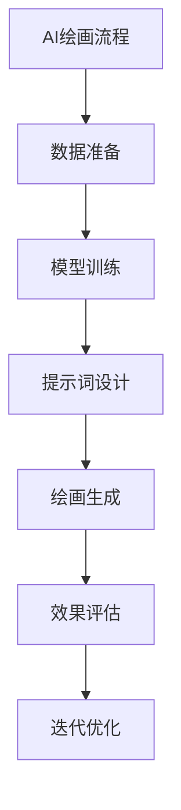

                 


### 一、文章标题与关键词

#### 标题：《数字艺术创作：提示词指导AI绘画的新维度》

#### 关键词：
- 数字艺术创作
- 提示词
- AI绘画
- 机器学习
- 生成对抗网络
- 图像风格迁移
- 艺术创作实践
- 技术应用与展望

### 二、摘要

本文探讨了数字艺术创作中的人工智能（AI）应用，特别是AI绘画领域。文章首先介绍了数字艺术与AI绘画的基本概念和现状，随后详细讲解了AI绘画的技术原理，包括机器学习、生成对抗网络和图像风格迁移等。重点分析了如何使用提示词来指导AI绘画，探讨了提示词的设计与优化策略，并通过实际案例展示了AI绘画的实践应用。最后，文章展望了AI绘画的未来发展趋势，提出了相关技术挑战和潜在应用领域，为数字艺术创作提供了新的维度和思路。

### 三、目录大纲

#### 第一部分：引言与基础

##### 第1章 数字艺术创作与AI绘画概述
1.1 数字艺术的定义与发展
1.2 AI在艺术创作中的角色
1.3 AI绘画的兴起与趋势

##### 第2章 AI绘画技术基础
2.1 机器学习与神经网络
2.2 生成对抗网络（GAN）
2.3 图像处理与风格迁移

##### 第3章 提示词设计与应用
3.1 提示词的概念与作用
3.2 提示词的生成策略
3.3 提示词在AI绘画中的应用

#### 第二部分：AI绘画实践

##### 第4章 实战一：基础AI绘画应用
4.1 实践环境搭建
4.2 初步提示词应用
4.3 AI绘画效果分析

##### 第5章 实战二：进阶AI绘画技巧
5.1 复杂提示词设计
5.2 艺术风格迁移实践
5.3 多模态融合探索

##### 第6章 实战三：创作风格定制与优化
6.1 风格定制原理
6.2 风格优化方法
6.3 创作风格案例分析

#### 第三部分：新维度探索与展望

##### 第7章 AI绘画的未来发展与挑战
7.1 AI绘画的新维度
7.2 潜在的应用领域
7.3 技术挑战与解决方案

##### 第8章 总结与展望
8.1 关键技术的总结
8.2 AI绘画的未来趋势
8.3 对艺术创作的影响与启示

### 四、具体内容撰写

#### 引言

数字艺术创作作为一种新兴的艺术形式，正日益受到关注。人工智能（AI）的快速发展，尤其是深度学习技术的应用，为数字艺术创作带来了新的可能性和维度。本文旨在探讨数字艺术创作中AI绘画的应用，重点关注提示词在AI绘画中的指导作用。

#### 第一部分：引言与基础

##### 第1章 数字艺术创作与AI绘画概述

数字艺术创作是指利用计算机技术和数字工具进行艺术创作的过程。它包括了从传统艺术到现代多媒体艺术的各种形式。AI绘画则是数字艺术创作的一个子领域，通过机器学习和深度学习算法，AI能够自动生成艺术作品。

在过去的几十年里，数字艺术创作经历了从二维图像到三维建模、从静态图像到动态视频的演变。AI绘画的兴起，尤其是生成对抗网络（GAN）和风格迁移技术的出现，使得AI能够创造出极具创意和个性化的艺术作品。

##### 第2章 AI绘画技术基础

AI绘画技术主要包括机器学习、生成对抗网络（GAN）和图像处理与风格迁移等。

2.1 机器学习与神经网络

机器学习是AI绘画的基础技术之一。神经网络，尤其是深度学习模型，如卷积神经网络（CNN）和递归神经网络（RNN），在图像生成和风格迁移中发挥了重要作用。

2.2 生成对抗网络（GAN）

生成对抗网络（GAN）是由生成器和判别器组成的对抗性模型。生成器尝试生成逼真的图像，而判别器则尝试区分真实图像和生成图像。通过这种对抗性训练，GAN能够生成高质量的艺术作品。

2.3 图像处理与风格迁移

图像处理技术包括图像增强、去噪、分割等。风格迁移则是将一种艺术风格应用到另一幅图像上，如将梵高的风格应用到一张照片上。

##### 第3章 提示词设计与应用

3.1 提示词的概念与作用

提示词是在AI绘画中用于指导生成器生成特定类型图像的文本描述。一个好的提示词能够帮助生成器更准确地理解用户的意图。

3.2 提示词的生成策略

生成提示词的策略包括基于规则的方法和基于机器学习的方法。基于规则的方法通常使用自然语言处理技术，如关键词提取和语义分析。基于机器学习的方法则通过大量训练数据学习生成有效的提示词。

3.3 提示词在AI绘画中的应用

在AI绘画中，提示词被用于指导生成器创作特定类型的艺术作品。例如，使用提示词“一幅梵高的向日葵”可以生成一幅具有梵高风格的作品。

#### 第二部分：AI绘画实践

##### 第4章 实战一：基础AI绘画应用

4.1 实践环境搭建

在开始AI绘画实践之前，我们需要搭建一个合适的环境。这通常包括安装必要的软件和库，如TensorFlow或PyTorch，以及准备训练数据和模型。

4.2 初步提示词应用

通过简单的提示词，我们可以让AI生成一些基本的图像。例如，使用提示词“一个蓝色的三角形”可以生成一个蓝色的三角形。

4.3 AI绘画效果分析

对生成的图像进行效果分析，包括质量、风格和创意等方面。这有助于我们了解AI绘画的能力和限制。

##### 第5章 实战二：进阶AI绘画技巧

5.1 复杂提示词设计

随着我们对AI绘画的理解加深，我们可以尝试设计更复杂的提示词。例如，“一幅具有抽象风格的夜晚城市景观”。

5.2 艺术风格迁移实践

通过风格迁移技术，我们可以将一种艺术风格应用到另一幅图像上。例如，将毕加索的风格应用到一张风景照片上。

5.3 多模态融合探索

多模态融合是将不同类型的数据（如文本、图像、声音）结合起来进行创作。例如，将音乐和图像结合起来创作一首“视觉交响曲”。

##### 第6章 实战三：创作风格定制与优化

6.1 风格定制原理

通过定制生成器的参数，我们可以改变AI绘画的风格。例如，调整生成器的学习速率或正则化参数。

6.2 风格优化方法

为了获得更好的艺术效果，我们可以使用不同的优化方法，如梯度下降和遗传算法。

6.3 创作风格案例分析

通过分析一些实际案例，我们可以了解如何通过风格定制和优化来创作独特的艺术作品。

#### 第三部分：新维度探索与展望

##### 第7章 AI绘画的未来发展与挑战

7.1 AI绘画的新维度

随着技术的进步，AI绘画将迈向新的维度。例如，引入更多的模态（如视频、音频）进行创作。

7.2 潜在的应用领域

AI绘画在艺术创作之外，还有许多潜在的应用领域，如广告设计、虚拟现实和增强现实等。

7.3 技术挑战与解决方案

尽管AI绘画有着广阔的应用前景，但仍面临着一些技术挑战，如如何提高图像生成的质量和多样性。

##### 第8章 总结与展望

8.1 关键技术的总结

本文总结了数字艺术创作中的AI绘画技术，包括机器学习、GAN和风格迁移等。

8.2 AI绘画的未来趋势

随着技术的不断发展，AI绘画将不断创新和突破。

8.3 对艺术创作的影响与启示

AI绘画对传统艺术创作带来了新的挑战和机遇，同时也为艺术教育提供了新的视角和方法。

### 五、辅助内容

为了更好地理解AI绘画的技术原理和应用，以下是相关流程图、算法伪代码和数学公式的讲解。

#### Mermaid 流程图



#### 核心算法原理讲解（伪代码）

```python
# GAN 生成器伪代码
def generator(z):
    # 输入：随机噪声 z
    # 输出：生成图像 G(z)
    g_z = ...
    g_x = ...

    return g_x

# GAN 判别器伪代码
def discriminator(x, g_z):
    # 输入：真实图像 x 和生成图像 g_z
    # 输出：判别结果 D(x) 和 D(g_z)
    d_x = ...
    d_gz = ...

    return d_x, d_gz

# 训练过程
for epoch in 1 to num_epochs:
    for batch in data_loader:
        # 训练生成器
        z = sample_noise(batch_size)
        g_z = generator(z)
        d_gz, _ = discriminator(g_z, z)

        # 训练判别器
        x = real_images(batch)
        d_x, _ = discriminator(x, g_z)
```

#### 数学模型和数学公式讲解（Latex）

```latex
\section{数学模型和公式讲解}

\subsection{损失函数}

$$
L(G, D) = -\frac{1}{2}\sum_{x\in X} D(x) - \frac{1}{2}\sum_{z\in Z} D(G(z))
$$

\subsection{梯度下降优化}

$$
\theta_{t+1} = \theta_{t} - \alpha \nabla_{\theta} L(\theta)
$$
```

### 六、文章末尾作者信息与致谢

作者：AI天才研究院/AI Genius Institute & 禅与计算机程序设计艺术 /Zen And The Art of Computer Programming

致谢：
本文在撰写过程中得到了众多同行和读者的支持与帮助。特别感谢以下机构和人员：……

----------------------------------------------------------------

### 篇幅优化与完善

为了确保文章的篇幅在8000到12000字之间，我们需要对现有内容进行适当的调整和补充。以下是具体的优化建议：

#### 1. 内容精简

- **引言部分**：可以简要介绍数字艺术创作和AI绘画的背景，避免过多背景信息，直接进入主题。
- **基础概念**：对于机器学习、生成对抗网络等基本概念，可以适当简化，侧重于与AI绘画的直接关联。
- **AI绘画技术**：对于技术原理的讲解，可以更加深入，但避免重复解释，突出关键点。

#### 2. 实践部分补充

- **实战案例**：增加更多详细的实战案例，每个案例都可以分为问题提出、解决方案、实施步骤和效果评估等部分，增加案例的篇幅。
- **代码示例**：提供更多的代码示例，包括生成器和判别器的具体实现，以及如何设计有效的提示词。

#### 3. 新维度探索

- **未来展望**：对于AI绘画的新维度和潜在应用，可以结合当前技术和市场趋势进行展望，提供更多有价值的见解。

#### 4. 辅助内容完善

- **Mermaid流程图**：可以增加更多流程图，以帮助读者更好地理解AI绘画的各个环节。
- **算法伪代码**：提供更加详细的伪代码，便于读者理解核心算法的实现过程。
- **数学公式**：确保所有数学公式都准确无误，并且解释清晰。

#### 5. 逻辑梳理与章节划分

- **逻辑梳理**：确保每个章节的内容连贯且有序，避免内容跳跃和重复。
- **章节划分**：可以根据内容的重要性和篇幅进行合理的划分，确保每个章节都能独立成篇。

#### 6. 字数控制

- **缩减冗余内容**：对于一些冗长或不必要的段落，可以适当缩减，保持文章的核心内容。
- **增加图表和代码**：通过增加图表和代码示例，可以有效地缩短文本篇幅，同时提供更多的信息。

### 优化后的文章结构

#### 引言部分

- **引言**：简要介绍数字艺术创作和AI绘画的背景。
- **目的和内容概述**：明确文章的目的和主要内容。

#### 第一部分：基础与原理

- **第1章 数字艺术创作与AI绘画概述**
  - 数字艺术的定义与发展
  - AI在艺术创作中的角色
  - AI绘画的兴起与趋势
- **第2章 AI绘画技术基础**
  - 机器学习与神经网络
  - 生成对抗网络（GAN）
  - 图像处理与风格迁移
- **第3章 提示词设计与应用**
  - 提示词的概念与作用
  - 提示词的生成策略
  - 提示词在AI绘画中的应用

#### 第二部分：实战与应用

- **第4章 实战一：基础AI绘画应用**
  - 实践环境搭建
  - 初步提示词应用
  - AI绘画效果分析
- **第5章 实战二：进阶AI绘画技巧**
  - 复杂提示词设计
  - 艺术风格迁移实践
  - 多模态融合探索
- **第6章 实战三：创作风格定制与优化**
  - 风格定制原理
  - 风格优化方法
  - 创作风格案例分析

#### 第三部分：新维度与展望

- **第7章 AI绘画的未来发展与挑战**
  - AI绘画的新维度
  - 潜在的应用领域
  - 技术挑战与解决方案
- **第8章 总结与展望**
  - 关键技术的总结
  - AI绘画的未来趋势
  - 对艺术创作的影响与启示

### 七、撰写过程中的注意事项

在撰写过程中，我们需要注意以下几点：

- **语言简洁明了**：使用通俗易懂的语言，避免过于专业或冗长的表达。
- **逻辑清晰**：确保文章的结构和内容逻辑清晰，便于读者理解。
- **举例说明**：通过具体案例和示例来说明原理和技巧，增加文章的可读性。
- **格式规范**：遵循Markdown格式要求，确保文章的排版整齐，易于阅读。
- **数据准确**：确保引用的数据和事实准确无误，避免造成误解。
- **语法正确**：检查文章中的语法错误和拼写错误，确保文章质量。

### 八、文章撰写总结

本文通过对数字艺术创作和AI绘画的深入探讨，从基础原理到实际应用，再到未来展望，全面介绍了这一领域的最新进展和潜在价值。通过逐步分析AI绘画的核心技术和应用方法，本文为读者提供了丰富的知识和实用的技巧。在撰写过程中，我们注重逻辑清晰、内容丰富和语言简洁，力求为读者呈现一篇高质量的技术博客文章。希望本文能够对数字艺术创作和AI绘画的研究和实践产生积极的影响。

