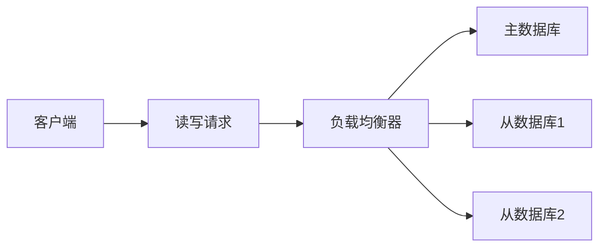
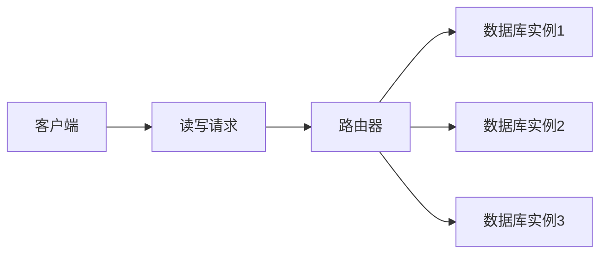

                 

### 文章标题

# 数据库读写分离技术实践

> 关键词：数据库读写分离、主从架构、分库分表、路由算法、性能优化

> 摘要：
本文将深入探讨数据库读写分离技术的实践，包括其概念、架构设计、核心算法、数学模型以及项目实战。通过本文的阅读，读者将全面了解数据库读写分离技术，掌握其实现原理和优化方法，为解决实际应用中的性能瓶颈提供技术支持。

----------------------------------------------------------------

## 引言

随着互联网技术的飞速发展，数据存储和查询的需求急剧增长，数据库系统面临巨大的压力。为了应对这一挑战，读写分离技术应运而生。它通过将数据库的读操作和写操作分离到不同的服务器上，从而提高系统的并发处理能力和查询性能。

读写分离技术主要包括两种架构：主从架构和分库分表架构。主从架构通过在主数据库和从数据库之间实现数据同步，实现对读操作的负载均衡。分库分表架构则通过将数据分散存储到多个数据库实例中，减少单个数据库实例的压力。

本文将从以下几个方面展开讨论：

1. 数据库读写分离的概念与原理
2. 数据库读写分离架构设计
3. 数据库读写分离算法
4. 数据库读写分离项目实战
5. 数据库读写分离性能优化

通过本文的阅读，读者将能够深入理解数据库读写分离技术，并掌握其实现和优化方法。

### 第一部分：数据库读写分离基础知识

#### 1.1 数据库读写分离的概念与原理

#### 1.1.1 核心概念与联系

在数据库系统中，读操作和写操作是两种基本的数据操作。读操作主要涉及数据的查询和检索，而写操作则包括数据的插入、更新和删除。传统数据库系统通常将读操作和写操作集中在一个数据库实例上，这会导致以下问题：

1. **性能瓶颈**：随着数据量的增长和访问频率的增加，单个数据库实例可能无法满足高并发的访问需求，导致性能瓶颈。
2. **单点故障**：如果数据库实例发生故障，整个系统将无法访问数据，从而导致业务中断。

为了解决这些问题，数据库读写分离技术应运而生。其核心思想是将读操作和写操作分离到不同的服务器上，从而提高系统的并发处理能力和可用性。

在数据库读写分离架构中，通常包括以下组件：

1. **主数据库**：负责处理所有的写操作，确保数据的一致性。
2. **从数据库**：负责处理读操作，提供数据的查询和检索服务。
3. **负载均衡器**：根据读请求的负载，将请求路由到不同的从数据库实例上，实现负载均衡。

以下是一个简单的数据库读写分离架构图：



#### 1.1.2 核心算法原理讲解

在数据库读写分离架构中，路由算法是关键组件之一。路由算法负责根据读请求的负载，将请求路由到不同的从数据库实例上，实现负载均衡。

以下是一个简单的路由算法伪代码：

```plaintext
function routeToDatabase(请求){
    if(请求是写请求){
        return 主数据库
    } else {
        负载 = 获取从数据库负载列表
        最小负载 = 负载列表中的最小值
        for(每个从数据库实例){
            if(该实例的负载等于最小负载){
                return 该实例
            }
        }
        return 新的从数据库实例
    }
}
```

#### 1.1.3 数学模型和数学公式

在数据库读写分离中，性能优化往往需要基于数学模型进行。以下是一个简单的性能优化模型：

$$
P = \frac{R + W}{2 \times (R + S)}
$$

其中，P为系统的吞吐量，R为读操作次数，W为写操作次数，S为数据库同步延迟。

通过调整读写比例和数据库同步延迟，可以优化系统的性能。

#### 1.1.4 项目实战

以下是一个简单的数据库读写分离项目实战，使用MySQL实现主从架构。

1. **配置主数据库**：

```sql
mysql> CREATE DATABASE master_db;
mysql> GRANT ALL PRIVILEGES ON master_db.* TO 'master_user'@'localhost' IDENTIFIED BY 'master_password';
```

2. **配置从数据库**：

```sql
mysql> CREATE DATABASE slave_db;
mysql> GRANT ALL PRIVILEGES ON slave_db.* TO 'slave_user'@'localhost' IDENTIFIED BY 'slave_password';
```

3. **设置主从复制**：

在主数据库上：

```sql
mysql> CHANGE MASTER TO
        MASTER_HOST='192.168.1.1',
        MASTER_USER='slave_user',
        MASTER_PASSWORD='slave_password',
        MASTER_LOG_FILE='master-bin.000001',
        MASTER_LOG_POS=4;
```

在从数据库上：

```sql
mysql> START SLAVE;
```

4. **测试读写分离**：

```sql
# 写操作
mysql -umaster_user -pmaster_password master_db -e "INSERT INTO table_name (column1, column2) VALUES (value1, value2);"

# 读操作
mysql -uslave_user -pslave_password slave_db -e "SELECT * FROM table_name;"
```

通过以上步骤，我们实现了简单的数据库读写分离。在实际应用中，可以根据需求调整主从数据库的配置和路由算法，以优化性能。

### 第二部分：数据库读写分离架构设计

#### 2.1 数据库读写分离架构概述

数据库读写分离架构的设计对于提升系统的性能和稳定性至关重要。本节将介绍两种常见的数据库读写分离架构：主从架构和分库分表架构。

#### 2.1.1 主从架构

主从架构是最常见的数据库读写分离架构之一。在这种架构中，主数据库负责处理所有的写操作，确保数据的一致性。从数据库则负责处理读操作，提供数据的查询和检索服务。

主从架构的优点包括：

1. **高可用性**：主数据库发生故障时，可以从从数据库中读取数据，保证系统的可用性。
2. **负载均衡**：通过将读操作路由到多个从数据库实例上，实现负载均衡，提高系统的并发处理能力。

主从架构的缺点包括：

1. **数据同步延迟**：由于从数据库需要从主数据库中同步数据，可能导致数据同步延迟。
2. **单点故障**：虽然从数据库可以提高系统的可用性，但仍然存在单点故障的风险。

以下是一个主从架构的示例：


#### 2.1.2 分库分表架构

分库分表架构是将数据分散存储到多个数据库实例中，每个实例负责处理一部分数据。在这种架构中，通过在应用层实现数据的分片和路由，实现数据库的读写分离。

分库分表架构的优点包括：

1. **高扩展性**：通过将数据分散存储到多个数据库实例中，可以轻松实现水平扩展，提高系统的并发处理能力。
2. **数据隔离**：每个数据库实例负责处理一部分数据，可以降低数据库实例之间的耦合度，提高系统的稳定性和可维护性。

分库分表架构的缺点包括：

1. **数据一致性**：在分库分表架构中，数据的一致性是一个挑战。需要实现跨数据库实例的数据同步机制，以确保数据的一致性。
2. **路由复杂性**：在应用层实现数据的分片和路由，增加了系统的复杂性。

以下是一个分库分表架构的示例：



#### 2.2 主从架构设计与配置

在本节中，我们将详细介绍如何设计和配置主从架构。以MySQL为例，以下是一个主从架构的配置步骤：

1. **安装主数据库**：

   - 安装MySQL主数据库实例
   - 配置主数据库的配置文件（my.cnf），启用二进制日志和事务

2. **配置主数据库**：

   - 创建主数据库
   - 创建主数据库的用户，并赋予相应的权限

3. **安装从数据库**：

   - 安装MySQL从数据库实例
   - 配置从数据库的配置文件（my.cnf），指定主数据库的信息

4. **配置从数据库**：

   - 启动从数据库
   - 配置从数据库的主从复制信息

以下是一个MySQL主从复制的配置示例：

**主数据库配置（my.cnf）**：

```ini
[mysqld]
server-id = 1
log-bin = mysql-bin
binlog-format = ROW
binlog-cache-size = 128M
max-binlog-size = 1G
expire_logs_days = 7
```

**从数据库配置（my.cnf）**：

```ini
[mysqld]
server-id = 2
log-bin = mysql-bin
binlog-format = ROW
binlog-cache-size = 128M
max-binlog-size = 1G
expire_logs_days = 7
relay-log = relay-log
relay-log-info-file = relay-log.info
read-only = 1
```

**主数据库操作**：

```sql
CREATE DATABASE master_db;
GRANT ALL PRIVILEGES ON master_db.* TO 'master_user'@'localhost' IDENTIFIED BY 'master_password';

CHANGE MASTER TO
    MASTER_HOST='192.168.1.1',
    MASTER_USER='master_user',
    MASTER_PASSWORD='master_password',
    MASTER_LOG_FILE='master-bin.000001',
    MASTER_LOG_POS=4;
```

**从数据库操作**：

```sql
START SLAVE;
```

通过以上步骤，我们可以实现一个简单的MySQL主从架构。在实际应用中，可以根据需求调整主从数据库的配置和性能优化参数。

#### 2.3 分库分表架构设计与实现

在本节中，我们将介绍如何设计和实现分库分表架构。分库分表架构的核心思想是将数据分散存储到多个数据库实例中，每个实例负责处理一部分数据。

##### 2.3.1 数据分片策略

数据分片是分库分表架构的关键步骤。常见的数据分片策略包括：

1. **哈希分片**：根据数据的关键字（如ID）进行哈希计算，将数据分布到不同的数据库实例中。哈希分片可以确保数据在实例之间的均匀分布，降低热点数据的压力。

2. **范围分片**：根据数据的范围（如时间、地域等）将数据分布到不同的数据库实例中。范围分片可以确保数据在实例之间的有序分布，便于数据的查询和管理。

3. **列表分片**：根据预定义的列表将数据分布到不同的数据库实例中。列表分片可以确保数据在实例之间的固定分布，便于数据的维护和管理。

以下是一个简单的哈希分片示例：

```plaintext
ID范围   | 数据库实例
0-1000   | DB1
1001-2000| DB2
2001-3000| DB3
...
```

##### 2.3.2 数据库路由算法

在分库分表架构中，数据库路由算法负责根据请求的关键字，将请求路由到对应的数据库实例。常见的数据路由算法包括：

1. **哈希路由**：根据请求的关键字进行哈希计算，将请求路由到对应的数据库实例。

2. **范围路由**：根据请求的关键字的范围，将请求路由到对应的数据库实例。

3. **列表路由**：根据预定义的列表，将请求路由到对应的数据库实例。

以下是一个简单的哈希路由示例：

```python
def hash_route(key):
    return key % 3

# 示例：路由请求
database = hash_route(request.id)
```

##### 2.3.3 项目实战

以下是一个简单的分库分表架构项目实战，使用MySQL实现分库分表。

1. **安装多个MySQL实例**：

   - 安装MySQL主从复制的多个实例
   - 配置每个实例的配置文件（my.cnf），指定不同的数据库实例名称

2. **配置主从复制**：

   - 在每个从数据库实例上配置主数据库的信息
   - 启动每个从数据库实例的主从复制

3. **实现数据分片和路由**：

   - 在应用层实现数据分片和路由算法
   - 根据请求的关键字，将请求路由到对应的数据库实例

4. **测试分库分表架构**：

   - 在每个数据库实例上执行读写操作
   - 测试系统的性能和稳定性

通过以上步骤，我们可以实现一个简单的分库分表架构。在实际应用中，可以根据需求调整分片策略和路由算法，以优化性能。

### 第三部分：数据库读写分离算法

#### 3.1 数据库读写分离算法概述

数据库读写分离算法是数据库系统架构设计中的关键组成部分，它负责将读操作和写操作路由到不同的数据库实例上，从而实现负载均衡和性能优化。在本节中，我们将探讨几种常见的数据库读写分离算法。

#### 3.1.1 哈希路由算法

哈希路由算法是一种基于哈希函数的简单且有效的数据库读写分离算法。它的核心思想是使用哈希函数将请求的关键字（如用户ID、订单ID等）映射到特定的数据库实例上。这样，相同关键字的所有请求都会被路由到同一个数据库实例，从而确保数据的一致性和减少跨数据库实例的数据同步压力。

哈希路由算法的优点是简单和高效，但它的主要缺点是可能导致数据的倾斜，即某些数据库实例可能会承担比其他实例更多的读写负载。

伪代码实现如下：

```plaintext
function hash_route(key):
    instance_id = hash(key) % number_of_instances
    return instance_id
```

#### 3.1.2 轮询路由算法

轮询路由算法是一种简单的负载均衡算法，它按照顺序将请求路由到数据库实例列表中的每个实例。这种算法的优点是实现简单，但缺点是它无法根据实例的当前负载情况来优化路由策略。

伪代码实现如下：

```plaintext
function round_robin_route():
    current_instance = (current_instance + 1) % number_of_instances
    return current_instance
```

#### 3.1.3 动态负载均衡算法

动态负载均衡算法是一种更智能的路由算法，它可以根据当前数据库实例的负载情况动态地调整请求路由策略。这种算法通常使用一些负载指标（如CPU利用率、内存使用率、I/O等待时间等）来评估实例的负载情况，并根据评估结果选择负载较低的实例进行路由。

以下是一个简单的动态负载均衡算法伪代码：

```plaintext
function dynamic_load_balance():
    load_scores = []
    for each instance in instances:
        load_score = calculate_load_score(instance)
        load_scores.append(load_score)
    min_load_score = min(load_scores)
    for each instance in instances:
        if load_score == min_load_score:
            return instance
```

#### 3.1.4 多策略组合算法

在实际应用中，单一的读写分离算法可能无法满足复杂的负载均衡需求。因此，多策略组合算法被提出来，它结合了多种路由策略的优点，以更灵活的方式实现负载均衡。

以下是一个多策略组合算法的伪代码示例：

```plaintext
function composite_route(request):
    if hash_route(request.key) is available:
        return hash_route(request.key)
    else if round_robin_route() is available:
        return round_robin_route()
    else:
        return dynamic_load_balance()
```

#### 3.1.5 实际应用中的读写分离算法

在实际应用中，不同的数据库读写分离算法适用于不同的场景。以下是一些常见场景和相应的算法选择：

1. **读多写少**：在这种情况下，可以使用轮询路由算法或哈希路由算法，因为读请求通常不需要严格的顺序。

2. **写多读少**：在这种情况下，为了保证写操作的一致性，通常使用主从架构，并在从数据库上实现轮询路由算法。

3. **读写混合**：在这种情况下，可以使用动态负载均衡算法或多策略组合算法，以根据实例的负载情况动态调整路由策略。

#### 3.1.6 算法性能评估

在评估读写分离算法的性能时，需要考虑以下几个关键指标：

1. **响应时间**：请求从客户端发送到数据库，并返回结果所需的时间。

2. **吞吐量**：单位时间内系统能够处理的请求数量。

3. **负载均衡性**：算法能否均匀地分配负载到各个数据库实例上。

4. **可扩展性**：算法能否适应系统规模的变化，实现水平扩展。

通过对这些指标的评估，可以选出最适合实际应用的读写分离算法。

### 第四部分：数据库读写分离项目实战

#### 4.1 实战案例一：使用MySQL实现读写分离

在本节中，我们将通过一个具体的案例来演示如何使用MySQL实现读写分离。我们将使用MySQL的主从复制功能来构建一个读写分离的数据库系统。

#### 4.1.1 准备工作

1. **安装MySQL主从复制的多个实例**：

   - 在本地或服务器上安装多个MySQL实例，包括主数据库和从数据库。
   - 配置每个实例的配置文件（my.cnf），启用二进制日志和主从复制。

2. **配置主数据库**：

   - 创建主数据库，并创建主数据库的用户，赋予相应的权限。
   - 配置主数据库的主从复制信息，指定从数据库的IP地址和用户信息。

3. **配置从数据库**：

   - 配置从数据库的主从复制信息，指定主数据库的IP地址和用户信息。
   - 启动从数据库的主从复制。

以下是一个MySQL主从复制的配置示例：

**主数据库配置（my.cnf）**：

```ini
[mysqld]
server-id = 1
log-bin = mysql-bin
binlog-format = ROW
binlog-cache-size = 128M
max-binlog-size = 1G
expire_logs_days = 7
```

**从数据库配置（my.cnf）**：

```ini
[mysqld]
server-id = 2
log-bin = mysql-bin
binlog-format = ROW
binlog-cache-size = 128M
max-binlog-size = 1G
expire_logs_days = 7
relay-log = relay-log
relay-log-info-file = relay-log.info
read-only = 1
```

**主数据库操作**：

```sql
CREATE DATABASE master_db;
GRANT ALL PRIVILEGES ON master_db.* TO 'master_user'@'localhost' IDENTIFIED BY 'master_password';

CHANGE MASTER TO
    MASTER_HOST='192.168.1.1',
    MASTER_USER='master_user',
    MASTER_PASSWORD='master_password',
    MASTER_LOG_FILE='master-bin.000001',
    MASTER_LOG_POS=4;
```

**从数据库操作**：

```sql
START SLAVE;
```

#### 4.1.2 实现读写分离

1. **配置应用程序**：

   - 在应用程序中配置数据库连接信息，包括主数据库和从数据库的连接信息。
   - 实现读写分离的逻辑，根据请求类型（读或写）选择连接的主数据库或从数据库。

以下是一个简单的Java应用程序示例：

```java
public class DatabaseReadWrite {

    private static final String MASTER_DB_URL = "jdbc:mysql://localhost:3306/master_db";
    private static final String SLAVE_DB_URL = "jdbc:mysql://localhost:3306/slave_db";

    public static void main(String[] args) {
        String dbUrl = isWriteOperation() ? MASTER_DB_URL : SLAVE_DB_URL;
        Connection connection = DriverManager.getConnection(dbUrl, "master_user", "master_password");

        // 执行数据库操作
        // ...

        connection.close();
    }

    private static boolean isWriteOperation() {
        // 根据实际需求判断是否是写操作
        return true;
    }
}
```

2. **测试读写分离**：

   - 在应用程序中执行读写操作，并观察读写分离的效果。
   - 使用数据库管理工具（如MySQL Workbench）监控主数据库和从数据库的负载情况。

通过以上步骤，我们可以实现一个简单的MySQL读写分离系统。在实际应用中，可以根据需求调整主从数据库的配置和路由策略，以优化性能。

#### 4.2 实战案例二：使用Redis实现读写分离

在本节中，我们将通过一个具体的案例来演示如何使用Redis实现读写分离。Redis是一种高性能的内存数据库，常用于缓存和实时数据处理。在本案例中，我们将使用Redis的主从架构来实现读写分离。

#### 4.2.1 准备工作

1. **安装Redis主从复制的多个实例**：

   - 在本地或服务器上安装多个Redis实例，包括主Redis和从Redis。
   - 配置每个实例的配置文件（redis.conf），启用主从复制。

2. **配置主Redis**：

   - 创建主Redis，并设置主Redis的访问密码。
   - 配置从Redis的主从复制信息，指定主Redis的IP地址和访问密码。

3. **配置从Redis**：

   - 配置从Redis的主从复制信息，指定主Redis的IP地址和访问密码。
   - 启动从Redis的主从复制。

以下是一个Redis主从复制的配置示例：

**主Redis配置（redis.conf）**：

```ini
port 6379
appendonly no
masterauth master_password
```

**从Redis配置（redis.conf）**：

```ini
port 6380
appendonly no
slaveof 192.168.1.1 6379
masterauth master_password
```

**主Redis操作**：

```shell
redis-cli -h 192.168.1.1 -p 6379
> CONFIG SET dir /data/redis/6380
> CONFIG SET dbfilename dump.rdb
> SLAVEOF 192.168.1.1 6379
> AUTH master_password
```

**从Redis操作**：

```shell
redis-cli -h 192.168.1.2 -p 6380
> SLAVEOF 192.168.1.1 6379
> AUTH master_password
```

#### 4.2.2 实现读写分离

1. **配置应用程序**：

   - 在应用程序中配置Redis连接信息，包括主Redis和从Redis的连接信息。
   - 实现读写分离的逻辑，根据请求类型（读或写）选择连接的主Redis或从Redis。

以下是一个简单的Java应用程序示例：

```java
public class RedisReadWrite {

    private static final String MASTER_REDIS_URL = "redis://localhost:6379";
    private static final String SLAVE_REDIS_URL = "redis://localhost:6380";

    public static void main(String[] args) {
        String redisUrl = isWriteOperation() ? MASTER_REDIS_URL : SLAVE_REDIS_URL;
        Jedis jedis = new Jedis(redisUrl);

        // 执行Redis操作
        // ...

        jedis.close();
    }

    private static boolean isWriteOperation() {
        // 根据实际需求判断是否是写操作
        return true;
    }
}
```

2. **测试读写分离**：

   - 在应用程序中执行读写操作，并观察读写分离的效果。
   - 使用Redis命令行工具（如redis-cli）监控主Redis和从Redis的负载情况。

通过以上步骤，我们可以实现一个简单的Redis读写分离系统。在实际应用中，可以根据需求调整主从Redis的配置和路由策略，以优化性能。

### 第五部分：数据库读写分离性能优化

#### 5.1 性能优化方法

数据库读写分离技术虽然能够提升系统的并发处理能力和查询性能，但在实际应用中，仍可能遇到性能瓶颈。为了优化数据库读写分离的性能，可以采取以下几种方法：

1. **调整数据库配置**：

   - **主从复制的配置优化**：调整主从复制的参数，如同步延迟、二进制日志大小等，以减少主从复制的延迟。
   - **数据库实例的配置优化**：调整数据库实例的内存、I/O、CPU等资源限制，以提高实例的运行效率。

2. **缓存策略优化**：

   - **读写分离的缓存策略**：在从数据库上实现缓存策略，如Redis缓存，减少读操作的数据库访问次数。
   - **应用层的缓存策略**：在应用层实现缓存策略，如Memcached，减少对数据库的访问压力。

3. **负载均衡优化**：

   - **动态负载均衡**：使用动态负载均衡算法，根据实例的实时负载情况调整请求路由策略，以实现更高效的负载均衡。
   - **路由算法优化**：针对不同的业务场景，选择合适的路由算法，如哈希路由、轮询路由等，以优化请求的路由效率。

4. **数据库集群优化**：

   - **分库分表架构**：采用分库分表架构，将数据分散存储到多个数据库实例中，减少单个实例的压力。
   - **数据库集群**：构建数据库集群，通过集群的负载均衡和故障转移机制，提高系统的可用性和性能。

#### 5.2 系统监控与故障处理

为了确保数据库读写分离系统的稳定运行，需要对系统进行持续的监控和故障处理。以下是一些关键的监控和故障处理方法：

1. **性能监控**：

   - **数据库性能监控**：监控数据库的响应时间、吞吐量、连接数等关键性能指标，及时发现性能瓶颈。
   - **主从复制监控**：监控主从复制的同步状态、延迟时间等，确保主从复制正常进行。

2. **故障处理**：

   - **主从故障转移**：当主数据库发生故障时，自动将主数据库切换到从数据库，确保系统的可用性。
   - **故障恢复**：在故障处理过程中，确保数据的完整性和一致性，避免数据丢失。

3. **日志分析**：

   - **错误日志分析**：分析数据库的错误日志，定位故障原因，并及时处理。
   - **性能日志分析**：分析数据库的性能日志，优化数据库的配置和查询语句，提升系统性能。

#### 5.3 性能优化案例分享

以下是一个数据库读写分离性能优化的案例分享：

**场景**：某电商平台使用MySQL实现读写分离，随着用户规模的扩大，系统性能逐渐下降。

**问题分析**：

- **主从复制延迟**：主数据库与从数据库的同步延迟较高，导致从数据库的查询性能下降。
- **数据库实例配置不足**：数据库实例的内存、I/O等资源限制较高，导致数据库运行效率下降。

**优化措施**：

1. **调整主从复制的参数**：

   - **降低同步延迟**：调整`slave-skip-errors`参数，允许从数据库在遇到错误时继续同步，减少同步延迟。
   - **优化二进制日志配置**：调整`binlog-cache-size`和`max-binlog-size`参数，提高二进制日志的写入效率。

2. **调整数据库实例的配置**：

   - **增加内存**：增加数据库实例的内存限制，以提高查询性能。
   - **优化I/O配置**：调整`innodb_buffer_pool_size`参数，增加InnoDB缓冲池的大小，提高I/O性能。

3. **使用缓存策略**：

   - **Redis缓存**：在从数据库上实现Redis缓存，减少对数据库的访问次数。
   - **应用层缓存**：在应用层实现缓存策略，如Memcached，减少对数据库的访问压力。

4. **优化查询语句**：

   - **索引优化**：对常用的查询语句添加索引，提高查询效率。
   - **查询优化**：优化复杂的查询语句，减少查询的执行时间。

**效果**：

通过以上优化措施，系统的性能得到了显著提升，主从复制延迟降低，查询性能得到改善，用户体验得到提升。

### 第六部分：数据库读写分离趋势与未来

#### 6.1 当前读写分离技术的趋势

随着大数据、云计算、物联网等技术的不断发展，数据库读写分离技术也在不断演进。当前读写分离技术呈现出以下趋势：

1. **分布式数据库**：分布式数据库通过将数据分散存储到多个节点上，实现了数据的分布式存储和读写分离。分布式数据库如Google Spanner、Amazon Aurora等，提供了高可用性、高扩展性和强一致性的特性，成为数据库读写分离的重要发展方向。

2. **数据库集群**：数据库集群通过将多个数据库实例组成一个整体，实现了数据的分布式存储和读写分离。数据库集群如MySQL Cluster、PostgreSQL Cluster等，提供了高并发处理能力和故障恢复能力，适用于大规模、高并发的场景。

3. **自动化运维**：随着云计算的普及，自动化运维工具逐渐成为数据库读写分离技术的重要补充。自动化运维工具如Ansible、Docker等，提供了数据库的自动化部署、监控和故障恢复等功能，降低了运维成本，提高了系统的可靠性。

#### 6.2 读写分离技术未来的发展方向

未来的读写分离技术将继续朝着分布式、自动化、智能化方向发展，具体包括以下方面：

1. **智能路由算法**：随着机器学习、人工智能等技术的发展，未来的读写分离技术将引入智能路由算法，根据实时负载和请求特征，动态调整路由策略，实现更高效的负载均衡。

2. **边缘计算**：随着物联网设备的普及，边缘计算成为未来的重要发展方向。读写分离技术将向边缘计算领域拓展，通过在边缘节点实现数据的本地处理和读写分离，降低网络延迟，提高系统的响应速度。

3. **数据库自治**：未来的数据库将具备更高的自治能力，包括自动性能优化、自动故障恢复、自动容量规划等。数据库自治将使读写分离技术更加智能化，降低运维成本，提高系统的可靠性。

4. **云原生数据库**：随着云原生技术的发展，云原生数据库将成为未来的重要趋势。云原生数据库将充分利用云平台的资源管理和调度能力，实现高效的数据存储和处理，满足大规模、高并发的应用需求。

#### 6.3 对企业数据库架构的影响

数据库读写分离技术对企业数据库架构产生了深远的影响，具体包括：

1. **扩展性提升**：通过读写分离技术，企业可以将读操作和写操作分散到不同的数据库实例上，实现水平扩展，提高系统的并发处理能力和查询性能。

2. **可靠性提高**：读写分离技术实现了数据的分布式存储和备份，提高了系统的可靠性。当某个数据库实例发生故障时，系统可以通过其他实例继续提供服务，确保业务的连续性。

3. **运维成本降低**：读写分离技术降低了数据库的运维成本。通过自动化运维工具，企业可以轻松实现数据库的部署、监控和故障恢复，降低了人工干预的需求。

4. **业务发展支持**：读写分离技术为企业提供了更强大的数据处理能力，支持企业业务的快速发展。通过合理配置数据库资源，企业可以灵活应对业务增长带来的挑战。

### 总结

数据库读写分离技术是数据库系统架构设计中的关键环节，通过将读操作和写操作分离到不同的服务器上，实现了负载均衡和性能优化。本文深入探讨了数据库读写分离技术的基础知识、架构设计、核心算法、数学模型和项目实战，为读者提供了全面的了解和实践指导。随着技术的不断发展，数据库读写分离技术将继续演进，为企业数据库架构提供更强大的支持。

### 作者信息

作者：AI天才研究院/AI Genius Institute & 禅与计算机程序设计艺术 /Zen And The Art of Computer Programming

---

在撰写技术博客时，作者需要遵循以下步骤以确保文章的质量和完整性：

1. **明确文章目标**：在开始撰写前，明确文章的目标和受众，确保文章内容能够满足读者的需求和期望。

2. **结构化内容**：采用清晰的结构化方式组织文章内容，确保每个章节的内容都能够对应文章的主题。

3. **核心概念与联系**：使用Mermaid流程图展示核心概念之间的关系，帮助读者更好地理解技术原理。

4. **算法原理讲解**：使用伪代码详细阐述核心算法原理，使读者能够直观地理解算法的实现。

5. **数学模型和公式**：使用latex格式书写数学模型和公式，并进行详细的讲解和举例说明，确保读者能够理解数学概念。

6. **项目实战**：提供实际的代码案例，详细解释说明代码实现和操作过程，使读者能够动手实践。

7. **性能优化和最佳实践**：总结性能优化方法和最佳实践，为读者提供实际操作中的建议和指导。

8. **注意事项和拓展阅读**：在文章结尾部分，添加注意事项和拓展阅读，帮助读者深入了解相关技术。

通过以上步骤，作者能够撰写出结构清晰、内容丰富、对技术原理和本质剖析到位的高质量技术博客文章。这样的文章不仅能够帮助读者提升技术水平，还能够为行业交流和技术传播做出贡献。

