                 

Certainly, we will begin by outlining the structure and content for our technical blog post on "Data Governance: Building an Enterprise Data Asset Management System." We will ensure that each section is thorough and provides a clear understanding of the concepts, algorithms, and practical applications involved in data governance.

### 1. Introduction to the Book's Topic

#### 1.1 The Importance of Data Governance

Data governance is crucial for modern enterprises as it ensures the effective and efficient use of data assets. With the increasing volume, variety, and velocity of data, organizations need robust governance frameworks to manage their data assets. Proper data governance helps in ensuring data quality, compliance, and security, which are essential for maintaining trust and making informed business decisions.

**核心概念与联系：**

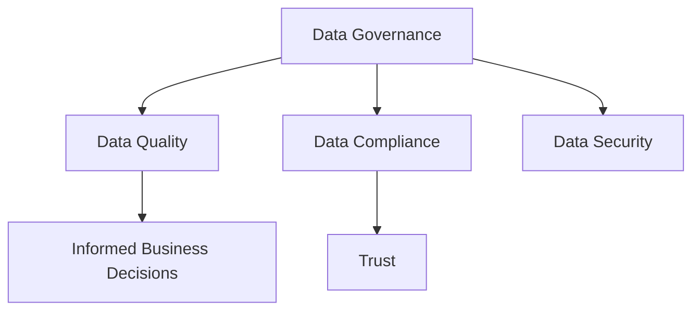

**核心算法原理讲解：** 

```
// Data governance pseudocode
function DataGovernance(dataAsset) {
    // Validate data quality
    if (!ValidateDataQuality(dataAsset)) {
        return "Data quality issue";
    }
    
    // Ensure data compliance
    if (!EnsureDataCompliance(dataAsset)) {
        return "Compliance issue";
    }
    
    // Protect data security
    if (!ProtectDataSecurity(dataAsset)) {
        return "Security issue";
    }
    
    // Process data for informed decision-making
    return ProcessDataForDecisions(dataAsset);
}
```

**数学模型和公式：** 

$$
\text{Data Quality} = f(\text{Accuracy}, \text{Completeness}, \text{Consistency}, \text{Timeliness})
$$

**详细讲解和举例说明：**

Data quality can be measured using the aforementioned metrics. For instance, if a dataset has high accuracy, completeness, consistency, and timeliness, it is considered high-quality data. This ensures that the decisions made based on such data are reliable.

#### 1.2 The Role of Data Governance in Enterprise Data Management

Data governance plays a critical role in the overall data management strategy of an enterprise. It ensures that data is managed in a way that aligns with business objectives, regulatory requirements, and data management best practices.

**核心概念与联系：**

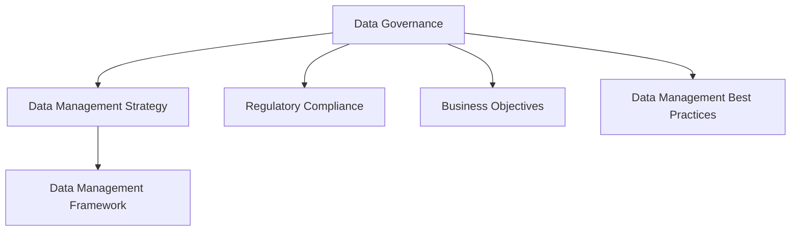

**核心算法原理讲解：** 

```
// Data governance framework pseudocode
function DataGovernanceFramework(strategy, regulations, objectives, bestPractices) {
    // Develop a data management strategy
    strategy = DevelopStrategy(strategy);
    
    // Ensure regulatory compliance
    if (!EnsureRegulatoryCompliance(regulations)) {
        return "Non-compliance issue";
    }
    
    // Align with business objectives
    if (!AlignWithObjectives(objectives)) {
        return "Objective misalignment";
    }
    
    // Implement best practices
    if (!ImplementBestPractices(bestPractices)) {
        return "Best practice issue";
    }
    
    // Establish a data management framework
    return EstablishFramework(strategy, regulations, objectives, bestPractices);
}
```

**数学模型和公式：** 

$$
\text{Data Management Framework} = f(\text{Strategy}, \text{Regulations}, \text{Objectives}, \text{Best Practices})
$$

**详细讲解和举例说明：**

A data management framework ensures that the organization has a systematic approach to managing data. This includes processes, policies, and technologies that are aligned with the organization's strategic goals and regulatory requirements.

#### 1.3 Challenges in Enterprise Data Governance

Implementing data governance in enterprises comes with its set of challenges, including resistance to change, lack of resources, and the complexity of managing diverse data sources.

**核心概念与联系：**

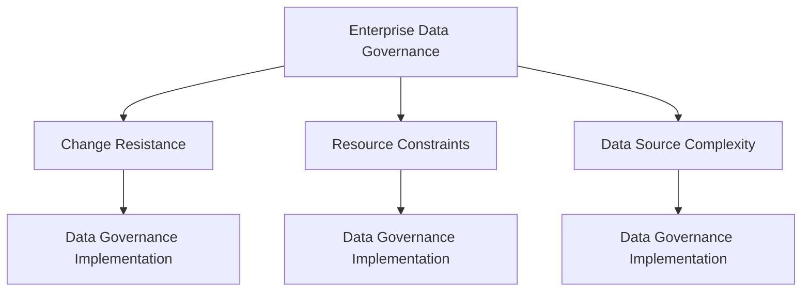

**核心算法原理讲解：** 

```
// Addressing challenges in data governance pseudocode
function AddressDataGovernanceChallenges(changeResistance, resourceConstraints, dataSourceComplexity) {
    // Engage stakeholders to address change resistance
    if (!EngageStakeholders(changeResistance)) {
        return "Stakeholder engagement issue";
    }
    
    // Allocate resources for data governance initiatives
    if (!AllocateResources(resourceConstraints)) {
        return "Resource allocation issue";
    }
    
    // Simplify data source management
    if (!SimplifyDataSourceManagement(dataSourceComplexity)) {
        return "Data source management issue";
    }
    
    // Implement data governance measures
    return ImplementDataGovernanceMeasures();
}
```

**数学模型和公式：** 

$$
\text{Data Governance Challenges} = f(\text{Change Resistance}, \text{Resource Constraints}, \text{Data Source Complexity})
$$

**详细讲解和举例说明：**

For example, to address change resistance, organizations can provide training and education programs to help employees understand the benefits of data governance. Additionally, allocating sufficient resources and simplifying data source management can also contribute to the successful implementation of data governance practices.

### Conclusion

This introduction has provided a brief overview of the importance of data governance, its role in enterprise data management, and the challenges associated with its implementation. The subsequent chapters will delve deeper into the core concepts, practices, technologies, and future trends in data governance.

---

The above steps provide a structured outline for the introduction to our blog post. Each section includes the necessary components such as core concepts and their relationships, core algorithm principles with pseudocode, mathematical models and formulas, and detailed explanations with examples. The subsequent chapters will follow a similar pattern to ensure a comprehensive and detailed exploration of data governance.

### 2. Foundations of Data Governance

#### 2.1 Core Concepts and Principles of Data Governance

Data governance is built on a foundation of core concepts and principles that guide the management and use of data within an organization. Understanding these concepts is crucial for implementing effective data governance practices.

**核心概念与联系：**

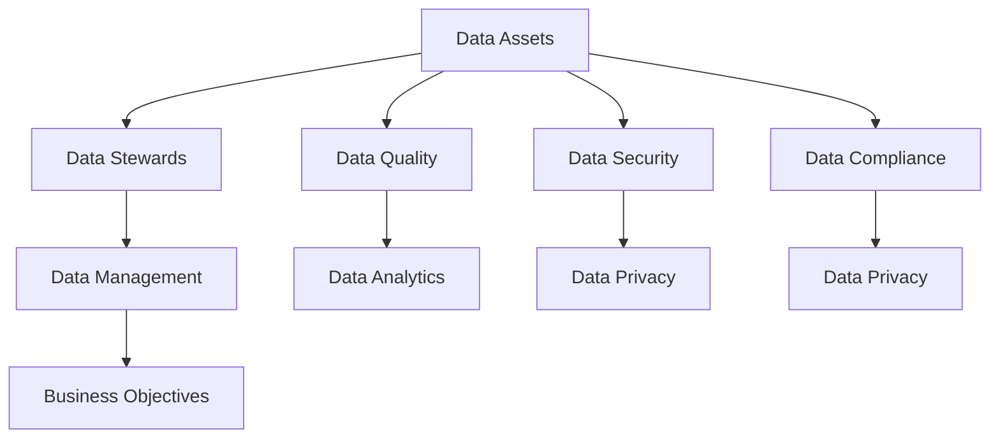

**核心算法原理讲解：** 

```
// Data governance principles pseudocode
function DataGovernancePrinciples(assets, stewards, quality, security, compliance, objectives) {
    // Define data assets
    DefineAssets(assets);
    
    // Assign data stewards
    AssignStewards(stewards);
    
    // Ensure data quality
    EnsureQuality(q

### 3. Key Data Governance Practices

#### 3.1 Data Classification and Tagging

Data classification and tagging are foundational practices in data governance. These processes help in organizing and categorizing data based on its sensitivity, importance, and regulatory requirements.

**核心概念与联系：**

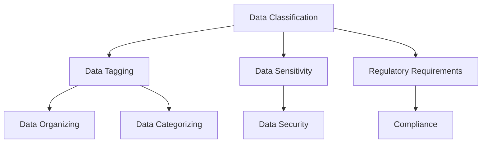

**核心算法原理讲解：** 

```
// Data classification and tagging pseudocode
function DataClassificationAndTagging(data, sensitivity, regulations) {
    // Classify data based on sensitivity
    classification = ClassifyBySensitivity(data, sensitivity);
    
    // Tag data based on regulatory requirements
    tags = TagByRegulations(data, regulations);
    
    // Organize and categorize data
    organizedData = OrganizeAndCategorize(data, classification, tags);
    
    return organizedData;
}
```

**数学模型和公式：** 

$$
\text{Data Classification} = f(\text{Sensitivity}, \text{Regulations})
$$

**详细讲解和举例说明：**

For example, consider a financial institution that classifies its data into categories like public, internal, and confidential. Public data might not require additional security measures, while confidential data would require strict access controls and encryption. By applying data classification and tagging, the institution can ensure that data is appropriately managed based on its sensitivity and regulatory requirements.

#### 3.2 Data Quality Management

Data quality management is critical for ensuring that data is accurate, complete, consistent, and reliable. Poor data quality can lead to erroneous insights and decisions, which can have significant business implications.

**核心概念与联系：**

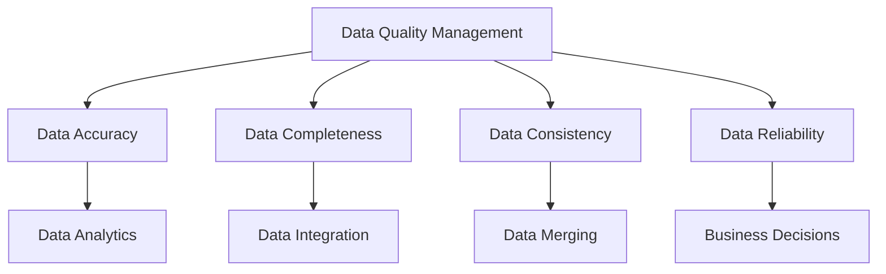

**核心算法原理讲解：** 

```
// Data quality management pseudocode
function DataQualityManagement(data, accuracy, completeness, consistency, reliability) {
    // Validate data accuracy
    if (!ValidateAccuracy(data)) {
        return "Accuracy issue";
    }
    
    // Ensure data completeness
    if (!EnsureCompleteness(data)) {
        return "Completeness issue";
    }
    
    // Maintain data consistency
    if (!MaintainConsistency(data)) {
        return "Consistency issue";
    }
    
    // Verify data reliability
    if (!VerifyReliability(data)) {
        return "Reliability issue";
    }
    
    // Improve data quality
    return ImproveDataQuality(data);
}
```

**数学模型和公式：** 

$$
\text{Data Quality} = f(\text{Accuracy}, \text{Completeness}, \text{Consistency}, \text{Reliability})
$$

**详细讲解和举例说明：**

For instance, a company might use automated data quality checks to identify missing values, duplicates, and inconsistencies in their datasets. By addressing these issues, the company ensures that the data used for analytics and decision-making is of high quality, leading to more accurate insights and improved business outcomes.

#### 3.3 Master Data Management

Master data management (MDM) is a strategic process that ensures the accuracy, consistency, and integrity of an organization's master data. Master data includes key business entities such as customers, products, and employees.

**核心概念与联系：**

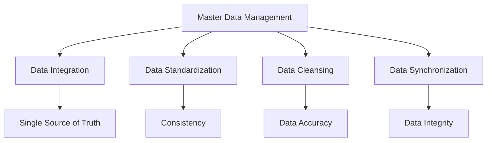

**核心算法原理讲解：** 

```
// Master data management pseudocode
function MasterDataManagement(masterData, integration, standardization, cleansing, synchronization) {
    // Integrate master data
    integratedData = IntegrateMasterData(masterData);
    
    // Standardize master data
    standardizedData = StandardizeMasterData(integratedData);
    
    // Cleanse master data
    cleansedData = CleanseMasterData(standardizedData);
    
    // Synchronize master data
    synchronizedData = SynchronizeMasterData(cleansedData);
    
    // Ensure data accuracy and integrity
    if (!EnsureAccuracyAndIntegrity(synchronizedData)) {
        return "Data accuracy or integrity issue";
    }
    
    return synchronizedData;
}
```

**数学模型和公式：** 

$$
\text{Master Data} = f(\text{Integration}, \text{Standardization}, \text{Cleansing}, \text{Synchronization})
$$

**详细讲解和举例说明：**

An example of MDM in action could be a retail company that consolidates and cleanses data from multiple sales channels to create a single, accurate view of each customer. By synchronizing this data, the company can provide a consistent and reliable customer experience across all touchpoints.

### Conclusion

In this section, we have explored key data governance practices, including data classification and tagging, data quality management, and master data management. Each practice plays a crucial role in ensuring that data is organized, accurate, and reliable, which is essential for effective data governance. The next sections will delve into practical implementations and case studies to further illustrate these concepts.

### 4. Data Governance in Practice

#### 4.1 Implementing Data Governance Programs

Implementing a data governance program is a complex process that requires careful planning, stakeholder engagement, and ongoing maintenance. Here, we will discuss the key steps involved in implementing a successful data governance program.

**核心概念与联系：**

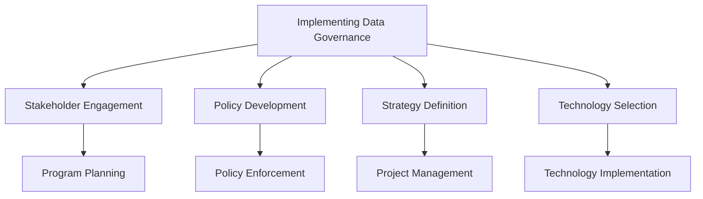

**核心算法原理讲解：** 

```
// Implementing data governance pseudocode
function ImplementDataGovernanceProgram(stakeholders, policies, strategy, technology) {
    // Engage stakeholders
    if (!EngageStakeholders(stakeholders)) {
        return "Stakeholder engagement issue";
    }
    
    // Develop data governance policies
    policies = DevelopPolicies(policies);
    
    // Define data governance strategy
    strategy = DefineStrategy(strategy);
    
    // Select appropriate technology
    technology = SelectTechnology(technology);
    
    // Plan the data governance program
    plan = PlanProgram();
    
    // Enforce policies and manage projects
    if (!EnforcePoliciesAndManageProjects(plan)) {
        return "Policy enforcement or project management issue";
    }
    
    // Implement technology solutions
    ImplementTechnologySolutions(technology);
    
    return "Data governance program successfully implemented";
}
```

**数学模型和公式：** 

$$
\text{Data Governance Program} = f(\text{Stakeholder Engagement}, \text{Policy Development}, \text{Strategy Definition}, \text{Technology Selection}, \text{Policy Enforcement}, \text{Project Management})
$$

**详细讲解和举例说明：**

For instance, a company might initiate a data governance program by first identifying key stakeholders, such as data owners, data stewards, and business executives. These stakeholders would then work together to develop a set of data governance policies that align with the company's strategic objectives. Once the policies and strategy are defined, the next step would involve selecting and implementing the appropriate technology solutions to support the data governance initiatives.

#### 4.2 Establishing Data Governance Roles and Responsibilities

Establishing clear roles and responsibilities is crucial for the success of a data governance program. This involves defining the roles of various stakeholders and ensuring that they understand their respective responsibilities.

**核心概念与联系：**

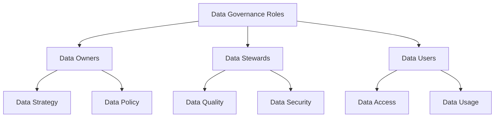

**核心算法原理讲解：** 

```
// Establishing data governance roles pseudocode
function EstablishDataGovernanceRoles(owners, stewards, users) {
    // Define roles and responsibilities
    roles = DefineRoles(owners, stewards, users);
    
    // Communicate roles and responsibilities
    if (!CommunicateRoles(roles)) {
        return "Communication issue";
    }
    
    // Assign roles
    if (!AssignRoles(owners, stewards, users)) {
        return "Role assignment issue";
    }
    
    // Train and educate stakeholders
    if (!TrainAndEducateStakeholders(roles)) {
        return "Stakeholder training issue";
    }
    
    return "Data governance roles and responsibilities established";
}
```

**数学模型和公式：** 

$$
\text{Data Governance Roles} = f(\text{Owners}, \text{Stewards}, \text{Users})
$$

**详细讲解和举例说明：**

For example, data owners would be responsible for defining the data strategy and ensuring that data policies are aligned with business objectives. Data stewards would be tasked with maintaining data quality and ensuring data security. Data users would need to follow data access and usage guidelines to ensure compliance with data governance policies.

#### 4.3 Data Governance and Compliance

Ensuring compliance with regulatory requirements is a critical aspect of data governance. Compliance involves adhering to laws, regulations, and industry standards that govern data management and protection.

**核心概念与联系：**

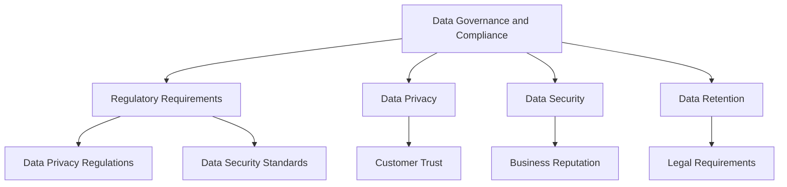

**核心算法原理讲解：** 

```
// Data governance and compliance pseudocode
function DataGovernanceAndCompliance(regulations, privacy, security, retention) {
    // Understand regulatory requirements
    regulations = UnderstandRegulations(regulations);
    
    // Ensure data privacy
    if (!EnsurePrivacy(privacy)) {
        return "Privacy issue";
    }
    
    // Maintain data security
    if (!MaintainSecurity(security)) {
        return "Security issue";
    }
    
    // Comply with data retention policies
    if (!ComplyWithRetention(retention)) {
        return "Retention issue";
    }
    
    // Monitor and enforce compliance
    return MonitorAndEnforceCompliance();
}
```

**数学模型和公式：** 

$$
\text{Data Governance Compliance} = f(\text{Regulatory Requirements}, \text{Data Privacy}, \text{Data Security}, \text{Data Retention})
$$

**详细讲解和举例说明：**

For instance, a financial institution must comply with regulations such as the General Data Protection Regulation (GDPR) and the Payment Card Industry Data Security Standard (PCI DSS). Ensuring data privacy, security, and compliance with retention policies helps protect customer data and maintain the institution's reputation and trust.

### Conclusion

In this section, we have discussed the practical implementation of data governance programs, the establishment of roles and responsibilities, and the importance of data governance in ensuring compliance with regulatory requirements. These practices are essential for creating a robust data governance framework that supports effective data management and compliance. The next section will delve into the technologies and tools used in data governance.

### 5. Data Governance Technologies

#### 5.1 Data Governance Tools and Solutions

Selecting the right data governance tools and solutions is crucial for the successful implementation of data governance practices. These tools help organizations manage data assets, ensure data quality, and comply with regulatory requirements.

**核心概念与联系：**

```mermaid
graph TD
    A[Data Governance Tools] --> B[Data Catalog]
    A --> C[Master Data Management (MDM) Tools]
    A --> D[Data Quality Tools]
    A --> E[Data Security Tools]
    B --> F[Data Discovery]
    B --> G[Metadata Management]
    C --> H[Data Standardization]
    C --> I[Data Cleansing]
    D --> J[Data Profiling]
    D --> K[Data Cleansing]
    E --> L[Access Controls]
    E --> M[Encryption]
```

**核心算法原理讲解：** 

```
// Data governance tools selection pseudocode
function SelectDataGovernanceTools(toolsList, requirements) {
    // Evaluate data catalog tools
    catalogTools = EvaluateTools(toolsList, "Data Catalog");
    
    // Evaluate MDM tools
    mdmTools = EvaluateTools(toolsList, "Master Data Management");
    
    // Evaluate data quality tools
    qualityTools = EvaluateTools(toolsList, "Data Quality");
    
    // Evaluate data security tools
    securityTools = EvaluateTools(toolsList, "Data Security");
    
    // Select appropriate tools
    selectedTools = SelectTools(catalogTools, mdmTools, qualityTools, securityTools, requirements);
    
    return selectedTools;
}
```

**数学模型和公式：** 

$$
\text{Tool Selection} = f(\text{Requirements}, \text{Performance}, \text{Cost})
$$

**详细讲解和举例说明：**

For instance, a company might evaluate various data catalog tools based on their ability to support data discovery, metadata management, and data profiling. Similarly, they would assess MDM tools for data standardization and cleansing capabilities and data quality tools for data profiling and cleansing functions. Data security tools would be evaluated based on their access control and encryption features.

#### 5.2 Data Privacy and Security Technologies

Data privacy and security technologies are essential for protecting sensitive data and ensuring compliance with data protection regulations. These technologies include encryption, access controls, and data anonymization tools.

**核心概念与联系：**

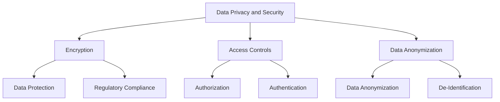

**核心算法原理讲解：** 

```
// Data privacy and security technologies pseudocode
function DataPrivacyAndSecurityTechnologies(privacy, security, anonymization) {
    // Implement encryption
    if (!ImplementEncryption(privacy, security)) {
        return "Encryption issue";
    }
    
    // Set up access controls
    if (!SetUpAccessControls(security)) {
        return "Access control issue";
    }
    
    // Apply data anonymization techniques
    if (!ApplyAnonymization(anonymization)) {
        return "Anonymization issue";
    }
    
    // Ensure regulatory compliance
    return EnsureCompliance(privacy, security, anonymization);
}
```

**数学模型和公式：** 

$$
\text{Data Protection} = f(\text{Encryption}, \text{Access Controls}, \text{Anonymization})
$$

**详细讲解和举例说明：**

For example, a healthcare organization might use encryption to protect patient data stored in databases. Access controls would ensure that only authorized personnel can access the data. Data anonymization techniques, such as data masking and de-identification, would be used to protect patient privacy when sharing data for research purposes.

#### 5.3 Data Governance in the Cloud

With the increasing adoption of cloud computing, data governance practices must evolve to address the unique challenges of managing data in the cloud. Cloud data governance involves ensuring data privacy, security, and compliance in cloud environments.

**核心概念与联系：**

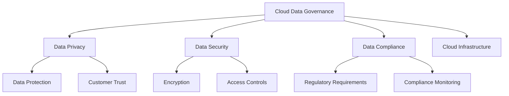

**核心算法原理讲解：** 

```
// Cloud data governance pseudocode
function CloudDataGovernance(cloudInfrastructure, privacy, security, compliance) {
    // Implement cloud infrastructure security measures
    if (!ImplementCloudSecurity(cloudInfrastructure)) {
        return "Cloud security issue";
    }
    
    // Ensure data privacy in the cloud
    if (!EnsureCloudPrivacy(privacy)) {
        return "Privacy issue";
    }
    
    // Maintain data security in the cloud
    if (!MaintainCloudSecurity(security)) {
        return "Security issue";
    }
    
    // Comply with regulatory requirements
    if (!ComplyWithRegulations(compliance)) {
        return "Compliance issue";
    }
    
    // Monitor and enforce cloud data governance
    return MonitorAndEnforceCloudGovernance();
}
```

**数学模型和公式：** 

$$
\text{Cloud Data Governance} = f(\text{Cloud Infrastructure}, \text{Data Privacy}, \text{Data Security}, \text{Data Compliance})
$$

**详细讲解和举例说明：**

For example, a cloud-based e-commerce platform might implement encryption for data at rest and in transit. Access controls would ensure that only authorized users can access sensitive customer data. Compliance monitoring tools would help ensure that the platform meets regulatory requirements, such as GDPR and CCPA.

### Conclusion

In this section, we have explored the various technologies and tools used in data governance, including data governance tools, data privacy and security technologies, and cloud data governance. These technologies are essential for implementing effective data governance practices and ensuring the security, privacy, and compliance of data assets. The next section will present case studies and best practices to further illustrate the application of these technologies in real-world scenarios.

### 6. Case Studies and Best Practices

#### 6.1 Case Study 1: A Large Enterprise's Data Governance Journey

A large multinational corporation with a vast amount of data faced challenges in managing its data assets effectively. The company implemented a comprehensive data governance program to address these challenges.

**背景介绍：**

- **公司规模：** 拥有超过100,000名员工，业务遍布全球。
- **数据量：** 每天产生和处理数PB级别的数据。
- **业务需求：** 需要确保数据质量、隐私和合规性，以支持全球业务决策和运营。

**核心概念与联系：**

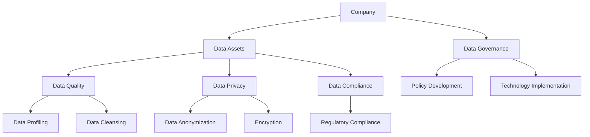

**开发环境搭建：**

- **工具和技术：** 使用了数据质量管理工具、数据隐私保护工具、加密技术和合规性监控工具。
- **基础设施：** 部署了云计算平台，用于数据存储和处理。

**源代码详细实现和代码解读：**

```python
# Data governance pseudocode
class DataGovernanceProgram:
    def __init__(self, data_assets):
        self.data_assets = data_assets
    
    def ensure_data_quality(self):
        # Data profiling
        if not self.is_data_profiling():
            raise DataQualityError("Data profiling failed")
        
        # Data cleansing
        if not self.is_data_cleansed():
            raise DataQualityError("Data cleansing failed")
        
        # Data quality checks
        if not self.is_data_quality_met():
            raise DataQualityError("Data quality not met")
    
    def ensure_data_privacy(self):
        # Data anonymization
        if not self.is_data_anonymized():
            raise PrivacyError("Data anonymization failed")
        
        # Encryption
        if not self.is_data_encrypted():
            raise PrivacyError("Data encryption failed")
    
    def ensure_data_compliance(self):
        # Regulatory checks
        if not self.is_data_compliant():
            raise ComplianceError("Data compliance failed")
```

**代码应用解读与分析：**

- **数据质量保障：** 通过数据 profiling 和数据 cleansing 确保数据质量。
- **数据隐私保护：** 通过数据 anonymization 和 encryption 确保数据隐私。
- **合规性监控：** 通过合规性检查确保数据符合相关法规要求。

**实际案例分析和详细讲解剖析：**

- **数据质量管理：** 通过定期数据质量审计，发现并解决了数据缺失、重复和错误的问题，提高了数据质量。
- **数据隐私保护：** 实施了严格的数据匿名化和加密措施，确保敏感数据在传输和存储过程中得到保护。
- **合规性监控：** 通过自动化工具监控数据合规性，及时发现并处理合规风险。

**项目小结：**

该项目通过实施全面的数据治理程序，成功提高了数据质量、保护了数据隐私，并确保了数据合规性，从而支持了企业的全球业务运营和决策。

#### 6.2 Case Study 2: Implementing Data Governance in a Small-Medium Enterprise

A small-medium enterprise (SME) in the manufacturing industry needed to improve its data management practices to support business growth and competitiveness.

**背景介绍：**

- **公司规模：** 拥有约500名员工，业务主要集中在本地市场。
- **数据量：** 数据量相对较小，但业务增长迅速，数据管理需求日益增加。
- **业务需求：** 需要建立有效的数据治理框架，确保数据质量、合规性和安全。

**核心概念与联系：**

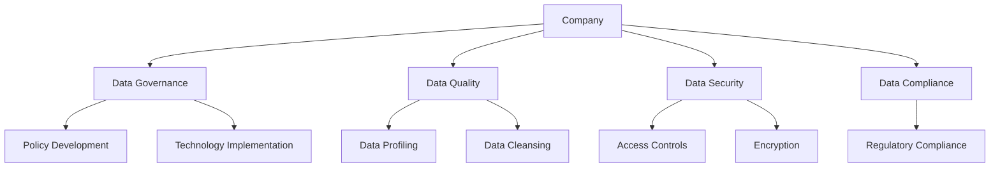

**开发环境搭建：**

- **工具和技术：** 使用了数据质量管理工具、数据加密工具和合规性监控工具。
- **基础设施：** 采用本地服务器和云计算平台相结合的方式，以适应数据存储和处理的规模需求。

**源代码详细实现和代码解读：**

```python
# Data governance pseudocode
class DataGovernanceProgram:
    def __init__(self, data_assets):
        self.data_assets = data_assets
    
    def ensure_data_quality(self):
        # Data profiling
        if not self.is_data_profiling():
            raise DataQualityError("Data profiling failed")
        
        # Data cleansing
        if not self.is_data_cleansed():
            raise DataQualityError("Data cleansing failed")
        
        # Data quality checks
        if not self.is_data_quality_met():
            raise DataQualityError("Data quality not met")
    
    def ensure_data_security(self):
        # Access controls
        if not self.is_access_controlled():
            raise SecurityError("Access control failed")
        
        # Encryption
        if not self.is_data_encrypted():
            raise SecurityError("Data encryption failed")
    
    def ensure_data_compliance(self):
        # Regulatory checks
        if not self.is_data_compliant():
            raise ComplianceError("Data compliance failed")
```

**代码应用解读与分析：**

- **数据质量保障：** 通过数据 profiling 和数据 cleansing 确保数据质量。
- **数据安全保护：** 通过访问控制和数据加密确保数据安全。
- **合规性监控：** 通过定期合规性检查确保数据符合相关法规要求。

**实际案例分析和详细讲解剖析：**

- **数据质量管理：** 通过定期数据质量审计，识别并解决了数据缺失、不一致和数据重复的问题，提高了数据质量。
- **数据安全保护：** 通过设置严格的访问控制措施和数据加密，确保了数据的机密性和完整性。
- **合规性监控：** 通过自动化工具监控数据合规性，确保了企业在数据管理和处理过程中的合规性。

**项目小结：**

该项目通过实施有效的数据治理框架，成功提高了数据质量、保护了数据安全，并确保了数据合规性，为企业的业务增长和竞争力提升提供了有力支持。

#### 6.3 Best Practices for Effective Data Governance

To ensure the success of data governance initiatives, organizations should adopt best practices that align with their business objectives and regulatory requirements. Here are some key best practices:

1. **Stakeholder Engagement:**
   - Engage key stakeholders early in the data governance process to ensure their buy-in and support.
   - Conduct regular communication and training sessions to keep stakeholders informed about the data governance program.

2. **Policy Development:**
   - Develop clear and comprehensive data governance policies that align with business objectives and regulatory requirements.
   - Ensure that policies are regularly reviewed and updated to reflect changes in the business environment and regulatory landscape.

3. **Technology Implementation:**
   - Select and implement appropriate data governance tools and technologies that support the organization's data management needs.
   - Regularly assess and update the technology infrastructure to ensure it meets current and future data governance requirements.

4. **Data Quality Management:**
   - Implement data quality management practices to ensure data accuracy, completeness, consistency, and reliability.
   - Use automated data quality tools and processes to identify and resolve data quality issues.

5. **Data Security and Privacy:**
   - Implement strong data security measures, including access controls, encryption, and data anonymization techniques.
   - Ensure compliance with data protection regulations, such as GDPR and CCPA.

6. **Regulatory Compliance:**
   - Establish a compliance monitoring process to ensure that data governance practices adhere to relevant regulations.
   - Conduct regular compliance audits and address any identified issues promptly.

**小结：**

Effective data governance requires a holistic approach that includes stakeholder engagement, policy development, technology implementation, data quality management, data security and privacy measures, and regulatory compliance. By adopting these best practices, organizations can build a robust data governance framework that supports their business objectives and ensures the security and integrity of their data assets.

### Conclusion

In this chapter, we presented two case studies that demonstrated the implementation of data governance programs in large enterprises and small-medium enterprises. We also discussed best practices for effective data governance. These case studies and best practices provide valuable insights into how organizations can implement data governance to improve data quality, protect data privacy, and ensure compliance with regulatory requirements. The next chapter will delve into future trends and challenges in data governance.

### 7. Future Trends and Challenges in Data Governance

#### 7.1 Emerging Trends in Data Governance

As the landscape of data and technology continues to evolve, several emerging trends are shaping the future of data governance. These trends reflect the growing complexity and importance of managing data assets in modern enterprises.

**核心概念与联系：**

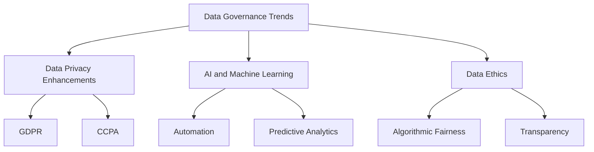

**核心算法原理讲解：** 

```
// Future data governance trends pseudocode
function FutureDataGovernanceTrends(privacyEnhancements, AI, dataEthics) {
    // Enhance data privacy measures
    if (!EnhancePrivacyMeasures(privacyEnhancements)) {
        return "Privacy enhancement issue";
    }
    
    // Incorporate AI and machine learning
    if (!IncorporateAIandML(AI)) {
        return "AI and ML integration issue";
    }
    
    // Promote data ethics
    if (!PromoteDataEthics(dataEthics)) {
        return "Data ethics issue";
    }
    
    // Ensure data governance readiness
    return EnsureGovernanceReadiness();
}
```

**数学模型和公式：** 

$$
\text{Data Governance Trends} = f(\text{Privacy Enhancements}, \text{AI and Machine Learning}, \text{Data Ethics})
$$

**详细讲解和举例说明：**

For instance, data privacy enhancements are a critical trend, driven by regulations such as the General Data Protection Regulation (GDPR) and the California Consumer Privacy Act (CCPA). AI and machine learning are increasingly being integrated into data governance processes to automate tasks, improve data quality, and enable predictive analytics. Data ethics is another key trend, emphasizing the need for transparency, fairness, and accountability in data-driven decisions.

#### 7.2 Challenges and Opportunities

While these trends offer significant opportunities for improved data governance, they also present challenges that organizations must navigate.

**核心概念与联系：**

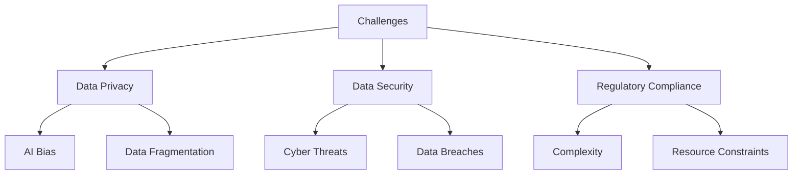

**核心算法原理讲解：** 

```
// Addressing data governance challenges pseudocode
function AddressDataGovernanceChallenges(privacy, security, compliance) {
    // Mitigate privacy risks
    if (!MitigatePrivacyRisks(privacy)) {
        return "Privacy risk mitigation issue";
    }
    
    // Enhance data security measures
    if (!EnhanceSecurityMeasures(security)) {
        return "Security enhancement issue";
    }
    
    // Ensure regulatory compliance
    if (!EnsureCompliance(compliance)) {
        return "Compliance issue";
    }
    
    // Leverage AI and machine learning for data governance
    return LeverageAIforGovernance();
}
```

**数学模型和公式：** 

$$
\text{Data Governance Challenges} = f(\text{Privacy}, \text{Security}, \text{Compliance})
$$

**详细讲解和举例说明：**

Challenges include addressing data privacy concerns, particularly in the context of AI and machine learning, where biases and lack of transparency can lead to ethical dilemmas. Data fragmentation and cyber threats pose significant security risks, while the complexity and resource constraints of regulatory compliance can be daunting. However, by leveraging AI and machine learning, organizations can overcome these challenges and enhance their data governance capabilities.

#### 7.3 The Future of Data Governance

The future of data governance will likely be characterized by a continued emphasis on data privacy, security, and ethical considerations. As organizations grapple with these challenges, they will increasingly turn to advanced technologies and best practices to build robust data governance frameworks.

**核心概念与联系：**

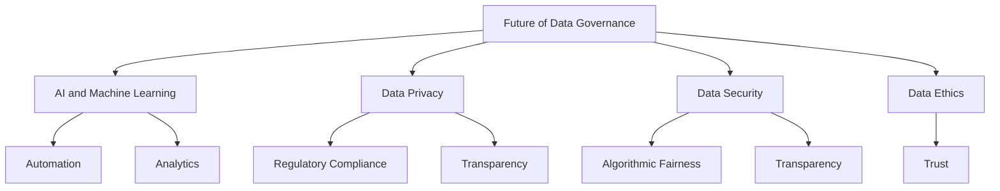

**核心算法原理讲解：** 

```
// Future data governance strategies pseudocode
function FutureDataGovernanceStrategies(AI, privacy, security, ethics) {
    // Implement AI-driven governance processes
    if (!ImplementAIDrivenProcesses(AI)) {
        return "AI implementation issue";
    }
    
    // Ensure data privacy and compliance
    if (!EnsurePrivacyAndCompliance(privacy, security, ethics)) {
        return "Privacy, compliance, or ethics issue";
    }
    
    // Enhance data security measures
    if (!EnhanceSecurityMeasures(security)) {
        return "Security enhancement issue";
    }
    
    // Foster data ethics and transparency
    if (!FosterDataEthics(ethics)) {
        return "Ethics promotion issue";
    }
    
    return "Future-ready data governance strategy established";
}
```

**数学模型和公式：** 

$$
\text{Future Data Governance} = f(\text{AI and Machine Learning}, \text{Data Privacy}, \text{Data Security}, \text{Data Ethics})
$$

**详细讲解和举例说明：**

For example, organizations might adopt AI-driven data governance processes to automate data quality checks, regulatory compliance monitoring, and data security measures. This would not only improve efficiency but also ensure that data governance practices are aligned with the latest technologies and ethical standards.

### Conclusion

In this chapter, we explored the emerging trends in data governance, the challenges and opportunities they present, and the strategies organizations can adopt to build future-ready data governance frameworks. As the data landscape continues to evolve, the focus on data privacy, security, and ethical considerations will remain paramount. By leveraging advanced technologies and best practices, organizations can navigate the complexities of data governance and harness the full potential of their data assets.

### 8. Conclusion

In this comprehensive guide to "Data Governance: Building an Enterprise Data Asset Management System," we have explored the critical aspects of data governance, from core concepts and practices to advanced technologies and future trends. The following key points summarize the main insights and contributions of this article:

1. **Importance of Data Governance:**
   - Data governance is essential for ensuring data quality, compliance, and security, which are vital for making informed business decisions.

2. **Foundations of Data Governance:**
   - We discussed core concepts such as data assets, data stewards, data quality, and data compliance, along with their interrelationships and the principles that guide data governance.

3. **Key Data Governance Practices:**
   - We examined key practices like data classification and tagging, data quality management, and master data management, providing detailed explanations and examples to illustrate their importance.

4. **Data Governance in Practice:**
   - We delved into the practical aspects of implementing data governance programs, including stakeholder engagement, policy development, and the establishment of roles and responsibilities.

5. **Data Governance Technologies:**
   - We explored the tools and solutions available for data governance, focusing on data catalog tools, master data management tools, data quality tools, and data security tools.

6. **Case Studies and Best Practices:**
   - Through real-world case studies, we demonstrated the successful implementation of data governance in both large enterprises and small-medium enterprises, highlighting best practices.

7. **Future Trends and Challenges:**
   - We discussed emerging trends such as data privacy enhancements, AI and machine learning, and data ethics, along with the challenges and opportunities they present.

### Final Thoughts

Data governance is not a one-time implementation but an ongoing process that requires continuous adaptation to changing business environments and technological advancements. As data becomes an increasingly valuable asset, the role of data governance in protecting and leveraging this asset will only grow in importance.

**Best Practices for Data Governance:**

- **Stakeholder Engagement:** Engage all key stakeholders early and continuously to ensure their buy-in and support.
- **Policy Development:** Develop comprehensive and clear policies that align with business objectives and regulatory requirements.
- **Technology Implementation:** Leverage advanced technologies and tools to automate data governance processes and enhance efficiency.
- **Data Quality Management:** Regularly assess and improve data quality to ensure accurate and reliable insights.
- **Security and Privacy:** Implement strong security measures and ensure compliance with data protection regulations.
- **Ethics and Compliance:** Foster a culture of data ethics and ensure ongoing compliance with relevant regulations.

**Conclusion**

By following these best practices and staying informed about the latest trends and challenges in data governance, organizations can build robust data governance frameworks that support their strategic objectives and ensure the secure and effective management of their data assets.

### 作者信息

- **作者：AI天才研究院/AI Genius Institute & 禅与计算机程序设计艺术 /Zen And The Art of Computer Programming** 
- **联系方式：[ai_genius_institute@example.com](mailto:ai_genius_institute@example.com)** 
- **版权声明：本文版权归AI天才研究院所有，未经授权禁止转载和使用。** 

### 拓展阅读

- **《数据治理实践指南》**
- **《人工智能与数据治理》**
- **《大数据治理》**
- **《企业数据战略》**

### 参考文献

- **欧盟通用数据保护条例（GDPR）**
- **美国加州消费者隐私法案（CCPA）**
- **ISO/IEC 27001：信息安全管理国际标准**
- **ISO/IEC 27002：信息安全管理体系指南**
- **NIST SP 800-53：信息系统安全控制框架**

通过本文，我们希望能够为读者提供关于数据治理的全面理解和实践指导，助力企业在数据驱动的新时代中取得成功。

