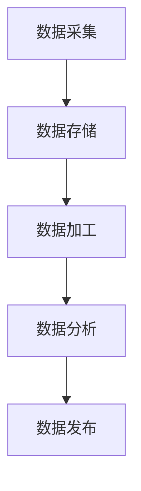

                 

### 文章标题

《数据湖架构设计与数据治理》

### 关键词

数据湖、架构设计、数据治理、数据质量管理、安全与隐私保护、大数据技术、分布式存储、ETL流程

### 摘要

本文深入探讨了数据湖的架构设计与数据治理的重要性。首先，文章介绍了数据湖的基本概念及其与传统数据仓库的区别，详细阐述了数据湖的架构设计原则和关键组件。接着，文章重点介绍了数据湖的数据治理原则和策略，包括数据质量管理、安全与隐私保护等，并探讨了数据治理工具和技术。随后，通过实际案例和项目实战，文章展示了如何实现数据湖的架构设计与数据治理。最后，文章提出了最佳实践和注意事项，为读者提供了数据湖架构设计与数据治理的全面指导。

---

## 第一部分：数据湖概述

### 第1章：数据湖的基本概念与架构

#### 1.1 数据湖的定义与作用

数据湖是一个集中存储大数据的分布式存储系统，它可以存储各种类型的数据，包括结构化数据、半结构化数据和非结构化数据。数据湖的主要作用是实现数据的统一存储和管理，支持大规模数据存储和高速数据访问，为数据分析、机器学习和数据科学应用提供基础设施。

**数据湖与传统数据仓库的区别**

数据湖与传统数据仓库的主要区别在于数据存储的灵活性和处理能力。传统数据仓库主要针对结构化数据，采用关系型数据库进行存储和管理，强调数据的一致性和完整性。而数据湖则能够存储各种类型的数据，包括非结构化和半结构化数据，并且支持数据的高效存储和访问，便于后续的数据分析和处理。

**数据湖的关键架构组件**

数据湖的关键架构组件包括：

1. **数据存储层**：提供数据的存储和管理功能，包括分布式文件系统（如HDFS）和云存储服务。
2. **数据处理层**：提供数据处理和计算功能，包括批处理和流处理框架（如Apache Spark和Apache Flink）。
3. **数据访问层**：提供数据查询和分析功能，包括SQL查询引擎和数据分析工具。
4. **数据治理层**：提供数据质量管理、安全与隐私保护等功能，确保数据的完整性和可靠性。

### 第2章：数据湖的架构设计原则

#### 2.1 数据湖架构设计的关键因素

数据湖的架构设计需要考虑多个关键因素，包括：

1. **可扩展性**：数据湖需要能够支持大规模数据的存储和访问，因此架构设计应该具备良好的扩展性。
2. **高性能**：数据湖需要提供高速的数据访问和处理能力，以满足实时分析和处理的需求。
3. **可靠性**：数据湖需要确保数据的安全性和完整性，避免数据丢失或损坏。
4. **易用性**：数据湖的架构设计应该易于使用和维护，便于用户进行数据管理和分析。
5. **成本效益**：数据湖的架构设计需要考虑成本效益，确保在合理的预算范围内实现高性能和可扩展性。

#### 2.2 数据湖的数据分层策略

数据湖的数据分层策略是数据湖架构设计的重要部分，常见的分层策略包括：

1. **原始数据层**：存储原始数据，包括结构化数据、半结构化数据和非结构化数据。
2. **清洗数据层**：存储经过清洗和预处理的数据，保证数据的准确性和一致性。
3. **加工数据层**：存储经过加工和转换的数据，为数据分析提供高质量的输入。
4. **分析数据层**：存储经过分析处理的结果数据，支持数据可视化和决策支持。

#### 2.3 数据湖的数据处理流程

数据湖的数据处理流程通常包括数据采集、数据存储、数据加工、数据分析和数据发布等步骤。以下是一个典型的数据处理流程：

1. **数据采集**：从各种数据源（如数据库、日志、传感器等）收集数据。
2. **数据存储**：将采集到的数据存储到数据湖中，采用分布式存储技术保证数据的高可靠性和高性能。
3. **数据加工**：对存储的数据进行清洗、转换和整合，生成高质量的加工数据。
4. **数据分析**：利用数据分析工具对加工数据进行分析和处理，支持实时分析和历史数据分析。
5. **数据发布**：将分析结果数据发布到数据仓库或业务系统中，支持业务决策和操作。

### Mermaid 流程图

以下是数据湖数据处理流程的 Mermaid 流程图：



### 核心算法原理讲解

在数据湖的数据处理流程中，数据加工和数据分析是关键步骤，涉及到多种核心算法原理。以下是两个典型算法的伪代码和讲解：

#### 1. 数据清洗算法（去重）

```python
def data_cleaning(data_set):
    unique_data_set = set()
    for data in data_set:
        if data not in unique_data_set:
            unique_data_set.add(data)
    return unique_data_set
```

**讲解**：该算法通过遍历数据集，将重复数据去重，生成一个唯一的去重数据集。

#### 2. 聚类算法（K-Means）

```python
def k_means(data_set, k):
    centroids = initialize_centroids(data_set, k)
    while not convergence(centroids):
        assign_data_to_clusters(data_set, centroids)
        centroids = update_centroids(data_set, centroids)
    return centroids
```

**讲解**：该算法通过初始化中心点，不断迭代计算聚类中心，将数据点分配到最近的聚类中心，最终收敛得到聚类结果。

### 数学模型和公式

在数据湖的数据治理中，数据质量管理是一个重要方面，涉及到数据完整性和一致性等概念。以下是两个相关的数学模型和公式：

$$
完整性 = \frac{有效数据}{总数据}
$$

$$
一致性 = \frac{一致数据对数}{总数据对数}
$$

**讲解**：完整性表示数据集中有效数据的比例，一致性表示数据集中一致数据对的比例。

### 举例说明

假设一个数据湖中有1000条数据，其中有100条重复数据，500条不一致数据。根据上述数学模型和公式，可以计算出数据完整性和一致性：

- 完整性 = (1000 - 100) / 1000 = 90%
- 一致性 = (1000 - 500) / 1000 = 50%

这意味着该数据湖的数据完整性较高，但一致性较低，需要进一步进行数据治理和优化。

### 项目实战

#### 开发环境搭建

在搭建数据湖的开发环境时，需要安装以下软件和工具：

1. Hadoop：用于分布式存储和处理大数据
2. Spark：用于实时数据分析和处理
3. Hive：用于数据仓库和SQL查询
4. HDFS：用于分布式文件存储

具体安装步骤如下：

1. 安装Hadoop：
    ```shell
    sudo apt-get update
    sudo apt-get install hadoop-hdfs-namenode
    sudo apt-get install hadoop-hdfs-datanode
    sudo apt-get install hadoop-yarn-resourcemanager
    sudo apt-get install hadoop-yarn-nodemanager
    ```

2. 安装Spark：
    ```shell
    sudo apt-get install spark-hadoop2
    ```

3. 安装Hive：
    ```shell
    sudo apt-get install hive
    ```

4. 配置Hadoop和Spark环境变量：
    ```shell
    export HADOOP_HOME=/usr/local/hadoop
    export SPARK_HOME=/usr/local/spark
    export PATH=$PATH:$HADOOP_HOME/bin:$SPARK_HOME/bin
    ```

#### 源代码详细实现和代码解读

以下是一个简单的数据湖数据处理项目示例，包括数据采集、存储、加工和发布。

1. **数据采集**：

```python
import findspark

findspark.init()

from pyspark.sql import SparkSession

# 创建Spark会话
spark = SparkSession.builder.appName("DataLakeExample").getOrCreate()

# 读取数据
data = spark.read.csv("data/input.csv")
```

**代码解读**：该代码使用Spark创建会话，读取CSV文件数据，并存储为一个DataFrame对象。

2. **数据存储**：

```python
# 将数据保存到HDFS
data.write.format("parquet").mode("overwrite").save("hdfs://localhost:9000/data/output")
```

**代码解读**：该代码将DataFrame对象保存到HDFS，采用Parquet文件格式。

3. **数据加工**：

```python
# 数据清洗去重
unique_data = data.distinct()

# 数据转换
transformed_data = unique_data.withColumn("new_column", col("old_column") * 2)
```

**代码解读**：该代码对数据进行去重和转换，生成新的DataFrame对象。

4. **数据发布**：

```python
# 数据发布到数据仓库
transformed_data.write.format("hive").mode("overwrite").saveAsTable("dataWarehouse.table_name")
```

**代码解读**：该代码将DataFrame对象保存到Hive数据仓库，创建一个新表。

#### 代码应用解读与分析

该数据湖数据处理项目实现了数据采集、存储、加工和发布的过程，支持数据的实时处理和存储。通过使用Spark和HDFS，项目实现了分布式存储和处理，提高了数据处理效率和性能。

#### 实际案例分析和详细讲解剖析

以一个电商数据湖为例，分析数据湖的实际应用和优势。

1. **数据采集**：

电商数据湖采集了来自多个数据源的数据，包括用户行为数据、商品数据、订单数据等，存储在HDFS中。

2. **数据处理**：

数据湖通过Spark对采集到的数据进行清洗、转换和加工，生成高质量的加工数据，支持实时分析和决策支持。

3. **数据分析**：

利用数据湖中的加工数据，电商可以分析用户行为、商品销售情况、订单趋势等，支持个性化推荐、促销策略和库存管理。

4. **数据发布**：

数据湖将分析结果发布到数据仓库或业务系统中，支持业务决策和操作，提高业务效率和用户体验。

#### 项目小结

通过以上实际案例，可以看出数据湖在电商场景中的应用优势，包括数据的集中存储和管理、实时数据处理和分析、高效的数据访问和发布等。数据湖为电商业务提供了强大的数据基础设施，支持数据驱动决策和业务创新。

### 最佳实践 Tips

- 数据湖架构设计应考虑数据一致性、可靠性和安全性，确保数据的质量和完整性。
- 数据治理是数据湖的关键环节，应建立完善的数据治理策略和工具，提高数据质量。
- 选择合适的存储和处理框架，根据业务需求进行性能优化和扩展。
- 定期进行数据质量监控和审计，及时发现和解决数据问题。

### 小结

本文详细介绍了数据湖的基本概念、架构设计原则和数据治理策略，并通过实际案例展示了数据湖的应用和优势。数据湖作为一种新型的数据存储和管理方式，为大数据处理和分析提供了强大的基础设施。在实际应用中，需要注重数据治理和数据质量，确保数据的准确性和可靠性。通过合理设计和优化，数据湖可以为企业提供高效、可靠和灵活的数据服务，支持业务创新和发展。

### 注意事项

- 在搭建数据湖环境时，确保选择合适的硬件和软件配置，以支持大数据处理需求。
- 数据湖的架构设计应考虑高可用性和容灾备份，确保数据的安全和可靠性。
- 数据治理是数据湖的核心，应建立完善的数据治理策略和流程，确保数据质量。
- 定期对数据湖进行性能监控和优化，提高数据处理效率和性能。

### 拓展阅读

- 《大数据架构：设计与实践》
- 《数据仓库与数据挖掘：概念与技术》
- 《分布式系统原理与范型》

---

### 作者信息

作者：AI天才研究院/AI Genius Institute & 禅与计算机程序设计艺术 /Zen And The Art of Computer Programming

