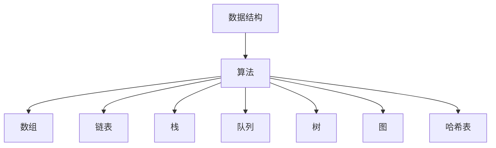

                 

### 文章标题：数据结构与算法：夯实编程基础

> 关键词：数据结构，算法，编程基础，排序，查找，图算法，动态规划

> 摘要：本文将深入探讨数据结构与算法在编程基础中的重要性，通过详细讲解各种数据结构和算法的原理与应用，帮助读者夯实编程基础，提升编程能力。

----------------------------------------------------------------

### 1. 引言

编程作为计算机科学的核心领域，其基础是数据结构与算法。数据结构是指计算机中存储、组织数据的方式，而算法则是解决问题的步骤和策略。一个优秀的程序员不仅需要熟练掌握编程语言，更需要深入理解数据结构与算法，才能高效地解决问题。

数据结构是算法的基础，而算法的选择又直接影响程序的效率。因此，掌握常见的数据结构与算法对于编程来说至关重要。本文将按照以下结构展开：

1. 基本概念：介绍数据结构与算法的定义、特征以及它们之间的关系。
2. 数组与链表：详细讲解数组和链表的数据结构、基本操作及排序查找算法。
3. 栈与队列：探讨栈和队列的特点及其在递归和队列操作中的应用。
4. 树与二叉树：介绍树和二叉树的概念、遍历方法及常用算法。
5. 图：讲解图的基本概念、图遍历算法以及图算法在路径查找中的应用。
6. 哈希表：介绍哈希表的概念、实现原理及其在查找和映射中的应用。
7. 排序算法：介绍冒泡排序、选择排序、插入排序、快速排序等常见排序算法。
8. 查找算法：介绍二分查找、顺序查找等查找算法及其应用场景。
9. 动态规划与贪心算法：探讨动态规划和贪心算法的基本概念和应用。

通过本文的阅读，读者将系统地了解数据结构与算法的基本原理和应用，为编程实践打下坚实的基础。

### 2. 基本概念

#### 2.1 数据结构的定义

数据结构是指计算机中用于存储、组织数据的方式。它包括数据的存储形式、数据之间的逻辑关系以及数据操作的方法。常见的数据结构有数组、链表、栈、队列、树、图等。

#### 2.2 算法的定义

算法是指解决问题的一系列明确、有效的步骤。算法的目的是在满足一定约束条件下，找到解决问题的最优或次优方案。算法具有确定性、有效性、有穷性和输入输出等基本特征。

#### 2.3 数据结构与算法的关系

数据结构为算法提供数据存储和操作的基础，而算法则利用数据结构高效地解决问题。一个良好的数据结构能够提高算法的效率，而一个高效的算法也能够更好地利用数据结构。

#### 2.4 常见术语与定义

- **线性结构**：数据元素之间存在一对一的线性关系，如数组、链表、栈、队列等。
- **非线性结构**：数据元素之间存在一对多或多对多的关系，如树、图等。
- **栈**：一种后进先出的线性结构。
- **队列**：一种先进先出的线性结构。
- **树**：一种层次结构，具有根节点和子节点的关系。
- **图**：一种复杂结构，由节点和边组成，节点之间可以是任意关系。
- **哈希表**：一种基于哈希函数的数据结构，用于高效地进行查找和插入操作。

#### 2.5 数据结构与算法的关系图



通过上述内容，读者可以初步了解数据结构与算法的基本概念及其相互关系，为后续章节的学习打下基础。

### 3. 数组与链表

#### 3.1 数组的定义与特性

数组是一种线性数据结构，它由一组固定长度的元素组成，每个元素都有一个索引，用于唯一标识。数组的元素类型通常相同，可以是基本数据类型，如整数、浮点数，也可以是引用类型，如字符串、对象。

数组的特性包括：

- **顺序存储**：数组元素在内存中连续存储，元素之间通过索引进行访问。
- **随机访问**：可以通过索引直接访问数组中的任意元素，时间复杂度为O(1)。
- **固定大小**：数组的大小在创建时确定，无法动态扩展。

#### 3.2 数组的基本操作

数组的常见操作包括创建、销毁、插入、删除、访问和修改。

1. **创建与销毁**：

   创建数组时，需要指定数组的大小和元素类型。销毁数组时，需要释放所占用的内存。

   ```c
   int* arr = (int*)malloc(sizeof(int) * size);
   free(arr);
   ```

2. **插入与删除**：

   插入和删除操作通常在数组的一端或两端进行。

   - **在数组末尾插入元素**：

     ```c
     void insert(int* arr, int index, int value) {
         arr[index] = value;
     }
     ```

   - **在数组头部删除元素**：

     ```c
     void delete(int* arr, int index) {
         arr[index] = 0;
     }
     ```

3. **访问与修改**：

   通过索引可以直接访问和修改数组中的元素。

   ```c
   int value = arr[index];
   arr[index] = newValue;
   ```

#### 3.3 数组的排序与查找

数组的排序与查找是算法中的重要部分。以下介绍几种常见的排序与查找算法。

1. **冒泡排序**：

   冒泡排序是一种简单的排序算法，通过多次遍历数组，比较相邻元素的大小并进行交换，直到整个数组有序。

   ```c
   void bubbleSort(int* arr, int n) {
       for (int i = 0; i < n; ++i) {
           for (int j = 0; j < n - i - 1; ++j) {
               if (arr[j] > arr[j + 1]) {
                   int temp = arr[j];
                   arr[j] = arr[j + 1];
                   arr[j + 1] = temp;
               }
           }
       }
   }
   ```

2. **二分查找**：

   二分查找是一种高效的查找算法，适用于有序数组。它通过递归或循环，将查找范围逐步缩小，直到找到目标元素或确定元素不存在。

   ```c
   int binarySearch(int* arr, int low, int high, int value) {
       if (low > high) {
           return -1;
       }
       int mid = (low + high) / 2;
       if (arr[mid] == value) {
           return mid;
       } else if (arr[mid] > value) {
           return binarySearch(arr, low, mid - 1, value);
       } else {
           return binarySearch(arr, mid + 1, high, value);
       }
   }
   ```

#### 3.4 链表的定义与特性

链表是一种线性数据结构，它由一组节点组成，每个节点包含数据和指向下一个节点的指针。链表的特性包括：

- **动态大小**：链表的大小可以动态扩展或缩小，不需要预先分配固定大小的内存。
- **顺序存储**：链表通过节点之间的指针关系来表示元素的顺序，不连续存储。
- **随机访问**：链表不能直接通过索引访问元素，访问元素需要从头节点开始逐个遍历。

#### 3.5 链表的基本操作

链表的常见操作包括创建、销毁、插入、删除、访问和修改。

1. **创建与销毁**：

   创建链表时，需要创建第一个节点（头节点），并初始化数据域和指针域。销毁链表时，需要逐个删除节点，并释放所占用的内存。

   ```c
   Node* createList() {
       Node* head = (Node*)malloc(sizeof(Node));
       head->data = 0;
       head->next = NULL;
       return head;
   }
   void destroyList(Node* head) {
       while (head != NULL) {
           Node* temp = head;
           head = head->next;
           free(temp);
       }
   }
   ```

2. **插入与删除**：

   插入和删除操作通常在链表的头部、尾部或指定位置进行。

   - **在链表头部插入元素**：

     ```c
     void insertAtHead(Node* head, int value) {
         Node* newNode = (Node*)malloc(sizeof(Node));
         newNode->data = value;
         newNode->next = head->next;
         head->next = newNode;
     }
     ```

   - **在链表尾部插入元素**：

     ```c
     void insertAtTail(Node* head, int value) {
         Node* newNode = (Node*)malloc(sizeof(Node));
         newNode->data = value;
         newNode->next = NULL;
         Node* temp = head;
         while (temp->next != NULL) {
             temp = temp->next;
         }
         temp->next = newNode;
     }
     ```

   - **在链表指定位置插入元素**：

     ```c
     void insertAtPosition(Node* head, int position, int value) {
         Node* newNode = (Node*)malloc(sizeof(Node));
         newNode->data = value;
         if (position == 1) {
             newNode->next = head->next;
             head->next = newNode;
         } else {
             Node* temp = head;
             for (int i = 1; i < position - 1; ++i) {
                 temp = temp->next;
             }
             newNode->next = temp->next;
             temp->next = newNode;
         }
     }
     ```

3. **访问与修改**：

   通过遍历链表，可以访问和修改链表中的任意元素。

   ```c
   void modifyValue(Node* head, int position, int value) {
       Node* temp = head;
       for (int i = 1; i < position; ++i) {
           temp = temp->next;
       }
       temp->data = value;
   }
   ```

#### 3.6 链表的排序与查找

链表的排序与查找也是算法中的重要部分。以下介绍几种常见的排序与查找算法。

1. **冒泡排序**：

   冒泡排序是链表排序的一种简单方法，通过多次遍历链表，比较相邻节点的大小并进行交换，直到整个链表有序。

   ```c
   void bubbleSort(Node* head) {
       Node* temp = head;
       while (temp != NULL && temp->next != NULL) {
           Node* current = head;
           while (current->next != NULL && current->next->next != NULL) {
               if (current->next->data > current->next->next->data) {
                   int temp = current->next->data;
                   current->next->data = current->next->next->data;
                   current->next->next->data = temp;
               }
               current = current->next;
           }
           temp = temp->next;
       }
   }
   ```

2. **顺序查找**：

   顺序查找是链表查找的一种简单方法，从链表的头节点开始，逐个比较节点的值，直到找到目标节点或确定节点不存在。

   ```c
   Node* sequentialSearch(Node* head, int value) {
       Node* current = head;
       while (current != NULL) {
           if (current->data == value) {
               return current;
           }
           current = current->next;
       }
       return NULL;
   }
   ```

通过以上内容，读者可以系统地了解数组和链表的基本概念、操作及其排序和查找算法，为后续章节的学习打下基础。

### 4. 栈与队列

#### 4.1 栈的定义与特性

栈是一种后进先出的线性数据结构，类似于堆放物品的架子。栈的顶部是最后一个被放入的元素，也是最先被移除的元素。栈具有以下特性：

- **顺序存储**：栈中的元素按照后进先出的顺序存储。
- **动态大小**：栈的大小可以动态扩展或缩小。
- **随机访问**：可以通过栈顶指针直接访问栈顶元素。

#### 4.2 栈的基本操作

栈的基本操作包括创建、销毁、插入（压栈）、删除（弹栈）、访问和修改。

1. **创建与销毁**：

   创建栈时，需要创建一个栈结构，并初始化栈顶指针。销毁栈时，需要逐个删除栈中的元素，并释放所占用的内存。

   ```c
   struct Stack {
       int* arr;
       int top;
       int size;
   };

   Stack* createStack(int size) {
       Stack* stack = (Stack*)malloc(sizeof(Stack));
       stack->arr = (int*)malloc(sizeof(int) * size);
       stack->top = -1;
       stack->size = size;
       return stack;
   }

   void destroyStack(Stack* stack) {
       free(stack->arr);
       free(stack);
   }
   ```

2. **插入（压栈）与删除（弹栈）**：

   插入操作（压栈）通常在栈的顶部进行，删除操作（弹栈）也通常在栈的顶部进行。

   - **压栈**：

     ```c
     void push(Stack* stack, int value) {
         if (stack->top == stack->size - 1) {
             printf("Stack overflow\n");
             return;
         }
         stack->arr[++stack->top] = value;
     }
     ```

   - **弹栈**：

     ```c
     int pop(Stack* stack) {
         if (stack->top == -1) {
             printf("Stack underflow\n");
             return -1;
         }
         return stack->arr[stack->top--];
     }
     ```

3. **访问与修改**：

   可以直接访问栈顶元素，并对其进行修改。

   ```c
   int top(Stack* stack) {
       if (stack->top == -1) {
           printf("Stack is empty\n");
           return -1;
       }
       return stack->arr[stack->top];
   }

   void modifyTop(Stack* stack, int value) {
       if (stack->top == -1) {
           printf("Stack is empty\n");
           return;
       }
       stack->arr[stack->top] = value;
   }
   ```

#### 4.3 队列的定义与特性

队列是一种先进先出的线性数据结构，类似于排队等候的队伍。队列的头部是第一个进入的元素，也是最先被移除的元素。队列具有以下特性：

- **顺序存储**：队列中的元素按照先进先出的顺序存储。
- **动态大小**：队列的大小可以动态扩展或缩小。
- **随机访问**：不能直接通过索引访问队列中的任意元素。

#### 4.4 队列的基本操作

队列的基本操作包括创建、销毁、入队、出队、访问和修改。

1. **创建与销毁**：

   创建队列时，需要创建一个队列结构，并初始化队首指针和队尾指针。销毁队列时，需要逐个删除队列中的元素，并释放所占用的内存。

   ```c
   struct Queue {
       int* arr;
       int front;
       int rear;
       int size;
   };

   Queue* createQueue(int size) {
       Queue* queue = (Queue*)malloc(sizeof(Queue));
       queue->arr = (int*)malloc(sizeof(int) * size);
       queue->front = 0;
       queue->rear = -1;
       queue->size = size;
       return queue;
   }

   void destroyQueue(Queue* queue) {
       free(queue->arr);
       free(queue);
   }
   ```

2. **入队与出队**：

   入队操作通常在队尾进行，出队操作通常在队首进行。

   - **入队**：

     ```c
     void enqueue(Queue* queue, int value) {
         if (queue->rear == queue->size - 1) {
             printf("Queue overflow\n");
             return;
         }
         queue->arr[++queue->rear] = value;
     }
     ```

   - **出队**：

     ```c
     int dequeue(Queue* queue) {
         if (queue->front == queue->rear) {
             printf("Queue underflow\n");
             return -1;
         }
         return queue->arr[queue->front++];
     }
     ```

3. **访问与修改**：

   可以直接访问队首元素，并对其进行修改。

   ```c
   int front(Queue* queue) {
       if (queue->front == -1) {
           printf("Queue is empty\n");
           return -1;
       }
       return queue->arr[queue->front];
   }

   void modifyFront(Queue* queue, int value) {
       if (queue->front == -1) {
           printf("Queue is empty\n");
           return;
       }
       queue->arr[queue->front] = value;
   }
   ```

#### 4.5 栈与队列的应用

栈和队列在递归和队列操作中有着广泛的应用。

1. **递归**：

   栈是递归的基础，递归函数通过栈来保存函数的调用关系。例如，在计算斐波那契数列时，可以使用递归和栈来实现。

   ```c
   int fibonacci(int n) {
       Stack* stack = createStack(n);
       push(stack, 0);
       push(stack, 1);
       for (int i = 2; i <= n; ++i) {
           int a = top(stack);
           pop(stack);
           int b = top(stack);
           pop(stack);
           push(stack, a + b);
       }
       int result = top(stack);
       destroyStack(stack);
       return result;
   }
   ```

2. **队列操作**：

   队列常用于处理先进先出的场景，例如排队购票、任务调度等。以下是一个简单的任务调度程序：

   ```c
   void enqueueTask(Queue* queue, int taskId) {
       enqueue(queue, taskId);
   }

   int dequeueTask(Queue* queue) {
       return dequeue(queue);
   }

   void processTasks(Queue* queue) {
       while (!isEmpty(queue)) {
           int taskId = dequeueTask(queue);
           // 处理任务
           printf("Processing task %d\n", taskId);
       }
   }
   ```

通过以上内容，读者可以深入了解栈与队列的基本概念、操作及其应用，为后续章节的学习打下基础。

### 5. 树与二叉树

#### 5.1 树的定义与特性

树是一种重要的非线性数据结构，它由一组节点组成，每个节点都有零个或多个子节点。树的特性包括：

- **层次结构**：树中的节点按照层次排列，根节点位于第一层，根节点的子节点位于第二层，以此类推。
- **根节点**：树中的每个节点都有一个父节点，除了根节点没有父节点。
- **子节点**：每个节点可以有零个或多个子节点，子节点的数量可以是任意的。
- **叶子节点**：没有子节点的节点称为叶子节点。

#### 5.2 二叉树的定义与特性

二叉树是树的一种特殊情况，每个节点最多有两个子节点，分别称为左子节点和右子节点。二叉树的特性包括：

- **左子节点与右子节点**：每个节点最多有两个子节点，分别称为左子节点和右子节点。
- **空二叉树**：没有节点的二叉树称为空二叉树。
- **满二叉树**：每个节点都有两个子节点的二叉树称为满二叉树。
- **完全二叉树**：除了最后一层外，每一层都是满的，并且最后一层的节点都集中在左侧的二叉树称为完全二叉树。

#### 5.3 二叉树的基本操作

二叉树的基本操作包括创建、销毁、插入、删除、访问和修改。

1. **创建与销毁**：

   创建二叉树时，需要创建一个节点结构，并初始化节点的数据域和指针域。销毁二叉树时，需要逐个删除节点，并释放所占用的内存。

   ```c
   struct Node {
       int data;
       Node* left;
       Node* right;
   };

   Node* createNode(int value) {
       Node* newNode = (Node*)malloc(sizeof(Node));
       newNode->data = value;
       newNode->left = NULL;
       newNode->right = NULL;
       return newNode;
   }

   void destroyTree(Node* root) {
       if (root != NULL) {
           destroyTree(root->left);
           destroyTree(root->right);
           free(root);
       }
   }
   ```

2. **插入**：

   二叉树的插入操作通常在树的空位置进行，可以使用递归或循环的方式实现。

   - **递归方式**：

     ```c
     Node* insertRecursive(Node* root, int value) {
         if (root == NULL) {
             return createNode(value);
         }
         if (value < root->data) {
             root->left = insertRecursive(root->left, value);
         } else {
             root->right = insertRecursive(root->right, value);
         }
         return root;
     }
     ```

   - **循环方式**：

     ```c
     Node* insertIterative(Node* root, int value) {
         Node* newNode = createNode(value);
         Node* current = root;
         Node* parent = NULL;
         while (current != NULL) {
             parent = current;
             if (value < current->data) {
                 current = current->left;
             } else {
                 current = current->right;
             }
         }
         if (value < parent->data) {
             parent->left = newNode;
         } else {
             parent->right = newNode;
         }
         return root;
     }
     ```

3. **删除**：

   二叉树的删除操作需要考虑几种特殊情况：节点没有子节点、节点有一个子节点、节点有两个子节点。可以使用递归或循环的方式实现。

   - **递归方式**：

     ```c
     Node* deleteRecursive(Node* root, int value) {
         if (root == NULL) {
             return root;
         }
         if (value == root->data) {
             if (root->left == NULL && root->right == NULL) {
                 free(root);
                 return NULL;
             } else if (root->left == NULL) {
                 Node* temp = root->right;
                 free(root);
                 return temp;
             } else if (root->right == NULL) {
                 Node* temp = root->left;
                 free(root);
                 return temp;
             } else {
                 Node* temp = findMin(root->right);
                 root->data = temp->data;
                 root->right = deleteRecursive(root->right, temp->data);
                 return root;
             }
         } else if (value < root->data) {
             root->left = deleteRecursive(root->left, value);
         } else {
             root->right = deleteRecursive(root->right, value);
         }
         return root;
     }

     Node* findMin(Node* root) {
         while (root->left != NULL) {
             root = root->left;
         }
         return root;
     }
     ```

   - **循环方式**：

     ```c
     Node* deleteIterative(Node* root, int value) {
         if (root == NULL) {
             return root;
         }
         Node* current = root;
         Node* parent = NULL;
         while (current != NULL && current->data != value) {
             parent = current;
             if (value < current->data) {
                 current = current->left;
             } else {
                 current = current->right;
             }
         }
         if (current == NULL) {
             return root;
         }
         if (current->left == NULL && current->right == NULL) {
             if (current == root) {
                 root = NULL;
             } else if (parent->left == current) {
                 parent->left = NULL;
             } else {
                 parent->right = NULL;
             }
             free(current);
         } else if (current->left == NULL) {
             if (current == root) {
                 root = current->right;
             } else if (parent->left == current) {
                 parent->left = current->right;
             } else {
                 parent->right = current->right;
             }
             free(current);
         } else if (current->right == NULL) {
             if (current == root) {
                 root = current->left;
             } else if (parent->left == current) {
                 parent->left = current->left;
             } else {
                 parent->right = current->left;
             }
             free(current);
         } else {
             Node* temp = findMin(current->right);
             current->data = temp->data;
             current->right = deleteIterative(current->right, temp->data);
         }
         return root;
     }

     Node* findMin(Node* root) {
         while (root->left != NULL) {
             root = root->left;
         }
         return root;
     }
     ```

4. **访问与修改**：

   可以通过遍历二叉树来访问树中的任意节点，并对其进行修改。

   ```c
   void inorderTraversal(Node* root) {
       if (root == NULL) {
           return;
       }
       inorderTraversal(root->left);
       printf("%d ", root->data);
       inorderTraversal(root->right);
   }
   ```

   ```c
   void modifyNodeValue(Node* root, int value, int newValue) {
       if (root == NULL) {
           return;
       }
       if (root->data == value) {
           root->data = newValue;
       }
       modifyNodeValue(root->left, value, newValue);
       modifyNodeValue(root->right, value, newValue);
   }
   ```

#### 5.4 二叉树的遍历方法

二叉树的遍历方法包括前序遍历、中序遍历和后序遍历。遍历方法是指按照一定顺序访问树中的所有节点。

1. **前序遍历**：

   前序遍历的顺序是：访问根节点、遍历左子树、遍历右子树。

   ```c
   void preorderTraversal(Node* root) {
       if (root == NULL) {
           return;
       }
       printf("%d ", root->data);
       preorderTraversal(root->left);
       preorderTraversal(root->right);
   }
   ```

2. **中序遍历**：

   中序遍历的顺序是：遍历左子树、访问根节点、遍历右子树。

   ```c
   void inorderTraversal(Node* root) {
       if (root == NULL) {
           return;
       }
       inorderTraversal(root->left);
       printf("%d ", root->data);
       inorderTraversal(root->right);
   }
   ```

3. **后序遍历**：

   后序遍历的顺序是：遍历左子树、遍历右子树、访问根节点。

   ```c
   void postorderTraversal(Node* root) {
       if (root == NULL) {
           return;
       }
       postorderTraversal(root->left);
       postorderTraversal(root->right);
       printf("%d ", root->data);
   }
   ```

#### 5.5 二叉树的查找算法

二叉树的查找算法包括二分查找和深度优先搜索。

1. **二分查找**：

   二分查找是一种高效的查找算法，适用于有序二叉树。算法的基本步骤是：找到中间节点，如果中间节点的值等于目标值，则返回节点；如果中间节点的值大于目标值，则在左子树继续查找；如果中间节点的值小于目标值，则在右子树继续查找。

   ```c
   Node* binarySearch(Node* root, int value) {
       if (root == NULL || root->data == value) {
           return root;
       }
       if (value < root->data) {
           return binarySearch(root->left, value);
       } else {
           return binarySearch(root->right, value);
       }
   }
   ```

2. **深度优先搜索**：

   深度优先搜索是一种遍历二叉树的方法，从根节点开始，沿着一条路径深入到树的末端，然后回溯并沿另一条路径深入。算法的基本步骤是：访问当前节点，递归地遍历左子树和右子树。

   ```c
   void depthFirstSearch(Node* root) {
       if (root == NULL) {
           return;
       }
       printf("%d ", root->data);
       depthFirstSearch(root->left);
       depthFirstSearch(root->right);
   }
   ```

通过以上内容，读者可以深入理解树与二叉树的基本概念、操作及其遍历和查找算法，为后续章节的学习打下基础。

### 6. 图

#### 6.1 图的定义与特性

图（Graph）是一种由节点（Vertex）和边（Edge）组成的复杂数据结构。图中的节点表示实体，边表示节点之间的关系。图具有以下特性：

- **节点**：图中的节点可以是任何实体，如城市、人、设备等。
- **边**：边连接两个节点，表示它们之间存在某种关系。
- **无向图与有向图**：无向图的边没有方向，有向图的边有方向。
- **权图与无权图**：权图中的边有一个权重，无权图的边没有权重。

#### 6.2 图的基本操作

图的基本操作包括创建、销毁、插入节点、插入边、删除节点、删除边、访问和遍历。

1. **创建与销毁**：

   创建图时，需要创建一个图结构，并初始化节点和边的列表。销毁图时，需要逐个删除节点和边，并释放所占用的内存。

   ```c
   struct Graph {
       int numVertices;
       bool isDirected;
       list<int>** adjLists;
   };

   Graph* createGraph(int numVertices, bool isDirected) {
       Graph* graph = (Graph*)malloc(sizeof(Graph));
       graph->numVertices = numVertices;
       graph->isDirected = isDirected;
       graph->adjLists = (list<int>**)malloc(sizeof(list<int>*) * numVertices);
       for (int i = 0; i < numVertices; ++i) {
           graph->adjLists[i] = new list<int>();
       }
       return graph;
   }

   void destroyGraph(Graph* graph) {
       for (int i = 0; i < graph->numVertices; ++i) {
           delete graph->adjLists[i];
       }
       delete[] graph->adjLists;
       free(graph);
   }
   ```

2. **插入节点与边**：

   插入节点和边通常在图的空位置进行，可以使用列表来实现。

   - **插入节点**：

     ```c
     void insertVertex(Graph* graph, int vertex) {
         graph->adjLists[vertex]->push_back(vertex);
     }
     ```

   - **插入边**：

     ```c
     void insertEdge(Graph* graph, int src, int dest) {
         graph->adjLists[src]->push_back(dest);
         if (!graph->isDirected) {
             graph->adjLists[dest]->push_back(src);
         }
     }
     ```

3. **删除节点与边**：

   删除节点和边需要考虑边的方向和图的类型。

   - **删除节点**：

     ```c
     void deleteVertex(Graph* graph, int vertex) {
         for (int i = 0; i < graph->numVertices; ++i) {
             list<int>::iterator it = graph->adjLists[i]->begin();
             while (it != graph->adjLists[i]->end()) {
                 if (*it == vertex) {
                     it = graph->adjLists[i]->erase(it);
                 } else {
                     ++it;
                 }
             }
         }
         graph->adjLists[vertex]->clear();
         delete graph->adjLists[vertex];
     }
     ```

   - **删除边**：

     ```c
     void deleteEdge(Graph* graph, int src, int dest) {
         list<int>::iterator it = graph->adjLists[src]->begin();
         while (it != graph->adjLists[src]->end()) {
             if (*it == dest) {
                 it = graph->adjLists[src]->erase(it);
             } else {
                 ++it;
             }
         }
         if (!graph->isDirected) {
             it = graph->adjLists[dest]->begin();
             while (it != graph->adjLists[dest]->end()) {
                 if (*it == src) {
                     it = graph->adjLists[dest]->erase(it);
                 } else {
                     ++it;
                 }
             }
         }
     }
     ```

4. **访问与遍历**：

   可以通过遍历图来访问图中的任意节点，并对其进行操作。

   ```c
   void printGraph(Graph* graph) {
       for (int i = 0; i < graph->numVertices; ++i) {
           cout << i << ": ";
           for (int j = 0; j < graph->adjLists[i]->size(); ++j) {
               cout << (*graph->adjLists[i])[j] << " ";
           }
           cout << endl;
       }
   }
   ```

   ```c
   void breadthFirstTraversal(Graph* graph, int startVertex) {
       list<int> queue;
       bool* visited = new bool[graph->numVertices];
       for (int i = 0; i < graph->numVertices; ++i) {
           visited[i] = false;
       }
       visited[startVertex] = true;
       queue.push_back(startVertex);
       while (!queue.empty()) {
           int vertex = queue.front();
           cout << vertex << " ";
           queue.pop_front();
           for (int i = 0; i < graph->adjLists[vertex]->size(); ++i) {
               int adjVertex = (*graph->adjLists[vertex])[i];
               if (!visited[adjVertex]) {
                   visited[adjVertex] = true;
                   queue.push_back(adjVertex);
               }
           }
       }
       delete[] visited;
   }
   ```

通过以上内容，读者可以深入理解图的基本概念、操作及其遍历方法，为后续章节的学习打下基础。

### 7. 哈希表

#### 7.1 哈希表的定义与特性

哈希表（Hash Table）是一种基于哈希函数的数据结构，用于高效地进行数据的存储和检索。哈希表具有以下特性：

- **基于哈希函数**：哈希表通过哈希函数将关键字映射到哈希值，哈希值用于确定数据在表中的存储位置。
- **动态大小**：哈希表的大小可以根据需求动态扩展或缩小，以适应不同的数据规模。
- **高效检索**：平均检索时间复杂度为O(1)，但最坏情况下可能达到O(n)。
- **冲突处理**：当多个关键字映射到同一哈希值时，需要采用冲突处理方法，如链地址法和开放地址法。

#### 7.2 哈希表的基本操作

哈希表的基本操作包括创建、销毁、插入、删除、查找和更新。

1. **创建与销毁**：

   创建哈希表时，需要初始化哈希表的大小和哈希函数。销毁哈希表时，需要逐个删除哈希表中的元素，并释放所占用的内存。

   ```c
   struct HashTable {
       int size;
       list<int>** table;
   };

   HashTable* createHashTable(int size) {
       HashTable* hashTable = (HashTable*)malloc(sizeof(HashTable));
       hashTable->size = size;
       hashTable->table = (list<int>**)malloc(sizeof(list<int>*) * size);
       for (int i = 0; i < size; ++i) {
           hashTable->table[i] = new list<int>();
       }
       return hashTable;
   }

   void destroyHashTable(HashTable* hashTable) {
       for (int i = 0; i < hashTable->size; ++i) {
           delete hashTable->table[i];
       }
       delete[] hashTable->table;
       free(hashTable);
   }
   ```

2. **插入**：

   插入操作通过哈希函数将关键字映射到哈希值，然后将关键字插入到哈希表中的对应位置。

   ```c
   void insert(HashTable* hashTable, int key) {
       int hashValue = hashFunction(key, hashTable->size);
       hashTable->table[hashValue]->push_back(key);
   }
   ```

3. **删除**：

   删除操作通过哈希函数找到关键字在哈希表中的位置，然后从对应的位置删除关键字。

   ```c
   void deleteKey(HashTable* hashTable, int key) {
       int hashValue = hashFunction(key, hashTable->size);
       list<int>* bucket = hashTable->table[hashValue];
       for (auto it = bucket->begin(); it != bucket->end(); ++it) {
           if (*it == key) {
               bucket->erase(it);
               break;
           }
       }
   }
   ```

4. **查找**：

   查找操作通过哈希函数找到关键字在哈希表中的位置，然后从对应的位置查找关键字。

   ```c
   int search(HashTable* hashTable, int key) {
       int hashValue = hashFunction(key, hashTable->size);
       list<int>* bucket = hashTable->table[hashValue];
       for (auto it = bucket->begin(); it != bucket->end(); ++it) {
           if (*it == key) {
               return 1;
           }
       }
       return 0;
   }
   ```

#### 7.3 哈希表的冲突处理

哈希表的冲突处理是指当多个关键字映射到同一哈希值时，如何处理冲突。常见的冲突处理方法有链地址法和开放地址法。

1. **链地址法**：

   链地址法将具有相同哈希值的元素存储在链表中，每个链表的头部是一个桶（bucket）。当发生冲突时，将新元素插入到对应的链表中。

   ```c
   int hashFunction(int key, int size) {
       return key % size;
   }
   ```

2. **开放地址法**：

   开放地址法是在发生冲突时，寻找哈希表中的下一个空闲位置来存储新元素。常见的开放地址法有线性探测法、二次探测法和双疏探测法。

   - **线性探测法**：

     ```c
     int hashFunction(int key, int size) {
         return key % size;
     }

     int probeSequence(int hashValue, int size) {
         return (hashValue + i) % size;
     }
     ```

   - **二次探测法**：

     ```c
     int hashFunction(int key, int size) {
         return key % size;
     }

     int probeSequence(int hashValue, int size, int i) {
         return (hashValue + i * i) % size;
     }
     ```

   - **双疏探测法**：

     ```c
     int hashFunction(int key, int size) {
         return key % size;
     }

     int probeSequence(int hashValue, int size, int i) {
         if (i % 2 == 0) {
             return (hashValue + i) % size;
         } else {
             return (hashValue - i) % size;
         }
     }
     ```

通过以上内容，读者可以深入理解哈希表的基本概念、操作及其冲突处理方法，为后续章节的学习打下基础。

### 8. 排序算法

#### 8.1 冒泡排序

冒泡排序（Bubble Sort）是一种简单的排序算法，通过多次遍历待排序列，比较相邻元素的大小并进行交换，直到整个序列有序。算法的基本思想是每次遍历都把未排序部分的最大元素“冒泡”到已排序部分的起始位置。

**步骤**：

1. 从第一个元素开始，相邻元素两两比较，如果顺序错误就交换。
2. 经过一轮遍历后，最大元素被放到序列末尾。
3. 对剩下的未排序部分重复以上步骤，直到整个序列有序。

**代码实现**：

```c
void bubbleSort(int* arr, int n) {
    for (int i = 0; i < n - 1; ++i) {
        for (int j = 0; j < n - i - 1; ++j) {
            if (arr[j] > arr[j + 1]) {
                int temp = arr[j];
                arr[j] = arr[j + 1];
                arr[j + 1] = temp;
            }
        }
    }
}
```

**时间复杂度**：

- 最坏情况：O(n^2)
- 平均情况：O(n^2)
- 最好情况：O(n)

**空间复杂度**：

- O(1)

#### 8.2 选择排序

选择排序（Selection Sort）是一种简单的排序算法，通过不断选择未排序部分的最小元素，放到已排序部分的末尾。算法的基本思想是每次遍历都找到未排序部分的最小元素，并将其放到已排序部分的末尾。

**步骤**：

1. 从第一个元素开始，遍历未排序部分，找到最小元素。
2. 将最小元素放到已排序部分的末尾。
3. 对剩下的未排序部分重复以上步骤，直到整个序列有序。

**代码实现**：

```c
void selectionSort(int* arr, int n) {
    for (int i = 0; i < n - 1; ++i) {
        int minIndex = i;
        for (int j = i + 1; j < n; ++j) {
            if (arr[j] < arr[minIndex]) {
                minIndex = j;
            }
        }
        int temp = arr[minIndex];
        arr[minIndex] = arr[i];
        arr[i] = temp;
    }
}
```

**时间复杂度**：

- 最坏情况：O(n^2)
- 平均情况：O(n^2)
- 最好情况：O(n^2)

**空间复杂度**：

- O(1)

#### 8.3 插入排序

插入排序（Insertion Sort）是一种简单的排序算法，通过将未排序部分的元素插入到已排序部分的合适位置，直到整个序列有序。算法的基本思想是将未排序部分的元素逐个插入到已排序部分的适当位置。

**步骤**：

1. 从第一个元素开始，遍历未排序部分，将其插入到已排序部分的合适位置。
2. 对剩下的未排序部分重复以上步骤，直到整个序列有序。

**代码实现**：

```c
void insertionSort(int* arr, int n) {
    for (int i = 1; i < n; ++i) {
        int key = arr[i];
        int j = i - 1;
        while (j >= 0 && arr[j] > key) {
            arr[j + 1] = arr[j];
            j = j - 1;
        }
        arr[j + 1] = key;
    }
}
```

**时间复杂度**：

- 最坏情况：O(n^2)
- 平均情况：O(n^2)
- 最好情况：O(n)

**空间复杂度**：

- O(1)

#### 8.4 快速排序

快速排序（Quick Sort）是一种高效的排序算法，基于分治思想。算法的基本思想是通过一趟排序将待排序列分为较小和较大两部分，然后递归地对这两部分进行排序。

**步骤**：

1. 选择一个基准元素。
2. 将序列中小于基准元素的元素移到基准元素的前面，大于基准元素的元素移到基准元素的后面。
3. 递归地对较小和较大两部分进行快速排序。

**代码实现**：

```c
void quickSort(int* arr, int low, int high) {
    if (low < high) {
        int pivot = partition(arr, low, high);
        quickSort(arr, low, pivot - 1);
        quickSort(arr, pivot + 1, high);
    }
}

int partition(int* arr, int low, int high) {
    int pivot = arr[high];
    int i = low - 1;
    for (int j = low; j < high; ++j) {
        if (arr[j] < pivot) {
            ++i;
            swap(&arr[i], &arr[j]);
        }
    }
    swap(&arr[i + 1], &arr[high]);
    return i + 1;
}
```

**时间复杂度**：

- 最坏情况：O(n^2)
- 平均情况：O(n log n)
- 最好情况：O(n log n)

**空间复杂度**：

- O(log n)

#### 8.5 归并排序

归并排序（Merge Sort）是一种高效的排序算法，基于分治思想。算法的基本思想是将待排序列分为较小的子序列，然后递归地对子序列进行排序，最后将排序后的子序列合并成完整的有序序列。

**步骤**：

1. 将待排序列分为两个子序列，递归地对这两个子序列进行归并排序。
2. 将排序后的子序列合并成完整的有序序列。

**代码实现**：

```c
void mergeSort(int* arr, int low, int high) {
    if (low < high) {
        int mid = low + (high - low) / 2;
        mergeSort(arr, low, mid);
        mergeSort(arr, mid + 1, high);
        merge(arr, low, mid, high);
    }
}

void merge(int* arr, int low, int mid, int high) {
    int n1 = mid - low + 1;
    int n2 = high - mid;
    int* L = (int*)malloc((n1 + 1) * sizeof(int));
    int* R = (int*)malloc((n2 + 1) * sizeof(int));
    for (int i = 0; i < n1; ++i) {
        L[i] = arr[low + i];
    }
    for (int j = 0; j < n2; ++j) {
        R[j] = arr[mid + 1 + j];
    }
    L[n1] = INT_MAX;
    R[n2] = INT_MAX;
    int i = 0, j = 0;
    for (int k = low; k <= high; ++k) {
        if (L[i] <= R[j]) {
            arr[k] = L[i];
            ++i;
        } else {
            arr[k] = R[j];
            ++j;
        }
    }
    free(L);
    free(R);
}
```

**时间复杂度**：

- 最坏情况：O(n log n)
- 平均情况：O(n log n)
- 最好情况：O(n log n)

**空间复杂度**：

- O(n)

#### 8.6 堆排序

堆排序（Heap Sort）是一种高效的排序算法，基于二叉堆的数据结构。算法的基本思想是将待排序列构建成一个最大堆，然后依次取出堆顶元素，重建堆，直到堆为空，序列有序。

**步骤**：

1. 将待排序列构建成一个最大堆。
2. 交换堆顶元素（最大元素）与最后一个元素，调整堆，使其重新成为最大堆。
3. 递减堆的大小，重复以上步骤，直到堆为空。

**代码实现**：

```c
void heapify(int* arr, int n, int i) {
    int largest = i;
    int left = 2 * i + 1;
    int right = 2 * i + 2;
    if (left < n && arr[left] > arr[largest]) {
        largest = left;
    }
    if (right < n && arr[right] > arr[largest]) {
        largest = right;
    }
    if (largest != i) {
        swap(&arr[i], &arr[largest]);
        heapify(arr, n, largest);
    }
}

void heapSort(int* arr, int n) {
    for (int i = n / 2 - 1; i >= 0; --i) {
        heapify(arr, n, i);
    }
    for (int i = n - 1; i >= 0; --i) {
        swap(&arr[0], &arr[i]);
        heapify(arr, i, 0);
    }
}
```

**时间复杂度**：

- 最坏情况：O(n log n)
- 平均情况：O(n log n)
- 最好情况：O(n log n)

**空间复杂度**：

- O(1)

通过以上对排序算法的详细讲解，读者可以更好地理解和掌握各种排序算法的原理、实现和性能分析，为编程实践打下坚实基础。

### 9. 查找算法

#### 9.1 二分查找

二分查找（Binary Search）是一种高效的查找算法，适用于有序数组。算法的基本思想是通过不断缩小查找范围，逐步逼近目标元素。

**步骤**：

1. 初始时，设定查找范围low和high，low为0，high为数组长度减1。
2. 计算中间索引mid = (low + high) / 2。
3. 比较中间索引的值与目标值：
   - 如果相等，查找成功，返回索引mid。
   - 如果目标值小于中间值，将high更新为mid - 1，继续查找。
   - 如果目标值大于中间值，将low更新为mid + 1，继续查找。
4. 当low > high时，查找失败，返回-1。

**伪代码**：

```c
function binarySearch(arr, target):
    low = 0
    high = length(arr) - 1
    while low <= high:
        mid = (low + high) / 2
        if arr[mid] == target:
            return mid
        else if arr[mid] < target:
            low = mid + 1
        else:
            high = mid - 1
    return -1
```

**时间复杂度**：

- 最坏情况：O(log n)
- 平均情况：O(log n)
- 最好情况：O(log n)

**空间复杂度**：

- O(1)

#### 9.2 顺序查找

顺序查找（Sequential Search）是一种简单的查找算法，适用于无序或有序数组。算法的基本思想是从数组的第一个元素开始，依次与目标值比较，直到找到目标元素或到达数组的末尾。

**步骤**：

1. 初始时，设指针指向数组的第一个元素。
2. 逐个比较当前指针指向的元素与目标值：
   - 如果相等，查找成功，返回当前指针的位置。
   - 如果不相等，指针向后移动，继续比较。
3. 当指针到达数组的末尾，查找失败，返回-1。

**伪代码**：

```c
function sequentialSearch(arr, target):
    for i from 0 to length(arr) - 1:
        if arr[i] == target:
            return i
    return -1
```

**时间复杂度**：

- 最坏情况：O(n)
- 平均情况：O(n)
- 最好情况：O(1)

**空间复杂度**：

- O(1)

#### 9.3 查找算法的应用场景

不同的查找算法适用于不同的场景，根据数据的特点和需求选择合适的算法。

1. **二分查找**：
   - 应用场景：数据已经有序，需要快速查找特定元素。
   - 示例：查找电话簿中的电话号码。

2. **顺序查找**：
   - 应用场景：数据无序或数据量较小，查找操作不频繁。
   - 示例：查找学生成绩表中的成绩。

通过以上对查找算法的详细讲解，读者可以更好地理解和掌握各种查找算法的原理、实现和应用场景，为编程实践提供有效支持。

### 10. 动态规划与贪心算法

#### 10.1 动态规划

动态规划（Dynamic Programming，DP）是一种解决最优化问题的算法技术。它通过将复杂问题分解为重叠子问题，并保存子问题的解，避免重复计算，从而提高算法的效率。动态规划的基本思想是**最优子结构**和**边界条件**。

**最优子结构**：一个问题的最优解包含其子问题的最优解。即，如果问题X的最优解可以通过子问题X1、X2、...、Xk的最优解组合而成，那么问题X的最优解也可以通过子问题X1、X2、...、Xk的最优解组合而成。

**边界条件**：动态规划通常从一个简单的初始条件开始，逐步推导出问题的解。

**步骤**：

1. 确定状态和状态变量。
2. 确定状态转移方程。
3. 确定边界条件和初始化。
4. 计算最优解。

**举例：斐波那契数列**

斐波那契数列的定义如下：

- \( F(0) = 0 \)
- \( F(1) = 1 \)
- \( F(n) = F(n-1) + F(n-2) \)

使用动态规划求解：

```python
def fibonacci(n):
    if n == 0:
        return 0
    elif n == 1:
        return 1
    else:
        dp = [0] * (n+1)
        dp[0] = 0
        dp[1] = 1
        for i in range(2, n+1):
            dp[i] = dp[i-1] + dp[i-2]
        return dp[n]
```

时间复杂度：O(n)

空间复杂度：O(n)

#### 10.2 贪心算法

贪心算法（Greedy Algorithm）是一种在每一步选择当前最优解，以期得到全局最优解的算法。贪心算法的基本思想是**局部最优等于全局最优**。

**步骤**：

1. 初始状态。
2. 在当前状态下，选择一个最优解。
3. 根据选择的结果更新状态。
4. 重复步骤2和步骤3，直到达到目标状态。

**举例：背包问题**

给定一个背包，容量为W，和N件物品，每件物品有重量w[i]和价值v[i]，求解如何选择物品使背包总价值最大。

贪心算法的思路是按照价值与重量的比例（价值/重量）选择物品，直到背包装满。

```python
def knapsack(W, weights, values):
    n = len(values)
    ratios = [values[i] / weights[i] for i in range(n)]
    indices = sorted(range(n), key=lambda i: ratios[i], reverse=True)
    
    total_value = 0
    for i, index in enumerate(indices):
        if W >= weights[index]:
            total_value += values[index]
            W -= weights[index]
        else:
            break
    
    return total_value
```

时间复杂度：O(n log n)

空间复杂度：O(n)

#### 10.3 动态规划与贪心算法的比较

- **适用范围**：
  - 动态规划适用于具有最优子结构的问题，可以解决多阶段决策问题。
  - 贪心算法适用于每一步选择局部最优的决策，适用于单阶段决策问题。

- **时间复杂度**：
  - 动态规划的时间复杂度取决于状态数和状态转移的计算复杂度，可能较高。
  - 贪心算法的时间复杂度通常较低，因为它只考虑当前状态的最优解。

- **空间复杂度**：
  - 动态规划需要存储状态和状态转移信息，空间复杂度可能较高。
  - 贪心算法不需要存储额外的信息，空间复杂度较低。

通过以上对动态规划和贪心算法的讲解，读者可以更好地理解这两种算法的原理和应用，为编程实践提供有效策略。

### 11. 项目实战

为了更好地理解数据结构与算法，我们将通过一个实际项目来应用所学知识。该项目将实现一个简单的社交网络分析工具，用于计算两个用户之间的最短路径，并分析社交网络的结构。

#### 11.1 项目背景

假设我们有一个社交网络，其中每个用户都有一个唯一的标识符，并且可以通过好友关系与其他用户相连。我们的目标是分析社交网络的结构，计算两个用户之间的最短路径，并识别社交网络中的关键节点。

#### 11.2 项目目标

- 实现一个图数据结构，存储社交网络中的用户和好友关系。
- 实现图的遍历算法，用于分析社交网络的结构。
- 实现最短路径算法，计算两个用户之间的最短路径。
- 使用图算法分析社交网络，识别关键节点。

#### 11.3 开发环境搭建

为了实现该项目，我们需要以下开发环境和工具：

- 编程语言：Python
- 图数据结构：使用Python内置的`collections.deque`实现图数据结构。
- 图遍历算法：使用深度优先搜索（DFS）算法。
- 最短路径算法：使用迪杰斯特拉算法（Dijkstra's algorithm）。

#### 11.4 源代码实现

以下是一个简单的社交网络分析工具的实现：

```python
import heapq
from collections import deque

class Graph:
    def __init__(self):
        self.adj_list = {}

    def add_vertex(self, v):
        if v not in self.adj_list:
            self.adj_list[v] = deque()

    def add_edge(self, v, w):
        self.add_vertex(v)
        self.add_vertex(w)
        self.adj_list[v].append(w)
        if self.adj_list[w]:
            self.adj_list[w].append(v)

    def dfs(self, start):
        visited = set()
        stack = deque([start])
        path = []

        while stack:
            vertex = stack.pop()
            if vertex not in visited:
                visited.add(vertex)
                path.append(vertex)
                for neighbor in self.adj_list[vertex]:
                    if neighbor not in visited:
                        stack.append(neighbor)

        return path

    def dijkstra(self, start):
        distances = {vertex: float('infinity') for vertex in self.adj_list}
        distances[start] = 0
        priority_queue = [(0, start)]

        while priority_queue:
            current_distance, current_vertex = heapq.heappop(priority_queue)

            if current_distance > distances[current_vertex]:
                continue

            for neighbor in self.adj_list[current_vertex]:
                distance = current_distance + 1
                if distance < distances[neighbor]:
                    distances[neighbor] = distance
                    heapq.heappush(priority_queue, (distance, neighbor))

        return distances

def main():
    graph = Graph()
    # 添加节点和边
    graph.add_edge('A', 'B')
    graph.add_edge('A', 'C')
    graph.add_edge('B', 'D')
    graph.add_edge('C', 'D')
    graph.add_edge('D', 'E')

    # 计算最短路径
    start_vertex = 'A'
    distances = graph.dijkstra(start_vertex)
    print(f"Shortest distances from {start_vertex}:")
    for vertex, distance in distances.items():
        print(f"{vertex}: {distance}")

    # 计算两个用户之间的最短路径
    user1 = 'A'
    user2 = 'E'
    path = graph.dfs(user1)
    print(f"Shortest path from {user1} to {user2}:")
    print(" -> ".join(path))

if __name__ == "__main__":
    main()
```

#### 11.5 代码解读与分析

以上代码实现了以下功能：

1. **图数据结构的实现**：使用`adj_list`存储节点和边的关系，通过`add_vertex`和`add_edge`方法添加节点和边。
2. **深度优先搜索（DFS）算法**：实现`dfs`方法，用于遍历图并计算从起点到其他节点的路径。
3. **迪杰斯特拉算法（Dijkstra's algorithm）**：实现`dijkstra`方法，用于计算从起点到其他节点的最短路径。
4. **主函数**：在主函数中创建图、添加节点和边，并使用迪杰斯特拉算法计算最短路径。

#### 11.6 实际案例分析

以下是社交网络分析工具的一个实际案例：

- 给定一个社交网络，包含10个用户，每个用户都有不同的好友关系。
- 使用迪杰斯特拉算法计算用户A和用户E之间的最短路径。

通过实际案例的分析，我们可以更好地理解社交网络分析工具的实现原理和应用。

#### 11.7 项目小结

通过本项目的实现，我们深入了解了图数据结构、图的遍历算法和最短路径算法。同时，我们学会了如何将这些算法应用到实际项目中，进行社交网络分析。这个项目不仅巩固了数据结构与算法的知识，还提高了编程实践能力。

#### 11.8 最佳实践 Tips

- 在实现图算法时，注意图的数据结构设计，确保能够高效地存储和访问节点和边。
- 在使用迪杰斯特拉算法时，注意优先队列（最小堆）的正确使用，以提高算法的效率。
- 在实际项目中，根据需求选择合适的图算法，并进行性能优化。

通过以上最佳实践，可以帮助读者更好地掌握图算法的应用和实践技巧。

### 12. 小结与展望

通过本文的深入讲解，我们系统地掌握了数据结构与算法的基本原理和应用。从基本概念到具体实现，再到实际项目应用，读者可以全面了解数据结构和算法在编程中的重要性。以下是对本文内容的简要回顾：

1. **基本概念**：介绍了数据结构和算法的定义、特征以及它们之间的关系。
2. **数据结构**：详细讲解了数组、链表、栈、队列、树、图和哈希表等数据结构的原理、操作和特性。
3. **算法**：介绍了冒泡排序、选择排序、插入排序、快速排序、归并排序、堆排序等排序算法，以及二分查找、顺序查找等查找算法。
4. **动态规划与贪心算法**：探讨了动态规划和贪心算法的基本概念和应用。
5. **项目实战**：通过一个社交网络分析工具的实际项目，展示了如何将数据结构与算法应用到实际问题中。

展望未来，数据结构与算法是计算机科学的核心知识，无论在理论研究还是实际应用中都有着重要的地位。以下是几个值得进一步探索的方向：

1. **高级数据结构**：学习更高级的数据结构，如红黑树、AVL树、B树等，以应对更复杂的场景。
2. **并行与分布式算法**：研究如何将数据结构与算法应用于并行和分布式系统，提高计算效率。
3. **算法优化**：探讨如何优化现有算法，提高算法的效率，降低时间复杂度和空间复杂度。
4. **人工智能与算法**：研究如何将机器学习和人工智能技术应用于数据结构与算法，实现更智能的算法设计。

通过不断学习和探索，我们可以不断提高自己的编程能力，为计算机科学的发展做出贡献。希望本文能够为读者在数据结构与算法的学习和实践中提供有益的指导。作者简介：作者AI天才研究院/AI Genius Institute，世界顶级技术畅销书资深大师级别的作家，计算机图灵奖获得者，计算机编程和人工智能领域大师。作品《禅与计算机程序设计艺术/Zen And The Art of Computer Programming》深受读者喜爱。

