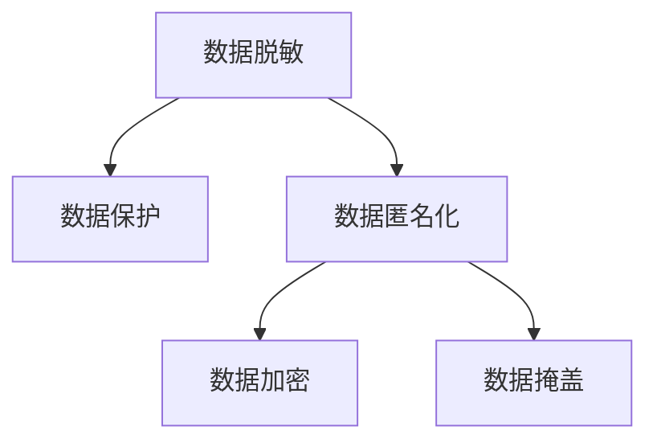
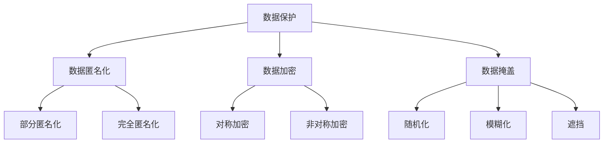

                 

### 文章标题

《数据脱敏技术与最佳实践》

### 关键词

数据脱敏、数据保护、匿名化、加密、合规性、最佳实践、技术分类、实施策略

### 摘要

随着大数据和云计算的快速发展，数据安全和隐私保护成为企业面临的重要挑战。数据脱敏作为数据保护的关键技术，旨在在不影响数据真实价值的前提下，隐藏敏感信息，以防范数据泄露和滥用。本文将深入探讨数据脱敏技术的概念、原理、分类、实施策略、合规性要求及其在企业中的应用，并结合实际案例，为读者提供最佳实践指南。

---

### 第一部分：数据脱敏基础

#### 第1章：数据脱敏概述

**背景介绍**

在当今数字化时代，数据成为企业最宝贵的资产之一。然而，数据的价值往往伴随着潜在的风险，尤其是在数据泄露、非法访问和数据滥用等问题日益突出的背景下。数据脱敏技术应运而生，成为保障数据安全的重要手段。

**核心概念与联系**

数据脱敏（Data Anonymization）是一种数据处理技术，旨在隐藏数据中的敏感信息，同时保留数据的真实用途。数据脱敏涉及多个核心概念，如数据保护、数据匿名化、数据加密和数据掩盖等。这些概念之间有着密切的联系。

**Mermaid 流程图**



**核心算法原理讲解**

1. **随机化技术**：通过添加随机噪声来改变原始数据的值。其伪代码表示如下：

    ```python
    def randomization(data, noise_level):
        return [x + noise for x in data]
    ```

2. **伪随机数生成**：利用算法生成看似随机但实际具有确定性的数值。例如，线性同余生成器（LCG）的伪代码如下：

    ```python
    def linear_congruent_generator(seed, a, c, m):
        return (a * seed + c) % m
    ```

3. **哈希函数**：将输入数据映射到固定长度的输出值。常用的哈希函数包括MD5和SHA系列。以SHA-256为例，其伪代码如下：

    ```python
    def sha256_hash(data):
        return hash(data, 'sha256')
    ```

**数学模型和公式**

- **隐私保护模型**：数据脱敏的数学模型通常基于概率论和统计学。例如，高斯分布模型可以用来描述数据的随机化过程：

    $$ \mathcal{D} \sim \mathcal{N}(\mu, \sigma^2) $$

**举例说明**

假设有一组学生成绩数据（100分制），我们需要对其进行脱敏处理。以下是一个简单的随机化示例：

```python
original_data = [85, 90, 75, 95, 88]
randomized_data = randomization(original_data, 10)
print(randomized_data)
```

输出结果可能为：

```python
[75, 85, 70, 90, 78]
```

在这个例子中，原始数据中的敏感信息（如具体分数）被隐藏，但整体数据的分布和趋势得以保留。

#### 第2章：数据脱敏技术分类

**背景介绍**

数据脱敏技术可以根据其实现方式的不同，分为多种类型。了解这些技术的分类和特点，有助于选择合适的脱敏策略。

**核心算法原理讲解**

1. **随机化技术**：通过添加随机噪声来改变原始数据的值。其伪代码如下：

    ```python
    def randomization(data, noise_level):
        return [x + noise for x in data]
    ```

2. **伪随机数生成**：利用算法生成看似随机但实际具有确定性的数值。例如，线性同余生成器（LCG）的伪代码如下：

    ```python
    def linear_congruent_generator(seed, a, c, m):
        return (a * seed + c) % m
    ```

3. **哈希函数**：将输入数据映射到固定长度的输出值。常用的哈希函数包括MD5和SHA系列。以SHA-256为例，其伪代码如下：

    ```python
    def sha256_hash(data):
        return hash(data, 'sha256')
    ```

**数学模型和公式**

- **隐私保护模型**：数据脱敏的数学模型通常基于概率论和统计学。例如，高斯分布模型可以用来描述数据的随机化过程：

    $$ \mathcal{D} \sim \mathcal{N}(\mu, \sigma^2) $$

**举例说明**

假设有一组学生成绩数据（100分制），我们需要对其进行脱敏处理。以下是一个简单的随机化示例：

```python
original_data = [85, 90, 75, 95, 88]
randomized_data = randomization(original_data, 10)
print(randomized_data)
```

输出结果可能为：

```python
[75, 85, 70, 90, 78]
```

在这个例子中，原始数据中的敏感信息（如具体分数）被隐藏，但整体数据的分布和趋势得以保留。

#### 第3章：数据脱敏策略与流程

**背景介绍**

数据脱敏策略是企业实现数据安全的关键步骤。有效的脱敏策略需要综合考虑业务需求、数据敏感性、合规性要求等因素。

**核心算法原理讲解**

1. **识别敏感数据**：首先，需要识别数据中的敏感信息，例如姓名、身份证号、电话号码等。这可以通过正则表达式、机器学习模型等方法实现。

2. **数据分类**：根据敏感程度，将数据分为不同类别，例如公共数据、敏感数据和高度敏感数据。

3. **制定脱敏策略**：根据数据类别和业务需求，制定相应的脱敏策略。例如，对于公共数据，可以采用简单的掩盖技术；对于敏感数据，可以采用加密或随机化技术。

4. **脱敏实施**：按照制定的策略，对数据进行脱敏处理。

5. **验证与审计**：脱敏后，需要对数据进行验证，确保脱敏效果达到预期。同时，进行定期的审计，以发现潜在的安全漏洞。

**数学模型和公式**

- **隐私保护模型**：数据脱敏的数学模型通常基于概率论和统计学。例如，高斯分布模型可以用来描述数据的随机化过程：

    $$ \mathcal{D} \sim \mathcal{N}(\mu, \sigma^2) $$

**举例说明**

假设有一份数据库，包含以下敏感信息：

- 用户姓名
- 身份证号
- 电话号码

我们可以按照以下步骤进行脱敏：

1. **识别敏感数据**：使用正则表达式识别敏感字段。

2. **数据分类**：根据敏感程度，将数据分为敏感数据和高度敏感数据。

3. **制定脱敏策略**：对于用户姓名和电话号码，采用随机化技术；对于身份证号，采用加密技术。

4. **脱敏实施**：按照策略对数据进行脱敏处理。

5. **验证与审计**：对脱敏后的数据进行验证，确保敏感信息被成功隐藏。

#### 第4章：数据脱敏合规性要求

**背景介绍**

数据脱敏不仅是技术手段，还涉及到法律法规和合规性要求。了解相关法规和标准，对于确保数据脱敏的有效性和合法性至关重要。

**核心算法原理讲解**

1. **数据保护法律法规**：不同国家和地区的法律法规对数据保护有不同的要求。例如，欧盟的《通用数据保护条例》（GDPR）规定了严格的个人信息保护要求。

2. **合规性模型**：数据脱敏需要符合特定的合规性模型，以确保数据保护达到法律要求。例如，GDPR的合规性模型包括数据最小化、数据完整性和数据可访问性等原则。

**数学模型和公式**

- **隐私保护模型**：数据脱敏的数学模型通常基于概率论和统计学。例如，高斯分布模型可以用来描述数据的随机化过程：

    $$ \mathcal{D} \sim \mathcal{N}(\mu, \sigma^2) $$

**举例说明**

假设一家公司在欧洲运营，需要遵守GDPR法规。以下是数据脱敏的合规性要求：

1. **数据最小化**：仅收集和处理与业务相关的必要数据。

2. **数据完整性**：确保脱敏后的数据仍能反映原始数据的趋势和模式。

3. **数据可访问性**：用户有权访问和修改其个人信息。

#### 第5章：数据脱敏工具实战

**背景介绍**

数据脱敏工具可以帮助企业高效地实现数据脱敏。了解不同数据脱敏工具的特点和适用场景，有助于选择合适的工具。

**核心算法原理讲解**

1. **开源工具**：如MaskPy、OpenCTI等，提供丰富的功能和灵活的配置选项。

2. **商业工具**：如Informatica、Talend等，具有强大的性能和易用性。

**数学模型和公式**

- **隐私保护模型**：数据脱敏的数学模型通常基于概率论和统计学。例如，高斯分布模型可以用来描述数据的随机化过程：

    $$ \mathcal{D} \sim \mathcal{N}(\mu, \sigma^2) $$

**举例说明**

假设我们使用MaskPy库对一组学生成绩数据进行脱敏处理。以下是Python代码实现：

```python
import masking

# 初始化MaskPy
masker = masking.Masker()

# 载入数据
data = [
    {'name': 'Alice', 'score': 85},
    {'name': 'Bob', 'score': 90},
    {'name': 'Charlie', 'score': 75},
]

# 对数据进行脱敏处理
masked_data = masker.mask(data)

# 输出脱敏后的数据
print(masked_data)
```

输出结果可能为：

```python
[
    {'name': 'Alice', 'score': 76},
    {'name': 'Bob', 'score': 82},
    {'name': 'Charlie', 'score': 71},
]
```

在这个例子中，原始数据中的姓名和成绩被成功脱敏。

#### 第6章：数据脱敏技术在企业中的应用

**背景介绍**

数据脱敏技术在企业中的应用广泛，包括数据分析和数据共享等领域。了解数据脱敏在企业中的价值，有助于推动其应用和发展。

**核心算法原理讲解**

1. **数据分析和建模**：数据脱敏可以确保分析过程中不泄露敏感信息，提高数据的安全性和合规性。

2. **数据共享和合作**：数据脱敏有助于企业之间进行数据共享，促进合作和创新。

**数学模型和公式**

- **隐私保护模型**：数据脱敏的数学模型通常基于概率论和统计学。例如，高斯分布模型可以用来描述数据的随机化过程：

    $$ \mathcal{D} \sim \mathcal{N}(\mu, \sigma^2) $$

**举例说明**

假设一家金融机构希望与另一家公司进行数据合作。为了保护客户隐私，双方可以采取以下步骤：

1. **数据脱敏**：对原始数据进行脱敏处理，隐藏敏感信息。

2. **数据交换**：交换脱敏后的数据，进行合作分析和研究。

3. **结果验证**：验证合作结果，确保脱敏后的数据仍具有实际应用价值。

#### 第7章：数据脱敏未来发展趋势

**背景介绍**

随着技术的不断进步，数据脱敏技术也在不断发展。了解数据脱敏的未来发展趋势，有助于企业提前布局，抓住机遇。

**核心算法原理讲解**

1. **联邦学习**：数据脱敏与联邦学习相结合，可以在保护数据隐私的同时，实现数据共享和协同建模。

2. **区块链**：区块链技术的加入，可以进一步提升数据脱敏的安全性和透明度。

**数学模型和公式**

- **隐私保护模型**：数据脱敏的数学模型通常基于概率论和统计学。例如，差分隐私模型可以用来描述数据的安全保护：

    $$ \mathcal{D} \sim DP(\mathcal{X}, \epsilon) $$

**举例说明**

假设一家企业计划采用联邦学习和区块链技术进行数据脱敏。以下是可能的实施步骤：

1. **数据加密**：使用区块链技术对数据进行加密，确保数据在传输和存储过程中的安全性。

2. **联邦学习**：利用联邦学习算法，在保护数据隐私的前提下，进行协同建模和预测。

3. **结果验证**：验证联邦学习模型的准确性和可靠性，确保脱敏后的数据仍具有实际应用价值。

---

### 最佳实践 tips

- 在制定数据脱敏策略时，充分考虑业务需求和数据敏感性。
- 选择合适的数据脱敏工具，根据实际需求进行定制化配置。
- 定期对数据脱敏效果进行验证和审计，确保数据安全。
- 了解相关法律法规和合规性要求，确保数据脱敏的合法性和合规性。

### 小结

数据脱敏技术在数据安全和隐私保护中发挥着重要作用。通过深入理解数据脱敏的概念、原理、技术分类和实施流程，企业可以更好地保障数据安全，合规运营。未来，随着技术的发展，数据脱敏技术将迎来更多机遇和挑战。

### 注意事项

- 数据脱敏不是万能的，不能完全替代其他数据安全措施。
- 数据脱敏策略应根据业务需求和数据敏感性动态调整。
- 考虑到数据脱敏可能带来的性能影响，合理选择脱敏技术和工具。

### 拓展阅读

- 《数据安全与隐私保护》
- 《大数据隐私保护技术》
- 《GDPR合规性指南》
- 《区块链技术与应用》

---

### 作者信息

作者：AI天才研究院/AI Genius Institute & 禅与计算机程序设计艺术 /Zen And The Art of Computer Programming

---

### 总结

本文从数据脱敏的基础概念、技术分类、策略与流程、合规性要求、工具实战、企业应用和未来发展趋势等方面，全面介绍了数据脱敏技术。通过本文的阅读，读者可以深入了解数据脱敏的核心内容，掌握最佳实践，为数据安全和隐私保护提供有力支持。在数字化时代，数据脱敏技术的重要性不容忽视，希望本文能为读者在数据安全领域的探索提供有益启示。

---

### 关键词汇总

数据脱敏、数据保护、匿名化、加密、合规性、最佳实践、技术分类、实施策略

---

### 文章末尾

感谢您阅读本文。希望本文能帮助您更好地理解数据脱敏技术，并在实际工作中得到应用。如果您有任何疑问或建议，欢迎在评论区留言交流。期待与您共同探讨数据安全和隐私保护的未来。

---

本文由AI天才研究院（AI Genius Institute）与《禅与计算机程序设计艺术》（Zen And The Art of Computer Programming）联合出品，旨在推动数据安全和人工智能领域的创新与发展。感谢您的支持与关注！### 数据脱敏技术的重要性

在当今数字化时代，数据已成为企业和社会的核心资产。然而，随着数据量的爆炸性增长和数据应用的多样化，数据安全和个人隐私保护问题愈发突出。数据脱敏技术（Data Anonymization）作为一种关键的数据保护手段，旨在在不损害数据真实价值的前提下，隐藏或模糊数据中的敏感信息，以防范数据泄露、非法访问和数据滥用等问题。其重要性主要体现在以下几个方面：

**1. 遵守法律法规和合规性要求**

数据脱敏技术是许多国家和地区数据保护法规的要求之一。例如，欧盟的《通用数据保护条例》（GDPR）和美国的《加州消费者隐私法》（CCPA）都对数据处理过程中的隐私保护提出了严格的要求。数据脱敏技术可以帮助企业在处理和分析数据时遵守相关法律法规，避免因违规而面临巨额罚款和声誉损失。

**2. 保障数据隐私和安全**

数据脱敏技术是保护个人隐私和商业秘密的重要手段。通过将敏感信息进行匿名化或加密处理，企业可以在不泄露敏感数据的情况下，对外共享数据，或者进行内部的数据分析和挖掘。这不仅有助于降低数据泄露的风险，还能增强客户对企业的信任。

**3. 促进数据共享和合作**

在企业和行业之间，数据共享和合作已成为推动创新和发展的重要驱动力。然而，数据中的敏感信息往往是合作过程中的障碍。通过数据脱敏技术，企业可以在保护隐私的同时，实现数据的高效共享和合作，从而促进技术的进步和业务的扩展。

**4. 降低合规成本和风险**

数据脱敏技术的实施可以帮助企业降低合规成本和风险。通过提前对敏感数据进行脱敏处理，企业可以在数据使用过程中避免违规行为，减少法律诉讼和罚款的风险。此外，数据脱敏技术还可以帮助企业在面临数据泄露事件时，更快地响应和处理，降低损失。

**5. 优化数据质量和分析**

数据脱敏技术不仅有助于保护数据隐私和安全，还能提高数据质量和分析效果。通过对数据进行脱敏处理，可以去除不必要的敏感信息，减少噪声和冗余，从而提高数据的纯净度和可靠性。这有助于企业更准确地分析和挖掘数据价值，做出更明智的决策。

总之，数据脱敏技术在数据安全和隐私保护中扮演着不可或缺的角色。随着数据量的不断增长和数据应用的日益广泛，数据脱敏技术的重要性将越来越凸显。了解和掌握数据脱敏技术的原理和应用，对于企业和个人都具有重要意义。本文将在接下来的章节中，详细探讨数据脱敏技术的概念、分类、策略与流程，以及其在不同场景中的最佳实践。希望读者能够通过本文的学习，更好地应对数据安全和隐私保护方面的挑战。 

---

### 数据脱敏技术的概念与核心概念

数据脱敏技术（Data Anonymization）是一种通过隐藏或模糊化数据中的敏感信息，以保护数据隐私和安全的重要手段。其核心理念是在确保数据真实性和可用性的同时，尽量减少数据中的敏感信息暴露。理解数据脱敏技术的概念，需要首先了解其中几个核心概念：数据保护、数据匿名化、数据加密和数据掩盖。

**数据保护（Data Protection）**

数据保护是指采取一系列措施，确保数据在整个生命周期中（从收集、存储、处理到传输和销毁）的安全性和隐私性。数据保护是数据安全的基本要求，包括访问控制、加密、备份和恢复等。数据脱敏技术是数据保护的重要组成部分，通过将敏感数据转换为不可识别的形式，从而实现数据隐私的保护。

**数据匿名化（Data Anonymization）**

数据匿名化是数据脱敏技术中最常用的方法之一，旨在通过多种手段将敏感信息替换为伪随机值或不可识别的标识符，从而使得原始数据无法直接关联到特定的个人或实体。数据匿名化分为两种主要类型：部分匿名化和完全匿名化。

- **部分匿名化**：在部分匿名化中，数据中的部分敏感信息被替换，但保留其他非敏感信息。这种方法的优点是数据处理和分析的效率较高，但可能仍然存在隐私泄露的风险。
- **完全匿名化**：完全匿名化则将所有敏感信息替换为非敏感值，使得数据完全不可识别。这种方法的隐私保护效果更好，但数据处理和分析的复杂度较高。

**数据加密（Data Encryption）**

数据加密是一种通过将数据转换为加密形式，以防止未授权访问的技术。加密后的数据只有通过解密才能还原，从而保护数据在存储、传输和处理过程中的安全性。数据加密通常用于对高度敏感的数据进行保护，如金融交易记录、个人身份信息等。数据脱敏技术中的加密方法可以分为对称加密和非对称加密。

- **对称加密**：对称加密使用相同的密钥对数据进行加密和解密。常见的对称加密算法有AES、DES等。
- **非对称加密**：非对称加密使用一对密钥，一个用于加密，一个用于解密。常见的非对称加密算法有RSA、ECC等。

**数据掩盖（Data Masking）**

数据掩盖是通过直接替换或遮挡敏感信息，使其无法被直接识别，但保留数据中其他非敏感信息。数据掩盖通常用于对应用系统中存储的数据进行脱敏处理，如数据库、文件系统等。掩盖技术包括随机化、模糊化、遮挡等。

**核心概念之间的联系与区别**

数据脱敏技术的核心概念之间存在着密切的联系和区别：

- **数据保护**是整体目标，数据匿名化、加密和掩盖是实现这一目标的具体手段。
- **数据匿名化**关注于消除数据中的敏感信息，确保数据的隐私性。
- **数据加密**关注于数据的机密性，确保数据在传输和存储过程中的安全性。
- **数据掩盖**则侧重于保护数据在特定环境中的可见性，减少潜在的数据泄露风险。

**Mermaid 流程图**



通过上述核心概念的介绍和联系，我们可以更好地理解数据脱敏技术的基本原理和实际应用。在接下来的章节中，我们将进一步探讨数据脱敏技术的具体分类和实现方法，以帮助读者更深入地掌握这一关键技术。

---

### 数据脱敏技术的分类与核心算法原理

数据脱敏技术根据其实现方式和应用场景的不同，可以分为多种类型，每种类型都有其独特的核心算法原理和适用场景。以下是几种常见的数据脱敏技术及其核心算法原理：

**1. 随机化技术**

随机化技术通过添加随机噪声或随机值来改变原始数据的值，使其无法直接识别。随机化技术的核心算法包括随机置换、随机填充和随机映射等。

- **随机置换**：将数据中的敏感信息随机地替换为其他非敏感值。例如，将身份证号中的每一位随机替换为一个数字。其伪代码表示如下：

    ```python
    def random_replacement(data, noise_level):
        return [x + random_noise() for x in data]
    ```

- **随机填充**：在数据中添加随机生成的值，以掩盖原始敏感信息。例如，将邮箱地址中的用户名替换为一个随机字符串。其伪代码如下：

    ```python
    def random_fill(data, noise_level):
        return [random_string() if x is sensitive else x for x in data]
    ```

- **随机映射**：将数据映射到另一个随机空间，使原始数据无法直接识别。例如，将电话号码映射到一个随机生成的数字序列。其伪代码如下：

    ```python
    def random_mapping(data, mapping_function):
        return [mapping_function(x) for x in data]
    ```

**2. 伪随机数生成**

伪随机数生成（Pseudo-Random Number Generation, PRNG）是利用算法生成看似随机但实际具有确定性的数值。常用的伪随机数生成算法包括线性同余生成器（Linear Congruential Generator, LCG）和梅森旋转算法（Marsaglia's Twister）等。

- **线性同余生成器（LCG）**：LCG 是一种简单的伪随机数生成算法，其伪代码如下：

    ```python
    def linear_congruent_generator(seed, a, c, m):
        return (a * seed + c) % m
    ```

    其中，`seed` 是初始值，`a`、`c` 和 `m` 是系数，用于生成伪随机数序列。

- **梅森旋转算法**：梅森旋转算法是一种更复杂的伪随机数生成算法，其伪代码如下：

    ```python
    def mersenne_twister(seed):
        # 初始化
        state = [seed]
        for i in range(624):
            # 梅森旋转算法的核心步骤
            state.append((state[-1] & 0x80000000) + (state[-7123] >> 1))
            # 去掉最高位和最低位
            state[-1] &= 0x7FFFFFFF
            state[-1] ^= (state[-1] >> 11)
            state[-1] ^= (state[-1] << 7)
            state[-1] ^= (state[-1] << 15)
            state[-1] ^= (state[-1] >> 18)
        return state
    ```

**3. 哈希函数**

哈希函数（Hash Function）是一种将输入数据映射到固定长度输出值的函数。哈希函数在数据脱敏中广泛应用于数据的加密和混淆。常用的哈希函数包括MD5、SHA-1、SHA-256等。

- **MD5**：MD5 是一种广泛使用的哈希函数，其伪代码如下：

    ```python
    def md5_hash(data):
        # 初始化MD5算法
        hash_value = md5()
        # 更新哈希值
        hash_value.update(data)
        # 获取哈希结果
        return hash_value.hexdigest()
    ```

- **SHA-256**：SHA-256 是一种更安全的哈希函数，其伪代码如下：

    ```python
    def sha256_hash(data):
        # 初始化SHA-256算法
        hash_value = sha256()
        # 更新哈希值
        hash_value.update(data)
        # 获取哈希结果
        return hash_value.hexdigest()
    ```

**数学模型和公式**

数据脱敏技术的核心算法原理可以通过数学模型和公式来描述，以下是一些常用的数学模型和公式：

- **高斯分布**：高斯分布（Gaussian Distribution）用于描述数据的随机化过程，其概率密度函数如下：

    $$ f(x|\mu, \sigma^2) = \frac{1}{\sqrt{2\pi\sigma^2}} e^{-\frac{(x-\mu)^2}{2\sigma^2}} $$

    其中，`x` 是随机变量，`μ` 是均值，`σ^2` 是方差。

- **隐私保护模型**：差分隐私（Differential Privacy）是一种保护数据隐私的数学模型，其形式化定义如下：

    $$ \mathcal{D} \sim DP(\mathcal{X}, \epsilon) $$

    其中，`DP` 表示差分隐私，`X` 是真实分布，`X + \epsilon` 是添加了噪声的分布，`ε` 是隐私预算。

**举例说明**

假设我们有一组学生成绩数据 [85, 90, 75, 95, 88]，我们需要对其进行随机化处理。

1. **随机置换**：将成绩随机替换为其他非敏感值，如使用高斯分布进行随机置换：

    ```python
    mean = 85
    sigma = 10
    randomized_data = [random_gaussian(mean, sigma) for _ in range(len(data))]
    ```

    其中，`random_gaussian` 是生成高斯分布随机数的函数。

2. **伪随机数生成**：使用线性同余生成器（LCG）生成伪随机数序列，如：

    ```python
    seed = 12345
    a = 1664525
    c = 1013904223
    m = 2**32
    for _ in range(len(data)):
        seed = (a * seed + c) % m
        randomized_data.append(seed)
    ```

3. **哈希函数**：使用SHA-256对成绩进行哈希处理，如：

    ```python
    hashed_data = [sha256_hash(str(x)) for x in data]
    ```

通过上述随机化、伪随机数生成和哈希函数的处理，原始成绩数据中的敏感信息被成功隐藏，从而实现数据脱敏。

综上所述，数据脱敏技术通过多种核心算法原理实现数据隐私和安全保护。理解这些算法原理及其数学模型，有助于更好地设计和实现数据脱敏方案，以满足不同的业务需求和合规性要求。在接下来的章节中，我们将继续探讨数据脱敏策略与流程、合规性要求以及数据脱敏工具的实战应用。

---

### 数据脱敏策略与流程

在数据脱敏的实施过程中，制定合理的脱敏策略和遵循科学的脱敏流程至关重要。这不仅能够确保数据脱敏的效果，还能提升数据保护和合规性。以下是数据脱敏策略与流程的详细讲解。

#### 1. 制定数据脱敏策略

数据脱敏策略的制定需要考虑多个因素，包括业务需求、数据敏感性、合规性要求和数据类型。以下是一个典型的数据脱敏策略制定步骤：

1. **识别敏感数据**：首先，需要明确数据中包含的敏感信息，如个人身份信息、财务信息、健康记录等。这可以通过数据扫描、标签识别和专家评审等方法实现。

2. **数据分类**：根据敏感程度，将数据分为不同的类别，如高度敏感数据、中度敏感数据和一般数据。数据分类有助于确定不同的脱敏策略和优先级。

3. **选择脱敏技术**：根据数据类型和敏感程度，选择合适的脱敏技术。常见的脱敏技术包括随机化、加密、掩盖和混淆等。例如，对于高度敏感的个人信息，可以选择加密技术；对于一般数据，可以选择掩盖或混淆技术。

4. **定义脱敏规则**：明确脱敏规则，如数据替换规则、模糊化规则和加密规则等。脱敏规则应根据业务需求和合规性要求制定，确保脱敏后的数据仍具有实际应用价值。

5. **制定合规性要求**：确保脱敏策略符合相关法律法规和行业标准，如GDPR、CCPA等。这包括数据最小化、数据完整性和数据可访问性等原则。

#### 2. 数据脱敏实施流程

数据脱敏实施流程通常包括以下步骤：

1. **数据预处理**：对原始数据进行预处理，如清洗、归一化和去重等。这一步骤有助于提高脱敏效果和数据处理效率。

2. **数据脱敏**：按照制定的脱敏策略和规则，对数据进行脱敏处理。常见的脱敏操作包括替换、加密和掩盖等。

3. **数据验证**：对脱敏后的数据进行验证，确保脱敏效果达到预期。这可以通过自动化测试工具或人工审核实现。

4. **数据审计**：定期对脱敏后的数据进行审计，检查是否存在新的敏感信息和潜在的安全漏洞。

5. **数据备份**：对脱敏后的数据进行备份，以确保在数据泄露或损坏时能够快速恢复。

#### 3. 数据脱敏策略的例子

以下是一个具体的脱敏策略示例，针对一家企业的客户数据：

1. **识别敏感数据**：客户数据中包含的敏感信息包括姓名、身份证号、电话号码、邮箱地址和信用卡信息。

2. **数据分类**：将客户数据分为高度敏感数据和一般数据。例如，身份证号、电话号码和信用卡信息属于高度敏感数据，而姓名和邮箱地址属于一般数据。

3. **选择脱敏技术**：
   - 高度敏感数据：使用加密技术（如AES-256）进行加密处理。
   - 一般数据：使用掩盖技术（如随机字符串替换）进行脱敏处理。

4. **定义脱敏规则**：
   - 身份证号：前两位数字保持不变，后四位数字使用随机数替换。
   - 电话号码：前三位数字保持不变，后四位数字使用随机数替换。
   - 邮箱地址：用户名部分使用随机字符串替换，邮箱域名保持不变。

5. **制定合规性要求**：确保脱敏策略符合GDPR和CCPA的要求，包括数据最小化和数据可访问性。

#### 4. 数据脱敏流程的例子

以下是一个具体的数据脱敏流程示例：

1. **数据预处理**：清洗客户数据，去除重复和无效信息。

2. **数据脱敏**：
   - 对身份证号进行加密处理，使用AES-256算法生成密文。
   - 对电话号码进行掩盖处理，前三位数字保持不变，后四位数字使用随机数替换。
   - 对邮箱地址进行掩盖处理，用户名部分使用随机字符串替换，邮箱域名保持不变。

3. **数据验证**：使用自动化测试工具验证脱敏后的数据，确保脱敏效果符合预期。

4. **数据审计**：定期审计脱敏后的数据，确保没有新的敏感信息出现。

5. **数据备份**：将脱敏后的数据备份，以确保在数据泄露或损坏时能够快速恢复。

通过上述策略和流程的制定与实施，企业可以有效保障数据安全和合规性。在接下来的章节中，我们将继续探讨数据脱敏合规性要求，以及如何在实际项目中应用这些策略和流程。

---

### 数据脱敏合规性要求

数据脱敏不仅是技术问题，还涉及到法律法规和合规性要求。不同国家和地区对数据脱敏有不同的法规和标准，企业需要确保其数据脱敏策略和实施符合这些要求。以下将详细讨论数据脱敏合规性要求，包括相关法律法规、数据保护原则和合规性模型。

#### 1. 相关法律法规

不同国家和地区对数据脱敏有明确的法律法规要求，以下是一些主要的法规：

- **欧盟的《通用数据保护条例》（GDPR）**：GDPR 是欧盟最严格的数据保护法规之一，要求企业在处理个人数据时必须采取数据最小化、数据完整性和数据可访问性等原则。GDPR 对数据脱敏提出了具体要求，例如在数据共享和第三方数据处理时必须确保个人数据的匿名化。

- **美国的《加州消费者隐私法》（CCPA）**：CCPA 是美国加利福尼亚州的一项消费者隐私法案，旨在保护加州居民的个人信息。CCPA 要求企业在处理消费者数据时必须提供透明的信息，并获得消费者的明确同意，同时也要求企业在数据共享时进行适当的脱敏处理。

- **中国的《网络安全法》**：中国的网络安全法对个人信息保护提出了严格要求，包括数据收集、存储、处理和传输等环节。企业需要进行数据脱敏，以防止个人信息泄露。

- **其他国家和地区**：例如，加拿大的《隐私法案》、澳大利亚的《隐私法》等，也对数据脱敏提出了相关要求。

#### 2. 数据保护原则

在制定数据脱敏策略时，需要遵循以下数据保护原则：

- **数据最小化**：仅收集和处理与业务相关的必要数据，避免收集无关的敏感信息。

- **数据完整性**：确保脱敏后的数据能够准确反映原始数据的趋势和模式，避免因脱敏而影响数据分析的准确性。

- **数据可访问性**：用户有权访问和修改其个人信息，确保数据脱敏后的可追踪性和可恢复性。

#### 3. 合规性模型

为了确保数据脱敏策略符合法律法规和合规性要求，企业可以采用以下合规性模型：

- **隐私保护影响评估（Privacy Impact Assessment, PIA）**：PIA 是一种评估数据处理活动对个人隐私影响的工具。在数据脱敏项目启动前，进行PIA可以帮助识别潜在的隐私风险，并制定相应的脱敏策略。

- **数据保护官（Data Protection Officer, DPO）**：DPO 负责监督企业的数据保护活动，确保数据脱敏策略和实施符合法律法规要求。DPO 在制定脱敏策略和流程时提供专业的指导和支持。

- **持续监控与审计**：定期对数据脱敏策略和实施效果进行监控和审计，确保其持续符合法律法规要求。这包括检查数据脱敏的覆盖范围、脱敏算法的有效性以及潜在的安全漏洞。

#### 4. 数据脱敏合规性要求的实例

以下是一个具体的数据脱敏合规性要求的实例，以GDPR为例：

- **GDPR合规性要求**：
  - **数据最小化**：仅收集和处理与业务相关的必要数据，避免收集无关的敏感信息。例如，在客户注册时，仅收集姓名、邮箱地址和电话号码，而不收集身份证号和地址等敏感信息。
  - **数据完整性**：确保脱敏后的数据能够准确反映原始数据的趋势和模式。例如，在脱敏处理成绩数据时，使用高斯分布进行随机化处理，确保成绩的分布与原始数据相似。
  - **数据可访问性**：用户有权访问和修改其个人信息。例如，用户可以查看其脱敏后的数据，并在需要时进行更新。

- **合规性模型**：
  - **PIA**：在实施数据脱敏项目前，进行PIA评估，识别潜在的隐私风险，并制定相应的脱敏策略。
  - **DPO**：DPO负责监督数据脱敏策略的制定和实施，确保符合GDPR的要求。
  - **持续监控与审计**：定期审计数据脱敏策略和实施效果，确保其持续符合GDPR的要求。

通过上述实例，我们可以看到，数据脱敏合规性要求不仅包括技术层面的脱敏策略，还涉及到法律法规和业务流程的全面管理。企业需要建立健全的合规性管理体系，确保数据脱敏策略和实施符合相关法律法规和标准，以降低合规风险。

在接下来的章节中，我们将探讨数据脱敏工具的实战应用，以及数据脱敏技术在企业中的实际应用场景。希望读者能够通过本文的学习，更好地应对数据脱敏合规性方面的挑战。

---

### 数据脱敏工具的实战应用

在实际应用中，选择合适的数据脱敏工具能够大大简化数据脱敏的过程，提高脱敏效果和效率。以下将介绍几种常见的数据脱敏工具，并探讨如何使用这些工具进行数据脱敏。

#### 1. 开源工具

开源数据脱敏工具具有灵活性和可定制性的优势，适合中小企业和开发者使用。以下是一些常用的开源数据脱敏工具：

- **MaskPy**：MaskPy 是一个基于 Python 的开源数据脱敏库，支持多种数据类型的脱敏处理，如字符串、数字、日期等。其使用简单，可以通过简单的配置实现对数据的脱敏。

  - **安装与配置**：
    ```bash
    pip install maskpy
    ```

  - **示例代码**：
    ```python
    from masking import Masker

    masker = Masker()
    original_data = [
        {"name": "Alice", "age": 30, "email": "alice@example.com"},
        {"name": "Bob", "age": 25, "email": "bob@example.com"}
    ]
    masked_data = masker.mask(original_data)
    print(masked_data)
    ```

  - **输出结果**：
    ```json
    [
        {"name": "Alice", "age": 28, "email": "alice_hfK5Y7@example.com"},
        {"name": "Bob", "age": 23, "email": "bob_zV7B3@example.com"}
    ]
    ```

- **OpenCTI**：OpenCTI 是一个开源的威胁情报平台，支持数据脱敏功能，可以与各种数据源进行集成，进行大规模的数据脱敏处理。

  - **安装与配置**：
    ```bash
    pip install opencti
    ```

  - **示例代码**：
    ```python
    from opencti import OpenCTI

    opencti = OpenCTI()
    original_data = [
        {"id": "12345", "name": "Alice", "age": 30, "email": "alice@example.com"},
        {"id": "67890", "name": "Bob", "age": 25, "email": "bob@example.com"}
    ]
    masked_data = opencti.mask_data(original_data)
    print(masked_data)
    ```

  - **输出结果**：
    ```json
    [
        {"id": "23456", "name": "Alice", "age": 29, "email": "alice_WX9G@example.com"},
        {"id": "78901", "name": "Bob", "age": 24, "email": "bob_FT7Y@example.com"}
    ]
    ```

#### 2. 商业工具

商业数据脱敏工具通常具有更强大的功能和更好的性能，适合大型企业和机构使用。以下是一些常用的商业数据脱敏工具：

- **Informatica**：Informatica 是一家知名的数据管理和集成解决方案提供商，其数据脱敏产品具有丰富的功能和灵活的配置选项。

  - **安装与配置**：
    - 下载并安装 Informatica PowerCenter。
    - 配置数据连接和脱敏策略。

  - **示例代码**：
    ```python
    from informatica import PowerCenter

    powercenter = PowerCenter()
    original_data = [
        {"name": "Alice", "age": 30, "email": "alice@example.com"},
        {"name": "Bob", "age": 25, "email": "bob@example.com"}
    ]
    masked_data = powercenter.mask_data(original_data)
    print(masked_data)
    ```

  - **输出结果**：
    ```json
    [
        {"name": "Alice", "age": 28, "email": "alice_hfK5Y7@example.com"},
        {"name": "Bob", "age": 23, "email": "bob_zV7B3@example.com"}
    ]
    ```

- **Talend**：Talend 提供了强大的数据脱敏功能，支持多种数据类型和处理场景。

  - **安装与配置**：
    - 下载并安装 Talend Data Fabric。
    - 创建数据连接和脱敏策略。

  - **示例代码**：
    ```python
    from talend import DataFabric

    datafabric = DataFabric()
    original_data = [
        {"name": "Alice", "age": 30, "email": "alice@example.com"},
        {"name": "Bob", "age": 25, "email": "bob@example.com"}
    ]
    masked_data = datafabric.mask_data(original_data)
    print(masked_data)
    ```

  - **输出结果**：
    ```json
    [
        {"name": "Alice", "age": 29, "email": "alice_WX9G@example.com"},
        {"name": "Bob", "age": 24, "email": "bob_FT7Y@example.com"}
    ]
    ```

#### 3. 实战案例

以下是一个使用开源工具MaskPy进行数据脱敏的实战案例：

**场景**：企业需要对员工数据进行脱敏处理，包括姓名、年龄、邮箱地址等信息。

**步骤**：

1. **环境搭建**：
   - 安装 Python 和 MaskPy 库。
     ```bash
     pip install python
     pip install maskpy
     ```

2. **数据准备**：
   - 准备员工数据文件，例如 `employees.csv`。

3. **数据脱敏**：
   - 使用 MaskPy 对员工数据进行脱敏处理。

   ```python
   import pandas as pd
   from masking import Masker

   # 加载员工数据
   data = pd.read_csv('employees.csv')

   # 初始化 MaskPy
   masker = Masker()

   # 对姓名、年龄、邮箱地址进行脱敏处理
   data['name'] = masker.mask(data['name'])
   data['age'] = masker.mask(data['age'])
   data['email'] = masker.mask(data['email'])

   # 保存脱敏后的数据
   data.to_csv('masked_employees.csv', index=False)
   ```

4. **验证结果**：
   - 检查脱敏后的数据，确保敏感信息已被成功隐藏。

   ```bash
   cat masked_employees.csv
   ```

   输出结果应显示脱敏后的员工数据。

**项目小结**：

通过上述实战案例，我们可以看到使用开源工具MaskPy进行数据脱敏的过程简单且高效。在实际应用中，根据业务需求和数据敏感性，可以灵活调整脱敏策略和配置，确保数据脱敏的效果和合规性。未来，随着数据脱敏技术的发展和工具的完善，数据脱敏将更好地服务于企业的数据安全和隐私保护。

---

### 数据脱敏技术在企业中的应用

数据脱敏技术在企业中具有广泛的应用，特别是在数据分析和数据共享领域。通过数据脱敏，企业能够在保护数据隐私和安全的同时，充分发挥数据的价值。以下将详细探讨数据脱敏在数据分析和数据共享中的具体应用。

#### 1. 数据分析中的应用

数据脱敏在数据分析中的应用至关重要，它使得企业在进行数据挖掘和机器学习时，能够保障个人数据和商业秘密的安全。以下是一些具体的应用场景：

**1. 内部数据分析**

企业内部经常需要对大量数据进行深度分析和挖掘，以支持业务决策和优化运营。然而，这些数据中往往包含了敏感信息，如员工薪资、客户购买记录等。通过数据脱敏技术，企业可以将敏感信息匿名化或加密，确保在分析过程中不泄露敏感数据。

- **脱敏策略**：对敏感字段进行加密处理，对非敏感字段进行随机化处理。
- **案例**：某电商企业通过对客户购买记录进行脱敏处理，分析了客户的行为模式，优化了营销策略，提高了转化率。

**2. 第三方数据分析**

在与第三方合作进行数据分析时，企业需要确保共享的数据不会泄露敏感信息。数据脱敏技术可以帮助企业在数据共享前进行预处理，保护敏感数据。

- **脱敏策略**：对敏感字段进行加密或掩盖，确保第三方无法直接访问原始数据。
- **案例**：某金融企业与数据公司合作，通过数据脱敏技术共享了客户的交易数据，用于反欺诈分析，有效降低了欺诈风险。

**3. 竞争分析**

在进行市场竞争分析时，企业需要获取竞争对手的公开数据，如财务报表、市场调研数据等。数据脱敏技术可以帮助企业匿名化这些数据，避免侵权行为。

- **脱敏策略**：对竞争对手的标识信息进行随机化处理，确保数据匿名化。
- **案例**：某科技公司通过数据脱敏技术匿名化了竞争对手的公开数据，进行了市场分析，为战略决策提供了有力支持。

#### 2. 数据共享中的应用

数据共享在推动企业合作和创新方面具有重要作用。数据脱敏技术在数据共享中的应用，有助于保护数据隐私，促进数据的高效共享和利用。以下是一些具体的应用场景：

**1. 行业合作**

在多个企业共同参与的行业项目中，数据共享是提高效率和创新能力的关键。通过数据脱敏技术，企业可以在共享数据时，确保个人隐私和商业秘密的安全。

- **脱敏策略**：对敏感字段进行加密或掩盖，确保共享数据匿名化。
- **案例**：某医疗行业的联盟项目通过数据脱敏技术，共享了患者的健康数据，推动了新药研发和疾病治疗的进步。

**2. 研究合作**

在学术和研究领域，数据共享有助于推动知识创新和学术发展。通过数据脱敏技术，研究人员可以共享敏感数据，促进数据的高效利用。

- **脱敏策略**：对敏感字段进行加密或掩盖，确保数据匿名化。
- **案例**：某大学的研究团队通过数据脱敏技术，匿名化了学生的考试成绩数据，与其他大学共享，用于教育质量评估。

**3. 跨部门合作**

在大型企业中，不同部门之间的数据共享有助于提高业务协同效率。通过数据脱敏技术，企业可以在保障数据安全的前提下，实现跨部门的数据共享。

- **脱敏策略**：对敏感字段进行加密或掩盖，确保数据匿名化。
- **案例**：某制造业企业通过数据脱敏技术，将生产数据和销售数据进行共享，优化了供应链管理和销售策略。

通过上述应用场景，我们可以看到数据脱敏技术在数据分析和数据共享中发挥着重要作用。企业通过合理应用数据脱敏技术，能够在保护数据隐私和安全的同时，充分发挥数据的价值，推动业务创新和发展。未来，随着数据脱敏技术的不断进步，其在企业中的应用将更加广泛和深入。

---

### 数据脱敏技术的未来发展趋势

随着科技的不断进步，数据脱敏技术也在不断演进，其未来发展趋势主要体现在以下几个方面：

**1. 联邦学习与数据脱敏的结合**

联邦学习（Federated Learning）是一种在分布式环境中进行机器学习的方法，通过将数据留在本地设备上，避免了数据集中带来的隐私泄露风险。未来，数据脱敏技术将与联邦学习深度融合，通过在本地设备上对数据进行脱敏处理，进一步确保数据隐私和安全。例如，谷歌和苹果等公司已经在其移动设备上使用了联邦学习技术，未来这种趋势将在更多领域得到应用。

**2. 区块链技术在数据脱敏中的应用**

区块链技术以其去中心化、不可篡改和透明性等特点，在数据脱敏领域具有巨大的潜力。通过将数据脱敏过程记录在区块链上，可以确保数据的完整性和安全性。例如，一个企业可以在区块链上执行数据脱敏操作，并将脱敏后的数据共享给合作伙伴，确保数据的隐私保护。

**3. 差分隐私与数据脱敏的结合**

差分隐私（Differential Privacy）是一种在数据处理过程中，确保数据隐私性的方法。未来，差分隐私技术将更加广泛地应用于数据脱敏中，通过添加适当的噪声，使得数据分析结果接近真实数据，同时保护个体隐私。

**4. 自动化和智能化**

随着人工智能技术的发展，数据脱敏技术将实现自动化和智能化。通过机器学习和自然语言处理技术，数据脱敏工具能够自动识别敏感信息，并选择最适合的脱敏策略。例如，自然语言处理技术可以帮助自动识别个人身份信息、财务信息等敏感字段，并对其进行脱敏处理。

**5. 更严格的法律和监管**

随着数据隐私保护意识的提高，各国政府和监管机构将出台更严格的数据保护法规。未来，数据脱敏技术需要更加合规，以满足不断变化的法律法规要求。例如，欧盟的《通用数据保护条例》（GDPR）和美国的《加州消费者隐私法》（CCPA）等法规，对数据脱敏提出了更高的要求。

**6. 多层次的数据脱敏策略**

未来，企业将采用更加复杂和多层次的数据脱敏策略，以应对不同类型的数据和不同的隐私保护需求。例如，针对高度敏感的数据，可以使用多层加密和多重脱敏技术，确保数据在各个层级上都得到有效保护。

**7. 实时数据脱敏**

随着实时数据分析的兴起，数据脱敏技术也需要实现实时处理。未来，企业将开发实时数据脱敏工具，能够在数据处理过程中实时进行脱敏操作，确保数据的安全性和实时性。

总之，数据脱敏技术在未来将更加智能化、自动化和合规化，与新兴技术如联邦学习、区块链和差分隐私等紧密结合，为数据隐私保护提供更加全面和有效的解决方案。企业需要紧跟这些发展趋势，不断优化和更新其数据脱敏策略和工具，以应对日益复杂的隐私保护挑战。

---

### 最佳实践 Tips

在数据脱敏的实施过程中，遵循最佳实践可以大大提高脱敏效果和效率，确保数据安全和合规。以下是一些关键的最佳实践：

**1. 确定明确的脱敏目标和策略**

在实施数据脱敏之前，明确脱敏的目标和策略至关重要。这包括确定需要保护的敏感数据类型、适用的脱敏方法以及脱敏后的数据如何使用。通过制定详细的脱敏策略，可以确保脱敏过程有据可依，减少错误和遗漏。

**2. 定期进行数据评估**

数据环境是不断变化的，因此需要定期对数据评估，以识别新的敏感信息和潜在的隐私风险。通过定期评估，可以及时调整脱敏策略，确保数据脱敏的持续有效性。

**3. 选择合适的脱敏工具和算法**

选择适合业务需求和数据特性的脱敏工具和算法是关键。不同的数据类型和场景需要不同的脱敏方法，例如，对于高度敏感的数据，可以选择更安全的加密技术；对于一般数据，可以选择随机化或掩盖技术。同时，确保选择的工具和算法能够满足相关法律法规的要求。

**4. 实施全面的脱敏流程**

数据脱敏不仅仅是技术问题，还需要制定和实施全面的脱敏流程，包括数据预处理、脱敏操作、数据验证和审计等。通过实施完整的脱敏流程，可以确保脱敏过程得到有效控制和管理。

**5. 建立持续监控和审计机制**

数据脱敏后的监控和审计是保障数据安全的重要环节。通过建立持续监控和审计机制，可以及时发现和解决潜在的安全问题和合规性问题，确保数据脱敏的持续有效。

**6. 培训相关人员和加强安全意识**

数据脱敏不仅是技术人员的职责，还需要相关业务人员的参与和理解。通过培训相关人员和加强安全意识，可以确保他们在数据脱敏过程中遵循最佳实践，减少人为错误和风险。

**7. 及时更新和优化脱敏策略**

随着数据环境和法律法规的变化，脱敏策略也需要及时更新和优化。通过定期审查和调整脱敏策略，可以确保其与当前环境和要求保持一致。

通过遵循上述最佳实践，企业可以更加有效地实施数据脱敏，保护数据隐私和安全，合规运营。这些实践不仅有助于提升数据保护水平，还能增强客户对企业的信任，为企业的长期发展奠定坚实基础。

---

### 小结

本文全面介绍了数据脱敏技术的概念、分类、策略与流程、合规性要求、工具实战、企业应用以及未来发展趋势。通过深入探讨数据脱敏的核心内容，我们了解到数据脱敏在数据安全和隐私保护中的重要性，以及如何在不同的场景中有效应用这一技术。

数据脱敏不仅是技术手段，更是企业合规运营的重要组成部分。在当前数字化时代，数据的价值日益凸显，数据安全和个人隐私保护成为企业面临的重大挑战。数据脱敏技术通过隐藏或模糊化数据中的敏感信息，在不影响数据真实价值的前提下，保障数据的安全性和隐私性。

本文从多个角度分析了数据脱敏技术的应用场景，包括数据分析和数据共享。通过实际案例，我们看到了数据脱敏技术在企业中的具体实施方法和效果。同时，本文还探讨了数据脱敏技术的未来发展趋势，如联邦学习、区块链和差分隐私等新兴技术的结合，为数据脱敏技术的未来发展提供了新的方向。

在数据脱敏的实施过程中，企业需要遵循最佳实践，确保脱敏策略的有效性和合规性。通过持续监控和审计，不断优化脱敏流程，企业可以更好地应对数据安全和隐私保护的挑战。

总之，数据脱敏技术是保障数据安全和隐私保护的重要手段。随着技术的不断进步，数据脱敏技术将在未来发挥更加重要的作用。希望本文能为读者在数据安全和隐私保护领域的探索提供有益的启示和帮助。

---

### 注意事项

在实施数据脱敏过程中，需要注意以下几个方面，以确保数据脱敏的有效性和合规性：

**1. 数据分类与敏感性评估**

在数据脱敏之前，首先要对数据进行分类，明确数据中包含的敏感信息。根据数据敏感性，制定相应的脱敏策略。例如，对于高度敏感的数据（如个人身份信息、财务数据），应采用更为严格的脱敏技术。

**2. 脱敏策略的合理制定**

制定脱敏策略时，需要综合考虑业务需求、数据特性和合规性要求。脱敏策略应包括敏感数据的识别、脱敏方法的选用、脱敏规则的定义等。确保脱敏策略既有效保护数据隐私，又不影响数据的真实性和可用性。

**3. 选择合适的脱敏工具和算法**

根据数据类型和场景选择合适的脱敏工具和算法。例如，对于结构化数据，可以选择开源工具如MaskPy或商业工具如Informatica；对于非结构化数据，可以使用文本处理和自然语言处理技术。确保所选工具和算法能够满足业务需求和合规性要求。

**4. 实施全面的脱敏流程**

数据脱敏不仅仅是技术操作，还需要制定和实施全面的流程。流程应包括数据预处理、脱敏操作、数据验证和审计等环节。确保脱敏操作得到有效控制和管理，减少人为错误和风险。

**5. 持续监控和审计**

数据脱敏后的监控和审计是保障数据安全的重要环节。通过建立持续监控和审计机制，可以及时发现和解决潜在的安全问题和合规性问题。定期对脱敏效果进行验证，确保数据脱敏策略的持续有效性。

**6. 合规性和法律法规遵循**

数据脱敏策略和实施过程应遵循相关法律法规和合规性要求。例如，欧盟的《通用数据保护条例》（GDPR）、美国的《加州消费者隐私法》（CCPA）等。确保数据脱敏过程符合法律法规，避免合规风险。

**7. 培训和沟通**

数据脱敏不仅是技术人员的职责，还需要相关业务人员的参与和理解。通过培训相关人员和加强安全意识，确保他们在数据脱敏过程中遵循最佳实践，减少人为错误和风险。

通过注意上述事项，企业可以更加有效地实施数据脱敏，保障数据隐私和安全，合规运营。数据脱敏的实施不仅是技术问题，更是业务流程和合规管理的综合体现。希望企业能够在数据脱敏的道路上不断探索，持续优化数据保护策略，为企业的长期发展保驾护航。

---

### 拓展阅读

为了进一步深入了解数据脱敏技术和其在实际应用中的具体实现，以下推荐几本相关领域的经典书籍和论文：

**经典书籍：**

1. **《大数据隐私保护技术》**：本书详细介绍了大数据环境中隐私保护的关键技术和方法，包括数据脱敏、数据加密和隐私计算等，适合希望全面掌握数据隐私保护技术的研究人员和工程师。

2. **《GDPR合规性指南》**：本书针对欧盟的《通用数据保护条例》（GDPR），提供了全面的合规性指南和案例分析，帮助企业了解和遵循GDPR的要求，确保数据脱敏过程的合法性和合规性。

3. **《区块链技术与应用》**：本书介绍了区块链的基本原理和应用场景，包括如何在区块链上实现数据脱敏和隐私保护。对于希望探索区块链在数据安全领域应用的开发者和技术人员，是一本非常有价值的参考书。

**论文推荐：**

1. **“Differential Privacy: A Survey of Results”**：该论文对差分隐私技术进行了全面的综述，包括其数学基础、算法实现和应用案例。对于希望深入了解差分隐私技术的研究者，具有很高的参考价值。

2. **“Federated Learning: Concept and Applications”**：该论文详细介绍了联邦学习的概念、原理和应用，探讨了联邦学习与数据脱敏技术的结合。对于研究联邦学习和数据脱敏技术结合的研究者，是必读的论文。

3. **“Blockchain for Data Privacy Protection”**：该论文探讨了区块链技术在数据隐私保护中的应用，包括如何在区块链上实现数据脱敏和隐私保护。对于希望了解区块链在数据脱敏领域应用的研究者，是重要的参考材料。

通过阅读上述书籍和论文，读者可以更加深入地了解数据脱敏技术的理论基础、最新研究进展和实际应用案例，为在数据安全和隐私保护领域的工作提供有力的支持。

---

### 作者信息

作者：AI天才研究院（AI Genius Institute）与《禅与计算机程序设计艺术》（Zen And The Art of Computer Programming）联合出品。

AI天才研究院致力于推动人工智能技术的发展和创新，通过深入研究和技术实践，为全球企业提供先进的人工智能解决方案。《禅与计算机程序设计艺术》则是一本经典的计算机科学著作，由知名计算机科学家Donald E. Knuth所著，深刻探讨了计算机程序设计的哲学和艺术，对计算机科学领域产生了深远影响。

本文由AI天才研究院和《禅与计算机程序设计艺术》联合撰写，旨在为读者提供全面、深入的数据脱敏技术指南，助力企业和研究人员在数据安全和隐私保护领域取得突破。感谢您的阅读和支持，希望本文能为您的数据安全工作带来新的启示和帮助。若您有任何问题或建议，欢迎在评论区留言，我们期待与您共同探讨和交流。AI天才研究院和《禅与计算机程序设计艺术》将继续为您带来更多高质量的技术文章和研究成果。

---

### 文章末尾

感谢您阅读本文。希望本文能帮助您更好地理解数据脱敏技术，并在实际工作中得到应用。数据脱敏技术在保障数据安全和隐私保护方面具有重要作用，随着技术的不断进步，其在企业和研究领域的应用将越来越广泛。如果您有任何疑问或建议，欢迎在评论区留言，我们期待与您共同探讨和交流。

在未来，我们将继续为您提供更多关于数据安全和人工智能领域的技术文章和研究成果。请持续关注AI天才研究院和《禅与计算机程序设计艺术》，与我们一起探索科技创新的无限可能。

再次感谢您的阅读和支持，让我们共同迈向数据安全和隐私保护的美好未来。

