                 

### 文章标题

《文化遗产数字化：利用提示词重现历史》

---

### 关键词

文化遗产数字化、提示词、虚拟现实、历史重现、信息技术、3D扫描

---

### 摘要

本文深入探讨了文化遗产数字化的重要性和应用。通过分析信息技术与虚拟现实在文化遗产保护中的角色，探讨了提示词在文化遗产数字化中的应用。本文不仅阐述了提示词的基本概念和设计原则，还详细展示了如何利用提示词重现历史场景和事件。文章最后展望了提示词与文化遗产数字化的发展趋势，提出了相应的策略和建议。

## 第一部分：文化遗产数字化概述

### 1.1 文化遗产数字化的背景与意义

#### 核心概念与联系

$$
\text{文化遗产数字化} = \text{数字化技术} \times \text{文化遗产保护}
$$

- **Mermaid流程图**

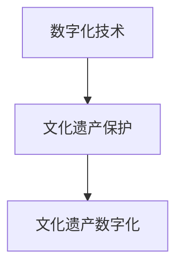

#### 核心算法原理讲解

- 伪代码：
  ```
  Function 文化遗产数字化(文化遗产，数字化技术) {
    // 对文化遗产进行数字化处理
    数字化文化遗产 = 处理文化遗产(文化遗产，数字化技术)
    return 数字化文化遗产
  }
  ```

#### 数学模型和数学公式 & 详细讲解 & 举例说明

- 数学公式：
  $$
  \text{文化遗产价值} = \text{文化价值} \times \text{数字化程度}
  $$
- 举例说明：
  - 如果一个文化遗产的文化价值为10，数字化程度为80%，那么其数字化价值为8。

#### 项目实战

- 描述：对一个古建筑进行数字化处理。
- 实现步骤：
  1. 收集古建筑的相关文献资料。
  2. 使用3D扫描技术获取古建筑的三维模型。
  3. 利用数字技术对古建筑进行修复。
  4. 将数字化后的古建筑上传至虚拟博物馆供公众浏览。

---

### 1.2 文化遗产数字化与信息技术

#### 核心概念与联系

$$
\text{文化遗产数字化} = \text{信息技术} \times \text{文化遗产保护}
$$

- **Mermaid流程图**

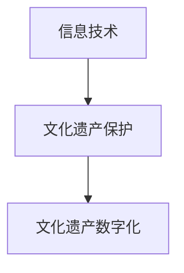

#### 核心算法原理讲解

- 伪代码：
  ```
  Function 文化遗产数字化(文化遗产，信息技术) {
    // 对文化遗产进行数字化处理
    数字化文化遗产 = 处理文化遗产(文化遗产，信息技术)
    return 数字化文化遗产
  }
  ```

#### 数学模型和数学公式 & 详细讲解 & 举例说明

- 数学公式：
  $$
  \text{数字化技术效率} = \frac{\text{数字化文化遗产数量}}{\text{投入的人力、物力、时间成本}}
  $$
- 举例说明：
  - 如果一个月内数字化了10个文化遗产项目，而投入了100人天的工作量，那么数字化技术效率为10。

#### 项目实战

- 描述：利用计算机视觉技术对一幅名画进行数字化处理。
- 实现步骤：
  1. 使用图像预处理技术对名画图像进行去噪和增强。
  2. 应用图像识别算法对名画中的细节进行识别和分析。
  3. 将数字化后的名画上传至在线画廊供用户欣赏。

---

### 1.3 文化遗产数字化与虚拟现实

#### 核心概念与联系

$$
\text{文化遗产数字化} = \text{虚拟现实技术} \times \text{文化遗产展示}
$$

- **Mermaid流程图**

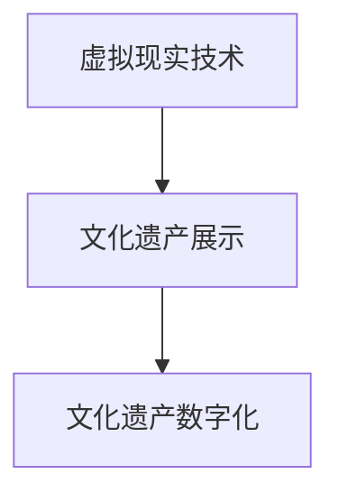

#### 核心算法原理讲解

- 伪代码：
  ```
  Function 文化遗产数字化(文化遗产，虚拟现实技术) {
    // 对文化遗产进行数字化处理，并结合虚拟现实技术进行展示
    数字化文化遗产 = 处理文化遗产(文化遗产，虚拟现实技术)
    return 数字化文化遗产
  }
  ```

#### 数学模型和数学公式 & 详细讲解 & 举例说明

- 数学公式：
  $$
  \text{用户参与度} = \frac{\text{用户交互次数}}{\text{展示时间}}
  $$
- 举例说明：
  - 如果一个虚拟博物馆的展示时间为2小时，用户交互次数为100次，那么用户参与度为50。

#### 项目实战

- 描述：创建一个虚拟博物馆，展示多个文化遗产项目。
- 实现步骤：
  1. 收集文化遗产的三维模型和相关信息。
  2. 开发虚拟现实平台，使用户可以在虚拟环境中互动和探索文化遗产。
  3. 进行用户测试和反馈收集，优化虚拟博物馆的用户体验。

---

### 1.4 文化遗产数字化与虚拟现实案例

#### 核心概念与联系

$$
\text{文化遗产数字化} = \text{虚拟现实技术} \times \text{文化遗产展示}
$$

- **Mermaid流程图**


#### 核心算法原理讲解

- 伪代码：
  ```
  Function 文化遗产数字化(文化遗产，虚拟现实技术) {
    // 对文化遗产进行数字化处理，并结合虚拟现实技术进行展示
    数字化文化遗产 = 处理文化遗产(文化遗产，虚拟现实技术)
    return 数字化文化遗产
  }
  ```

#### 数学模型和数学公式 & 详细讲解 & 举例说明

- 数学公式：
  $$
  \text{展示效果评分} = \frac{\text{用户满意度评分}}{\text{展示次数}}
  $$
- 举例说明：
  - 如果一个虚拟博物馆的平均用户满意度评分为4.5，展示次数为100次，那么展示效果评分为4.5。

#### 项目实战

- 描述：创建一个基于虚拟现实的古墓探险游戏。
- 实现步骤：
  1. 收集古墓的三维模型和相关历史背景信息。
  2. 开发虚拟现实游戏平台，使用户可以进入古墓进行探险。
  3. 设计游戏流程和互动元素，提高用户体验。
  4. 收集用户反馈，不断优化游戏内容。

---

## 第二部分：提示词在文化遗产数字化中的应用

### 2.1 提示词的基本概念

#### 核心概念与联系

$$
\text{提示词} = \text{关键词} + \text{语义信息}
$$

- **Mermaid流程图**

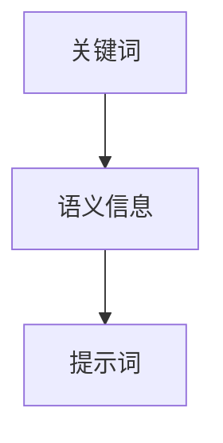

#### 核心算法原理讲解

- 伪代码：
  ```
  Function 提示词生成(关键词，语义信息) {
    // 生成具有语义信息的提示词
    提示词 = 拼接关键词和语义信息(关键词，语义信息)
    return 提示词
  }
  ```

#### 数学模型和数学公式 & 详细讲解 & 举例说明

- 数学公式：
  $$
  \text{提示词相关性} = \frac{\text{语义匹配度}}{\text{总关键词数}}
  $$
- 举例说明：
  - 如果一个提示词与关键词的语义匹配度为80%，关键词总数为5，那么提示词相关性为80%。

#### 项目实战

- 描述：使用提示词进行虚拟博物馆的导览。
- 实现步骤：
  1. 收集博物馆内展品的详细信息。
  2. 设计一系列提示词，用于引导用户了解展品。
  3. 将提示词嵌入虚拟博物馆的导航系统中。
  4. 进行用户测试，优化提示词设计。

---

### 2.2 提示词在文化遗产数字化中的应用

#### 核心概念与联系

$$
\text{提示词应用} = \text{虚拟博物馆} + \text{文化遗产保护}
$$

- **Mermaid流程图**

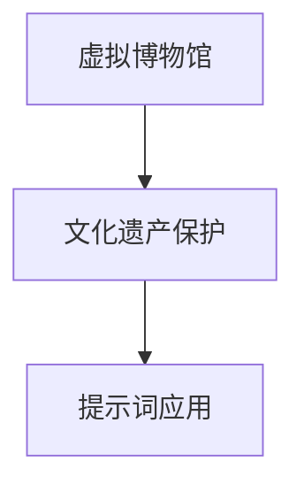

#### 核心算法原理讲解

- 伪代码：
  ```
  Function 提示词应用(虚拟博物馆，文化遗产) {
    // 在虚拟博物馆中使用提示词进行文化遗产展示
    展示效果 = 应用提示词(虚拟博物馆，文化遗产)
    return 展示效果
  }
  ```

#### 数学模型和数学公式 & 详细讲解 & 举例说明

- 数学公式：
  $$
  \text{用户满意度} = \frac{\text{用户评价得分}}{\text{用户评价总数}}
  $$
- 举例说明：
  - 如果一个虚拟博物馆的用户满意度评分为90%，用户评价总数为100，那么用户满意度为90%。

#### 项目实战

- 描述：创建一个基于提示词的虚拟博物馆导览系统。
- 实现步骤：
  1. 收集博物馆内展品的详细信息。
  2. 设计提示词库，用于导览系统。
  3. 开发导览系统，集成提示词库。
  4. 进行用户测试和反馈收集，优化系统。

---

### 2.3 提示词在文化遗产数字化教育中的应用

#### 核心概念与联系

$$
\text{提示词教育应用} = \text{文化遗产教育} + \text{信息技术教学}
$$

- **Mermaid流程图**

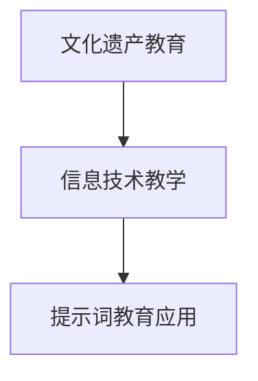

#### 核心算法原理讲解

- 伪代码：
  ```
  Function 提示词教育应用(文化遗产教育，信息技术教学) {
    // 在文化遗产教育和信息技术教学中使用提示词
    教学效果 = 应用提示词(文化遗产教育，信息技术教学)
    return 教学效果
  }
  ```

#### 数学模型和数学公式 & 详细讲解 & 举例说明

- 数学公式：
  $$
  \text{学生掌握程度} = \frac{\text{学生正确回答的题目数}}{\text{学生总答题数}}
  $$
- 举例说明：
  - 如果学生在使用提示词进行文化遗产学习后，正确回答的题目数为20，总答题数为30，那么学生掌握程度为20/30。

#### 项目实战

- 描述：开发一个基于提示词的文化遗产教育软件。
- 实现步骤：
  1. 设计提示词库，包含文化遗产相关的关键词和语义信息。
  2. 开发教育软件，集成提示词库和互动功能。
  3. 进行用户测试，评估教育软件的效果。
  4. 根据用户反馈不断优化软件。

---

## 第三部分：利用提示词重现历史

### 3.1 利用提示词重建历史场景

#### 核心概念与联系

$$
\text{历史场景重建} = \text{提示词} + \text{虚拟现实技术}
$$

- **Mermaid流程图**

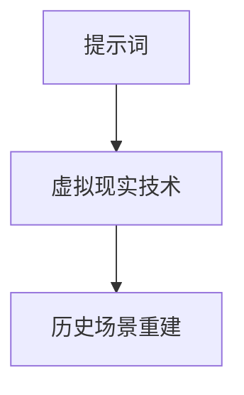

#### 核心算法原理讲解

- 伪代码：
  ```
  Function 历史场景重建(提示词，虚拟现实技术) {
    // 使用提示词和虚拟现实技术重建历史场景
    重建场景 = 应用提示词和虚拟现实技术(提示词，虚拟现实技术)
    return 重建场景
  }
  ```

#### 数学模型和数学公式 & 详细讲解 & 举例说明

- 数学公式：
  $$
  \text{场景还原度} = \frac{\text{重建场景与历史场景的一致性}}{\text{总场景元素数}}
  $$
- 举例说明：
  - 如果一个历史场景重建的还原度为90%，总场景元素数为100，那么场景还原度为90。

#### 项目实战

- 描述：使用虚拟现实技术重建一个古罗马市集的场景。
- 实现步骤：
  1. 收集古罗马市集的历史文献和考古资料。
  2. 设计一系列提示词，用于描述市集的各个元素。
  3. 利用虚拟现实技术，将提示词应用于场景重建。
  4. 进行用户测试，评估场景重建的效果。

---

### 3.2 利用提示词重现历史事件

#### 核心概念与联系

$$
\text{历史事件重现} = \text{提示词} + \text{虚拟现实技术} + \text{多媒体技术}
$$

- **Mermaid流程图**

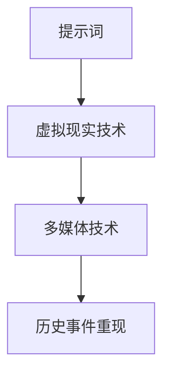

#### 核心算法原理讲解

- 伪代码：
  ```
  Function 历史事件重现(提示词，虚拟现实技术，多媒体技术) {
    // 使用提示词、虚拟现实技术和多媒体技术重现历史事件
    重建事件 = 应用提示词、虚拟现实技术和多媒体技术(提示词，虚拟现实技术，多媒体技术)
    return 重建事件
  }
  ```

#### 数学模型和数学公式 & 详细讲解 & 举例说明

- 数学公式：
  $$
  \text{事件还原度} = \frac{\text{重建事件与真实事件的相似度}}{\text{总事件元素数}}
  $$
- 举例说明：
  - 如果一个历史事件的重建还原度为85%，总事件元素数为10，那么事件还原度为85。

#### 项目实战

- 描述：使用虚拟现实和多媒体技术重现一次历史上的重要战役。
- 实现步骤：
  1. 收集与战役相关的历史资料、地图和影像资料。
  2. 设计一系列提示词，用于描述战役的各个阶段。
  3. 利用虚拟现实技术，模拟战役的场景和战斗过程。
  4. 使用多媒体技术，添加音效、动画和文字说明，增强事件的真实感。
  5. 进行用户测试，评估事件重现的效果。

---

### 3.3 利用提示词在历史教育中的应用

#### 核心概念与联系

$$
\text{历史教育} = \text{提示词} + \text{信息技术} + \text{教育方法}
$$

- **Mermaid流程图**

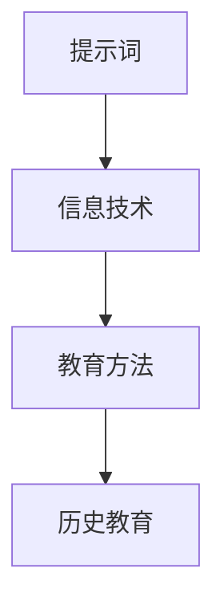

#### 核心算法原理讲解

- 伪代码：
  ```
  Function 历史教育(提示词，信息技术，教育方法) {
    // 使用提示词、信息技术和教育方法进行历史教育
    教育效果 = 应用提示词、信息技术和教育方法(提示词，信息技术，教育方法)
    return 教育效果
  }
  ```

#### 数学模型和数学公式 & 详细讲解 & 举例说明

- 数学公式：
  $$
  \text{学生知识掌握度} = \frac{\text{学生正确回答的题目数}}{\text{学生总答题数}}
  $$
- 举例说明：
  - 如果学生在使用提示词进行历史学习后，正确回答的题目数为25，总答题数为30，那么学生知识掌握度为25/30。

#### 项目实战

- 描述：开发一个基于提示词的历史教育软件。
- 实现步骤：
  1. 设计提示词库，包含与历史事件相关的重要关键词和语义信息。
  2. 开发教育软件，集成提示词库和互动功能。
  3. 设计多样化的教学活动和评估方式，提高学生的学习兴趣和参与度。
  4. 进行用户测试和反馈收集，不断优化软件内容和用户体验。

---

## 第四部分：提示词与文化遗产数字化的发展趋势

### 4.1 提示词在文化遗产数字化中的未来发展方向

#### 核心概念与联系

$$
\text{提示词未来发展方向} = \text{人工智能技术} + \text{大数据分析} + \text{虚拟现实技术}
$$

- **Mermaid流程图**

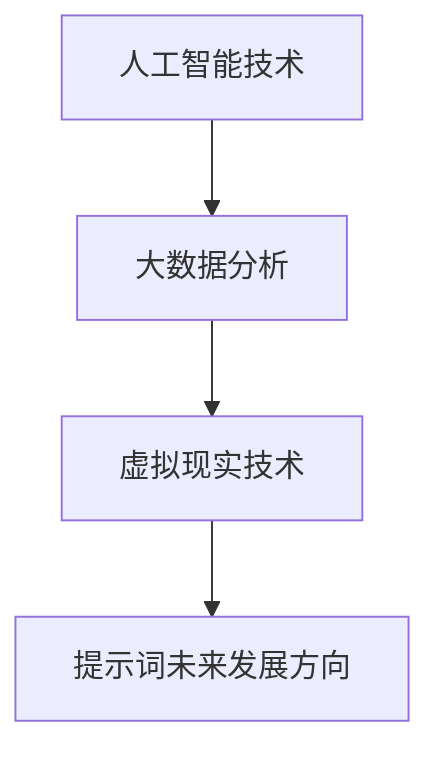

#### 核心算法原理讲解

- 伪代码：
  ```
  Function 提示词未来发展方向(人工智能技术，大数据分析，虚拟现实技术) {
    // 结合人工智能技术、大数据分析和虚拟现实技术，推动提示词的发展
    提示词创新 = 应用人工智能技术、大数据分析和虚拟现实技术(人工智能技术，大数据分析，虚拟现实技术)
    return 提示词创新
  }
  ```

#### 数学模型和数学公式 & 详细讲解 & 举例说明

- 数学公式：
  $$
  \text{提示词创新效率} = \frac{\text{创新的提示词数量}}{\text{研究投入的时间成本}}
  $$
- 举例说明：
  - 如果在一年内创新了100个提示词，而研究投入的时间成本为500人天，那么提示词创新效率为100/500。

#### 项目实战

- 描述：结合人工智能技术和虚拟现实技术，开发一个智能提示词生成系统。
- 实现步骤：
  1. 收集大量文化遗产相关的数据和文献。
  2. 应用人工智能技术，训练一个提示词生成模型。
  3. 设计用户界面，允许用户输入关键词，生成相关的提示词。
  4. 进行用户测试和反馈收集，不断优化系统性能。

---

### 4.2 文化遗产数字化面临的挑战与机遇

#### 核心概念与联系

$$
\text{文化遗产数字化挑战与机遇} = \text{技术瓶颈} + \text{市场需求} + \text{政策支持}
$$

- **Mermaid流程图**

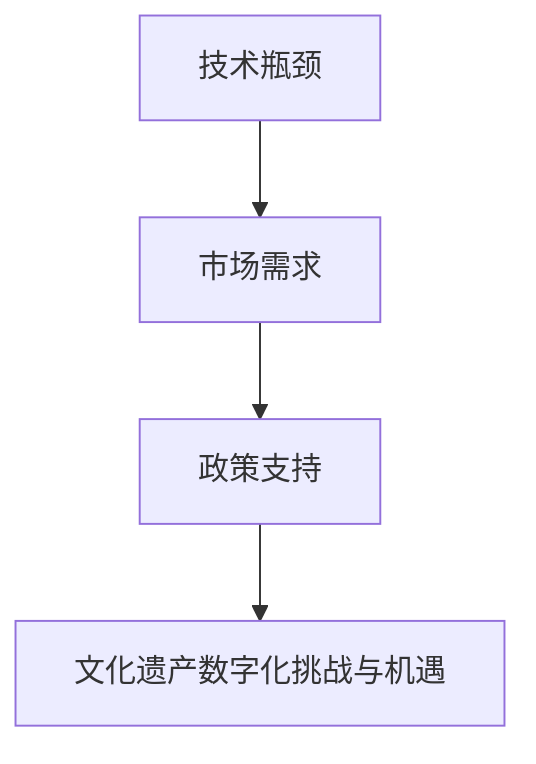

#### 核心算法原理讲解

- 伪代码：
  ```
  Function 文化遗产数字化挑战与机遇(技术瓶颈，市场需求，政策支持) {
    // 分析技术瓶颈、市场需求和政策支持对文化遗产数字化的影响
    影响分析 = 分析技术瓶颈、市场需求和政策支持(技术瓶颈，市场需求，政策支持)
    return 影响分析
  }
  ```

#### 数学模型和数学公式 & 详细讲解 & 举例说明

- 数学公式：
  $$
  \text{数字化收益} = \text{市场需求量} \times \text{政策支持度} - \text{技术成本}
  $$
- 举例说明：
  - 如果市场需求量为1000，政策支持度为90%，技术成本为500，那么数字化收益为900。

#### 项目实战

- 描述：分析某文化遗产数字化项目的市场前景和政策支持。
- 实现步骤：
  1. 收集相关市场需求数据，包括用户需求和市场规模。
  2. 分析国家政策对文化遗产数字化项目的支持程度。
  3. 计算项目的预期收益，评估项目的可行性。
  4. 提出优化建议，提高项目的市场竞争力。

---

### 4.3 文化遗产数字化的发展策略与建议

#### 核心概念与联系

$$
\text{文化遗产数字化策略} = \text{技术创新} + \text{市场推广} + \text{政策引导}
$$

- **Mermaid流程图**

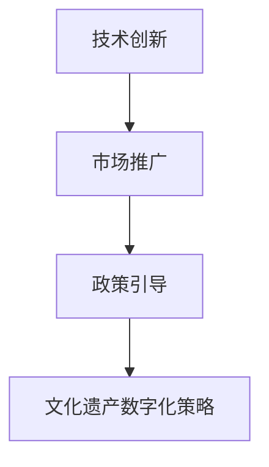

#### 核心算法原理讲解

- 伪代码：
  ```
  Function 文化遗产数字化策略(技术创新，市场推广，政策引导) {
    // 制定文化遗产数字化的发展策略
    策略 = 制定技术创新、市场推广和政策引导的策略(技术创新，市场推广，政策引导)
    return 策略
  }
  ```

#### 数学模型和数学公式 & 详细讲解 & 举例说明

- 数学公式：
  $$
  \text{策略有效性} = \frac{\text{实现目标的项目数量}}{\text{总项目数量}}
  $$
- 举例说明：
  - 如果有10个文化遗产数字化项目实现了目标，总项目数量为20，那么策略有效性为10/20。

#### 项目实战

- 描述：制定一个文化遗产数字化项目的实施策略。
- 实现步骤：
  1. 分析当前的技术趋势和市场需求。
  2. 确定项目的核心目标和预期成果。
  3. 设计具体的技术方案和实施计划。
  4. 制定市场推广策略和政策支持方案。
  5. 随时跟踪项目进度和成果，及时调整策略。

---

## 第五部分：附录

### 5.1 文化遗产数字化相关工具与资源

#### 核心概念与联系

$$
\text{文化遗产数字化工具} = \text{3D扫描技术} + \text{虚拟现实软件} + \text{大数据分析平台}
$$

- **Mermaid流程图**

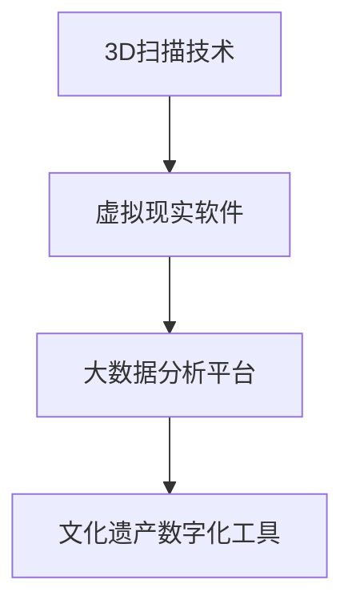

#### 核心算法原理讲解

- 伪代码：
  ```
  Function 文化遗产数字化工具(3D扫描技术，虚拟现实软件，大数据分析平台) {
    // 结合3D扫描技术、虚拟现实软件和大数据分析平台，实现文化遗产数字化
    数字化工具 = 结合3D扫描技术、虚拟现实软件和大数据分析平台(3D扫描技术，虚拟现实软件，大数据分析平台)
    return 数字化工具
  }
  ```

#### 数学模型和数学公式 & 详细讲解 & 举例说明

- 数学公式：
  $$
  \text{数字化效率} = \frac{\text{数字化文化遗产数量}}{\text{使用工具的时间成本}}
  $$
- 举例说明：
  - 如果在一个月内数字化了10个文化遗产项目，使用工具的时间成本为200人天，那么数字化效率为10/200。

#### 项目实战

- 描述：选择合适的数字化工具进行文化遗产项目。
- 实现步骤：
  1. 分析项目需求，确定需要使用的工具类型。
  2. 比较不同工具的性能和成本，选择最适合的工具。
  3. 搭建工具环境，进行项目实施。
  4. 对数字化成果进行评估，确保符合项目要求。

---

### 5.2 文化遗产数字化案例研究

#### 核心概念与联系

$$
\text{文化遗产数字化案例} = \text{项目背景} + \text{技术实施} + \text{成果评估}
$$

- **Mermaid流程图**

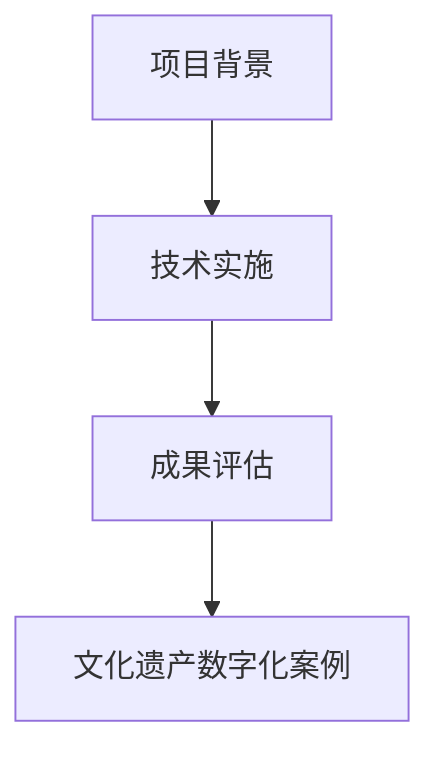

#### 核心算法原理讲解

- 伪代码：
  ```
  Function 文化遗产数字化案例(项目背景，技术实施，成果评估) {
    // 分析文化遗产数字化案例，评估项目效果
    案例分析 = 分析项目背景、技术实施和成果评估(项目背景，技术实施，成果评估)
    return 案例分析
  }
  ```

#### 数学模型和数学公式 & 详细讲解 & 举例说明

- 数学公式：
  $$
  \text{项目成功度} = \frac{\text{项目完成度}}{\text{项目预期目标}}
  $$
- 举例说明：
  - 如果一个文化遗产数字化项目的完成度为90%，项目预期目标为100，那么项目成功度为90/100。

#### 项目实战

- 描述：研究一个成功的文化遗产数字化项目。
- 实现步骤：
  1. 收集项目背景信息，包括项目目标、技术方案和实施过程。
  2. 分析项目实施中的技术难点和解决方案。
  3. 评估项目的成果，包括数字化效果、用户反馈和经济效益。
  4. 提出项目成功的经验教训，为其他项目提供参考。

---

## 总结与展望

在本文中，我们系统地探讨了文化遗产数字化的概念、应用和未来趋势。通过提示词的应用，我们能够更有效地进行文化遗产的数字化处理和展示。这不仅仅是对文化遗产的保护，更是让更多的人能够通过数字化手段接触和了解历史。

展望未来，随着人工智能技术和大数据分析的不断进步，提示词在文化遗产数字化中的应用将更加智能化和个性化。同时，虚拟现实和增强现实技术的发展，将为文化遗产的展示和体验带来前所未有的可能性。

我们呼吁更多的技术专家和研究者参与到文化遗产数字化的工作中来，共同推动这一领域的创新与发展。通过技术的力量，让文化遗产的辉煌得以传承和再现，让更多的人能够感受到历史的魅力。让我们一起，用数字化手段，守护和传承人类的共同遗产。

