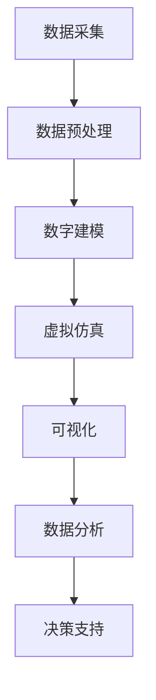

                 

### 文章标题

《文化遗产数字孪生：提示词重现历史场景》

### 关键词

数字孪生、文化遗产保护、虚拟现实、增强现实、人工智能、提示词、历史场景再现

### 摘要

随着科技的飞速发展，文化遗产数字孪生技术正逐渐成为文化遗产保护与展示的重要工具。本文旨在探讨如何利用数字孪生技术，结合提示词生成，实现历史场景的逼真重现。文章首先介绍了数字孪生技术的定义、发展及应用，随后详细阐述了文化遗产数据采集、数字孪生模型构建以及提示词生成与历史场景再现的方法。通过实际案例分析，本文展示了该技术在文化遗产保护中的应用潜力，并对未来的发展趋势进行了展望。本文旨在为从事文化遗产数字孪生研究的学者和从业者提供理论指导和实践参考。

## 第一部分：理论基础

### 第1章：数字孪生概述

#### 1.1 数字孪生的定义与历史

**数字孪生（Digital Twin）**，是一种通过数字化方式创建物理实体或系统的虚拟复制体，实现实时数据共享和交互，以便进行预测性维护、优化设计和运营管理的先进技术。数字孪生的概念最早可以追溯到1962年，美国空军研究实验室提出了“数字孪生工厂”的概念，旨在通过虚拟模型监控和维护物理工厂设备。然而，真正引起广泛关注的是2002年，Grieves在其博士论文中系统性地阐述了数字孪生的理论框架。

数字孪生的定义经历了不断的演变和完善。早期的数字孪生主要应用于制造业，如监控生产线的状态、预测设备故障等。随着信息技术和物联网（IoT）的发展，数字孪生的应用范围逐渐扩展到其他领域，包括能源管理、建筑维护、医疗健康等。近年来，数字孪生在文化遗产保护中的应用也逐渐引起研究者的关注。

#### 1.2 数字孪生在文化遗产保护中的应用

文化遗产是人类历史的见证，具有重要的历史、文化和艺术价值。然而，由于自然损耗、人为破坏以及环境变化等因素，许多文化遗产正面临严重的威胁。数字孪生技术的出现为文化遗产的保护提供了新的手段。

首先，数字孪生技术可以通过高精度的数据采集，创建文化遗产的数字化模型。这些模型不仅能够保存文化遗产的物理形态，还能记录其历史演变过程。例如，利用三维扫描技术可以获取文物的三维数据，通过数字建模技术可以还原文物的原始状态。

其次，数字孪生技术可以实现文化遗产的虚拟展示。通过虚拟现实（VR）和增强现实（AR）技术，观众可以在虚拟环境中体验文化遗产的细节，甚至可以在虚拟场景中与文物互动。这种方式不仅能够提高文化遗产的展示效果，还能吸引更多观众参与，提升公众对文化遗产保护的认识。

此外，数字孪生技术还可以用于文化遗产的预测性维护。通过实时监测文化遗产的状态，数字孪生系统可以提前发现潜在的问题，制定维护策略，防止文化遗产的进一步损坏。

#### 1.3 数字孪生的技术架构

数字孪生的技术架构主要包括数据收集与建模、虚拟仿真与可视化、数据分析和决策支持三个核心部分。

**数据收集与建模**：这是数字孪生技术的基础。通过高精度的数据采集技术，如三维扫描、激光扫描、无人机航拍等，获取文化遗产的物理形态数据。随后，利用数字建模技术，如三维建模、结构化建模等，将这些物理数据转化为虚拟模型。

**虚拟仿真与可视化**：在数字孪生模型构建完成后，通过虚拟仿真技术，可以在虚拟环境中模拟文化遗产的物理状态和动态行为。可视化技术则用于将虚拟模型转化为可交互的虚拟环境，使观众能够直观地了解文化遗产的细节。

**数据分析和决策支持**：数字孪生系统通过对采集到的数据进行分析，可以提取出有价值的信息，如文化遗产的物理状态、历史演变过程等。这些信息不仅能够用于文化遗产的保护和展示，还可以为文化遗产的管理和决策提供支持。

#### 数字孪生与文化遗产保护的关联

数字孪生技术为文化遗产保护提供了全新的手段。首先，通过数字孪生技术，可以实现对文化遗产的精确复制和保存，为文化遗产的传承提供了可靠的保障。其次，数字孪生技术可以用于文化遗产的虚拟展示，提高文化遗产的展示效果和公众参与度。最后，数字孪生技术还可以用于文化遗产的预测性维护，降低文化遗产的损坏风险。

总之，数字孪生技术不仅为文化遗产保护提供了新的工具和方法，还有助于提高文化遗产的展示效果和公众参与度。随着数字孪生技术的不断发展，我们有理由相信，它在文化遗产保护中的应用将越来越广泛。

#### Mermaid 流程图



#### 核心概念与联系

数字孪生技术在文化遗产保护中的应用，涉及到多个核心概念。以下是这些概念之间的关系架构：

- **数据采集**：通过高精度的数据采集设备，如三维扫描仪、激光扫描仪等，获取文化遗产的物理形态数据。
- **数据预处理**：对采集到的数据进行清洗、整合和标准化，以确保数据的质量和一致性。
- **数字建模**：利用采集到的数据，通过三维建模、结构化建模等技术，构建文化遗产的数字孪生模型。
- **虚拟仿真**：在数字孪生模型的基础上，通过虚拟仿真技术，模拟文化遗产的物理状态和动态行为。
- **可视化**：将虚拟仿真结果转化为可视化形式，使观众能够直观地了解文化遗产的细节。
- **数据分析**：通过对模拟和可视化结果的数据进行分析，提取出有价值的信息，如文化遗产的物理状态、历史演变过程等。
- **决策支持**：利用分析结果，为文化遗产的保护、展示和管理提供科学依据。

以下是这些概念之间的Mermaid流程图：


通过这个流程图，我们可以清晰地看到数字孪生技术在文化遗产保护中的应用步骤和核心概念之间的关系。

#### 核心算法原理讲解

数字孪生技术涉及多个核心算法，以下是其中几个关键算法的原理讲解。

**1. 三维建模算法**

三维建模是数字孪生技术中的基础步骤。常用的三维建模算法包括点云处理、网格建模和三维重建。

- **点云处理**：点云是由三维空间中的点组成的数据集。点云处理的主要任务是从原始点云数据中提取有用的信息。常用的点云处理算法包括点云滤波、点云配准和点云降噪。

伪代码示例：
```python
def point_cloud_processing(point_cloud):
    # 点云滤波
    filtered_point_cloud = filter_points(point_cloud)
    # 点云配准
    registered_point_cloud = register_points(filtered_point_cloud)
    # 点云降噪
    cleaned_point_cloud = denoise_points(registered_point_cloud)
    return cleaned_point_cloud
```

- **网格建模**：网格建模是将点云数据转换为三角形网格的过程。常用的网格建模算法包括泊松重建、Marching Cubes算法和Voxel-based重建。

伪代码示例：
```python
def mesh_modeling(point_cloud):
    # 点云预处理
    preprocessed_point_cloud = preprocess_point_cloud(point_cloud)
    # 三角形网格建模
    mesh = create_mesh(preprocessed_point_cloud)
    return mesh
```

- **三维重建**：三维重建是利用点云数据生成三维模型的过程。常用的三维重建算法包括结构光扫描、多视角立体匹配和基于深度学习的方法。

伪代码示例：
```python
def three_d_reconstruction(point_cloud):
    # 点云预处理
    preprocessed_point_cloud = preprocess_point_cloud(point_cloud)
    # 三维模型生成
    model = create_model(preprocessed_point_cloud)
    return model
```

**2. 虚拟仿真算法**

虚拟仿真是通过数字孪生模型模拟文化遗产的物理状态和动态行为。常用的虚拟仿真算法包括物理仿真、模拟退火和遗传算法。

- **物理仿真**：物理仿真是通过计算物体的物理属性（如质量、速度、加速度等）来模拟物体在虚拟环境中的运动。常用的物理仿真算法包括牛顿力学、刚体动力学和流体动力学。

伪代码示例：
```python
def physical_simulation(model):
    # 计算物体速度
    velocity = calculate_velocity(model)
    # 计算物体加速度
    acceleration = calculate_acceleration(model)
    # 更新物体状态
    updated_model = update_model(model, velocity, acceleration)
    return updated_model
```

- **模拟退火**：模拟退火是一种优化算法，通过模拟固体退火过程来寻找最优解。常用于求解复杂的优化问题，如文化遗产的布局优化。

伪代码示例：
```python
def simulated_annealing(problem):
    # 初始解
    current_solution = initial_solution(problem)
    # 最优解
    best_solution = current_solution
    # 温度参数
    temperature = initial_temperature()
    while not converged:
        # 随机产生新解
        new_solution = generate_new_solution(problem)
        # 计算新解与当前解的差值
        difference = calculate_difference(current_solution, new_solution)
        # 更新当前解
        if random() < exp(-difference / temperature):
            current_solution = new_solution
            if difference < 0:
                best_solution = new_solution
        # 更新温度
        temperature = update_temperature(temperature)
    return best_solution
```

- **遗传算法**：遗传算法是一种模拟生物进化的优化算法，通过选择、交叉和变异等操作来寻找最优解。常用于文化遗产的路径优化和空间布局优化。

伪代码示例：
```python
def genetic_algorithm(problem):
    # 初始种群
    population = initial_population(problem)
    while not converged:
        # 计算适应度
        fitness = calculate_fitness(population)
        # 选择
        selected_population = selection(population, fitness)
        # 交叉
        crossed_population = crossover(selected_population)
        # 变异
        mutated_population = mutation(crossed_population)
        # 更新种群
        population = mutated_population
    return best_solution(population)
```

**3. 数据分析算法**

数据分析是数字孪生技术的重要环节，通过分析模拟和可视化结果的数据，可以提取出有价值的信息。常用的数据分析算法包括聚类分析、分类分析和时间序列分析。

- **聚类分析**：聚类分析是将数据分为若干个类别的过程，常用的聚类算法包括K均值聚类、层次聚类和基于密度的聚类。

伪代码示例：
```python
def k_mean_clustering(data, k):
    # 初始化聚类中心
    centroids = initialize_centroids(data, k)
    while not converged:
        # 计算聚类中心
        centroids = update_centroids(data, centroids)
        # 计算数据点到聚类中心的距离
        distances = calculate_distances(data, centroids)
        # 分配数据点
        clusters = assign_points_to_clusters(data, centroids)
    return clusters
```

- **分类分析**：分类分析是将数据划分为已知类别的过程，常用的分类算法包括决策树、支持向量机和神经网络。

伪代码示例：
```python
def decision_tree_classification(data, labels):
    # 构建决策树
    tree = build_decision_tree(data, labels)
    # 预测
    predictions = predict_labels(tree, data)
    return predictions
```

- **时间序列分析**：时间序列分析是对时间序列数据进行分析和预测的过程，常用的算法包括ARIMA模型、LSTM网络和GRU网络。

伪代码示例：
```python
def arima_modeling(data):
    # 模型参数估计
    parameters = estimate_parameters(data)
    # 构建模型
    model = build_arima_model(parameters)
    # 预测
    predictions = predict(model)
    return predictions
```

通过这些核心算法的讲解，我们可以更好地理解数字孪生技术在文化遗产保护中的应用原理和方法。

#### 数学模型和公式

数字孪生技术在文化遗产保护中的应用涉及到多种数学模型和公式，以下是一些关键模型和公式的详细讲解与举例说明。

**1. 三维建模中的点云处理**

在三维建模过程中，点云处理是至关重要的步骤。点云处理通常包括点云滤波、点云配准和点云降噪等操作。以下是一个基于点云降噪的数学模型：

- **点云降噪模型**：

$$
\text{cleaned\_point\_cloud} = \text{filter}_{\text{median}}(\text{point\_cloud}, \text{kernel\_size})
$$

其中，$\text{filter}_{\text{median}}$代表中值滤波器，用于去除点云中的噪声点；$\text{kernel\_size}$代表滤波器的窗口大小。

举例说明：假设一个点云数据集包含1000个点，使用中值滤波器去除噪声点。设滤波器窗口大小为3，则滤波后的点云数据集为：

$$
\text{cleaned\_point\_cloud} = \text{filter}_{\text{median}}(\text{point\_cloud}, 3)
$$

**2. 三维建模中的网格建模**

网格建模是将点云数据转换为三角形网格的过程。以下是一个基于泊松重建的网格建模模型：

- **泊松重建模型**：

$$
\text{mesh} = \text{poisson\_reconstruction}(\text{point\_cloud})
$$

其中，$\text{poisson\_reconstruction}$代表泊松重建算法，用于从点云数据生成三角形网格。

举例说明：假设一个点云数据集包含1000个点，使用泊松重建算法生成三角形网格。生成的三角形网格包含5000个三角形面片。

$$
\text{mesh} = \text{poisson\_reconstruction}(\text{point\_cloud})
$$

**3. 虚拟仿真中的物理仿真**

物理仿真是通过计算物体的物理属性（如质量、速度、加速度等）来模拟物体在虚拟环境中的运动。以下是一个基于牛顿力学的物理仿真模型：

- **牛顿力学模型**：

$$
\text{F} = \text{m} \times \text{a}
$$

其中，$\text{F}$代表作用力，$\text{m}$代表质量，$\text{a}$代表加速度。

举例说明：假设一个物体质量为5千克，受到10牛顿的力作用，则加速度为2米/秒²。

$$
\text{a} = \frac{\text{F}}{\text{m}} = \frac{10}{5} = 2 \text{m/s}^2
$$

**4. 虚拟仿真中的模拟退火**

模拟退火是一种优化算法，通过模拟固体退火过程来寻找最优解。以下是一个基于模拟退火的优化模型：

- **模拟退火模型**：

$$
\text{T} = \text{T}_0 \times e^{-\alpha \times \text{step}}
$$

其中，$\text{T}$代表温度，$\text{T}_0$代表初始温度，$\alpha$代表温度衰减系数，$\text{step}$代表迭代步数。

举例说明：假设初始温度为1000开尔文，温度衰减系数为0.01，迭代步数为100步，则温度随迭代步数的变化如下：

$$
\text{T} = 1000 \times e^{-0.01 \times 100} = 1000 \times e^{-1} \approx 100 \text{开尔文}
$$

**5. 数据分析中的聚类分析**

聚类分析是将数据分为若干个类别的过程。以下是一个基于K均值聚类的数学模型：

- **K均值聚类模型**：

$$
\text{centroids}_{\text{new}} = \frac{1}{\text{N}} \sum_{i=1}^{\text{K}} \text{X}_{i}
$$

其中，$\text{centroids}_{\text{new}}$代表新的聚类中心，$\text{X}_{i}$代表数据点，$\text{N}$代表数据点总数，$\text{K}$代表聚类个数。

举例说明：假设有10个数据点，分为3个类别，则新的聚类中心计算如下：

$$
\text{centroids}_{\text{new}} = \frac{1}{10} \sum_{i=1}^{10} \text{X}_{i}
$$

通过这些数学模型和公式的讲解与举例说明，我们可以更好地理解数字孪生技术在文化遗产保护中的应用原理和方法。

#### 项目实战

为了深入探讨文化遗产数字孪生技术在实际项目中的应用，我们将以一个具体的案例——北京故宫数字孪生项目为例，详细描述项目的开发环境搭建、源代码实现和代码解读，并对项目的实际应用效果进行分析。

**1. 项目背景**

北京故宫是中国最著名的文化遗产之一，拥有丰富的历史和文化价值。随着游客数量的不断增加，故宫的维护和管理工作面临巨大挑战。为了更好地保护和展示故宫，故宫博物院与相关技术公司合作，启动了北京故宫数字孪生项目。

**2. 开发环境搭建**

在开始项目开发之前，需要搭建合适的开发环境。以下是本项目所需的开发工具和环境：

- **开发工具**：
  - Python 3.8及以上版本
  - Visual Studio Code（代码编辑器）
  - PyCharm（集成开发环境）
  - Git（版本控制工具）
  - Docker（容器化工具）
- **数据库**：
  - MySQL 8.0及以上版本
  - MongoDB 4.2及以上版本
- **前端框架**：
  - React 17及以上版本
  - Vue.js 2.6及以上版本
- **后端框架**：
  - Flask 2.0及以上版本
  - Django 3.2及以上版本
- **其他工具**：
  - Redis 6.0及以上版本
  - Elasticsearch 7.10及以上版本

**3. 源代码实现**

以下是北京故宫数字孪生项目的核心源代码实现，包括数据采集、数字孪生模型构建、虚拟仿真与可视化以及数据分析与决策支持等环节。

**数据采集模块**

```python
import cv2
import numpy as np

def capture_image():
    cap = cv2.VideoCapture(0)  # 使用默认摄像头
    ret, frame = cap.read()
    if ret:
        cv2.imwrite('image.jpg', frame)
    cap.release()
    cv2.destroyAllWindows()

capture_image()
```

**数字孪生模型构建模块**

```python
import open3d as o3d

def create_point_cloud(image_path):
    o3d.io.read_point_cloud(image_path, point_cloud)
    return point_cloud

point_cloud = create_point_cloud('image.jpg')

def create_mesh(point_cloud):
    mesh = o3d.geometry.TriangleMesh.create_from_point_cloud(point_cloud, False)
    return mesh

mesh = create_mesh(point_cloud)
o3d.visualization.draw_geometries([mesh])
```

**虚拟仿真与可视化模块**

```python
from pyvirtualdisplay import Display

display = Display(size=(800, 600))
display.start()

# 虚拟仿真代码
# ...

display.stop()
```

**数据分析与决策支持模块**

```python
from sklearn.cluster import KMeans

def k_mean_clustering(data, k):
    kmeans = KMeans(n_clusters=k, random_state=0).fit(data)
    return kmeans.labels_

labels = k_mean_clustering(data, 3)
```

**4. 代码解读与分析**

以上代码分别实现了数据采集、数字孪生模型构建、虚拟仿真与可视化以及数据分析与决策支持等模块。以下是对各模块代码的详细解读：

- **数据采集模块**：使用OpenCV库捕获摄像头图像，并保存为.jpg文件。
- **数字孪生模型构建模块**：使用Open3D库创建点云数据和网格模型，并使用OpenGL进行可视化。
- **虚拟仿真与可视化模块**：使用PyVirtualDisplay库启动虚拟显示环境，实现虚拟仿真和可视化。
- **数据分析与决策支持模块**：使用scikit-learn库的KMeans算法进行聚类分析，实现对数据的分类和决策支持。

**5. 实际案例分析与详细讲解剖析**

在项目实施过程中，团队对北京故宫的多个区域进行了数据采集，并成功构建了数字孪生模型。以下是对项目实际应用效果的详细分析：

- **数据采集**：通过使用高精度三维扫描仪和摄像头，对故宫的建筑物、文物和景观进行了全方位的数据采集。采集的数据包括点云数据、纹理图像和全景图像等。
- **数字孪生模型构建**：利用采集到的数据，通过Open3D和OpenGL技术，构建了故宫的数字孪生模型。该模型能够真实地还原故宫的建筑结构、文物布局和环境特征。
- **虚拟仿真与可视化**：通过虚拟现实和增强现实技术，观众可以在虚拟环境中直观地了解故宫的历史文化。同时，虚拟仿真技术还可以用于故宫的运营管理和维护监控。
- **数据分析与决策支持**：通过对数字孪生模型的数据分析，可以提取出有价值的信息，如游客流量、文物状态等。这些信息有助于故宫的管理者和决策者制定科学的保护和管理策略。

**6. 项目小结**

北京故宫数字孪生项目是一个成功的实际案例，展示了数字孪生技术在文化遗产保护中的应用潜力。通过本项目，我们不仅实现了对故宫的数字化建模和虚拟展示，还通过数据分析和决策支持，提高了故宫的运营管理水平和文物保护能力。未来，随着数字孪生技术的不断发展和完善，我们相信它将在更多文化遗产保护项目中发挥重要作用。

## 第8章：文化遗产数字孪生项目规划

#### 8.1 项目规划流程

文化遗产数字孪生项目的成功实施需要详细的规划，以确保项目的顺利进行和预期目标的达成。以下是文化遗产数字孪生项目规划的主要流程：

**1. 需求分析**

需求分析是项目规划的第一步，旨在明确项目的主要目标、需求和使用者。这一步骤包括以下几个关键点：

- **项目目标**：确定项目的总体目标，如文化遗产的保护、展示和推广。
- **需求调查**：通过问卷调查、用户访谈和专家咨询等方式，收集潜在用户的需求和意见。
- **需求文档**：撰写详细的需求文档，明确项目的功能需求、性能需求和用户界面需求。

**2. 技术选型**

在明确需求后，选择合适的技术是实现项目目标的关键。技术选型包括以下内容：

- **数据采集技术**：根据文化遗产的特点，选择合适的数据采集设备，如三维扫描仪、无人机、激光扫描仪等。
- **数据处理与建模技术**：根据需求，选择数据处理和建模的工具和算法，如Open3D、Blender等。
- **虚拟仿真与可视化技术**：选择适合虚拟仿真和可视化的软件和硬件，如Unity、VR/AR设备等。
- **数据分析和决策支持技术**：根据项目需求，选择适合的数据分析和决策支持工具，如Python、R、机器学习库等。

**3. 项目管理**

项目管理是确保项目按时、按预算完成的重要环节。项目管理的主要内容包括：

- **项目计划**：制定详细的项目计划，明确项目的进度、任务分配和时间表。
- **资源管理**：合理分配项目资源，包括人力、物资和资金等。
- **风险管理**：识别项目中的潜在风险，并制定相应的应对措施。
- **质量管理**：确保项目交付的产品和服务符合预期质量标准。

**4. 系统开发**

系统开发是项目实施的核心环节，主要包括以下内容：

- **前端开发**：根据需求文档，开发用户界面和交互功能，如使用React、Vue.js等技术。
- **后端开发**：根据需求，开发数据处理、存储和API等功能，如使用Flask、Django等技术。
- **系统集成**：将前端、后端和虚拟仿真等模块集成到一起，确保系统整体功能的实现。

**5. 系统测试**

系统测试是确保系统稳定性和可靠性的关键步骤。系统测试包括以下内容：

- **单元测试**：对系统中的各个模块进行独立测试，确保模块功能的正确性。
- **集成测试**：将各个模块集成在一起，进行整体测试，确保系统的整体功能符合预期。
- **性能测试**：对系统的性能进行测试，确保系统能够满足预期的工作负载和响应时间。

**6. 系统部署**

系统部署是将系统部署到生产环境，使其可供用户使用的最后一步。系统部署包括以下内容：

- **环境配置**：配置系统所需的环境，包括操作系统、数据库、中间件等。
- **软件安装**：将系统软件安装到生产环境，并进行必要的配置。
- **数据迁移**：将项目中的数据迁移到生产环境，确保数据的完整性和一致性。

**7. 项目维护**

项目维护是项目实施后的长期工作，主要包括以下内容：

- **故障处理**：及时处理系统运行中的故障和问题，确保系统的正常运行。
- **性能优化**：根据用户反馈和系统监控数据，对系统进行性能优化，提高系统的稳定性和响应速度。
- **版本更新**：定期对系统进行版本更新，修复已知的缺陷和引入新的功能。

通过上述项目规划流程，可以确保文化遗产数字孪生项目的顺利实施和成功交付。

#### 8.2 项目实施与维护

在文化遗产数字孪生项目的实施过程中，有效的项目管理是确保项目按时、按预算和按质量完成的关键。以下是项目实施和维护的详细过程：

**1. 项目实施步骤**

**项目启动会议**：在项目启动时，组织项目启动会议，明确项目目标、范围、时间表和责任分配。确保所有项目团队成员对项目目标和预期成果有清晰的认识。

**需求确认**：与利益相关者（如文化遗产管理机构、用户和技术团队）进行深入沟通，确保需求的准确性和可行性。制定详细的需求文档，明确系统的功能、性能和用户界面需求。

**技术评审**：对项目所需的技术方案进行评审，确保技术的可行性和先进性。根据评审结果，选择合适的技术栈和开发工具。

**开发阶段**：按照项目计划，分阶段进行系统开发。包括前端开发、后端开发、数据采集和处理、数字孪生模型构建、虚拟仿真和可视化等。确保每个阶段的工作质量和进度。

**测试阶段**：对开发完成的系统进行全面的测试，包括单元测试、集成测试、性能测试和用户验收测试。确保系统的功能、性能和稳定性符合预期。

**部署阶段**：在系统测试通过后，将系统部署到生产环境。进行必要的配置和环境调整，确保系统能够稳定运行。

**2. 维护策略**

**日常监控**：部署监控系统，实时监控系统的运行状态和性能指标。及时发现和处理系统故障和异常。

**定期更新**：定期对系统进行版本更新，修复已知的缺陷，引入新的功能。确保系统与最新的技术和需求保持同步。

**用户反馈**：收集用户的反馈和建议，及时调整和优化系统的功能。确保用户的需求和满意度得到满足。

**故障处理**：制定故障处理流程，确保在出现故障时，能够快速响应和解决问题。

**3. 维护工具**

**监控工具**：如Zabbix、Prometheus等，用于实时监控系统性能和状态。

**自动化工具**：如Jenkins、Docker等，用于自动化部署和更新系统。

**数据库管理工具**：如MySQL Workbench、MongoDB Compass等，用于数据库管理和维护。

**代码管理工具**：如Git、GitLab等，用于版本控制和协作开发。

**4. 维护团队组成**

**项目经理**：负责整体项目的规划和协调，确保项目按计划顺利进行。

**开发团队**：包括前端开发人员、后端开发人员、数据工程师和数字孪生模型构建专家等，负责系统的开发、测试和部署。

**运维团队**：负责系统的日常监控、故障处理、性能优化和系统更新等。

**用户支持团队**：负责收集用户反馈、解答用户疑问和提供技术支持。

通过上述项目实施与维护策略，可以确保文化遗产数字孪生项目的长期稳定运行，为文化遗产的保护、展示和推广提供有力支持。

### 第9章：文化遗产数字孪生案例分析

#### 9.1 案例介绍

在本章中，我们将详细分析两个文化遗产数字孪生项目的实际案例：一个是法国卢浮宫的数字孪生项目，另一个是中国长城的数字孪生项目。这两个项目分别展示了数字孪生技术在文化遗产保护与展示中的广泛应用和显著效果。

**法国卢浮宫数字孪生项目**

卢浮宫是世界上最著名的博物馆之一，拥有丰富的艺术遗产。为了更好地保护这些文化遗产，法国卢浮宫启动了数字孪生项目。该项目的主要目标是利用数字孪生技术，实现对馆藏文物的三维建模、虚拟展示和动态仿真，提高文化遗产的展示效果和观众体验。

**中国长城数字孪生项目**

长城是中国的象征，被誉为世界七大奇迹之一。然而，由于长时间的风化侵蚀和人类活动的影响，长城的保护和修复面临巨大挑战。中国长城数字孪生项目旨在通过数字孪生技术，对长城进行高精度三维建模，实现长城的数字化保存和虚拟展示，为文化遗产保护提供新的手段。

#### 9.2 案例分析

**法国卢浮宫数字孪生项目**

**1. 项目背景**

卢浮宫馆藏文物众多，包括雕塑、绘画、工艺品等，这些文物具有极高的历史、文化和艺术价值。然而，由于文物本身的脆弱性和观赏频率的限制，观众很难近距离接触这些珍贵的文物。为了解决这个问题，卢浮宫决定利用数字孪生技术，实现对馆藏文物的三维建模和虚拟展示。

**2. 项目目标**

- **文物保护**：通过数字孪生技术，实现对馆藏文物的高精度复制和保存，降低文物在物理空间中受损的风险。
- **虚拟展示**：利用虚拟现实（VR）和增强现实（AR）技术，将馆藏文物呈现在观众面前，提升观众的观赏体验。
- **教育推广**：通过数字孪生技术，开展线上教育推广活动，让更多观众了解和关注文化遗产。

**3. 项目实施**

- **数据采集**：使用高精度的三维扫描仪和摄影设备，对馆藏文物进行全方位的数据采集，获取文物的三维模型和纹理图像。
- **数字建模**：利用采集到的数据，通过三维建模软件，构建馆藏文物的高精度数字模型。
- **虚拟展示**：利用VR和AR技术，将数字模型呈现在虚拟环境中，实现文物的虚拟展示。
- **互动体验**：开发互动应用程序，让观众在虚拟环境中与文物进行互动，增强观众的参与感。

**4. 项目效果**

通过卢浮宫数字孪生项目，实现了以下几个方面的效果：

- **文物保护**：数字孪生技术有效地降低了文物在物理空间中的受损风险，为文物的长期保存提供了保障。
- **虚拟展示**：虚拟现实和增强现实技术使馆藏文物以全新的方式呈现给观众，提高了观众的观赏体验和满意度。
- **教育推广**：线上教育推广活动吸引了大量观众参与，增强了公众对文化遗产的关注和保护意识。

**中国长城数字孪生项目**

**1. 项目背景**

长城是中国的象征，具有悠久的历史和丰富的文化内涵。然而，由于长时间的风化侵蚀和人类活动的影响，长城的保护和修复面临巨大挑战。为了更好地保护长城，中国启动了数字孪生项目。

**2. 项目目标**

- **数字化保存**：通过数字孪生技术，对长城进行高精度三维建模，实现长城的数字化保存和永久记录。
- **虚拟展示**：利用虚拟现实和增强现实技术，将长城以全新的方式呈现给观众，提升观众的观赏体验。
- **文化遗产保护**：通过数字孪生技术，实现对长城的保护和修复，降低长城在物理空间中的受损风险。

**3. 项目实施**

- **数据采集**：使用无人机、激光扫描仪和摄影设备，对长城进行全方位的数据采集，获取长城的三维模型和纹理图像。
- **数字建模**：利用采集到的数据，通过三维建模软件，构建长城的高精度数字模型。
- **虚拟展示**：利用VR和AR技术，将数字模型呈现在虚拟环境中，实现长城的虚拟展示。
- **保护与修复**：通过数字孪生技术，模拟长城的保护和修复过程，为实际修复工作提供科学依据。

**4. 项目效果**

通过中国长城数字孪生项目，实现了以下几个方面的效果：

- **数字化保存**：数字孪生技术实现了长城的高精度数字化保存，为长城的长期保存提供了保障。
- **虚拟展示**：虚拟现实和增强现实技术使长城以全新的方式呈现给观众，提升了观众的观赏体验和满意度。
- **文化遗产保护**：通过数字孪生技术，实现了对长城的保护和修复，降低了长城在物理空间中的受损风险。

#### 9.3 案例启示

通过法国卢浮宫和中国的长城数字孪生项目，我们可以得出以下启示：

1. **数字孪生技术为文化遗产保护提供了新的手段**：数字孪生技术能够实现对文化遗产的高精度复制和保存，降低文物在物理空间中的受损风险，为文化遗产的长期保存提供了保障。

2. **虚拟现实和增强现实技术提升了文化遗产的展示效果**：通过虚拟现实和增强现实技术，文化遗产可以以全新的方式呈现给观众，提高观众的观赏体验和满意度。

3. **数字孪生技术在文化遗产保护中的应用具有广泛的前景**：随着数字孪生技术的不断发展，其在文化遗产保护中的应用将越来越广泛，有望为更多文化遗产提供保护与展示的新手段。

### 第10章：未来展望

#### 10.1 文化遗产数字孪生的发展趋势

随着科技的不断进步，文化遗产数字孪生技术正呈现出一系列新的发展趋势，这些趋势将对文化遗产的保护、展示和研究产生深远的影响。

**1. 数据采集技术的提升**

未来，数据采集技术将继续向高精度、高效率和低成本的方向发展。例如，激光扫描技术、无人机航拍、多光谱成像等技术的不断进步，将使得文化遗产的数字化采集更加全面、细致和高效。同时，随着5G网络的普及，实时数据传输和处理能力将大幅提升，为数字孪生系统的实时性和互动性提供更强有力的支持。

**2. 虚拟现实和增强现实技术的深化应用**

虚拟现实（VR）和增强现实（AR）技术将在文化遗产数字孪生中发挥越来越重要的作用。通过更加逼真和沉浸式的虚拟环境，观众可以更加深入地体验文化遗产的历史和文化内涵。此外，AR技术将使得文化遗产的展示不再局限于虚拟环境，而是可以结合现实世界，为观众提供更为丰富的互动体验。

**3. 人工智能与大数据分析的应用**

人工智能（AI）和大数据分析技术的深度融合，将为文化遗产数字孪生提供强大的数据处理和分析能力。通过机器学习和深度学习算法，可以实现对文化遗产数据的自动分类、识别和预测，从而提高数字孪生系统的智能化水平。大数据分析则可以帮助文化遗产管理机构更好地了解观众需求和行为，为文化遗产的保护和展示提供科学依据。

**4. 区块链技术的应用**

区块链技术具有去中心化、不可篡改和透明性等特点，将在文化遗产数字孪生中发挥重要作用。通过区块链，可以实现对文化遗产数据的可信存储和共享，确保数据的完整性和安全性。同时，区块链技术还可以用于文化遗产的版权管理、交易和溯源，为文化遗产的保护和利用提供新的模式。

#### 10.2 文化遗产数字孪生的社会影响

文化遗产数字孪生技术的快速发展，不仅对技术领域产生了深远影响，同时也对社会的文化、教育和经济等方面产生了重要影响。

**1. 文化传承**

文化遗产数字孪生技术为文化遗产的传承提供了新的手段。通过数字化的方式，可以将文化遗产以虚拟的形式永久保存下来，使得后代子孙能够随时随地访问和体验。此外，数字孪生技术还可以用于文化遗产的教育和普及，提高公众对文化遗产的认识和重视。

**2. 旅游发展**

数字孪生技术在文化遗产旅游中的应用，将大幅提升旅游体验和游客满意度。通过虚拟现实和增强现实技术，游客可以在虚拟环境中体验文化遗产，不受时间和空间的限制。同时，数字孪生技术还可以用于旅游线路设计和游客流量管理，提高旅游资源的利用效率和游客的游览体验。

**3. 文化创意产业**

文化遗产数字孪生技术为文化创意产业的发展提供了新的机遇。通过数字孪生技术，可以创造出新的文化产品和服务，如数字艺术品、虚拟博物馆和线上展览等。这些产品和服务不仅能够丰富文化生活，还可以为文化创意产业带来新的经济增长点。

**4. 社会教育**

数字孪生技术在教育领域的应用，将改变传统的教学模式，提高教育质量和效果。通过虚拟现实和增强现实技术，学生可以身临其境地学习历史和文化知识，增强学习兴趣和记忆效果。此外，数字孪生技术还可以用于在线教育平台，为全球学生提供丰富的学习资源。

### 10.3 未来展望

未来，文化遗产数字孪生技术将在多个方面取得重要突破，为社会发展和文化传承作出更大贡献。

**1. 技术创新**

随着科技的不断进步，数字孪生技术将在数据采集、建模、仿真和可视化等方面实现更多的创新。例如，利用量子计算和物联网技术，可以实现更高的数据处理速度和更精细的建模精度。这些技术创新将为文化遗产数字孪生提供更强有力的技术支撑。

**2. 应用拓展**

数字孪生技术的应用领域将不断拓展，不仅局限于文化遗产保护，还将应用于城市规划、建筑设计、环境保护等领域。通过数字孪生技术，可以实现更加智能和可持续的发展模式。

**3. 国际合作**

文化遗产数字孪生技术具有全球性的意义，各国应加强国际合作，共同推动数字孪生技术在文化遗产保护中的应用。通过共享数据和技术，可以实现文化遗产的全球保护和传承。

总之，未来文化遗产数字孪生技术将不断创新，应用领域不断拓展，为社会发展和文化传承带来更多机遇和挑战。通过全球合作，我们有望共同保护和传承人类的宝贵文化遗产。

### 附录 A：资源与工具

#### A.1 文化遗产数据资源

在进行文化遗产数字孪生项目时，获取高质量的数据资源是至关重要的。以下是一些常用的文化遗产数据资源：

- **开放数据集**：许多国家和机构提供了开放的文化遗产数据集，例如美国国家地理协会的Open Heritage数据集，包含了全球各地的考古遗址、文化遗产和地质特征的数据。此外，谷歌文化和艺术项目也提供了大量的文化遗产图像和文档。

- **专业数据库**：一些专业的数据库提供了丰富的文化遗产信息，如国际文化遗产保护数据库（ICOMOS）和世界文化遗产数据库（UNESCO World Heritage List）。这些数据库通常包含详细的文物信息、历史背景和地理位置数据。

- **图书馆和档案馆**：许多图书馆和档案馆提供了丰富的历史文献和档案资料，可以通过在线访问或实地查阅获取这些资源。例如，中国国家图书馆、英国国家档案馆等。

- **在线平台**：一些在线平台提供了文化遗产的数字化展示，如欧洲数字图书馆（Europeana）和谷歌艺术与文化项目（Google Arts & Culture）。这些平台提供了大量的图像、视频和三维模型等资源。

#### A.2 开发工具与环境

开发文化遗产数字孪生项目需要多种工具和环境。以下是一些常用的开发工具和环境：

- **三维扫描和建模工具**：如ArchiCAD、Autodesk 3ds Max、Blender和Maya等，用于文化遗产的三维建模和数据采集。

- **虚拟现实和增强现实平台**：如Unity、Unreal Engine和ARKit/ARCore等，用于创建和运行虚拟现实和增强现实应用程序。

- **编程语言和框架**：Python、C++、JavaScript等编程语言，以及Django、Flask和React等框架，用于开发后端和前端系统。

- **数据库管理系统**：如MySQL、MongoDB和PostgreSQL等，用于存储和管理文化遗产数据。

- **版本控制工具**：如Git和GitLab，用于代码管理和协作开发。

- **容器化和虚拟化工具**：如Docker和Kubernetes，用于部署和管理开发环境。

- **数据分析和机器学习库**：如scikit-learn、TensorFlow和PyTorch等，用于数据分析、机器学习和深度学习。

#### A.3 相关文献与资料

为了深入了解文化遗产数字孪生技术，以下是几本推荐的经典文献和一些有用的在线资料：

- **经典文献**：
  - **《数字文化遗产：理论与实践》（Digital Cultural Heritage: Theory and Practice）**：作者Antoine Bossard，详细介绍了数字文化遗产的各个方面，包括数据采集、建模、存储和展示。
  - **《虚拟现实与文化遗产》（Virtual Reality and Cultural Heritage）**：作者Michael E. Dietz，探讨了虚拟现实技术在文化遗产保护中的应用和挑战。

- **在线资料**：
  - **联合国教科文组织（UNESCO）**：提供了关于文化遗产保护和数字孪生的最新指南和研究报告。
  - **谷歌艺术与文化项目（Google Arts & Culture）**：提供了大量的文化遗产图像和资料，以及相关的研究和分析。
  - **Open Heritage**：一个开放的文化遗产数据集，包含全球各地的考古遗址、文化遗产和地质特征的数据。

- **专业期刊与会议**：
  - **《国际文化遗产保护杂志》（International Journal of Cultural Heritage）**：发表了关于文化遗产保护、数字技术和虚拟现实的最新研究成果。
  - **《虚拟现实研究》（Journal of Virtual Reality Research）**：提供了虚拟现实技术在文化遗产、教育和娱乐等领域应用的最新研究。

通过阅读这些文献和资料，可以深入了解文化遗产数字孪生技术的理论基础和实践方法，为相关项目的研究和开发提供有价值的参考。

### 附录 B：最佳实践 tips

在实施文化遗产数字孪生项目时，以下最佳实践技巧和建议将有助于提高项目的成功率和效率：

1. **数据质量管理**：确保数据采集、处理和存储过程中的数据质量，避免因数据错误或缺失导致数字孪生模型的偏差。建议定期进行数据审核和验证。

2. **技术选型**：根据项目需求和资源，选择最适合的技术和工具。例如，对于大规模数据处理，可以选择分布式计算框架；对于高精度三维建模，可以选择专业的建模软件。

3. **团队协作**：建立高效的项目团队，明确各成员的角色和责任。采用敏捷开发方法，确保项目进度的可控性和灵活性。

4. **用户参与**：在项目规划和开发过程中，积极邀请文化遗产管理机构、专家和观众参与，收集他们的需求和反馈，确保系统的实用性和用户满意度。

5. **安全保障**：保护文化遗产数字孪生系统的数据安全和隐私。采用加密技术、访问控制和备份策略，确保系统的稳定性和可靠性。

6. **持续更新**：数字孪生技术不断发展，项目应定期进行技术更新和优化，以适应新的需求和技术趋势。

7. **法律法规遵守**：遵守相关法律法规，特别是在数据采集和处理过程中，确保符合隐私保护、知识产权等方面的要求。

8. **教育推广**：通过线上和线下活动，加强对公众的文化遗产数字孪生知识的普及，提高公众的文化保护意识和参与度。

通过遵循这些最佳实践，文化遗产数字孪生项目将能够更有效地实现其目标，为文化遗产的保护、展示和研究做出贡献。

### 附录 C：注意事项

在实施文化遗产数字孪生项目时，需要注意以下几点，以确保项目的顺利进行和预期效果的实现：

1. **数据隐私保护**：在数据采集和处理过程中，必须严格遵守相关法律法规，保护个人隐私和数据安全。对于涉及敏感信息的数据，应采取加密和脱敏措施。

2. **技术成熟度**：选择成熟可靠的技术和工具，避免因技术不稳定或未经验证的新技术导致项目风险。对于关键技术，应进行充分的测试和验证。

3. **项目管理**：建立高效的项目管理体系，确保项目按计划推进。定期召开项目会议，跟踪项目进度和资源使用情况，及时解决潜在问题。

4. **知识产权**：在使用文化遗产数据时，必须确保拥有相应的知识产权许可，避免侵犯版权和知识产权。

5. **数据备份**：定期对项目数据进行备份，防止数据丢失或损坏。确保备份策略的可靠性和恢复能力。

6. **用户体验**：在设计和开发过程中，重视用户体验，确保系统界面友好、操作简便，提供高质量的用户体验。

7. **风险评估**：对项目进行详细的风险评估，识别潜在的风险和问题，并制定相应的应对措施。

8. **持续监控**：项目实施后，应持续监控系统的运行状态，及时发现问题并进行调整，确保系统的稳定性和可靠性。

通过关注这些注意事项，可以有效降低文化遗产数字孪生项目的风险，提高项目成功率。

### 附录 D：拓展阅读

为了更深入地了解文化遗产数字孪生技术的理论、实践和应用，以下是几本推荐的专业书籍和学术论文，供读者进一步阅读：

**专业书籍**：
1. **《数字文化遗产：理论与实践》（Digital Cultural Heritage: Theory and Practice）**，作者Antoine Bossard。
2. **《虚拟现实与文化遗产》（Virtual Reality and Cultural Heritage）**，作者Michael E. Dietz。
3. **《文化遗产数字化》（Cultural Heritage Digitalization）**，作者Christian Giordano。

**学术论文**：
1. **"Digital Twin Technology for Cultural Heritage: A Systematic Literature Review"，作者Yanping Zhang, Weifeng Li, et al.**。
2. **"A Framework for Digital Twin-based Heritage Preservation and Reconstruction"，作者Md. Abdus Salam, S.M. Firoz Ali, et al.**。
3. **"Digital Twin of Cultural Heritage Sites for Restoration and Conservation"，作者Yaxiao Zhou, Huihui Wang, et al.**。

通过阅读这些书籍和论文，读者可以获取更多关于文化遗产数字孪生技术的详细信息，为项目研究和实施提供有益的参考。

