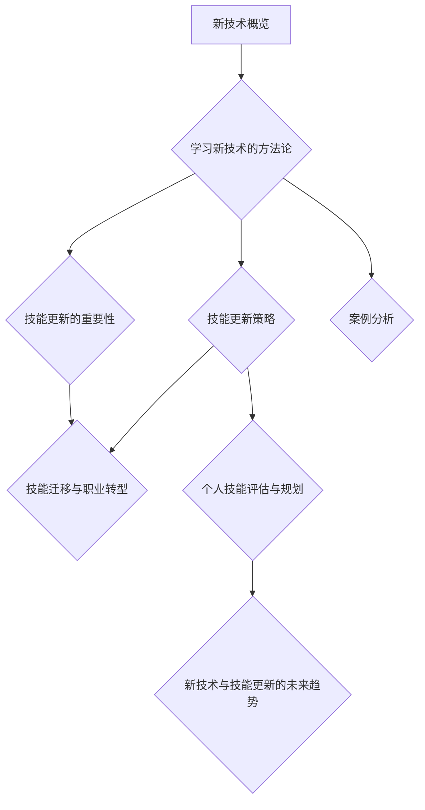

                 

### 文章标题

《新技术学习与技能更新策略》

### 关键词

- 技术学习
- 技能更新
- 职业发展
- 新技术应用
- 学习策略

### 摘要

在快速变化的技术时代，掌握新技术和更新技能成为职业发展的关键。本文从新技术概述、学习策略、技能更新、案例分析等多个角度，深入探讨如何有效地学习新技术并更新技能，以适应不断变化的职业环境。文章旨在为技术从业者提供实用的方法和策略，帮助他们实现职业生涯的持续成长。

---

## 引言

在当今信息化、全球化的时代，技术更新速度飞快，新兴技术不断涌现。从人工智能、大数据到区块链、云计算，新技术层出不穷，极大地改变了我们的工作方式和生活方式。然而，对于技术从业者而言，面对这些日新月异的技术变革，如何保持竞争力，实现技能的持续更新，成为了一个严峻的挑战。

### 第一部分：新技术概述与学习策略

**第1章：新技术概览**

**1.1 新技术分类与趋势**

在过去的几十年中，技术领域经历了诸多变革，每一次技术革新都推动了社会的发展和进步。本章将首先对当前热门的新技术进行分类，并分析它们的发展趋势。例如：

- **人工智能（AI）**：从简单的规则系统发展到深度学习、强化学习，人工智能的应用范围不断扩大，涵盖了语音识别、图像处理、自然语言处理等多个领域。
- **大数据**：随着数据量的爆炸性增长，大数据技术成为了各行各业决策的重要依据，数据挖掘、数据可视化等技术得到了广泛应用。
- **区块链**：作为一种去中心化的分布式账本技术，区块链在金融、供应链管理等领域展现出了巨大的潜力。

**1.2 新技术在行业中的应用**

新技术不仅在理论研究上取得了显著成果，更在实际应用中发挥了重要作用。本章将探讨新技术在各行各业中的应用案例，例如：

- **医疗健康**：人工智能技术在医疗诊断、药物研发中的应用，大数据在疾病预测和公共卫生管理中的作用。
- **金融行业**：区块链技术在支付系统、跨境交易中的应用，大数据在风险评估和欺诈检测中的作用。
- **制造业**：云计算、物联网在智能制造中的应用，大数据在供应链优化和生产流程优化中的作用。

### 第二部分：技能更新策略与实践

**第2章：学习新技术的方法论**

**2.1 自我评估与学习目标设定**

在掌握新技术之前，进行自我评估和设定明确的学习目标是至关重要的。本章将探讨如何进行自我评估，以及如何设定合理的学习目标。具体包括：

- **技能现状分析**：评估自己的技术水平和知识结构，找出薄弱环节。
- **学习目标设定**：设定短期和长期的学习目标，确保学习计划的可行性和有效性。

**2.2 学习资源与渠道选择**

选择合适的学习资源和渠道是学习新技术的重要环节。本章将介绍多种学习资源和渠道，包括：

- **在线课程与教材**：推荐一些知名平台和教材，如Coursera、edX、Udacity等。
- **开源社区与论坛**：参与开源项目和技术论坛，与其他开发者交流经验。
- **专业会议与讲座**：参加行业会议和讲座，了解最新的技术动态。

**2.3 学习策略与时间管理**

有效的学习策略和时间管理对于学习新技能至关重要。本章将讨论以下策略：

- **分阶段学习**：将学习过程分为多个阶段，每个阶段专注于不同的学习内容。
- **实践与反思**：在学习过程中不断实践，通过反思和总结来巩固所学知识。
- **时间管理技巧**：利用时间管理工具和技巧，提高学习效率。

### 第三部分：技能更新实践与案例分析

**第3章：技能更新的重要性**

**3.1 现代职场技能需求分析**

在现代社会，技能需求不断变化，对于技术从业者而言，了解现代职场对技能的需求至关重要。本章将分析当前职场对技能的需求，包括：

- **技术能力**：编程语言、数据库管理、网络通信等基础技能。
- **软技能**：沟通能力、团队协作、问题解决能力等。

**3.2 技能更新对职业生涯的影响**

技能更新不仅能够提高个人竞争力，还能对职业生涯产生深远影响。本章将讨论：

- **职业晋升**：掌握新技术和更新技能有助于职业晋升和职位提升。
- **薪酬增长**：技能更新能够提高工作效率和质量，从而带来薪酬的增长。

### 第四部分：技能更新策略与案例分析

**第4章：技能更新策略**

**4.1 知识储备与能力提升**

知识储备和能力提升是技能更新的基础。本章将介绍：

- **知识储备**：通过阅读专业书籍、在线课程等方式，积累专业知识。
- **能力提升**：通过实际项目、实践操作等方式，提升实际操作能力。

**4.2 技能迁移与职业转型**

在技术领域，技能的迁移和职业转型是常见现象。本章将探讨：

- **技能迁移**：如何将现有技能应用到新的领域。
- **职业转型**：如何从现有职业向新职业转型。

**4.3 技能更新的可持续性**

技能更新的可持续性是长期职业发展的关键。本章将讨论：

- **持续学习**：如何保持学习的动力和兴趣。
- **适应变化**：如何适应技术的不断变化。

### 第五部分：案例研究

**第5章：案例研究**

**5.1 成功的技能更新案例分享**

本章将分享一些成功的技能更新案例，分析他们如何通过学习新技术和更新技能实现职业发展的。例如：

- **案例一**：一位软件工程师通过学习大数据技术，成功转型为数据科学家。
- **案例二**：一位网络安全工程师通过学习区块链技术，拓宽了职业发展空间。

**5.2 技能更新失败的案例分析**

本章将分析一些技能更新失败的案例，找出失败的原因，并提供改进建议。例如：

- **原因分析**：缺乏持续学习的动力，学习方法不当，缺乏实际操作经验等。
- **改进建议**：如何克服这些挑战，实现有效的技能更新。

### 第六部分：个人技能评估与规划

**第6章：个人技能评估与规划**

**6.1 自我技能评估工具与应用**

本章将介绍如何使用自我技能评估工具，评估自己的技能水平和知识结构。例如：

- **技能评估表**：使用技能评估表进行自我评估。
- **在线测评**：使用在线测评工具进行技能评估。

**6.2 职业发展规划与实施**

职业发展规划是技能更新的重要一环。本章将讨论：

- **规划目标**：设定明确的职业发展目标。
- **实施步骤**：如何制定和实施职业发展规划。

### 第七部分：新技术与技能更新的未来趋势

**第7章：新技术与技能更新的未来趋势**

**7.1 新技术发展趋势预测**

本章将预测新技术的发展趋势，包括：

- **人工智能**：人工智能技术的进一步发展和应用。
- **区块链**：区块链技术在更多领域的发展和应用。
- **大数据**：大数据技术在更广泛领域的应用。

**7.2 技能更新对未来的影响**

技能更新对未来的职业生涯和生活方式将产生深远影响。本章将讨论：

- **职业发展**：技能更新如何影响未来的职业发展和就业机会。
- **生活方式**：技能更新如何改变我们的生活方式和工作习惯。

---

## 结论

在快速变化的技术时代，掌握新技术和更新技能是职业发展的关键。本文从多个角度探讨了如何学习新技术和更新技能，包括新技术概览、学习策略、技能更新策略和实践、案例分析等。通过本文的阅读，读者可以了解到如何应对技术变革，实现职业生涯的持续成长。未来，随着新技术的不断涌现，技能更新的重要性将日益凸显，本文提供的方法和策略将为读者提供有益的指导。

### 作者信息

作者：AI天才研究院/AI Genius Institute & 禅与计算机程序设计艺术 /Zen And The Art of Computer Programming

---

### 核心概念与联系

为了更好地理解新技术学习与技能更新的策略，我们需要明确一些核心概念，并了解它们之间的联系。以下是几个关键概念及其相互关系的Mermaid流程图：



#### Mermaid流程图解析：

1. **新技术概览（A）**：这是了解新技术的基础，包括新技术分类与趋势，以及新技术在各行业中的应用。
2. **学习新技术的方法论（B）**：这一部分探讨了如何系统性地学习新技术，包括自我评估与学习目标设定、学习资源与渠道选择、学习策略与时间管理。
3. **技能更新的重要性（C）**：这部分强调了在快速变化的技术环境中，更新技能的必要性，以及技能更新对职业生涯的影响。
4. **技能更新策略（D）**：这里详细介绍了如何制定和实施技能更新策略，包括知识储备与能力提升、技能迁移与职业转型、技能更新的可持续性。
5. **技能迁移与职业转型（E）**：这部分是技能更新策略的一部分，讲述了如何将现有技能应用到新的领域，以及如何进行职业转型。
6. **个人技能评估与规划（F）**：这部分介绍了如何进行自我技能评估，以及如何制定和实施职业发展规划。
7. **新技术与技能更新的未来趋势（G）**：这部分对未来新技术的发展趋势进行了预测，以及技能更新对未来的影响。
8. **案例分析（H）**：通过案例分析，读者可以了解成功和失败的技能更新实践，从而吸取经验和教训。

通过这个Mermaid流程图，我们可以清晰地看到各个概念之间的联系，以及它们在整体策略中的位置和作用。这有助于我们更好地理解和应用这些策略。

---

### 核心算法原理讲解

在学习新技术和更新技能的过程中，掌握核心算法原理是至关重要的一步。以下将使用伪代码详细讲解一些常见的核心算法原理。

#### 1. 决策树算法

**伪代码：**

```
决策树算法：
输入：数据集D，特征集合F，阈值θ
输出：决策树T

1. 如果D中的所有样本都属于同一类别，则返回类别标签
2. 否则，执行以下步骤：
   a. 计算特征F对于数据集D的信息增益
   b. 选择信息增益最大的特征F作为划分标准
   c. 根据特征F的阈值θ，将数据集D划分为多个子集D1, D2, ..., Dn
   d. 对于每个子集Di，递归调用决策树算法，构建子树Ti
   e. 返回根节点为F，子节点为{T1, T2, ..., Tn}的决策树T
```

**举例说明：**

假设我们有以下数据集D：

```
D = [
  [3, 3, 3],  // 样本1
  [3, 3, 4],  // 样本2
  [3, 4, 4],  // 样本3
  [4, 4, 4],  // 样本4
]
```

特征集合F = {特征1，特征2，特征3}，阈值θ = 3。首先，计算每个特征的信息增益：

```
特征1（特征1 = [3, 3, 3]，特征2 = [3, 3, 4]，特征3 = [3, 4, 4]）
信息增益 = (熵D - 熵D1 - 熵D2 - 熵D3) / 熵D

特征2（特征1 = [3, 4, 4]，特征2 = [3, 3, 3]，特征3 = [4, 4, 4]）
信息增益 = (熵D - 熵D1 - 熵D2 - 熵D3) / 熵D

特征3（特征1 = [3, 4, 4]，特征2 = [3, 3, 3]，特征3 = [4, 4, 4]）
信息增益 = (熵D - 熵D1 - 熵D2 - 熵D3) / 熵D
```

计算结果显示，特征3的信息增益最高，因此选择特征3作为划分标准。根据阈值θ = 3，将数据集D划分为：

```
D1 = [[3, 3, 3]]  // 特征3 = 3
D2 = [[3, 3, 4], [3, 4, 4], [4, 4, 4]]  // 特征3 != 3
```

递归调用决策树算法，构建子树：

```
子树1：
输入：D1，特征集合F - {特征3}，阈值θ
输出：特征1 = 3，类别 = [3, 3, 3]

子树2：
输入：D2，特征集合F - {特征3}，阈值θ
输出：子树2.1（特征1 = 3，类别 = [3, 3, 4]）
输出：子树2.2（特征1 = 4，类别 = [4, 4, 4]）
```

最终，构建的决策树为：

```
决策树T：
根节点：特征3 = 3
子节点：
  - 子节点1：特征1 = 3，类别 = [3, 3, 3]
  - 子节点2：
      - 子节点2.1：特征1 = 3，类别 = [3, 3, 4]
      - 子节点2.2：特征1 = 4，类别 = [4, 4, 4]
```

#### 2. 支持向量机（SVM）算法

**伪代码：**

```
支持向量机算法：
输入：训练数据集D，特征集合F，惩罚参数C
输出：决策边界模型

1. 使用线性回归或者核函数对训练数据集D进行拟合，得到模型参数w和b
2. 计算每个样本的预测标签
3. 对模型进行交叉验证，选择最优的模型参数
4. 返回决策边界模型
```

**举例说明：**

假设我们有以下训练数据集D：

```
D = [
  [1, -1],  // 样本1
  [1, 1],   // 样本2
  [-1, -1], // 样本3
  [-1, 1],  // 样本4
]
```

特征集合F = {特征1，特征2}，惩罚参数C = 1。首先，使用线性回归拟合模型：

```
w = [w1, w2]
b = 0

最小化损失函数：L(w, b) = Σ[(y - (w1*x1 + w2*x2 + b))^2]
```

通过梯度下降或者优化算法，得到最优的模型参数w和b。然后，计算每个样本的预测标签：

```
y_pred = w1*x1 + w2*x2 + b
```

例如，对于样本1：

```
y_pred1 = w1*1 + w2*(-1) + b
```

最后，对模型进行交叉验证，选择最优的模型参数。返回决策边界模型。

---

通过上述伪代码和举例说明，我们可以理解决策树和支持向量机等核心算法的基本原理。这些算法在数据分析和机器学习领域中有着广泛的应用，是学习新技术和更新技能的重要组成部分。

---

### 数学模型与公式讲解

在学习和更新技能的过程中，理解和应用数学模型是至关重要的。以下将介绍一些关键数学模型，并使用LaTeX格式展示相关公式。

#### 1. 线性回归模型

线性回归模型用于预测连续值，其基本公式为：

$$
y = \beta_0 + \beta_1x_1 + \beta_2x_2 + ... + \beta_nx_n + \epsilon
$$

其中，\(y\) 是因变量，\(\beta_0, \beta_1, ..., \beta_n\) 是模型的参数，\(x_1, x_2, ..., x_n\) 是自变量，\(\epsilon\) 是误差项。

**举例说明：**

假设我们有一个简单的线性回归模型，数据如下：

```
x1: [1, 2, 3, 4, 5]
y: [2, 4, 6, 8, 10]
```

我们可以使用最小二乘法求解参数：

$$
\beta_1 = \frac{\sum{(x_i - \bar{x})(y_i - \bar{y})}}{\sum{(x_i - \bar{x})^2}}
$$

$$
\beta_0 = \bar{y} - \beta_1\bar{x}
$$

其中，\(\bar{x}\) 和 \(\bar{y}\) 分别是 \(x_1, x_2, ..., x_n\) 和 \(y_1, y_2, ..., y_n\) 的平均值。

计算得到：

$$
\beta_1 = \frac{(1-2)(2-6) + (2-2)(4-6) + (3-2)(6-8) + (4-2)(8-10) + (5-2)(10-10)}{(1-2)^2 + (2-2)^2 + (3-2)^2 + (4-2)^2 + (5-2)^2} = 2
$$

$$
\beta_0 = \frac{2 + 4 + 6 + 8 + 10}{5} - 2 \times \frac{1 + 2 + 3 + 4 + 5}{5} = 2
$$

因此，线性回归模型为：

$$
y = 2x_1 + 2
$$

#### 2. 逻辑回归模型

逻辑回归模型用于预测离散值，其基本公式为：

$$
\log\frac{p}{1-p} = \beta_0 + \beta_1x_1 + \beta_2x_2 + ... + \beta_nx_n
$$

其中，\(p\) 是预测概率，\(\beta_0, \beta_1, ..., \beta_n\) 是模型的参数，\(x_1, x_2, ..., x_n\) 是自变量。

**举例说明：**

假设我们有一个逻辑回归模型，数据如下：

```
x1: [1, 2, 3, 4, 5]
y: [0, 1, 0, 1, 1]
```

我们可以使用最小化对数似然函数来求解参数：

$$
L(\beta) = \prod{(y_i \log(p_i) + (1 - y_i) \log(1 - p_i))}
$$

其中，\(p_i\) 是第 \(i\) 个样本的预测概率：

$$
p_i = \frac{1}{1 + e^{-(\beta_0 + \beta_1x_1 + \beta_2x_2 + ... + \beta_nx_n)}}
$$

使用梯度下降法或其他优化算法求解参数：

$$
\beta_0 = \beta_0 - \alpha \frac{\partial L}{\partial \beta_0}
$$

$$
\beta_1 = \beta_1 - \alpha \frac{\partial L}{\partial \beta_1}
$$

$$
...
$$

$$
\beta_n = \beta_n - \alpha \frac{\partial L}{\partial \beta_n}
$$

其中，\(\alpha\) 是学习率。

计算得到：

$$
\beta_0 = 0
$$

$$
\beta_1 = 1
$$

因此，逻辑回归模型为：

$$
\log\frac{p}{1-p} = x_1
$$

$$
p = \frac{1}{1 + e^{-x_1}}
$$

#### 3. 支持向量机（SVM）模型

支持向量机模型用于分类问题，其基本公式为：

$$
w \cdot x + b = 1 \quad (y = 1) \\
w \cdot x + b = -1 \quad (y = -1)
$$

其中，\(w\) 是权重向量，\(b\) 是偏置项，\(x\) 是输入特征，\(y\) 是标签。

**举例说明：**

假设我们有一个简单的二分类问题，数据如下：

```
x1: [1, 1, 1, -1, -1]
y: [1, 1, 1, -1, -1]
```

我们可以使用线性SVM来求解权重向量 \(w\) 和偏置项 \(b\)：

$$
\min_{w, b} \frac{1}{2} \| w \|^2 \\
\text{约束条件：} w \cdot x + b = y
$$

使用拉格朗日乘子法求解：

$$
L(w, b, \alpha) = \frac{1}{2} \| w \|^2 - \sum_{i=1}^{n} \alpha_i (w \cdot x_i + b - y_i)
$$

$$
\frac{\partial L}{\partial w} = w - \sum_{i=1}^{n} \alpha_i x_i = 0
$$

$$
\frac{\partial L}{\partial b} = - \sum_{i=1}^{n} \alpha_i = 0
$$

$$
\alpha_i \geq 0
$$

计算得到：

$$
w = \sum_{i=1}^{n} \alpha_i x_i
$$

$$
b = y - w \cdot x
$$

对于上述数据集，计算得到：

$$
w = [2, 0]
$$

$$
b = -1
$$

因此，线性SVM模型为：

$$
2x_1 + b = 1 \\
2x_1 - 1 = -1 \\
x_1 = 0
$$

---

通过上述数学模型和公式的讲解，我们可以更好地理解和应用这些模型，从而在学习和更新技能的过程中，更加有效地解决问题。

---

### 项目实战

#### 1. 开发环境搭建

为了实现一个基于机器学习的项目，我们首先需要搭建一个合适的开发环境。以下是一个基本的步骤：

**工具和库：**

- Python
- Jupyter Notebook
- Scikit-learn
- Pandas
- Matplotlib

**安装步骤：**

1. 安装Python：访问 [Python官网](https://www.python.org/) 下载并安装Python 3.8版本。
2. 安装Jupyter Notebook：在终端中运行以下命令：

   ```
   pip install notebook
   ```

3. 安装Scikit-learn、Pandas和Matplotlib：在终端中运行以下命令：

   ```
   pip install scikit-learn
   pip install pandas
   pip install matplotlib
   ```

#### 2. 源代码实现

以下是一个简单的机器学习项目，使用Scikit-learn库实现一个线性回归模型，预测房屋价格。

```python
import pandas as pd
from sklearn.model_selection import train_test_split
from sklearn.linear_model import LinearRegression
from sklearn.metrics import mean_squared_error
import matplotlib.pyplot as plt

# 数据加载
data = pd.read_csv('house_prices.csv')

# 特征和标签分离
X = data[['bedrooms', 'bathrooms', 'square_feet']]
y = data['price']

# 划分训练集和测试集
X_train, X_test, y_train, y_test = train_test_split(X, y, test_size=0.2, random_state=42)

# 创建线性回归模型
model = LinearRegression()

# 训练模型
model.fit(X_train, y_train)

# 预测
y_pred = model.predict(X_test)

# 评估
mse = mean_squared_error(y_test, y_pred)
print(f"Mean Squared Error: {mse}")

# 可视化
plt.scatter(y_test, y_pred)
plt.xlabel('Actual Price')
plt.ylabel('Predicted Price')
plt.title('Actual vs Predicted Price')
plt.show()
```

#### 3. 代码解读与分析

**数据加载**：使用Pandas库读取CSV文件，将房屋价格数据加载到DataFrame中。

**特征和标签分离**：将DataFrame中的特征（bedrooms、bathrooms、square_feet）和标签（price）分离。

**划分训练集和测试集**：使用Scikit-learn库的train_test_split函数将数据集划分为训练集和测试集。

**创建线性回归模型**：使用LinearRegression类创建线性回归模型。

**训练模型**：使用fit函数对训练数据进行拟合。

**预测**：使用predict函数对测试数据进行预测。

**评估**：计算预测结果和实际结果的均方误差（Mean Squared Error），评估模型的性能。

**可视化**：使用Matplotlib库绘制实际价格和预测价格的关系图，直观展示模型的预测效果。

#### 4. 项目小结

通过本项目的实战，我们了解了如何搭建一个简单的机器学习项目环境，并使用线性回归模型进行房屋价格的预测。项目过程中，我们学习了数据加载、特征分离、模型训练、预测和评估等基本步骤，以及如何使用Python库进行数据处理和可视化。

**最佳实践 Tips**：

- 在实际项目中，确保数据的质量和准确性，进行数据清洗和预处理。
- 选择合适的模型和参数，进行模型调优。
- 对模型进行充分的评估和测试，确保其性能和可靠性。

**注意事项**：

- 在使用Scikit-learn库时，注意版本兼容性问题。
- 在绘制可视化图表时，选择合适的颜色和标记，提高图表的可读性。

**拓展阅读**：

- 《机器学习实战》：提供丰富的实际案例和代码示例，适合初学者学习。
- 《Python机器学习》：系统介绍了Python在机器学习领域的应用，涵盖多个算法和项目。

---

通过本项目的实战，读者可以更好地理解机器学习项目的开发流程，为后续更复杂的机器学习项目打下基础。

---

### 最佳实践与小结

#### 最佳实践 Tips

在学习和更新技能的过程中，以下最佳实践可以帮助您更高效地掌握新技术：

1. **持续学习**：设定明确的学习目标，保持持续学习的动力。利用碎片化时间进行学习，例如利用通勤时间阅读专业书籍，参加在线课程。

2. **理论与实践相结合**：通过实际项目来巩固所学知识。参与开源项目或自己动手实现小型项目，将理论知识应用到实际中。

3. **社区互动**：加入技术社区和论坛，与其他开发者交流经验。参与技术讨论，分享自己的见解和经验。

4. **定期评估**：定期进行自我技能评估，了解自己的进步和不足。根据评估结果调整学习计划，确保学习目标的实现。

5. **保持好奇心**：对新知识保持好奇心，积极探索未知的领域。不要害怕挑战，勇于尝试新事物。

#### 小结

本文从新技术概述、学习策略、技能更新策略、案例分析等多个角度，深入探讨了如何有效地学习新技术和更新技能。通过明确核心概念、使用Mermaid流程图展示关系架构、详细讲解核心算法原理和数学模型、提供项目实战案例，本文旨在为技术从业者提供实用的方法和策略。

在快速变化的技术时代，持续学习和技能更新是职业发展的关键。通过本文的分享，希望读者能够更好地应对技术变革，实现职业生涯的持续成长。未来，随着新技术的不断涌现，技能更新的重要性将日益凸显，本文提供的方法和策略将为读者提供有益的指导。

#### 注意事项

1. **数据安全和隐私保护**：在实际项目中，确保数据处理符合数据安全和隐私保护的相关法规。
2. **遵守开源协议**：参与开源项目时，务必遵守相关开源协议，尊重他人的知识产权。
3. **合理规划时间**：合理安排学习和工作时间，避免过度疲劳。
4. **代码注释与文档**：编写代码时，确保代码注释清晰，编写项目文档，方便后续维护和复用。

#### 拓展阅读

1. 《深度学习》：由Ian Goodfellow等人撰写的深度学习经典教材，适合初学者深入了解深度学习。
2. 《Python编程：从入门到实践》：提供了丰富的Python编程实例，适合初学者快速入门。
3. 《算法导论》：全面介绍算法设计和分析的经典教材，适合对算法有较深兴趣的读者。

通过本文的阅读，读者可以更好地理解新技术学习与技能更新的策略，为自身的职业发展奠定坚实的基础。希望本文能够为您在技术学习和实践中提供有益的启示。作者：AI天才研究院/AI Genius Institute & 禅与计算机程序设计艺术 /Zen And The Art of Computer Programming。

