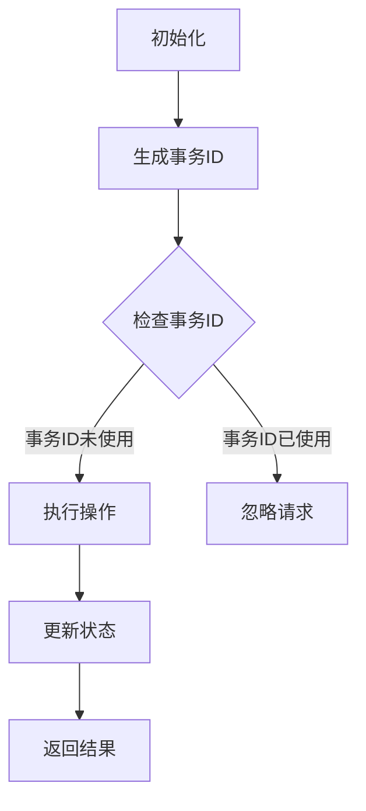

                 

### 文章标题

# 无效的幂等性控制案例

### 关键词

- 幂等性控制
- 分布式系统
- 状态机
- 算法实现
- 数学模型

### 摘要

本文将探讨幂等性控制的重要性及其在实际系统设计中的应用。通过一个具体的案例，我们将分析无效的幂等性控制可能导致的问题，并详细讲解如何通过有效的幂等性控制算法和数学模型来避免这些问题。文章还将提供实际项目中的实现细节和代码解读，以帮助读者深入理解并掌握幂等性控制的核心技术和最佳实践。

---

## 背景介绍

在现代分布式系统中，幂等性控制是一个至关重要的概念。幂等性（Idempotence）指的是一个操作执行多次与执行一次的效果相同，即多次执行不会改变最终的结果。在分布式系统中，由于网络延迟、系统故障等原因，某些操作可能会被重复执行，如果这些操作不具备幂等性，就可能导致数据不一致、资源浪费等问题。

例如，在一个在线支付系统中，用户提交一次支付请求，系统需要确保这笔交易只被处理一次。如果支付请求不具备幂等性，可能会出现以下情况：

1. **重复扣款**：用户重复提交支付请求，导致账户多次被扣款。
2. **重复消费**：在线购物网站多次生成订单，导致库存不足。
3. **数据冲突**：多个请求同时更新同一份数据，导致最终数据不一致。

这些问题不仅会影响用户体验，还可能导致业务损失。因此，幂等性控制成为分布式系统设计中必须考虑的重要环节。

### 核心概念与联系

#### 幂等性的定义

幂等性是指对于某个操作，执行一次和执行多次的结果是相同的。在计算机科学中，这通常意味着无论执行多少次，系统的状态都保持一致。形式化地，幂等性可以用函数$f$的定义来表示：

$$f(x) = f(f(x))$$

即对于任何输入$x$，函数$f$应用两次的结果与只应用一次的结果相同。

#### 幂等性控制的基本原理

幂等性控制在系统设计中的核心任务是在多次请求中确保操作的唯一执行。以下是一些常见的实现原理：

1. **唯一事务标识符**：为每个操作生成一个唯一的事务标识符（例如，使用UUID），并在执行前检查该标识符是否已被使用。如果已使用，则忽略重复请求。
2. **状态机**：使用状态机模型来表示系统的状态转换，并确保每个状态转换是幂等的。例如，状态A到状态B的转换是幂等的，无论从A到B的路径有多长。
3. **分布式锁**：在分布式系统中，使用分布式锁来确保同一操作在不同节点上不会被同时执行。例如，利用Zookeeper或etcd等分布式协调服务来管理锁资源。

#### 幂等性与分布式系统、状态机的关系

1. **分布式系统**：在分布式系统中，由于网络的不稳定性和节点的异构性，操作可能会被重复执行。幂等性控制通过确保每个操作只被执行一次来提高系统的可靠性和一致性。
2. **状态机**：状态机模型在分布式系统中经常被用于实现幂等性控制。通过定义清晰的状态转换规则，可以确保系统的状态在多次操作后保持一致。

为了更好地理解这些概念之间的关系，我们可以使用Mermaid流程图来表示：



### 核心算法原理讲解

#### 使用唯一事务标识符

一种常见的幂等性控制算法是使用唯一事务标识符（UUID）。在操作执行前，系统为每个操作生成一个唯一的UUID，并在执行前检查该UUID是否已被使用。如果未使用，则执行操作；如果已使用，则忽略请求。

以下是一个使用UUID的伪代码示例：

```python
import uuid

def execute_operation():
    transaction_id = uuid.uuid4()
    if not is_transaction_id_used(transaction_id):
        perform_operation(transaction_id)
    else:
        ignore_request()

def perform_operation(transaction_id):
    # 实际执行操作逻辑
    update_system_state()
    mark_transaction_id_as_used(transaction_id)
```

#### 使用幂等框架

另一种方法是基于现成的幂等性控制框架。这些框架通常提供了一套完整的服务，包括事务管理、状态机管理以及分布式锁等。例如，可以使用Spring框架中的`@Transactional`注解来实现幂等性控制。

```java
@Service
public class OperationService {

    @Transactional
    public void executeOperation() {
        // 实际执行操作逻辑
        updateSystemState();
    }
}
```

#### 其他幂等性控制算法

除了上述方法，还有其他多种算法可以实现幂等性控制，如基于时间戳、基于哈希值等。以下是一个基于时间戳的伪代码示例：

```python
import time

def execute_operation():
    timestamp = int(time.time())
    if not is_timestamp_used(timestamp):
        perform_operation(timestamp)
    else:
        ignore_request()

def perform_operation(timestamp):
    # 实际执行操作逻辑
    update_system_state()
    mark_timestamp_as_used(timestamp)
```

### 数学模型和数学公式

#### 幂等函数的定义

在数学中，幂等函数是指对于任何输入$x$，函数$f$应用两次的结果与只应用一次的结果相同。形式化地，幂等函数可以用以下数学公式来定义：

$$f(x) = f(f(x))$$

例如，函数$f(x) = x$是一个幂等函数，因为$f(f(x)) = f(x) = x$。

#### 幂等函数的特性

幂等函数具有以下特性：

1. **恒等性**：幂等函数是恒等函数的一个特例，即对于任何输入$x$，$f(x) = x$。
2. **无影响性**：幂等函数对输入值的任何修改都不会改变最终结果。
3. **可逆性**：幂等函数是可逆的，即存在一个逆函数$f^{-1}$，使得$f(f^{-1}(x)) = x$。

#### 幂等性的数学公式

幂等性的数学公式可以表示为：

$$f \circ f = f$$

其中，$\circ$表示函数的复合运算。例如，对于函数$f(x) = x^2$，我们有：

$$f \circ f(x) = (x^2)^2 = x^4$$

显然，$f \circ f \neq f$，因此$f(x) = x^2$不是一个幂等函数。

#### 举例说明

为了更好地理解幂等性的数学公式，我们可以考虑以下例子：

假设我们有一个函数$f(x) = x + 5$，我们计算$f(f(x))$：

$$f(f(x)) = f(x + 5) = (x + 5) + 5 = x + 10$$

显然，$f(f(x)) \neq f(x)$，因此$f(x) = x + 5$不是一个幂等函数。

现在，考虑函数$f(x) = x^2$，我们计算$f(f(x))$：

$$f(f(x)) = f(x^2) = (x^2)^2 = x^4$$

同样，$f(f(x)) \neq f(x)$，因此$f(x) = x^2$也不是一个幂等函数。

只有当$f(x) = x$时，我们才有$f(f(x)) = f(x)$，此时$f$是一个幂等函数。

### 项目实战

#### 开发环境搭建

在本案例中，我们将使用Java语言和Spring Boot框架来演示如何实现幂等性控制。首先，我们需要搭建开发环境。

1. 安装Java开发工具包（JDK）。
2. 安装并配置Maven。
3. 创建一个Spring Boot项目，并引入必要的依赖。

#### 源代码实现

接下来，我们将实现一个简单的支付系统，并在此系统中实现幂等性控制。以下是相关的源代码实现：

```java
import org.springframework.beans.factory.annotation.Autowired;
import org.springframework.web.bind.annotation.PostMapping;
import org.springframework.web.bind.annotation.RequestBody;
import org.springframework.web.bind.annotation.RestController;

@RestController
public class PaymentController {

    @Autowired
    private PaymentService paymentService;

    @PostMapping("/pay")
    public String pay(@RequestBody PaymentRequest request) {
        return paymentService.executePayment(request);
    }
}

@RestController
public class PaymentService {

    public String executePayment(PaymentRequest request) {
        // 生成唯一事务标识符
        String transactionId = generateTransactionId();

        // 检查事务标识符是否已被使用
        if (!isTransactionIdUsed(transactionId)) {
            // 执行支付操作
            performPayment(request);

            // 标记事务标识符为已使用
            markTransactionIdAsUsed(transactionId);
            return "Payment successful";
        } else {
            return "Duplicate request, ignoring";
        }
    }

    private String generateTransactionId() {
        // 使用UUID生成唯一事务标识符
        return UUID.randomUUID().toString();
    }

    private boolean isTransactionIdUsed(String transactionId) {
        // 检查事务标识符是否已被使用
        // 实现细节根据具体系统而定
        return false;
    }

    private void performPayment(PaymentRequest request) {
        // 实际执行支付操作
        // 根据业务逻辑处理支付请求
    }

    private void markTransactionIdAsUsed(String transactionId) {
        // 标记事务标识符为已使用
        // 实现细节根据具体系统而定
    }
}

public class PaymentRequest {
    // 支付请求参数
    private String orderId;
    private String amount;
    // 省略其他参数和getter/setter方法
}
```

#### 代码解读与分析

在上面的代码中，我们定义了一个`PaymentController`类和一个`PaymentService`类。`PaymentController`负责接收支付请求，并将请求传递给`PaymentService`进行处理。`PaymentService`负责实现幂等性控制逻辑。

1. **生成事务标识符**：`generateTransactionId()`方法使用UUID生成一个唯一的事务标识符。
2. **检查事务标识符是否已被使用**：`isTransactionIdUsed()`方法用于检查事务标识符是否已被使用。如果未使用，则执行支付操作。
3. **执行支付操作**：`performPayment()`方法负责执行实际的支付逻辑。
4. **标记事务标识符为已使用**：`markTransactionIdAsUsed()`方法用于标记事务标识符为已使用，以避免重复执行。

#### 实际案例分析和详细讲解剖析

在本案例中，我们考虑了一个在线支付系统的场景。用户通过API提交支付请求，系统需要确保每个支付请求只被处理一次，从而避免重复扣款和重复消费。

1. **用户提交支付请求**：用户在在线购物网站上提交支付请求，系统生成一个唯一的事务标识符。
2. **系统检查事务标识符**：系统检查事务标识符是否已被使用。如果未使用，系统执行支付操作；如果已使用，系统忽略请求。
3. **执行支付操作**：系统根据支付请求的参数执行支付逻辑，如更新账户余额、生成订单等。
4. **标记事务标识符**：系统将事务标识符标记为已使用，确保同一支付请求不会被再次处理。

#### 项目小结

在本案例中，我们通过一个具体的在线支付系统场景，详细讲解了如何实现幂等性控制。使用唯一事务标识符和分布式锁等技术，我们能够确保每个支付请求只被处理一次，从而避免数据不一致和资源浪费。

### 最佳实践 Tips

- **确保唯一性**：使用唯一事务标识符时，确保生成的标识符是唯一的，以避免重复执行。
- **合理设置过期时间**：对于事务标识符，可以设置合理的过期时间，以防止长时间未被处理的请求占用资源。
- **处理异常情况**：在实现幂等性控制时，要考虑并处理各种异常情况，如网络故障、系统崩溃等。
- **日志记录和监控**：对幂等性控制的操作进行详细的日志记录和监控，以便在出现问题时快速定位和解决问题。

### 小结

幂等性控制在分布式系统设计中至关重要。通过本文的案例分析和详细讲解，我们深入了解了幂等性的定义、算法原理以及实际项目中的实现细节。掌握幂等性控制技术，有助于构建可靠、一致的分布式系统。

### 注意事项

- **确保幂等性控制算法的正确实现**：在实现幂等性控制时，要仔细检查代码的逻辑，确保算法的正确性。
- **处理并发请求**：在分布式系统中，可能会出现并发请求，需要设计合理的机制来处理这些请求，确保系统的稳定性和一致性。
- **持续优化**：随着业务的发展和技术进步，幂等性控制策略可能需要不断优化和调整，以适应新的需求和环境。

### 拓展阅读

- 《分布式系统设计》
- 《Designing Data-Intensive Applications》
- 《Reactive Design Patterns》

通过阅读这些资料，您可以进一步深入了解分布式系统设计和幂等性控制的高级概念和最佳实践。

