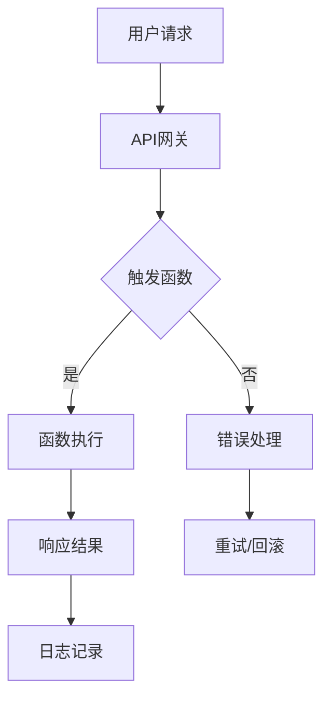

                 

### 文章标题

# 无服务器架构：serverless的优势与局限

### 关键词：

- 无服务器架构
- serverless
- 优势与局限
- 函数即服务（FaaS）
- 事件驱动架构
- 云计算资源调度
- 数学模型
- 项目实战

### 摘要：

本文深入探讨了无服务器架构（Serverless）的核心概念、优势与局限。通过解析Serverless的基本原理，介绍其与相关技术的联系，文章进一步阐述了Serverless架构中的核心算法原理及数学模型。随后，通过实际项目案例，展示了如何构建和部署无服务器应用。最后，对Serverless技术的优势与局限进行了全面分析，并展望了其未来发展。

---

### 第1章 引言

### 1.1 无服务器架构概述

无服务器架构（Serverless），也称为Serverless Computing，是一种云计算服务模型，允许开发人员在无需管理底层基础设施的情况下部署和运行应用程序。这种架构模式通过第三方云服务提供商（如AWS、Azure、Google Cloud等）提供的基础设施来实现，用户只需专注于编写应用程序代码，无需关注服务器维护、容量管理和性能优化等问题。

无服务器架构的核心思想是将应用程序分解为离散的功能单元，即“函数”，并通过事件触发来执行这些函数。这种模式不仅提高了开发效率，还使得应用程序的扩展和弹性管理变得更加简单。Serverless Computing的出现，标志着云计算服务从基础设施即服务（IaaS）向平台即服务（PaaS）的进一步演变。

### 1.2 无服务器架构的优势与局限

无服务器架构带来了许多显著的优势，包括成本效益、高效性和弹性。然而，这种架构模式也存在一些局限，例如运行时依赖性、安全性问题以及监控和维护的复杂性。本章节将详细讨论这些优势与局限，为读者提供全面的视角。

### 1.3 本书结构安排

本文分为六个主要章节：

1. 引言：概述无服务器架构的概念和优势。
2. 核心概念与联系：深入探讨无服务器架构的核心概念及其与相关技术的联系。
3. 核心算法原理讲解：介绍无服务器架构中的核心算法原理，并通过伪代码进行详细阐述。
4. 数学模型和数学公式：介绍用于无服务器架构的关键数学模型，并使用LaTeX格式展示数学公式。
5. 项目实战：提供无服务器架构的实际案例，包括开发环境搭建、代码实现和详细分析。
6. 总结与展望：总结无服务器架构的优势与局限，探讨其未来发展趋势。

通过以上章节的逐步探讨，本文旨在为读者提供全面、深入的理解，帮助其在实际项目中有效地应用无服务器架构。

---

### 第2章 无服务器架构核心概念与联系

#### 2.1 无服务器架构核心概念

无服务器架构（Serverless）是一种云计算服务模型，其核心在于将应用程序的功能模块化为可独立调用的“函数”（Functions），并通过事件触发（Event-Driven）来执行这些函数。在这种架构中，开发人员无需关注底层硬件资源的分配和管理，只需要编写函数代码，上传至云服务提供商，然后由平台自动处理函数的执行、扩展和弹性。

无服务器架构中的几个关键概念包括：

- **函数即服务（Function as a Service，FaaS）**：FaaS是一种无服务器架构实现方式，将应用程序拆分成离散的函数单元，用户只需上传代码，无需管理运行环境。
- **事件驱动架构（Event-Driven Architecture）**：事件驱动架构是一种设计模式，通过监听和响应外部事件来触发函数执行。这种模式使得应用程序可以快速响应用户请求和系统事件，提高系统的响应速度和灵活性。
- **后端即服务（Backend as a Service，BaaS）**：BaaS提供了后端服务的API接口，如用户认证、数据存储和推送通知等，用户可以通过简单的配置和接口调用这些服务，而无需关注底层实现细节。

#### 2.2 无服务器架构与相关技术的联系

无服务器架构与多种云计算技术和设计模式密切相关，以下是其中几个关键联系：

- **微服务架构（Microservices）**：微服务架构将应用程序拆分成多个独立的小服务，每个服务负责特定的业务功能。无服务器架构与微服务架构有很强的互补性，因为无服务器函数可以作为微服务中的功能模块，独立部署和扩展。
- **容器化技术（Containerization）**：容器化技术，如Docker，通过将应用程序及其依赖打包到一个轻量级的容器中，实现了环境的隔离和一致性。无服务器架构通常使用容器技术来部署和运行函数，但容器管理通常由云服务提供商自动处理。
- **云计算资源调度（Cloud Resource Scheduling）**：无服务器架构依赖于云服务提供商的调度系统，自动分配和管理计算资源。这些调度系统通常采用复杂的算法和模型来优化资源利用率，保证服务的可靠性和性能。

#### 2.3 Mermaid流程图展示

为了更好地理解无服务器架构中的核心概念和联系，以下是一个使用Mermaid绘制的流程图，展示了无服务器架构中的关键组件和关系：



在这个流程图中：

- **用户请求**：用户通过API网关发起请求。
- **API网关**：API网关负责接收请求，并根据配置路由到相应的函数。
- **触发函数**：API网关根据请求路径和参数，触发相应的函数执行。
- **函数执行**：函数接收输入参数，执行业务逻辑，并返回结果。
- **响应结果**：函数执行完成后，将结果返回给用户。
- **日志记录**：系统记录函数的执行日志，用于监控和调试。
- **错误处理**：如果函数执行过程中出现错误，系统进行错误处理，如重试或回滚。

通过这个流程图，我们可以看到无服务器架构中各组件之间的紧密协作，以及事件驱动的执行机制。

---

### 第3章 无服务器架构的核心算法原理

#### 3.1 资源调度算法

在无服务器架构中，资源调度算法是实现高效、灵活的函数执行的关键。资源调度算法负责根据系统负载、函数依赖和性能指标等因素，动态地分配和调整计算资源。以下是几个常见的资源调度算法：

- **轮询调度算法（Round-Robin Scheduling）**：轮询调度算法是一种简单的调度策略，它将请求依次分配给不同的函数实例，确保每个函数实例都能得到公平的资源分配。这种方法适用于负载均衡和均匀分布的场景。
- **最少连接调度算法（Least Connections Scheduling）**：最少连接调度算法将新的请求分配给当前连接数最少的函数实例，以减少系统的响应时间和负载。这种方法适用于高并发场景，能够有效降低系统的瓶颈。
- **基于负载的调度算法（Load-Based Scheduling）**：基于负载的调度算法根据每个函数实例的当前负载情况，动态调整资源分配。这种方法能够根据实际负载情况，灵活地分配资源，提高系统的性能和稳定性。

以下是资源调度算法的伪代码示例：

```python
def schedule_function(instance_list, request):
    # 获取当前所有实例的负载信息
    load_info = get_load_info(instance_list)
    
    # 找到负载最轻的实例
    min_load_instance = None
    min_load = float('inf')
    
    for instance in instance_list:
        if load_info[instance] < min_load:
            min_load = load_info[instance]
            min_load_instance = instance
    
    # 将请求分配给负载最轻的实例
    assign_request_to_instance(min_load_instance, request)
```

在这个伪代码中，`instance_list` 是当前所有函数实例的列表，`request` 是待处理的请求。`get_load_info()` 函数获取每个实例的当前负载情况，`assign_request_to_instance()` 函数将请求分配给指定的实例。

#### 3.2 容器编排算法

无服务器架构通常使用容器化技术来部署和运行函数。容器编排算法负责管理容器的创建、启动、扩展和销毁，以确保系统的高效运行和资源利用率。以下是几种常见的容器编排算法：

- **固定大小容器编排算法（Fixed-Sized Container Scheduling）**：固定大小容器编排算法预先定义了系统中容器的最大数量，根据负载情况动态调整容器的启动和关闭。这种方法适用于负载相对稳定的场景。
- **动态扩展容器编排算法（Dynamic Container Scheduling）**：动态扩展容器编排算法根据系统的实时负载，动态地增加或减少容器的数量。这种方法适用于高波动负载的场景，能够提高系统的弹性。
- **混合容器编排算法（Hybrid Container Scheduling）**：混合容器编排算法结合了固定大小和动态扩展的优点，根据负载的预测和实际变化，灵活调整容器的数量。这种方法适用于负载变化较大的场景。

以下是动态扩展容器编排算法的伪代码示例：

```python
def dynamic_container_scheduling(current_load, max_container_count, min_container_count):
    # 预测未来一段时间内的负载
    predicted_load = predict_load()
    
    # 计算当前容器数量与预测负载的匹配度
    match_ratio = calculate_match_ratio(current_load, predicted_load)
    
    if match_ratio < threshold:
        # 预测负载较低，减少容器数量
        new_container_count = max(current_container_count - increment, min_container_count)
    elif match_ratio > threshold:
        # 预测负载较高，增加容器数量
        new_container_count = min(current_container_count + increment, max_container_count)
    else:
        # 负载与当前容器数量匹配，保持不变
        new_container_count = current_container_count
    
    # 根据新的容器数量调整容器
    adjust_containers(new_container_count)
```

在这个伪代码中，`current_load` 是当前的系统负载，`max_container_count` 和 `min_container_count` 分别是容器的最大和最小数量，`threshold` 是负载匹配度的阈值。`calculate_match_ratio()` 函数计算当前负载与预测负载的匹配度，`adjust_containers()` 函数根据新的容器数量调整系统的容器。

通过以上算法的介绍和伪代码示例，我们可以看到无服务器架构中的资源调度和容器编排算法如何确保系统的高效运行和资源利用率。

---

### 第4章 数学模型和数学公式

#### 4.1 成本模型

在无服务器架构中，成本模型是一个关键因素，它帮助开发者预估和优化服务成本。成本模型通常包括以下几个组成部分：

1. **基本成本（Fixed Cost）**：这部分成本在系统运行期间保持不变，例如服务器维护费用、网络带宽费用等。
2. **可变成本（Variable Cost）**：这部分成本与系统使用量成正比，例如计算资源使用费、存储费用等。
3. **性能成本（Performance Cost）**：这部分成本与系统的性能指标相关，例如响应时间、吞吐量等。

一个简单的成本模型可以用以下公式表示：

$$
C(t) = C_0 + \sum_{i=1}^{n} \alpha_i \cdot (P_i - \bar{P})
$$

其中，$C(t)$ 是总成本，$C_0$ 是初始成本，$P_i$ 是第 $i$ 个服务器的使用率，$\bar{P}$ 是平均使用率，$\alpha_i$ 是第 $i$ 个服务器的单位成本。

#### 4.2 性能模型

性能模型用于评估无服务器架构中系统的性能表现，包括响应时间、吞吐量和资源利用率等指标。以下是一个简单的性能模型示例：

- **响应时间（Response Time，$T$）**：响应时间是系统从接收到请求到返回响应的时间，可以用以下公式表示：

$$
T = \frac{1}{\lambda + \mu}
$$

其中，$\lambda$ 是请求到达率，$\mu$ 是服务完成率。

- **吞吐量（Throughput，$W$）**：吞吐量是单位时间内系统能处理的请求数量，可以用以下公式表示：

$$
W = \lambda / (\mu - \lambda)
$$

- **资源利用率（Resource Utilization，$U$）**：资源利用率是系统中计算资源的利用率，可以用以下公式表示：

$$
U = \frac{P}{P_{max}}
$$

其中，$P$ 是当前资源使用量，$P_{max}$ 是最大资源量。

通过上述数学模型和公式，开发者可以更精确地评估和优化无服务器架构的成本和性能，从而实现更高效的系统设计和部署。

---

### 第5章 无服务器架构项目实战

#### 5.1 开发环境搭建

要开始一个无服务器架构项目，首先需要搭建一个合适的环境。以下是一个基于AWS Lambda和Amazon API Gateway的简单项目环境搭建步骤：

1. **创建AWS账户**：在AWS管理控制台中创建一个新的账户。
2. **安装AWS CLI**：在本地计算机上安装AWS命令行界面（AWS CLI），以便通过命令行与AWS服务进行交互。
3. **配置AWS CLI**：配置AWS CLI，设置访问密钥和秘密密钥。
4. **安装Node.js**：安装Node.js，以便使用Lambda支持的编程语言（如Python、Node.js等）进行开发。
5. **安装依赖包**：在本地开发环境中安装所需的依赖包，例如AWS SDK、API Gateway SDK等。

#### 5.2 代码实现

以下是一个简单的无服务器应用示例，该应用使用AWS Lambda和API Gateway实现一个简单的Web服务：

```javascript
// index.js
const AWS = require('aws-sdk');
const apiGateway = new AWS.ApiGateway();

exports.handler = async (event) => {
    // 从API Gateway接收请求参数
    const { query } = event.pathParameters;
    
    // 处理请求逻辑
    const result = `Hello, ${query}!`;
    
    // 返回响应
    return {
        statusCode: 200,
        body: JSON.stringify({ message: result }),
    };
};
```

在这个示例中，我们创建了一个名为`index.js`的JavaScript文件，定义了Lambda函数的入口点`handler`。函数接收API Gateway传递的路径参数`query`，返回一个简单的字符串响应。

#### 5.3 代码解读与分析

代码示例中，首先导入了AWS SDK，并创建了一个API Gateway实例。`handler`函数是AWS Lambda的主函数，它接收来自API Gateway的请求事件（`event`），并从中提取路径参数`query`。

函数的核心逻辑是处理请求并返回响应。在这个示例中，我们使用简单的字符串拼接构造了响应消息。最后，函数返回一个包含状态码和响应体的对象，API Gateway将这个对象传递给客户端。

代码分析如下：

1. **模块导入**：使用`require`导入AWS SDK，这是与AWS服务进行交互的基础。
2. **创建API Gateway实例**：使用AWS SDK创建API Gateway实例，以便与API Gateway进行交互。
3. **处理请求**：从事件对象中提取路径参数`query`，并构造响应消息。
4. **返回响应**：使用`JSON.stringify`将响应消息转换为JSON格式，并返回包含状态码和响应体的对象。

#### 5.4 实际案例分析和详细讲解剖析

为了更好地理解无服务器架构的实际应用，我们将分析一个实际案例：使用AWS Lambda和API Gateway构建一个简单的博客系统。

**步骤 1：设计API接口**

首先，我们需要设计博客系统的API接口，包括以下几个端点：

- `GET /blogposts`：获取所有博客文章。
- `GET /blogposts/{id}`：获取指定ID的博客文章。
- `POST /blogposts`：创建新的博客文章。
- `PUT /blogposts/{id}`：更新指定ID的博客文章。
- `DELETE /blogposts/{id}`：删除指定ID的博客文章。

**步骤 2：创建Lambda函数**

接下来，我们为每个API接口创建对应的Lambda函数。例如，`GET /blogposts`接口对应的Lambda函数代码如下：

```javascript
// getBlogposts.js
exports.handler = async (event) => {
    // 从数据库获取所有博客文章
    const blogposts = await getBlogpostsFromDatabase();
    
    // 返回响应
    return {
        statusCode: 200,
        body: JSON.stringify(blogposts),
    };
};
```

在这个示例中，`getBlogpostsFromDatabase` 是一个模拟数据库操作的函数，实际项目中需要连接到数据库并执行查询。

**步骤 3：配置API Gateway**

配置API Gateway，将每个Lambda函数与对应的API接口关联。具体步骤包括：

1. 在API Gateway控制台中创建一个新的API。
2. 为每个端点创建一个新的资源，并配置请求方法和Lambda函数的ARN。
3. 配置集成响应，设置响应类型和内容。

**步骤 4：测试API**

在API Gateway控制台中测试API接口，确保所有端点都能正确响应。通过模拟请求，验证博客系统的功能。

**步骤 5：项目小结**

通过这个实际案例，我们了解了如何使用AWS Lambda和API Gateway构建一个简单的无服务器博客系统。项目的主要优势在于其高扩展性和低成本，但同时也需要考虑数据存储和持久化等问题。

---

### 第6章 无服务器架构的优势与局限

#### 6.1 优势分析

无服务器架构（Serverless）作为一种新兴的云计算服务模型，因其独特的优势而逐渐受到开发者和企业的青睐。以下是几个主要优势：

1. **成本效益**：无服务器架构按需付费，用户只需为实际使用的计算资源付费，无需为闲置资源支付费用。这种模式极大地降低了开发和运营成本，尤其适用于初创公司和资源有限的企业。
2. **高效性**：无服务器架构由云服务提供商管理底层基础设施，用户无需关注服务器维护、性能优化和容量管理等问题。这大大提高了开发效率，使得开发者能够将更多精力投入到业务逻辑的实现上。
3. **弹性**：无服务器架构具有出色的弹性能力，可以根据实际负载动态扩展和缩小计算资源。这种弹性使得系统能够快速响应流量波动，提高用户体验和系统稳定性。
4. **简化开发**：无服务器架构将应用程序拆分成离散的函数单元，便于模块化和微服务化。开发者可以独立开发和部署各个函数，实现代码的重用和优化。

#### 6.2 局限性探讨

尽管无服务器架构具有许多优势，但同时也存在一些局限和挑战：

1. **运行时依赖性**：无服务器架构高度依赖于云服务提供商，用户在开发过程中需要依赖特定的编程语言和运行时环境。这种依赖性可能导致迁移成本和技术债务。
2. **安全性问题**：由于函数的细粒度特性和云服务提供商的管理模式，无服务器架构可能面临潜在的安全风险。例如，函数之间的相互调用可能引入安全漏洞，函数代码的存储和传输也可能受到攻击。
3. **监控和维护的复杂性**：虽然无服务器架构简化了底层基础设施的管理，但监控和维护的复杂性并未减少。用户需要监控函数的执行情况、日志和性能指标，以确保系统的稳定运行。
4. **性能瓶颈**：无服务器架构中的函数执行通常受到调用延迟和并发限制的影响。在高并发场景下，函数的性能可能受到限制，需要优化和调整。

#### 6.3 未来展望

随着云计算技术的不断发展和成熟，无服务器架构有望在未来继续演进和优化：

1. **开源生态的丰富**：开源社区和无服务器平台的合作将进一步丰富无服务器架构的生态系统，提供更多可用的工具和库，降低开发门槛。
2. **跨云迁移**：随着多云策略的普及，跨云迁移和互操作性将成为无服务器架构的重要方向。通过标准化接口和协议，实现不同云服务提供商之间的无缝迁移和集成。
3. **安全性提升**：随着安全问题的逐渐凸显，云服务提供商和开源社区将加大在无服务器架构安全领域的投入，推出更全面的安全解决方案。
4. **边缘计算的结合**：无服务器架构与边缘计算的结合将使得计算资源更接近数据源，提高系统的响应速度和实时性，满足日益增长的IoT和实时数据处理需求。

综上所述，无服务器架构在提供高效、低成本和弹性计算能力的同时，也面临一些挑战和局限。通过不断优化和演进，无服务器架构有望在未来继续发挥重要作用，推动云计算技术的发展和创新。

---

### 第7章 总结与展望

#### 7.1 无服务器架构的发展趋势

无服务器架构（Serverless）作为一种创新的云计算服务模式，正逐渐成为企业数字化转型和开发创新应用的重要工具。以下是几个主要的发展趋势：

1. **开源生态的丰富**：随着开源社区的积极参与，无服务器架构的生态系统不断丰富，提供了更多可用的工具和库，使得开发更加便捷和高效。
2. **跨云迁移和互操作性**：随着多云策略的普及，用户越来越需要在不同云服务提供商之间进行无缝迁移和集成。标准化接口和协议的开发将推动无服务器架构的跨云迁移和互操作性。
3. **安全性提升**：无服务器架构面临的安全挑战日益凸显，云服务提供商和开源社区正在加大投入，推出更全面的安全解决方案，提高系统的安全性。
4. **边缘计算的结合**：无服务器架构与边缘计算的结合将进一步提高系统的实时性和响应速度，满足IoT和实时数据处理的需求。

#### 7.2 研究方向展望

未来，无服务器架构的研究方向将涵盖以下几个方面：

1. **资源调度优化**：进一步优化资源调度算法，提高资源利用率和系统性能，以满足高并发和动态负载的需求。
2. **安全性增强**：研究更高级的安全机制和防护措施，确保无服务器架构的安全性，防止潜在的安全漏洞和攻击。
3. **跨云迁移与互操作性**：推动跨云迁移和互操作性的标准化，简化不同云服务提供商之间的集成，提高用户体验和灵活性。
4. **功能扩展与生态丰富**：扩展无服务器架构的功能，如支持更复杂的业务逻辑和更丰富的服务组件，丰富其生态系统，满足多样化的开发需求。

#### 7.3 结语

无服务器架构作为一种创新的云计算服务模式，正以其高效、低成本和弹性计算能力推动云计算技术的发展。尽管面临一些挑战和局限，但随着技术的不断演进和优化，无服务器架构有望在未来继续发挥重要作用，成为企业数字化转型和开发创新应用的重要工具。本文对无服务器架构的核心概念、优势与局限进行了详细探讨，并展望了其未来发展。希望通过本文的介绍，读者能够对无服务器架构有更全面、深入的理解，并在实际项目中有效地应用这一技术。

---

### 作者信息

作者：AI天才研究院/AI Genius Institute & 禅与计算机程序设计艺术 /Zen And The Art of Computer Programming

