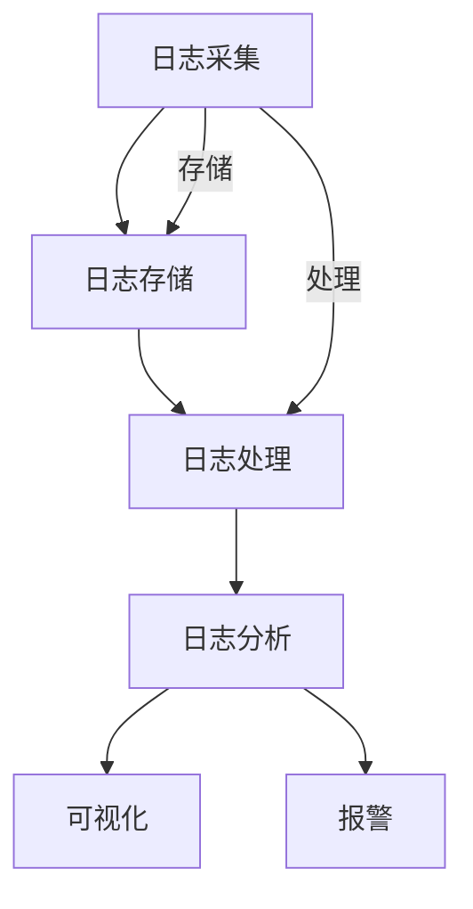
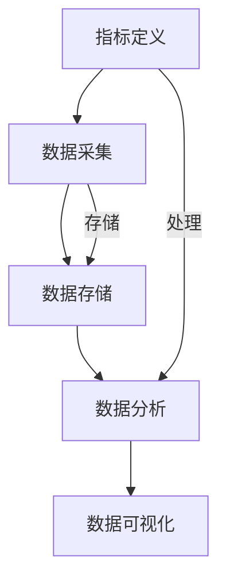
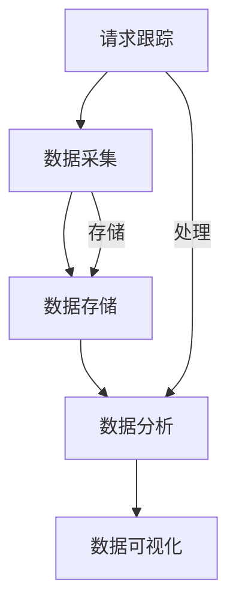
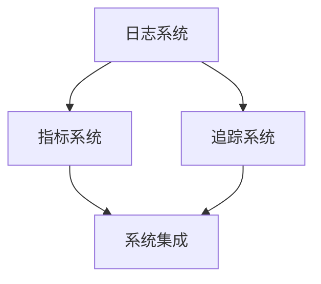

                 

### 《日志、指标、追踪三pillars实现》文章正文

---

## 文章标题

《日志、指标、追踪三pillars实现》

---

### 关键词

日志、指标、追踪、系统架构、数据采集、数据处理、性能优化

---

### 摘要

本文深入探讨了日志、指标、追踪三大系统在企业IT运维中的关键作用。首先，介绍了日志、指标、追踪的定义及其相互关系，通过Mermaid流程图展示核心概念间的架构联系。接着，详细分析了日志系统的设计与实现，包括日志采集、存储、处理与优化。随后，阐述了指标系统的设计与实现过程，以及指标数据采集、处理与分析的方法。最后，介绍了追踪系统的设计与实现，以及追踪数据采集、处理与性能优化。通过实际案例分析和最佳实践，为读者提供了全面的系统实现指南。

---

## 第一部分 引言

### 第1章 引言

#### 1.1 书籍背景与目的

在当今数字化时代，企业的IT系统日益复杂，如何有效地进行监控、优化和故障排查成为企业运营的关键。日志、指标、追踪作为三大核心系统，在系统的监控和管理中扮演着至关重要的角色。

**核心概念与联系：**

日志系统用于记录系统运行过程中的各种操作记录，是故障排查和性能分析的基础；指标系统用于衡量系统的性能和健康状况，是优化系统的重要依据；追踪系统用于跟踪和分析系统内部及跨系统的请求流程，是诊断和解决复杂问题的利器。三者相互补充，共同构成了系统的监控和优化体系。

#### 1.2 日志、指标、追踪的定义与重要性

**日志（Logs）：** 日志系统是记录系统操作和事件的工具，它可以帮助我们追踪问题的源头，分析系统运行状态，是故障排查和性能优化的基础。

**指标（Metrics）：** 指标系统通过收集和统计各种性能指标，如响应时间、吞吐量、错误率等，帮助运维人员快速了解系统运行状况，进行性能优化和容量规划。

**追踪（Tracing）：** 追踪系统用于跟踪和分析系统内部及跨系统的请求流程，可以帮助我们理解系统的工作流程，定位性能瓶颈，优化系统架构。

---

## 第二部分 日志系统实现

### 第2章 日志系统实现

#### 2.1 日志系统的设计与架构

日志系统的设计目标包括高效、可扩展、易维护。其核心架构包括日志采集、日志存储、日志处理和日志分析四个模块。

**Mermaid流程图：**



#### 2.2 日志采集与存储

日志采集是指从系统中捕获和收集日志信息。常见的方法有基于文件、基于网络、基于数据库等。

**伪代码：**

```python
def log_collection():
    while True:
        log_message = get_log_message()
        store_log_message(log_message)
```

日志存储是将采集到的日志信息存储到指定的存储介质中，如文件系统、数据库等。

**伪代码：**

```python
def store_log_message(log_message):
    with open('log_file.log', 'a') as f:
        f.write(log_message + '\n')
```

#### 2.3 日志处理与分析

日志处理是指对采集到的日志信息进行预处理、过滤和分类等操作，以便后续分析。常见的方法有正则表达式匹配、JSON解析等。

**伪代码：**

```python
def log_processing(log_message):
    try:
        log_data = parse_log_message(log_message)
        process_log_data(log_data)
    except Exception as e:
        log_error(e)

def parse_log_message(log_message):
    return json.loads(log_message)

def process_log_data(log_data):
    # 过滤、分类等操作
    pass
```

日志分析是指对处理后的日志信息进行分析，提取有用的信息，如错误日志、性能日志等。

**伪代码：**

```python
def log_analysis(log_data):
    if is_error_log(log_data):
        report_error_log(log_data)
    elif is_performance_log(log_data):
        analyze_performance_log(log_data)
```

#### 2.4 日志系统性能优化

日志系统性能优化主要包括提高日志采集速度、减少日志存储压力、优化日志处理和分析速度等。

**最佳实践：**

- **减少日志量：** 通过过滤不必要的日志，减少日志存储和处理的压力。
- **分布式日志系统：** 采用分布式日志系统，如ELK（Elasticsearch、Logstash、Kibana），提高日志处理和分析的效率。
- **日志压缩：** 对日志进行压缩，减少存储空间和传输带宽。

---

## 第三部分 指标系统实现

### 第3章 指标系统实现

#### 3.1 指标系统的设计与实现

指标系统是用于收集、存储和分析系统性能数据的核心系统。其设计包括指标定义、数据采集、数据存储、数据分析和数据可视化。

**Mermaid流程图：**



#### 3.2 指标数据采集与处理

指标数据采集是指从系统中收集性能数据，如CPU利用率、内存使用率、响应时间等。

**伪代码：**

```python
def metric_collection():
    while True:
        metric_data = get_metric_data()
        store_metric_data(metric_data)
```

指标数据处理是对采集到的数据进行预处理、过滤和转换等操作，以便存储和分析。

**伪代码：**

```python
def store_metric_data(metric_data):
    with open('metric_data.csv', 'a') as f:
        f.write(','.join([str(v) for v in metric_data]) + '\n')
```

#### 3.3 指标分析与展示

指标分析是指对处理后的数据进行统计分析，如计算平均值、最大值、最小值等。

**伪代码：**

```python
def analyze_metric_data(metric_data):
    avg = sum(metric_data) / len(metric_data)
    max_value = max(metric_data)
    min_value = min(metric_data)
    return avg, max_value, min_value
```

指标展示是将分析结果以图表形式展示给用户，如折线图、柱状图等。

**伪代码：**

```python
def display_metric_data(avg, max_value, min_value):
    print("平均数：", avg)
    print("最大值：", max_value)
    print("最小值：", min_value)
```

---

## 第四部分 追踪系统实现

### 第4章 追踪系统实现

#### 4.1 追踪系统的设计与实现

追踪系统是用于跟踪和分析系统内部及跨系统的请求流程的核心系统。其设计包括请求跟踪、数据采集、数据存储、数据分析和数据可视化。

**Mermaid流程图：**



#### 4.2 追踪数据采集与处理

追踪数据采集是指从系统中收集请求跟踪数据，如请求时间、请求路径、请求状态等。

**伪代码：**

```python
def trace_collection():
    while True:
        trace_data = get_trace_data()
        store_trace_data(trace_data)
```

追踪数据处理是对采集到的数据进行预处理、过滤和转换等操作，以便存储和分析。

**伪代码：**

```python
def store_trace_data(trace_data):
    with open('trace_data.csv', 'a') as f:
        f.write(','.join([str(v) for v in trace_data]) + '\n')
```

#### 4.3 追踪系统性能优化

追踪系统性能优化主要包括提高追踪数据采集速度、减少追踪数据存储压力、优化追踪数据处理和分析速度等。

**最佳实践：**

- **分布式追踪系统：** 采用分布式追踪系统，如OpenTelemetry，提高追踪数据处理的效率。
- **追踪数据压缩：** 对追踪数据进行压缩，减少存储空间和传输带宽。
- **追踪数据采样：** 通过采样，减少追踪数据的量，降低系统开销。

---

## 第五部分 系统集成与优化

### 第5章 系统集成与优化

#### 5.1 日志、指标、追踪系统集成

日志、指标、追踪系统集成是将三个独立系统整合为一个统一的监控和优化平台，以提高系统的整体性能和运维效率。

**Mermaid流程图：**



#### 5.2 系统集成与优化实践

系统集成与优化实践包括以下几个方面：

- **统一数据格式：** 将日志、指标、追踪数据格式统一，便于后续处理和分析。
- **数据融合：** 将日志、指标、追踪数据进行融合，提供更全面的系统监控视图。
- **自动化处理：** 采用自动化工具和脚本，提高系统运维效率。
- **负载均衡：** 采用负载均衡策略，提高系统处理能力。

#### 5.3 系统安全性与可靠性

系统安全性与可靠性是系统集成与优化的重要方面，包括以下几个方面：

- **数据加密：** 对敏感数据进行加密，防止数据泄露。
- **权限控制：** 实施严格的权限控制策略，确保数据安全。
- **故障恢复：** 设计故障恢复机制，确保系统稳定运行。
- **监控与审计：** 实施实时监控和审计，确保系统安全性和可靠性。

---

## 第六部分 案例分析

### 第6章 案例分析

#### 6.1 案例一：日志、指标、追踪在电商系统的应用

在本案例中，日志、指标、追踪系统被应用于电商系统的监控和优化，以提高系统的性能和用户体验。

**案例背景：**

某大型电商平台，由于用户规模庞大，系统复杂度高，需要对系统进行实时监控和优化，以应对各种业务场景和突发情况。

**解决方案：**

- **日志系统：** 采用ELK（Elasticsearch、Logstash、Kibana）搭建日志系统，实现日志的实时收集、存储、处理和分析。
- **指标系统：** 采用Prometheus和Grafana搭建指标系统，实时收集系统性能数据，提供可视化仪表盘。
- **追踪系统：** 采用OpenTelemetry搭建追踪系统，实时跟踪和分析用户请求流程，定位性能瓶颈。

**案例效果：**

通过日志、指标、追踪系统的集成与应用，电商系统实现了以下效果：

- **故障快速定位：** 通过日志系统，可以快速定位系统故障，缩短故障修复时间。
- **性能优化：** 通过指标系统，可以实时了解系统性能状况，进行性能优化。
- **用户体验提升：** 通过追踪系统，可以优化用户请求流程，提升用户体验。

---

## 第七部分 总结与展望

### 第7章 总结与展望

#### 7.1 书籍总结

本文系统地介绍了日志、指标、追踪三大系统在企业IT运维中的应用和实现方法。通过日志系统，可以实现对系统运行过程的全面监控和故障排查；通过指标系统，可以实时掌握系统性能状况，进行性能优化；通过追踪系统，可以深入分析系统内部和跨系统的请求流程，优化系统架构。

#### 7.2 日志、指标、追踪的发展趋势

随着云计算、大数据、人工智能等技术的发展，日志、指标、追踪系统也在不断演进和优化。未来，日志、指标、追踪系统的发展趋势包括：

- **自动化：** 自动化日志采集、处理、分析，降低运维成本。
- **智能化：** 利用人工智能技术，实现日志、指标、追踪的智能分析，提升系统性能和用户体验。
- **可视化：** 提高日志、指标、追踪系统的可视化水平，让运维人员更直观地了解系统状况。
- **融合：** 将日志、指标、追踪系统与其他系统（如监控、运维、安全等）进行深度融合，实现全方位的监控和优化。

---

### 附录

#### 附录A：常用工具与软件

- ELK（Elasticsearch、Logstash、Kibana）
- Prometheus
- Grafana
- OpenTelemetry

#### 附录B：常见问题解答

- Q：日志系统如何处理大量日志？
- A：采用分布式日志系统，如ELK，提高日志处理能力。

#### 参考文献

- [1] Elasticsearch: The Definitive Guide, Elastic
- [2] Prometheus: The Monitoring System, Prometheus
- [3] OpenTelemetry: The Open Source Observability Framework, OpenTelemetry
- [4] 《日志分析实战》，刘欣
- [5] 《性能优化实战》，王勇

---

### 作者信息

作者：AI天才研究院/AI Genius Institute & 禅与计算机程序设计艺术 /Zen And The Art of Computer Programming

