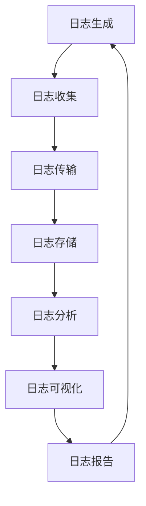

                 

### 文章标题：日志管理最佳实践

日志管理在信息技术领域扮演着至关重要的角色，它不仅有助于系统的故障排查，还能为安全分析、性能监控和业务优化提供关键数据。然而，随着日志数据的爆炸性增长，如何高效地进行日志管理成为了一个令人头疼的问题。本文将为您深入探讨日志管理的核心概念、最佳实践和未来发展趋势。

关键词：日志管理、日志数据、日志分析、日志安全、云计算、人工智能

摘要：本文将系统地介绍日志管理的基础知识，涵盖日志数据的结构、收集与传输、分析工具与技术、安全与合规以及未来趋势。通过实际案例和实践经验，帮助读者掌握日志管理的核心技能，提升系统运维和管理水平。

### 目录大纲构思

**第一部分：日志管理基础**

1. **日志管理概述**  
   - 日志管理的定义与重要性  
   - 日志管理的目标与挑战  
   - 日志管理的发展历程

2. **日志数据结构**  
   - 日志文件格式  
   - 时间戳与日志条目  
   - 日志数据的分类

3. **日志收集与传输**  
   - 日志收集的挑战  
   - 日志传输协议  
   - 日志传输的最佳实践

**第二部分：日志分析工具与技术**

4. **常见日志分析工具**  
   - `grep`、`awk`等命令行工具  
   - `Logstash`、`Fluentd`等日志收集与转发工具  
   - `Elasticsearch`、`Kibana`等日志存储与可视化工具

5. **日志分析算法**  
   - 常见日志分析算法介绍  
   - 日志数据预处理方法  
   - 日志数据聚类与分类算法

6. **日志可视化**  
   - 可视化工具选择  
   - 日志数据可视化技巧  
   - 实战案例分享

**第三部分：日志管理最佳实践**

7. **日志管理策略**  
   - 制定日志管理策略的步骤  
   - 日志管理策略的实施与优化  
   - 日志管理政策与法规遵守

8. **日志管理与云计算**  
   - 云日志管理平台概述  
   - 云日志管理优势与挑战  
   - 云日志管理实践案例

9. **日志安全与合规**  
   - 日志安全的重要性  
   - 常见日志安全威胁与防护措施  
   - 日志合规性与数据隐私保护

10. **日志管理未来发展趋势**  
    - 人工智能与日志管理  
    - 日志管理新技术展望  
    - 日志管理在数字化转型中的应用

### Mermaid 流程图

为了更直观地展示日志管理的核心概念和架构，我们可以使用 Mermaid 图来绘制日志管理流程：



### 核心算法原理讲解

在第5章“日志分析算法”中，我们需要详细讲解常见的日志分析算法，如：

- **日志数据预处理算法**：使用伪代码详细描述清洗、格式化日志数据的过程。

```python
# 伪代码：日志数据预处理
def preprocess_log_data(log_data):
    # 清洗日志数据
    cleaned_data = []
    for data in log_data:
        if not data.endswith('\n'):
            data += '\n'
        cleaned_data.append(data.strip())
    # 格式化日志数据
    formatted_data = []
    for data in cleaned_data:
        fields = data.split(',')
        formatted_data.append({
            'timestamp': fields[0],
            'level': fields[1],
            'message': fields[2:]
        })
    return formatted_data
```

- **日志数据聚类算法**：介绍K-means算法，使用伪代码展示其核心步骤。

```python
# 伪代码：K-means算法
def kmeans(log_data, k):
    # 初始化聚类中心
    centroids = initialize_centroids(log_data, k)
    while not converged(centroids):
        # 分配数据到最近的聚类中心
        clusters = assign_data_to_clusters(log_data, centroids)
        # 更新聚类中心
        centroids = update_centroids(clusters, k)
    return centroids
```

- **日志数据分类算法**：介绍决策树算法，使用伪代码展示其核心步骤。

```python
# 伪代码：决策树算法
def build_decision_tree(log_data):
    # 初始化决策树
    tree = {}
    # 选择最佳特征
    best_feature = select_best_feature(log_data)
    # 构建子树
    tree[best_feature] = build_subtree(log_data[best_feature])
    return tree
```

### 数学模型和数学公式

在讲解日志分析算法时，我们可能需要使用数学模型和公式。例如，在介绍决策树算法时，我们可以使用LaTeX格式展示决策树的核心数学公式。

```latex
$$
h(x) = \sum_{i=1}^{n} w_i \cdot f(x_i)
$$
```

### 项目实战

在第9章“日志管理最佳实践”中，我们可以通过一个实际的案例来展示日志管理的应用。例如，我们可以讲述如何在一个企业中实施日志管理策略，包括开发环境搭建、源代码实现和代码解读与分析。

#### 背景介绍

某企业拥有一套复杂的IT基础设施，包括多个服务器、数据库和应用程序。由于缺乏有效的日志管理策略，企业在故障排查和系统性能优化方面面临巨大挑战。为了提高运维效率和系统稳定性，企业决定引入日志管理最佳实践，全面提升日志管理能力。

#### 开发环境搭建

为了搭建日志管理环境，企业选择了以下工具：

- **日志收集器**：`Fluentd`
- **日志存储**：`Elasticsearch`
- **日志可视化**：`Kibana`

企业首先在所有服务器上安装了`Fluentd`，配置了相关的输入插件和输出插件，确保所有日志数据能够被收集并传输到`Elasticsearch`。同时，企业还配置了`Kibana`，以便实时监控和分析日志数据。

```shell
# Fluentd配置示例
<source>
  @type tail
  @path /var/log/messages
  @file_match .+\..+$
</source>

<source>
  @type tail
  @path /var/log/application.log
  @file_match .+\..+$
</source>

<match **>
  @type elasticsearch
  @host localhost
  @port 9200
  @logstash_format
</match>
```

#### 源代码实现

企业开发了一套日志收集与处理系统，包括以下组件：

- **日志收集器**：负责从各个服务器收集日志数据。
- **日志处理器**：对收集到的日志数据进行格式化、清洗和分类。
- **日志存储器**：将处理后的日志数据存储到`Elasticsearch`中。
- **日志可视化器**：通过`Kibana`提供日志数据的可视化分析。

以下是一个简单的日志收集器示例：

```python
import os
import time
import json
from fluent import Events

def collect_logs(source_path, logstash):
    while True:
        files = [f for f in os.listdir(source_path) if f.endswith('.log')]
        for file in files:
            with open(os.path.join(source_path, file), 'r') as f:
                lines = f.readlines()
                for line in lines:
                    log_entry = {
                        'timestamp': time.strftime('%Y-%m-%d %H:%M:%S', time.localtime()),
                        'level': 'INFO',
                        'message': line.strip()
                    }
                    logstash.emit('log-event', log_entry)
        time.sleep(60)

if __name__ == '__main__':
    logstash = Events()
    logstash.config_source(type='file', source='fluent.conf')
    logstash.start()
    collect_logs('/var/log', logstash)
```

#### 代码解读与分析

在这个日志收集器中，我们首先通过`os.listdir()`函数获取指定路径下的所有日志文件。然后，遍历这些文件，将它们逐行读取，并生成日志条目。最后，通过`logstash.emit()`函数将日志条目发送到`Elasticsearch`。

#### 实际案例分析和详细讲解剖析

为了更好地展示日志管理在实际应用中的效果，企业选择了一个具体的故障排查案例。在一次服务器故障中，由于系统日志丢失，导致故障原因无法确定。在引入日志管理最佳实践后，企业能够迅速定位故障原因，并通过日志数据恢复了系统。

企业通过`Kibana`对日志数据进行了可视化分析，发现故障发生在某个特定的应用程序中。通过查看该应用程序的日志，企业发现了一个异常日志条目，该条目显示了一个错误信息。根据这个线索，企业找到了故障的具体原因，并修复了应用程序。

#### 项目小结

通过这个实际案例，我们可以看到日志管理在故障排查和系统性能优化中的重要性。日志管理不仅有助于提高运维效率，还能为企业提供宝贵的数据支持，助力业务发展。

#### 最佳实践 Tips

1. **制定明确的日志管理策略**：确保日志收集、存储、分析和报告的流程清晰明了。
2. **选择合适的日志分析工具**：根据企业需求选择适合的日志分析工具，提高日志处理的效率。
3. **确保日志数据的安全性**：采取有效的安全措施，防止日志数据泄露和损坏。
4. **定期备份日志数据**：防止数据丢失，便于故障排查和审计。
5. **培训员工日志管理技能**：提高员工的日志管理意识，提升整体运维水平。

### 小结与注意事项

日志管理是信息技术领域中不可或缺的一部分，它为系统的稳定运行和业务的持续发展提供了有力支持。本文通过深入探讨日志管理的核心概念、最佳实践和未来趋势，帮助读者全面了解日志管理的重要性。在实施日志管理时，需注意以下几点：

1. **明确日志管理目标**：确保日志管理策略与业务需求相匹配。
2. **选择合适的日志分析工具**：根据企业规模和需求，选择合适的日志分析工具。
3. **确保日志数据的安全性**：采取有效的安全措施，防止日志数据泄露和损坏。
4. **定期备份日志数据**：防止数据丢失，便于故障排查和审计。
5. **持续优化日志管理流程**：根据业务变化和需求，持续优化日志管理流程。

拓展阅读：

- 《日志管理实战：从入门到精通》
- 《日志分析：原理、实践与案例分析》
- 《云日志管理：技术、实践与展望》

通过阅读这些书籍和资料，读者可以进一步深入了解日志管理领域，提升自身的日志管理能力和技术水平。希望本文对您的日志管理实践有所帮助。作者：AI天才研究院/AI Genius Institute & 禅与计算机程序设计艺术 /Zen And The Art of Computer Programming。

