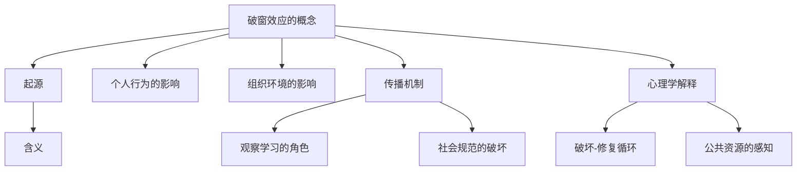

                 

### 第1章：破窗效应的概念与理论

#### 1.1 破窗效应的定义

破窗效应（Broken Window Theory）最早由犯罪学家詹姆斯·威尔逊（James Q. Wilson）和乔治·凯林（George L. Kelling）在1982年的著作《破窗：打破犯罪行为的社会学》（"Broken Windows: The Crime Control Role of Environmental Design"）中提出。这一理论的核心观点是，如果某些社会环境中的小问题不被及时处理，它们会逐渐积累，最终导致更严重的社会问题。

具体来说，破窗效应指的是，当建筑物或环境中的某个部分被破坏（比如窗户被打碎），如果没有及时修复，这个破损的部分会吸引更多的破坏行为，甚至可能导致整个环境质量下降。这种现象不仅体现在物质层面上，还可能在社会行为、心理健康、组织管理等多个层面产生深远影响。

#### 1.1.1 破窗效应的起源

破窗效应的起源可以追溯到1969年的一个事件。当时，纽约的一栋建筑的一扇窗户被打破，但并没有得到及时修复。几天后，更多的窗户被打破，最终这栋建筑变得破旧不堪，犯罪率也显著上升。这个事件引发了学者们的关注，并逐渐形成了破窗效应的理论框架。

#### 1.1.2 破窗效应的含义

破窗效应的含义主要体现在以下几个方面：

1. **小问题积累成大问题**：小问题得不到及时解决，会逐渐恶化，引发更多的问题。
2. **破坏行为具有示范效应**：一个破坏行为会引发更多类似的破坏行为，这种现象被称为“破窗效应”。
3. **社会秩序的破坏**：破窗效应不仅影响物质环境，还可能破坏社会秩序和人们的心理健康。
4. **环境影响行为**：环境状况对人们的行为有显著影响，良好的环境有助于维护社会秩序，而不良的环境则可能引发更多问题。

### 1.2 破窗效应的影响

破窗效应的影响可以从多个维度来分析：

#### 1.2.1 个人行为的影响

破窗效应在个人层面上主要表现为个体行为的改变。当个体观察到环境中的问题（如破损的物品或不良行为）且这些问题未被及时解决时，个体可能会受到不良示范的影响，从而模仿这些行为。

例如，如果一栋建筑的外墙破损却长时间未得到修复，居民可能会认为这栋建筑不再受到重视，从而更可能在此建筑内进行破坏行为，如涂鸦、乱丢垃圾等。

#### 1.2.2 组织环境的影响

在组织环境中，破窗效应表现为组织内部小问题的积累可能导致整个组织氛围的恶化。例如，如果一家公司对员工的不当行为未能及时制止和纠正，这些不当行为可能会逐渐增多，最终导致组织文化的堕落，影响公司的整体运营效率和员工士气。

### 1.3 破窗效应的传播机制

破窗效应的传播机制主要包括以下几个关键要素：

#### 1.3.1 观察学习的角色

观察学习（Observational Learning）在破窗效应的传播中起着至关重要的作用。个体通过观察他人的行为和环境变化，学习并模仿这些行为。当个体观察到环境中的不良行为未被纠正时，他们可能会认为这种行为是可以被接受的，从而更可能模仿这些行为。

#### 1.3.2 社会规范的破坏

破窗效应的一个关键机制是破坏了社会规范。社会规范是维护社会秩序的重要基础，当这些规范被破坏时，社会秩序可能会受到威胁。例如，如果一家餐厅的卫生状况很差且长时间未得到改善，其他顾客可能会认为这家餐厅的卫生问题是可以被忽视的，从而降低他们的卫生标准。

### 1.4 破窗效应的心理学解释

心理学为破窗效应提供了一些解释：

#### 1.4.1 破坏-修复循环

破窗效应的一个心理学解释是破坏-修复循环（Broken-Window-Behavior Cycle）。这个循环包括三个阶段：破坏、忽视和再破坏。当一个环境中的某些部分被破坏后，如果这个破坏未被及时修复，个体会认为这个环境是可以被破坏的，从而可能导致更多的破坏行为。

#### 1.4.2 公共资源的感知

破窗效应还涉及到公共资源的感知问题。当个体观察到公共资源（如公共设施、公共空间）被忽视或破坏时，他们可能会认为这些资源不再是他们应得的，从而降低对这些资源的维护和重视程度。

### 总结

本章介绍了破窗效应的基本概念、起源、含义以及其影响和传播机制。破窗效应不仅是一个社会学和犯罪学理论，其影响还渗透到个人行为、组织环境、心理学等多个领域。理解破窗效应有助于我们更好地预防和应对各种社会问题，维护良好的社会秩序。

### 1.5 破窗效应在不同领域的应用

破窗效应作为一个跨学科的概念，在不同领域中有着广泛的应用：

#### 1.5.1 社会学领域

在社会学领域，破窗效应被用来解释社区犯罪率的上升。研究表明，社区中破旧的建筑、涂鸦和垃圾等“破窗”现象可能会降低居民的归属感和责任感，从而使得犯罪行为更容易发生。

#### 1.5.2 犯罪学领域

在犯罪学领域，破窗效应被用于解释犯罪行为的发生和蔓延。犯罪学家认为，一些小的犯罪行为（如涂鸦、盗窃）可能会被视为“破窗”，如果这些行为得不到及时处理，可能会引发更多的严重犯罪。

#### 1.5.3 组织行为学领域

在组织行为学领域，破窗效应被用来解释组织内部不良行为的扩散。研究表明，如果组织中的不良行为得不到及时纠正，可能会导致整个组织氛围的恶化，影响组织的整体绩效。

### 1.6 破窗效应的影响因素

破窗效应的影响受到多种因素的影响，这些因素可以分为以下几个方面：

#### 1.6.1 破坏的程度

破坏的程度是影响破窗效应的重要因素。轻微的破坏可能不足以引起广泛的注意，但严重的破坏则更容易引发人们的注意和模仿行为。

#### 1.6.2 社区参与度

社区参与度是指居民对社区事务的关注程度和参与积极性。高社区参与度的社区通常能够更快地发现并处理“破窗”问题，从而减轻破窗效应的影响。

#### 1.6.3 法律执行力度

法律执行力度也是影响破窗效应的重要因素。在法律执行严格的社区，破坏行为更容易受到惩罚，从而减少破窗效应的发生。

### 1.7 破窗效应的评估方法

为了更好地理解和评估破窗效应的影响，研究者们采用了多种评估方法：

#### 1.7.1 问卷调查法

问卷调查法是一种常用的评估方法，通过问卷调查居民对社区环境状况的认知和行为反应，可以了解破窗效应在社区层面的影响。

#### 1.7.2 实证观察法

实证观察法是通过实地观察和记录社区环境中的破坏行为和修复行为，分析破窗效应的发生和演变过程。

#### 1.7.3 实验研究法

实验研究法通过设计和实施实验，模拟不同的社区环境条件，评估破窗效应在不同环境下的影响。

### 总结

本章详细介绍了破窗效应在不同领域的应用、影响因素以及评估方法。通过这些分析，我们能够更好地理解破窗效应的复杂性和广泛性，从而为预防和应对破窗效应提供科学依据。

---

### 第2章：破窗效应的实证研究

#### 2.1 破窗效应在不同领域的应用

破窗效应作为一个重要的社会现象，在多个领域中有着广泛的应用。以下是几个典型领域的应用实例：

##### 2.1.1 社会学领域

在社会学领域，破窗效应被用来解释社区犯罪率的变化。例如，一些研究表明，破旧的建筑、涂鸦和垃圾等“破窗”现象会增加社区的犯罪率。这是因为这些现象会降低居民的归属感和责任感，使得犯罪行为更容易发生。

##### 2.1.2 犯罪学领域

在犯罪学领域，破窗效应被用来解释犯罪行为的发生和蔓延。犯罪学家认为，一些小的犯罪行为（如涂鸦、盗窃）可能会被视为“破窗”，如果这些行为得不到及时处理，可能会引发更多的严重犯罪。

##### 2.1.3 组织行为学领域

在组织行为学领域，破窗效应被用来解释组织内部不良行为的扩散。研究表明，如果组织中的不良行为得不到及时纠正，可能会导致整个组织氛围的恶化，影响组织的整体绩效。

#### 2.2 破窗效应的影响因素

破窗效应的影响受到多种因素的影响。以下是几个关键因素：

##### 2.2.1 破坏的程度

破坏的程度是影响破窗效应的重要因素。轻微的破坏可能不足以引起广泛的注意，但严重的破坏则更容易引发人们的注意和模仿行为。

##### 2.2.2 社区参与度

社区参与度是指居民对社区事务的关注程度和参与积极性。高社区参与度的社区通常能够更快地发现并处理“破窗”问题，从而减轻破窗效应的影响。

##### 2.2.3 法律执行力度

法律执行力度也是影响破窗效应的重要因素。在法律执行严格的社区，破坏行为更容易受到惩罚，从而减少破窗效应的发生。

#### 2.3 破窗效应的评估方法

为了更好地理解和评估破窗效应的影响，研究者们采用了多种评估方法：

##### 2.3.1 问卷调查法

问卷调查法是一种常用的评估方法，通过问卷调查居民对社区环境状况的认知和行为反应，可以了解破窗效应在社区层面的影响。

##### 2.3.2 实证观察法

实证观察法是通过实地观察和记录社区环境中的破坏行为和修复行为，分析破窗效应的发生和演变过程。

##### 2.3.3 实验研究法

实验研究法通过设计和实施实验，模拟不同的社区环境条件，评估破窗效应在不同环境下的影响。

#### 2.4 破窗效应的实证研究结果

以下是一些关于破窗效应的实证研究结果：

##### 2.4.1 社会学领域

在社会学领域的研究表明，破窗效应确实对社区犯罪率有显著影响。例如，一项对美国城市的研究发现，破旧建筑和涂鸦等“破窗”现象与高犯罪率之间存在显著正相关关系。

##### 2.4.2 犯罪学领域

在犯罪学领域的研究表明，及时修复破坏行为可以显著降低犯罪率。例如，一项对纽约市的研究发现，及时修复破旧建筑和涂鸦等“破窗”现象可以显著降低犯罪率。

##### 2.4.3 组织行为学领域

在组织行为学领域的研究表明，及时纠正不良行为可以显著改善组织氛围。例如，一项对大型企业的研究发现，及时纠正员工的不当行为可以显著提高员工的满意度和工作效率。

### 总结

本章通过实证研究分析了破窗效应在不同领域的应用和影响，探讨了影响破窗效应的关键因素，并介绍了评估破窗效应的方法。这些研究结果为我们更好地理解和应对破窗效应提供了重要依据。

---

### 第3章：个体层面的应对

在破窗效应的个体层面，每个个体的行为和态度都起着至关重要的作用。如何从个人角度出发，有效预防和应对破窗效应的影响，是每个人都需要思考的问题。

#### 3.1 增强自我监督

自我监督是指个体对自己的行为和态度进行自我监控和调节。为了有效应对破窗效应，个体需要增强自我监督，防止自己受到不良示范的影响。

##### 3.1.1 自我约束的策略

以下是一些自我约束的策略，可以帮助个体增强自我监督：

1. **设定明确的目标和规则**：个体应该为自己设定明确的目标和规则，明确自己应该做什么，不应该做什么。例如，可以制定一个“不模仿不良行为”的规则。

2. **保持警觉**：个体需要时刻保持警觉，当观察到不良行为时，要能够迅速识别并抵制。例如，如果看到有人乱丢垃圾，要能够立即提醒自己不要效仿。

3. **积极反思**：个体应该定期对自己的行为进行反思，检查自己是否有违反规则的行为。通过反思，个体可以及时纠正错误，避免不良行为的积累。

4. **寻求支持**：个体可以寻求家人、朋友或专业人士的支持，共同监督自己的行为。例如，可以向朋友报告自己的不良行为，让他们帮助自己改正。

##### 3.1.2 增强自我效能感

自我效能感是指个体对自己完成特定任务的能力的信念。增强自我效能感可以帮助个体更好地应对破窗效应。

1. **积极训练**：个体可以通过积极训练来提高自己的自我效能感。例如，如果个体担心自己无法抵制不良示范，可以通过练习来增强自己的自控能力。

2. **设置小目标**：个体可以设置一些小目标，逐步提高自己的能力。例如，可以先从抵制一些小的诱惑开始，逐渐增加难度。

3. **获得成功经验**：个体应该积极寻求成功的机会，通过获得成功经验来提高自我效能感。例如，通过成功抵制了一次诱惑，可以增强对自己未来抵制诱惑的信心。

#### 3.2 强化自我责任感

自我责任感是指个体对自己行为的责任感。强化自我责任感可以帮助个体更好地应对破窗效应。

##### 3.2.1 自我责任的培养

以下是一些培养自我责任的策略：

1. **明确自己的责任**：个体应该明确自己的责任，知道自己应该承担什么责任。例如，个体可以制定一个“保持社区环境整洁”的责任。

2. **积极承担责任**：个体应该积极承担责任，不逃避责任。例如，如果个体发现社区中的问题，应该主动解决，而不是忽视或推诿。

3. **自我监督和评估**：个体应该定期对自己的责任履行情况进行监督和评估，确保自己履行了自己的责任。

4. **寻求反馈**：个体可以寻求他人的反馈，了解自己的责任履行情况。例如，可以向家人、朋友或同事询问他们对个人责任履行情况的看法。

##### 3.2.2 自我责任的增强方法

以下是一些增强自我责任的方法：

1. **设定明确的责任规则**：个体可以设定一些明确的责任规则，帮助自己更好地履行责任。例如，可以制定一个“每天打扫家庭卫生”的规则。

2. **培养责任感意识**：个体可以通过学习、阅读等方式培养责任感意识。例如，可以阅读一些关于责任感的书籍或文章。

3. **参与社会活动**：个体可以参与一些社会活动，增强自己的责任感。例如，可以参加志愿者活动或社区服务活动。

### 总结

本章从个体层面出发，探讨了如何通过增强自我监督和强化自我责任感来有效应对破窗效应。通过自我约束、增强自我效能感和培养自我责任感，个体可以更好地维护自己的行为准则，防止破窗效应的发生。

---

### 第4章：组织层面的应对

在组织层面，破窗效应的影响同样不可忽视。组织环境中的小问题如果得不到及时处理，可能会逐渐积累，最终影响整个组织的运作效率和员工士气。因此，组织需要采取一系列措施来预防和应对破窗效应。

#### 4.1 设立明确的管理制度

建立明确的管理制度是预防破窗效应的第一步。组织应该制定一系列规章制度，明确各项工作的责任和要求，确保每个员工都清楚自己的职责和权利。

##### 4.1.1 制定具体的规章制度

具体的规章制度应该包括以下几个方面：

1. **工作流程规范**：明确各个工作环节的具体流程，确保各项工作有序进行。
2. **行为准则**：规定员工应该遵守的行为规范，包括职业道德、团队合作等方面。
3. **奖惩制度**：设立奖惩机制，对遵守规章制度、积极改善环境的员工给予奖励，对违反规定的员工进行处罚。

##### 4.1.2 宣传和培训

制定规章制度后，组织应该通过多种渠道进行宣传和培训，确保每个员工都了解并遵守这些规章制度。

1. **内部培训**：组织可以定期开展内部培训，讲解规章制度的内容和重要性，提高员工的法律意识和责任感。
2. **宣传栏和内部刊物**：在组织的公共区域设置宣传栏，发布规章制度的相关内容，并通过内部刊物进行宣传。
3. **在线学习平台**：组织可以建立在线学习平台，提供规章制度的相关资料，方便员工随时学习和查阅。

#### 4.2 建立有效的监督机制

除了制定规章制度，组织还需要建立有效的监督机制，确保规章制度得到有效执行。

##### 4.2.1 设立监察部门

组织可以设立专门的监察部门，负责监督规章制度的执行情况。监察部门应该具有独立的权限，不受其他部门的干扰。

1. **定期检查**：监察部门应该定期对组织的各项工作进行检查，确保规章制度得到严格执行。
2. **及时反馈**：监察部门应该及时向管理层反馈检查结果，对发现的问题提出整改建议。
3. **投诉渠道**：组织应该设立投诉渠道，员工可以匿名举报违规行为，监察部门根据投诉进行核实和处理。

##### 4.2.2 利用技术手段

组织可以利用现代技术手段，如视频监控、数据分析等，提高监督的效率和效果。

1. **视频监控**：在关键区域安装监控摄像头，实时监控员工的行为，防止违规行为的发生。
2. **数据分析**：通过数据分析，监控组织内部的各项指标，及时发现异常情况，预防潜在问题。

#### 4.3 强化团队协作

团队协作是组织有效应对破窗效应的重要手段。通过加强团队协作，可以提高组织的整体执行力，及时发现并解决问题。

##### 4.3.1 建立良好的沟通机制

组织应该建立良好的沟通机制，确保信息流畅，促进团队协作。

1. **定期会议**：组织可以定期召开团队会议，讨论工作中的问题，分享经验和建议。
2. **内部沟通平台**：组织可以建立内部沟通平台，如企业微信群、邮件系统等，方便员工之间交流和协作。
3. **跨部门合作**：鼓励跨部门合作，促进不同部门之间的沟通与协调，提高整体执行力。

##### 4.3.2 培养团队凝聚力

培养团队凝聚力，可以提高员工的归属感和责任感，减少破窗效应的发生。

1. **团队建设活动**：组织可以定期举办团队建设活动，增强团队成员之间的互信和合作。
2. **激励机制**：设立激励机制，对团队协作中表现优异的员工进行奖励，鼓励更多人参与团队协作。
3. **共同目标**：明确团队的共同目标，让每个员工都明确自己的贡献和责任，增强团队凝聚力。

### 总结

本章从组织层面探讨了如何应对破窗效应。通过建立明确的管理制度、建立有效的监督机制和强化团队协作，组织可以预防和应对破窗效应，提高组织的整体执行力和管理水平。

---

### 第5章：社会层面的应对

在宏观层面，社会作为整体，对破窗效应的应对具有深远的影响。社会层面的措施不仅能够直接影响个体的行为，还可以通过政策和法律手段，从源头上预防和应对破窗效应。

#### 5.1 政策支持

政府的政策支持是预防和应对破窗效应的重要手段。以下是一些政策支持的措施：

##### 5.1.1 税收优惠

政府可以给予维护社会环境和公共设施的企业和社区税收优惠，鼓励他们积极参与社区建设和环境维护。

##### 5.1.2 资金支持

政府可以提供专项资金，用于修复公共设施和改善社区环境。这些资金可以用于社区美化、垃圾清理、建筑维修等。

##### 5.1.3 法律法规

政府可以出台相关的法律法规，加强对破坏行为的打击力度，确保法律执行的严肃性和权威性。

#### 5.2 法律制度

法律制度是社会应对破窗效应的重要保障。以下是一些法律制度的措施：

##### 5.2.1 破坏行为的界定

明确界定哪些行为属于破坏行为，确保法律适用范围的广泛性和准确性。

##### 5.2.2 罚则的制定

制定严厉的罚则，对破坏行为进行处罚，提高违法成本，降低破坏行为的概率。

##### 5.2.3 执法力度

加强执法力度，确保法律得到有效执行，防止执法不力或执法宽松的情况发生。

#### 5.3 社会教育

社会教育是提升公众法律意识和道德素质的重要途径。以下是一些社会教育的措施：

##### 5.3.1 法律教育

通过学校教育、社会培训等方式，向公众普及法律知识，提高他们的法律意识。

##### 5.3.2 道德教育

通过媒体、公益广告、社区活动等方式，向公众传递道德观念，引导他们遵守社会规范。

##### 5.3.3 社区参与

鼓励公众参与社区管理，提高他们对社区事务的关注度和参与度，共同维护社区环境。

#### 5.4 社会监督

社会监督是确保法律和政策得到有效执行的重要手段。以下是一些社会监督的措施：

##### 5.4.1 公众监督

鼓励公众对破坏行为进行举报，提供举报渠道和奖励机制，提高公众参与度。

##### 5.4.2 媒体监督

利用媒体的力量，对破坏行为进行曝光，形成舆论压力，促使相关部门采取措施。

##### 5.4.3 非政府组织

鼓励非政府组织参与社会监督，发挥其在环境维护和社会管理方面的作用。

### 总结

本章从社会层面探讨了如何应对破窗效应。通过政策支持、法律制度、社会教育和社会监督等措施，社会可以形成良好的环境和秩序，减少破窗效应的发生，提高整体社会的和谐度和幸福感。

---

### 第6章：破窗效应的应对策略总结

在前面的章节中，我们详细探讨了破窗效应的概念、影响、评估方法以及在不同领域的应用，还提出了个体、组织和社会层面的应对策略。在这一章中，我们将对这些策略进行总结，并提供一些最佳实践。

#### 6.1 个体层面的最佳实践

在个体层面，以下是一些最佳实践：

1. **增强自我监督**：
   - 设定明确的目标和规则，明确自己的责任和期望。
   - 保持警觉，及时发现并抵制不良示范。
   - 定期进行自我反思，检查自己的行为是否符合规则。

2. **强化自我效能感**：
   - 积极训练，提高自己的自控能力和应对能力。
   - 设定小目标，逐步提高自己的能力水平。
   - 不断获得成功经验，增强自我效能感。

3. **培养责任感**：
   - 明确自己的责任，勇于承担责任。
   - 通过自我监督和评估，确保自己履行责任。
   - 寻求支持，与他人一起监督自己的行为。

#### 6.2 组织层面的最佳实践

在组织层面，以下是一些最佳实践：

1. **建立明确的管理制度**：
   - 制定具体的规章制度，明确各项工作的责任和要求。
   - 宣传和培训，确保员工了解并遵守规章制度。

2. **建立有效的监督机制**：
   - 设立监察部门，定期检查规章制度的执行情况。
   - 利用技术手段，提高监督的效率和效果。

3. **强化团队协作**：
   - 建立良好的沟通机制，促进团队协作。
   - 培养团队凝聚力，提高员工的归属感和责任感。

#### 6.3 社会层面的最佳实践

在社会层面，以下是一些最佳实践：

1. **政策支持**：
   - 给予维护社会环境和公共设施的企业和社区税收优惠。
   - 提供专项资金，用于修复公共设施和改善社区环境。

2. **法律制度**：
   - 明确界定破坏行为，制定严厉的罚则。
   - 加强执法力度，确保法律得到有效执行。

3. **社会教育**：
   - 通过学校教育、社会培训等方式，普及法律知识。
   - 利用媒体、公益广告等，传递道德观念。

4. **社会监督**：
   - 鼓励公众举报破坏行为，提供举报渠道和奖励机制。
   - 利用媒体的力量，曝光破坏行为。
   - 鼓励非政府组织参与社会监督。

### 6.4 注意事项

在应对破窗效应时，还需要注意以下几点：

1. **及时处理**：发现破窗现象要及时处理，避免问题积累。
2. **持续关注**：破窗效应不是一次性的问题，需要持续关注和应对。
3. **全员参与**：鼓励全员参与，共同维护社会秩序和环境。
4. **灵活应对**：根据具体情况，灵活调整应对策略。

### 总结

破窗效应是一个复杂的社会现象，需要个体、组织和全社会共同努力来应对。通过上述最佳实践和注意事项，我们可以更好地预防和应对破窗效应，构建和谐的社会环境。

---

### 第7章：进一步阅读资源

为了帮助读者更深入地了解破窗效应及其应用，我们推荐以下进一步阅读的资源：

#### 7.1 学术论文

1. **Wilson, J. Q., & Kelling, G. L. (1982). *Broken Windows: The Police and Neighborhood Safety*. The Atlantic.**
   - 这是破窗效应理论的原始文献，详细阐述了理论背景和应用。

2. **Sutherland, E. H. (1949). *The Technique of Crime Prevention*. Justice Quarterly, 7(2), 191-201.**
   - 爱德华·S. 苏瑟兰的这篇文章提供了破窗效应的心理学理论基础。

#### 7.2 专业书籍

1. **Wilson, J. Q., & Herrnstein, R. J. (1985). *Possessing the Secrets of the Lord: The Confessions of a Family Court Judge*. Basic Books.**
   - 约翰·威尔逊的这本书深入探讨了法律制度对社会秩序的影响。

2. **Geller, E. (2009). *Broken Windows: How the Police Could Save Us from Crime, Drugs, and Disorder*. New York: Oxford University Press.**
   - 这本书详细介绍了破窗效应的实际应用，包括警务实践。

#### 7.3 网络资源

1. **YouTube频道：*MindShift***
   - 这个YouTube频道提供了多个关于破窗效应的讲解视频，适合初学者了解基本概念。

2. **TED演讲：*The Power of Small Actions* by Roman Krznaric**
   - 罗曼·克兹纳里奇的TED演讲，探讨了小行为对社会变革的影响，包括破窗效应。

#### 7.4 组织和机构

1. **The Broken Windows Theory Resource Page**
   - 这是一个专门的网站，提供了大量关于破窗效应的理论和实践资源。

2. **Community Safety Initiative**
   - 这是一个致力于通过改善社区环境来提高公共安全的组织，提供了很多实用的案例和策略。

通过这些资源和工具，读者可以更全面地了解破窗效应，并将其应用于实际工作和生活中，以提升社会秩序和公共安全。

