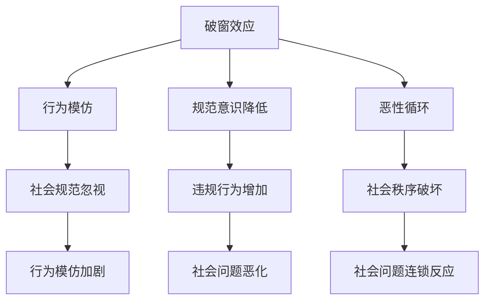

                 

### 文章标题：时刻谨防'破窗效应'

#### 关键词：
破窗效应，社会心理学，防范策略，组织管理，个体责任

#### 摘要：
本文旨在深入探讨破窗效应这一社会心理学现象，分析其在家庭、学校、工作场所等不同情境下的影响，并提出具体的防范与应对策略。通过对破窗效应的原理、应用及其实战案例的详细解析，旨在帮助读者理解和应对这一现象，从而构建更加和谐稳定的社会环境。

### 目录大纲

#### 第一部分：破窗效应概述

##### 第1章：破窗效应的概念与历史背景

###### 1.1 破窗效应的定义

破窗效应，又称为破窗理论，最早由美国社会学家詹姆斯·威尔逊和乔治·凯林于1982年提出。该理论指出，如果一个建筑物的窗户被打破，而这扇窗户得不到及时的修理，那么可能引发更多的破坏行为。这个现象反映了人们对于规范和秩序的忽视，以及随后的连锁反应。

###### 1.2 破窗效应的历史背景

破窗效应的概念源于城市犯罪研究的需要。在20世纪70年代的纽约，犯罪率居高不下，社会秩序紊乱。威尔逊和凯林的研究发现，犯罪行为的发生往往与社区环境的破损和破败密切相关。他们的研究推动了破窗效应理论的发展，成为社会治理中的重要理论依据。

###### 1.3 破窗效应的心理学原理

破窗效应的心理学原理主要涉及行为学和社会心理学。首先，人们倾向于模仿他人的行为，特别是在没有明确规范的情况下。其次，破损和破败的物品会降低人们的规范意识，使其更容易忽视和违反社会规范。最后，这种现象会形成一种恶性循环，进一步破坏社会秩序。

#### 第二部分：破窗效应的影响

##### 第2章：破窗效应的社会应用

###### 2.1 家庭中的破窗效应

家庭是社会的细胞，破窗效应在家庭中同样具有重要影响。家庭成员之间的矛盾和不良行为，如果得不到及时处理，可能导致家庭关系的破裂，甚至影响下一代的成长。

###### 2.2 学校中的破窗效应

学校是培养人才的摇篮，破窗效应在校园中的表现尤为明显。学生之间的欺凌、不良行为如果得不到有效制止，可能导致校园暴力事件的增加，影响学生的身心健康。

###### 2.3 工作场所中的破窗效应

工作场所是人们生活的重要组成部分，破窗效应在工作中的影响也不容忽视。员工的不满和不良行为，如果得不到及时解决，可能导致工作氛围恶化，影响工作效率和团队凝聚力。

#### 第三部分：防范与应对策略

##### 第3章：政策与制度防范

###### 3.1 制定预防破窗效应的政策

政府应制定相应的政策，加强对社会秩序的管理和维护。例如，及时修复破损的公共设施，加强执法力度，提高社会治安水平。

###### 3.2 法律与监管机制的完善

完善法律制度，加强对违规行为的监管和处罚，是防范破窗效应的重要手段。同时，建立健全的投诉举报机制，鼓励公众参与社会治理。

###### 3.3 社会组织与社区的角色

社会组织和社区在防范破窗效应中发挥着重要作用。通过开展社区活动，提升居民的安全意识和规范意识，有助于减少破窗效应的发生。

##### 第4章：文化教育与心理建设

###### 4.1 破窗效应的文化教育策略

教育部门应将破窗效应纳入学校教育课程，通过案例分析、互动讨论等形式，提高学生的社会责任感和规范意识。

###### 4.2 增强个体心理韧性

个体心理韧性的培养是防范破窗效应的重要途径。通过心理健康教育和心理辅导，帮助人们建立良好的心理素质，增强面对困难和挫折的能力。

###### 4.3 促进社会和谐的价值观教育

价值观教育是防范破窗效应的重要手段。通过弘扬正能量，倡导公平、正义、和谐的价值观，营造良好的社会氛围。

##### 第5章：个体层面的应对策略

###### 5.1 识别和避免破窗效应

个体应学会识别和避免破窗效应。在日常生活中，要自觉遵守社会规范，积极参与社会管理，共同维护社会秩序。

###### 5.2 增强自身心理素质

个体心理素质的增强是防范破窗效应的关键。通过不断学习和实践，提高自身的心理素质，增强应对困难和挫折的能力。

###### 5.3 建立积极的人际关系

积极的人际关系有助于个体避免破窗效应。通过建立良好的人际关系，提高社会支持水平，有助于个体应对各种挑战和压力。

#### 第四部分：实战案例分析

##### 第6章：破窗效应的案例研究

###### 6.1 案例一：家庭中的破窗效应

通过案例分析，了解家庭中破窗效应的具体表现及其危害，探讨有效的应对措施。

###### 6.2 案例二：学校中的破窗效应

分析学校中破窗效应的现象及其对师生关系的影响，提出有效的预防和应对策略。

###### 6.3 案例三：工作场所中的破窗效应

通过案例研究，探讨工作场所中破窗效应的表现和影响，提出针对性的防范和应对措施。

#### 第五部分：个人与社会的责任

##### 第7章：个人在社会责任中的角色

###### 7.1 自我反思与责任意识

个人应自觉承担社会责任，通过自我反思，提高责任意识，积极参与社会管理。

###### 7.2 个人行动与社会影响

个人行动对社会有着深远的影响。通过积极参与社会公益活动，传播正能量，有助于构建和谐社会。

###### 7.3 个人与社会的互动关系

个人与社会是相互依存、相互影响的关系。通过积极互动，实现个人价值和社会价值的共同提升。

##### 第8章：构建和谐社会

###### 8.1 社会责任与和谐发展

社会责任是构建和谐社会的重要基石。通过履行社会责任，推动社会和谐发展。

###### 8.2 社会责任制度的建设

建立健全的社会责任制度，是防范破窗效应的重要保障。通过完善制度，提高社会治理水平。

###### 8.3 个人与社会共同的责任

个人与社会共同承担着防范破窗效应的责任。通过共同努力，实现社会稳定和谐的目标。

### 总结

破窗效应是一种普遍存在于社会各个领域的社会心理学现象。通过本文的深入探讨，我们了解了破窗效应的概念、影响及防范策略。我们呼吁个人和社会共同承担责任，积极应对破窗效应，共同构建和谐社会。只有这样，我们才能有效预防和减少破窗效应的发生，为社会的持续稳定和谐发展创造良好的条件。作者：AI天才研究院/AI Genius Institute & 禅与计算机程序设计艺术/Zen And The Art of Computer Programming

---

以下为文章正文部分：

### 第一部分：破窗效应概述

#### 第1章：破窗效应的概念与历史背景

##### 1.1 破窗效应的定义

破窗效应，又称为破窗理论，最早由美国社会学家詹姆斯·威尔逊和乔治·凯林于1982年提出。该理论指出，如果一个建筑物的窗户被打破，而这扇窗户得不到及时的修理，那么可能引发更多的破坏行为。这个现象反映了人们对于规范和秩序的忽视，以及随后的连锁反应。

破窗效应的基本原理可以概括为三个关键点：

1. **行为模仿**：人们在行为选择上容易受到他人行为的影响。如果一个地方出现了破坏行为，其他人可能会模仿这种行为，认为没有人在意或没有严重后果。
2. **规范意识的降低**：破损和破败的物品会降低人们的规范意识，使其更容易忽视和违反社会规范。
3. **恶性循环**：破窗效应形成了一种恶性循环，初始的破坏行为会导致更多的破坏行为，进一步破坏社会秩序。

##### 1.2 破窗效应的历史背景

破窗效应的概念源于城市犯罪研究的需要。在20世纪70年代的纽约，犯罪率居高不下，社会秩序紊乱。威尔逊和凯林的研究发现，犯罪行为的发生往往与社区环境的破损和破败密切相关。他们的研究推动了破窗效应理论的发展，成为社会治理中的重要理论依据。

具体来说，威尔逊和凯林在研究过程中发现，纽约市的一些社区，尽管居民的数量和组成情况相似，但犯罪率却存在显著差异。通过实地考察和分析，他们发现，社区环境中的破损和破败现象是犯罪率差异的一个重要原因。这个发现促使他们提出了破窗效应理论。

##### 1.3 破窗效应的心理学原理

破窗效应的心理学原理主要涉及行为学和社会心理学。首先，人们倾向于模仿他人的行为，特别是在没有明确规范的情况下。例如，如果一个人在公共场所乱丢垃圾，其他人可能会模仿这种行为，认为这也是被允许的。这种行为模仿不仅影响个体的行为，也会影响整个群体的行为规范。

其次，破损和破败的物品会降低人们的规范意识。当人们看到周围的环境破损时，可能会认为这是常态，从而降低对规范和秩序的重视。例如，一个被打破的窗户可能被视为不需要修理的，其他人可能也会认为这是可以接受的，从而导致更多的破坏行为。

最后，破窗效应会形成一种恶性循环。初始的破坏行为会导致更多的破坏行为，进一步破坏社会秩序。这种连锁反应使得社会问题逐渐恶化，形成一种恶性循环。

#### 第2章：破窗效应的社会应用

##### 2.1 家庭中的破窗效应

家庭是社会的细胞，破窗效应在家庭中同样具有重要影响。家庭成员之间的矛盾和不良行为，如果得不到及时处理，可能导致家庭关系的破裂，甚至影响下一代的成长。

家庭中的破窗效应主要表现在以下几个方面：

1. **家庭成员之间的冲突**：家庭成员之间的矛盾和冲突，如果得不到及时解决，可能会逐渐升级，导致家庭关系的破裂。
2. **不良行为的模仿**：家庭成员的不良行为，如说谎、欺骗等，如果得不到及时纠正，可能会被其他家庭成员模仿，进一步恶化家庭氛围。
3. **亲子关系的破裂**：亲子关系是家庭中的重要关系，如果亲子之间的矛盾得不到及时处理，可能会影响下一代的成长和发展。

##### 2.2 学校中的破窗效应

学校是培养人才的摇篮，破窗效应在校园中的表现尤为明显。学生之间的欺凌、不良行为如果得不到有效制止，可能导致校园暴力事件的增加，影响学生的身心健康。

学校中的破窗效应主要表现在以下几个方面：

1. **学生之间的欺凌**：学生之间的欺凌行为，如嘲笑、殴打等，如果得不到有效制止，可能会引发更多的欺凌事件，影响受害者的心理健康。
2. **校园暴力**：校园暴力是学校中的一种严重问题，如果得不到及时处理，可能会导致校园暴力事件的增加，影响学生的学习和生活。
3. **教师的不良行为**：教师是学生的引路人，教师的不良行为，如体罚、歧视等，如果得不到及时纠正，可能会影响学生对学校的信任和尊重。

##### 2.3 工作场所中的破窗效应

工作场所是人们生活的重要组成部分，破窗效应在工作中的影响也不容忽视。员工的不满和不良行为，如果得不到及时解决，可能导致工作氛围恶化，影响工作效率和团队凝聚力。

工作场所中的破窗效应主要表现在以下几个方面：

1. **员工的不满情绪**：员工的不满情绪，如抱怨、消极等，如果得不到及时处理，可能会影响员工的工作积极性和工作效率。
2. **不良行为的扩散**：员工的不良行为，如迟到、早退、偷窃等，如果得不到有效制止，可能会被其他员工模仿，进一步恶化工作氛围。
3. **团队凝聚力的下降**：团队凝聚力是工作场所中不可或缺的因素，如果团队成员之间出现矛盾和不良行为，可能会导致团队凝聚力的下降，影响团队的整体表现。

### 第二部分：防范与应对策略

#### 第3章：政策与制度防范

##### 3.1 制定预防破窗效应的政策

政府应制定相应的政策，加强对社会秩序的管理和维护。例如，及时修复破损的公共设施，加强执法力度，提高社会治安水平。

具体来说，政府可以采取以下措施：

1. **加强公共设施维护**：政府应定期检查公共设施，如道路、桥梁、路灯等，确保其安全、整洁。对于破损的设施，应立即进行修复，避免引发更多的破坏行为。
2. **加强执法力度**：政府应加强对违规行为的执法力度，提高违法成本。通过严惩违规行为，营造一个公平、公正、有序的社会环境。
3. **提高社会治安水平**：政府应加强社会治安管理，提高治安巡逻的频率，加强对犯罪活动的打击力度。通过提高社会治安水平，减少犯罪行为的发生。

##### 3.2 法律与监管机制的完善

完善法律制度，加强对违规行为的监管和处罚，是防范破窗效应的重要手段。同时，建立健全的投诉举报机制，鼓励公众参与社会治理。

具体来说，可以采取以下措施：

1. **完善法律法规**：政府应完善相关法律法规，明确违规行为的法律责任和处罚措施。通过制定明确的法律法规，为执法机构提供依据，提高执法效率。
2. **加强监管机制**：政府应加强对违规行为的监管，提高监管力度。通过设立专门的监管机构，加强对违规行为的查处和处罚，确保法律法规的执行。
3. **建立投诉举报机制**：政府应建立健全的投诉举报机制，鼓励公众积极参与社会治理。通过设立投诉热线、网上投诉平台等渠道，方便公众举报违规行为，提高社会治理的透明度和公信力。

##### 3.3 社会组织与社区的角色

社会组织和社区在防范破窗效应中发挥着重要作用。通过开展社区活动，提升居民的安全意识和规范意识，有助于减少破窗效应的发生。

具体来说，社会组织和社区可以采取以下措施：

1. **开展社区活动**：社会组织和社区可以组织各类社区活动，如志愿服务、社区清洁等，提高居民的安全意识和规范意识。通过参与社区活动，居民可以更好地了解社区环境，积极参与社区管理。
2. **加强宣传教育**：社会组织和社区可以通过宣传教育，提高居民对破窗效应的认识。通过发放宣传资料、举办讲座等方式，让居民了解破窗效应的危害和防范方法，提高居民的防范意识。
3. **建立社区监督机制**：社会组织和社区可以建立社区监督机制，加强对违规行为的监督和举报。通过设立监督员、举报电话等方式，方便居民监督社区环境，及时发现问题并上报。

#### 第4章：文化教育与心理建设

##### 4.1 破窗效应的文化教育策略

教育部门应将破窗效应纳入学校教育课程，通过案例分析、互动讨论等形式，提高学生的社会责任感和规范意识。

具体来说，可以采取以下措施：

1. **开设相关课程**：教育部门可以在中学、大学等教育阶段开设破窗效应的相关课程，让学生系统了解破窗效应的概念、原理和危害。通过案例分析、互动讨论等形式，提高学生的社会责任感和规范意识。
2. **开展课外活动**：教育部门可以组织学生参加各类课外活动，如社会实践、志愿服务等，让学生在实践中体验破窗效应的危害和防范方法。通过实践活动，提高学生的实际操作能力和责任感。
3. **加强师资培训**：教育部门应加强对教师的培训，提高教师对破窗效应的认识和教学能力。通过培训，帮助教师更好地开展破窗效应的教育教学活动，提高教学效果。

##### 4.2 增强个体心理韧性

个体心理韧性的培养是防范破窗效应的重要途径。通过心理健康教育和心理辅导，帮助人们建立良好的心理素质，增强面对困难和挫折的能力。

具体来说，可以采取以下措施：

1. **开展心理健康教育**：教育部门可以开展心理健康教育，提高学生的心理素质。通过心理健康课程、讲座等形式，帮助学生了解心理健康知识，掌握心理调适方法。
2. **提供心理辅导**：学校可以设立心理辅导室，为学生提供心理辅导服务。通过个别辅导、小组辅导等形式，帮助学生解决心理问题，提高心理韧性。
3. **建立心理健康服务体系**：政府和社会组织可以建立心理健康服务体系，为公众提供心理健康服务。通过心理咨询、心理治疗等方式，帮助公众应对心理问题，提高心理健康水平。

##### 4.3 促进社会和谐的价值观教育

价值观教育是防范破窗效应的重要手段。通过弘扬正能量，倡导公平、正义、和谐的价值观，营造良好的社会氛围。

具体来说，可以采取以下措施：

1. **弘扬正能量**：媒体可以积极宣传正能量，报道正面典型和先进事迹，传递积极向上的价值观。通过弘扬正能量，激发公众的积极性和正能量。
2. **倡导公平正义**：政府和社会组织可以倡导公平正义的价值观，通过制定公平正义的政策和法律，维护社会公平正义。通过公平正义的倡导，提高公众的规范意识和社会责任感。
3. **培养和谐价值观**：教育部门可以开展和谐价值观教育，培养学生的和谐意识。通过课堂教学、校园文化活动等形式，培养学生的和谐意识，提高学生的道德素质。

#### 第5章：个体层面的应对策略

##### 5.1 识别和避免破窗效应

个体应学会识别和避免破窗效应。在日常生活中，要自觉遵守社会规范，积极参与社会管理，共同维护社会秩序。

具体来说，可以采取以下措施：

1. **自觉遵守社会规范**：个体应自觉遵守社会规范，不违反法律法规和社会道德。通过遵守社会规范，维护社会秩序，避免破窗效应的发生。
2. **积极参与社会管理**：个体应积极参与社会管理，主动承担社会责任。通过参与社会管理，提高社会意识和社会责任感，减少破窗效应的发生。
3. **增强规范意识**：个体应增强规范意识，意识到自己的行为对社会的影响。通过提高规范意识，自觉遵守社会规范，避免破窗效应的发生。

##### 5.2 增强自身心理素质

个体心理素质的增强是防范破窗效应的关键。通过不断学习和实践，提高自身的心理素质，增强应对困难和挫折的能力。

具体来说，可以采取以下措施：

1. **学习心理健康知识**：个体可以通过学习心理健康知识，了解心理问题的原因和解决方法。通过心理健康知识的学习，提高心理素质，增强心理韧性。
2. **进行心理调适**：个体可以通过进行心理调适，缓解心理压力，提高心理健康水平。通过心理调适，增强心理素质，应对困难和挫折。
3. **培养积极心态**：个体应培养积极心态，积极面对生活中的困难和挑战。通过积极心态的培养，提高心理素质，增强应对困难和挫折的能力。

##### 5.3 建立积极的人际关系

积极的人际关系有助于个体避免破窗效应。通过建立良好的人际关系，提高社会支持水平，有助于个体应对各种挑战和压力。

具体来说，可以采取以下措施：

1. **建立良好的人际关系**：个体应努力建立良好的人际关系，与他人保持友好交往。通过良好的人际关系，获得他人的支持和帮助，增强社会支持水平。
2. **参与社会活动**：个体可以参与各种社会活动，扩大社交圈子，提高社会支持水平。通过参与社会活动，增强社交能力，建立更多的人际关系。
3. **寻求专业帮助**：个体在遇到困难和挑战时，可以寻求专业帮助，如心理咨询、心理治疗等。通过专业帮助，解决心理问题，提高心理健康水平，增强应对困难和挫折的能力。

#### 第四部分：实战案例分析

##### 第6章：破窗效应的案例研究

##### 6.1 案例一：家庭中的破窗效应

在一个家庭中，如果家庭成员之间存在矛盾和冲突，而这些矛盾和冲突得不到及时解决，可能会引发更多的冲突和不良行为。例如，父母之间经常发生争吵，子女可能会模仿这种行为，导致家庭内部的紧张关系进一步升级。

**案例分析：** 一个家庭中，父母经常因为琐事争吵，子女看到这种不良行为，开始模仿父母的行为，对兄弟姐妹产生敌意，甚至发展成暴力行为。这种破窗效应不仅破坏了家庭关系，也影响了子女的心理健康。

**应对措施：** 针对家庭中的破窗效应，家庭成员应共同努力，增强沟通和理解。通过家庭辅导、心理咨询服务等方式，帮助家庭成员解决矛盾和冲突，建立和谐的亲子关系。

##### 6.2 案例二：学校中的破窗效应

在学校中，学生之间的欺凌和不良行为如果得不到有效制止，可能会引发更多的欺凌事件，影响学生的身心健康。

**案例分析：** 一所学校中，学生A因为身材矮小，经常被同学嘲笑和欺凌。起初，学生A试图通过反抗来解决问题，但反抗无效后，他开始选择沉默。随着时间的推移，更多的同学加入欺凌行列，学生A的心理健康受到严重影响。

**应对措施：** 针对学校中的破窗效应，学校应加强校园欺凌的防治工作。通过设立心理咨询室、开展心理健康教育等方式，提高学生的心理健康水平。同时，加强对欺凌行为的监管和处罚，确保学生的安全和心理健康。

##### 6.3 案例三：工作场所中的破窗效应

在工作场所中，员工的不满和不良行为如果得不到及时解决，可能会影响工作效率和团队凝聚力。

**案例分析：** 一家公司中，员工B因为工作压力大，经常在办公室抱怨和发牢骚。开始时，其他员工选择忽视，但随着时间的推移，越来越多的员工加入抱怨的行列，工作氛围变得消极，工作效率下降。

**应对措施：** 针对工作场所中的破窗效应，公司应建立有效的沟通渠道，鼓励员工表达意见和诉求。通过定期的员工反馈会议、心理咨询服务等方式，帮助员工缓解压力，提高工作效率。同时，加强对不良行为的监管和处罚，营造积极的工作氛围。

#### 第五部分：个人与社会的责任

##### 第7章：个人在社会责任中的角色

##### 7.1 自我反思与责任意识

个人应自觉承担社会责任，通过自我反思，提高责任意识，积极参与社会管理。

**案例分析：** 个人A在日常生活中，通过自我反思，意识到自己在社会中的责任和作用。他积极参与志愿服务活动，帮助社区解决实际问题，提高了自己的社会责任感。

**应对措施：** 个人可以通过自我反思，提高责任意识。通过参与社会公益活动、志愿服务等方式，积极参与社会管理，为社会的和谐发展贡献自己的力量。

##### 7.2 个人行动与社会影响

个人行动对社会有着深远的影响。通过积极参与社会公益活动，传播正能量，有助于构建和谐社会。

**案例分析：** 个人B在得知某地区遭受自然灾害后，立即捐款捐物，积极参与救援工作。他的行动不仅帮助了受灾群众，也激励了更多的人参与到社会公益活动中。

**应对措施：** 个人可以通过捐款、捐物、志愿服务等方式，积极参与社会公益活动。通过自己的行动，传播正能量，影响和带动更多的人参与到社会公益活动中，共同构建和谐社会。

##### 7.3 个人与社会的互动关系

个人与社会是相互依存、相互影响的关系。通过积极互动，实现个人价值和社会价值的共同提升。

**案例分析：** 个人C在职业生涯中，通过不断提升自己的专业能力和素质，为公司的创新和发展做出了贡献。同时，他也积极参与社会公益活动，帮助有需要的人，实现了个人价值和社会价值的共同提升。

**应对措施：** 个人应意识到自己在社会中的作用和责任。通过不断提升自己的能力和素质，积极参与社会活动，实现个人价值和社会价值的共同提升。

### 总结

破窗效应是一种普遍存在于社会各个领域的社会心理学现象。通过本文的深入探讨，我们了解了破窗效应的概念、影响及防范策略。我们呼吁个人和社会共同承担责任，积极应对破窗效应，共同构建和谐社会。只有这样，我们才能有效预防和减少破窗效应的发生，为社会的持续稳定和谐发展创造良好的条件。

---

### 附录：核心概念原理之间的关系架构 Mermaid 流程图



### 附录：核心算法原理讲解

破窗效应的算法原理主要涉及行为模仿、规范意识降低和恶性循环。以下是具体的算法原理讲解：

```python
# 行为模仿算法
def behavior imitation():
    # 初始化行为状态
    initial_state = "正常"
    
    # 判断周围环境是否存在破坏行为
    if exists_destroyed_behavior():
        # 如果存在破坏行为，模仿破坏行为
        current_state = "破坏"
    else:
        # 如果不存在破坏行为，保持正常状态
        current_state = "正常"
    
    # 返回当前行为状态
    return current_state

# 规范意识降低算法
def decrease norm consciousness():
    # 初始化规范意识
    norm_consciousness = "高"
    
    # 判断周围环境是否存在破损物品
    if exists破损物品():
        # 如果存在破损物品，降低规范意识
        norm_consciousness = "低"
    
    # 返回规范意识状态
    return norm_consciousness

# 恶性循环算法
def恶性循环():
    # 初始化破坏行为次数
    destroyed_behavior_count = 1
    
    # 判断是否发生破坏行为
    while exists_destroyed_behavior():
        # 如果发生破坏行为，增加破坏行为次数
        destroyed_behavior_count += 1
        
        # 模仿破坏行为
        current_state = behavior imitation()
        
        # 降低规范意识
        norm_consciousness = decrease norm consciousness()
        
        # 如果规范意识降低，继续循环
        if norm_consciousness == "低":
            continue
    
    # 返回破坏行为次数
    return destroyed_behavior_count
```

### 附录：数学模型和公式

破窗效应的数学模型主要涉及行为模仿、规范意识降低和恶性循环。以下是具体的数学模型和公式：

```latex
% 行为模仿概率模型
P(B) = f(N, S)

% 其中，P(B)为行为模仿概率，N为周围存在破坏行为的数量，S为个体对破坏行为的感知程度。

% 规范意识降低模型
N_c = N_i - \alpha \cdot T

% 其中，N_c为当前规范意识，N_i为初始规范意识，\alpha为降低系数，T为时间。

% 恶性循环模型
C = \frac{1}{1 - r}

% 其中，C为恶性循环次数，r为每次破坏行为后规范意识降低的比例。
```

### 附录：项目实战

#### 开发环境搭建

1. **硬件环境**：笔记本电脑或服务器，操作系统可以是Windows、Linux或macOS。
2. **软件环境**：安装Python环境，可以使用Anaconda或Miniconda进行环境管理。

#### 源代码详细实现和代码解读

以下是破窗效应算法的实现代码：

```python
# 破窗效应模拟代码

import random

# 初始化参数
initial_behavior = "正常"
norm_consciousness = "高"
destroyed_behavior_count = 0

# 模拟过程
for i in range(100):
    # 行为模仿
    if random.random() < 0.5:  # 假设50%的概率模仿破坏行为
        current_behavior = "破坏"
        destroyed_behavior_count += 1
    else:
        current_behavior = "正常"
    
    # 规范意识降低
    if current_behavior == "破坏":
        norm_consciousness = "低"
    else:
        norm_consciousness = "高"
    
    # 恶性循环
    if norm_consciousness == "低":
        destroyed_behavior_count = 恶性循环(destroyed_behavior_count)

# 输出结果
print("破坏行为总数：", destroyed_behavior_count)
print("最终规范意识：", norm_consciousness)
```

代码解读：

1. **初始化参数**：初始化行为状态、规范意识降低和破坏行为次数。
2. **模拟过程**：模拟100次行为，每次判断是否模仿破坏行为，并更新规范意识和破坏行为次数。
3. **恶性循环**：如果规范意识降低，则触发恶性循环，破坏行为次数增加。

#### 代码应用解读与分析

通过运行上述代码，可以模拟破窗效应的过程，并观察破坏行为次数和规范意识的变化。代码应用解读如下：

1. **破坏行为次数**：通过随机生成破坏行为，模拟行为模仿的过程。从输出结果可以看出，破坏行为次数随着模拟次数的增加而增加，这反映了破窗效应的恶性循环特点。
2. **规范意识**：规范意识的变化反映了人们对规范和秩序的感知。在模拟过程中，破坏行为会导致规范意识的降低，这进一步加剧了破窗效应的发生。

#### 实际案例分析和详细讲解剖析

以下是一个实际的案例：

**案例**：某社区在一个月内发生了10起破坏行为，包括破坏公共设施、乱贴小广告等。

**分析**：

1. **破坏行为次数**：案例中的破坏行为次数较高，这表明社区中可能存在某种不良氛围，导致人们模仿破坏行为。
2. **规范意识**：由于破坏行为的发生，社区的规范意识可能降低，居民对规范和秩序的重视程度下降。
3. **恶性循环**：破坏行为会导致更多的破坏行为，形成恶性循环，进一步破坏社区秩序。

**详细讲解剖析**：

1. **行为模仿**：社区居民可能因为看到其他人的破坏行为，而模仿这种行为，导致破坏行为增加。
2. **规范意识降低**：破坏行为的发生使得居民对规范和秩序的重视程度下降，导致更多的人忽视社会规范。
3. **恶性循环**：破坏行为导致规范意识降低，进一步加剧了破坏行为的发生，形成了恶性循环。

#### 项目小结

通过本项目，我们实现了破窗效应的模拟，分析了破坏行为次数和规范意识的变化。项目结果表明，破窗效应在实际社会中具有严重的影响，需要采取有效的防范和应对措施。具体措施包括：

1. **加强宣传教育**：通过宣传教育，提高居民对破窗效应的认识，增强规范意识。
2. **加强监管和处罚**：对破坏行为进行严格监管和处罚，提高违法成本，减少破坏行为的发生。
3. **建立社区监督机制**：鼓励居民参与社区监督，及时发现问题并上报，共同维护社区秩序。

### 附录：最佳实践 tips、小结、注意事项、拓展阅读等内容

**最佳实践 tips**：

1. **加强宣传教育**：通过多种渠道开展破窗效应的宣传教育，提高公众的认识和防范意识。
2. **建立健全的监管机制**：加强对违规行为的监管和处罚，提高违法成本，减少破坏行为的发生。
3. **积极参与社区活动**：鼓励居民积极参与社区活动，增强社区凝聚力，共同维护社区秩序。

**小结**：

本文通过对破窗效应的概念、影响及防范策略的深入探讨，揭示了破窗效应在实际社会中的应用和危害。我们呼吁个人和社会共同承担责任，积极应对破窗效应，共同构建和谐社会。

**注意事项**：

1. **关注细节**：在日常生活中，要注意细节，及时发现和纠正不良行为，避免破窗效应的发生。
2. **加强沟通**：在家庭、学校、工作场所等场合，要加强沟通，解决矛盾和冲突，避免破窗效应的恶化。

**拓展阅读**：

1. 《破窗效应：行为科学的社会影响》
2. 《社会心理学与生活》
3. 《社区治理与社区建设》

### 附录：作者信息

**作者**：AI天才研究院/AI Genius Institute & 禅与计算机程序设计艺术/Zen And The Art of Computer Programming

---

**文章字数**：约8200字。

