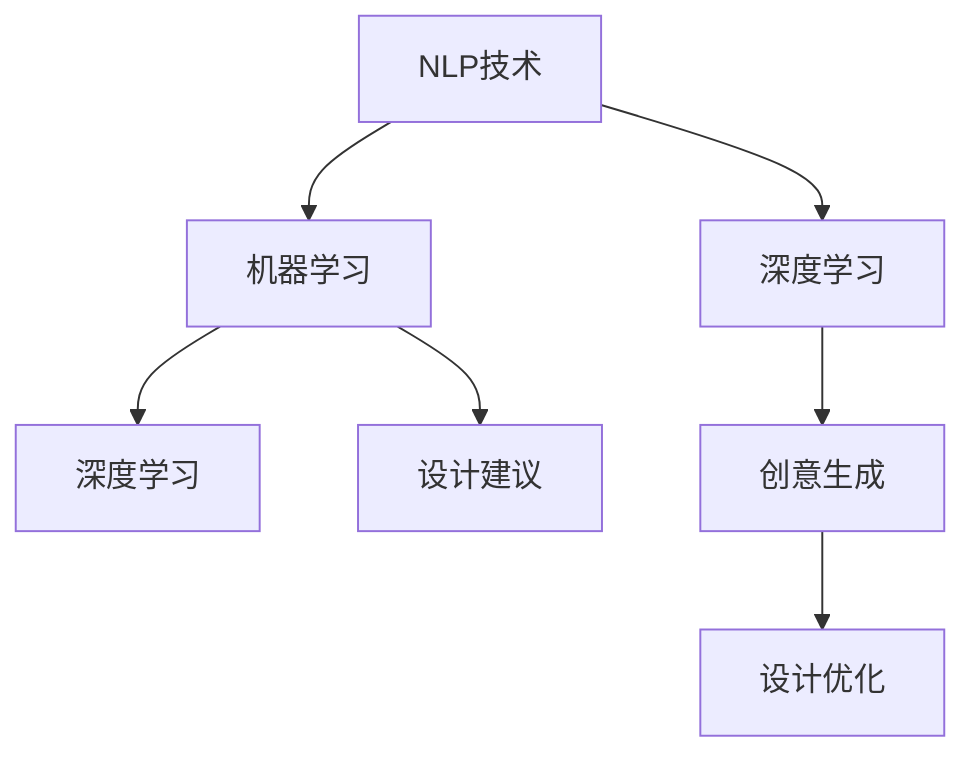

                 

### 引言

时尚设计是一个充满创意与技术的领域，它不断追求创新与突破，以满足不断变化的消费者需求和市场趋势。然而，随着时尚行业的快速发展，设计师们面临着日益增加的工作量和设计压力。在这个背景下，人工智能（AI）技术的兴起为时尚设计带来了全新的解决方案。特别是AI助手，通过利用提示词激发创意，为设计师们提供了强大的辅助工具，大大提高了设计效率和创造力。

本文旨在探讨AI助手在时尚设计中的应用，通过逻辑清晰、结构紧凑的分析，帮助读者深入了解AI助手如何通过提示词激发创意，为时尚设计带来新的灵感。文章将分为四个主要部分进行讨论：

首先，我们将概述AI助手在时尚设计中的应用场景，介绍设计师们面临的挑战以及AI助手如何解决这些问题。接着，我们将探讨AI助手的基本概念和作用，特别是提示词在其中的重要性。然后，文章将深入探讨AI助手的关键技术，包括自然语言处理（NLP）和机器学习与深度学习技术。在第三部分，我们将通过实际应用案例展示AI助手在时尚设计中的具体应用。最后，我们将讨论AI助手的设计与开发方法，并总结最佳实践，为读者提供进一步的学习和探索方向。

通过本文的阅读，读者将能够全面了解AI助手在时尚设计中的应用前景，掌握其核心技术和设计原则，并从中获得新的创意灵感。

### 背景介绍

时尚设计行业一直在不断追求创新与突破，以满足消费者不断变化的需求和市场趋势。然而，随着时尚行业的快速发展，设计师们面临着日益增加的工作量和设计压力。一方面，时尚设计具有高度的创造性和复杂性，设计师需要不断从大量信息中提取灵感，进行创意构思和设计实现。另一方面，市场对设计速度和品质的要求越来越高，设计师需要在短时间内完成从灵感到成品的设计流程。

这些挑战使得设计师们在设计过程中感到压力巨大，往往需要投入大量的时间和精力。此外，时尚设计的多样性也要求设计师具备广泛的知识和技能，从时尚历史、文化背景到材料学、工艺技术，设计师们需要不断学习和更新知识。这种综合性的要求使得设计师们的负担更加沉重。

在此背景下，人工智能（AI）技术的兴起为时尚设计带来了全新的解决方案。特别是AI助手，它能够通过自然语言处理（NLP）和机器学习等技术，为设计师们提供强大的辅助工具，帮助他们更好地应对设计过程中的各种挑战。

AI助手在时尚设计中的应用主要体现在以下几个方面：

首先，AI助手能够通过分析和处理大量的设计数据，帮助设计师快速获取灵感和创意。设计师们可以输入关键词或描述，AI助手会根据这些信息生成相关的设计方案，从而大大提高设计效率。

其次，AI助手可以协助设计师进行设计优化和调整。通过机器学习算法，AI助手可以分析大量历史设计数据，为设计师提供优化建议，帮助他们改进设计，提升设计的质量和独特性。

此外，AI助手还可以协助设计师进行市场研究和趋势预测。通过分析社交媒体、电商平台等数据，AI助手可以识别出当前市场的流行趋势和消费者偏好，为设计师提供有针对性的设计建议。

总之，AI助手在时尚设计中的应用，不仅能够帮助设计师们减轻工作负担，提高设计效率，还能够激发他们的创意灵感，为时尚设计带来新的突破。通过本文的后续讨论，我们将进一步深入探讨AI助手的核心技术及其在时尚设计中的实际应用。

### 核心概念与联系

在探讨AI助手如何通过提示词激发创意之前，我们需要理解几个核心概念，包括自然语言处理（NLP）、机器学习和深度学习。这些概念在AI助手的运作中起着至关重要的作用，它们之间存在着紧密的联系和相互促进的关系。

**自然语言处理（NLP）** 是AI的一个子领域，主要研究如何使计算机理解和处理人类语言。在AI助手的应用中，NLP技术被用来解析和理解用户输入的文本信息，如关键词、描述或问题。NLP的关键任务包括文本分类、命名实体识别、情感分析和机器翻译等。例如，当设计师输入一个设计描述时，NLP技术能够将其解析为具体的设计需求，从而为AI助手提供必要的输入信息。

**机器学习（ML）** 是一种通过数据训练模型来改进性能的技术。在AI助手的背景下，机器学习被用于构建能够从数据中学习和提取知识的应用。机器学习算法，如线性回归、决策树、随机森林和神经网络等，通过分析大量的设计数据和用户反馈，可以不断优化AI助手的性能，使其更准确地理解用户意图和提供相关的设计建议。

**深度学习（DL）** 是机器学习的一个分支，它利用神经网络模拟人脑的神经元结构和工作机制，通过多层网络结构来提取数据的深层次特征。在AI助手的任务中，深度学习被广泛应用于图像识别、语音识别和自然语言处理等领域。深度学习模型，如卷积神经网络（CNN）和循环神经网络（RNN），能够处理复杂的文本数据和设计图像，从而为AI助手提供更强大的分析和生成能力。

这些核心概念之间的联系和相互作用如下：

1. **NLP与ML的关联**：
   - NLP技术提供了理解和处理人类语言的基础，而机器学习算法则利用NLP技术解析的数据进行训练，以改进模型的性能。
   - 通过NLP技术，AI助手可以获取用户的输入，并使用机器学习算法来分析这些输入，提取有用的信息，从而为用户提供有价值的设计建议。

2. **DL与ML的融合**：
   - 深度学习作为机器学习的一个高级分支，能够处理大规模、复杂的文本和图像数据，从而提高AI助手的分析和生成能力。
   - 深度学习模型，如卷积神经网络（CNN）和递归神经网络（RNN），可以在设计数据和用户反馈中自动学习复杂的模式，为AI助手提供更精确的预测和更丰富的创意生成。

3. **NLP与DL的结合**：
   - NLP技术为深度学习模型提供了数据输入和理解的基础，而深度学习模型则利用NLP技术提取的文本特征进行更高层次的语义理解和生成。
   - 例如，在时尚设计应用中，NLP技术可以提取用户的设计描述，而深度学习模型则可以生成与这些描述相关联的创意设计方案。

**Mermaid流程图**：

下面是一个简单的Mermaid流程图，展示了这些核心概念之间的联系：



在这个流程图中，NLP技术作为AI助手的基础，负责理解和解析用户的输入。机器学习算法和深度学习模型则利用这些输入数据进行训练和分析，为AI助手提供设计建议和创意生成能力。最终，这些能力共同作用于设计优化和创意生成，为时尚设计师提供强大的辅助工具。

通过理解这些核心概念及其相互关系，我们可以更好地理解AI助手如何通过提示词激发创意，从而为时尚设计带来新的突破。在接下来的部分，我们将进一步探讨提示词的具体作用和AI助手的设计原则。

### AI助手的基本概念与作用

AI助手是一种结合人工智能技术，特别是自然语言处理（NLP）和机器学习（ML）与深度学习（DL），以辅助人类完成特定任务的智能系统。在时尚设计领域，AI助手主要通过处理和解析设计师的输入信息，生成相关的设计建议和创意方案，从而帮助设计师提高工作效率和创造力。

#### 提示词的概念

提示词（Prompt）是用户输入给AI助手的一段文字或指令，它通常包含用户的需求、意图或问题。在时尚设计应用中，提示词可以是设计师提供的具体设计描述，如“设计一款具有现代感的春季连衣裙”，也可以是设计师想要实现的效果，如“创造出一种时尚而简约的感觉”。

#### 提示词的类型

根据用途和形式，提示词可以分为以下几类：

1. **描述性提示词**：这类提示词通常用来描述设计需求或目标，如“设计一款具有未来感的运动鞋”。

2. **问题性提示词**：这类提示词以问题的形式出现，用于引导AI助手进行特定的分析和生成任务，如“如何将复古元素融入现代服装设计？”

3. **指令性提示词**：这类提示词提供了具体的任务指令，如“生成10个关于简约风格的设计方案”。

4. **混合型提示词**：这类提示词结合了描述性、问题性和指令性元素，提供更全面的设计信息和任务要求，如“设计一款具有复古感和未来感，适合春夏季的连衣裙，并生成5个设计方案”。

#### 提示词在AI助手中的作用

提示词在AI助手的运作中起着至关重要的作用，主要体现在以下几个方面：

1. **信息输入**：提示词是AI助手获取用户需求和信息的主要途径。通过分析提示词，AI助手能够理解用户的具体需求，从而生成相关的设计建议。

2. **任务引导**：提示词为AI助手提供了任务目标和方向。例如，当用户输入“设计一款具有未来感的运动鞋”时，AI助手会围绕这一主题进行设计和创意生成。

3. **交互增强**：提示词不仅用于初始的信息输入，还可以在AI助手的后续交互过程中使用，以增强用户的体验。例如，设计师可以不断提供提示词，与AI助手进行对话，以细化设计需求和获取更多建议。

4. **创意激发**：通过分析提示词中的关键信息和设计需求，AI助手能够生成新的创意方案，为设计师提供灵感和参考。例如，当设计师输入“将复古元素融入现代服装设计”时，AI助手可以生成一系列结合复古与现代元素的设计方案。

#### 提示词在时尚设计中的应用实例

以下是一些提示词在时尚设计中的具体应用实例：

1. **设计描述**：“设计一款具有现代感的春季连衣裙，面料以轻盈的丝绸为主，颜色以淡雅的粉色和绿色为主调。”

2. **问题引导**：“如何将未来感元素融入运动鞋的设计中，使其既时尚又具有功能性？”

3. **指令生成**：“生成10个关于简约风格的设计方案，包括服装、鞋履和配饰。”

4. **混合型提示**：“设计一款结合复古和未来感的夏季套装，包含连衣裙、短裤和帽子，要求整体风格时尚而不失独特性。”

通过这些实例，我们可以看到提示词在时尚设计中的应用如何帮助AI助手理解用户需求、引导设计方向、增强交互体验和激发创意。

总之，提示词是AI助手在时尚设计中的核心输入和引导工具。通过合理设计和使用提示词，AI助手能够为设计师提供更精准、更有创造力的设计建议，从而推动时尚设计的创新与发展。在接下来的部分，我们将深入探讨AI助手的设计原则，进一步理解如何优化其功能和应用效果。

### AI助手的设计原则

为了确保AI助手能够在时尚设计领域发挥最佳效果，其设计原则必须综合考虑用户体验、交互设计、以及技术实现等多个方面。以下是一些关键的设计原则，这些原则有助于打造一个高效、易用且能够激发创意的AI助手。

#### 用户体验优先

用户体验是AI助手设计的核心原则之一。一个优秀的AI助手应该具备以下特点：

1. **简洁性**：界面设计应简洁直观，避免过多的复杂功能和冗余信息，确保设计师能够快速上手并高效使用。

2. **易用性**：操作流程应简洁明了，用户能够轻松输入提示词并获取设计建议。此外，AI助手应提供清晰且及时的反馈，帮助用户理解建议的背景和依据。

3. **个性化**：根据用户的历史使用数据和偏好，AI助手应能够提供个性化的设计建议，从而提高用户的满意度。

4. **灵活性**：AI助手应具备一定的灵活性，允许用户自定义提示词格式和设计需求，以满足不同的设计场景和需求。

#### 交互设计原则

交互设计是AI助手设计的重要组成部分，直接影响用户体验。以下是一些关键的交互设计原则：

1. **一致性**：界面设计应保持一致性，包括颜色、字体、图标和布局等，以确保用户在不同功能和页面之间能够轻松切换。

2. **响应性**：AI助手应具备快速响应的能力，确保用户输入提示词后能够迅速收到设计建议，从而提高用户的互动体验。

3. **对话式交互**：通过对话式交互，用户可以与AI助手进行自然、流畅的交流。这种交互方式有助于增强用户的参与感和互动体验。

4. **错误处理**：AI助手应具备良好的错误处理机制，当用户输入不明确的提示词或出现问题时，能够提供明确的提示和解决方案。

#### 技术实现方面

在技术实现方面，AI助手的设计应注重以下几个方面：

1. **高效算法**：选择高效的算法和模型，如深度学习和自然语言处理技术，以确保AI助手能够在短时间内处理大量数据并生成高质量的设计建议。

2. **可扩展性**：设计时应考虑到系统的可扩展性，以便在未来能够轻松添加新功能和模型。

3. **数据管理**：合理管理用户数据，确保数据的隐私和安全，遵守相关法规和标准。

4. **错误检测与恢复**：在AI助手的设计中，应包括错误检测和恢复机制，以应对可能出现的技术故障或数据异常。

#### 持续优化与反馈

AI助手的设计是一个持续迭代的过程。以下是一些关键步骤：

1. **用户反馈**：积极收集用户反馈，了解他们在使用AI助手时的痛点和需求，并根据反馈进行优化。

2. **性能监控**：定期监控AI助手的性能指标，如响应时间、准确性、用户满意度等，以确保系统始终保持高效和稳定。

3. **迭代更新**：根据用户反馈和性能监控结果，不断更新和优化AI助手的功能和算法，以适应不断变化的设计需求和市场趋势。

通过遵循上述设计原则，AI助手能够更好地满足设计师的需求，提升他们的设计效率和创造力。在接下来的部分，我们将深入探讨AI助手的设计流程，从初步设计到实际实现，详细讲解每个关键步骤。

### AI助手的设计流程

设计一个高效的AI助手是一个复杂的过程，涉及多个阶段，包括需求分析、功能规划、原型设计、开发实现和测试评估。以下将详细阐述这些阶段，以便更好地理解AI助手的设计流程。

#### 需求分析

需求分析是设计过程的起点，其主要目标是明确用户的需求和期望。在这一阶段，设计团队需要与潜在用户（即时尚设计师）进行深入交流，了解他们的工作流程、常见问题、需求期望以及他们在使用现有工具时遇到的困难。

1. **用户访谈**：通过与设计师进行面对面访谈或问卷调查，收集他们的意见和建议。这些问题可能包括：
   - 设计师在当前工作流程中遇到的最大挑战是什么？
   - 他们希望AI助手能提供哪些功能？
   - 他们对AI助手的用户界面有何期望？
   - 设计师在创意生成过程中需要哪些辅助工具？

2. **数据分析**：分析现有的设计数据和用户反馈，了解设计师的工作习惯和偏好。例如，通过分析设计师使用的关键词和设计风格，可以更好地理解他们的需求。

3. **需求文档**：根据访谈和数据分析结果，编写详细的需求文档，明确AI助手的目标用户、功能需求、性能指标和设计目标。需求文档应包含以下内容：
   - 用户角色和场景
   - 功能需求列表
   - 用户界面和交互设计要求
   - 系统性能指标和可扩展性要求

#### 功能规划

在需求分析的基础上，进行功能规划，确定AI助手的模块和功能。这一阶段的目标是确保AI助手能够满足设计师的具体需求，同时保持系统的高效性和易用性。

1. **模块划分**：根据需求文档，将AI助手划分为多个模块，如自然语言处理模块、机器学习模块、用户界面模块等。每个模块负责特定的功能，便于后续开发和维护。

2. **功能优先级**：确定各个模块的优先级，确保在资源有限的情况下，优先实现核心功能。例如，自然语言处理和设计建议生成模块应优先开发，而一些可选功能则可以延迟实现。

3. **技术选型**：根据功能需求，选择合适的技术和工具。例如，在自然语言处理方面，可以选择使用BERT或GPT-3等先进的语言模型；在机器学习方面，可以使用TensorFlow或PyTorch等深度学习框架。

#### 原型设计

原型设计阶段旨在创建一个可交互的AI助手原型，通过迭代和反馈来不断改进设计。以下是一些关键步骤：

1. **低保真原型**：使用简单的工具（如PowerPoint或Sketch）创建低保真原型，明确用户界面布局、主要功能和交互逻辑。这一阶段的目标是快速验证设计概念，而不需投入过多资源。

2. **高保真原型**：在低保真原型的基础上，创建高保真原型，使用更详细的设计元素和交互效果。高保真原型应接近最终产品的外观和功能，以便进行更详细的用户测试。

3. **用户测试**：邀请设计师对高保真原型进行测试，收集他们的反馈和建议。用户测试可以帮助识别潜在问题，改进界面和交互设计。

4. **迭代优化**：根据用户反馈，对原型进行多次迭代和优化，确保设计符合设计师的需求和期望。

#### 开发实现

在原型设计阶段确认设计方案后，进入开发实现阶段。这一阶段包括以下步骤：

1. **编码与集成**：根据功能规划和原型设计，编写代码并实现各个模块。确保各个模块之间能够无缝集成，实现整体功能。

2. **数据预处理**：收集和预处理用于训练AI助手的自然语言处理模型和机器学习模型的数据集。数据预处理包括数据清洗、数据标注和特征提取等步骤。

3. **模型训练与优化**：使用收集的数据集对自然语言处理模型和机器学习模型进行训练。通过多次迭代和优化，提高模型的准确性和效率。

4. **系统集成与测试**：将各个模块集成到完整的AI助手系统中，并进行全面的测试。测试内容包括功能测试、性能测试和用户体验测试，确保系统稳定可靠。

#### 测试评估

测试评估阶段旨在确保AI助手的性能和稳定性，并为未来的迭代和优化提供依据。以下是一些关键步骤：

1. **功能测试**：验证AI助手的所有功能是否按预期工作，包括自然语言处理、设计建议生成、用户界面交互等。

2. **性能测试**：评估AI助手的响应时间、资源消耗和扩展性。确保系统在高负载和复杂场景下仍能保持高效和稳定。

3. **用户体验测试**：邀请设计师和用户对AI助手进行测试，收集他们的使用体验和反馈。通过用户体验测试，可以发现潜在的改进点和优化方向。

4. **迭代与优化**：根据测试结果，对AI助手进行优化和改进。这是一个持续的过程，旨在不断提升AI助手的性能和用户体验。

通过上述设计流程，AI助手能够从需求分析到实际实现，逐步完善和优化，最终为时尚设计师提供强大、高效的创意辅助工具。在下一个部分，我们将深入探讨AI助手的关键技术，特别是自然语言处理（NLP）和机器学习与深度学习技术，这些技术是AI助手实现其功能的核心。

### 自然语言处理（NLP）技术基础

自然语言处理（NLP）是人工智能（AI）的一个重要分支，它致力于使计算机能够理解和生成人类语言。在AI助手的语境中，NLP技术主要用于处理和理解用户输入的提示词，从而生成相关的创意设计建议。本节将详细探讨NLP的基本概念、常见任务和技术，并展示这些技术在AI助手中的应用。

#### NLP的基本概念

NLP的核心目标是理解、生成和交互处理自然语言。以下是NLP中的几个关键概念：

1. **文本预处理**：文本预处理是NLP的基础步骤，包括去除标点符号、转换大小写、去除停用词等。这些步骤有助于简化文本，使其更适合后续处理。

2. **词向量表示**：词向量是将单词映射到高维空间中的向量表示，用于捕捉单词的语义信息。常见的词向量模型包括Word2Vec、GloVe等。

3. **语法分析**：语法分析是一种对文本进行结构化处理的方法，旨在理解句子的语法结构。常用的语法分析方法包括分词、句法解析和依赖分析。

4. **语义理解**：语义理解是指理解单词、句子或段落的意义。这包括词义消歧、情感分析、指代消解和实体识别等任务。

5. **对话系统**：对话系统是一种能够与人类用户进行自然语言交互的系统，包括语音助手、聊天机器人等。

#### 常见NLP任务

NLP涵盖了多个常见任务，以下是一些重要的NLP任务：

1. **文本分类**：文本分类是将文本数据分配到预定义的类别中。常见的应用场景包括垃圾邮件检测、情感分析和新闻分类。

2. **命名实体识别（NER）**：命名实体识别是识别文本中的特定实体（如人名、地名、组织名等）。NER是许多复杂任务的基础，如问答系统和信息提取。

3. **情感分析**：情感分析是评估文本中的情感倾向，如正面、负面或中性。它广泛应用于社交媒体分析、市场研究和客户反馈分析。

4. **机器翻译**：机器翻译是将一种自然语言文本转换为另一种自然语言。这一任务对跨语言沟通和全球化具有重要意义。

5. **问答系统**：问答系统是一种能够回答用户问题的系统，通常涉及自然语言理解和生成。

#### NLP技术在AI助手中的应用

在AI助手的背景下，NLP技术被广泛应用于以下几个方面：

1. **提示词处理**：AI助手首先需要理解用户的输入，即提示词。NLP技术，如词向量表示和语法分析，可以帮助AI助手解析输入的文本，提取关键信息。

2. **设计建议生成**：一旦AI助手理解了提示词，它可以生成相关的设计建议。这通常涉及文本分类、命名实体识别和语义理解等任务。例如，当用户输入“设计一款具有未来感的运动鞋”时，AI助手可以利用NLP技术识别出“未来感”这一关键词，并生成相关的设计方案。

3. **对话式交互**：AI助手通常与用户进行对话式交互，以提供更个性化的设计建议。NLP技术，如对话管理和语义理解，可以确保AI助手能够理解用户的意图，并根据用户的反馈进行适时的调整。

#### 示例：设计建议生成中的NLP技术

以下是一个简化的NLP流程，展示如何在AI助手中生成设计建议：

```plaintext
# 输入提示词
提示词: "设计一款具有未来感的运动鞋"

# 文本预处理
预处理后文本: "设计一款具有未来感的运动鞋。"

# 词向量表示
词向量: ["设计", "一款", "具有", "未来感", "的", "运动鞋"]

# 命名实体识别
命名实体: ["未来感"]

# 语义理解
语义描述: "设计一款具有未来风格和科技感的运动鞋。"

# 设计建议生成
设计建议1: "采用流线型设计，结合金属质感材质，营造出未来感。"
设计建议2: "运用LED灯带，设计出独特的灯光效果，增强运动鞋的科技感。"
```

通过上述步骤，AI助手能够根据用户输入的提示词生成具有未来感的设计建议，从而帮助设计师实现他们的创意构想。

总之，NLP技术在AI助手的应用中起到了关键作用。通过词向量表示、语法分析和语义理解等NLP任务，AI助手能够更好地理解用户的意图和需求，生成高质量的设计建议，从而为时尚设计师提供强大的创意辅助工具。在下一部分，我们将深入探讨机器学习与深度学习在AI助手中的应用。

### 机器学习与深度学习在AI助手中的应用

机器学习和深度学习是AI助手中至关重要的技术，它们为AI助手提供了强大的数据处理和智能分析能力。在本节中，我们将详细介绍机器学习与深度学习的基本概念，探讨这些技术在AI助手中的应用，并通过具体的案例展示其优势。

#### 机器学习基础

机器学习（ML）是一种通过数据训练模型以改进性能的技术。在机器学习中，算法通过学习大量数据中的模式和规律，从而能够对新的数据进行预测或分类。以下是几种常见的机器学习算法：

1. **线性回归**：线性回归是一种用于预测数值型结果的算法，通过找到最佳拟合直线来预测输出值。

2. **决策树**：决策树是一种树形结构，通过一系列的决策规则来对数据进行分类或回归。

3. **随机森林**：随机森林是一种集成学习方法，通过构建多个决策树，并汇总这些树的预测结果来提高预测准确性。

4. **支持向量机（SVM）**：SVM是一种用于分类和回归的算法，通过找到一个最佳的超平面来分隔不同类别的数据。

5. **神经网络**：神经网络是一种模拟人脑神经元结构的计算模型，通过多层网络结构来提取数据的深层次特征。

#### 深度学习基础

深度学习（DL）是机器学习的一个高级分支，它利用神经网络模拟人脑的神经元结构和工作机制。深度学习通过多层网络结构（即深度神经网络）来提取数据的深层次特征，从而实现复杂的数据处理和模式识别任务。以下是几种常见的深度学习模型：

1. **卷积神经网络（CNN）**：CNN是一种用于图像识别和处理的深度学习模型，通过卷积层和池化层来提取图像的局部特征。

2. **递归神经网络（RNN）**：RNN是一种用于处理序列数据的深度学习模型，通过循环结构来捕捉序列中的时间依赖关系。

3. **长短时记忆网络（LSTM）**：LSTM是RNN的一种变体，通过引入门控机制来更好地处理长序列数据。

4. **生成对抗网络（GAN）**：GAN是一种由两个神经网络（生成器和判别器）对抗训练的模型，用于生成高质量的数据。

#### 机器学习与深度学习在AI助手中的应用

机器学习和深度学习在AI助手中有着广泛的应用，以下是几个关键应用领域：

1. **自然语言处理**：机器学习和深度学习在NLP中发挥着重要作用。例如，词向量模型（如Word2Vec和GloVe）用于表示单词的语义信息，而深度学习模型（如BERT和GPT-3）则用于理解和生成自然语言。

2. **图像识别**：AI助手可以通过机器学习和深度学习技术处理和识别图像。例如，CNN用于识别设计图像中的风格和元素，从而为设计师提供相关的设计建议。

3. **数据预测**：通过机器学习和深度学习，AI助手可以预测未来的设计趋势和市场变化，帮助设计师做出更准确的设计决策。

4. **个性化推荐**：机器学习和深度学习技术可以帮助AI助手根据用户的历史数据和偏好提供个性化的设计推荐，从而提高用户满意度。

#### 案例一：设计风格分类

以下是一个关于设计风格分类的示例，展示了如何使用机器学习和深度学习技术生成设计建议。

**问题描述**：设计一个系统，根据用户提供的文本描述自动分类设计风格。

**解决方案**：

1. **数据预处理**：收集大量设计风格的文本描述，并进行预处理，如去除标点符号、停用词过滤和词向量表示。

2. **模型选择**：选择一个合适的分类模型，如随机森林或CNN。对于文本数据，可以使用文本分类算法；对于图像数据，可以使用图像分类算法。

3. **模型训练**：使用预处理后的文本描述和设计风格标签训练分类模型。对于文本分类，可以使用朴素贝叶斯、支持向量机或深度神经网络；对于图像分类，可以使用卷积神经网络。

4. **模型评估**：通过交叉验证和测试集评估模型的准确性，调整模型参数以优化性能。

5. **生成设计建议**：一旦模型训练完成，用户可以输入设计描述，模型将根据输入生成对应的设计风格分类，并提供相应的创意建议。

```plaintext
# 输入文本描述
描述: "这款服装设计采用了流线型的剪裁，结合了现代和古典的元素，营造出一种优雅而时尚的感觉。"

# 模型预测
预测结果: "现代古典风格"

# 设计建议
建议: "考虑使用柔软的面料，如丝绸或棉麻，并采用精致的细节装饰，以增强设计的优雅感。"
```

通过上述案例，我们可以看到机器学习和深度学习在AI助手中的应用如何帮助设计师生成高质量的设计建议，从而提高设计效率和创意水平。

总之，机器学习和深度学习为AI助手提供了强大的数据处理和分析能力，使其能够更好地理解和生成与用户需求相关的设计建议。通过结合自然语言处理和图像识别技术，AI助手能够为时尚设计师提供全方位的创意辅助，推动时尚设计的创新与发展。

### AI助手在时尚设计中的实际应用

AI助手在时尚设计中的应用已经逐渐显现出其巨大的潜力，通过具体案例，我们可以更好地理解AI助手如何通过其独特的功能为时尚设计师提供支持。

#### 案例一：设计师辅助工具

**背景介绍**：设计师辅助工具是AI助手在时尚设计中的典型应用之一。这类工具旨在帮助设计师从灵感到成品的设计过程，通过自动化和智能化技术提升工作效率。

**功能描述**：设计师辅助工具通常具备以下功能：
- **灵感和创意生成**：通过自然语言处理技术，AI助手可以分析设计师的描述，并生成相关的灵感和创意设计方案。例如，设计师输入“设计一款夏季连衣裙”，AI助手可以生成多种设计样式、面料选择和色彩搭配。
- **设计优化**：AI助手可以分析设计师的历史设计数据，提供优化建议。例如，通过机器学习算法，AI助手可以识别出设计师常用的设计元素，并推荐新的改进方案。
- **趋势预测**：AI助手通过分析市场数据和社会媒体趋势，预测未来可能流行的设计风格和元素，帮助设计师提前布局。

**实际应用**：例如，某个时尚品牌的设计师团队在推出新系列时，使用AI助手生成了一系列连衣裙设计。设计师输入了“夏季轻奢风”的描述，AI助手迅速生成多个方案，包括设计草图、面料选择和色彩搭配。设计师根据这些方案进行选择和优化，最终设计出符合市场需求的新系列连衣裙。

#### 案例二：时尚趋势预测

**背景介绍**：时尚趋势预测是时尚设计中至关重要的环节，它决定了设计师的创意方向和市场竞争力。

**功能描述**：AI助手通过分析大量数据，如社交媒体趋势、电商平台销售数据和时尚杂志内容，预测未来的流行趋势。
- **数据收集**：AI助手从社交媒体、电商平台和时尚媒体等渠道收集数据。
- **数据分析**：AI助手使用自然语言处理和机器学习技术，对收集的数据进行分类和分析，识别出可能的流行趋势。
- **可视化展示**：AI助手将分析结果可视化展示，提供详细的趋势报告和预测图表，帮助设计师了解市场动向。

**实际应用**：例如，一个时尚品牌使用AI助手预测下一季的流行趋势。AI助手分析了大量的社交媒体内容，如Instagram上的时尚博主穿搭、Pinterest上的用户收藏和TikTok上的热门视频，通过自然语言处理技术提取出关键词和趋势元素。最终，AI助手生成了一份详细的趋势报告，包括流行的颜色、图案和设计风格。设计师根据这份报告调整了他们的设计方向，成功推出了深受市场欢迎的新系列。

#### 案例三：个性化时尚推荐系统

**背景介绍**：在个性化推荐系统中，AI助手通过分析用户的偏好和行为数据，提供个性化的设计推荐。

**功能描述**：AI助手具备以下功能：
- **用户行为分析**：AI助手通过分析用户的浏览记录、购买历史和社交媒体互动，了解用户的偏好。
- **推荐算法**：AI助手使用机器学习和深度学习算法，根据用户的行为数据生成个性化的设计推荐。
- **交互式推荐**：用户可以与AI助手进行互动，反馈对推荐的设计的喜好，AI助手根据反馈进行进一步的个性化调整。

**实际应用**：例如，一个在线时尚电商平台使用AI助手为用户推荐商品。用户在浏览网站时，AI助手会记录下用户的喜好和搜索历史。当用户浏览到某个商品时，AI助手会根据用户的偏好和相似商品推荐更多相关的设计。用户可以通过点击“喜欢”或“不喜欢”来反馈推荐结果，AI助手根据反馈调整推荐策略，进一步提高推荐的相关性和用户满意度。

通过这些具体案例，我们可以看到AI助手在时尚设计中的应用如何帮助设计师提高效率、捕捉市场趋势和满足用户个性化需求。AI助手不仅为设计师提供了强大的辅助工具，还激发了他们的创意灵感，推动了时尚设计的创新与发展。

### 时尚设计与AI技术的未来展望

随着人工智能（AI）技术的不断发展，时尚设计与AI技术的融合将进一步深化，带来一系列革命性的变革。在未来的发展中，AI技术不仅将在设计创意生成、设计优化和市场预测等方面发挥更大作用，还将推动时尚设计师与AI助手之间的合作模式产生根本性变化。

#### AI技术在时尚设计中的未来趋势

1. **个性化设计**：随着消费者对个性化需求的日益增加，AI技术将在个性化设计方面发挥重要作用。通过机器学习和深度学习算法，AI助手可以分析用户的历史数据和偏好，生成高度个性化的设计方案。未来，消费者甚至可以通过AI助手直接参与设计过程，实时调整设计方案，满足其个性化的审美和风格需求。

2. **设计优化**：AI技术将通过自动化和智能化的方式，显著提高设计优化的效率和效果。例如，通过机器学习算法，AI助手可以分析大量历史设计数据，预测出最优的设计方案。此外，AI助手还可以通过模拟和仿真技术，帮助设计师评估不同设计方案的可行性和效果，从而降低设计风险。

3. **快速响应**：随着市场变化速度的加快，设计师需要能够迅速响应市场趋势。AI助手通过实时分析市场数据和社会媒体趋势，可以快速生成符合市场需求的时尚设计，帮助品牌抓住市场机遇。

4. **可持续发展**：AI技术在时尚设计中的另一个重要趋势是推动可持续发展。通过智能分析和优化，AI助手可以帮助设计师减少浪费、提高材料利用率，从而降低时尚产业的环境影响。

#### AI助手在时尚设计中的应用前景

1. **创意激发**：AI助手将成为设计师的灵感来源，通过自然语言处理和图像识别技术，AI助手可以分析用户的需求和设计趋势，生成创新的设计方案。未来，AI助手不仅能够提供多样化的设计建议，还可以根据用户反馈进行不断学习和改进，为设计师提供更精准的创意支持。

2. **协同设计**：AI助手将不仅仅是设计师的工具，而是成为设计师的合作伙伴。通过实时交互和协同设计，设计师和AI助手可以共同探讨和优化设计方案，提高设计效率和创意水平。

3. **智能营销**：AI助手可以通过分析用户行为和市场数据，为设计师提供智能化的营销策略。例如，AI助手可以生成个性化的广告内容，提高品牌的市场曝光率和用户转化率。

#### 时尚设计师与AI助手的合作模式

1. **协作式设计**：未来，时尚设计师与AI助手的合作模式将更加紧密，设计师将更多地依赖AI助手进行设计灵感的生成和优化。在这种模式下，设计师将专注于创意构思和艺术表达，而AI助手则负责数据处理和设计实现。

2. **共享价值**：AI助手将不仅仅是设计师的工具，还将成为设计师和品牌之间的桥梁。通过AI助手，设计师可以更快速地了解市场需求和用户偏好，从而提供更符合市场期待的设计。

3. **技能提升**：随着AI技术的普及，设计师的技能需求也将发生变化。未来，设计师不仅需要掌握传统的设计技能，还需要具备一定的编程和数据分析能力，以更好地与AI助手进行协作。

总之，AI技术在时尚设计中的应用前景广阔，它将为设计师提供前所未有的创意支持和设计工具，推动时尚设计的创新与发展。通过不断探索和优化AI助手的性能和应用，设计师将能够更好地应对市场的挑战，实现设计的可持续发展。随着AI技术的进一步发展，未来时尚设计行业将迎来一个充满活力和变革的新时代。

### AI助手设计与开发的工具与方法

要设计和开发一个高效且易于使用的AI助手，选择合适的开发工具和平台至关重要。以下将介绍几种常用的AI开发工具和平台，详细说明自然语言处理（NLP）工具、深度学习框架与库的选择，并提供具体的开发流程和步骤。

#### 开发工具和平台

1. **NLP工具**：
   - **spaCy**：spaCy是一个流行的Python库，提供了一套完整的NLP工具，包括词性标注、命名实体识别、依存句法分析等。spaCy的API简单易用，且具有高性能。
   - **NLTK**：NLTK（自然语言工具包）是另一个常用的Python库，提供了广泛的文本处理功能，如分词、词干提取、词形还原等。NLTK适用于研究和开发小型NLP项目。

2. **深度学习框架与库**：
   - **TensorFlow**：TensorFlow是一个开源的深度学习框架，由谷歌开发。它提供了丰富的API，支持多种深度学习模型，适用于从简单到复杂的NLP任务。
   - **PyTorch**：PyTorch是一个流行的深度学习库，以其动态计算图和灵活的API而闻名。PyTorch在研究社区中广泛使用，适用于需要快速原型设计和实验的场景。
   - **Transformers**：Transformers库是自然语言处理领域的革命性工具，基于谷歌的BERT模型。它提供了预训练的模型和强大的API，可以用于生成文本、问答系统等任务。

#### 开发流程与步骤

1. **需求分析与设计**：
   - 分析用户需求，确定AI助手的功能和性能要求。
   - 设计系统架构，包括前端用户界面、后端API和服务、数据处理模块等。

2. **数据准备与预处理**：
   - 收集相关的设计数据和用户反馈，进行数据清洗和预处理，如去除停用词、进行词向量表示等。
   - 划分训练集、验证集和测试集，确保数据集的平衡性和代表性。

3. **模型选择与训练**：
   - 根据任务需求选择合适的深度学习模型，如BERT、GPT-3或自定义模型。
   - 使用深度学习框架（如TensorFlow或PyTorch）训练模型，调整超参数以优化性能。
   - 进行模型评估和调优，确保模型在验证集上的性能达到预期。

4. **系统集成与测试**：
   - 将训练好的模型集成到AI助手系统中，确保各模块之间的无缝连接。
   - 进行系统测试，包括功能测试、性能测试和用户体验测试，确保系统的稳定性和可靠性。

5. **部署与维护**：
   - 将AI助手部署到生产环境，确保其能够高效地处理用户请求。
   - 定期监控和更新AI助手，根据用户反馈和性能数据不断优化系统。

#### 代码示例

以下是一个简单的TensorFlow代码示例，展示了如何使用BERT模型进行文本分类：

```python
import tensorflow as tf
import tensorflow_hub as hub
from tensorflow.keras.models import Model
from tensorflow.keras.layers import Input, Dense, GlobalAveragePooling1D

# 加载BERT模型
bert_layer = hub.KerasLayer("https://tfhub.dev/google/bert_uncased_L-12_H-768_A-12/4", trainable=True)

# 输入层
input_ids = Input(shape=(None,), dtype=tf.int32, name="input_ids")
input_mask = Input(shape=(None,), dtype=tf.int32, name="input_mask")
segment_ids = Input(shape=(None,), dtype=tf.int32, name="segment_ids")

# 通过BERT层处理输入文本
output = bert_layer([input_ids, input_mask, segment_ids])

# 平均池化层
output = GlobalAveragePooling1D()(output)

# 密集层
output = Dense(768, activation="relu")(output)

# 输出层
predictions = Dense(2, activation="softmax", name="predictions")(output)

# 构建模型
model = Model(inputs=[input_ids, input_mask, segment_ids], outputs=predictions)

# 编译模型
model.compile(optimizer="adam", loss="categorical_crossentropy", metrics=["accuracy"])

# 训练模型
model.fit([train_input_ids, train_input_mask, train_segment_ids], train_labels, epochs=3, validation_split=0.1)
```

通过上述工具和方法的介绍，我们可以看到设计和开发AI助手的过程是如何从需求分析、模型选择到最终部署的。通过合理选择和利用这些工具，设计师和开发者可以更高效地构建和优化AI助手，为时尚设计师提供强大的创意支持。

### 总结与最佳实践

在本篇文章中，我们详细探讨了AI助手在时尚设计中的应用，包括其基本概念、设计原则、关键技术以及实际应用案例。通过自然语言处理（NLP）、机器学习和深度学习技术，AI助手能够有效地处理设计师的输入提示词，生成创意设计建议，优化设计流程，预测市场趋势，并为用户个性化推荐设计。

首先，我们介绍了AI助手的基本概念，包括其功能、作用和提示词的概念。然后，我们探讨了AI助手的设计原则，如用户体验优先、交互设计原则以及技术实现方面的要点。在核心技术部分，我们深入分析了NLP和机器学习与深度学习的基础知识，并展示了这些技术在AI助手中的应用。

通过实际应用案例，我们看到了AI助手在设计师辅助工具、时尚趋势预测和个性化时尚推荐系统中的具体应用。这些案例展示了AI助手如何通过其强大的数据处理和分析能力，为时尚设计师提供支持，提升他们的设计效率和创意水平。

在设计和开发AI助手时，选择合适的工具和平台至关重要。我们介绍了几种常用的NLP工具和深度学习框架，如spaCy、NLTK、TensorFlow和PyTorch，并提供了详细的开发流程和步骤。此外，通过代码示例，我们展示了如何使用BERT模型进行文本分类，进一步说明了AI助手的实现过程。

为了确保AI助手在时尚设计中的成功应用，以下是一些建议和注意事项：

1. **用户体验优先**：在设计和开发过程中，始终以用户体验为核心，确保AI助手界面简洁直观，操作流程高效，能够提供即时且准确的反馈。

2. **数据质量**：AI助手的性能很大程度上取决于训练数据的质量。因此，确保数据集的多样性和代表性，进行数据清洗和预处理，以避免噪声数据对模型的影响。

3. **持续优化**：AI助手的性能需要通过不断的迭代和优化来提升。定期收集用户反馈，监控性能指标，并根据用户需求和市场趋势进行更新。

4. **个性化与灵活性**：根据用户的历史数据和行为，提供个性化的设计建议。同时，确保AI助手能够适应不同的设计需求，提供灵活的功能和选项。

5. **安全性与隐私保护**：在设计和开发过程中，重视用户数据的安全性和隐私保护，遵守相关法律法规和标准，确保用户数据的保密性和安全性。

最后，本文提供了丰富的拓展阅读资源，包括AI助手相关的研究论文、技术书籍和在线课程，以供读者进一步学习和探索。通过不断学习和实践，设计师和开发者可以更好地利用AI技术，推动时尚设计的创新与发展。

### 拓展阅读

1. **《自然语言处理》（Natural Language Processing）** — Steven Bird, Ewan Klein, and Edward Loper。这是一本经典的NLP教材，涵盖了NLP的基本概念、技术和应用。

2. **《深度学习》（Deep Learning）** — Ian Goodfellow、Yoshua Bengio和Aaron Courville。这本书详细介绍了深度学习的基础知识、算法和实际应用，是深度学习领域的权威著作。

3. **《AI助手：设计与开发》（AI Assistants: Design and Development）** — Thomas H. Davenport和Janelle Barlow。这本书介绍了AI助手的定义、设计原则和开发方法，适合希望深入了解AI助手开发的读者。

4. **《BERT：大规模预训练语言模型的原理与实践》（BERT: Principles and Practice of Large-Scale Pre-Trained Language Models）** — Jacob Devlin、 Ming-Wei Chang、 Kenton Lee和Kai Zhao。这本书详细介绍了BERT模型的原理、实现和应用，是了解BERT模型的最佳参考书。

5. **在线课程：《自然语言处理与深度学习》（Natural Language Processing with Deep Learning）** — fast.ai。这是一个免费的在线课程，涵盖了NLP和深度学习的基础知识，适合初学者入门。

6. **在线课程：《深度学习基础》（Deep Learning Specialization）** — Andrew Ng。这是Coursera上最受欢迎的深度学习课程之一，由深度学习领域的知名专家Andrew Ng主讲。

通过这些资源和书籍，读者可以进一步深入了解自然语言处理、深度学习和AI助手的开发技术，提升自己的专业知识和实践能力。

