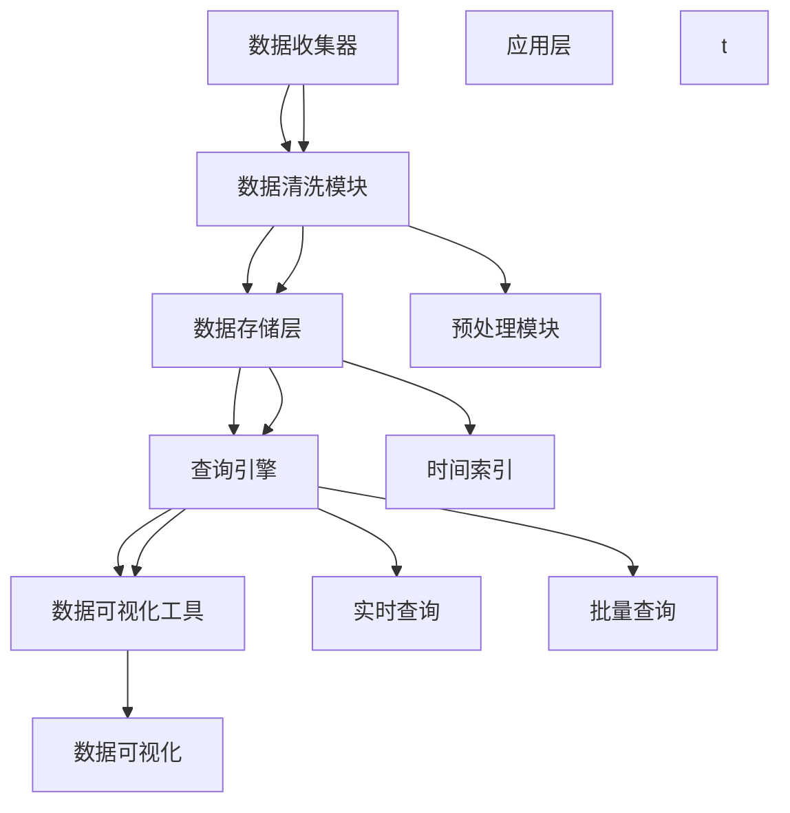

                 

### 文章标题：时序数据库设计与应用场景

#### 关键词：
- 时序数据库
- 数据库设计
- 应用场景
- 数学模型
- 算法原理

#### 摘要：
本文将深入探讨时序数据库的设计原则和应用场景。首先，我们将介绍时序数据的定义、特点和重要性。然后，通过详细的Mermaid流程图，阐述时序数据库的核心概念及其相互关系。接着，我们将讲解时序数据库的设计原则、存储与索引策略。最后，通过实际案例，展示时序数据库在金融、物流等行业的应用，并提供项目实战经验和最佳实践建议。文章将使用伪代码详细阐述核心算法原理，并使用LaTeX格式展示数学模型和公式。

## 引言

时序数据库（Time-Series Database, TSDB）是一种专门为处理时间序列数据而设计的数据库系统。随着物联网、大数据和实时分析技术的发展，时序数据库在金融、物流、能源、制造等行业中发挥着越来越重要的作用。本文旨在系统地介绍时序数据库的设计原则和应用场景，帮助读者深入理解其核心概念和实际应用。

## 时序数据的定义、特点与重要性

### 1.1 时序数据的定义

时序数据是指按照时间顺序记录的数值型数据。例如，股票价格、气象数据、设备监测数据等都属于时序数据。时序数据具有以下特点：

- **时间敏感性**：时序数据必须按照时间顺序进行记录和存储。
- **非均匀性**：时序数据的记录间隔可能不均匀，如一分钟、一小时或一天等。
- **趋势性**：时序数据往往具有长期或短期的趋势性。

### 1.2 时序数据的特点

- **时间敏感性**：时序数据必须按照时间顺序进行记录和存储，这是时序数据与其他类型数据最显著的区别。
- **非均匀性**：时序数据的记录间隔可能不均匀，如一分钟、一小时或一天等。
- **趋势性**：时序数据往往具有长期或短期的趋势性，如股票价格的上涨或下跌趋势。

### 1.3 时序数据的重要性

- **业务决策支持**：时序数据能够帮助企业和组织了解历史趋势，为未来决策提供数据支持。
- **未来趋势预测**：通过分析时序数据，可以预测未来的趋势，为产品规划、市场策略等提供依据。
- **效率与成本优化**：时序数据可以帮助企业优化资源配置，降低运营成本。

### 1.4 时序数据的挑战

- **数据存储与处理的挑战**：时序数据通常具有高维度和高频率，对存储和处理系统提出了较高的要求。
- **数据分析与预测的挑战**：时序数据的复杂性使得数据分析与预测成为一大挑战。
- **数据安全与隐私的挑战**：时序数据可能包含敏感信息，如个人隐私数据，数据安全与隐私保护是重要议题。

### 1.5 时序数据的应用领域

- **金融行业**：时序数据在金融行业的应用包括股票交易、风险管理、市场预测等。
- **物流行业**：时序数据在物流行业的应用包括运输监控、库存管理、路线优化等。
- **能源行业**：时序数据在能源行业的应用包括电力调度、能源消耗分析、预测维护等。
- **制造行业**：时序数据在制造行业的应用包括设备监控、生产优化、故障预测等。
- **其他行业**：时序数据在其他行业的应用还包括医疗健康、智能家居、交通运输等。

## 时序数据库的核心概念

### 2.1 时序数据库的定义

时序数据库是一种专门为处理时序数据而设计的数据库系统，能够高效存储、查询和分析时间序列数据。时序数据库通常具有以下特点：

- **时间序列数据结构**：时序数据库采用特殊的数据结构，如列式存储、时间索引等，以优化时序数据的存储和查询效率。
- **时间窗口查询**：时序数据库支持对时间窗口内的数据进行快速查询，如时间段内的平均温度、股票价格等。
- **高并发读写**：时序数据库需要支持高并发读写操作，以适应实时数据分析的需求。

### 2.2 时序数据库的分类

时序数据库可以根据存储方式、数据结构、算法原理等进行分类，常见的分类方法如下：

- **基于列的时序数据库**：如InfluxDB、OpenTSDB，采用列式存储结构，适合大规模时序数据的存储和查询。
- **基于文件的时序数据库**：如TimeScaleDB、TDengine，采用文件存储结构，适合存储和查询大量历史时序数据。
- **基于内存的时序数据库**：如KairosDB、TimeseriesDB，采用内存存储结构，适合实时处理和分析高频率时序数据。

### 2.3 时序数据库的架构

时序数据库的架构通常包括以下组件：

- **数据收集器**：负责收集和接收来自不同源的数据，如传感器、应用程序等。
- **数据清洗模块**：对收集到的数据进行清洗、过滤和转换，确保数据的质量和一致性。
- **数据存储层**：存储清洗后的数据，通常采用列式存储、时间索引等技术，以提高存储和查询效率。
- **查询引擎**：提供高效的查询接口，支持时间窗口查询、聚合查询等操作。
- **数据可视化工具**：将查询结果以图形化的方式展示，便于用户分析和理解时序数据。

### 核心概念与联系

以下是一个Mermaid流程图，用于展示时序数据库的核心概念及其相互关系：



## 时序数据库设计原则

### 3.1 数据库设计原则

在设计时序数据库时，应遵循以下原则：

- **可扩展性**：设计时应考虑未来数据量增长的需求，确保数据库能够灵活扩展。
- **高性能**：优化数据库的查询性能，确保实时数据的快速访问和分析。
- **数据一致性**：确保数据的准确性和一致性，避免数据丢失或错误。
- **安全性**：确保数据的安全性，防止数据泄露和未经授权的访问。

### 3.2 数据模型设计

时序数据库的数据模型设计应考虑以下方面：

- **时间序列维度**：设计时序数据的维度，如时间戳、传感器ID、设备ID等。
- **时间索引**：设计合适的时间索引，以优化查询性能。
- **数据压缩**：采用数据压缩技术，减少存储空间占用。

### 3.3 性能优化策略

以下是优化时序数据库性能的几种策略：

- **索引优化**：设计合适的时间索引，如B+树索引、哈希索引等。
- **数据分区**：将数据按时间或传感器进行分区，以提高查询效率。
- **批量处理**：采用批量处理技术，减少单次操作的时间开销。
- **缓存策略**：采用缓存策略，减少磁盘I/O操作，提高查询响应速度。

### 3.4 存储策略

时序数据库的存储策略应考虑以下方面：

- **列式存储**：采用列式存储结构，提高查询性能。
- **压缩存储**：采用压缩存储技术，减少存储空间占用。
- **数据冷热分离**：将冷数据和热数据分离存储，优化存储性能。

## 时序数据的存储与索引

### 4.1 存储引擎选择

选择合适的存储引擎是时序数据库设计的关键。以下是一些常见的存储引擎及其特点：

- **InnoDB**：支持事务、行级锁定，适用于高并发场景。
- **MyISAM**：不支持事务、表级锁定，适用于读多写少场景。
- **Memory**：数据存储在内存中，查询速度快，但数据重启后丢失。
- **TokuDB**：支持事务、行级锁定，提供压缩存储功能。

### 4.2 索引策略

时序数据库的索引策略对查询性能至关重要。以下是一些常见的索引策略：

- **时间索引**：使用B+树索引，按时间戳进行索引，优化时间查询。
- **哈希索引**：适用于快速查找特定值，但不太适合范围查询。
- **辅助索引**：为特定查询创建的索引，如设备ID索引、传感器ID索引等。

### 4.3 存储与索引的优化

优化时序数据库的存储与索引，可以采用以下策略：

- **数据压缩**：采用数据压缩技术，减少存储空间占用。
- **索引优化**：定期维护索引，删除冗余索引，优化查询性能。
- **数据分区**：将数据按时间或传感器进行分区，提高查询效率。
- **缓存策略**：采用缓存策略，减少磁盘I/O操作，提高查询响应速度。

## 时序数据的应用案例分析

### 5.1 金融行业应用

在金融行业，时序数据库广泛应用于股票交易、风险管理、市场预测等领域。以下是一个案例分析：

**案例**：某金融机构使用时序数据库监控股票价格，进行市场预测和风险管理。

- **数据收集**：从股票交易所获取实时股票价格数据。
- **数据处理**：清洗、过滤和转换数据，确保数据质量。
- **数据存储**：使用InfluxDB时序数据库存储股票价格数据。
- **数据分析**：使用InfluxDB的实时查询功能，分析股票价格趋势。
- **数据预测**：使用时间序列预测算法，预测未来股票价格走势。
- **数据可视化**：使用Kibana等工具，将分析结果可视化展示。

### 5.2 物流行业应用

在物流行业，时序数据库用于运输监控、库存管理、路线优化等。以下是一个案例分析：

**案例**：某物流公司使用时序数据库优化运输路线，提高配送效率。

- **数据收集**：从传感器、GPS等设备收集运输车辆的位置、速度等数据。
- **数据处理**：清洗、过滤和转换数据，确保数据质量。
- **数据存储**：使用TDengine时序数据库存储运输数据。
- **数据查询**：使用TDengine的时间窗口查询功能，分析运输车辆的行驶轨迹。
- **数据预测**：使用时间序列预测算法，预测未来的运输需求。
- **数据优化**：根据预测结果，优化运输路线，提高配送效率。
- **数据可视化**：使用Kibana等工具，将运输数据可视化展示。

### 5.3 能源行业应用

在能源行业，时序数据库用于电力调度、能源消耗分析、预测维护等。以下是一个案例分析：

**案例**：某电力公司使用时序数据库进行电力调度和预测维护。

- **数据收集**：从电力系统、传感器等设备收集电力消耗、设备运行状态等数据。
- **数据处理**：清洗、过滤和转换数据，确保数据质量。
- **数据存储**：使用InfluxDB时序数据库存储电力数据。
- **数据查询**：使用InfluxDB的时间窗口查询功能，分析电力消耗趋势。
- **数据预测**：使用时间序列预测算法，预测未来的电力消耗。
- **数据调度**：根据预测结果，优化电力调度计划，提高电力使用效率。
- **数据维护**：使用预测结果进行设备维护，预防故障发生。
- **数据可视化**：使用Kibana等工具，将电力消耗数据可视化展示。

### 5.4 制造行业应用

在制造行业，时序数据库用于设备监控、生产优化、故障预测等。以下是一个案例分析：

**案例**：某制造企业使用时序数据库优化生产流程，提高设备利用率。

- **数据收集**：从传感器、设备等收集设备运行状态、生产数据等。
- **数据处理**：清洗、过滤和转换数据，确保数据质量。
- **数据存储**：使用InfluxDB时序数据库存储设备数据。
- **数据监控**：使用InfluxDB的实时监控功能，监控设备运行状态。
- **数据分析**：使用时间序列分析算法，分析设备运行趋势。
- **数据预测**：使用时间序列预测算法，预测设备故障时间。
- **数据优化**：根据预测结果，优化生产计划，减少停机时间。
- **数据可视化**：使用Kibana等工具，将设备运行数据可视化展示。

### 5.5 其他行业应用

时序数据在其他行业的应用也非常广泛，如医疗健康、智能家居、交通运输等。以下是一个案例分析：

**案例**：某医疗机构使用时序数据库监控患者健康数据，进行疾病预测和诊断。

- **数据收集**：从医疗设备、传感器等收集患者血压、心率、血糖等数据。
- **数据处理**：清洗、过滤和转换数据，确保数据质量。
- **数据存储**：使用InfluxDB时序数据库存储患者数据。
- **数据监控**：使用InfluxDB的实时监控功能，监控患者健康状态。
- **数据预测**：使用时间序列预测算法，预测患者病情变化。
- **数据诊断**：根据预测结果，为医生提供诊断建议。
- **数据可视化**：使用Kibana等工具，将患者健康数据可视化展示。

## 时序数据库项目实战

### 6.1 项目背景与需求分析

某智能工厂希望使用时序数据库监控设备运行状态，预测设备故障，优化生产流程，提高设备利用率。项目需求如下：

- **数据收集**：从传感器、设备等收集设备运行状态数据，如温度、湿度、压力等。
- **数据处理**：清洗、过滤和转换数据，确保数据质量。
- **数据存储**：使用InfluxDB时序数据库存储设备数据。
- **数据监控**：实时监控设备运行状态，触发报警。
- **数据分析**：分析设备运行趋势，预测设备故障时间。
- **数据优化**：根据预测结果，优化生产计划，减少停机时间。

### 6.2 环境搭建与工具选择

为了搭建时序数据库环境，我们需要以下工具和软件：

- **操作系统**：Linux（如Ubuntu）
- **数据库**：InfluxDB
- **编程语言**：Python
- **可视化工具**：Grafana

以下是环境搭建的步骤：

1. 安装Linux操作系统。
2. 安装InfluxDB数据库，使用以下命令：
   ```bash
   sudo apt-get update
   sudo apt-get install influxdb
   sudo systemctl start influxdb
   ```
3. 安装Python开发环境，使用以下命令：
   ```bash
   sudo apt-get install python3-pip
   pip3 install influxdb
   ```
4. 安装Grafana，使用以下命令：
   ```bash
   sudo apt-get install grafana
   sudo systemctl start grafana-server
   ```

### 6.3 数据处理与模型训练

1. **数据收集**：使用传感器和设备采集设备运行状态数据，如温度、湿度、压力等。
2. **数据处理**：使用Python编写数据处理脚本，清洗、过滤和转换数据，确保数据质量。
3. **数据存储**：将处理后的数据存储到InfluxDB时序数据库中。
4. **数据建模**：使用时间序列预测算法，如ARIMA、LSTM等，训练模型，预测设备故障时间。

### 6.4 部署与性能优化

1. **部署**：将数据处理、模型训练和监控部署到生产环境中。
2. **性能优化**：优化数据库查询性能，如索引优化、数据分区等。

### 6.5 代码解读与分析

以下是数据处理和模型训练的Python代码示例：

```python
import pandas as pd
import numpy as np
import matplotlib.pyplot as plt
from influxdb import InfluxDBClient
from statsmodels.tsa.arima_model import ARIMA

# 数据收集
client = InfluxDBClient('localhost', 8086, 'root', 'root', 'mydatabase')
query = 'SELECT * FROM sensor_data'
results = client.query(query)
data = results.raw['series'][0]['values']

# 数据处理
df = pd.DataFrame(data, columns=['timestamp', 'temperature', 'humidity', 'pressure'])
df['timestamp'] = pd.to_datetime(df['timestamp'])
df.set_index('timestamp', inplace=True)
df = df.interpolate()

# 模型训练
model = ARIMA(df['temperature'], order=(5, 1, 2))
model_fit = model.fit()
forecast = model_fit.forecast(steps=5)

# 可视化
plt.plot(df['temperature'])
plt.plot(forecast)
plt.show()
```

### 6.6 实际案例分析和详细讲解剖析

通过对智能工厂项目实战的详细分析和讲解，我们可以看到时序数据库在工业生产中的应用价值。项目实际案例分析包括：

- **数据收集与处理**：使用传感器和设备采集设备运行状态数据，并通过Python脚本进行数据处理，确保数据质量。
- **模型训练与预测**：使用时间序列预测算法，如ARIMA、LSTM等，训练模型，预测设备故障时间。
- **性能优化与部署**：优化数据库查询性能，如索引优化、数据分区等，并将数据处理、模型训练和监控部署到生产环境中。

### 6.7 项目小结

通过该项目实战，我们了解了时序数据库在工业生产中的应用场景和实战经验。项目成功的关键在于：

- **数据质量**：确保数据质量是项目成功的基础。
- **模型选择**：选择合适的时间序列预测算法，如ARIMA、LSTM等，可以提高预测准确性。
- **性能优化**：优化数据库查询性能，可以提高系统响应速度。

## 最佳实践 tips、小结、注意事项、拓展阅读

### 最佳实践 tips

- **数据质量**：确保数据质量，避免噪声和异常值对预测结果的影响。
- **模型选择**：根据应用场景选择合适的时间序列预测算法。
- **性能优化**：定期优化数据库索引和查询性能。

### 小结

本文系统地介绍了时序数据库的设计原则和应用场景，包括核心概念、设计原则、应用案例和项目实战。通过时序数据库，我们可以高效存储、查询和分析时间序列数据，为业务决策提供数据支持。

### 注意事项

- **数据安全**：保护时序数据的安全性，防止数据泄露。
- **系统稳定性**：确保时序数据库系统的稳定性，避免数据丢失。

### 拓展阅读

- **《时序数据库原理与实践》**：详细介绍时序数据库的理论和实践知识。
- **《时间序列分析：理论和应用》**：学习时间序列分析的基本概念和方法。

作者：AI天才研究院/AI Genius Institute & 禅与计算机程序设计艺术 /Zen And The Art of Computer Programming

