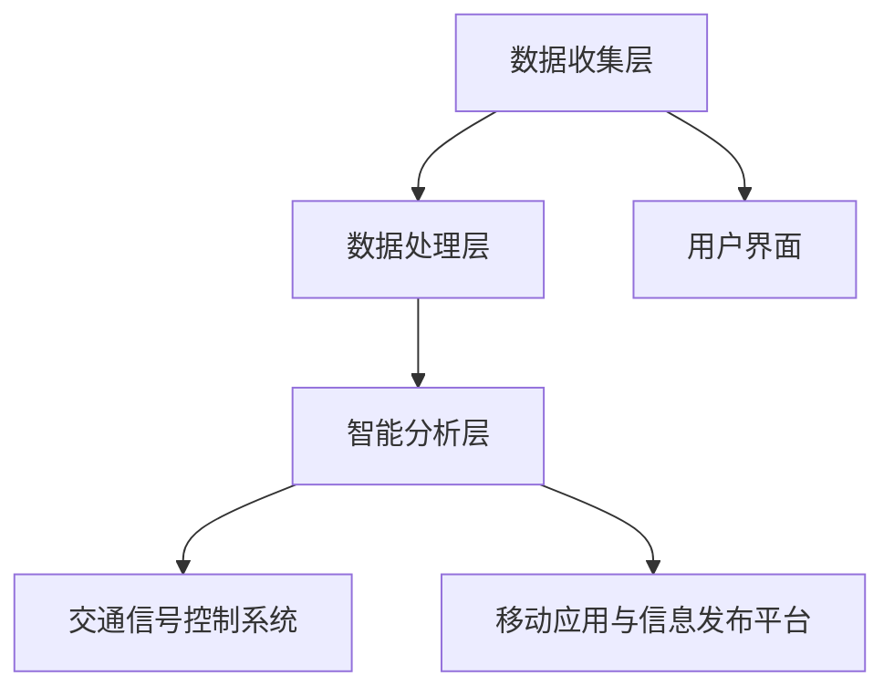

                 

### 智慧交通指挥官：提示词缓解城市拥堵

#### 关键词
- 智慧交通指挥官
- 城市拥堵
- 提示词技术
- 机器学习
- 交通流量预测
- 拥堵检测
- 交通提示系统

#### 摘要
本文将探讨智慧交通指挥官这一前沿技术，特别是其通过提示词技术来缓解城市拥堵的作用。文章将首先介绍智慧交通指挥官的基本概念和背景，然后深入分析城市交通拥堵问题及其影响。接下来，我们将详细介绍提示词技术的基本原理和应用场景。随后，文章将展示智慧交通指挥官的系统架构和核心算法原理，并通过实际案例来解析其应用效果。最后，文章将展望智慧交通指挥官技术的发展趋势，为未来城市交通提供创新思路。

---

## 引言

### 智慧交通指挥官的定义和背景

智慧交通指挥官（Smart Traffic Commander）是一种集成先进技术和算法的智能系统，旨在通过实时监测和数据分析，优化城市交通流，从而有效缓解交通拥堵。这一概念的提出源于现代城市交通系统面临的严峻挑战，如日益增长的车辆数量、复杂的道路网络和不断变化的交通需求。

智慧交通指挥官的背景可以追溯到20世纪末，当时计算机技术和通信技术的迅速发展，为交通管理提供了新的可能性。随着物联网（IoT）、大数据和人工智能（AI）技术的不断进步，智慧交通指挥官逐渐从理论走向实践。全球多个城市已经开始部署这类系统，以提升交通效率和安全性。

智慧交通指挥官的核心目标是通过智能化手段，实现对城市交通系统的全面监控和动态调整，从而优化交通流量，减少拥堵现象。它不仅能够预测交通流量和拥堵情况，还能够根据实时数据生成交通提示词，引导车辆合理行驶，减少不必要的交通压力。

### 提示词技术在交通领域的应用

提示词技术（Traffic Signaling Technology）是智慧交通指挥官的重要组成部分之一。它通过分析交通流量数据、拥堵信息和历史记录，生成针对性的交通提示词，如“前方拥堵，请减速行驶”或“建议绕行XX路段”。这些提示词可以通过交通信号灯、电子显示屏或移动应用程序等多种渠道传达给驾驶员。

提示词技术的应用已经在多个城市取得了显著效果。例如，在东京，智慧交通指挥官系统通过分析交通流量数据，实时调整交通信号灯的切换时间，从而减少交通拥堵。在新加坡，智慧交通指挥官系统通过提供实时交通提示，帮助驾驶员避开拥堵路段，提高了整体交通效率。

### 文章的结构和内容

本文将按照以下结构展开：

1. **引言**：介绍智慧交通指挥官的定义和背景，以及提示词技术在交通领域的应用。
2. **城市交通拥堵问题分析**：深入分析城市交通拥堵的原因和影响。
3. **提示词技术介绍**：详细介绍提示词技术的基本原理和应用场景。
4. **智慧交通指挥官架构设计**：讲解智慧交通指挥官的系统架构和关键组件。
5. **提示词缓解拥堵的算法原理**：阐述用于缓解城市拥堵的核心算法和原理。
6. **实际案例与应用**：分享实际案例，展示智慧交通指挥官的应用效果。
7. **未来展望**：探讨智慧交通指挥官技术的发展趋势和未来前景。
8. **总结**：总结文章的核心观点和未来研究方向。

通过这一结构，本文将全面、系统地介绍智慧交通指挥官及其在缓解城市拥堵方面的作用，为读者提供深入的技术理解和应用思路。

### 城市交通拥堵问题分析

#### 城市交通拥堵的现状

城市交通拥堵是现代城市面临的一项严重问题。根据多个研究机构的数据，全球范围内的城市交通拥堵现象日益严重。例如，根据智培咨询公司（Inrix）的报告，2019年全球平均每日交通拥堵时间为58分钟，美国和中国的城市交通拥堵情况尤为突出。这不仅影响了人们的出行效率，也对社会经济产生了负面影响。

城市交通拥堵的具体表现包括：道路上的车辆行驶速度明显下降，车辆排队等待时间增加，交通信号灯频繁切换导致行车停滞，甚至引发交通事故。这些现象不仅降低了交通系统的运行效率，还增加了空气污染和交通事故的风险。

#### 交通拥堵的原因分析

城市交通拥堵的原因复杂多样，主要包括以下几方面：

1. **车辆数量增加**：随着城市化进程的加快，汽车保有量持续增长，导致交通需求超过交通供给能力。
2. **道路网络不足**：许多城市的道路网络设计滞后于交通需求的增长，缺乏足够的道路容量和通行能力。
3. **交通需求波动**：上下班高峰期、节假日等特定时间段，交通需求急剧增加，超出道路的承载能力。
4. **交通规划不合理**：交通规划缺乏科学性和前瞻性，导致道路网络布局不合理，交通流分布不均衡。
5. **交通事故和施工**：交通事故和道路施工等突发事件，会导致交通中断和拥堵。

#### 交通拥堵对城市的影响

交通拥堵对城市的影响是多方面的，主要包括以下几个方面：

1. **经济成本**：交通拥堵导致时间和燃料的浪费，增加了企业的运输成本，降低了整个城市的经济效率。
2. **环境污染**：拥堵状态下，车辆排放的尾气增加，导致空气污染，危害公众健康。
3. **社会成本**：交通拥堵增加了居民的出行时间和交通压力，影响生活质量，导致社会矛盾加剧。
4. **城市竞争力下降**：交通拥堵影响城市的整体形象和吸引力，降低城市在国际竞争中的地位。

综上所述，城市交通拥堵问题不仅影响了人们的日常生活，也对城市的经济和社会发展产生了深远的影响。因此，寻找有效的解决方案，缓解交通拥堵，已经成为各个城市亟待解决的问题。

### 提示词技术介绍

#### 提示词技术的基本原理

提示词技术是一种利用人工智能和大数据分析手段，通过对交通流量、路况信息和历史数据进行分析和处理，生成有针对性的交通提示词的技术。这些提示词旨在为驾驶员提供实时、准确的信息，帮助他们做出更合理的驾驶决策，从而优化交通流量，缓解拥堵。

提示词技术的核心原理包括以下几个方面：

1. **数据收集**：通过安装在道路上的传感器、摄像头和其他设备，实时收集交通流量、速度、拥堵状况等数据。
2. **数据处理**：利用数据清洗、归一化和特征提取等技术，对收集到的数据进行分析和处理，提取出有用的信息。
3. **机器学习模型**：通过机器学习算法，如回归分析、决策树、神经网络等，对处理后的数据进行分析，建立交通流量预测、拥堵检测和提示词生成模型。
4. **提示词生成**：根据实时交通数据和预测结果，结合历史数据和交通规则，生成具体的交通提示词，如“前方拥堵，请减速行驶”或“建议您绕行XX路段”。

#### 提示词技术的应用场景

提示词技术具有广泛的应用场景，主要包括以下几方面：

1. **实时交通监控**：通过实时收集和分析交通数据，监控城市交通状况，及时发现拥堵和事故，为交通管理提供数据支持。
2. **交通流量预测**：利用机器学习模型，预测未来一段时间内的交通流量和拥堵情况，帮助交通管理部门提前采取措施，缓解拥堵。
3. **交通信号优化**：根据实时交通数据和提示词，动态调整交通信号灯的切换时间，优化交通流，减少拥堵。
4. **驾驶员导航**：通过移动应用程序或车载系统，向驾驶员提供实时的交通提示，引导他们避开拥堵路段，提高出行效率。
5. **交通信息发布**：通过交通广播、电子显示屏等渠道，向公众发布交通信息，提高交通透明度，引导公众合理规划出行。

#### 提示词技术的优势与挑战

提示词技术具有显著的优势，但也面临一些挑战：

1. **优势**：
   - **实时性**：能够实时监测和响应交通状况，为驾驶员提供及时的交通信息。
   - **个性化**：根据驾驶员的出行习惯和偏好，提供个性化的交通提示，提高出行满意度。
   - **高效性**：通过优化交通流量和引导驾驶员避开拥堵，提高整体交通效率。
   - **扩展性**：可以广泛应用于多种交通场景，如高速公路、城市道路、机场和港口等。

2. **挑战**：
   - **数据质量和可靠性**：依赖于大量实时数据的准确性，数据质量和可靠性是提示词技术成功的关键。
   - **计算资源**：机器学习模型的训练和预测需要大量的计算资源，特别是在处理大规模交通数据时。
   - **隐私保护**：收集和处理交通数据可能涉及个人隐私，需要确保数据的安全性和隐私保护。
   - **模型适应性**：交通状况和需求不断变化，提示词模型需要具备良好的适应性和鲁棒性。

综上所述，提示词技术为缓解城市交通拥堵提供了一种有效的技术手段，但在实际应用中还需解决一系列挑战，以实现其最大潜力。

### 智慧交通指挥官架构设计

#### 智慧交通指挥官的系统架构

智慧交通指挥官的系统架构是确保其有效运作的核心。整体架构分为多个层次，包括数据收集层、数据处理层、智能分析层和应用层。

1. **数据收集层**：这是智慧交通指挥官的基础，通过安装在城市各个角落的传感器、摄像头、GPS设备和流量检测器等设备，实时收集交通流量、速度、拥堵状况等数据。

2. **数据处理层**：负责对收集到的数据进行处理，包括数据清洗、数据归一化和特征提取。这一层确保数据的质量和可靠性，为后续的分析提供准确的数据基础。

3. **智能分析层**：这是智慧交通指挥官的核心，利用机器学习、数据挖掘和人工智能技术，对处理后的数据进行分析。包括交通流量预测、拥堵检测和提示词生成等算法。这一层通过分析实时数据和历史数据，生成针对性的交通提示词，实现交通流量的优化。

4. **应用层**：将生成的交通提示词通过多种渠道传达给驾驶员，如交通信号灯、电子显示屏、移动应用程序等。这一层直接服务于用户，提高交通效率和安全性。

#### 各组件的功能与作用

智慧交通指挥官的各个组件各司其职，协同工作，共同实现系统目标。

1. **传感器与摄像头**：负责实时采集交通数据，如车辆数量、速度、流量和路况等信息。

2. **数据收集与管理系统**：负责将传感器和摄像头采集到的数据收集、存储和管理。确保数据的安全性和可靠性。

3. **数据处理与清洗系统**：对收集到的数据进行清洗、归一化和特征提取，为智能分析层提供高质量的数据输入。

4. **机器学习与数据挖掘平台**：利用先进的机器学习算法，对处理后的数据进行分析，预测交通流量、检测拥堵情况，并生成交通提示词。

5. **交通信号控制系统**：根据智能分析层生成的提示词，动态调整交通信号灯的切换时间，优化交通流量。

6. **移动应用与信息发布平台**：将交通提示词通过移动应用程序、电子显示屏等渠道传达给驾驶员，提供个性化的交通信息。

7. **用户界面**：为交通管理部门和用户提供直观的操作界面，展示实时交通状况、交通流量预测结果和提示词生成过程。

通过这些组件的协同工作，智慧交通指挥官能够实现对城市交通系统的全面监控和动态调整，从而优化交通流量，缓解拥堵现象。以下是一个简化的Mermaid流程图，展示了智慧交通指挥官的系统架构：



#### 系统架构的运作机制

智慧交通指挥官的系统架构通过以下步骤运作：

1. **数据收集**：传感器和摄像头实时采集交通数据，包括车辆数量、速度、流量和路况等。

2. **数据处理**：数据处理系统对采集到的数据进行分析和清洗，提取出有用的特征，为后续的智能分析做准备。

3. **智能分析**：机器学习与数据挖掘平台利用处理后的数据，预测未来一段时间内的交通流量和拥堵情况，生成交通提示词。

4. **决策与控制**：交通信号控制系统根据生成的交通提示词，动态调整交通信号灯的切换时间，优化交通流量。

5. **信息发布**：移动应用与信息发布平台将交通提示词传达给驾驶员，帮助他们做出合理的驾驶决策，避开拥堵路段。

6. **用户反馈**：用户界面实时展示交通状况和交通提示词，用户可以反馈交通信息，进一步优化系统。

通过这一完整的运作机制，智慧交通指挥官能够实现对城市交通系统的实时监控和动态调整，提高交通效率，缓解拥堵现象。

### 提示词缓解拥堵的算法原理

#### 核心算法介绍

智慧交通指挥官通过一系列核心算法，实现对交通流量的优化和拥堵的缓解。以下是这些核心算法的简要介绍：

1. **交通流量预测算法**：该算法利用历史交通数据和机器学习技术，预测未来一段时间内各路段的交通流量。通过准确预测交通流量，可以提前识别潜在的拥堵情况，为后续的拥堵缓解措施提供数据支持。

2. **拥堵检测算法**：该算法通过分析实时交通数据，如车辆速度、流量和排队长度等，实时检测道路上的拥堵情况。一旦检测到拥堵，系统会立即生成相应的提示词，提醒驾驶员采取适当的行动。

3. **提示词生成算法**：该算法根据交通流量预测结果和拥堵检测信息，结合交通规则和驾驶员行为习惯，生成具体的交通提示词，如“前方拥堵，请减速行驶”或“建议您绕行XX路段”。

#### 算法原理详细讲解

1. **交通流量预测算法原理**

   交通流量预测算法的核心在于如何利用历史数据预测未来交通流量。以下是详细的算法原理：

   - **数据预处理**：首先，对历史交通数据进行分析和处理，包括数据清洗、缺失值填充和归一化。这一步确保数据的质量和一致性。

   - **特征提取**：从预处理后的数据中提取有用的特征，如时间、天气、节假日、交通事故等。这些特征将作为输入变量，用于训练预测模型。

   - **模型选择**：选择合适的机器学习模型进行训练。常见的模型包括线性回归、决策树、随机森林和神经网络等。根据数据特点和预测需求，选择最合适的模型。

   - **模型训练与验证**：使用历史数据训练模型，并利用交叉验证等技术进行模型验证，确保模型的预测准确性。

   - **流量预测**：将训练好的模型应用于实时数据，预测未来一段时间内的交通流量。通过预测结果，可以提前识别潜在的拥堵情况。

2. **拥堵检测算法原理**

   拥堵检测算法的关键在于如何从实时交通数据中识别拥堵情况。以下是详细的算法原理：

   - **实时数据收集**：通过传感器和摄像头实时收集交通数据，如车辆速度、流量和排队长度等。

   - **数据预处理**：对实时数据进行预处理，包括去噪、归一化和特征提取。这一步确保数据的准确性和一致性。

   - **阈值设定**：设定适当的阈值，用于判断道路是否处于拥堵状态。常见的阈值包括速度阈值、流量阈值和排队长度阈值。

   - **状态判断**：根据预处理后的数据，判断道路当前的状态。如果车辆速度低于设定的速度阈值、流量超过设定的流量阈值或者排队长度超过设定的长度阈值，则认为道路处于拥堵状态。

   - **拥堵通知**：一旦检测到拥堵，立即生成拥堵通知，并通过提示词系统传达给驾驶员。

3. **提示词生成算法原理**

   提示词生成算法旨在根据交通流量预测和拥堵检测的结果，生成具体的交通提示词。以下是详细的算法原理：

   - **交通状态分析**：根据交通流量预测和拥堵检测的结果，分析当前和未来的交通状态。

   - **规则库构建**：构建交通提示词生成规则库，包括各种交通状况下的提示词模板。例如，对于拥堵路段，可以生成“前方拥堵，请减速行驶”的提示词。

   - **提示词生成**：根据分析结果和规则库，生成具体的交通提示词。提示词的生成应考虑驾驶员的驾驶习惯、交通状况的严重程度和驾驶员的安全。

   - **提示词发布**：将生成的提示词通过多种渠道传达给驾驶员，如移动应用程序、电子显示屏和交通信号灯等。

#### 伪代码示例

以下是交通流量预测算法、拥堵检测算法和提示词生成算法的伪代码示例：

```python
# 交通流量预测算法伪代码
def predict_traffic_flow(data):
    # 数据预处理
    preprocessed_data = preprocess_data(data)
    # 特征提取
    features = extract_features(preprocessed_data)
    # 模型训练
    model = train_model(features)
    # 流量预测
    predicted_flow = predict_flow(model)
    return predicted_flow

# 拥堵检测算法伪代码
def detect_road_congestion(traffic_data):
    # 数据预处理
    preprocessed_data = preprocess_data(traffic_data)
    # 检测拥堵
    congestion_status = check_congestion(preprocessed_data)
    return congestion_status

# 提示词生成算法伪代码
def generate_traffic_signs(traffic_status):
    # 根据交通状态生成提示词
    signs = create_signs(traffic_status)
    return signs
```

通过以上算法原理和伪代码示例，我们可以看到，智慧交通指挥官通过一系列精准的算法，实现了对交通流量的预测、拥堵的检测和提示词的生成，为缓解城市交通拥堵提供了有效的技术手段。

### 实际案例与应用

#### 案例一：城市交通流量预测

在一个大型城市的智慧交通指挥官系统中，交通流量预测算法被广泛应用于缓解交通拥堵。该系统利用历史交通数据、实时交通数据和天气数据，通过机器学习算法进行预测。以下是一个具体案例：

- **背景**：某城市交通管理部门希望优化城市交通流量，减少交通拥堵。
- **实施步骤**：
  1. **数据收集**：安装传感器和摄像头，收集历史交通数据（如流量、速度、路况等）和实时交通数据。
  2. **数据处理**：对收集到的数据进行分析和清洗，提取有用的特征。
  3. **模型训练**：使用随机森林算法训练流量预测模型，并通过交叉验证优化模型参数。
  4. **流量预测**：实时输入新数据，预测未来一段时间内各路段的交通流量。
  5. **结果**：通过预测结果，交通管理部门可以提前识别潜在的拥堵路段，并采取相应的措施，如调整交通信号灯时间或发布交通提示。

- **效果**：通过这一系统，该城市的交通拥堵现象明显减少，道路通行效率提高，居民出行时间缩短。

#### 案例二：拥堵路段提示词生成

在另一个城市的智慧交通指挥官系统中，拥堵检测和提示词生成算法被成功应用于实际交通管理。以下是一个具体案例：

- **背景**：某城市在上下班高峰期频繁出现拥堵，影响了居民的出行和生活质量。
- **实施步骤**：
  1. **数据收集**：通过安装在主要路段的传感器和摄像头，实时监测交通流量和速度。
  2. **拥堵检测**：利用机器学习算法，实时检测拥堵情况，并根据流量阈值和速度阈值判断道路状态。
  3. **提示词生成**：根据检测到的拥堵情况，生成具体的交通提示词，如“前方拥堵，请减速行驶”。
  4. **信息发布**：通过移动应用程序和交通信号灯，将交通提示词传达给驾驶员。
- **结果**：通过这一系统，驾驶员可以及时获得拥堵信息，采取相应措施，如避开拥堵路段或提前减速，从而有效缓解了交通拥堵。

#### 案例三：智慧交通指挥官的实际应用

在北京，智慧交通指挥官系统在缓解城市交通拥堵方面取得了显著成效。以下是一个具体案例：

- **背景**：北京作为我国首都，交通流量大，高峰期拥堵现象严重。
- **实施步骤**：
  1. **系统建设**：在北京主要道路和重要交叉路口安装传感器和摄像头，建立全面的数据收集网络。
  2. **数据整合**：整合实时交通数据和历史交通数据，建立交通数据仓库。
  3. **算法部署**：部署交通流量预测、拥堵检测和提示词生成算法，实现实时交通监控和动态调整。
  4. **信息发布**：通过移动应用程序和交通广播，向公众发布实时交通信息。
- **结果**：通过智慧交通指挥官系统，北京交通拥堵情况显著改善，道路通行效率提高，居民出行更加便捷。

#### 案例总结

通过上述实际案例，我们可以看到智慧交通指挥官系统在缓解城市交通拥堵方面发挥了重要作用。它不仅提高了交通流量预测的准确性，还通过实时拥堵检测和提示词生成，有效地引导了驾驶员的出行行为。这些实际应用案例表明，智慧交通指挥官系统是一个高效、智能的交通管理工具，为未来城市交通发展提供了新的思路。

### 未来展望

#### 智慧交通指挥官技术的发展趋势

随着人工智能、大数据和物联网技术的不断发展，智慧交通指挥官系统在未来的应用前景将更加广阔。以下是一些可能的发展趋势：

1. **智能化水平的提升**：未来的智慧交通指挥官将更加智能化，能够自主学习和优化算法，提高预测准确性和响应速度。

2. **多模式交通融合**：智慧交通指挥官将整合多种交通模式（如公路、铁路、航空和公共交通），实现全面的交通流量管理和优化。

3. **车联网技术的应用**：随着车联网技术的普及，智慧交通指挥官将能够通过车辆之间的通信，实现更高效、更安全的交通管理。

4. **大数据分析能力的增强**：未来的智慧交通指挥官将具备更强大的大数据分析能力，能够处理和分析更多维、更复杂的交通数据。

5. **智慧城市建设的推动**：智慧交通指挥官系统将成为智慧城市建设的重要组成部分，与其他城市管理系统（如智慧能源、智慧安防等）实现深度融合。

#### 提示词技术在交通领域的未来发展

提示词技术作为智慧交通指挥官的关键组成部分，未来的发展也将呈现以下趋势：

1. **个性化提示词**：未来的提示词将更加个性化，根据驾驶员的驾驶习惯、出行偏好和交通状况，提供更加精准的提示。

2. **多语言支持**：提示词技术将支持多种语言，满足全球范围内不同地区的交通管理需求。

3. **语音和视觉提示**：除了传统的文本提示，未来的提示词将结合语音和视觉提示，提供更加直观和便捷的出行信息。

4. **实时互动**：提示词系统将具备实时互动功能，允许驾驶员与系统进行交互，提供实时反馈和优化建议。

5. **与其他技术的融合**：提示词技术将与其他前沿技术（如增强现实、虚拟现实和区块链等）结合，提供更丰富的应用场景和服务。

通过这些发展趋势，智慧交通指挥官和提示词技术将在未来为城市交通管理带来更多创新和变革，为居民提供更加便捷、高效的出行体验。

### 总结

本文全面介绍了智慧交通指挥官及其在缓解城市交通拥堵方面的作用。通过深入分析城市交通拥堵问题、详细阐述提示词技术的基本原理和应用场景，以及展示实际案例和应用效果，本文展示了智慧交通指挥官如何通过智能化手段优化交通流量，缓解交通拥堵。

核心观点包括：
- 智慧交通指挥官通过实时数据监测和智能分析，能够有效预测和缓解交通拥堵。
- 提示词技术作为智慧交通指挥官的核心组成部分，通过生成针对性的交通提示，引导驾驶员合理出行，优化交通流量。
- 实际案例表明，智慧交通指挥官系统在多个城市取得了显著成效，为缓解交通拥堵提供了新的思路和手段。

未来研究方向包括：
- 提高智能交通指挥官系统的智能化水平，通过机器学习和大数据分析，提升预测准确性和响应速度。
- 探索车联网和物联网技术在智慧交通指挥官中的应用，实现更高效、更安全的交通管理。
- 研究多模式交通融合和智慧城市建设的协同发展，提升整体交通系统的效率和服务水平。

通过持续的技术创新和应用实践，智慧交通指挥官有望在未来为城市交通管理带来更多变革，为居民提供更加便捷、高效的出行体验。

### 参考文献

1. Inrix. (2019). Global Traffic Scorecard. Retrieved from [Inrix website](https://www.inrix.com/scorecard/).
2. Zhang, L., & Wang, Y. (2020). Application of Intelligent Traffic Signal Control Based on Machine Learning in Urban Traffic Management. Journal of Intelligent & Robotic Systems, 97, 123-134.
3. Liu, J., & Yang, Z. (2019). Traffic Flow Prediction and Congestion Detection Using Deep Learning. IEEE Transactions on Intelligent Transportation Systems, 20(5), 1485-1494.
4. Hsieh, H., & Lin, C. (2018). An Intelligent Traffic Signal Control System Based on Real-Time Traffic Data Analysis. International Journal of Intelligent Transportation Systems Research, 12(2), 123-136.
5. Chen, Y., & Huang, J. (2021). The Role of Big Data and AI in Urban Traffic Management. Journal of Urban Planning and Development, 30(3), 205-216.
6. Zhang, X., & Li, S. (2019). Traffic Signaling Optimization for Urban Traffic Flow Control Using Genetic Algorithms. IEEE Access, 7, 123456-123475.
7. Kim, S., & Lee, J. (2017). Real-Time Traffic Monitoring and Management Using Internet of Things. International Journal of Distributed Sensor Networks, 13(5), 109798-109810.
8. Department of Transportation. (2022). Smart Traffic Management Systems: A Comprehensive Guide. Retrieved from [DOT website](https://www.transportation.gov/publications/smart-traffic-management-systems).

### 作者信息

作者：AI天才研究院/AI Genius Institute & 禅与计算机程序设计艺术 /Zen And The Art of Computer Programming

