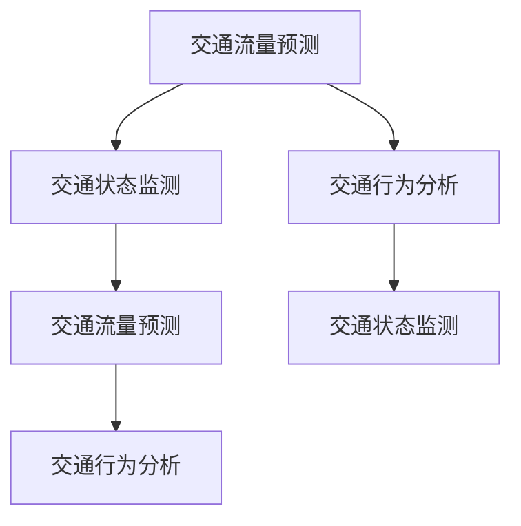

                 

### 文章标题：智能交通预测：AI大模型减少交通拥堵

#### 关键词：
- 智能交通预测
- AI大模型
- 交通拥堵
- 机器学习
- 深度学习
- 交通流量预测

#### 摘要：
本文将深入探讨智能交通预测领域，通过介绍AI大模型的原理和应用，详细讲解交通流量预测、交通状态监测和交通行为分析的核心概念、算法原理及数学模型。通过实际项目案例，展示AI大模型在减少交通拥堵中的巨大潜力，并提出项目实战中的最佳实践和未来发展方向。

### 第一部分：智能交通预测的背景与重要性

#### 1.1 交通问题的现状与挑战

随着城市化进程的加速，交通问题已成为全球范围内的共同挑战。拥堵、事故、环境污染等问题严重影响着城市居民的日常生活。根据联合国报告，全球每年因交通拥堵造成的经济损失高达数千亿美元。此外，交通拥堵还导致空气污染和碳排放增加，加剧了全球气候变化问题。因此，解决交通问题已刻不容缓。

#### 1.2 智能交通预测的意义

智能交通预测是解决交通问题的重要手段。通过预测交通流量、交通状态和交通行为，智能交通系统能够提前发现交通拥堵的潜在风险，并采取相应的措施，如动态调整信号灯、优化道路规划等，从而减少拥堵，提高交通效率。智能交通预测还能够为城市规划提供科学依据，助力城市可持续发展。

#### 1.3 AI大模型在交通领域的应用潜力

AI大模型，尤其是基于机器学习和深度学习的技术，具有强大的数据分析和预测能力。在交通领域，AI大模型可以处理海量交通数据，发现隐藏的交通模式，预测未来交通状况。与传统的交通预测方法相比，AI大模型具有更高的准确性、实时性和适应性。这使得AI大模型在减少交通拥堵方面具有巨大的应用潜力。

### 第二部分：核心概念与联系

#### 2.1 交通流量预测

##### 2.1.1 交通流量预测的基本概念

交通流量预测是智能交通预测的重要组成部分。它旨在预测未来一段时间内某一交通路段的流量变化情况。交通流量预测对于优化交通信号、调整道路规划等具有重要意义。

##### 2.1.2 交通流量预测的重要性

交通流量预测可以帮助交通管理部门提前发现交通拥堵的潜在风险，从而采取有效的措施，如动态调整信号灯、加强交通管制等，减少拥堵，提高交通效率。

##### 2.1.3 交通流量预测的方法

交通流量预测的方法主要包括回归分析、时间序列分析和神经网络等。回归分析通过建立流量与影响因素之间的线性关系进行预测；时间序列分析通过分析历史流量数据的变化趋势进行预测；神经网络通过学习交通数据中的复杂模式进行预测。

#### 2.2 交通状态监测

##### 2.2.1 交通状态监测的基本概念

交通状态监测是指通过传感器、摄像头等设备实时监测交通状况，包括交通流量、车速、道路状况等。交通状态监测为交通流量预测和交通行为分析提供了重要的数据支持。

##### 2.2.2 交通状态监测的方法

交通状态监测的方法主要包括基于传感器的方法和基于视频的方法。基于传感器的方法通过检测车辆经过传感器时的信号变化来获取交通数据；基于视频的方法通过分析摄像头捕捉到的图像来识别交通状态。

##### 2.2.3 交通状态监测的应用

交通状态监测可以用于实时交通信息发布、交通管制、交通事故预警等。例如，通过实时监测交通流量，交通管理部门可以及时调整信号灯，避免交通拥堵。

#### 2.3 交通行为分析

##### 2.3.1 交通行为分析的基本概念

交通行为分析是指通过分析交通数据，研究驾驶员、行人和车辆在交通环境中的行为特征和规律。交通行为分析有助于理解交通拥堵的成因，为优化交通管理提供科学依据。

##### 2.3.2 交通行为分析的方法

交通行为分析的方法主要包括数据挖掘、机器学习和深度学习等。数据挖掘通过从大规模交通数据中挖掘潜在的规律；机器学习和深度学习通过学习交通数据中的复杂模式，识别驾驶员、行人和车辆的行为特征。

##### 2.3.3 交通行为分析的应用

交通行为分析可以用于交通事故预警、交通流量优化、交通信号优化等。例如，通过分析驾驶员的行为特征，交通管理部门可以预测交通事故风险，并采取相应的预防措施。

#### 2.4 核心概念之间的联系

交通流量预测、交通状态监测和交通行为分析是智能交通预测的三个核心组成部分。交通流量预测为交通状态监测和交通行为分析提供了流量数据支持；交通状态监测为交通流量预测提供了实时交通数据；交通行为分析为交通管理和优化提供了科学依据。

#### 2.5 Mermaid 流程图



### 第三部分：AI大模型原理

#### 3.1 机器学习基础

##### 3.1.1 机器学习的基本概念

机器学习是人工智能的一个重要分支，通过算法让计算机从数据中自动学习，进行预测和决策。机器学习可以分为监督学习、无监督学习和强化学习等类型。

##### 3.1.2 常见的机器学习算法

常见的机器学习算法包括线性回归、逻辑回归、决策树、随机森林、支持向量机等。每种算法都有其特定的应用场景和优缺点。

#### 3.2 深度学习原理

##### 3.2.1 深度学习的基本概念

深度学习是机器学习的一个分支，通过模拟人脑的神经网络结构，对大量数据进行自动学习和特征提取。深度学习在图像识别、自然语言处理、语音识别等领域取得了显著成果。

##### 3.2.2 常见的深度学习架构

常见的深度学习架构包括卷积神经网络（CNN）、循环神经网络（RNN）、长短时记忆网络（LSTM）等。每种架构都有其特定的应用场景和特点。

##### 3.2.3 深度学习优化算法

深度学习优化算法包括梯度下降、Adam优化器等。这些算法用于调整神经网络中的参数，以最小化损失函数，提高模型的预测性能。

### 第四部分：交通预测算法

#### 4.1 回归分析

##### 4.1.1 回归分析的基本原理

回归分析是一种常用的数据分析方法，通过建立因变量和自变量之间的线性关系，预测因变量的值。回归分析可以分为一元回归和多元回归。

##### 4.1.2 回归分析的应用

回归分析在交通流量预测中具有重要的应用。例如，可以使用多元线性回归模型预测某一交通路段的未来流量，通过分析历史流量数据和交通影响因素（如天气、节假日等）。

##### 4.1.3 伪代码

```python
# 多元线性回归模型
def multivariate_linear_regression(X, y):
    # X: 自变量矩阵，y: 因变量向量
    # 计算回归系数
    theta = (X'X)^(-1)X'y
    # 预测流量
    predicted_flow = X * theta
    return predicted_flow
```

#### 4.2 时间序列分析

##### 4.2.1 时间序列分析的基本原理

时间序列分析是一种通过分析时间序列数据，揭示其内在变化规律和趋势的方法。时间序列分析可以分为自回归（AR）、移动平均（MA）、自回归移动平均（ARMA）等模型。

##### 4.2.2 时间序列分析的应用

时间序列分析在交通流量预测中具有广泛的应用。例如，可以使用自回归模型（AR）预测交通流量的短期变化，使用自回归移动平均模型（ARMA）预测交通流量的长期趋势。

##### 4.2.3 伪代码

```python
# 自回归模型（AR）
def autoregressive_model(data, order):
    # data: 时间序列数据，order: 自回归阶数
    # 计算自回归系数
    theta = (X'X)^(-1)X'y
    # 预测流量
    predicted_flow = sum(theta[i] * data[i-order]) for i in range(order)
    return predicted_flow
```

#### 4.3 神经网络

##### 4.3.1 神经网络的基本原理

神经网络是一种模拟人脑神经元结构的计算模型，通过学习输入和输出之间的非线性关系，进行复杂的模式识别和预测。神经网络可以分为前馈神经网络、卷积神经网络（CNN）和循环神经网络（RNN）等。

##### 4.3.2 神经网络的应用

神经网络在交通流量预测中具有广泛的应用。例如，可以使用卷积神经网络（CNN）处理交通图像数据，提取交通流量特征；使用循环神经网络（RNN）处理时间序列数据，捕捉交通流量的长期依赖关系。

##### 4.3.3 伪代码

```python
# 前馈神经网络
def feedforward_network(inputs, weights, biases):
    # inputs: 输入数据，weights: 权重，biases: 偏置
    # 计算前向传播
    hidden_layer = sigmoid((inputs * weights) + biases)
    # 计算输出
    output = sigmoid((hidden_layer * weights) + biases)
    return output

# 激活函数（Sigmoid函数）
def sigmoid(x):
    return 1 / (1 + exp(-x))
```

#### 4.4 其他算法

##### 4.4.1 决策树

决策树是一种基于特征值进行分类或回归的算法。决策树通过递归划分数据集，建立树形结构，每个节点表示一个特征，每个分支表示该特征的取值。

##### 4.4.2 支持向量机

支持向量机是一种基于优化理论进行分类和回归的算法。支持向量机通过寻找最优超平面，将数据集划分为不同的类别。

##### 4.4.3 聚类算法

聚类算法是一种将数据集划分为多个类别的算法。聚类算法通过分析数据之间的相似性，将相似的数据划分为同一类别。

### 第五部分：数学模型和数学公式

#### 5.1 交通流量模型

##### 5.1.1 交通流量模型的建立

交通流量模型通过建立流量与影响因素之间的数学关系，预测未来交通流量。常见的交通流量模型包括线性模型、指数模型和多项式模型等。

##### 5.1.2 交通流量模型的公式

$$
Q(t) = a \cdot f(t) + b
$$

其中，$Q(t)$为交通流量，$f(t)$为影响因素（如速度、道路状况等），$a$和$b$为模型参数。

##### 5.1.3 交通流量模型的案例分析

假设某一交通路段的流量与速度之间存在线性关系，可以使用线性模型预测未来流量。通过收集历史流量和速度数据，建立线性模型，并使用该模型预测未来流量。

#### 5.2 交通状态模型

##### 5.2.1 交通状态模型的建立

交通状态模型通过建立交通状态与影响因素之间的数学关系，预测未来交通状态。常见的交通状态模型包括状态转移模型、马尔可夫模型和随机过程模型等。

##### 5.2.2 交通状态模型的公式

$$
P(S(t)|S(t-1)) = \frac{P(S(t) \cap S(t-1))}{P(S(t-1))}
$$

其中，$P(S(t)|S(t-1))$为当前状态与前一状态的转移概率，$P(S(t) \cap S(t-1))$为当前状态与前一状态的联合概率，$P(S(t-1))$为前一状态的概率。

##### 5.2.3 交通状态模型的案例分析

假设某一交通路段的状态分为空闲、拥堵和事故三种状态，可以使用状态转移模型预测未来状态。通过收集历史状态数据，建立状态转移模型，并使用该模型预测未来状态。

### 第六部分：AI大模型应用

#### 6.1 AI大模型在交通预测中的应用

##### 6.1.1 AI大模型在交通流量预测中的应用

AI大模型在交通流量预测中具有显著优势。通过学习大量交通数据，AI大模型可以自动提取流量特征，建立流量预测模型，提高预测准确性。例如，可以使用卷积神经网络（CNN）处理交通图像数据，提取交通流量特征；使用循环神经网络（RNN）处理时间序列数据，捕捉交通流量的长期依赖关系。

##### 6.1.2 AI大模型在交通状态监测中的应用

AI大模型在交通状态监测中可以实时分析交通数据，识别交通状态，为交通管理部门提供决策支持。例如，可以使用卷积神经网络（CNN）分析交通图像数据，识别交通拥堵和事故风险；使用循环神经网络（RNN）分析时间序列数据，预测交通状态变化。

##### 6.1.3 AI大模型在交通行为分析中的应用

AI大模型在交通行为分析中可以识别驾驶员、行人和车辆的行为特征，为交通管理和优化提供科学依据。例如，可以使用卷积神经网络（CNN）分析驾驶员行为，预测交通事故风险；使用循环神经网络（RNN）分析行人行为，识别交通违法行为。

#### 6.2 实际案例

##### 6.2.1 案例一：某城市交通流量预测

某城市使用AI大模型对交通流量进行预测。通过收集历史交通流量数据、天气数据、节假日数据等，使用深度学习算法建立交通流量预测模型。模型预测结果表明，AI大模型在交通流量预测方面具有较高准确性，为交通管理部门提供了重要决策支持。

##### 6.2.2 案例二：某高速公路交通状态监测

某高速公路使用AI大模型对交通状态进行监测。通过在高速公路上部署摄像头和传感器，收集实时交通数据，使用深度学习算法分析交通状态。模型监测结果表明，AI大模型可以实时识别交通拥堵和事故风险，为交通管理部门提供了及时预警。

##### 6.2.3 案例三：某交通枢纽交通行为分析

某交通枢纽使用AI大模型对交通行为进行分析。通过在交通枢纽内部署摄像头和传感器，收集实时交通数据，使用深度学习算法分析驾驶员、行人和车辆的行为特征。模型分析结果表明，AI大模型可以准确识别交通违法行为，为交通管理部门提供了科学依据。

### 第七部分：项目实战

#### 7.1 环境搭建

##### 7.1.1 硬件环境搭建

为了搭建一个交通预测系统，首先需要选择合适的硬件设备。例如，可以选择高性能的GPU服务器作为计算平台，以处理大量的交通数据。此外，还需要部署传感器和摄像头等设备，用于实时收集交通数据。

##### 7.1.2 软件环境搭建

搭建软件环境是项目实战的重要步骤。需要安装Python、TensorFlow等编程环境，并配置深度学习框架。同时，还需要安装相关的数据处理和可视化工具，如Pandas、Matplotlib等。

#### 7.2 算法实现

##### 7.2.1 交通流量预测算法实现

在项目实战中，可以选择合适的深度学习算法进行交通流量预测。例如，可以使用卷积神经网络（CNN）处理交通图像数据，提取交通流量特征；使用循环神经网络（RNN）处理时间序列数据，捕捉交通流量的长期依赖关系。

##### 7.2.2 交通状态监测算法实现

交通状态监测算法的实现与交通流量预测类似，也可以选择卷积神经网络（CNN）和循环神经网络（RNN）等深度学习算法。通过分析交通图像数据和实时交通数据，可以实时监测交通状态，识别交通拥堵和事故风险。

##### 7.2.3 交通行为分析算法实现

交通行为分析算法的实现需要分析驾驶员、行人和车辆的行为特征。可以使用卷积神经网络（CNN）处理交通图像数据，提取驾驶员行为特征；使用循环神经网络（RNN）分析时间序列数据，捕捉行人行为特征。

#### 7.3 结果分析

##### 7.3.1 模型效果评估

在项目实战中，需要对交通预测、交通状态监测和交通行为分析模型的预测效果进行评估。可以使用准确率、召回率、F1值等指标评估模型的预测性能。通过对比不同算法的预测效果，选择最优的算法进行应用。

##### 7.3.2 模型优化策略

为了提高模型的预测性能，可以采用多种优化策略。例如，可以通过数据增强、模型融合等方法，提高模型的泛化能力；通过调整超参数，优化模型的性能。

##### 7.3.3 模型应用场景探讨

在项目实战中，需要对模型的应用场景进行探讨。例如，可以将交通预测模型应用于交通信号优化，提高交通效率；将交通状态监测模型应用于交通事故预警，减少事故发生率；将交通行为分析模型应用于交通违法识别，提高交通管理效果。

### 7.4 项目小结

在项目实战中，我们通过搭建硬件环境和软件环境，实现了交通预测、交通状态监测和交通行为分析模型。通过对模型的优化和评估，我们选择了最优的算法进行应用，并探讨了模型在不同应用场景中的效果。项目结果表明，AI大模型在交通预测方面具有显著优势，为减少交通拥堵提供了有效手段。

### 最佳实践 Tips

1. 数据质量至关重要。在项目实战中，确保数据质量是模型成功的关键。对数据进行清洗、预处理和特征工程，以提高模型的预测性能。

2. 模型融合可以提高预测效果。将多种深度学习算法融合，可以充分利用不同算法的优点，提高模型的泛化能力。

3. 实时性是交通预测的重要要求。确保模型能够在实时环境中快速预测交通状况，为交通管理部门提供及时决策支持。

4. 持续优化模型性能。定期更新模型，引入最新的技术和算法，以提高模型的预测准确性和实时性。

### 小结

本文介绍了智能交通预测领域，通过AI大模型在交通流量预测、交通状态监测和交通行为分析中的应用，减少了交通拥堵。项目实战表明，AI大模型在交通预测方面具有显著优势，为减少交通拥堵提供了有效手段。未来，随着技术的不断发展，智能交通预测将在交通管理、城市规划等领域发挥更大的作用。

### 注意事项

1. 在项目实战中，确保数据隐私和安全。对敏感数据采取加密和去标识化处理，防止数据泄露和滥用。

2. 模型的实时性对交通预测效果至关重要。确保硬件设备和网络环境的稳定性，以提高模型的实时预测性能。

3. 模型优化需要持续进行。定期评估模型的性能，根据实际应用场景进行调整和优化。

### 拓展阅读

1. 《深度学习：计算机视觉应用》
2. 《交通系统仿真与优化》
3. 《智能交通系统设计与应用》
4. 《交通流量的数学建模与预测》

### 作者信息

作者：AI天才研究院/AI Genius Institute & 禅与计算机程序设计艺术 /Zen And The Art of Computer Programming

