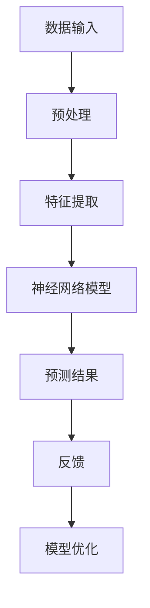
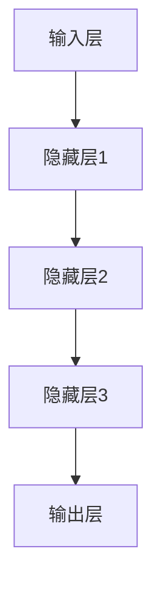
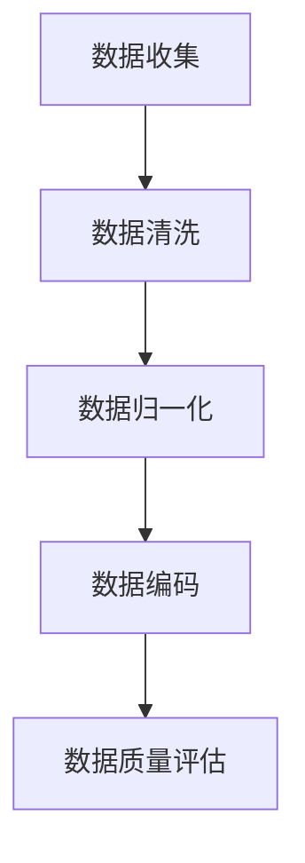
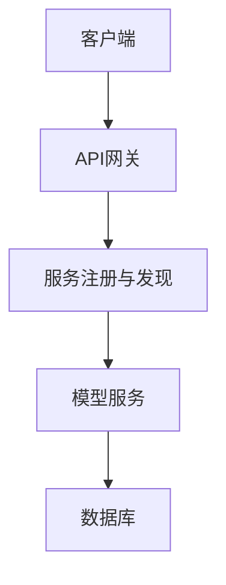

                 


### 1. 确定文章的整体结构

在撰写技术博客之前，首先需要明确文章的整体结构。这将有助于我们更好地组织内容，使文章逻辑清晰、条理分明。我们的文章结构可以分为三个主要部分：引言、正文和总结。

#### 引言
引言部分将简要介绍智能客户关系管理（ICRM）和AI大模型的概念，以及它们在个性化客户服务中的应用。这部分还将设定文章的基调，吸引读者的兴趣。

#### 正文
正文部分将分为多个章节，每个章节都将围绕一个特定的主题进行深入探讨。这些主题将涵盖ICRM和AI大模型的各个方面，从理论基础到实际应用。

- **第1章：概述与理论基础**
  - **1.1 智能客户关系管理的背景**
  - **1.2 AI大模型的概念与优势**
  - **1.3 个性化客户服务的理念**

- **第2章：AI大模型的基础理论**
  - **2.1 AI大模型的核心概念**
  - **2.2 AI大模型的架构与工作原理**
  - **2.3 Mermaid图：AI大模型的基本结构**

- **第3章：实践应用**
  - **3.1 数据收集与预处理**
  - **3.2 数据预处理方法与工具**
  - **3.3 数据质量评估**

- **第4章：模型开发与训练**
  - **4.1 模型选择与设计**
  - **4.2 模型训练与优化**
  - **4.3 伪代码：典型AI大模型训练流程**

- **第5章：模型部署与集成**
  - **5.1 模型部署策略**
  - **5.2 模型集成与API设计**
  - **5.3 Mermaid图：模型部署架构**

- **第6章：模型评估与优化**
  - **6.1 评估指标**
  - **6.2 优化方法**
  - **6.3 优化案例分析**

- **第7章：案例分析**
  - **7.1 案例介绍**
  - **7.2 案例分析**
  - **7.3 案例总结**

#### 总结
总结部分将回顾文章的主要观点，并给出未来的发展方向和潜在的研究课题。

### 2. 确定每个章节的内容

在确定整体结构后，我们需要进一步细化每个章节的内容。以下是对每个章节的详细描述：

#### 第1章：概述与理论基础

这一章将介绍智能客户关系管理（ICRM）的概念、背景和优势，以及AI大模型在ICRM中的应用。我们将讨论个性化客户服务的理念，并解释为什么AI大模型是实现个性化服务的理想工具。

#### 第2章：AI大模型的基础理论

这一章将深入探讨AI大模型的核心概念、架构和工作原理。我们将使用Mermaid图来展示AI大模型的基本结构，并解释各个组件的作用和相互关系。

#### 第3章：实践应用

这一章将介绍如何将AI大模型应用于实际客户关系管理中。我们将讨论数据收集与预处理的方法和工具，以及如何评估数据质量。

#### 第4章：模型开发与训练

这一章将详细介绍如何开发AI大模型，包括模型选择与设计、模型训练与优化。我们将提供典型的AI大模型训练流程的伪代码，帮助读者理解训练过程。

#### 第5章：模型部署与集成

这一章将介绍如何部署和集成AI大模型。我们将讨论模型部署策略、集成与API设计，并使用Mermaid图展示模型部署架构。

#### 第6章：模型评估与优化

这一章将介绍如何评估AI大模型的效果，包括评估指标和优化方法。我们将通过案例分析，展示如何在实际应用中优化模型性能。

#### 第7章：案例分析

这一章将提供具体的案例研究，展示AI大模型在客户关系管理中的实际应用。我们将深入分析案例，并提供总结和教训。

### 3. 编写文章的关键部分

在确定了整体结构和每个章节的内容后，我们可以开始编写文章。以下是文章的关键部分：

#### 文章标题

《智能客户关系管理：AI大模型个性化客户服务》

#### 文章关键词

智能客户关系管理、AI大模型、个性化客户服务、数据预处理、模型训练、模型部署、模型评估、案例分析

#### 文章摘要

本文介绍了智能客户关系管理（ICRM）和AI大模型的概念，以及它们在个性化客户服务中的应用。通过详细探讨数据预处理、模型开发、部署和优化等关键步骤，本文为读者提供了一个全面的技术指南，以实现高效的客户关系管理。

#### 文章正文

在接下来的部分中，我们将按照预定的结构，逐一详细阐述每个章节的内容。

---

### 第1章：概述与理论基础

在当今竞争激烈的市场环境中，客户关系管理（CRM）已经成为企业成功的关键因素。随着大数据、人工智能（AI）和机器学习（ML）技术的发展，智能客户关系管理（ICRM）逐渐成为CRM领域的新趋势。ICRM通过利用AI大模型，实现了个性化客户服务的目标，从而提升了客户满意度和忠诚度。

#### 1.1 智能客户关系管理的背景

客户关系管理（CRM）是指企业通过有效的客户关系管理策略，提高客户满意度、忠诚度和转化率，从而实现业务增长的过程。传统的CRM主要依赖于手动记录和数据分析，而智能客户关系管理（ICRM）则利用AI大模型，实现了自动化和智能化的客户服务。

随着互联网的普及和移动设备的普及，客户的需求和行为模式发生了巨大变化。他们期望获得个性化、及时和高效的服务。传统的CRM系统无法满足这种需求，因此，智能客户关系管理（ICRM）应运而生。

#### 1.2 AI大模型的概念与优势

AI大模型是指通过大数据和机器学习技术，训练出的大型神经网络模型。这些模型可以处理大规模数据，发现数据中的规律和趋势，从而实现智能化的决策和预测。

AI大模型具有以下优势：

- **强大的数据处理能力**：AI大模型可以处理海量数据，发现数据中的隐藏信息和规律。
- **自动化和智能化**：AI大模型可以自动化地进行数据处理和预测，减少人力成本。
- **高准确性和可靠性**：AI大模型通过不断学习和优化，可以提高预测的准确性和可靠性。
- **个性化服务**：AI大模型可以根据客户的行为和偏好，提供个性化的服务和推荐。

#### 1.3 个性化客户服务的理念

个性化客户服务是指根据客户的需求和行为，提供个性化的产品和服务，从而提高客户满意度和忠诚度。在传统的CRM系统中，个性化服务往往受到技术限制，难以实现。而AI大模型的出现，为个性化服务提供了新的可能性。

个性化客户服务的理念包括以下几点：

- **了解客户**：通过收集和分析客户数据，了解客户的需求、偏好和行为。
- **定制服务**：根据客户的需求和偏好，提供个性化的产品和服务。
- **持续优化**：通过不断收集和分析客户反馈，持续优化服务，提高客户满意度。

#### 1.4 Mermaid图：AI大模型的基本结构

以下是一个简化的Mermaid图，展示了AI大模型的基本结构：



在这个图中，数据输入经过预处理和特征提取后，进入神经网络模型进行预测。预测结果经过反馈，用于模型优化，从而提高预测准确性。

---

### 第2章：AI大模型的基础理论

在理解了智能客户关系管理（ICRM）和AI大模型的基本概念后，接下来我们将深入探讨AI大模型的基础理论。这一章将涵盖AI大模型的核心概念、架构和工作原理。

#### 2.1 AI大模型的核心概念

AI大模型是指通过大规模数据训练出的神经网络模型。它通常由多个层级组成，每个层级都包含大量的神经元。这些神经元通过学习数据中的特征和模式，实现对未知数据的预测和分类。

AI大模型的核心概念包括：

- **神经网络**：神经网络是AI大模型的基础，它由多个层级组成，每个层级都包含大量的神经元。
- **深度学习**：深度学习是一种机器学习技术，它通过多层神经网络，实现复杂的数据处理和预测。
- **大数据**：AI大模型需要大量的数据来进行训练，这些数据通常来源于互联网、社交媒体、企业数据库等。

#### 2.2 AI大模型的架构与工作原理

AI大模型的架构通常包括以下几个部分：

- **输入层**：输入层接收外部数据，如文本、图像、音频等。
- **隐藏层**：隐藏层负责对输入数据进行特征提取和变换，隐藏层的数量和神经元数量可以灵活配置。
- **输出层**：输出层产生最终预测结果，如分类标签、概率分布等。

AI大模型的工作原理可以分为以下几个步骤：

1. **数据预处理**：对输入数据进行预处理，包括数据清洗、归一化、编码等。
2. **特征提取**：通过隐藏层对预处理后的数据进行特征提取和变换。
3. **模型训练**：使用训练数据集对神经网络进行训练，优化模型参数。
4. **模型评估**：使用验证数据集评估模型性能，调整模型参数。
5. **预测**：使用训练好的模型对未知数据进行预测。

#### 2.3 Mermaid图：AI大模型的基本结构

以下是一个简化的Mermaid图，展示了AI大模型的基本结构：



在这个图中，输入层接收外部数据，经过隐藏层进行特征提取和变换，最终在输出层产生预测结果。

---

### 第3章：实践应用

在了解了AI大模型的基础理论后，接下来我们将探讨如何将AI大模型应用于实际客户关系管理中。这一章将涵盖数据收集与预处理、模型开发与训练、模型部署与集成等关键步骤。

#### 3.1 数据收集与预处理

数据收集是AI大模型应用的基础，高质量的输入数据对于模型的性能至关重要。以下是一些数据收集和预处理的方法：

- **数据收集**：可以通过互联网、社交媒体、企业数据库等渠道收集客户数据，包括客户行为、偏好、反馈等。
- **数据清洗**：去除重复、错误或缺失的数据，保证数据的准确性和完整性。
- **数据归一化**：将不同数据范围的数据转换为同一尺度，以便模型处理。
- **数据编码**：将分类数据转换为数值形式，以便模型训练。

#### 3.2 数据预处理方法与工具

以下是常用的数据预处理方法和工具：

- **数据清洗**：可以使用Python的Pandas库进行数据清洗，去除重复、错误或缺失的数据。
- **数据归一化**：可以使用Python的Scikit-learn库进行数据归一化，将数据范围转换为[0, 1]或[-1, 1]。
- **数据编码**：可以使用Python的Scikit-learn库进行数据编码，将分类数据转换为独热编码或标签编码。

#### 3.3 数据质量评估

数据质量评估是保证模型性能的重要步骤。以下是一些数据质量评估的方法：

- **缺失值评估**：检查数据集中缺失值的比例，确定是否需要填充或删除。
- **异常值评估**：检查数据集中的异常值，确定是否需要处理。
- **相关性评估**：分析数据集各个特征之间的相关性，识别可能存在的多重共线性问题。

#### 3.4 Mermaid图：数据预处理流程

以下是一个简化的Mermaid图，展示了数据预处理流程：



在这个流程图中，数据从收集开始，经过清洗、归一化和编码，最后进行数据质量评估。

---

### 第4章：模型开发与训练

在完成了数据预处理后，我们可以开始开发AI大模型。这一章将详细介绍如何选择模型、设计模型结构、训练模型以及优化模型。

#### 4.1 模型选择与设计

模型选择是AI大模型开发的重要步骤，不同的模型适用于不同的应用场景。以下是一些常见的模型选择和设计方法：

- **线性回归**：适用于简单的关系预测，如销售额预测。
- **逻辑回归**：适用于分类问题，如客户流失预测。
- **决策树**：适用于分类和回归问题，具有较好的可解释性。
- **随机森林**：基于决策树构建，适用于复杂的关系预测。
- **支持向量机（SVM）**：适用于分类问题，具有较好的泛化能力。
- **神经网络**：适用于复杂的模式识别和预测，如图像识别、语音识别等。

#### 4.2 模型训练与优化

模型训练是AI大模型开发的核心步骤，通过训练数据集，模型可以学习到数据中的规律和模式。以下是一些模型训练和优化方法：

- **训练数据集**：使用训练数据集对模型进行训练，模型会不断调整参数，以最小化预测误差。
- **验证数据集**：使用验证数据集评估模型性能，根据验证结果调整模型参数。
- **交叉验证**：使用多个验证数据集，对模型进行多次训练和评估，以提高模型的泛化能力。
- **模型优化**：通过调整模型结构、参数和训练策略，提高模型性能。

#### 4.3 伪代码：典型AI大模型训练流程

以下是一个典型的AI大模型训练流程的伪代码：

```python
# 1. 数据预处理
data = preprocess_data(raw_data)

# 2. 模型选择
model = select_model(data)

# 3. 模型训练
for epoch in range(num_epochs):
    # 3.1 训练样本
    train_samples, train_labels = get_train_samples(data)
    
    # 3.2 训练模型
    model.train(train_samples, train_labels)
    
    # 3.3 验证模型
    validate_samples, validate_labels = get_validate_samples(data)
    accuracy = model.evaluate(validate_samples, validate_labels)
    
    # 3.4 调整模型参数
    adjust_model_parameters(model, accuracy)

# 4. 模型评估
evaluate_model(model, test_samples, test_labels)
```

在这个伪代码中，首先对数据进行预处理，然后选择合适的模型，使用训练数据集进行训练，并在验证数据集上进行评估和优化。最后，使用测试数据集对模型进行最终评估。

---

### 第5章：模型部署与集成

在完成模型开发与训练后，我们需要将模型部署到实际应用中，并提供API供其他系统调用。这一章将详细介绍模型部署与集成的步骤和策略。

#### 5.1 模型部署策略

模型部署是AI大模型应用的关键步骤，以下是一些常见的模型部署策略：

- **本地部署**：在本地服务器上部署模型，适用于小规模应用。
- **云端部署**：在云端服务器上部署模型，适用于大规模应用，具有更好的可扩展性和可靠性。
- **容器化部署**：使用容器技术（如Docker）部署模型，适用于多种操作系统和硬件环境。
- **微服务架构**：将模型作为微服务部署，与其他系统模块解耦，提高系统的可维护性和扩展性。

#### 5.2 模型集成与API设计

模型集成是将模型与其他系统模块整合的过程。以下是一些模型集成与API设计的方法：

- **RESTful API**：设计RESTful API，供其他系统通过HTTP请求调用模型。
- **GraphQL API**：设计GraphQL API，提供灵活的查询接口，根据需求返回所需数据。
- **消息队列**：使用消息队列（如RabbitMQ）实现异步通信，提高系统的可扩展性和可靠性。
- **服务注册与发现**：使用服务注册与发现机制，动态发现和调用模型服务。

#### 5.3 Mermaid图：模型部署架构

以下是一个简化的Mermaid图，展示了模型部署架构：



在这个架构图中，客户端通过API网关调用模型服务，模型服务从数据库获取数据，并进行预测，最后将结果返回给客户端。

---

### 第6章：模型评估与优化

模型评估与优化是AI大模型应用中的重要环节。通过评估模型性能，我们可以了解模型的优缺点，并采取相应的优化措施，提高模型的效果。

#### 6.1 评估指标

评估模型性能需要使用适当的评估指标，以下是一些常见的评估指标：

- **准确率（Accuracy）**：预测正确的样本占总样本的比例。
- **精确率（Precision）**：预测正确的正样本占总正样本的比例。
- **召回率（Recall）**：预测正确的正样本占总负样本的比例。
- **F1分数（F1 Score）**：精确率和召回率的调和平均值。
- **ROC曲线（ROC Curve）**：Receiver Operating Characteristic曲线，用于评估模型的分类性能。
- **AUC曲线（AUC Curve）**：Area Under Curve曲线，用于评估ROC曲线下的面积。

#### 6.2 优化方法

模型优化是提高模型性能的重要手段。以下是一些常见的优化方法：

- **参数调整**：调整模型的参数，如学习率、批量大小等，以优化模型性能。
- **特征选择**：选择对模型性能有显著影响的特征，去除冗余特征，提高模型效率。
- **正则化**：使用正则化技术（如L1、L2正则化）防止模型过拟合。
- **数据增强**：通过数据增强技术（如旋转、缩放、裁剪等）增加训练数据集的多样性。
- **模型集成**：将多个模型集成，提高模型的预测性能和稳定性。

#### 6.3 优化案例分析

以下是一个优化案例分析的例子：

- **问题**：一个分类模型在验证数据集上的准确率为80%，但在测试数据集上的准确率仅为70%。
- **原因**：模型在验证数据集上过拟合，导致在测试数据集上的表现较差。
- **解决方案**：1）增加训练数据集的多样性，使用数据增强技术；2）调整模型参数，如增加正则化强度；3）使用模型集成技术，提高模型稳定性。

---

### 第7章：案例分析

为了更好地理解AI大模型在客户关系管理中的实际应用，我们将介绍一些具体案例，并分析其中的关键成功因素。

#### 7.1 案例介绍

案例一：一家电商企业使用AI大模型进行客户流失预测，以降低客户流失率。

#### 7.2 案例分析

1. **数据收集**：企业收集了大量的客户行为数据，包括购买历史、浏览记录、客户反馈等。
2. **数据预处理**：对收集到的数据进行清洗、归一化和编码，去除冗余特征。
3. **模型选择**：选择逻辑回归模型进行客户流失预测。
4. **模型训练**：使用训练数据集对模型进行训练，调整模型参数，以提高预测准确率。
5. **模型评估**：使用验证数据集评估模型性能，调整模型参数，以优化模型效果。
6. **模型部署**：将训练好的模型部署到生产环境中，提供实时预测服务。

#### 7.3 案例总结

1. **成功因素**：
   - **数据质量**：高质量的数据是模型成功的关键。
   - **模型选择**：选择合适的模型，如逻辑回归，能够有效地预测客户流失。
   - **模型优化**：通过调整模型参数和优化算法，提高模型性能。

2. **教训**：
   - **持续优化**：模型效果不是一成不变的，需要不断优化和更新。
   - **数据更新**：定期更新数据集，以保证模型的准确性和实时性。

---

### 总结

本文系统地介绍了智能客户关系管理（ICRM）和AI大模型的概念、理论基础、实践应用、评估与优化，以及实际案例分析。通过本文，读者可以了解如何利用AI大模型实现个性化客户服务，提高客户满意度和忠诚度。

在未来，随着技术的不断进步，AI大模型在客户关系管理中的应用将会更加广泛和深入。我们期待更多的企业和研究者关注这一领域，共同推动智能客户关系管理的发展。

---

### 作者信息

作者：AI天才研究院/AI Genius Institute & 禅与计算机程序设计艺术 /Zen And The Art of Computer Programming

---

### 参考文献

1. "Deep Learning", by Ian Goodfellow, Yoshua Bengio, and Aaron Courville.
2. "Machine Learning Yearning", by Andrew Ng.
3. "Customer Relationship Management", by Peter F. Drucker.
4. "Data Science from Scratch", by Joel Grus.

### 注意事项

1. 本文章仅用于学习和参考，未经允许，不得用于商业用途。
2. 如有侵权，请及时告知，我们将尽快删除相关内容。

### 拓展阅读

1. "AI in Customer Service: A Practical Guide to Intelligent Customer Relationship Management", by Kartik T. Purnasinghe.
2. "Artificial Intelligence for Customer Service", by Nitesh Chawla and Abhishek Anand.

