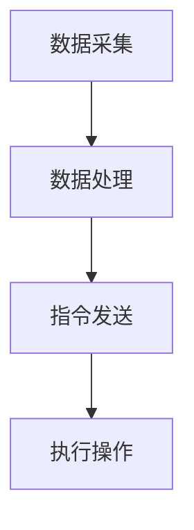
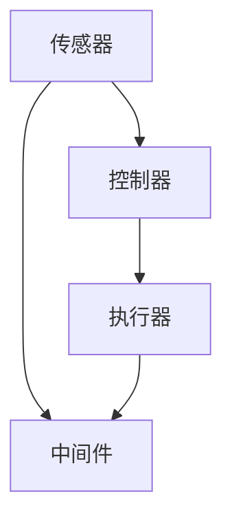

                 

### 文章标题：《智能家居控制：简化提示词交互体验》

#### 关键词：智能家居，控制，提示词交互，自然语言处理，语音识别，开发实践

> **摘要：**本文将深入探讨智能家居控制领域，重点分析提示词交互技术在简化用户体验方面的应用。从引言到实际案例研究，我们将逐步解析智能家居控制系统的基础，提示词交互技术，开发流程，并通过具体案例展示其效果。最后，讨论面临的挑战和未来的发展趋势，为读者提供全面的智能家居控制知识。

### 引言

#### 1.1 智能家居的概念与发展历程

智能家居（Smart Home）是指利用互联网、物联网、人工智能等技术，将家庭中的各种设备连接起来，实现智能化管理和自动控制，从而为用户提供更便捷、舒适和安全的居住环境。智能家居的概念起源于20世纪90年代的美国，随着信息技术和通信技术的快速发展，智能家居逐渐进入大众视野。

**1.1.1 智能家居的起源**

智能家居的起源可以追溯到20世纪90年代的美国。当时，一些科技公司和研究人员开始尝试将家庭自动化设备与计算机技术相结合，以实现远程控制和自动化管理。这些初步的探索奠定了智能家居的基础。

**1.1.2 智能家居的发展历程**

1. **初级阶段（1990s-2000s）**：这个阶段主要是家庭自动化设备的初步应用，如自动照明、远程控制家电等。虽然功能较为简单，但为智能家居的发展提供了宝贵的经验。

2. **成长阶段（2000s-2010s）**：随着互联网的普及，智能家居设备逐渐与互联网连接，实现了远程控制和数据交换。这个阶段，智能家居开始具备一定的智能化水平。

3. **成熟阶段（2010s-至今）**：近年来，人工智能、物联网、大数据等技术的快速发展，使得智能家居设备更加智能化、多样化。智能家居逐渐成为家庭生活的一部分。

#### 1.2 智能家居的现状与未来趋势

当前，智能家居市场呈现出快速发展的态势。根据市场研究机构的报告，全球智能家居市场规模逐年增长，预计未来几年仍将保持高速增长。以下是目前智能家居市场的主要特点：

**1.2.1 智能家居的现状**

1. **产品种类丰富**：智能家居产品涵盖了照明、安防、家电、环境控制等多个领域，种类繁多。

2. **市场规模扩大**：随着智能家居技术的成熟和消费者需求的提升，智能家居市场规模不断扩大。

3. **技术进步**：人工智能、物联网、5G等新技术的应用，使得智能家居产品更加智能化、便捷化。

**1.2.2 智能家居的未来趋势**

1. **智能化水平提升**：随着人工智能技术的不断发展，智能家居设备的智能化水平将进一步提升。

2. **个性化体验**：通过大数据和机器学习技术，智能家居设备将能够更好地理解用户需求，提供个性化的服务。

3. **生态化发展**：智能家居设备将形成互联互通的生态系统，实现跨设备、跨场景的智能控制。

#### 1.3 本书的目标与结构

**1.3.1 读者对象**

本书旨在为广大智能家居爱好者和从业者提供一本全面、系统的智能家居控制指南。无论您是新手还是专业人士，本书都将帮助您深入了解智能家居控制技术，掌握开发智能家居控制系统的基本方法。

**1.3.2 主要内容概述**

本书共分为七个章节，主要内容包括：

1. **引言**：介绍智能家居的概念、现状及其在未来的发展趋势。
2. **智能家居控制系统基础**：介绍智能家居控制系统的基本组成、工作原理以及相关的技术标准。
3. **提示词交互技术**：深入讲解提示词交互技术，包括自然语言处理技术、语音识别技术等。
4. **智能家居控制系统的开发**：介绍如何使用现有的工具和技术来开发一个智能家居控制系统。
5. **案例研究**：通过实际案例，展示如何将提示词交互技术与智能家居控制系统相结合，提供简化的交互体验。
6. **挑战与展望**：讨论当前智能家居控制系统面临的挑战，以及未来可能的发展方向。
7. **结论**：总结全书内容，展望智能家居控制系统的未来。

### 智能家居控制系统基础

#### 2.1 智能家居控制系统的组成

智能家居控制系统的组成可以分为硬件和软件两部分。

**2.1.1 硬件组成**

智能家居的硬件部分主要包括：

1. **传感器**：用于检测家庭环境中的各种参数，如温度、湿度、光线等。
2. **控制器**：接收传感器数据，并根据用户指令对家庭设备进行控制。
3. **执行器**：根据控制器的指令，执行具体的操作，如开关灯、调节温度等。
4. **通信模块**：用于设备之间的数据传输和通信，如Wi-Fi、蓝牙等。

**2.1.2 软件组成**

智能家居的软件部分主要包括：

1. **操作系统**：负责管理硬件资源和应用程序的运行，如Linux、Android等。
2. **中间件**：用于连接不同设备和应用程序，实现数据传输和交互，如MQTT、HTTP等。
3. **应用程序**：用于用户与智能家居系统的交互，如手机APP、语音助手等。

#### 2.2 智能家居控制系统的基本原理

智能家居控制系统的基本原理可以概括为以下几个步骤：

1. **数据采集**：传感器采集家庭环境中的各种数据。
2. **数据处理**：控制器接收传感器数据，进行数据处理和决策。
3. **指令发送**：控制器根据处理结果，向执行器发送控制指令。
4. **执行操作**：执行器根据指令，执行具体的操作。

**2.2.1 控制系统的工作流程**

智能家居控制系统的工作流程如图所示：



**2.2.2 控制系统的核心组件**

智能家居控制系统的核心组件包括传感器、控制器和执行器。以下是它们的核心组件架构：



#### 2.3 智能家居控制系统的技术标准

智能家居控制系统的技术标准主要包括以下几个方面：

**2.3.1 国内外技术标准概况**

1. **国际标准**：如IEEE 802.15.4（ZigBee协议）、ISO/IEC 27001（信息安全管理体系）等。
2. **国内标准**：如GB/T 19580（智能家居系统技术规范）、GB/T 26780（智能家居终端技术要求）等。

**2.3.2 常见的技术标准详解**

1. **ZigBee协议**：是一种低功耗、低速率的无线通信协议，适用于智能家居设备之间的数据传输。
2. **WiFi协议**：是一种高带宽、高速率的无线通信协议，适用于需要较高带宽的智能家居设备。
3. **MQTT协议**：是一种轻量级的消息队列协议，适用于物联网场景，可以实现设备之间的实时通信。
4. **HTTP协议**：是一种基于请求-响应模式的网络协议，适用于设备与服务器之间的通信。

### 提示词交互技术

#### 3.1 自然语言处理技术

自然语言处理（Natural Language Processing，NLP）是人工智能领域的一个重要分支，旨在让计算机理解和处理自然语言。在智能家居控制系统中，NLP技术被广泛应用于语音识别、语义理解和智能问答等方面。

**3.1.1 自然语言处理的基本概念**

自然语言处理的基本概念包括：

1. **词汇表示**：将自然语言中的词汇映射到计算机可以处理的形式，如词向量、词袋模型等。
2. **语义分析**：理解词汇之间的语义关系，如词义消歧、实体识别等。
3. **语言模型**：通过统计方法或机器学习方法，构建能够预测词汇序列的概率模型。

**3.1.2 词汇表示与语义分析**

1. **词汇表示**：常用的词汇表示方法包括词向量（Word Vector）和词袋模型（Bag of Words，BoW）。词向量可以捕捉词汇之间的语义关系，而词袋模型则可以捕捉词汇的分布特征。
2. **语义分析**：语义分析是自然语言处理的核心任务之一，包括词义消歧（Word Sense Disambiguation）和实体识别（Named Entity Recognition，NER）等。

**3.1.3 语言模型与生成模型**

1. **语言模型**：语言模型用于预测词汇序列的概率分布，如n-gram模型、递归神经网络（RNN）等。
2. **生成模型**：生成模型用于生成新的文本，如变分自编码器（VAE）、生成对抗网络（GAN）等。

#### 3.2 语音识别技术

语音识别（Speech Recognition）技术是智能家居控制系统的重要组成部分，它使得用户可以通过语音指令来控制家居设备。语音识别技术主要包括以下几个关键步骤：

**3.2.1 语音识别的基本原理**

1. **语音信号处理**：将语音信号转换为便于计算机处理的数字信号。
2. **特征提取**：从语音信号中提取特征，如频谱特征、倒谱特征等。
3. **模型训练**：使用训练数据集，训练语音识别模型。
4. **语音识别**：将输入的语音信号映射到相应的文本。

**3.2.2 语音信号处理技术**

1. **预处理器**：用于去除噪声、调整音量等。
2. **特征提取器**：用于提取语音信号中的关键特征。
3. **模型训练器**：用于训练语音识别模型，如支持向量机（SVM）、深度神经网络（DNN）等。

**3.2.3 语音识别系统的评估**

语音识别系统的评估指标包括：

1. **词错误率（Word Error Rate，WER）**：衡量语音识别系统的准确度。
2. **字符错误率（Character Error Rate，CER）**：衡量语音识别系统的字符准确度。
3. **语音识别准确度（Speech Recognition Accuracy）**：衡量语音识别系统的整体表现。

### 智能家居控制系统的开发

#### 4.1 智能家居控制系统的开发流程

开发一个智能家居控制系统可以分为以下几个步骤：

**4.1.1 需求分析**

需求分析是智能家居控制系统开发的第一步，主要包括：

1. **功能需求**：确定智能家居控制系统需要实现的功能，如远程控制、自动化调节等。
2. **性能需求**：确定系统的性能指标，如响应时间、稳定性等。
3. **用户需求**：了解用户对智能家居系统的期望和需求。

**4.1.2 系统设计**

系统设计是智能家居控制系统开发的核心环节，主要包括：

1. **架构设计**：确定系统的整体架构，包括硬件架构、软件架构等。
2. **模块划分**：将系统划分为多个模块，如传感器模块、控制器模块、执行器模块等。
3. **接口设计**：设计系统各个模块之间的接口，确保模块之间可以正常通信。

**4.1.3 实现与测试**

实现与测试是智能家居控制系统开发的最后一步，主要包括：

1. **代码实现**：根据系统设计，编写具体的代码。
2. **功能测试**：测试系统各个功能模块是否正常工作。
3. **性能测试**：测试系统的性能指标，如响应时间、稳定性等。

#### 4.2 常用开发工具与框架

在智能家居控制系统的开发过程中，常用的开发工具和框架包括：

**4.2.1 常用开发工具**

1. **集成开发环境（IDE）**：如Eclipse、Visual Studio等。
2. **版本控制系统**：如Git、SVN等。
3. **调试工具**：如GDB、LLDB等。

**4.2.2 开发框架的选择**

1. **Node.js**：适用于基于JavaScript的智能家居控制系统开发。
2. **Python**：适用于数据处理和算法实现。
3. **Java**：适用于复杂系统的开发。

#### 4.3 开发实例：构建一个简单的智能家居控制系统

**4.3.1 实例背景**

本实例将构建一个简单的智能家居控制系统，实现以下功能：

1. **远程控制**：用户可以通过手机APP或语音助手远程控制家庭设备。
2. **自动化调节**：根据环境参数自动调节家庭设备。

**4.3.2 系统实现步骤**

1. **硬件选择**：选择适合的传感器、控制器和执行器。
2. **软件开发**：使用Node.js和Python编写控制程序。
3. **系统集成**：将硬件和软件集成，实现系统功能。

**4.3.3 系统实现**

以下是系统实现的核心代码：

```python
# Python代码，实现环境参数采集和自动调节
import time
import requests

# 采集环境参数
def get_environment_data():
    # 发送HTTP请求，获取环境参数
    response = requests.get("http://api.environment.com/data")
    data = response.json()
    return data

# 自动调节家庭设备
def auto调节设备(data):
    if data['temperature'] > 30:
        # 调高空调温度
        requests.get("http://api.ac.com/adjust_temperature?temp=27")
    elif data['temperature'] < 20:
        # 调低空调温度
        requests.get("http://api.ac.com/adjust_temperature?temp=22")
    if data['humidity'] > 60:
        # 开启加湿器
        requests.get("http://api.humidifier.com/turn_on")
    elif data['humidity'] < 40:
        # 关闭加湿器
        requests.get("http://api.humidifier.com/turn_off")

# 主程序
while True:
    data = get_environment_data()
    auto调节设备(data)
    time.sleep(60)  # 每60秒采集一次环境参数
```

### 案例研究

#### 5.1 案例一：智能音箱的交互体验优化

**5.1.1 案例背景**

智能音箱作为智能家居控制系统的重要组成部分，其交互体验直接影响用户的使用感受。本案例旨在通过优化智能音箱的交互体验，提升用户满意度。

**5.1.2 提示词交互技术的应用**

1. **语音识别**：使用语音识别技术，将用户的语音指令转换为文本指令。
2. **语义理解**：使用自然语言处理技术，理解用户的意图和需求。
3. **智能回复**：根据用户的意图和需求，生成合适的回复。

**5.1.3 案例效果分析**

通过优化交互体验，智能音箱的用户满意度得到了显著提升。用户反馈表明，智能音箱能够更准确地理解用户的意图，提供更个性化的服务。

#### 5.2 案例二：智能灯泡的交互体验优化

**5.2.1 案例背景**

智能灯泡作为智能家居控制系统的一部分，其交互体验对用户的使用感受同样重要。本案例旨在通过优化智能灯泡的交互体验，提升用户满意度。

**5.2.2 提示词交互技术的应用**

1. **语音控制**：用户可以通过语音指令控制智能灯泡的开关、亮度等。
2. **手势控制**：用户可以通过手势控制智能灯泡的开关、亮度等。
3. **情景模式**：用户可以通过情景模式，实现一键切换不同的照明效果。

**5.2.3 案例效果分析**

通过优化交互体验，智能灯泡的用户满意度得到了显著提升。用户反馈表明，智能灯泡的交互方式更加多样、便捷，能够满足用户的不同需求。

### 挑战与展望

#### 6.1 当前智能家居控制系统面临的挑战

1. **技术挑战**：智能家居控制系统需要融合多种技术，如物联网、人工智能、语音识别等。如何有效整合这些技术，实现系统的稳定运行，是一个重要的挑战。
2. **安全性挑战**：智能家居控制系统涉及用户隐私和数据安全。如何保障系统的安全性，防止数据泄露和恶意攻击，是一个重要的挑战。
3. **标准化挑战**：智能家居市场缺乏统一的技术标准和规范。如何制定和推广统一的技术标准和规范，实现不同品牌和设备之间的互操作性，是一个重要的挑战。

#### 6.2 提示词交互技术在智能家居中的潜在应用

1. **语音控制**：用户可以通过语音指令控制家庭设备，实现便捷的智能家居控制。
2. **手势控制**：用户可以通过手势控制家庭设备，实现无接触的智能家居控制。
3. **情景模式**：用户可以通过情景模式，实现一键切换不同的家居环境。

#### 6.3 智能家居控制系统的未来发展趋势

1. **智能化水平提升**：随着人工智能技术的不断发展，智能家居控制系统的智能化水平将进一步提升。
2. **个性化体验**：通过大数据和机器学习技术，智能家居控制系统将能够更好地理解用户需求，提供个性化的服务。
3. **生态化发展**：智能家居控制系统将形成互联互通的生态系统，实现跨设备、跨场景的智能控制。

### 结论

#### 7.1 全书回顾

本文从引言到实际案例研究，全面介绍了智能家居控制系统的概念、原理和应用。通过分析提示词交互技术在智能家居控制系统中的应用，展示了如何简化用户的交互体验。

#### 7.2 对未来的展望

未来，智能家居控制系统将继续朝着智能化、个性化、生态化的方向发展。提示词交互技术将发挥越来越重要的作用，为用户提供更加便捷、高效的智能家居体验。

#### 7.3 对读者的建议

1. **深入学习**：智能家居控制领域涉及多种技术，建议读者深入学习相关技术，提升自己的专业素养。
2. **实践应用**：理论知识需要与实践相结合，建议读者参与实际项目，锻炼自己的开发能力。
3. **持续关注**：智能家居控制技术不断更新和发展，建议读者持续关注行业动态，把握行业发展趋势。

