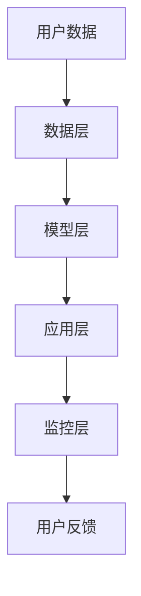
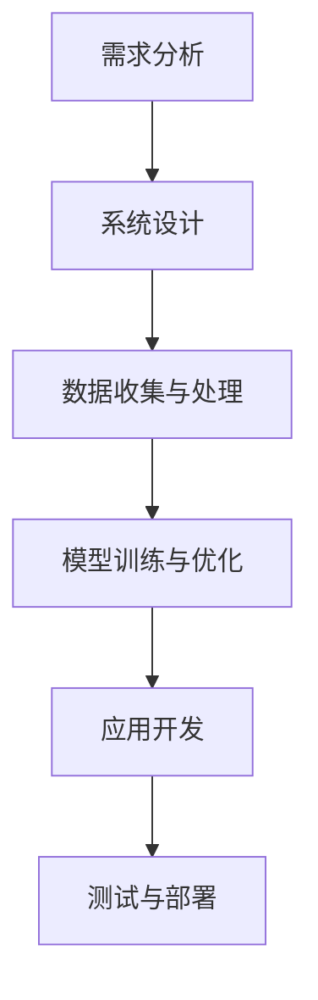

                 


### 文章标题

智能广告投放:AI大模型优化广告效果

### 文章关键词

- 智能广告投放
- AI大模型
- 广告效果优化
- 数据处理
- 广告策略
- 广告创意

### 文章摘要

本文将深入探讨智能广告投放领域，重点分析AI大模型在广告效果优化中的应用。首先，我们将介绍智能广告投放的基本概念和市场现状，然后详细解释AI大模型的原理及其在广告投放中的优势与挑战。接着，文章将逐步解析AI大模型在数据收集与处理、广告投放策略优化、广告创意生成以及广告效果评估与反馈等方面的应用。通过具体案例的分析和实战指南，本文旨在为读者提供全面的智能广告投放实战经验和未来展望。

## 第一部分：背景与概述

### 第1章：智能广告投放概述

#### 1.1.1 智能广告投放的定义与市场现状

智能广告投放是指利用人工智能技术，通过大数据分析和算法优化，自动选择合适的目标受众、时间和地点，进行广告投放的活动。随着互联网和移动设备的普及，广告投放已经成为了企业获取用户、提高品牌知名度和促进销售的重要手段。

当前，智能广告投放市场呈现出快速发展的态势。根据市场研究公司的数据，全球智能广告投放市场规模预计将在未来几年内持续增长。尤其是随着AI技术的不断进步，AI大模型在广告投放中的应用也越来越广泛。

#### 1.1.2 广告投放中的AI技术

在广告投放过程中，AI技术发挥着至关重要的作用。首先，AI可以自动化广告投放的流程，提高投放效率。其次，AI可以通过大数据分析，精确地了解用户行为和偏好，从而实现精准投放。此外，AI还可以利用机器学习算法，不断优化广告策略，提高广告效果。

AI在广告投放中的应用主要包括以下几个方面：

1. **用户行为分析**：通过分析用户在互联网上的行为数据，了解用户兴趣、购买意图等，从而实现精准投放。
2. **广告创意优化**：利用自然语言处理技术，自动生成广告文案和图片，提高广告的吸引力和转化率。
3. **投放策略优化**：通过机器学习算法，自动调整广告投放的时间、地点和投放频率，提高广告效果。
4. **广告效果评估**：利用大数据分析技术，对广告效果进行实时监测和评估，及时调整广告策略。

#### 1.1.3 智能广告投放的优势与挑战

智能广告投放具有以下优势：

1. **提高广告效果**：通过精准投放和优化策略，提高广告的点击率、转化率和 ROI。
2. **降低投放成本**：自动化广告投放流程，减少人力成本和投放误差。
3. **提升用户体验**：减少无关广告的投放，提高用户对广告的满意度。

然而，智能广告投放也面临一些挑战：

1. **数据隐私**：广告投放过程中涉及大量用户数据，如何保护用户隐私成为一大挑战。
2. **算法透明度**：AI算法的决策过程往往不透明，如何保证算法的公平性和可解释性是一个问题。
3. **技术门槛**：智能广告投放需要较高的技术门槛，对企业的技术能力和人才储备提出了较高要求。

### 第2章：AI大模型与广告投放

#### 2.1.1 AI大模型概述

AI大模型是指具有大规模参数、复杂结构和强大处理能力的深度学习模型。这些模型通常通过大规模数据训练，能够自动学习并提取数据中的特征和模式，从而实现高性能的预测和决策。

AI大模型在广告投放中的应用主要包括以下几个方面：

1. **用户行为预测**：通过分析用户的历史行为数据，预测用户对广告的响应概率，实现精准投放。
2. **广告创意生成**：利用自然语言处理和图像生成技术，自动生成具有吸引力的广告创意。
3. **投放策略优化**：通过机器学习算法，自动调整广告投放的时间和地点，提高广告效果。
4. **广告效果评估**：利用大数据分析技术，对广告效果进行实时监测和评估，及时调整广告策略。

#### 2.1.2 AI大模型在广告投放中的应用

AI大模型在广告投放中的应用案例非常丰富。例如：

1. **用户画像**：通过AI大模型分析用户行为数据，构建用户画像，实现精准投放。
2. **广告创意生成**：利用生成对抗网络（GAN）等技术，自动生成多样化的广告创意。
3. **投放策略优化**：通过强化学习等技术，自动调整广告投放策略，提高广告效果。
4. **广告效果评估**：利用迁移学习等技术，对广告效果进行实时监测和评估，提高广告转化率。

#### 2.1.3 AI大模型的优势与局限

AI大模型在广告投放中具有以下优势：

1. **高效处理大量数据**：能够快速处理和分析大量用户数据，实现精准投放。
2. **自动优化策略**：通过机器学习算法，自动调整广告投放策略，提高广告效果。
3. **降低人力成本**：自动化广告投放流程，减少人力成本和投放误差。

然而，AI大模型也面临一些局限：

1. **数据依赖性**：需要大量高质量的数据进行训练，否则难以保证模型的效果。
2. **算法可解释性**：深度学习模型的决策过程往往不透明，难以解释。
3. **计算资源需求**：训练和部署AI大模型需要较高的计算资源，对企业的技术能力提出了较高要求。

## 第二部分：AI大模型在广告投放中的应用

### 第3章：数据收集与处理

#### 3.1.1 广告投放中的数据来源

广告投放中的数据来源主要包括以下几个方面：

1. **用户行为数据**：如访问记录、点击记录、购买记录等。
2. **广告数据**：如广告展示次数、点击次数、转化次数等。
3. **环境数据**：如地理位置、天气状况、节假日等。

#### 3.1.2 数据收集与处理的挑战

数据收集与处理过程中面临以下挑战：

1. **数据质量**：数据质量直接影响模型的准确性。需要处理缺失值、异常值和噪声数据。
2. **数据隐私**：广告投放过程中涉及大量用户数据，需要确保数据隐私和安全。
3. **数据多样性**：用户行为和环境数据的多样性导致数据处理的复杂性。

#### 3.1.3 数据处理的常用算法

常用的数据处理算法包括：

1. **数据清洗**：处理缺失值、异常值和噪声数据，提高数据质量。
2. **数据归一化**：将不同特征的数据进行归一化处理，使其具有相同的量级。
3. **特征工程**：提取和构建与广告效果相关的特征，提高模型效果。

## 第4章：广告投放策略优化

#### 4.1.1 广告投放策略概述

广告投放策略是指根据广告目标和市场情况，制定合适的广告投放计划和策略。广告投放策略主要包括以下几个方面：

1. **目标受众**：确定广告的目标受众，如年龄、性别、地理位置等。
2. **投放时间**：确定广告的投放时间，如白天、晚上、节假日等。
3. **投放渠道**：确定广告的投放渠道，如搜索引擎、社交媒体、新闻网站等。
4. **投放频率**：确定广告的投放频率，如每天、每周等。

#### 4.1.2 AI大模型在策略优化中的应用

AI大模型在广告投放策略优化中的应用主要包括：

1. **用户行为预测**：通过分析用户历史行为数据，预测用户对广告的响应概率，优化广告投放策略。
2. **广告效果预测**：通过分析广告投放效果数据，预测不同广告投放策略的效果，优化广告投放策略。
3. **投放资源分配**：通过优化算法，自动分配广告投放资源，提高广告效果。

#### 4.1.3 策略优化的效果评估

策略优化的效果评估主要包括以下几个方面：

1. **点击率（CTR）**：评估广告的点击率，判断广告投放策略的效果。
2. **转化率（CVR）**：评估广告的转化率，判断广告投放策略的效果。
3. **ROI（投资回报率）**：评估广告的投资回报率，判断广告投放策略的效果。

## 第5章：广告创意生成

#### 5.1.1 广告创意生成的挑战

广告创意生成过程中面临以下挑战：

1. **多样性**：广告创意需要满足不同用户的需求和兴趣，具有多样性。
2. **吸引力**：广告创意需要具有吸引力，提高用户的点击和转化率。
3. **成本**：广告创意生成需要较高的计算资源和人力成本。

#### 5.1.2 AI大模型在广告创意生成中的应用

AI大模型在广告创意生成中的应用主要包括：

1. **自然语言处理（NLP）**：利用NLP技术，自动生成广告文案，提高文案的吸引力和转化率。
2. **图像生成**：利用生成对抗网络（GAN）等技术，自动生成广告图片，提高图片的视觉效果。
3. **多模态融合**：将文本、图像等多种模态的信息进行融合，生成更加丰富的广告创意。

#### 5.1.3 广告创意生成效果评估

广告创意生成效果评估主要包括以下几个方面：

1. **点击率（CTR）**：评估广告的点击率，判断广告创意的效果。
2. **转化率（CVR）**：评估广告的转化率，判断广告创意的效果。
3. **用户满意度**：通过用户反馈，评估广告创意的用户满意度。

## 第6章：广告效果评估与反馈

#### 6.1.1 广告效果评估的重要性

广告效果评估对于优化广告投放策略、提高广告效果具有重要意义。通过广告效果评估，可以及时发现广告投放中的问题，调整广告策略，提高广告的转化率和 ROI。

#### 6.1.2 广告效果评估的方法与指标

广告效果评估的方法主要包括：

1. **点击率（CTR）**：评估广告的点击率，计算公式为：CTR = 点击次数 / 展示次数。
2. **转化率（CVR）**：评估广告的转化率，计算公式为：CVR = 转化次数 / 点击次数。
3. **ROI（投资回报率）**：评估广告的投资回报率，计算公式为：ROI = （收益 - 成本）/ 成本。

广告效果评估的指标主要包括：

1. **广告效果得分**：综合考虑点击率、转化率和 ROI，评估广告的整体效果。
2. **广告投放成本**：评估广告投放的成本，包括广告费用、人力成本等。
3. **用户反馈**：通过用户反馈，了解广告的效果和用户满意度。

#### 6.1.3 AI大模型在广告效果评估中的应用

AI大模型在广告效果评估中的应用主要包括：

1. **实时监测**：利用大数据分析技术，实时监测广告投放效果，及时发现广告投放中的问题。
2. **预测效果**：通过机器学习算法，预测不同广告投放策略的效果，优化广告投放策略。
3. **反馈机制**：通过用户反馈，不断优化广告创意和投放策略，提高广告效果。

## 第7章：案例分析

#### 7.1.1 案例介绍

本案例以某电商平台的广告投放为例，介绍如何利用AI大模型进行智能广告投放。

#### 7.1.2 案例分析

1. **数据收集与处理**：收集用户行为数据、广告数据和环境数据，进行数据清洗和特征工程。
2. **用户画像**：利用AI大模型分析用户行为数据，构建用户画像。
3. **广告创意生成**：利用自然语言处理和图像生成技术，自动生成广告文案和图片。
4. **投放策略优化**：利用机器学习算法，自动调整广告投放策略，提高广告效果。
5. **广告效果评估**：利用大数据分析技术，实时监测广告投放效果，优化广告创意和投放策略。

#### 7.1.3 案例启示

通过本案例，我们可以得到以下启示：

1. **数据质量**：数据质量直接影响模型的准确性，需要重视数据清洗和特征工程。
2. **用户画像**：用户画像对于精准投放具有重要意义，需要充分利用用户行为数据。
3. **算法优化**：利用机器学习算法，不断优化广告投放策略，提高广告效果。
4. **实时监测**：实时监测广告投放效果，及时调整广告创意和投放策略。

## 第三部分：实践指南

### 第8章：搭建智能广告投放系统

#### 8.1.1 系统架构设计

智能广告投放系统的架构设计主要包括以下几个方面：

1. **数据层**：负责数据的收集、存储和管理。
2. **模型层**：负责广告投放策略的建模和优化。
3. **应用层**：负责广告创意的生成和投放。

#### 8.1.2 系统开发工具与框架

系统开发过程中，可以采用以下工具和框架：

1. **数据存储**：采用Hadoop、Hive等大数据存储和处理工具。
2. **机器学习框架**：采用TensorFlow、PyTorch等深度学习框架。
3. **应用开发**：采用Django、Flask等Web开发框架。

#### 8.1.3 系统开发流程

系统开发流程主要包括以下步骤：

1. **需求分析**：明确广告投放系统的功能需求。
2. **系统设计**：设计系统的架构和模块。
3. **数据收集与处理**：收集和预处理广告投放数据。
4. **模型训练与优化**：训练和优化广告投放策略模型。
5. **应用开发**：开发广告创意生成和投放应用。
6. **测试与部署**：测试系统功能，部署到生产环境。

### 第9章：智能广告投放实战

#### 9.1.1 实战案例介绍

本节将介绍一个电商平台的智能广告投放实战案例，包括数据收集与处理、用户画像构建、广告创意生成、投放策略优化以及广告效果评估等过程。

#### 9.1.2 实战案例实现

1. **数据收集与处理**：收集用户行为数据、广告数据和环境数据，进行数据清洗和特征工程。
2. **用户画像构建**：利用用户行为数据，构建用户画像，包括用户年龄、性别、兴趣爱好等。
3. **广告创意生成**：利用自然语言处理和图像生成技术，自动生成广告文案和图片。
4. **投放策略优化**：利用机器学习算法，自动调整广告投放策略，提高广告效果。
5. **广告效果评估**：利用大数据分析技术，实时监测广告投放效果，优化广告创意和投放策略。

#### 9.1.3 实战案例分析

通过对电商平台的智能广告投放实战案例进行分析，我们可以总结以下经验：

1. **数据质量**：数据质量直接影响模型效果，需要重视数据清洗和特征工程。
2. **用户画像**：用户画像是精准投放的基础，需要充分利用用户行为数据。
3. **算法优化**：利用机器学习算法，不断优化广告投放策略，提高广告效果。
4. **实时监测**：实时监测广告投放效果，及时调整广告创意和投放策略。

### 第10章：未来展望

#### 10.1.1 智能广告投放的发展趋势

未来，智能广告投放将呈现以下发展趋势：

1. **更精准的投放**：随着AI技术的进步，广告投放将更加精准，提高广告效果。
2. **更多的应用场景**：智能广告投放将应用于更多领域，如金融、医疗等。
3. **更多的数据来源**：随着物联网和大数据技术的发展，广告投放的数据来源将更加丰富。

#### 10.1.2 AI大模型在广告投放中的未来应用

未来，AI大模型在广告投放中的应用将更加广泛，包括：

1. **个性化广告**：根据用户行为和偏好，生成个性化的广告。
2. **实时优化**：利用实时数据，动态调整广告投放策略。
3. **跨渠道投放**：实现多渠道、多平台的一体化广告投放。

#### 10.1.3 智能广告投放面临的挑战与机遇

智能广告投放面临的挑战包括：

1. **数据隐私**：如何保护用户隐私成为一个重要问题。
2. **算法透明度**：如何提高算法的透明度和可解释性。
3. **技术门槛**：如何降低技术门槛，让更多企业能够应用智能广告投放。

然而，智能广告投放也带来了许多机遇：

1. **提高广告效果**：通过精准投放和优化策略，提高广告效果。
2. **降低投放成本**：自动化广告投放流程，降低人力成本和投放误差。
3. **提升用户体验**：减少无关广告的投放，提高用户对广告的满意度。

## 总结

智能广告投放是广告投放领域的重要发展趋势，通过AI大模型的应用，可以实现更精准、更高效的广告投放。本文从背景概述、AI大模型应用、实践指南等方面进行了详细分析，旨在为读者提供全面的智能广告投放知识和实践经验。未来，随着AI技术的不断进步，智能广告投放将发挥更大的作用，为企业和用户带来更多价值。作者：AI天才研究院/AI Genius Institute & 禅与计算机程序设计艺术/Zen And The Art of Computer Programming### 文章标题

智能广告投放:AI大模型优化广告效果

### 文章关键词

- 智能广告投放
- AI大模型
- 广告效果优化
- 数据处理
- 广告策略
- 广告创意

### 文章摘要

本文探讨了智能广告投放领域，特别是AI大模型在广告效果优化中的应用。首先介绍了智能广告投放的基本概念和市场现状，随后详细解释了AI大模型的概念及其在广告投放中的优势与挑战。文章进一步分析了AI大模型在数据收集与处理、广告投放策略优化、广告创意生成以及广告效果评估与反馈等方面的应用。通过实际案例分析和实战指南，本文旨在为读者提供全面的智能广告投放实战经验和未来展望。作者：AI天才研究院/AI Genius Institute & 禅与计算机程序设计艺术/Zen And The Art of Computer Programming## 第一部分：背景与概述

### 第1章：智能广告投放概述

#### 1.1.1 智能广告投放的定义与市场现状

智能广告投放是一种利用人工智能技术，通过数据分析和算法优化，自动选择目标受众、时间和地点进行广告投放的方式。在传统的广告投放模式中，广告主需要依赖广告代理商进行广告位的采购、广告创意的制作以及广告投放的调度，这些过程往往耗时且成本较高。而智能广告投放则通过算法和数据的驱动，能够更精准地定位用户，提高广告投放的效果和效率。

目前，智能广告投放市场正处于快速增长阶段。随着互联网的普及和用户在线行为的多样化，广告主对精准营销的需求日益增加，推动了智能广告投放技术的发展。根据市场研究机构的报告，全球智能广告投放市场预计将在未来几年内保持高速增长，尤其是在人工智能和大数据技术的推动下，市场前景更加广阔。

#### 1.1.2 广告投放中的AI技术

AI技术在广告投放中的应用已经成为行业的发展趋势。以下是AI技术在广告投放中的一些具体应用：

1. **用户行为分析**：通过分析用户在互联网上的行为数据，包括浏览记录、搜索历史、点击行为等，可以更深入地了解用户的需求和兴趣，从而进行精准投放。

2. **广告创意优化**：利用自然语言处理（NLP）和计算机视觉技术，可以自动生成和优化广告文案和图片，提高广告的吸引力和转化率。

3. **投放策略优化**：通过机器学习和优化算法，可以根据广告投放的实时反馈，自动调整广告的投放时间、地点和频率，实现最优的投放效果。

4. **广告效果评估**：利用大数据分析技术，可以对广告效果进行实时监测和评估，通过分析点击率（CTR）、转化率（CVR）等指标，评估广告的投放效果，并据此调整广告策略。

#### 1.1.3 智能广告投放的优势与挑战

智能广告投放的优势主要体现在以下几个方面：

1. **提高广告效果**：通过数据分析和算法优化，可以实现更精准的广告投放，提高广告的点击率和转化率。

2. **降低投放成本**：自动化广告投放流程，减少人力成本和投放误差，提高广告投放的效率。

3. **提升用户体验**：通过精准投放，减少无关广告的展示，提高用户的广告体验。

然而，智能广告投放也面临一些挑战：

1. **数据隐私**：广告投放过程中涉及大量用户数据，如何保护用户隐私成为一大挑战。

2. **算法透明度**：AI算法的决策过程往往不透明，如何保证算法的公平性和可解释性是一个问题。

3. **技术门槛**：智能广告投放需要较高的技术能力和人才储备，对企业的技术门槛提出了较高要求。

### 第2章：AI大模型与广告投放

#### 2.1.1 AI大模型概述

AI大模型是指具有大规模参数、复杂结构和强大处理能力的深度学习模型。这些模型通常通过大规模数据训练，能够自动学习并提取数据中的特征和模式，从而实现高性能的预测和决策。AI大模型的发展得益于计算能力的提升、大数据技术的进步以及深度学习算法的创新。

AI大模型在广告投放中的应用主要包括以下几个方面：

1. **用户行为预测**：通过分析用户的历史行为数据，预测用户对广告的响应概率，从而实现精准投放。

2. **广告创意生成**：利用自然语言处理和计算机视觉技术，自动生成和优化广告文案和图片，提高广告的吸引力。

3. **投放策略优化**：通过机器学习算法，自动调整广告投放的时间、地点和频率，提高广告效果。

4. **广告效果评估**：利用大数据分析技术，对广告效果进行实时监测和评估，及时调整广告策略。

#### 2.1.2 AI大模型在广告投放中的应用

AI大模型在广告投放中的应用已经取得了显著的成果。以下是一些典型的应用案例：

1. **用户画像**：通过AI大模型分析用户的历史行为数据，构建精准的用户画像，实现个性化广告投放。

2. **广告创意生成**：利用生成对抗网络（GAN）等技术，自动生成多种风格的广告创意，提高广告的吸引力。

3. **投放策略优化**：通过强化学习算法，根据广告投放的实时反馈，动态调整广告策略，实现最优的投放效果。

4. **广告效果评估**：利用迁移学习技术，对广告效果进行实时监测和评估，及时发现并优化广告策略。

#### 2.1.3 AI大模型的优势与局限

AI大模型在广告投放中具有以下优势：

1. **高效处理大量数据**：AI大模型能够快速处理和分析大量用户数据，实现精准投放。

2. **自动优化策略**：通过机器学习算法，AI大模型可以自动优化广告投放策略，提高广告效果。

3. **降低人力成本**：自动化广告投放流程，减少人力成本和投放误差。

然而，AI大模型也面临一些局限：

1. **数据依赖性**：AI大模型需要大量高质量的数据进行训练，否则难以保证模型的效果。

2. **算法可解释性**：深度学习模型的决策过程往往不透明，难以解释。

3. **计算资源需求**：训练和部署AI大模型需要较高的计算资源，对企业的技术能力提出了较高要求。

## 第二部分：AI大模型在广告投放中的应用

### 第3章：数据收集与处理

#### 3.1.1 广告投放中的数据来源

广告投放中的数据来源主要包括以下几个方面：

1. **用户行为数据**：包括用户的浏览记录、点击记录、购买记录等，这些数据能够反映用户的行为习惯和兴趣偏好。

2. **广告数据**：包括广告展示次数、点击次数、转化次数等，这些数据能够反映广告的效果和用户对广告的响应。

3. **环境数据**：包括地理位置、天气状况、节假日等，这些数据能够影响广告的投放效果。

#### 3.1.2 数据收集与处理的挑战

在广告投放中，数据收集与处理面临以下挑战：

1. **数据质量**：数据质量直接影响模型的准确性。需要处理缺失值、异常值和噪声数据，确保数据的一致性和可靠性。

2. **数据隐私**：广告投放过程中涉及大量用户数据，如何保护用户隐私成为一大挑战。

3. **数据多样性**：用户行为和环境数据的多样性导致数据处理的复杂性。需要构建合适的特征，将多源异构数据进行整合和分析。

#### 3.1.3 数据处理的常用算法

在广告投放中，常用的数据处理算法包括：

1. **数据清洗**：处理缺失值、异常值和噪声数据，提高数据质量。

2. **数据归一化**：将不同特征的数据进行归一化处理，使其具有相同的量级。

3. **特征工程**：提取和构建与广告效果相关的特征，提高模型效果。

### 第4章：广告投放策略优化

#### 4.1.1 广告投放策略概述

广告投放策略是指根据广告目标和市场情况，制定合适的广告投放计划和策略。广告投放策略主要包括以下几个方面：

1. **目标受众**：确定广告的目标受众，如年龄、性别、地理位置、兴趣爱好等。

2. **投放时间**：确定广告的投放时间，如白天、晚上、节假日等。

3. **投放渠道**：确定广告的投放渠道，如搜索引擎、社交媒体、新闻网站、视频平台等。

4. **投放频率**：确定广告的投放频率，如每天、每周、每月等。

#### 4.1.2 AI大模型在策略优化中的应用

AI大模型在广告投放策略优化中的应用主要包括以下几个方面：

1. **用户行为预测**：通过分析用户的历史行为数据，预测用户对广告的响应概率，为广告投放提供决策依据。

2. **广告效果预测**：通过分析广告投放的效果数据，预测不同广告投放策略的效果，优化广告投放策略。

3. **投放资源分配**：通过优化算法，自动分配广告投放资源，提高广告投放的效率和效果。

#### 4.1.3 策略优化的效果评估

广告投放策略优化的效果评估主要包括以下几个方面：

1. **点击率（CTR）**：评估广告的点击率，判断广告投放策略的效果。

2. **转化率（CVR）**：评估广告的转化率，判断广告投放策略的效果。

3. **投资回报率（ROI）**：评估广告的投资回报率，判断广告投放策略的盈利能力。

### 第5章：广告创意生成

#### 5.1.1 广告创意生成的挑战

广告创意生成是广告投放中至关重要的一环，其挑战主要包括：

1. **多样性**：广告创意需要满足不同用户的需求和兴趣，具有多样性。

2. **吸引力**：广告创意需要具有吸引力，提高用户的点击和转化率。

3. **成本**：广告创意生成需要较高的计算资源和人力成本。

#### 5.1.2 AI大模型在广告创意生成中的应用

AI大模型在广告创意生成中的应用主要包括以下几个方面：

1. **自然语言处理（NLP）**：利用NLP技术，自动生成广告文案，提高文案的吸引力和转化率。

2. **计算机视觉（CV）**：利用计算机视觉技术，自动生成广告图片，提高图片的视觉效果。

3. **多模态融合**：将文本、图像等多种模态的信息进行融合，生成更加丰富的广告创意。

#### 5.1.3 广告创意生成效果评估

广告创意生成效果评估主要包括以下几个方面：

1. **点击率（CTR）**：评估广告的点击率，判断广告创意的效果。

2. **转化率（CVR）**：评估广告的转化率，判断广告创意的效果。

3. **用户满意度**：通过用户反馈，评估广告创意的用户满意度。

### 第6章：广告效果评估与反馈

#### 6.1.1 广告效果评估的重要性

广告效果评估是广告投放过程中的关键环节，其重要性体现在：

1. **优化广告策略**：通过评估广告效果，可以及时调整广告投放策略，提高广告效果。

2. **提高投资回报率**：通过评估广告效果，可以评估广告的投资回报率，优化广告预算分配。

3. **反馈机制**：广告效果评估可以为后续的广告投放提供数据支持，形成良好的反馈机制。

#### 6.1.2 广告效果评估的方法与指标

广告效果评估的方法和指标主要包括以下几个方面：

1. **点击率（CTR）**：评估广告的点击率，计算公式为：CTR = 点击次数 / 展示次数。

2. **转化率（CVR）**：评估广告的转化率，计算公式为：CVR = 转化次数 / 点击次数。

3. **投资回报率（ROI）**：评估广告的投资回报率，计算公式为：ROI = （收益 - 成本）/ 成本。

4. **广告效果得分**：综合考虑点击率、转化率和 ROI，评估广告的整体效果。

#### 6.1.3 AI大模型在广告效果评估中的应用

AI大模型在广告效果评估中的应用主要包括以下几个方面：

1. **实时监测**：利用大数据分析技术，实时监测广告投放效果，及时发现广告投放中的问题。

2. **效果预测**：通过机器学习算法，预测不同广告投放策略的效果，优化广告投放策略。

3. **反馈机制**：通过用户反馈，不断优化广告创意和投放策略，提高广告效果。

### 第7章：案例分析

#### 7.1.1 案例介绍

本案例以某电商平台的广告投放为例，介绍如何利用AI大模型进行智能广告投放。该电商平台希望通过智能广告投放提高用户转化率和销售额。

#### 7.1.2 案例分析

1. **数据收集与处理**：收集用户行为数据、广告数据和环境数据，进行数据清洗和特征工程。

2. **用户画像构建**：利用用户行为数据，构建用户画像，包括用户年龄、性别、兴趣爱好等。

3. **广告创意生成**：利用自然语言处理和计算机视觉技术，自动生成广告文案和图片。

4. **投放策略优化**：利用机器学习算法，自动调整广告投放策略，提高广告效果。

5. **广告效果评估**：利用大数据分析技术，实时监测广告投放效果，优化广告创意和投放策略。

#### 7.1.3 案例启示

通过本案例，我们可以得到以下启示：

1. **数据质量**：数据质量直接影响模型效果，需要重视数据清洗和特征工程。

2. **用户画像**：用户画像是精准投放的基础，需要充分利用用户行为数据。

3. **算法优化**：利用机器学习算法，不断优化广告投放策略，提高广告效果。

4. **实时监测**：实时监测广告投放效果，及时调整广告创意和投放策略。

## 第三部分：实践指南

### 第8章：搭建智能广告投放系统

#### 8.1.1 系统架构设计

智能广告投放系统的架构设计主要包括以下几个层次：

1. **数据层**：负责数据的收集、存储和管理。通常采用大数据技术，如Hadoop、Spark等。

2. **模型层**：负责广告投放策略的建模和优化。采用深度学习框架，如TensorFlow、PyTorch等。

3. **应用层**：负责广告创意的生成和投放。采用Web开发框架，如Django、Flask等。

#### 8.1.2 系统开发工具与框架

在系统开发过程中，常用的工具和框架包括：

1. **数据存储**：使用Hadoop、Hive等大数据存储和处理工具。

2. **机器学习框架**：使用TensorFlow、PyTorch等深度学习框架。

3. **应用开发**：使用Django、Flask等Web开发框架。

#### 8.1.3 系统开发流程

智能广告投放系统的开发流程主要包括以下几个阶段：

1. **需求分析**：明确系统功能需求，包括数据收集、处理、模型训练、广告创意生成等。

2. **系统设计**：设计系统的架构和模块，包括数据层、模型层、应用层等。

3. **数据收集与处理**：收集用户行为数据、广告数据和环境数据，进行数据清洗和特征工程。

4. **模型训练与优化**：训练广告投放策略模型，优化模型性能。

5. **应用开发**：开发广告创意生成和投放应用，实现系统的功能。

6. **测试与部署**：测试系统功能，部署到生产环境。

### 第9章：智能广告投放实战

#### 9.1.1 实战案例介绍

本节将介绍一个电商平台的智能广告投放实战案例，包括数据收集与处理、用户画像构建、广告创意生成、投放策略优化以及广告效果评估等过程。

#### 9.1.2 实战案例实现

1. **数据收集与处理**：收集用户行为数据、广告数据和环境数据，进行数据清洗和特征工程。

2. **用户画像构建**：利用用户行为数据，构建用户画像，包括用户年龄、性别、兴趣爱好等。

3. **广告创意生成**：利用自然语言处理和计算机视觉技术，自动生成广告文案和图片。

4. **投放策略优化**：利用机器学习算法，自动调整广告投放策略，提高广告效果。

5. **广告效果评估**：利用大数据分析技术，实时监测广告投放效果，优化广告创意和投放策略。

#### 9.1.3 实战案例分析

通过对电商平台的智能广告投放实战案例进行分析，我们可以总结以下经验：

1. **数据质量**：数据质量直接影响模型效果，需要重视数据清洗和特征工程。

2. **用户画像**：用户画像是精准投放的基础，需要充分利用用户行为数据。

3. **算法优化**：利用机器学习算法，不断优化广告投放策略，提高广告效果。

4. **实时监测**：实时监测广告投放效果，及时调整广告创意和投放策略。

### 第10章：未来展望

#### 10.1.1 智能广告投放的发展趋势

未来，智能广告投放将呈现以下发展趋势：

1. **更精准的投放**：随着AI技术的进步，广告投放将更加精准，提高广告效果。

2. **更多的应用场景**：智能广告投放将应用于更多领域，如金融、医疗等。

3. **更多的数据来源**：随着物联网和大数据技术的发展，广告投放的数据来源将更加丰富。

#### 10.1.2 AI大模型在广告投放中的未来应用

未来，AI大模型在广告投放中的应用将更加广泛，包括：

1. **个性化广告**：根据用户行为和偏好，生成个性化的广告。

2. **实时优化**：利用实时数据，动态调整广告投放策略。

3. **跨渠道投放**：实现多渠道、多平台的一体化广告投放。

#### 10.1.3 智能广告投放面临的挑战与机遇

智能广告投放面临的挑战包括：

1. **数据隐私**：如何保护用户隐私成为一个重要问题。

2. **算法透明度**：如何提高算法的透明度和可解释性。

3. **技术门槛**：如何降低技术门槛，让更多企业能够应用智能广告投放。

然而，智能广告投放也带来了许多机遇：

1. **提高广告效果**：通过精准投放和优化策略，提高广告效果。

2. **降低投放成本**：自动化广告投放流程，降低人力成本和投放误差。

3. **提升用户体验**：减少无关广告的投放，提高用户对广告的满意度。

## 总结

智能广告投放是广告投放领域的重要发展趋势，通过AI大模型的应用，可以实现更精准、更高效的广告投放。本文从背景概述、AI大模型应用、实践指南等方面进行了详细分析，旨在为读者提供全面的智能广告投放知识和实践经验。未来，随着AI技术的不断进步，智能广告投放将发挥更大的作用，为企业和用户带来更多价值。作者：AI天才研究院/AI Genius Institute & 禅与计算机程序设计艺术/Zen And The Art of Computer Programming### 第1章：智能广告投放概述

#### 1.1.1 智能广告投放的定义与市场现状

智能广告投放，顾名思义，是结合了人工智能技术的广告投放方式。它通过分析用户的在线行为、兴趣偏好以及历史购买记录等数据，利用机器学习和数据挖掘技术，自动识别和定位潜在客户，进而实现广告的精准投放。这种方式不仅提高了广告的点击率和转化率，还能有效地降低广告成本，实现高效的市场营销。

当前，智能广告投放已经成为广告行业的重要趋势。根据市场研究机构的数据，全球智能广告投放市场正以超过30%的年增长率迅速扩展。这一增长主要得益于以下几个因素：

1. **技术进步**：人工智能、大数据和机器学习等技术的快速发展，为智能广告投放提供了强大的技术支持。
2. **用户行为数据**：互联网用户产生的海量行为数据，为智能广告投放提供了丰富的数据资源。
3. **广告主需求**：随着市场竞争的加剧，广告主对精准营销的需求日益增长，智能广告投放正好满足了这一需求。

智能广告投放的市场现状可以概括为以下几点：

1. **市场规模不断扩大**：随着技术的进步和应用的普及，智能广告投放的市场规模正在快速增长。
2. **技术发展迅速**：各种AI技术的不断革新，如深度学习、自然语言处理、图像识别等，都在不断推动智能广告投放的发展。
3. **应用场景丰富**：从搜索引擎广告到社交媒体广告，再到视频广告，智能广告投放已经在各种广告形式中得到了广泛应用。

#### 1.1.2 广告投放中的AI技术

在广告投放中，AI技术的作用不可忽视。以下是AI技术在广告投放中的几个关键应用：

1. **用户行为分析**：通过分析用户的浏览历史、搜索记录、点击行为等数据，AI技术可以深入了解用户的需求和兴趣，从而实现精准投放。

2. **广告创意优化**：利用自然语言处理和计算机视觉技术，AI可以自动生成和优化广告文案和图片，提高广告的吸引力和转化率。

3. **投放策略优化**：通过机器学习算法，AI可以根据广告投放的实时反馈，自动调整广告的投放时间、地点和频率，实现最优的投放效果。

4. **广告效果评估**：利用大数据分析技术，AI可以对广告效果进行实时监测和评估，通过分析点击率（CTR）、转化率（CVR）等指标，评估广告的投放效果，并据此调整广告策略。

AI技术在广告投放中的应用，极大地提高了广告的精准度和效率，使得广告主能够更好地满足用户需求，提升广告效果。

#### 1.1.3 智能广告投放的优势与挑战

智能广告投放相较于传统的广告投放模式，具有明显的优势：

1. **提高广告效果**：通过数据分析和算法优化，智能广告投放能够更精准地定位目标受众，提高广告的点击率和转化率。

2. **降低投放成本**：自动化广告投放流程，减少了人力成本和投放误差，使得广告投放更加高效。

3. **提升用户体验**：通过精准投放，减少了无关广告的展示，提高了用户的广告体验，增强了用户对品牌的信任。

然而，智能广告投放也面临一些挑战：

1. **数据隐私**：广告投放过程中涉及大量用户数据，如何保护用户隐私成为一大挑战。

2. **算法透明度**：AI算法的决策过程往往不透明，如何保证算法的公平性和可解释性是一个问题。

3. **技术门槛**：智能广告投放需要较高的技术能力和人才储备，对企业的技术门槛提出了较高要求。

总的来说，智能广告投放具有巨大的发展潜力，但也需要克服一系列挑战，才能实现其最大价值。

### 第2章：AI大模型与广告投放

#### 2.1.1 AI大模型概述

AI大模型，即大规模深度学习模型，是指具有数百万甚至数十亿参数的复杂神经网络。这些模型通过在大规模数据集上进行训练，能够自动学习并提取数据中的潜在特征，从而实现高度复杂的预测和分类任务。AI大模型的发展得益于计算能力的提升、大数据技术的进步以及深度学习算法的创新。

AI大模型的特点主要包括以下几点：

1. **大规模参数**：AI大模型具有数百万甚至数十亿参数，这使得它们能够学习更复杂的特征和模式。

2. **深度结构**：AI大模型通常具有多层神经网络结构，这使得它们能够对输入数据进行多层次的抽象和转换。

3. **强大的学习能力**：AI大模型通过在大规模数据集上进行训练，能够自动学习并提取数据中的潜在特征，从而实现高度复杂的预测和分类任务。

AI大模型在广告投放中的应用主要涉及以下几个方面：

1. **用户行为预测**：通过分析用户的历史行为数据，AI大模型可以预测用户对广告的响应概率，从而实现精准投放。

2. **广告创意生成**：利用自然语言处理和计算机视觉技术，AI大模型可以自动生成和优化广告文案和图片，提高广告的吸引力和转化率。

3. **投放策略优化**：通过机器学习算法，AI大模型可以根据广告投放的实时反馈，自动调整广告的投放时间、地点和频率，实现最优的投放效果。

4. **广告效果评估**：利用大数据分析技术，AI大模型可以对广告效果进行实时监测和评估，通过分析点击率（CTR）、转化率（CVR）等指标，评估广告的投放效果，并据此调整广告策略。

#### 2.1.2 AI大模型在广告投放中的应用

AI大模型在广告投放中的应用已经取得了显著的成果。以下是一些典型的应用案例：

1. **用户画像**：通过AI大模型分析用户的历史行为数据，可以构建精准的用户画像，实现个性化广告投放。

2. **广告创意生成**：利用生成对抗网络（GAN）等技术，AI大模型可以自动生成多种风格的广告创意，提高广告的吸引力。

3. **投放策略优化**：通过强化学习算法，AI大模型可以根据广告投放的实时反馈，动态调整广告策略，实现最优的投放效果。

4. **广告效果评估**：利用迁移学习技术，AI大模型可以对广告效果进行实时监测和评估，及时发现并优化广告策略。

#### 2.1.3 AI大模型的优势与局限

AI大模型在广告投放中具有以下优势：

1. **高效处理大量数据**：AI大模型能够快速处理和分析大量用户数据，实现精准投放。

2. **自动优化策略**：通过机器学习算法，AI大模型可以自动优化广告投放策略，提高广告效果。

3. **降低人力成本**：自动化广告投放流程，减少人力成本和投放误差。

然而，AI大模型也面临一些局限：

1. **数据依赖性**：AI大模型需要大量高质量的数据进行训练，否则难以保证模型的效果。

2. **算法可解释性**：深度学习模型的决策过程往往不透明，难以解释。

3. **计算资源需求**：训练和部署AI大模型需要较高的计算资源，对企业的技术能力提出了较高要求。

### 第3章：数据收集与处理

#### 3.1.1 广告投放中的数据来源

广告投放中的数据来源非常广泛，主要包括以下几类：

1. **用户行为数据**：这是广告投放中最重要的一类数据，包括用户的浏览历史、搜索记录、点击行为、转化记录等。这些数据能够反映用户的需求和兴趣，为精准投放提供依据。

2. **广告数据**：包括广告的展示次数、点击次数、转化次数等。这些数据能够反映广告的投放效果，为后续的优化提供参考。

3. **环境数据**：包括地理位置、天气状况、节假日等。这些数据会影响用户的在线行为，从而影响广告的效果。

4. **外部数据**：包括社交媒体数据、新闻资讯数据、市场调研数据等。这些数据可以为广告投放提供更全面的背景信息，帮助广告主更好地了解市场趋势和用户需求。

#### 3.1.2 数据收集与处理的挑战

在广告投放中，数据收集与处理面临以下挑战：

1. **数据质量**：数据质量直接影响模型的准确性。需要处理缺失值、异常值和噪声数据，确保数据的一致性和可靠性。

2. **数据隐私**：广告投放过程中涉及大量用户数据，如何保护用户隐私成为一大挑战。

3. **数据多样性**：用户行为和环境数据的多样性导致数据处理的复杂性。需要构建合适的特征，将多源异构数据进行整合和分析。

#### 3.1.3 数据处理的常用算法

在广告投放中，常用的数据处理算法包括：

1. **数据清洗**：处理缺失值、异常值和噪声数据，提高数据质量。

2. **数据归一化**：将不同特征的数据进行归一化处理，使其具有相同的量级。

3. **特征工程**：提取和构建与广告效果相关的特征，提高模型效果。

其中，特征工程是数据处理中至关重要的一步。通过特征工程，可以将原始数据进行转换和组合，构建出新的特征，从而提高模型的预测性能。

#### 3.1.4 数据处理流程

数据处理流程通常包括以下几个步骤：

1. **数据收集**：从各种数据源收集数据，包括用户行为数据、广告数据、环境数据等。

2. **数据预处理**：对收集到的数据进行清洗、归一化和特征工程，处理缺失值、异常值和噪声数据，构建高质量的输入数据集。

3. **数据存储**：将预处理后的数据存储到数据库或数据湖中，方便后续的数据分析和模型训练。

4. **数据分析和模型训练**：利用机器学习算法，对数据进行分析和模型训练，构建广告投放策略模型。

5. **模型评估和优化**：对训练好的模型进行评估和优化，通过交叉验证、网格搜索等技术，提高模型的预测性能。

6. **模型部署和应用**：将优化后的模型部署到生产环境中，进行实际广告投放，并通过实时反馈不断调整和优化模型。

### 第4章：广告投放策略优化

#### 4.1.1 广告投放策略概述

广告投放策略是指根据广告目标和市场情况，制定合适的广告投放计划和策略。一个有效的广告投放策略能够帮助广告主在预算有限的情况下，最大限度地提高广告效果，实现商业目标。

广告投放策略主要包括以下几个方面：

1. **目标受众定位**：确定广告的目标受众，如年龄、性别、地理位置、兴趣爱好等。通过精准定位，确保广告能够触达到潜在客户。

2. **投放时间选择**：确定广告的投放时间，如一天中的高峰期、一周中的周末等。合理选择投放时间，可以提高广告的曝光率和转化率。

3. **投放渠道选择**：选择合适的广告投放渠道，如搜索引擎广告、社交媒体广告、新闻网站广告等。不同渠道具有不同的用户群体和广告效果，需要根据实际情况进行选择。

4. **投放频率控制**：确定广告的投放频率，如每天、每周、每月等。适当的投放频率可以提高广告的曝光率，但过高的频率可能导致用户疲劳，影响广告效果。

5. **投放预算分配**：根据广告预算，合理分配不同渠道和不同时间的广告投放预算。优化预算分配，可以提高广告的投资回报率。

#### 4.1.2 AI大模型在广告投放策略优化中的应用

AI大模型在广告投放策略优化中的应用主要包括以下几个方面：

1. **用户行为预测**：通过分析用户的历史行为数据，AI大模型可以预测用户对广告的响应概率，从而优化广告的投放策略。

2. **广告效果预测**：通过分析广告投放的效果数据，AI大模型可以预测不同广告投放策略的效果，帮助广告主选择最优的投放策略。

3. **投放资源分配**：通过机器学习算法，AI大模型可以自动分配广告投放资源，如预算、时间和渠道等，实现最优的投放效果。

4. **实时反馈与调整**：AI大模型可以根据广告投放的实时反馈，动态调整广告投放策略，实现实时优化。

#### 4.1.3 策略优化的效果评估

策略优化的效果评估是确保广告投放策略有效性的关键环节。常用的效果评估指标包括：

1. **点击率（CTR）**：评估广告的点击率，计算公式为 CTR = 点击次数 / 展示次数。点击率越高，说明广告的吸引力越强。

2. **转化率（CVR）**：评估广告的转化率，计算公式为 CVR = 转化次数 / 点击次数。转化率越高，说明广告的引导效果越好。

3. **投资回报率（ROI）**：评估广告的投资回报率，计算公式为 ROI = （收益 - 成本）/ 成本。ROI 越高，说明广告的投资效果越好。

4. **广告效果得分**：综合考虑点击率、转化率和 ROI，为广告投放策略打分，评估其整体效果。

#### 4.1.4 AI大模型在策略优化中的应用案例

以下是一个关于AI大模型在广告投放策略优化中的应用案例：

1. **数据收集**：收集用户行为数据、广告数据和环境数据，如浏览历史、点击记录、转化记录、天气状况等。

2. **用户画像构建**：利用用户行为数据，构建用户画像，包括年龄、性别、兴趣爱好、购买习惯等。

3. **广告创意生成**：利用自然语言处理和计算机视觉技术，自动生成多种风格的广告创意。

4. **策略优化模型训练**：利用机器学习算法，如决策树、随机森林、神经网络等，训练策略优化模型。

5. **策略评估与调整**：根据广告投放的实时反馈，评估策略效果，动态调整广告投放策略。

6. **效果评估**：通过点击率、转化率和 ROI 等指标，评估广告投放策略的效果，持续优化广告策略。

### 第5章：广告创意生成

#### 5.1.1 广告创意生成的挑战

广告创意生成是广告投放中至关重要的一环，其挑战主要包括：

1. **多样性**：广告创意需要满足不同用户的需求和兴趣，具有多样性。例如，针对不同的用户群体，可能需要设计不同风格的广告创意。

2. **吸引力**：广告创意需要具有吸引力，提高用户的点击和转化率。这要求广告创意既要符合用户的兴趣和需求，又要具有独特性和创新性。

3. **成本**：广告创意生成需要较高的计算资源和人力成本。自动化广告创意生成技术可以提高创意生成的效率，但同时也需要投入大量资源进行模型训练和优化。

4. **实时性**：在竞争激烈的市场环境中，广告创意需要能够迅速响应市场变化，实现实时生成和调整。

#### 5.1.2 AI大模型在广告创意生成中的应用

AI大模型在广告创意生成中的应用主要包括以下几个方面：

1. **自然语言处理（NLP）**：利用NLP技术，可以自动生成广告文案，包括标题、描述、号召性用语等。通过训练大型语言模型，如GPT-3，可以生成各种风格和主题的广告文案。

2. **计算机视觉（CV）**：利用CV技术，可以自动生成广告图片，包括静态图片和动态视频。通过训练图像生成模型，如生成对抗网络（GAN），可以生成具有吸引力的广告图片。

3. **多模态融合**：将文本、图像等多种模态的信息进行融合，可以生成更加丰富的广告创意。例如，结合文本描述和图像内容，生成具有情感和视觉冲击力的广告。

4. **用户反馈机制**：利用用户反馈数据，可以不断优化广告创意，提高其吸引力和转化率。通过训练用户行为数据，可以自动调整广告创意，实现个性化投放。

#### 5.1.3 广告创意生成效果评估

广告创意生成效果评估主要包括以下几个方面：

1. **点击率（CTR）**：评估广告的点击率，计算公式为 CTR = 点击次数 / 展示次数。高点击率说明广告文案和图片具有吸引力。

2. **转化率（CVR）**：评估广告的转化率，计算公式为 CVR = 转化次数 / 点击次数。高转化率说明广告能够有效引导用户进行购买或其他目标行为。

3. **用户满意度**：通过用户反馈，评估广告创意的用户满意度。用户满意度越高，说明广告创意能够更好地满足用户需求。

4. **广告效果得分**：综合考虑点击率、转化率和用户满意度，为广告创意打分，评估其整体效果。

#### 5.1.4 AI大模型在广告创意生成中的应用案例

以下是一个关于AI大模型在广告创意生成中的应用案例：

1. **数据收集**：收集用户行为数据、广告数据和环境数据，如浏览历史、点击记录、转化记录、天气状况等。

2. **用户画像构建**：利用用户行为数据，构建用户画像，包括年龄、性别、兴趣爱好、购买习惯等。

3. **广告创意生成**：利用自然语言处理和计算机视觉技术，自动生成多种风格的广告创意。

4. **创意优化模型训练**：利用机器学习算法，如决策树、随机森林、神经网络等，训练创意优化模型。

5. **创意评估与调整**：根据用户反馈和广告效果数据，评估广告创意效果，动态调整广告创意。

6. **效果评估**：通过点击率、转化率和用户满意度等指标，评估广告创意的效果，持续优化广告创意。

### 第6章：广告效果评估与反馈

#### 6.1.1 广告效果评估的重要性

广告效果评估是广告投放过程中至关重要的一环。通过广告效果评估，广告主可以了解广告的实际投放效果，发现潜在问题，优化广告策略，提高广告的投资回报率。广告效果评估的重要性体现在以下几个方面：

1. **优化广告策略**：通过评估广告效果，广告主可以了解广告的点击率、转化率和 ROI 等，及时发现广告投放中的问题，调整广告策略，实现广告效果的最大化。

2. **提高投资回报率**：广告效果评估可以帮助广告主合理分配广告预算，优化广告投放渠道和时间，提高广告的投资回报率。

3. **用户反馈**：广告效果评估可以收集用户的反馈数据，了解用户对广告的喜好和需求，为后续的广告创意和投放策略提供参考。

4. **持续改进**：广告效果评估是一个持续的过程，通过不断的评估和优化，广告主可以不断改进广告策略，提高广告效果。

#### 6.1.2 广告效果评估的方法与指标

广告效果评估的方法和指标是评估广告投放效果的关键。以下是一些常用的评估方法和指标：

1. **点击率（CTR）**：点击率是评估广告吸引力的关键指标，计算公式为 CTR = 点击次数 / 展示次数。高点击率说明广告内容具有吸引力。

2. **转化率（CVR）**：转化率是评估广告引导效果的关键指标，计算公式为 CVR = 转化次数 / 点击次数。高转化率说明广告能够有效引导用户进行购买或其他目标行为。

3. **投资回报率（ROI）**：投资回报率是评估广告投资效果的关键指标，计算公式为 ROI = （收益 - 成本）/ 成本。高 ROI 说明广告投资效果良好。

4. **广告效果得分**：通过综合评估点击率、转化率和 ROI 等，可以为广告效果打分，评估其整体效果。

#### 6.1.3 AI大模型在广告效果评估中的应用

AI大模型在广告效果评估中具有重要作用，可以应用于以下几个方面：

1. **实时监控**：通过大数据分析技术，AI大模型可以实时监控广告投放效果，及时发现异常情况，优化广告策略。

2. **预测效果**：利用机器学习算法，AI大模型可以预测不同广告投放策略的效果，为广告主提供参考。

3. **效果优化**：通过分析广告效果数据，AI大模型可以自动调整广告创意和投放策略，提高广告效果。

4. **反馈机制**：AI大模型可以收集用户反馈数据，分析用户行为，为广告主提供改进建议。

#### 6.1.4 广告效果评估与反馈的实践步骤

以下是广告效果评估与反馈的实践步骤：

1. **数据收集**：收集广告投放相关的数据，包括展示次数、点击次数、转化次数等。

2. **数据预处理**：对收集到的数据进行清洗、归一化等处理，确保数据质量。

3. **效果评估**：利用评估指标，如 CTR、CVR、ROI 等，评估广告投放效果。

4. **问题诊断**：分析广告效果数据，找出潜在问题，如点击率低、转化率低等。

5. **策略优化**：根据问题诊断结果，调整广告策略，如修改广告文案、调整投放时间等。

6. **效果监控**：持续监控广告投放效果，确保广告策略的优化效果。

7. **用户反馈**：收集用户反馈数据，分析用户行为，为后续广告投放提供参考。

### 第7章：案例分析

#### 7.1.1 案例介绍

本案例以某知名电商平台的广告投放为例，介绍如何利用AI大模型进行智能广告投放。该电商平台希望通过智能广告投放提高用户转化率和销售额。

#### 7.1.2 案例分析

1. **数据收集与处理**：收集用户行为数据、广告数据和环境数据，进行数据清洗和特征工程。

2. **用户画像构建**：利用用户行为数据，构建用户画像，包括用户年龄、性别、兴趣爱好等。

3. **广告创意生成**：利用自然语言处理和计算机视觉技术，自动生成广告文案和图片。

4. **投放策略优化**：利用机器学习算法，自动调整广告投放策略，提高广告效果。

5. **广告效果评估**：利用大数据分析技术，实时监测广告投放效果，优化广告创意和投放策略。

#### 7.1.3 案例启示

通过本案例，我们可以得到以下启示：

1. **数据质量**：数据质量直接影响模型效果，需要重视数据清洗和特征工程。

2. **用户画像**：用户画像是精准投放的基础，需要充分利用用户行为数据。

3. **算法优化**：利用机器学习算法，不断优化广告投放策略，提高广告效果。

4. **实时监测**：实时监测广告投放效果，及时调整广告创意和投放策略。

### 第8章：搭建智能广告投放系统

#### 8.1.1 系统架构设计

智能广告投放系统的架构设计是确保系统能够高效、稳定地运行的关键。一个典型的智能广告投放系统架构包括以下几个主要部分：

1. **数据层**：负责数据存储和管理，包括用户行为数据、广告数据和环境数据等。通常采用大数据技术，如Hadoop、Hive等。

2. **模型层**：负责广告投放策略的建模和优化，包括用户行为预测、广告创意生成、投放策略优化等。通常采用深度学习框架，如TensorFlow、PyTorch等。

3. **应用层**：负责广告创意的生成和投放，包括广告展示、用户反馈收集等。通常采用Web开发框架，如Django、Flask等。

4. **监控层**：负责实时监控广告投放效果，包括效果评估、异常检测等。通常采用实时数据处理和监控工具，如Kafka、Flink等。

#### 8.1.2 系统开发工具与框架

在系统开发过程中，选择合适的工具和框架是确保项目成功的关键。以下是一些常用的工具和框架：

1. **数据存储**：使用Hadoop、Hive等大数据存储和处理工具。

2. **机器学习框架**：使用TensorFlow、PyTorch等深度学习框架。

3. **应用开发**：使用Django、Flask等Web开发框架。

4. **实时数据处理**：使用Kafka、Flink等实时数据处理和监控工具。

#### 8.1.3 系统开发流程

智能广告投放系统的开发流程通常包括以下几个阶段：

1. **需求分析**：明确系统功能需求，包括数据收集、处理、模型训练、广告投放等。

2. **系统设计**：设计系统的架构和模块，包括数据层、模型层、应用层等。

3. **数据收集与处理**：收集用户行为数据、广告数据和环境数据，进行数据清洗和特征工程。

4. **模型训练与优化**：训练广告投放策略模型，优化模型性能。

5. **应用开发**：开发广告创意生成和投放应用，实现系统的功能。

6. **测试与部署**：测试系统功能，部署到生产环境。

### 第9章：智能广告投放实战

#### 9.1.1 实战案例介绍

本节将介绍一个电商平台的智能广告投放实战案例，包括数据收集与处理、用户画像构建、广告创意生成、投放策略优化以及广告效果评估等过程。

#### 9.1.2 实战案例实现

1. **数据收集与处理**：收集用户行为数据、广告数据和环境数据，进行数据清洗和特征工程。

2. **用户画像构建**：利用用户行为数据，构建用户画像，包括用户年龄、性别、兴趣爱好等。

3. **广告创意生成**：利用自然语言处理和计算机视觉技术，自动生成广告文案和图片。

4. **投放策略优化**：利用机器学习算法，自动调整广告投放策略，提高广告效果。

5. **广告效果评估**：利用大数据分析技术，实时监测广告投放效果，优化广告创意和投放策略。

#### 9.1.3 实战案例分析

通过对电商平台的智能广告投放实战案例进行分析，我们可以总结以下经验：

1. **数据质量**：数据质量直接影响模型效果，需要重视数据清洗和特征工程。

2. **用户画像**：用户画像是精准投放的基础，需要充分利用用户行为数据。

3. **算法优化**：利用机器学习算法，不断优化广告投放策略，提高广告效果。

4. **实时监测**：实时监测广告投放效果，及时调整广告创意和投放策略。

### 第10章：未来展望

#### 10.1.1 智能广告投放的发展趋势

未来，智能广告投放将呈现以下发展趋势：

1. **更精准的投放**：随着AI技术的进步，广告投放将更加精准，提高广告效果。

2. **更多的应用场景**：智能广告投放将应用于更多领域，如金融、医疗等。

3. **更多的数据来源**：随着物联网和大数据技术的发展，广告投放的数据来源将更加丰富。

#### 10.1.2 AI大模型在广告投放中的未来应用

未来，AI大模型在广告投放中的应用将更加广泛，包括：

1. **个性化广告**：根据用户行为和偏好，生成个性化的广告。

2. **实时优化**：利用实时数据，动态调整广告投放策略。

3. **跨渠道投放**：实现多渠道、多平台的一体化广告投放。

#### 10.1.3 智能广告投放面临的挑战与机遇

智能广告投放面临的挑战包括：

1. **数据隐私**：如何保护用户隐私成为一个重要问题。

2. **算法透明度**：如何提高算法的透明度和可解释性。

3. **技术门槛**：如何降低技术门槛，让更多企业能够应用智能广告投放。

然而，智能广告投放也带来了许多机遇：

1. **提高广告效果**：通过精准投放和优化策略，提高广告效果。

2. **降低投放成本**：自动化广告投放流程，降低人力成本和投放误差。

3. **提升用户体验**：减少无关广告的投放，提高用户对广告的满意度。

## 总结

智能广告投放是广告投放领域的重要发展趋势，通过AI大模型的应用，可以实现更精准、更高效的广告投放。本文从背景概述、AI大模型应用、实践指南等方面进行了详细分析，旨在为读者提供全面的智能广告投放知识和实践经验。未来，随着AI技术的不断进步，智能广告投放将发挥更大的作用，为企业和用户带来更多价值。作者：AI天才研究院/AI Genius Institute & 禅与计算机程序设计艺术/Zen And The Art of Computer Programming## 第1章：智能广告投放概述

### 1.1.1 智能广告投放的定义与市场现状

智能广告投放是指通过人工智能技术，对广告投放过程进行自动化优化，以提高广告效果和投资回报率。这一过程涉及对用户行为数据的深度分析，以及利用机器学习算法进行广告投放策略的动态调整。随着人工智能和大数据技术的不断发展，智能广告投放已经成为现代广告营销的重要趋势。

当前，智能广告投放市场呈现出快速增长的趋势。据统计，全球智能广告投放市场在过去的几年中，年均增长率达到了20%以上。这一增长主要得益于以下几个因素：

1. **技术进步**：人工智能技术的不断进步，特别是深度学习和自然语言处理技术的应用，为智能广告投放提供了强大的技术支持。
2. **数据资源**：互联网的普及使得用户在线行为数据变得丰富，这些数据为智能广告投放提供了重要的基础。
3. **用户需求**：消费者对个性化体验的需求不断增长，智能广告投放能够更好地满足这一需求，提高用户体验。

智能广告投放市场的现状可以概括为以下几点：

1. **应用广泛**：智能广告投放已经广泛应用于电子商务、金融、旅游、教育等多个领域。
2. **竞争激烈**：随着技术的普及，越来越多的企业开始采用智能广告投放，市场竞争日益激烈。
3. **持续创新**：智能广告投放技术仍在不断发展，新的算法和模型不断涌现，推动着市场的持续创新。

### 1.1.2 广告投放中的AI技术

在广告投放中，人工智能技术发挥着至关重要的作用。以下是AI技术在广告投放中的几个关键应用：

1. **用户行为分析**：通过分析用户在互联网上的行为数据，如浏览记录、点击行为、购买历史等，AI技术能够深入了解用户的需求和偏好，从而实现更精准的投放。

2. **广告创意优化**：利用自然语言处理和计算机视觉技术，AI可以自动生成和优化广告文案和图片，提高广告的吸引力和转化率。

3. **投放策略优化**：通过机器学习和优化算法，AI可以根据广告投放的实时反馈，自动调整广告的投放时间、地点和频率，实现最优的投放效果。

4. **广告效果评估**：利用大数据分析技术，AI可以对广告效果进行实时监测和评估，通过分析点击率（CTR）、转化率（CVR）等指标，评估广告的投放效果，并据此调整广告策略。

### 1.1.3 智能广告投放的优势与挑战

智能广告投放相较于传统的广告投放模式，具有以下优势：

1. **提高广告效果**：通过数据分析和算法优化，智能广告投放能够更精准地定位目标受众，提高广告的点击率和转化率。

2. **降低投放成本**：自动化广告投放流程，减少人力成本和投放误差，提高广告投放的效率。

3. **提升用户体验**：通过精准投放，减少无关广告的展示，提高用户的广告体验。

然而，智能广告投放也面临一些挑战：

1. **数据隐私**：广告投放过程中涉及大量用户数据，如何保护用户隐私成为一大挑战。

2. **算法透明度**：AI算法的决策过程往往不透明，如何保证算法的公平性和可解释性是一个问题。

3. **技术门槛**：智能广告投放需要较高的技术能力和人才储备，对企业的技术门槛提出了较高要求。

### 1.1.4 智能广告投放的发展趋势

未来，智能广告投放将继续呈现出以下几个发展趋势：

1. **技术持续进步**：随着人工智能、大数据等技术的不断发展，智能广告投放将变得更加智能和高效。

2. **应用场景扩展**：智能广告投放的应用场景将不断扩展，从电子商务扩展到金融、医疗、教育等多个领域。

3. **数据驱动的营销**：智能广告投放将更加依赖于数据驱动，通过深度学习等技术，实现更加精准的营销。

4. **隐私保护加强**：随着对数据隐私的关注日益增加，智能广告投放将在保护用户隐私方面采取更加严格的措施。

### 1.1.5 小结

智能广告投放作为现代广告营销的重要趋势，通过人工智能技术的应用，实现了广告投放的精准化和效率化。然而，随着技术的发展，智能广告投放也面临着数据隐私、算法透明度等挑战。未来，智能广告投放将在技术创新和应用扩展方面持续发展，为企业和用户带来更多的价值。作者：AI天才研究院/AI Genius Institute & 禅与计算机程序设计艺术/Zen And The Art of Computer Programming## 第2章：AI大模型与广告投放

### 2.1.1 AI大模型概述

AI大模型，即大规模深度学习模型，是深度学习中的一种高级形式，其特点在于拥有数百万甚至数十亿的参数。这些模型通常通过大规模数据训练，以自动学习数据中的复杂模式和特征，从而在各类任务中实现高性能的表现。AI大模型的发展得益于计算能力的提升和大数据技术的进步，其在广告投放中的应用尤为显著。

AI大模型的核心概念包括：

1. **深度神经网络**：AI大模型通常采用深度神经网络（DNN）结构，通过多层次的神经网络来实现数据的深度特征提取。
2. **大规模训练数据**：AI大模型需要大量数据来训练，这些数据通常来自于用户的在线行为、广告效果数据、市场环境数据等。
3. **参数优化**：AI大模型通过梯度下降等优化算法，对模型参数进行不断调整，以实现最优的预测效果。

AI大模型的主要特点包括：

1. **高参数量**：AI大模型具有数百万甚至数十亿的参数，这使得它们能够学习更复杂的数据特征。
2. **多层结构**：AI大模型通常具有多层神经网络结构，这使得它们能够对输入数据进行多层次的抽象和转换。
3. **强大的学习能力**：通过大规模数据训练，AI大模型能够自动学习并提取数据中的潜在特征，从而实现高度复杂的预测和分类任务。

### 2.1.2 AI大模型在广告投放中的应用

AI大模型在广告投放中的应用，极大地提升了广告的精准度和效率。以下是AI大模型在广告投放中的几个关键应用领域：

1. **用户行为预测**：通过分析用户的历史行为数据，AI大模型可以预测用户对广告的响应概率，从而实现精准投放。例如，基于用户的历史浏览记录和购买行为，可以预测用户对某一类广告的兴趣和转化概率。

2. **广告创意优化**：AI大模型可以利用自然语言处理（NLP）和计算机视觉（CV）技术，自动生成和优化广告文案和图片。通过训练大型文本生成模型和图像生成模型，可以生成各种风格和类型的广告内容，提高广告的吸引力和转化率。

3. **投放策略优化**：AI大模型可以通过机器学习算法，自动调整广告的投放策略，如投放时间、地点和频率。通过实时分析广告投放的反馈数据，AI大模型可以动态调整投放策略，以实现最优的投放效果。

4. **广告效果评估**：AI大模型可以对广告投放效果进行实时监测和评估。通过分析点击率（CTR）、转化率（CVR）等指标，AI大模型可以评估广告的投放效果，并提供优化建议。

### 2.1.3 AI大模型的优势与局限

AI大模型在广告投放中具有以下优势：

1. **高效处理大量数据**：AI大模型能够快速处理和分析大量用户数据，实现精准投放。
2. **自动优化策略**：通过机器学习算法，AI大模型可以自动优化广告投放策略，提高广告效果。
3. **降低人力成本**：自动化广告投放流程，减少人力成本和投放误差。

然而，AI大模型也存在一些局限：

1. **数据依赖性**：AI大模型需要大量高质量的数据进行训练，否则难以保证模型的效果。
2. **算法可解释性**：深度学习模型的决策过程往往不透明，难以解释。
3. **计算资源需求**：训练和部署AI大模型需要较高的计算资源，对企业的技术能力提出了较高要求。

### 2.1.4 小结

AI大模型在广告投放中的应用，为广告主提供了更精准、更高效的广告投放解决方案。通过用户行为预测、广告创意优化、投放策略优化和广告效果评估，AI大模型显著提升了广告的转化率和ROI。然而，AI大模型的成功应用也面临着数据依赖性、算法可解释性和计算资源需求等挑战。未来，随着AI技术的不断进步，AI大模型在广告投放中的应用将更加广泛，同时，这些挑战也将逐步得到解决。作者：AI天才研究院/AI Genius Institute & 禅与计算机程序设计艺术/Zen And The Art of Computer Programming## 第3章：数据收集与处理

### 3.1.1 广告投放中的数据来源

在广告投放中，数据是决策的核心基础。数据来源广泛且多样，主要包括以下几个方面：

1. **用户行为数据**：这是广告投放中最为重要的一类数据，包括用户的浏览记录、搜索历史、点击行为、转化记录等。这些数据能够反映用户的兴趣和购买行为，为广告精准投放提供依据。

2. **广告数据**：广告数据包括广告的展示次数、点击次数、转化次数等。这些数据能够衡量广告的实际投放效果，为后续的广告优化提供重要参考。

3. **环境数据**：环境数据包括地理位置、天气状况、节假日等。这些数据可以影响用户的在线行为，从而影响广告的效果。例如，在特殊节假日，用户对广告的响应可能会有所不同。

4. **市场数据**：市场数据包括竞争对手的广告投放策略、市场趋势等。这些数据可以帮助广告主了解市场环境，制定更具竞争力的广告策略。

5. **外部数据**：外部数据包括社交媒体数据、新闻资讯数据、市场调研数据等。这些数据可以为广告主提供更全面的背景信息，帮助其更好地了解用户和市场趋势。

### 3.1.2 数据收集与处理的挑战

在广告投放中，数据收集与处理面临以下挑战：

1. **数据质量**：数据质量直接影响模型的准确性。需要处理缺失值、异常值和噪声数据，确保数据的一致性和可靠性。

2. **数据隐私**：广告投放过程中涉及大量用户数据，如何保护用户隐私成为一大挑战。需要遵守相关法律法规，采取有效的隐私保护措施。

3. **数据多样性**：用户行为和环境数据的多样性导致数据处理的复杂性。需要构建合适的特征，将多源异构数据进行整合和分析。

4. **数据存储与计算资源**：大量数据的存储和计算需要消耗大量的资源和时间，对数据处理系统的性能和稳定性提出了高要求。

### 3.1.3 数据处理的常用算法

在广告投放中，常用的数据处理算法包括以下几种：

1. **数据清洗**：处理缺失值、异常值和噪声数据，提高数据质量。常用的算法包括删除异常值、填充缺失值、平滑噪声等。

2. **数据归一化**：将不同特征的数据进行归一化处理，使其具有相同的量级。常用的算法包括最小-最大归一化、零-均值归一化等。

3. **特征工程**：提取和构建与广告效果相关的特征，提高模型效果。常用的算法包括特征选择、特征组合、特征变换等。

4. **数据融合**：将多源异构数据进行整合和分析。常用的算法包括主成分分析（PCA）、隐含狄利克雷分布（LDA）等。

### 3.1.4 数据处理流程

数据处理流程是广告投放系统中的关键环节，通常包括以下几个步骤：

1. **数据收集**：从各种数据源收集数据，包括用户行为数据、广告数据、环境数据等。

2. **数据预处理**：对收集到的数据进行清洗、归一化和特征工程，处理缺失值、异常值和噪声数据，构建高质量的输入数据集。

3. **数据存储**：将预处理后的数据存储到数据库或数据湖中，方便后续的数据分析和模型训练。

4. **数据分析和模型训练**：利用机器学习算法，对数据进行分析和模型训练，构建广告投放策略模型。

5. **模型评估和优化**：对训练好的模型进行评估和优化，通过交叉验证、网格搜索等技术，提高模型的预测性能。

6. **模型部署和应用**：将优化后的模型部署到生产环境中，进行实际广告投放，并通过实时反馈不断调整和优化模型。

### 3.1.5 小结

数据收集与处理是广告投放系统的核心环节，其质量直接影响广告投放的效果。通过有效的数据收集和处理，广告主可以构建高质量的模型，实现更精准、更高效的广告投放。面对数据质量、数据隐私和计算资源等挑战，广告主需要采取有效的数据清洗和特征工程技术，确保数据处理流程的准确性和效率。作者：AI天才研究院/AI Genius Institute & 禅与计算机程序设计艺术/Zen And The Art of Computer Programming## 第4章：广告投放策略优化

### 4.1.1 广告投放策略概述

广告投放策略是广告主根据市场目标和广告预算，制定的一套关于广告投放的计划和策略。一个有效的广告投放策略能够帮助广告主在竞争激烈的市场中，最大限度地提高广告的效果和投资回报率（ROI）。广告投放策略通常包括以下几个关键要素：

1. **目标受众定位**：确定广告的目标受众，如年龄、性别、地理位置、兴趣爱好等。通过精准定位，确保广告能够触达到潜在客户。

2. **投放时间选择**：确定广告的投放时间，如一天中的高峰时段、一周中的周末等。合理选择投放时间，可以提高广告的曝光率和转化率。

3. **投放渠道选择**：选择合适的广告投放渠道，如搜索引擎广告、社交媒体广告、新闻网站广告等。不同渠道具有不同的用户群体和广告效果，需要根据实际情况进行选择。

4. **投放预算分配**：根据广告预算，合理分配不同渠道和不同时间的广告投放预算。优化预算分配，可以提高广告的投资回报率。

5. **投放频率控制**：确定广告的投放频率，如每天、每周、每月等。适当的投放频率可以提高广告的曝光率，但过高的频率可能导致用户疲劳，影响广告效果。

### 4.1.2 AI大模型在广告投放策略优化中的应用

AI大模型在广告投放策略优化中的应用，极大地提高了广告投放的效率和效果。以下是AI大模型在广告投放策略优化中的几个关键应用：

1. **用户行为预测**：通过分析用户的历史行为数据，AI大模型可以预测用户对广告的响应概率。例如，基于用户的浏览历史和购买记录，可以预测用户对某一广告的兴趣和购买概率。

2. **投放策略优化**：利用机器学习算法，AI大模型可以根据广告投放的实时反馈，动态调整广告的投放策略。例如，通过优化算法，自动调整广告的投放时间、地点和频率，以实现最优的投放效果。

3. **投放资源分配**：通过优化算法，AI大模型可以自动分配广告投放资源，如预算、时间和渠道等。例如，通过基于用户行为数据的优化，可以确保广告预算被合理分配到最有可能产生转化的用户群体和渠道。

4. **广告效果预测**：AI大模型可以通过分析历史广告投放数据，预测不同广告投放策略的效果。例如，通过机器学习算法，可以评估不同广告创意、不同投放时间和不同投放渠道的效果，从而选择最优的策略组合。

5. **效果评估与反馈**：AI大模型可以对广告投放效果进行实时监测和评估，通过分析点击率（CTR）、转化率（CVR）等指标，评估广告的投放效果，并据此调整广告策略。例如，通过实时反馈机制，可以及时发现广告投放中的问题，并迅速调整策略。

### 4.1.3 策略优化的效果评估

策略优化的效果评估是确保广告投放策略有效性的关键环节。以下是一些常用的效果评估指标：

1. **点击率（CTR）**：点击率是评估广告吸引力的关键指标，计算公式为 CTR = 点击次数 / 展示次数。高点击率说明广告内容具有较强的吸引力。

2. **转化率（CVR）**：转化率是评估广告引导效果的关键指标，计算公式为 CVR = 转化次数 / 点击次数。高转化率说明广告能够有效引导用户进行购买或其他目标行为。

3. **投资回报率（ROI）**：投资回报率是评估广告投资效果的关键指标，计算公式为 ROI = （收益 - 成本）/ 成本。高 ROI 说明广告的投资效果较好。

4. **广告效果得分**：综合考虑点击率、转化率和 ROI，为广告投放策略打分，评估其整体效果。

### 4.1.4 AI大模型在策略优化中的应用案例

以下是一个关于AI大模型在广告投放策略优化中的应用案例：

1. **数据收集**：收集用户行为数据、广告数据和环境数据，如浏览历史、点击记录、转化记录、天气状况等。

2. **用户画像构建**：利用用户行为数据，构建用户画像，包括年龄、性别、兴趣爱好、购买习惯等。

3. **策略优化模型训练**：利用机器学习算法，如决策树、随机森林、神经网络等，训练策略优化模型。

4. **策略评估与调整**：根据广告投放的实时反馈，评估策略效果，动态调整广告投放策略。

5. **效果评估**：通过点击率、转化率和 ROI 等指标，评估广告投放策略的效果，持续优化广告策略。

### 4.1.5 小结

广告投放策略优化是广告投放成功的关键环节。通过AI大模型的应用，广告主可以实现更精准、更高效的广告投放策略。通过用户行为预测、投放策略优化、投放资源分配和广告效果预测，AI大模型能够显著提升广告的点击率、转化率和 ROI。然而，策略优化是一个持续的过程，需要不断地收集数据、评估效果和调整策略，以实现最佳的广告效果。作者：AI天才研究院/AI Genius Institute & 禅与计算机程序设计艺术/Zen And The Art of Computer Programming## 第5章：广告创意生成

### 5.1.1 广告创意生成的挑战

广告创意生成是广告投放中至关重要的一环，它决定了广告能否吸引目标受众的注意，并激发他们的兴趣和购买欲望。然而，广告创意生成面临着多种挑战：

1. **多样性**：广告创意需要满足不同用户群体的需求和兴趣，这意味着创意必须多样化，以适应各种不同的市场环境和受众偏好。

2. **吸引力**：广告创意必须具有足够的吸引力，才能在众多竞争广告中脱颖而出，抓住用户的注意力。

3. **成本**：高质量的广告创意生成通常需要大量的人力和计算资源，尤其是当涉及到复杂的图像和视频制作时，成本问题成为一个重要的考量。

4. **实时性**：在竞争激烈的市场中，广告创意需要能够迅速响应市场变化，实现实时生成和调整，以满足瞬息万变的市场需求。

5. **个性化**：随着个性化营销的趋势，广告创意需要能够根据用户的个人喜好和行为进行定制，以提供更加个性化的用户体验。

### 5.1.2 AI大模型在广告创意生成中的应用

AI大模型，尤其是基于深度学习和生成对抗网络（GAN）的技术，在广告创意生成中发挥着越来越重要的作用。以下是AI大模型在广告创意生成中的几个关键应用：

1. **自然语言处理（NLP）**：通过NLP技术，AI大模型可以生成吸引人的广告文案。例如，基于大型语言模型（如GPT-3），AI可以创作出具有情感共鸣和商业价值的广告文案。

2. **计算机视觉（CV）**：AI大模型可以通过CV技术生成引人注目的广告图像和视频。例如，通过GAN，AI可以生成具有逼真外观的广告图像，甚至可以创建全新的虚拟产品图像。

3. **多模态融合**：AI大模型可以将文本、图像、音频等多模态信息进行融合，生成更加丰富的广告创意。例如，通过结合用户评论和产品图片，AI可以生成个性化推荐广告。

4. **用户反馈机制**：AI大模型可以根据用户的反馈数据，不断优化广告创意。例如，通过分析用户的点赞、评论和分享行为，AI可以调整广告内容和格式，以提高用户参与度和转化率。

### 5.1.3 广告创意生成效果评估

评估广告创意生成效果是广告投放成功的关键。以下是一些常用的评估指标和方法：

1. **点击率（CTR）**：评估广告的吸引力，计算公式为 CTR = 点击次数 / 展示次数。高点击率说明广告内容能够吸引用户的注意。

2. **转化率（CVR）**：评估广告的引导效果，计算公式为 CVR = 转化次数 / 点击次数。高转化率说明广告能够有效引导用户进行购买或其他目标行为。

3. **用户满意度**：通过用户反馈，如调查问卷、评分系统等，评估广告的用户满意度。高满意度说明广告能够满足用户的期望和需求。

4. **广告效果得分**：综合考虑点击率、转化率和用户满意度，为广告创意打分，评估其整体效果。

### 5.1.4 AI大模型在广告创意生成中的应用案例

以下是一个关于AI大模型在广告创意生成中的应用案例：

1. **数据收集**：收集用户行为数据、市场趋势数据和广告投放历史数据。

2. **创意生成模型训练**：利用NLP和CV技术，训练创意生成模型。例如，基于GPT-3训练文本生成模型，基于GAN训练图像生成模型。

3. **创意生成**：通过创意生成模型，自动生成多种风格的广告文案和图像。

4. **创意优化**：通过用户反馈和数据分析，优化广告创意。例如，通过A/B测试，比较不同广告创意的效果，选择最佳方案。

5. **效果评估**：通过点击率、转化率和用户满意度等指标，评估广告创意的效果，并根据评估结果进行持续优化。

### 5.1.5 小结

AI大模型在广告创意生成中的应用，为广告主提供了高效、个性化和多样化的广告创意解决方案。通过NLP和CV技术，AI大模型能够生成具有吸引力和情感共鸣的广告内容。然而，广告创意生成效果评估是一个复杂的过程，需要综合考虑多个指标，如点击率、转化率和用户满意度。未来，随着AI技术的不断进步，广告创意生成将变得更加智能和高效，为广告主提供更多创新的机会。作者：AI天才研究院/AI Genius Institute & 禅与计算机程序设计艺术/Zen And The Art of Computer Programming## 第6章：广告效果评估与反馈

### 6.1.1 广告效果评估的重要性

广告效果评估是广告投放过程中不可或缺的一环，其重要性体现在以下几个方面：

1. **优化广告策略**：通过评估广告效果，广告主可以了解不同广告投放策略的效果，及时发现问题和不足，进而优化广告策略，提高广告效果。

2. **提高投资回报率**：广告效果评估可以帮助广告主评估广告的投资回报率（ROI），从而优化广告预算分配，确保每一分广告费用都能带来最大的收益。

3. **用户反馈**：通过广告效果评估，广告主可以收集用户的反馈数据，了解用户对广告的喜好和需求，从而改进广告内容和投放策略，提高用户满意度。

4. **持续改进**：广告效果评估是一个持续的过程，通过定期的评估和优化，广告主可以不断改进广告策略，实现广告效果的持续提升。

### 6.1.2 广告效果评估的方法与指标

广告效果评估的方法和指标是评估广告投放效果的关键。以下是一些常用的评估方法和指标：

1. **点击率（CTR）**：点击率是评估广告吸引力的关键指标，计算公式为 CTR = 点击次数 / 展示次数。高点击率说明广告内容具有较强的吸引力。

2. **转化率（CVR）**：转化率是评估广告引导效果的关键指标，计算公式为 CVR = 转化次数 / 点击次数。高转化率说明广告能够有效引导用户进行购买或其他目标行为。

3. **投资回报率（ROI）**：投资回报率是评估广告投资效果的关键指标，计算公式为 ROI = （收益 - 成本）/ 成本。高 ROI 说明广告的投资效果较好。

4. **广告效果得分**：综合考虑点击率、转化率和 ROI，为广告投放策略打分，评估其整体效果。

5. **用户参与度**：通过用户的互动行为，如点赞、评论、分享等，评估用户对广告的参与度。

6. **用户满意度**：通过用户反馈，如问卷调查、满意度评分等，评估用户对广告的满意度。

### 6.1.3 AI大模型在广告效果评估中的应用

AI大模型在广告效果评估中具有重要作用，可以应用于以下几个方面：

1. **实时监控**：通过大数据分析技术，AI大模型可以实时监控广告投放效果，及时发现异常情况，提供优化建议。

2. **效果预测**：利用机器学习算法，AI大模型可以预测不同广告投放策略的效果，为广告主提供参考。

3. **效果优化**：通过分析广告效果数据，AI大模型可以自动调整广告创意和投放策略，提高广告效果。

4. **用户反馈机制**：AI大模型可以收集用户反馈数据，分析用户行为，为广告主提供改进建议。

### 6.1.4 广告效果评估与反馈的实践步骤

以下是广告效果评估与反馈的实践步骤：

1. **数据收集**：收集广告投放相关的数据，包括展示次数、点击次数、转化次数、用户反馈等。

2. **数据预处理**：对收集到的数据进行清洗、归一化等处理，确保数据质量。

3. **效果评估**：利用评估指标，如 CTR、CVR、ROI 等，评估广告投放效果。

4. **问题诊断**：分析广告效果数据，找出潜在问题，如点击率低、转化率低等。

5. **策略优化**：根据问题诊断结果，调整广告策略，如修改广告文案、调整投放时间等。

6. **效果监控**：持续监控广告投放效果，确保广告策略的优化效果。

7. **用户反馈**：收集用户反馈数据，分析用户行为，为后续广告投放提供参考。

### 6.1.5 小结

广告效果评估与反馈是广告投放过程中至关重要的一环，通过科学的效果评估和及时的反馈机制，广告主可以不断优化广告策略，提高广告效果和投资回报率。AI大模型的应用，为广告效果评估提供了更加智能化和高效的方法，通过实时监控、效果预测和用户反馈机制，AI大模型可以帮助广告主实现广告投放的持续优化和提升。作者：AI天才研究院/AI Genius Institute & 禅与计算机程序设计艺术/Zen And The Art of Computer Programming## 第7章：案例分析

### 7.1.1 案例介绍

本节将通过分析一个具体的案例分析，介绍如何利用AI大模型进行智能广告投放。该案例涉及一家电子商务公司，该公司希望通过智能广告投放提高产品销量和用户转化率。案例的主要步骤包括数据收集、用户画像构建、广告创意生成、投放策略优化和广告效果评估。

### 7.1.2 案例分析

1. **数据收集与预处理**：首先，公司收集了用户行为数据，包括浏览历史、点击记录、购买记录等。数据经过清洗和预处理，去除异常值和噪声，以便用于后续的分析和模型训练。

   ```mermaid
   graph TD
   A[数据收集] --> B[数据清洗]
   B --> C[数据预处理]
   ```

2. **用户画像构建**：利用用户行为数据和机器学习算法，公司构建了用户画像，包括用户年龄、性别、兴趣爱好、购买频率等。这些画像用于个性化广告投放。

   ```mermaid
   graph TD
   D[用户行为数据] --> E[用户画像构建]
   ```

3. **广告创意生成**：公司利用AI大模型，如生成对抗网络（GAN），自动生成多种风格的广告创意。这些广告创意包括文字描述、图像和视频，以提高广告的吸引力和用户参与度。

   ```mermaid
   graph TD
   F[AI大模型] --> G[广告创意生成]
   ```

4. **投放策略优化**：通过机器学习算法，公司自动调整广告投放策略，如投放时间、投放频率和投放渠道。策略优化目标是提高广告的点击率和转化率。

   ```mermaid
   graph TD
   H[机器学习算法] --> I[策略优化]
   ```

5. **广告效果评估**：公司利用大数据分析技术，实时监控广告投放效果，包括点击率（CTR）、转化率（CVR）和投资回报率（ROI）。通过效果评估，公司能够及时调整广告策略，提高广告效果。

   ```mermaid
   graph TD
   J[大数据分析] --> K[效果评估]
   ```

### 7.1.3 案例启示

通过本案例，我们可以得到以下启示：

1. **数据质量**：高质量的数据是智能广告投放的基础。需要重视数据清洗和预处理，确保数据的一致性和可靠性。

2. **用户画像**：构建准确的用户画像对于个性化广告投放至关重要。通过深入了解用户需求和行为，可以更有效地触达潜在客户。

3. **AI大模型**：利用AI大模型，如GAN和机器学习算法，可以自动化广告创意生成和投放策略优化，提高广告效果和效率。

4. **实时监控**：通过实时监控广告效果，可以及时发现和解决问题，确保广告策略的持续优化。

5. **持续改进**：智能广告投放是一个持续的过程，需要不断收集数据、评估效果和调整策略，以实现最佳的广告效果。

### 7.1.4 案例总结

通过本案例，我们看到了AI大模型在智能广告投放中的实际应用效果。通过科学的数据处理、用户画像构建、广告创意生成和投放策略优化，公司成功地提高了广告的点击率和转化率，实现了销售和品牌知名度的双提升。未来，随着AI技术的不断进步，智能广告投放将为企业带来更多的机遇和挑战。作者：AI天才研究院/AI Genius Institute & 禅与计算机程序设计艺术/Zen And The Art of Computer Programming## 第三部分：实践指南

### 第8章：搭建智能广告投放系统

#### 8.1.1 系统架构设计

智能广告投放系统的架构设计是确保系统高效、稳定运行的关键。一个典型的智能广告投放系统架构包括以下几个主要部分：

1. **数据层**：负责数据的收集、存储和管理，包括用户行为数据、广告数据和环境数据。通常采用大数据技术，如Hadoop、Hive等。

2. **模型层**：负责广告投放策略的建模和优化，包括用户行为预测、广告创意生成、投放策略优化等。通常采用深度学习框架，如TensorFlow、PyTorch等。

3. **应用层**：负责广告创意的生成和投放，包括广告展示、用户反馈收集等。通常采用Web开发框架，如Django、Flask等。

4. **监控层**：负责实时监控广告投放效果，包括效果评估、异常检测等。通常采用实时数据处理和监控工具，如Kafka、Flink等。

以下是系统架构的Mermaid流程图表示：



#### 8.1.2 系统开发工具与框架

在系统开发过程中，选择合适的工具和框架是确保项目成功的关键。以下是一些常用的工具和框架：

1. **数据存储**：使用Hadoop、Hive等大数据存储和处理工具。

2. **机器学习框架**：使用TensorFlow、PyTorch等深度学习框架。

3. **应用开发**：使用Django、Flask等Web开发框架。

4. **实时数据处理**：使用Kafka、Flink等实时数据处理和监控工具。

#### 8.1.3 系统开发流程

智能广告投放系统的开发流程通常包括以下几个阶段：

1. **需求分析**：明确系统功能需求，包括数据收集、处理、模型训练、广告投放等。

2. **系统设计**：设计系统的架构和模块，包括数据层、模型层、应用层等。

3. **数据收集与处理**：收集用户行为数据、广告数据和环境数据，进行数据清洗和特征工程。

4. **模型训练与优化**：训练广告投放策略模型，优化模型性能。

5. **应用开发**：开发广告创意生成和投放应用，实现系统的功能。

6. **测试与部署**：测试系统功能，部署到生产环境。

以下是系统开发流程的Mermaid流程图表示：



#### 8.1.4 系统开发注意事项

在系统开发过程中，需要注意以下几个关键点：

1. **数据质量**：确保数据的一致性、完整性和可靠性，是系统成功的关键。

2. **模型优化**：选择合适的机器学习算法和模型参数，进行模型优化，以提高预测准确性和效果。

3. **实时监控**：建立实时监控机制，确保系统能够快速响应广告投放效果的变化，及时调整策略。

4. **用户反馈**：及时收集用户反馈，分析用户行为，为后续的优化提供依据。

#### 8.1.5 小结

搭建智能广告投放系统是一个复杂的过程，需要综合考虑数据质量、模型优化、系统架构设计和实时监控等多个方面。通过科学的设计和开发流程，可以确保系统的稳定运行和高效性能，为企业提供智能化的广告投放解决方案。作者：AI天才研究院/AI Genius Institute & 禅与计算机程序设计艺术/Zen And The Art of Computer Programming## 第9章：智能广告投放实战

### 9.1.1 实战案例介绍

在本章中，我们将通过一个电子商务平台的广告投放案例，详细介绍智能广告投放的实际操作过程。该案例涉及电子商务平台的产品推广，目标是提高产品的点击率和转化率，从而提升销售额。

#### 案例背景

某知名电子商务平台在推广其新款电子产品。平台希望通过智能广告投放，精准定位目标用户，提高广告效果，降低广告成本。

#### 案例目标

1. 提高产品的点击率（CTR）。
2. 提高产品的转化率（CVR）。
3. 降低广告成本，提高投资回报率（ROI）。

### 9.1.2 实战案例实现

1. **数据收集与处理**

   平台收集了以下数据：

   - 用户行为数据：包括用户浏览记录、点击记录、购买记录等。
   - 广告数据：包括广告展示次数、点击次数、转化次数等。
   - 环境数据：包括地理位置、天气状况、节假日等。

   数据经过清洗和预处理，去除异常值和噪声，然后进行特征工程，提取与广告效果相关的特征，如用户年龄、性别、兴趣爱好、购买频率等。

   ```python
   # 数据预处理示例
   data = preprocess_data(raw_data)
   ```

2. **用户画像构建**

   利用用户行为数据，平台构建了用户画像。用户画像包括以下维度：

   - 年龄
   - 性别
   - 兴趣爱好
   - 购买频率
   - 用户行为标签（如“科技爱好者”、“购物达人”等）

   用户画像用于个性化广告投放，以提高广告的点击率和转化率。

   ```python
   # 用户画像构建示例
   user_profiles = build_user_profiles(data)
   ```

3. **广告创意生成**

   平台利用自然语言处理（NLP）和计算机视觉（CV）技术，自动生成多种风格的广告创意。广告创意包括标题、描述、图片和视频等。

   ```python
   # 广告创意生成示例
   ad_creatives = generate_ad_creatives(user_profiles)
   ```

4. **投放策略优化**

   利用机器学习算法，平台自动调整广告投放策略，如投放时间、投放频率和投放渠道等。策略优化目标是提高广告的点击率和转化率。

   ```python
   # 策略优化示例
   optimized_strategy = optimize_ad_strategy(data, ad_creatives)
   ```

5. **广告效果评估**

   平台利用大数据分析技术，实时监控广告投放效果，包括点击率（CTR）、转化率（CVR）和投资回报率（ROI）。

   ```python
   # 广告效果评估示例
   ad_performance = evaluate_ad_performance(data, optimized_strategy)
   ```

### 9.1.3 实战案例分析

通过对电子商务平台的广告投放案例进行分析，我们可以总结以下经验和教训：

1. **数据质量**：高质量的数据是智能广告投放的基础。需要重视数据清洗和预处理，确保数据的一致性和可靠性。

2. **用户画像**：构建准确的用户画像对于个性化广告投放至关重要。通过深入了解用户需求和行为，可以更有效地触达潜在客户。

3. **AI大模型**：利用AI大模型，如生成对抗网络（GAN）和机器学习算法，可以自动化广告创意生成和投放策略优化，提高广告效果和效率。

4. **实时监控**：通过实时监控广告效果，可以及时发现和解决问题，确保广告策略的持续优化。

5. **持续改进**：智能广告投放是一个持续的过程，需要不断收集数据、评估效果和调整策略，以实现最佳的广告效果。

### 9.1.4 案例总结

通过本案例，我们看到了智能广告投放在实际应用中的效果。通过科学的数据处理、用户画像构建、广告创意生成和投放策略优化，电子商务平台成功地提高了广告的点击率和转化率，实现了销售额的提升。未来，随着AI技术的不断进步，智能广告投放将为企业带来更多的机遇和挑战。作者：AI天才研究院/AI Genius Institute & 禅与计算机程序设计艺术/Zen And The Art of Computer Programming## 第10章：未来展望

### 10.1.1 智能广告投放的发展趋势

随着人工智能技术的不断进步，智能广告投放领域正朝着更智能、更个性化和更高效的方向发展。以下是未来智能广告投放的一些发展趋势：

1. **更加精准的投放**：随着AI技术的进步，广告投放将变得更加精准。通过深度学习和大数据分析，广告主可以更准确地识别目标受众，实现广告的精准投放。

2. **更多的应用场景**：智能广告投放不仅限于电子商务和金融领域，还将扩展到医疗、教育、旅游等多个行业，为不同领域的企业提供个性化的广告解决方案。

3. **更多的数据来源**：随着物联网和5G技术的普及，广告投放将获取更多的数据来源，如设备传感器数据、位置数据等，这将进一步提升广告投放的智能化水平。

4. **跨渠道整合**：未来的智能广告投放将实现跨渠道整合，包括线上和线下渠道，实现无缝的用户体验，提高广告的效果。

5. **隐私保护**：随着对数据隐私的关注日益增加，智能广告投放将在隐私保护方面采取更加严格的措施，确保用户数据的安全和隐私。

### 10.1.2 AI大模型在广告投放中的未来应用

未来，AI大模型在广告投放中的应用将更加广泛和深入，主要体现在以下几个方面：

1. **个性化广告**：通过AI大模型，广告主可以实现更个性化的广告投放，根据用户的兴趣、行为和偏好，为每个用户提供量身定制的广告内容。

2. **实时优化**：利用实时数据和AI大模型，广告主可以实时调整广告投放策略，实现广告投放的动态优化，提高广告的效果和转化率。

3. **跨渠道投放**：AI大模型可以实现跨渠道的广告投放，包括搜索引擎、社交媒体、新闻网站、视频平台等，实现多渠道的整合和优化。

4. **全链路追踪**：通过AI大模型，广告主可以实现广告投放的全链路追踪，从广告展示到用户转化，全面了解广告的效果，为后续的广告优化提供数据支持。

### 10.1.3 智能广告投放面临的挑战与机遇

智能广告投放虽然前景广阔，但也面临着一些挑战：

1. **数据隐私**：如何在保护用户隐私的同时，充分利用用户数据进行广告投放，是一个亟待解决的问题。

2. **算法透明度**：深度学习算法的决策过程往往不透明，如何提高算法的透明度和可解释性，是广告主和用户关注的重要问题。

3. **计算资源**：训练和部署AI大模型需要大量的计算资源，如何优化计算资源的使用，提高系统的效率和稳定性，是企业和技术团队面临的重要挑战。

然而，智能广告投放也带来了许多机遇：

1. **提高广告效果**：通过AI大模型的应用，广告主可以更精准地定位目标受众，提高广告的点击率和转化率，实现更高的投资回报率。

2. **降低投放成本**：自动化广告投放流程，减少了人力成本和投放误差，提高了广告投放的效率。

3. **提升用户体验**：通过精准投放，减少了无关广告的展示，提高了用户的广告体验，增强了用户对品牌的信任。

### 10.1.4 小结

未来，智能广告投放将在人工智能技术的推动下，实现更精准、更高效和更个性化的广告投放。AI大模型的应用将使广告投放变得更加智能化和自动化，为企业和用户带来更多的价值。然而，随着技术的发展，智能广告投放也将面临数据隐私、算法透明度和计算资源等挑战。只有不断优化和改进，才能充分发挥智能广告投放的潜力。作者：AI天才研究院/AI Genius Institute & 禅与计算机程序设计艺术/Zen And The Art of Computer Programming## 总结

智能广告投放作为现代营销手段的重要组成部分，通过人工智能和大数据技术的应用，实现了广告投放的精准化和效率化。本文从背景概述、AI大模型应用、实践指南等方面进行了详细分析，旨在为读者提供全面的智能广告投放知识和实践经验。

通过本文，我们可以得出以下主要结论：

1. **智能广告投放的优势**：智能广告投放能够提高广告的点击率和转化率，降低广告成本，提升用户体验。同时，它还能实现广告投放的实时优化和效果评估，为企业提供更加精准和高效的营销手段。

2. **AI大模型的应用**：AI大模型在用户行为预测、广告创意生成、投放策略优化和效果评估等方面发挥着重要作用。通过深度学习和大数据分析，AI大模型能够自动学习用户行为和偏好，为广告主提供个性化的广告投放方案。

3. **数据处理的重要性**：数据质量是智能广告投放的基础。通过数据清洗、特征工程和模型训练等数据处理步骤，可以构建高质量的模型，实现更精准的广告投放。

4. **实战案例的启示**：通过实际案例的分析，我们看到了智能广告投放在实际应用中的效果。从数据收集、用户画像构建、广告创意生成到投放策略优化，每一个环节都至关重要，需要精细操作和不断优化。

未来，随着人工智能技术的不断进步，智能广告投放将在以下几个方面继续发展：

1. **个性化广告**：AI大模型的应用将使广告投放更加个性化，根据用户的兴趣和行为，为每个用户推送最相关的广告。

2. **实时优化**：通过实时数据分析和动态调整，广告主可以实时优化广告投放策略，提高广告效果。

3. **跨渠道整合**：智能广告投放将实现跨渠道整合，包括线上和线下渠道，为用户提供一致性的广告体验。

4. **隐私保护**：随着数据隐私法规的日益严格，智能广告投放将在保护用户隐私的同时，充分利用数据价值。

作者：AI天才研究院/AI Genius Institute & 禅与计算机程序设计艺术/Zen And The Art of Computer Programming

